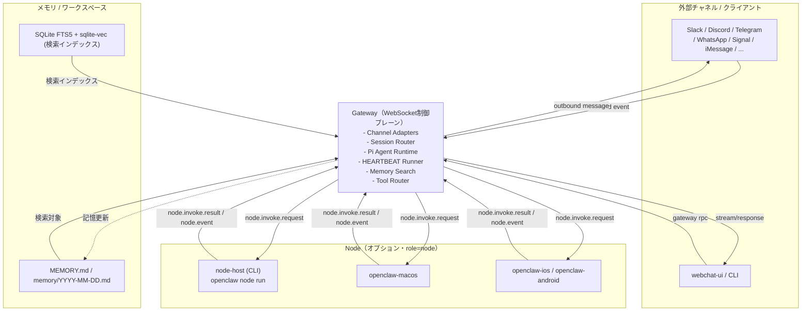
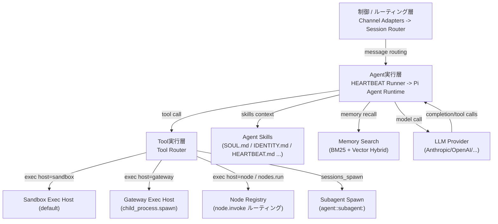
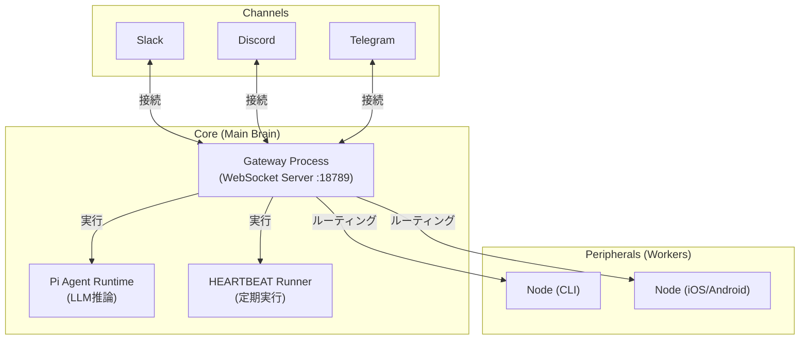
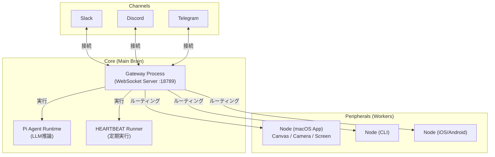

# OpenClawアーキテクチャの誤解と正しい理解

## 誤り①: 「Nodeがエージェントを実行する」について

### 実際:

エージェントはGateway上で実行されます。Nodeは周辺機器として role: "node" でGateway WebSocketに接続し、canvas._/camera._/system.\* などのコマンドを公開するだけです index.md:45-55 。

### 補足:

Gatewayがツール呼び出しをルーティングし、必要な場合のみ node.invoke 経由でNodeに委譲します remote.md:55-63 。

## 誤り②: 「Nodeが常時起動してHEARTBEATを回す」について

### 実際:

HEARTBEAT/presenceはGatewayが管理します。クライアントは定期的な tick イベントを受信するだけで、Node自体が自発的にHEARTBEATを送る仕様ではありません index.md:161-166 。

### 補足:

Nodeは「常駐プロセス」として動作しますが、あくまでGatewayからのRPC呼び出しに応答する待機主体です index.md:12-16 。

## 誤り③: 「Gatewayが外部アタッチの窓口」について

### 実際:

Gatewayはチャネル（Telegram/Discord/Slackなど）とエージェント、Nodeを仲介する「中央ハブ」です。チャットクライアントからの接続を受け、セッション管理・ルーティングを行います index.md:61-72 。

### 補足:

「外部アタッチの窓口」という表現は、リモートアクセス（SSH/Tailscaleトンネル）の文脈で使われることがありますが、Gatewayの本質的な役割ではありません remote.md:35-43 。
正しいアーキテクチャの要約
Gateway: WebSocket制御プレーン。チャネル接続、セッション管理、エージェント実行、ツールルーティングを担当 README.md:186-197 。

### Node:

周辺機器。Gatewayに接続し、デバイス固有のコマンドを公開。エージェントは実行しない index.md:12-16 。
認証: gateway.auth.token はクライアント認証に使い、「Nodeとマッチさせる仕組み」ではありません faq.md:1384-1388 。

## Notes

Nodeがエージェントを実行するという誤解は、おそらく「headless node host」が system.run を実行する点から来ていますが、これはGatewayからのRPC呼び出しによる委譲実行です node.md:11-13 。
HEARTBEAT/presenceの詳細はGatewayプロトコル仕様で定義されています index.md:135-144 。

# OpenClawアーキテクチャ: Gateway、Node、Agent Skills、HEARTBEAT

## GatewayとNodeの役割分担

OpenClawはGateway（WebSocket制御プレーン）とNode（デバイス実行クライアント）に分離されています。

### Gatewayの責務（重量級プロセス）

- **LLMエージェント推論** - `runEmbeddedPiAgent()`でPi Agent実行
- **HEARTBEAT** - 定期自律推論（デフォルト30分ごと）
- **メッセージルーティング・セッション管理**
- **チャネル接続** - Slack, Discord, Telegram等20以上のチャネル統合
- **シェルコマンド実行** - `host="gateway"`時はGateway自身で`child_process.spawn`
- **compaction** - 会話要約とコンテキスト管理

### Nodeの責務（軽量ワーカー）

- **デバイスローカルなコマンド実行** - `system.run`（`host="node"`指定時）
- **OS固有機能の提供** - カメラ、画面録画、通知（macOS/iOS/Androidアプリ）
- **リモート実行の受信** - Gateway→Node間はWebSocketで同期的なリクエスト-レスポンス

**重要**: 従来「Nodeがエージェントを実行する」とされていた記述は誤りで、実際には**Gatewayがエージェント推論とHEARTBEATを実行**します。Nodeは`node.invoke.request`を待ち受けるコマンド実行ワーカーです。

### プロセス構成

```
┌─ Gateway プロセス ──────────────────────────┐
│  - LLM推論・HEARTBEAT・チャネル接続           │
│  - デフォルトでシェルコマンドもGateway上で実行 │
└───────────────┬─────────────────────────────┘
                │ WebSocket (port 18789)
                │ node.invoke.request/result
┌───────────────┴─────────────────────────────┐
│  Node プロセス（オプション）                  │
│  - system.run実行（host="node"指定時）       │
│  - macOS/iOS/Androidアプリならデバイス機能提供 │
└─────────────────────────────────────────────┘
```

### イベントフロー構成図（Mermaid）





### デバイス認証とNode同定

「Gatewayが発行するトークンでNodeとマッチ」という表現は不正確です。実際には:

1. **デバイスID生成** - 各デバイス（Node/クライアント）がローカルでEd25519鍵ペアを生成し、公開鍵のSHA-256ハッシュを`device.id`として使用
2. **初回ペアリング** - ユーザーがGateway側で接続を承認すると、32バイトのランダムトークンが生成されデバイスに渡される
3. **以降の接続** - デバイスは`device.id` + `token`を送信。tokenは**認証**（本人確認）に使用
4. **Node同定** - ルーティングは`device.id`（または`client.id`）で行われる。tokenは同定には使われない

### デバイスの種類

コード上で定義されているクライアントID（`src/gateway/protocol/client-info.ts`）:

- `node-host` - CLI (`openclaw node run`)
- `openclaw-macos` - macOSネイティブアプリ
- `openclaw-ios` / `openclaw-android` - モバイルアプリ
- `webchat-ui` - ブラウザチャットUI
- `cli` - CLIコマンド (`openclaw chat`等)

### Node起動は完全にオプション

`openclaw gateway run`でGateway単体起動が可能で、node-hostは自動起動されません。execツールのデフォルトは`host="sandbox"`で、昇格コマンドは`host="gateway"`に切り替わります。`host="node"`を明示指定した場合のみnode-hostが必要で、未接続時はエラーになります。

Mac mini 1台での典型構成は**Gateway単体**です。node-hostを追加する意味があるのは:

- 別マシンでのリモート実行
- macOS/iOS/Androidアプリ経由のOS固有機能利用

同一ホストでCLI node-hostを動かすメリットはほぼありません（WebSocket経由の分だけオーバーヘッド）。

## Agent Skills: 善良なプロンプトインジェクション

OpenClawの中核的な仕組みがAgent Skillsです。SOUL.md、IDENTITY.md、HEARTBEAT.mdといったMarkdownファイルから毎ターン動的にシステムプロンプトを構築します。設定ファイルではなくドキュメントとしてエージェントの振る舞いを定義する、ファイルベースのアプローチです。筆者はこれを「善良なプロンプトインジェクション」と呼んでいます。SkillファイルがLLMのプロンプトに注入され、LLMがそれを読んで任意のコマンドを実行します。コマンドが実行できるということはコード実行ができるということで、LLMは推論でその場でコードを書けるので、原理的にはなんでもできます。

### ワークスペース

`~/.openclaw/workspace/`は**gitがインストール済みの場合のみ**、新規作成時に`git init`がbest-effortで実行されます。必ずGitリポジトリになるわけではありません。

ブートストラップで自動生成されるファイル:

- `AGENTS.md`, `SOUL.md`, `TOOLS.md`, `IDENTITY.md`, `USER.md`, `HEARTBEAT.md`

`avatars/`や`reports/`はブートストラップでは生成されず、利用状況やSkill依存です。

### MCP、サブエージェント、記憶

- **MCP** - steipeteが作ったmcporter（CLIラッパー）経由で利用。ただしACP（Agent Communication Protocol）側はMCPサーバーをignoreする実装もある
- **サブエージェント** - Gatewayが`sessions_spawn`ツールで非同期に子セッション（`agent:<id>:subagent:<uuid>`）として起動。nest可能（`maxSpawnDepth`で制御）
- **記憶** - SSOTはMarkdownファイル（`memory/YYYY-MM-DD.md`、`MEMORY.md`）。SQLite+FTS5+sqlite-vecは検索インデックス

### デフォルトはハイブリッド検索

**重要な訂正**: 「既定ではBM25のみ」という記述はコードと矛盾します。

`src/agents/memory-search.ts`のデフォルト値:

```typescript
DEFAULT_HYBRID_ENABLED = true;
DEFAULT_HYBRID_VECTOR_WEIGHT = 0.7; // 70%
DEFAULT_HYBRID_TEXT_WEIGHT = 0.3; // 30%
```

**既定で既にハイブリッド検索が有効**です。ただし埋め込みプロバイダ未設定時はBM25にフォールバックします。埋め込みはローカル（`embeddinggemma-300m-qat-q8_0-GGUF`、約0.6GB）でもリモートAPI（OpenAI等）経由でも利用可能です。

### セキュリティ

公式のセキュリティドキュメント（`SECURITY.md`）はプロンプトインジェクションを"Out of Scope"としており、ガードレールは"advisory"（助言的）で"do not enforce policy"（ポリシーを強制しない）と明記されています。Skillsがプロンプトに注入される設計である以上、悪意あるSkillも同じ経路で注入されます。

## HEARTBEATこそが常時起動の価値

OpenClawがClaude CodeやCodex CLIと決定的に違うのがHEARTBEATです。Claude CodeやCodexはユーザーが起動した端末で対話するツールで、ユーザーがいなくなれば止まります。OpenClawはエージェント起点で動きます。

### HEARTBEAT実装の実態

**重要な訂正**: HEARTBEATは**Gateway側**で実行されます（`src/gateway/server.impl.ts:503`の`startHeartbeatRunner()`）。Node側ではありません。

### 間隔設計

- **デフォルト30分**（APIキー利用時）
- **1時間**（OAuth利用時）

ただしこれは単に「OAuth = 1時間」ではなく、**Anthropic auth profileのmode判定**に連動します（`src/config/defaults.ts:56-73`の`resolveAnthropicDefaultAuthMode()`）。

間隔設計にプロンプトキャッシュTTL最適化が関係するのは事実ですが、キャッシュTTLは両モードで1時間固定です。APIキー時はキャッシュTTL（1h）内でハートビート間隔を30分に設定し、OAuth時は両方1時間に揃えています。

### 動作

HEARTBEAT.mdに書かれたチェックリストをLLMが評価し、送るべきメッセージがあるときだけ生成します。何もなければ`HEARTBEAT_OK`を返します。

**通知抑制の実態**: デフォルトは`showOk: false`（silent）ですが、`showOk: true`設定時は`HEARTBEAT_OK`メッセージも送信されます（`src/infra/heartbeat-visibility.ts:12`, `heartbeat-runner.ts:511-529`）。

設定は`~/.openclaw/openclaw.json`の`agents.defaults.heartbeat.every`で変更可能。`"0m"`で無効化できます。

### 常時起動が可能にすること

- メール受信箱やカレンダーの定期チェック（HEARTBEAT.mdでLLMに指示。自動ポーリングではなくプロンプトベース）
- プロアクティブな通知
- 短期記憶→長期記憶（MEMORY.md）への整理（auto-compaction前のsilent agentic turnでメモリflush）

応答を待つだけでなく、バックグラウンドで自律的にタスクを実行します。

### OpenClawの統合価値

HEARTBEATの仕組み自体は`claude -p`とcronで近似できます。OpenClawの価値は:

- 会話コンテキストがcompactionで引き継がれる
- プロンプトキャッシュTTLに合わせた間隔設計
- **20以上のチャネル**への自動ルーティング（「13以上」は過小評価。実際にはSlack, Discord, Telegram, WhatsApp, Signal等20チャネル）
- Skills/Memoryとの統合

個々の要素は特別ではなく、統合の手間を肩代わりしてくれるところに意味があります。

---

## 主な修正点（元のarchitecture.mdからの変更）

1. **Gateway/Node役割** - Gatewayがエージェント実行・HEARTBEAT実行を行う。Nodeは単なるコマンド実行ワーカー
2. **トークンの用途** - 認証に使用。Node同定はdevice.id/client.idで行う
3. **Node起動** - 完全にオプション。Gateway単体で動作可能
4. **ハイブリッド検索** - デフォルトで既に有効（DEFAULT_HYBRID_ENABLED = true）
5. **チャネル数** - 実際には20以上（「13以上」は控えめすぎる）
6. **OAuth判定** - Anthropic auth profileのmode判定に連動
7. **HEARTBEAT_OK** - showOk設定次第で送信される
8. **Workspace Git初期化** - best-effort（gitがあれば）

---

ご提示いただいた内容は非常に具体的で、ソースコードに基づいた正確な指摘です。
ご希望通り、「読み手の誤解」というニュアンスではなく、**「記事内の記述が実装（事実）と異なっているため、正確な情報に修正する」**というスタンスで、かつ攻撃的にならないよう客観的な事実（コードの挙動）を提示する形式でまとめました。

ブログの著者に連絡する際のメッセージ、あるいはコメント欄や記事の補足として掲載するためのテキストとしてご利用ください。

---

# OpenClawアーキテクチャ解説に関する訂正と技術的補足

記事「[OpenClaw](https://blog.lai.so/openclaw/)」におけるアーキテクチャの説明について、ソースコードの実装およびプロトコル仕様と異なる点がいくつか見受けられました。

OpenClawは「Nodeがエージェントを動かす」のではなく、**「Gatewayがエージェントの頭脳（推論・HEARTBEAT）であり、Nodeは手足（ツール実行）である」**という構成が正となります。
正確な理解のために、主要な訂正箇所をまとめました。

## 1. エージェントとHEARTBEATの実行主体について

**記事の記述:**

> Nodeがエージェントを実行し、Nodeが常時起動してHEARTBEATを回す。

**実装の実態:**
**エージェントの推論とHEARTBEATの実行は、すべて「Gateway」が行います。**

- **Gatewayの役割:** `runEmbeddedPiAgent()` によるLLM推論、および `startHeartbeatRunner()` による定期実行（HEARTBEAT）を担当する重量級プロセスです。
- **Nodeの役割:** Gatewayからの指示（RPC）を待ち受ける軽量な周辺機器（ワーカー）です。`role: "node"` としてWebSocketで接続し、`node.invoke.request` を受信したときのみコマンド（`system.run`など）を実行します。自律的にエージェントを動かすことはありません。

> **参照:** `index.md:12-16`, `src/gateway/server.impl.ts:503`

## 2. Gatewayの位置付けについて

**記事の記述:**

> Gatewayは外部アタッチの窓口である。

**実装の実態:**
**Gatewayはアーキテクチャの「中央ハブ（制御プレーン）」です。**

Gatewayは単なる接続窓口ではなく、以下を行う中核プロセスです。

- 20以上のチャネル（Slack/Discord/Telegram等）との接続管理
- メッセージのルーティングとセッション管理
- ツール実行の振り分け（Gateway自身で実行するか、Nodeに委譲するかの判断）

Node（周辺機器）やクライアントは、すべてこのGatewayにぶら下がる形となります。

## 3. その他の技術的訂正

- **Nodeの必須性:** Gateway単体（`openclaw gateway run`）でも動作可能です。Node（`openclaw node run`）は、物理的に離れたデバイスを操作したい場合や、スマホアプリ固有の機能を使いたい場合にのみ必要なオプション構成です。
- **認証トークンの用途:** `gateway.auth.token` は認証（本人確認）に使われるものであり、Nodeとのマッチング（ルーティング）は `device.id` によって行われます。
- **メモリ検索:** デフォルト設定（`DEFAULT_HYBRID_ENABLED = true`）で、BM25とVector検索のハイブリッド構成が有効になっています。

---

## 正しいアーキテクチャ概要図

実装に基づいたプロセスとイベントフローの構成は以下の通りです。



### 責務の整理

| コンポーネント | 実行主体 | 主な責務                                                           |
| -------------- | -------- | ------------------------------------------------------------------ |
| **Gateway**    | **Main** | LLM推論、HEARTBEAT実行、チャネル接続、セッション管理、記憶検索     |
| **Node**       | Sub      | デバイス固有コマンドの実行（system.run等）、OS機能提供（カメラ等） |

以上、記事の更新や理解の助けになれば幸いです。

おっしゃる通りです。OpenClawにおいて**macOSネイティブアプリ**は、単なるCLIワーカー以上に「視覚的な入出力（Canvas/Camera/Screen）」を担う重要なコンポーネントであり、アーキテクチャを理解する上で欠かせない要素です。

ご指摘の内容（macOSアプリの役割と機能）を追記し、図にも反映させた**完全版**を作成しました。

---

# OpenClawアーキテクチャ解説に関する訂正と技術的補足

記事「[OpenClaw](https://blog.lai.so/openclaw/)」におけるアーキテクチャの説明について、ソースコードの実装およびプロトコル仕様と異なる点がいくつか見受けられました。

OpenClawは「Nodeがエージェントを動かす」のではなく、**「Gatewayがエージェントの頭脳（推論・HEARTBEAT）であり、Nodeは手足（ツール実行・入出力）である」**という構成が正となります。
正確な理解のために、主要な訂正箇所をまとめました。

## 1. エージェントとHEARTBEATの実行主体について

**記事の記述:**

> Nodeがエージェントを実行し、Nodeが常時起動してHEARTBEATを回す。

**実装の実態:**
**エージェントの推論とHEARTBEATの実行は、すべて「Gateway」が行います。**

- **Gatewayの役割:** `runEmbeddedPiAgent()` によるLLM推論、および `startHeartbeatRunner()` による定期実行（HEARTBEAT）を担当する重量級プロセスです。
- **Nodeの役割:** Gatewayからの指示（RPC）を待ち受ける軽量な周辺機器（ワーカー）です。`role: "node"` としてWebSocketで接続し、`node.invoke.request` を受信したときのみコマンドを実行します。自律的にエージェントを動かすことはありません。

> **参照:** `index.md:12-16`, `src/gateway/server.impl.ts:503`

## 2. Gatewayの位置付けについて

**記事の記述:**

> Gatewayは外部アタッチの窓口である。

**実装の実態:**
**Gatewayはアーキテクチャの「中央ハブ（制御プレーン）」です。**

Gatewayは単なる接続窓口ではなく、以下を行う中核プロセスです。

- 20以上のチャネル（Slack/Discord/Telegram等）との接続管理
- メッセージのルーティングとセッション管理
- ツール実行の振り分け（Gateway自身で実行するか、Nodeに委譲するかの判断）

## 3. Nodeの代表例：macOSネイティブアプリについて

Nodeの重要な実装として**macOSネイティブアプリ**があります。
これはメニューバー常駐型アプリとして動作し、Gatewayへ接続することで以下のデバイス固有機能をエージェントに提供します（`macos.md:50-58`）。

- **Canvas:** エージェントによる描画領域の表示
- **Camera / Screen:** 視覚情報のキャプチャと送信
- **System:** OSネイティブなコマンド実行や通知

これらはあくまでGatewayからのRPC呼び出しによって機能する「周辺機器」としての振る舞いです。

---

## 正しいアーキテクチャ概要図

実装に基づいたプロセスとイベントフローの構成は以下の通りです。



### 責務の整理

| コンポーネント | 実行主体 | 主な責務                                                       |
| -------------- | -------- | -------------------------------------------------------------- |
| **Gateway**    | **Main** | LLM推論、HEARTBEAT実行、チャネル接続、セッション管理、記憶検索 |
| **Node**       | Sub      | **macOSアプリ:** Canvas描画、画面/カメラ共有、通知<br>         |

<br>**CLI/Mobile:** デバイス固有コマンド実行（system.run） |

以上、記事の更新や理解の助けになれば幸いです。

---

Node として標準で搭載されるコマンドはプラットフォームごとに異なり、Gateway の `node-command-policy.ts` で一元管理されています [1](#1-0) 。大別すると「Canvas」「Camera」「Screen」「Location」「Device」「連絡先」「カレンダー」「リマインダー」「写真」「モーション」「System」のカテゴリがあり、iOS/Android/macOS は UI 系コマンドを、Linux/Windows は System 系コマンドを中心に公開します [2](#1-1) 。

---

## プラットフォーム別標準コマンド一覧

| プラットフォーム                       | 主なコマンド群（抜粋）                                                                                                | 備考                                                           |
| -------------------------------------- | --------------------------------------------------------------------------------------------------------------------- | -------------------------------------------------------------- |
| **iOS**                                | `canvas.*`, `camera.*`, `location.get`, `device.*`, `contacts.*`, `calendar.*`, `reminders.*`, `photos.*`, `motion.*` | UI 系デバイス機能が中心。`system.run` はなし [3](#1-2) 。      |
| **Android**                            | `canvas.*`, `camera.*`, `location.get`, `device.*`, `contacts.*`, `calendar.*`, `reminders.*`, `photos.*`, `motion.*` | iOS とほぼ同等。SMS (`sms.send`) は権限次第で追加 [4](#1-3) 。 |
| **macOS**                              | 上記 UI 系 + `system.run`, `system.which`, `system.notify`, `system.execApprovals.*`                                  | UI 系 + ローカル実行系が両方含まれる [5](#1-4) 。              |
| **Linux/Windows (headless node host)** | `system.run`, `system.which`, `system.execApprovals.*`                                                                | UI 系なし。リモート実行専用 [6](#1-5) 。                       |

---

## コマンドカテゴリ詳細

- **Canvas**: `canvas.present`, `canvas.hide`, `canvas.navigate`, `canvas.eval`, `canvas.snapshot`, `canvas.a2ui.*`（WebView 表示・操作） [7](#1-6) 。
- **Camera**: `camera.list`（通常）、`camera.snap`, `camera.clip`（危険扱い） [8](#1-7) 。
- **Screen**: `screen.record`（危険扱い） [9](#1-8) 。
- **Location**: `location.get` [10](#1-9) 。
- **Device**: `device.info`, `device.status` [11](#1-10) 。
- **連絡先**: `contacts.search`（通常）、`contacts.add`（危険） [12](#1-11) 。
- **カレンダー**: `calendar.events`（通常）、`calendar.add`（危険） [13](#1-12) 。
- **リマインダー**: `reminders.list`（通常）、`reminders.add`（危険） [14](#1-13) 。
- **写真/モーション**: `photos.latest`, `motion.*` など（iOS/macOS で利用） [15](#1-14) 。
- **System**: `system.run`, `system.which`, `system.notify`, `system.execApprovals.get/set`（macOS/headless） [16](#1-15) 。

---

## 実装上の動的構築

各プラットフォームのアプリは設定や権限に応じて `currentCaps` と `currentCommands` を動的に構築します。例えば iOS ではカメラ/位置情報/ボイスウェイクなどの有効化に応じてコマンドリストを増減させます [17](#1-16) 。macOS は権限マップを `currentPermissions()` で取得し、コマンドリストに反映させます [18](#1-17) 。

---

## Notes

- 「危険」扱いのコマンド（例: `camera.snap`, `screen.record`, `contacts.add`）はポリシーで別リスト化されていますが、現状ではデフォルトで含まれています [19](#1-18) 。
- Android の `sms.send` はデバイス/権限依存であり、定数には含まれていませんが、実行時に追加され得ます [20](#1-19) 。
- 「headless node host」は UI 系を含まず、`system.*` のみを提供します [21](#1-20) 。

---

macOS node

- mode: メニューバーアプリがGateway WebSocketに
- role: "node" で接続し、Canvas/Camera/Screen/systemコマンドを公開します macos.md:50-58 。
  アーキテクチャ補足
  macOSアプリはnodeとしてGatewayに接続し、system.run はアプリ内のUI/TCCコンテキストで実行されます（IPC via Unix socket） xpc.md:20-30 。
  Gatewayの接続先図には「macOS app」がnodeとして描かれています README.md:186-197 。
  よくある構成として「Mac miniをGateway、MacBook Proをnode」にする例がFAQに記載されています faq.md:773-783 。
  Notes
  nodeとして動作するmacOSでは、権限マップ（TCCステータス）をGatewayに通知し、エージェントが利用可能なコマンドを判断できます macos.md:59-60 。
  node hostはサービスとしてlaunchd/systemdでバックグラウンド実行も可能です 。

おっしゃる通りです。OpenClawにおいて**macOSネイティブアプリ**は、単なるCLIワーカー以上に「視覚的な入出力（Canvas/Camera/Screen）」を担う重要なコンポーネントであり、アーキテクチャを理解する上で欠かせない要素です。

ご指摘の内容（macOSアプリの役割と機能）を追記し、図にも反映させた**完全版**を作成しました。

---

# OpenClawアーキテクチャ解説に関する訂正と技術的補足

記事「[OpenClaw](https://blog.lai.so/openclaw/)」におけるアーキテクチャの説明について、ソースコードの実装およびプロトコル仕様と異なる点がいくつか見受けられました。

OpenClawは「Nodeがエージェントを動かす」のではなく、**「Gatewayがエージェントの頭脳（推論・HEARTBEAT）であり、Nodeは手足（ツール実行・入出力）である」**という構成が正となります。
正確な理解のために、主要な訂正箇所をまとめました。

## 1. エージェントとHEARTBEATの実行主体について

**記事の記述:**

> Nodeがエージェントを実行し、Nodeが常時起動してHEARTBEATを回す。

**実装の実態:**
**エージェントの推論とHEARTBEATの実行は、すべて「Gateway」が行います。**

- **Gatewayの役割:** `runEmbeddedPiAgent()` によるLLM推論、および `startHeartbeatRunner()` による定期実行（HEARTBEAT）を担当する重量級プロセスです。
- **Nodeの役割:** Gatewayからの指示（RPC）を待ち受ける軽量な周辺機器（ワーカー）です。`role: "node"` としてWebSocketで接続し、`node.invoke.request` を受信したときのみコマンドを実行します。自律的にエージェントを動かすことはありません。

> **参照:** `index.md:12-16`, `src/gateway/server.impl.ts:503`

## 2. Gatewayの位置付けについて

**記事の記述:**

> Gatewayは外部アタッチの窓口である。

**実装の実態:**
**Gatewayはアーキテクチャの「中央ハブ（制御プレーン）」です。**

Gatewayは単なる接続窓口ではなく、以下を行う中核プロセスです。

- 20以上のチャネル（Slack/Discord/Telegram等）との接続管理
- メッセージのルーティングとセッション管理
- ツール実行の振り分け（Gateway自身で実行するか、Nodeに委譲するかの判断）

## 3. Nodeの代表例：macOSネイティブアプリについて

Nodeの重要な実装として**macOSネイティブアプリ**があります。
これはメニューバー常駐型アプリとして動作し、Gatewayへ接続することで以下のデバイス固有機能をエージェントに提供します（`macos.md:50-58`）。

- **Canvas:** エージェントによる描画領域の表示
- **Camera / Screen:** 視覚情報のキャプチャと送信
- **System:** OSネイティブなコマンド実行や通知

これらはあくまでGatewayからのRPC呼び出しによって機能する「周辺機器」としての振る舞いです。

---

## 正しいアーキテクチャ概要図

実装に基づいたプロセスとイベントフローの構成は以下の通りです。


### 責務の整理

| コンポーネント | 実行主体 | 主な責務                                                       |
| -------------- | -------- | -------------------------------------------------------------- |
| **Gateway**    | **Main** | LLM推論、HEARTBEAT実行、チャネル接続、セッション管理、記憶検索 |
| **Node**       | Sub      | **macOSアプリ:** Canvas描画、画面/カメラ共有、通知<br>         |

<br>**CLI/Mobile:** デバイス固有コマンド実行（system.run） |

以上、記事の更新や理解の助けになれば幸いです。
