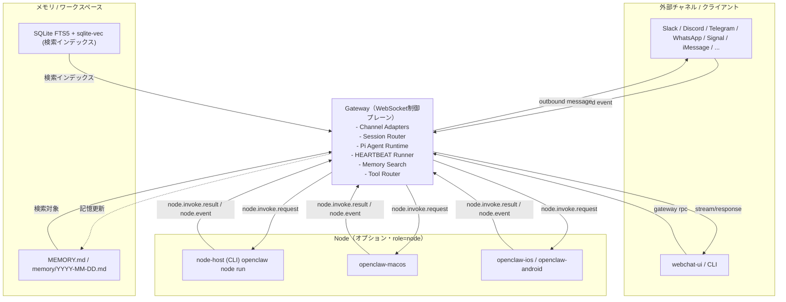
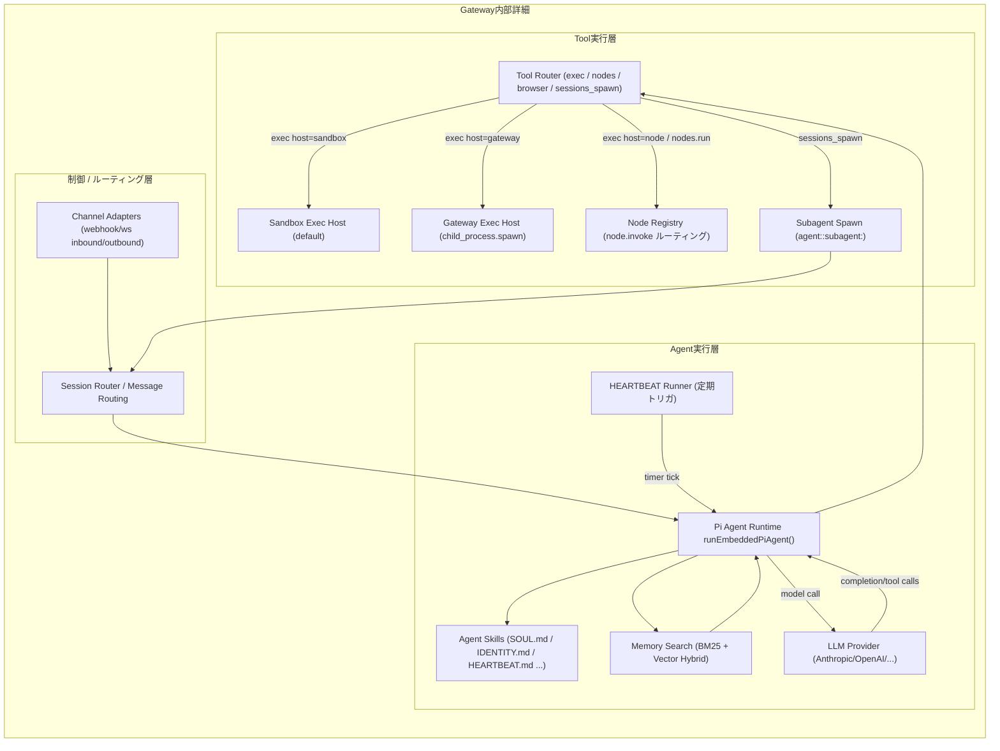

# OpenClawアーキテクチャ: Gateway、Node、Agent Skills、HEARTBEAT

## GatewayとNodeの役割分担

OpenClawはGateway（WebSocket制御プレーン）とNode（デバイス実行クライアント）に分離されています。

### Gatewayの責務（重量級プロセス）

- **LLMエージェント推論** - `runEmbeddedPiAgent()`でPi Agent実行
- **HEARTBEAT** - 定期自律推論（デフォルト30分ごと）
- **メッセージルーティング・セッション管理**
- **チャネル接続** - Slack, Discord, Telegram等20以上のチャネル統合
- **シェルコマンド実行** - `host="gateway"`時はGateway自身で`child_process.spawn`
- **compaction** - 会話要約とコンテキスト管理

### Nodeの責務（軽量ワーカー）

- **デバイスローカルなコマンド実行** - `system.run`（`host="node"`指定時）
- **OS固有機能の提供** - カメラ、画面録画、通知（macOS/iOS/Androidアプリ）
- **リモート実行の受信** - Gateway→Node間はWebSocketで同期的なリクエスト-レスポンス

**重要**: 従来「Nodeがエージェントを実行する」とされていた記述は誤りで、実際には**Gatewayがエージェント推論とHEARTBEATを実行**します。Nodeは`node.invoke.request`を待ち受けるコマンド実行ワーカーです。

### プロセス構成

```
┌─ Gateway プロセス ──────────────────────────┐
│  - LLM推論・HEARTBEAT・チャネル接続           │
│  - デフォルトでシェルコマンドもGateway上で実行 │
└───────────────┬─────────────────────────────┘
                │ WebSocket (port 18789)
                │ node.invoke.request/result
┌───────────────┴─────────────────────────────┐
│  Node プロセス（オプション）                  │
│  - system.run実行（host="node"指定時）       │
│  - macOS/iOS/Androidアプリならデバイス機能提供 │
└─────────────────────────────────────────────┘
```

### イベントフロー構成図（Mermaid）





### デバイス認証とNode同定

「Gatewayが発行するトークンでNodeとマッチ」という表現は不正確です。実際には:

1. **デバイスID生成** - 各デバイス（Node/クライアント）がローカルでEd25519鍵ペアを生成し、公開鍵のSHA-256ハッシュを`device.id`として使用
2. **初回ペアリング** - ユーザーがGateway側で接続を承認すると、32バイトのランダムトークンが生成されデバイスに渡される
3. **以降の接続** - デバイスは`device.id` + `token`を送信。tokenは**認証**（本人確認）に使用
4. **Node同定** - ルーティングは`device.id`（または`client.id`）で行われる。tokenは同定には使われない

### デバイスの種類

コード上で定義されているクライアントID（`src/gateway/protocol/client-info.ts`）:

- `node-host` - CLI (`openclaw node run`)
- `openclaw-macos` - macOSネイティブアプリ
- `openclaw-ios` / `openclaw-android` - モバイルアプリ
- `webchat-ui` - ブラウザチャットUI
- `cli` - CLIコマンド (`openclaw chat`等)

### Node起動は完全にオプション

`openclaw gateway run`でGateway単体起動が可能で、node-hostは自動起動されません。execツールのデフォルトは`host="sandbox"`で、昇格コマンドは`host="gateway"`に切り替わります。`host="node"`を明示指定した場合のみnode-hostが必要で、未接続時はエラーになります。

Mac mini 1台での典型構成は**Gateway単体**です。node-hostを追加する意味があるのは:

- 別マシンでのリモート実行
- macOS/iOS/Androidアプリ経由のOS固有機能利用

同一ホストでCLI node-hostを動かすメリットはほぼありません（WebSocket経由の分だけオーバーヘッド）。

## Agent Skills: 善良なプロンプトインジェクション

OpenClawの中核的な仕組みがAgent Skillsです。SOUL.md、IDENTITY.md、HEARTBEAT.mdといったMarkdownファイルから毎ターン動的にシステムプロンプトを構築します。設定ファイルではなくドキュメントとしてエージェントの振る舞いを定義する、ファイルベースのアプローチです。筆者はこれを「善良なプロンプトインジェクション」と呼んでいます。SkillファイルがLLMのプロンプトに注入され、LLMがそれを読んで任意のコマンドを実行します。コマンドが実行できるということはコード実行ができるということで、LLMは推論でその場でコードを書けるので、原理的にはなんでもできます。

### ワークスペース

`~/.openclaw/workspace/`は**gitがインストール済みの場合のみ**、新規作成時に`git init`がbest-effortで実行されます。必ずGitリポジトリになるわけではありません。

ブートストラップで自動生成されるファイル:

- `AGENTS.md`, `SOUL.md`, `TOOLS.md`, `IDENTITY.md`, `USER.md`, `HEARTBEAT.md`

`avatars/`や`reports/`はブートストラップでは生成されず、利用状況やSkill依存です。

### MCP、サブエージェント、記憶

- **MCP** - steipeteが作ったmcporter（CLIラッパー）経由で利用。ただしACP（Agent Communication Protocol）側はMCPサーバーをignoreする実装もある
- **サブエージェント** - Gatewayが`sessions_spawn`ツールで非同期に子セッション（`agent:<id>:subagent:<uuid>`）として起動。nest可能（`maxSpawnDepth`で制御）
- **記憶** - SSOTはMarkdownファイル（`memory/YYYY-MM-DD.md`、`MEMORY.md`）。SQLite+FTS5+sqlite-vecは検索インデックス

### デフォルトはハイブリッド検索

**重要な訂正**: 「既定ではBM25のみ」という記述はコードと矛盾します。

`src/agents/memory-search.ts`のデフォルト値:

```typescript
DEFAULT_HYBRID_ENABLED = true
DEFAULT_HYBRID_VECTOR_WEIGHT = 0.7  // 70%
DEFAULT_HYBRID_TEXT_WEIGHT = 0.3    // 30%
```

**既定で既にハイブリッド検索が有効**です。ただし埋め込みプロバイダ未設定時はBM25にフォールバックします。埋め込みはローカル（`embeddinggemma-300m-qat-q8_0-GGUF`、約0.6GB）でもリモートAPI（OpenAI等）経由でも利用可能です。

### セキュリティ

公式のセキュリティドキュメント（`SECURITY.md`）はプロンプトインジェクションを"Out of Scope"としており、ガードレールは"advisory"（助言的）で"do not enforce policy"（ポリシーを強制しない）と明記されています。Skillsがプロンプトに注入される設計である以上、悪意あるSkillも同じ経路で注入されます。

## HEARTBEATこそが常時起動の価値

OpenClawがClaude CodeやCodex CLIと決定的に違うのがHEARTBEATです。Claude CodeやCodexはユーザーが起動した端末で対話するツールで、ユーザーがいなくなれば止まります。OpenClawはエージェント起点で動きます。

### HEARTBEAT実装の実態

**重要な訂正**: HEARTBEATは**Gateway側**で実行されます（`src/gateway/server.impl.ts:503`の`startHeartbeatRunner()`）。Node側ではありません。

### 間隔設計

- **デフォルト30分**（APIキー利用時）
- **1時間**（OAuth利用時）

ただしこれは単に「OAuth = 1時間」ではなく、**Anthropic auth profileのmode判定**に連動します（`src/config/defaults.ts:56-73`の`resolveAnthropicDefaultAuthMode()`）。

間隔設計にプロンプトキャッシュTTL最適化が関係するのは事実ですが、キャッシュTTLは両モードで1時間固定です。APIキー時はキャッシュTTL（1h）内でハートビート間隔を30分に設定し、OAuth時は両方1時間に揃えています。

### 動作

HEARTBEAT.mdに書かれたチェックリストをLLMが評価し、送るべきメッセージがあるときだけ生成します。何もなければ`HEARTBEAT_OK`を返します。

**通知抑制の実態**: デフォルトは`showOk: false`（silent）ですが、`showOk: true`設定時は`HEARTBEAT_OK`メッセージも送信されます（`src/infra/heartbeat-visibility.ts:12`, `heartbeat-runner.ts:511-529`）。

設定は`~/.openclaw/openclaw.json`の`agents.defaults.heartbeat.every`で変更可能。`"0m"`で無効化できます。

### 常時起動が可能にすること

- メール受信箱やカレンダーの定期チェック（HEARTBEAT.mdでLLMに指示。自動ポーリングではなくプロンプトベース）
- プロアクティブな通知
- 短期記憶→長期記憶（MEMORY.md）への整理（auto-compaction前のsilent agentic turnでメモリflush）

応答を待つだけでなく、バックグラウンドで自律的にタスクを実行します。

### OpenClawの統合価値

HEARTBEATの仕組み自体は`claude -p`とcronで近似できます。OpenClawの価値は:

- 会話コンテキストがcompactionで引き継がれる
- プロンプトキャッシュTTLに合わせた間隔設計
- **20以上のチャネル**への自動ルーティング（「13以上」は過小評価。実際にはSlack, Discord, Telegram, WhatsApp, Signal等20チャネル）
- Skills/Memoryとの統合

個々の要素は特別ではなく、統合の手間を肩代わりしてくれるところに意味があります。

---

## 主な修正点（元のarchitecture.mdからの変更）

1. **Gateway/Node役割** - Gatewayがエージェント実行・HEARTBEAT実行を行う。Nodeは単なるコマンド実行ワーカー
2. **トークンの用途** - 認証に使用。Node同定はdevice.id/client.idで行う
3. **Node起動** - 完全にオプション。Gateway単体で動作可能
4. **ハイブリッド検索** - デフォルトで既に有効（DEFAULT_HYBRID_ENABLED = true）
5. **チャネル数** - 実際には20以上（「13以上」は控えめすぎる）
6. **OAuth判定** - Anthropic auth profileのmode判定に連動
7. **HEARTBEAT_OK** - showOk設定次第で送信される
8. **Workspace Git初期化** - best-effort（gitがあれば）
