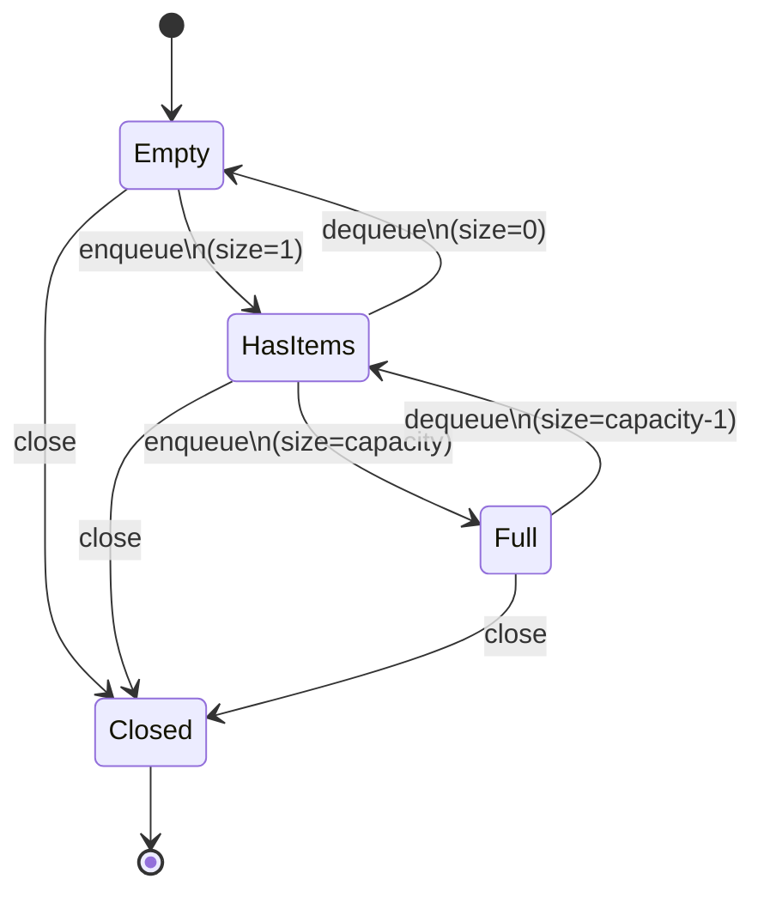
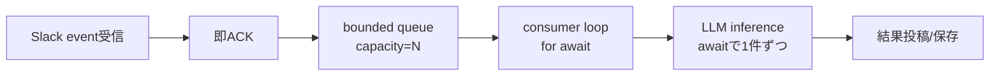

* **bounded queue（有界キュー）**は「**最大件数（capacity）**を決めたキュー」で、流入が処理能力を超えたときに**メモリ無限増加を防ぐ安全装置**です。
* 重要なのは「満杯になったらどうするか」を**明文化**することです（例: 捨てる、待たせる、永続化へ退避、畳み込む）。
* Node.js の I/O 並行パイプライン（Slack→LLM推論）では、**即ACK→enqueue→単一consumerで順次処理**にすると安定します。
* 下図の Mermaid（`mermaid`）で、**enqueue/dequeue のフロー**と**状態遷移**を押さえると実装ミスが減ります。

---

## bounded queue — 定義と目的

### 定義

**bounded queue（有界キュー）**

* **FIFO（先入れ先出し）**の待ち行列で、**最大格納数 `capacity` が固定**されているもの。
* 常に **`0 <= size <= capacity`** を守る（これが“安全性”の核心）。

### 目的

* 生産側（producer: 例 Slack受信）が一時的に速くても、消費側（consumer: 例 LLM推論）が遅いときに、
  **メモリが際限なく増える事故（OOM: Out Of Memory）**を防ぐ。

---

## bounded queue — 何を保証し何を決めるか

### 保証すること

* **メモリ上限が予測可能**（容量で制御できる）
* **順序**（FIFO）を保てる（保持する方針の場合）
* **負荷集中時の挙動**が仕様として固定できる

### 決めるべきこと

* `capacity`: 最大保持件数
* overflow（溢れ）時の方針: **捨てる** / **待つ** / **退避する** / **畳み込む**

  * 誤読が起きやすい語の言い換え

    * **overflow**: 満杯で「入りきらない」状態
    * **backpressure**: 下流が遅いので上流に「流入を抑えて」と要求する考え方（ただしSlackのように上流を止められない場合は“内部で制御”する）

---

## bounded queue — 満杯時の代表的な戦略

### 捨てる

* **Drop newest**: 新しいものを捨てる（「今の処理を守る」寄り）
* **Drop oldest**: 古いものを捨てる（「最新を優先」寄り）
* **サンプリング**: 1/N 件だけ通す（高頻度ノイズに強い）

### 待つ

* **Block producer**: enqueue を待たせる（Goのchannel的）

  * SlackのHTTP受信ハンドラでは **待つ＝ACK遅延**になりやすいので相性が悪い

### 退避する

* **Spill to disk / Redis**: 永続キューへ逃がす（取りこぼしを減らす）

  * 実装と運用は重くなるが堅牢

### 畳み込む

* **Coalesce**: 同じキー（例: channel_id）をまとめて1件に圧縮

  * 「最新状態だけ分かればよい」系に強い

---

## bounded queue — enqueue/dequeue のフロー図（Mermaid）

```mermaid
flowchart TD
  A[enqueue(item)] --> B{closed?}
  B -- yes --> R[reject: enqueue不可]
  B -- no --> C{待機中consumerあり?}
  C -- yes --> D[handoff: itemを直接渡す]
  D --> OK[success]
  C -- no --> E{size < capacity?}
  E -- yes --> F[bufferにpush]
  F --> OK
  E -- no --> G[overflow方針を適用]
  G --> H[drop newest / drop oldest / spill / coalesce / error]
```

```mermaid
flowchart TD
  A[dequeue()] --> B{bufferに要素あり?}
  B -- yes --> C[bufferからpopして返す]
  B -- no --> D{closed?}
  D -- yes --> E[done=true を返す]
  D -- no --> F[wait: consumerを待機列へ]
```

---

## bounded queue — 状態遷移図（Mermaid）



補足として、**待機中consumer**（dequeueが来たが空で待っている状態）は、状態としては `Empty` の内部に「waitersがいる」サブ状態があるイメージです（実装では `waiters` 配列などで表現）。

---

## Slack→LLM直列パイプライン — bounded queue の当てはめ（フロー）



ポイントは **受信＝軽く**、**重い処理＝後段**。bounded queue が「後段が詰まった時の安全弁」になります。

---

## 例と反例 — こうすると安定、こうすると壊れる

### 例

* `capacity=1000` の bounded queue
* 満杯時は **drop oldest**（古い通知を捨て、最新を優先）
* consumer は `for await` で **必ず1件ずつ await 推論**
  → 推論が遅くても **メモリ上限が固定**で、挙動が読みやすい。

### 反例

* `Array.push()` で無限に溜める（unbounded）
* 推論が遅い時間帯に Slack 通知が増える
  → 数十分〜数時間で **メモリが増え続けてプロセスが落ちる**（OOM）。

---

## 注記

* 「待つ」戦略は一見“正しそう”ですが、Slack の受信ハンドラで待つと ACK が遅れやすく、結果的にリトライや重複を誘発しやすい構造になります。
* bounded queue は **順序保証**と相性が良い反面、溢れ戦略によっては「順序が意味を失う」（例: coalesce）ので、要件に合わせて選びます。

---

## 見解

* 今回の用途（Slack高頻度→LLM推論が遅い）だと、まずは **「捨てる」か「畳み込む」**のどちらかが現実的です。

  * すべての通知が必須なら「退避（Redis等）」が必要になりますが、運用コストが跳ねます。
* bounded queue を入れると、問題は「詰まった」ではなく「詰まった時に何を捨てたか/どれだけ捨てたか」に変わります。**メトリクス設計**が成功の分水嶺です。

---

## 推奨既定値

* `capacity`: **1000**（まずは小さく始め、溢れ頻度を観測して調整）
* overflow方針:

  * 初手は **drop oldest + カウント計測**（“最新優先”で運用しやすい）
  * 重要通知だけは **coalesce**（例: 同一チャンネルは最後の1件だけ残す）も有効
* 計測: `queue.size`、溢れ回数、平均推論時間、最大滞留時間（受信から処理開始まで）

---

## 次アクション

* あなたの要件に合わせて overflow 方針を1つ選ぶ（drop oldest / drop newest / spill / coalesce）
* `capacity` を仮置き（例: 1000）して、**溢れ回数と滞留時間**をログ/メトリクス化
* 「捨ててよい単位（通知の粒度）」を整理し、必要なら **coalesce** のキー（channel_id / thread_ts 等）を決める
