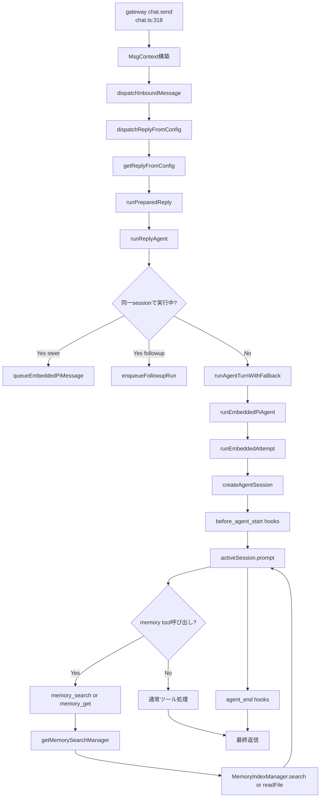
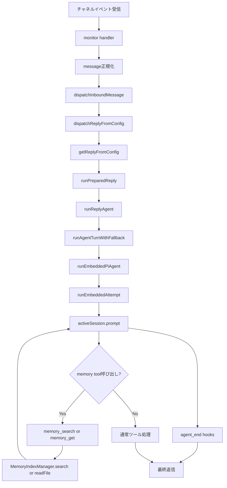
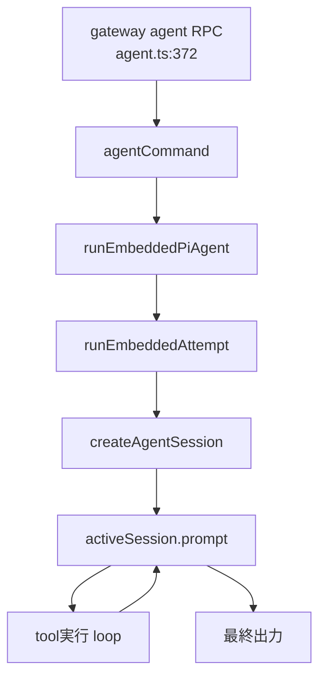
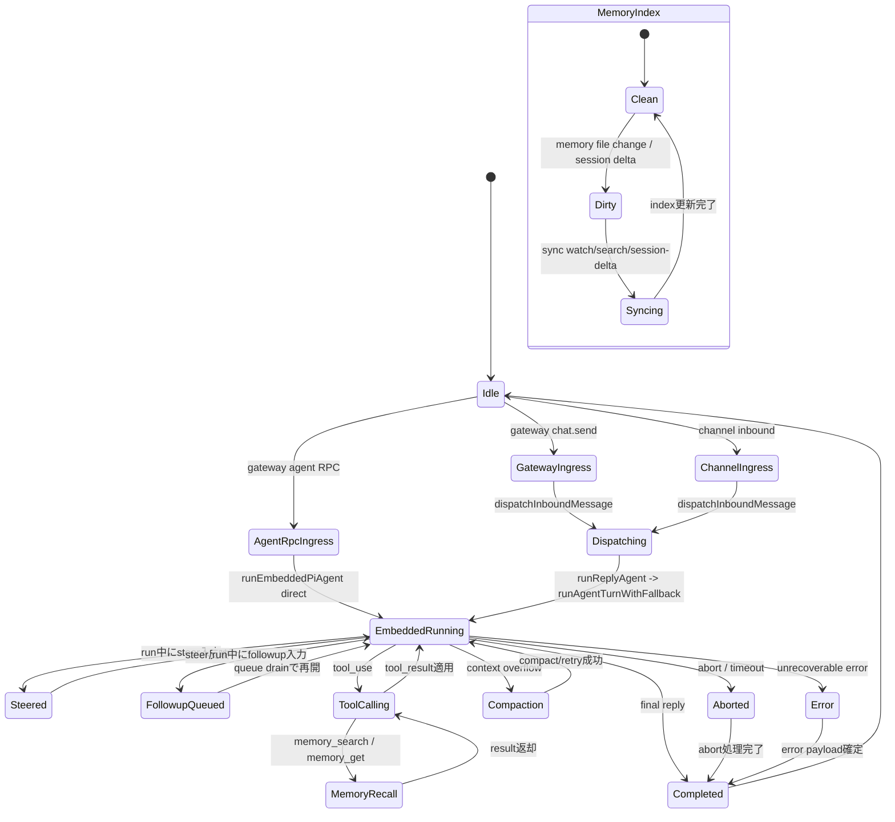
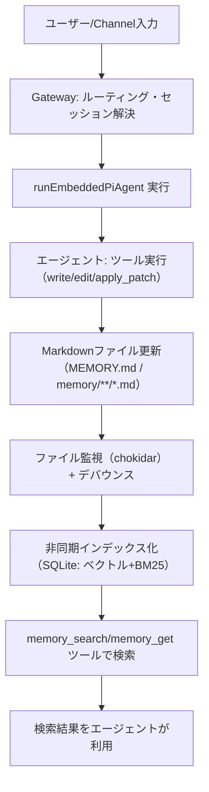

# adjutant.md

## openclaw 技術解剖シリーズ

- 実行の中核は pi-coding-agent
  createAgentSession(...) でセッションを作り、activeSession.prompt(...) を回しているので、実質のエージェント実行エンジンはここで
  す。
  参照: src/agents/pi-embedded-runner/run/attempt.ts:479, src/agents/pi-embedded-runner/run/attempt.ts:827
- LLM呼び出し自体は pi-ai
  ストリーム関数を streamSimple に設定してモデル呼び出ししています。
  参照: src/agents/pi-embedded-runner/run/attempt.ts:519
- pi-agent-core は主に型・インターフェース層
  AgentMessage / AgentTool / AgentEvent などの型として使っており、OpenClaw側では実行エンジンとして直接回している形ではありません。
  参照例: src/agents/pi-embedded-runner/run/types.ts:1, src/agents/pi-tools.types.ts:1
- さらに両者の差分を埋めるアダプタもある
  pi-agent-core の AgentTool と pi-coding-agent の ToolDefinition の差を橋渡ししています。
  参照: src/agents/pi-tool-definition-adapter.ts:1

要するに、表現としては「OpenClawは pi-coding-agent を実行エンジンにし、pi-ai でモデル呼び出しを行い、pi-agent-core の型/契約を使っている」が最も正確です。

基準は「src/ の非テストコードで実際に import されているもの」です。

pi-coding-agent以外で“コア寄り”なパッケージ

1. @mariozechner/pi-ai（36ファイル）
   LLM呼び出し・モデル認証・画像系呼び出しに使われています。
   参照: src/agents/pi-embedded-runner/run/attempt.ts:3 src/agents/tools/image-tool.ts:1 src/commands/auth-choice.apply.openai.ts:1
2. @mariozechner/pi-agent-core（52ファイル）
   エージェントメッセージ/ツール/イベントの共通型として広く使われています。
   参照: src/agents/pi-embedded-runner/run/types.ts:1 src/channels/plugins/types.core.ts:1 src/infra/outbound/outbound-send-
   service.ts:1
   補足: ほぼ import type 中心です（実行ロジック本体というより契約層）。
3. @mariozechner/pi-tui（16ファイル）
   TUI実装の基盤です。
   参照: src/tui/tui.ts:1

OpenClaw本体基盤として使用頻度が高いもの

1. commander（83ファイル）
   CLIコマンド構成の基盤。参照: src/cli/program/build-program.ts:1
2. @sinclair/typebox（41ファイル）
   エージェントツール/Gatewayのスキーマ定義。参照: src/agents/tools/message-tool.ts:1
3. zod（16ファイル）
   設定スキーマ検証。参照: src/config/zod-schema.ts:1
4. json5（12ファイル）
   設定ファイル読取・互換処理。参照: src/config/io.ts:1
5. ws（15ファイル）
   Gateway/Browser側のWebSocket通信。参照: src/gateway/server/ws-connection.ts:1
6. express（5ファイル）
   HTTPサーバ基盤。参照: src/browser/server.ts:2

組み込みチャネル機能のコアSDK（チャネル別）

1. Discord: @buape/carbon（25） discord-api-types（15）
   参照: src/discord/send.shared.ts:2 src/discord/send.shared.ts:1
2. Telegram: grammy（10） @grammyjs/runner @grammyjs/transformer-throttler
   参照: src/telegram/bot.ts:1 src/telegram/bot.ts:2
3. WhatsApp(Web): @whiskeysockets/baileys（8）
   参照: src/web/session.ts:1
4. LINE: @line/bot-sdk（15）
   参照: src/line/bot.ts:1
5. Slack: @slack/bolt（8） @slack/web-api（8）
   参照: src/slack/monitor/events/reactions.ts:1 src/slack/client.ts:1

AIエージェントの中核だけに絞るなら、pi-coding-agent 以外では実質 @mariozechner/pi-ai と @mariozechner/pi-agent-core が中心です。

---

# OpenClaw: 入力からメモリ参照/更新までの大枠フロー調査

このメモは、ユーザー入力（チャネル入力・Gateway入力）を受けてから、
`pi-coding-agent` ベースの実行ループに入り、メモリ参照/更新に至るまでの大枠をコードベースで追跡した結果です。

## 1. 入口（どこから処理が始まるか）

### 1-1. Gateway経由（Web/Control UI）

- `chat.send` 入口: `src/gateway/server-methods/chat.ts:318`
- ここで `MsgContext` を構築し、`dispatchInboundMessage(...)` に渡す: `src/gateway/server-methods/chat.ts:473`, `src/gateway/server-methods/chat.ts:520`

### 1-2. チャネル受信（Discord/Slack/Signal/iMessage など）

- 各チャネル監視処理から共通の `dispatchInboundMessage(...)` を呼ぶ。
- 例:
- Discord: `src/discord/monitor/message-handler.process.ts:393`
- Slack: `src/slack/monitor/message-handler/dispatch.ts:129`
- Signal: `src/signal/monitor/event-handler.ts:239`
- iMessage: `src/imessage/monitor/monitor-provider.ts:650`

### 1-3. Gateway `agent` RPC（直接Agent実行）

- `agent` メソッドは `agentCommand(...)` を直接起動: `src/gateway/server-methods/agent.ts:372`
- `agentCommand` から `runEmbeddedPiAgent(...)` 実行: `src/commands/agent.ts:415`

## 2. 共通の実行パイプライン

`dispatchInboundMessage` 経路（Gateway `chat.send` と通常チャネル受信）は、概ね次の共通処理になります。

- `dispatchInboundMessage(...)`: `src/auto-reply/dispatch.ts:17`
- `dispatchReplyFromConfig(...)`: `src/auto-reply/reply/dispatch-from-config.ts:82`
- `getReplyFromConfig(...)`: `src/auto-reply/reply/get-reply.ts:53`
- `runPreparedReply(...)`: `src/auto-reply/reply/get-reply-run.ts:110`
- `runReplyAgent(...)`: `src/auto-reply/reply/agent-runner.ts:47`
- 実行本体ループ: `runAgentTurnWithFallback(...)`: `src/auto-reply/reply/agent-runner-execution.ts:55`
- モデル実行: `runEmbeddedPiAgent(...)`: `src/agents/pi-embedded-runner/run.ts:137`
- 1試行本体: `runEmbeddedAttempt(...)`: `src/agents/pi-embedded-runner/run/attempt.ts:141`

## 3. エージェントループ（実行中の挙動）

### 3-1. 既存ランが動作中のとき

`runReplyAgent(...)` は、同一セッションで既存ランが動いている場合に分岐します。

- ステア（既存ランへ追加入力）: `queueEmbeddedPiMessage(...)` を呼ぶ: `src/auto-reply/reply/agent-runner.ts:162`
- フォローアップキューに積む: `enqueueFollowupRun(...)`: `src/auto-reply/reply/agent-runner.ts:183`

キューは `scheduleFollowupDrain(...)` でドレインされ、追加入力が順次処理されます。

- ドレインループ: `src/auto-reply/reply/queue/drain.ts:12`

### 3-2. 実行試行ループとリトライ

- `runAgentTurnWithFallback(...)` は `while (true)` で、
- 一時HTTPエラー再試行
- コンテキスト/ロール崩れ時のセッション再生成
- モデルフォールバック
  を処理: `src/auto-reply/reply/agent-runner-execution.ts:104`

- `runEmbeddedPiAgent(...)` 側でも `while (true)` で、
- 認証プロファイルローテーション
- コンテキスト溢れ時の自動コンパクション
- ツール結果肥大時の縮約
  を処理: `src/agents/pi-embedded-runner/run.ts:392`

### 3-3. 1試行内でのLLM呼び出し直前

`runEmbeddedAttempt(...)` 内で以下を実施。

- ツール集合生成（OpenClaw + plugin tools）: `src/agents/pi-embedded-runner/run/attempt.ts:210`
- system prompt 構築: `src/agents/pi-embedded-runner/run/attempt.ts:352`
- `createAgentSession(...)` で実行セッション作成: `src/agents/pi-embedded-runner/run/attempt.ts:479`
- `before_agent_start` hook による前置きコンテキスト注入: `src/agents/pi-embedded-runner/run/attempt.ts:731`
- `activeSession.prompt(...)` 実行（ここでLLM呼び出し）: `src/agents/pi-embedded-runner/run/attempt.ts:827`

補足:

- 実装上、`@mariozechner/pi-coding-agent` が実行エンジンで、型として `@mariozechner/pi-agent-core` を参照: `src/agents/pi-embedded-runner/run/attempt.ts:1`, `src/agents/pi-embedded-runner/run/attempt.ts:4`

## 4. メモリ参照の流れ

### 4-1. memoryツールの有効化

- デフォルトのメモリスロットは `memory-core`: `src/plugins/slots.ts:17`
- `memory-core` plugin が `memory_search` / `memory_get` を登録: `extensions/memory-core/index.ts:11`
- plugin tools は `createOpenClawTools(...)` → `resolvePluginTools(...)` で合流: `src/agents/openclaw-tools.ts:151`, `src/plugins/tools.ts:43`

### 4-2. memory_search / memory_get 実行

- `memory_search` 実装: `src/agents/tools/memory-tool.ts:25`
- `memory_get` 実装: `src/agents/tools/memory-tool.ts:90`
- 両方とも `getMemorySearchManager(...)` を経由して backend を解決: `src/agents/tools/memory-tool.ts:50`, `src/memory/search-manager.ts:19`

### 4-3. backend解決（qmd優先 + builtinフォールバック）

- backend解決: `resolveMemoryBackendConfig(...)`: `src/memory/backend-config.ts:254`
- `qmd` 有効時はQMD managerを優先し、失敗時は builtin index にフォールバック: `src/memory/search-manager.ts:24`, `src/memory/search-manager.ts:38`

### 4-4. builtin index の参照処理

- `MemoryIndexManager.search(...)` で検索実行: `src/memory/manager.ts:266`
- `search()` 時に必要なら非同期 `sync(reason="search")` を起動: `src/memory/manager.ts:275`
- `readFile()` は `MEMORY.md` / `memory/*.md`（+ extraPaths）に制限: `src/memory/manager.ts:405`

### 4-5. 自動リコール（memory-lancedb利用時）

`memory-lancedb` plugin を memory slot に選んだ場合、`before_agent_start` hook で関連メモリを prompt 前置き注入します。

- hook登録: `extensions/memory-lancedb/index.ts:496`
- `prependContext` を返して注入: `extensions/memory-lancedb/index.ts:515`
- 注入結果は `runEmbeddedAttempt(...)` 側で `effectivePrompt` に反映: `src/agents/pi-embedded-runner/run/attempt.ts:747`

## 5. メモリ更新の流れ

更新系は複数経路があります。

### 5-1. `/new` 時の session-memory hook

- `/new` / `/reset` 検出で internal hook 発火: `src/auto-reply/reply/commands-core.ts:65`, `src/auto-reply/reply/commands-core.ts:75`
- `session-memory` hook が `memory/YYYY-MM-DD-*.md` を生成: `src/hooks/bundled/session-memory/handler.ts:69`, `src/hooks/bundled/session-memory/handler.ts:174`
- Hook metadata（`command:new`）: `src/hooks/bundled/session-memory/HOOK.md:10`

### 5-2. memoryファイル更新のインデックス反映

- `MemoryIndexManager` は `MEMORY.md`, `memory/` をwatch: `src/memory/manager.ts:812`, `src/memory/manager.ts:826`
- 変更時 `dirty=true` → `sync(reason="watch")`: `src/memory/manager.ts:839`, `src/memory/manager.ts:1042`

### 5-3. セッショントランスクリプト更新の反映（session memory source 有効時）

- transcript更新イベント発火: `emitSessionTranscriptUpdate(...)`: `src/sessions/transcript-events.ts:16`
- SessionManager append時にイベントを送出: `src/agents/session-tool-result-guard.ts:217`
- MemoryIndexManager が listener で受け、delta閾値到達時に `sync(reason="session-delta")`: `src/memory/manager.ts:852`, `src/memory/manager.ts:909`

### 5-4. auto-capture（memory-lancedb利用時）

- `agent_end` hook で会話内容を抽出し、条件合致した情報を保存: `extensions/memory-lancedb/index.ts:526`, `extensions/memory-lancedb/index.ts:590`

## 6. Mermaid フロー図（入口別詳細）

### 6-1. Gateway `chat.send` 系



### 6-2. チャネル受信系（Discord/Slack/Signal/iMessage）



### 6-3. Gateway `agent` RPC 直実行系



### 6-4. メモリ更新経路（共通）

```mermaid
flowchart TD
  M0[/new または /reset] --> M1[triggerInternalHook command:new]
  M1 --> M2[session-memory hook]
  M2 --> M3[memoryファイルを書込]
  M3 --> M4[chokidar watchでdirty]
  M4 --> M5[MemoryIndexManager.sync reason=watch]

  S0[Session transcript append] --> S1[emitSessionTranscriptUpdate]
  S1 --> S2[session delta listener]
  S2 --> S3[sync reason=session-delta]
```

## 7. Mermaid 状態遷移図（入口別 + 共通実行）



## 8. 実運用で押さえるポイント

- `memory_search` / `memory_get` は read系。メモリ更新は主に「ファイル更新のインデックス取り込み」か「hook/pluginの保存処理」。
- `memory-core` はデフォルトmemory slotだが、configで `memory-lancedb` 等に差し替え可能。
- `/new` の session-memory 保存は internal hooks が有効で、該当hookが有効化されている時のみ動く。
- セッション由来の検索（`sources: ["sessions"]`）は `agents.defaults.memorySearch.experimental.sessionMemory` と source設定に依存する。

---

# DeepWiki Q&A with Code Context for Repository: openclaw/openclaw

## Q1

~/.openclaw/agents/[agent_id]/sessions/[session_id].jsonl に書かれたイベントは 非同期である閾値を超えたタイミングでSQLiteにインデックスされるのでしょうか？

### Answer

はい、セッショントランスクリプト（`~/.openclaw/agents/[agent_id]/sessions/[session_id].jsonl`）に書かれたイベントは、実験的なセッションメモリ検索を有効にしている場合、非同期で閾値を超えたタイミングでSQLiteにインデックスされます openclaw:464-485 。具体的には、セッション更新がデバウンスされ、デルタバイト数（デフォルト約100 KB）またはデルタメッセージ数（デフォルト50行）のいずれかを超えるとバックグラウンドでインデックスがトリガーされます openclaw:487-502 。この機能は `agents.defaults.memorySearch.experimental.sessionMemory: true` と `sources: ["memory", "sessions"]` で明示的に有効にする必要があります openclaw:467-476 。

---

## 補足

- インデックス処理は非同期で行われ、`memory_search` はインデックス完了を待たずに検索を実行するため、結果が一時的に古くなることがあります openclaw:480-482 。
- セッションインデックスはエージェントごとに分離されており、そのエージェントのセッションログのみが対象です openclaw:484-485 。
- 中国語版ドキュメントにも同様の記載があり、デルタ閾値（deltaBytes: 100000、deltaMessages: 50）が明記されています openclaw:337-352 。

## Notes

- この機能は実験的（experimental）であり、デフォルトでは無効です。
- SQLiteのインデックス先は `~/.openclaw/memory/<agentId>.sqlite` です（パスは設定で変更可能） openclaw:367-369 。

Wiki pages you might want to explore:

- [Overview (openclaw/openclaw)](/wiki/openclaw/openclaw#1)

### Citations

**File:** docs/concepts/memory.md (L367-369)

```markdown
- Index storage: per-agent SQLite at `~/.openclaw/memory/<agentId>.sqlite` (configurable via `agents.defaults.memorySearch.store.path`, supports `{agentId}` token).
- Freshness: watcher on `MEMORY.md` + `memory/` marks the index dirty (debounce 1.5s). Sync is scheduled on session start, on search, or on an interval and runs asynchronously. Session transcripts use delta thresholds to trigger background sync.
- Reindex triggers: the index stores the embedding **provider/model + endpoint fingerprint + chunking params**. If any of those change, OpenClaw automatically resets and reindexes the entire store.
```

**File:** docs/concepts/memory.md (L464-485)

````markdown
You can optionally index **session transcripts** and surface them via `memory_search`.
This is gated behind an experimental flag.

```json5
agents: {
  defaults: {
    memorySearch: {
      experimental: { sessionMemory: true },
      sources: ["memory", "sessions"]
    }
  }
}
```
````

Notes:

- Session indexing is **opt-in** (off by default).
- Session updates are debounced and **indexed asynchronously** once they cross delta thresholds (best-effort).
- `memory_search` never blocks on indexing; results can be slightly stale until background sync finishes.
- Results still include snippets only; `memory_get` remains limited to memory files.
- Session indexing is isolated per agent (only that agent’s session logs are indexed).
- Session logs live on disk (`~/.openclaw/agents/<agentId>/sessions/*.jsonl`). Any process/user with filesystem access can read them, so treat disk access as the trust boundary. For stricter isolation, run agents under separate OS users or hosts.

````
**File:** docs/concepts/memory.md (L487-502)
```markdown
Delta thresholds (defaults shown):

```json5
agents: {
  defaults: {
    memorySearch: {
      sync: {
        sessions: {
          deltaBytes: 100000,   // ~100 KB
          deltaMessages: 50     // JSONL lines
        }
      }
    }
  }
}
````

````
**File:** docs/zh-CN/concepts/memory.md (L337-352)
```markdown
增量阈值（显示默认值）：

```json5
agents: {
  defaults: {
    memorySearch: {
      sync: {
        sessions: {
          deltaBytes: 100000,   // ~100 KB
          deltaMessages: 50     // JSONL 行数
        }
      }
    }
  }
}
````

````
## Q2
実験的なセッションメモリ検索を有効にしていない場合は、何がSQLiteにインデックスされるのでしょうか？
### Answer
実験的なセッションメモリ検索を有効にしていない場合、SQLite にインデックスされるのはワークスペース内の Markdown ファイル（`MEMORY.md` と `memory/**/*.md`、および `memorySearch.extraPaths` で追加された .md ファイル）だけです openclaw:364-369 。設定上は `sources` のデフォルトが `["memory"]` となっており、`experimental.sessionMemory` が `false` のときは `"sessions"` は除外されます openclaw:88-108 。

---

## 詳細

- **デフォルトのソース**: `memorySearch.sources` のデフォルトは `["memory"]` です openclaw:88-89 。
- **セッションソースの除外**: `normalizeSources` 関数は、`sessionMemoryEnabled` が `false` のときに `"sessions"` を追加しないようにします openclaw:100-102 。テストでも、`experimental: { sessionMemory: false }` のとき `sources` が `["memory"]` に絞られることが確認されています openclaw:219-241 。
- **インデ対象ファイル**: 「memory」ソースには `MEMORY.md` と `memory/*.md`、そして `extraPaths` で明示的に追加された .md ファイルが含まれます openclaw:364-369 。
- **ストレージ場所**: インデックスはエージェントごとの SQLite（デフォルト: `~/.openclaw/memory/<agentId>.sqlite`）に保存されます openclaw:367-369 。

## Notes
- `memorySearch.extraPaths` を使えば、ワークスペース外の任意の Markdown ファイルやディレクトリをインデックス対象に追加できます openclaw:499-501 。
- セッショントランスクリプト（`sessions/*.jsonl`）をインデックスするには `experimental: { sessionMemory: true }` と `sources: ["memory", "sessions"]` の両方が必要です openclaw:467-476 。

Wiki pages you might want to explore:
- [Overview (openclaw/openclaw)](/wiki/openclaw/openclaw#1)
### Citations
**File:** docs/concepts/memory.md (L364-369)
```markdown
### What gets indexed (and when)

- File type: Markdown only (`MEMORY.md`, `memory/**/*.md`).
- Index storage: per-agent SQLite at `~/.openclaw/memory/<agentId>.sqlite` (configurable via `agents.defaults.memorySearch.store.path`, supports `{agentId}` token).
- Freshness: watcher on `MEMORY.md` + `memory/` marks the index dirty (debounce 1.5s). Sync is scheduled on session start, on search, or on an interval and runs asynchronously. Session transcripts use delta thresholds to trigger background sync.
- Reindex triggers: the index stores the embedding **provider/model + endpoint fingerprint + chunking params**. If any of those change, OpenClaw automatically resets and reindexes the entire store.
````

**File:** docs/concepts/memory.md (L467-476)

````markdown
```json5
agents: {
  defaults: {
    memorySearch: {
      experimental: { sessionMemory: true },
      sources: ["memory", "sessions"]
    }
  }
}
```
````

````
**File:** src/agents/memory-search.ts (L88-108)
```typescript
const DEFAULT_SOURCES: Array<"memory" | "sessions"> = ["memory"];

function normalizeSources(
  sources: Array<"memory" | "sessions"> | undefined,
  sessionMemoryEnabled: boolean,
): Array<"memory" | "sessions"> {
  const normalized = new Set<"memory" | "sessions">();
  const input = sources?.length ? sources : DEFAULT_SOURCES;
  for (const source of input) {
    if (source === "memory") {
      normalized.add("memory");
    }
    if (source === "sessions" && sessionMemoryEnabled) {
      normalized.add("sessions");
    }
  }
  if (normalized.size === 0) {
    normalized.add("memory");
  }
  return Array.from(normalized);
}
````

**File:** src/agents/memory-search.test.ts (L219-241)

```typescript
it("gates session sources behind experimental flag", () => {
  const cfg = {
    agents: {
      defaults: {
        memorySearch: {
          provider: "openai",
          sources: ["memory", "sessions"],
        },
      },
      list: [
        {
          id: "main",
          default: true,
          memorySearch: {
            experimental: { sessionMemory: false },
          },
        },
      ],
    },
  };
  const resolved = resolveMemorySearchConfig(cfg, "main");
  expect(resolved?.sources).toEqual(["memory"]);
});
```

**File:** src/config/schema.field-metadata.ts (L499-501)

```typescript
  "agents.defaults.memorySearch.extraPaths":
    "Extra paths to include in memory search (directories or .md files; relative paths resolved from workspace).",
  "agents.defaults.memorySearch.experimental.sessionMemory":
```

## Q3

MEMORY.md と memory/\*_/_.md、および memorySearch.extraPaths で追加された .md ファイル はそれぞれどのような景気で保存や更新がおこなわれるのでしょうか？

### Answer

MEMORY.md、memory/\*_/_.md、extraPaths で追加された .md ファイルは、ファイルシステム監視と手動同期スケジュールによって保存・更新されます。具体的には、chokidar でファイル変更を監視し、デバウンス（デフォルト1.5秒）後にインデックスを「dirty」とマークして非同期同期をスケジュールします openclaw:812-846 。同期はセッション開始時、検索時、設定されたインターバルでも実行されます openclaw:367-369 。

---

## 監視・同期の仕組み

### 監視対象とパス解決

- `MEMORY.md`、`memory.md`、`memory/` ディレクトリ、`extraPaths` で追加されたパスを監視します openclaw:826-831 。
- `extraPaths` は絶対パスまたはワークスペース相対パスで指定でき、ディレクトリは再帰的に .md ファイルが対象です。シンボリックリンクは無視されます openclaw:109-126 。

### 変更検知とデバウンス

- ファイル追加・変更・削除イベントを `markDirty` で受けて `dirty` フラグを立て、`scheduleWatchSync()` で同期を予約します openclaw:839-846 。
- デバウンス時間は `memorySearch.sync.watchDebounceMs` で設定可能（デフォルト1.5秒） openclaw:388-393 。

### 同期実行と差分判定

- `syncMemoryFiles` でファイルリストを取得し、SQLite に記録されたハッシュと比較して変更がないファイルはスキップします openclaw:52-66 。
- 変更があるファイルは `indexFile` で再インデックスされ、ベクトルと FTS5 に保存されます openclaw:66-74 。

### 不要ファイルの削除

- 現在存在しないパス（activePaths にない）は、SQLite から files/chunks/vector/FTS レコードが削除され、インデックスがクリーンアップされます openclaw:78-101 。

### 手動・定期トリガー

- `onSessionStart: true` でセッション開始時に、`onSearch: true` で検索時に、`intervalMinutes` で定期実行時に同期が走ります openclaw:388-401 。

## Notes

- `extraPaths` に無効なパスがあると CLI の `scanMemoryFiles` で警告が報告されます openclaw:140-161 。
- 監視は `memorySearch.sync.watch: true` が前提で、無効なら手動/定期トリガーのみが動作します openclaw:813-815 。

Wiki pages you might want to explore:

- [Overview (openclaw/openclaw)](/wiki/openclaw/openclaw#1)

### Citations

**File:** src/memory/manager.ts (L812-846)

```typescript
  private ensureWatcher() {
    if (!this.sources.has("memory") || !this.settings.sync.watch || this.watcher) {
      return;
    }
    const additionalPaths = normalizeExtraMemoryPaths(this.workspaceDir, this.settings.extraPaths)
      .map((entry) => {
        try {
          const stat = fsSync.lstatSync(entry);
          return stat.isSymbolicLink() ? null : entry;
        } catch {
          return null;
        }
      })
      .filter((entry): entry is string => Boolean(entry));
    const watchPaths = new Set<string>([
      path.join(this.workspaceDir, "MEMORY.md"),
      path.join(this.workspaceDir, "memory.md"),
      path.join(this.workspaceDir, "memory"),
      ...additionalPaths,
    ]);
    this.watcher = chokidar.watch(Array.from(watchPaths), {
      ignoreInitial: true,
      awaitWriteFinish: {
        stabilityThreshold: this.settings.sync.watchDebounceMs,
        pollInterval: 100,
      },
    });
    const markDirty = () => {
      this.dirty = true;
      this.scheduleWatchSync();
    };
    this.watcher.on("add", markDirty);
    this.watcher.on("change", markDirty);
    this.watcher.on("unlink", markDirty);
  }
```

**File:** docs/concepts/memory.md (L367-369)

```markdown
- Index storage: per-agent SQLite at `~/.openclaw/memory/<agentId>.sqlite` (configurable via `agents.defaults.memorySearch.store.path`, supports `{agentId}` token).
- Freshness: watcher on `MEMORY.md` + `memory/` marks the index dirty (debounce 1.5s). Sync is scheduled on session start, on search, or on an interval and runs asynchronously. Session transcripts use delta thresholds to trigger background sync.
- Reindex triggers: the index stores the embedding **provider/model + endpoint fingerprint + chunking params**. If any of those change, OpenClaw automatically resets and reindexes the entire store.
```

**File:** src/memory/internal.ts (L109-126)

```typescript
const normalizedExtraPaths = normalizeExtraMemoryPaths(workspaceDir, extraPaths);
if (normalizedExtraPaths.length > 0) {
  for (const inputPath of normalizedExtraPaths) {
    try {
      const stat = await fs.lstat(inputPath);
      if (stat.isSymbolicLink()) {
        continue;
      }
      if (stat.isDirectory()) {
        await walkDir(inputPath, result);
        continue;
      }
      if (stat.isFile() && inputPath.endsWith(".md")) {
        result.push(inputPath);
      }
    } catch {}
  }
}
```

**File:** src/config/zod-schema.agent-runtime.ts (L388-401)

```typescript
    sync: z
      .object({
        onSessionStart: z.boolean().optional(),
        onSearch: z.boolean().optional(),
        watch: z.boolean().optional(),
        watchDebounceMs: z.number().int().nonnegative().optional(),
        intervalMinutes: z.number().int().nonnegative().optional(),
        sessions: z
          .object({
            deltaBytes: z.number().int().nonnegative().optional(),
            deltaMessages: z.number().int().nonnegative().optional(),
          })
          .strict()
          .optional(),
```

**File:** src/memory/sync-memory-files.ts (L52-74)

```typescript
const tasks = fileEntries.map((entry) => async () => {
  const record = params.db
    .prepare(`SELECT hash FROM files WHERE path = ? AND source = ?`)
    .get(entry.path, "memory") as { hash: string } | undefined;
  if (!params.needsFullReindex && record?.hash === entry.hash) {
    if (params.progress) {
      params.progress.completed += 1;
      params.progress.report({
        completed: params.progress.completed,
        total: params.progress.total,
      });
    }
    return;
  }
  await params.indexFile(entry);
  if (params.progress) {
    params.progress.completed += 1;
    params.progress.report({
      completed: params.progress.completed,
      total: params.progress.total,
    });
  }
});
```

**File:** src/memory/sync-memory-files.ts (L78-101)

```typescript
const staleRows = params.db
  .prepare(`SELECT path FROM files WHERE source = ?`)
  .all("memory") as Array<{ path: string }>;
for (const stale of staleRows) {
  if (activePaths.has(stale.path)) {
    continue;
  }
  params.db.prepare(`DELETE FROM files WHERE path = ? AND source = ?`).run(stale.path, "memory");
  try {
    params.db
      .prepare(
        `DELETE FROM ${params.vectorTable} WHERE id IN (SELECT id FROM chunks WHERE path = ? AND source = ?)`
      )
      .run(stale.path, "memory");
  } catch {}
  params.db.prepare(`DELETE FROM chunks WHERE path = ? AND source = ?`).run(stale.path, "memory");
  if (params.ftsEnabled && params.ftsAvailable) {
    try {
      params.db
        .prepare(`DELETE FROM ${params.ftsTable} WHERE path = ? AND source = ? AND model = ?`)
        .run(stale.path, "memory", params.model);
    } catch {}
  }
}
```

**File:** src/cli/memory-cli.ts (L140-161)

```typescript
const resolvedExtraPaths = normalizeExtraMemoryPaths(workspaceDir, extraPaths);
for (const extraPath of resolvedExtraPaths) {
  try {
    const stat = await fs.lstat(extraPath);
    if (stat.isSymbolicLink()) {
      continue;
    }
    const extraCheck = await checkReadableFile(extraPath);
    if (extraCheck.issue) {
      issues.push(extraCheck.issue);
    }
  } catch (err) {
    const code = (err as NodeJS.ErrnoException).code;
    if (code === "ENOENT") {
      issues.push(`additional memory path missing (${shortenHomePath(extraPath)})`);
    } else {
      issues.push(
        `additional memory path not accessible (${shortenHomePath(extraPath)}): ${code ?? "error"}`
      );
    }
  }
}
```

## Q4

MEMORY.md、memory/\*_/_.md のファイルの中のデータ更新自体はどこの処理で行いますか？

### Answer

MEMORY.md や memory/\*_/_.md のファイル内容の更新は、主にエージェントがツール（write/edit/apply_patch）を使って書き込む処理と、自動メモリフラッシュ（compaction memoryFlush）がエージェントターンを介して memory/YYYY-MM-DD.md に追記する処理で行われます。また、/new コマンドをトリガーに session-memory フックが日付付きファイルを生成します openclaw:39-44 openclaw:180-182 。

---

## 主な更新処理の箇所

### 1. エージェントによるツール経由の書き込み

- エージェントは `write`/`edit`/`apply_patch` ツールを使って任意の Markdown ファイル（MEMORY.md や memory/YYYY-MM-DD.md など）を直接書き換えます。これはツールシステムの一般機能として提供され、特定のファイルに限定されません。

### 2. 自動メモリフラッシュ（compaction memoryFlush）

- セッションが自動圧縮に近づくと、OpenClaw は静かなエージェントターンを挿入し、モデルに memory/YYYY-MM-DD.md への追記を促します。この処理は `agents.defaults.compaction.memoryFlush` で制御され、プロンプトに従ってエージェントがファイルに書き込みます openclaw:46-60 。

### 3. session-memory フックによるファイル生成

- `/new` コマンド実行時に `session-memory` フックが直近セッション内容を要約し、`memory/YYYY-MM-DD-slug.md` を新規作成して書き込みます。書き込み処理は `handler.ts` の `fs.writeFile` で行われます openclaw:180-182 。

### 4. boot-md フック（間接的な更新）

- Gateway 起動時に `boot-md` フックが BOOT.md の指示を実行し、その結果としてエージェントがメモリファイルを書き込むことがありますが、これは BOOT.md の内容に依存する間接的な更新です openclaw:35-42 。

## Notes

- MEMORY.md は「主セッション（プライベート）でのみ読み込まれ、群組セッションでは読み込まれない」という運用ルールがありますが、書き込み処理自体はファイルシステム権限に依存します openclaw:36-44 。
- 自動メモリフラッシュはワークスペースが書き込み可能な場合のみ動作し、読み取り専用サンドボックスではスキップされます openclaw:73-74 。

Wiki pages you might want to explore:

- [Overview (openclaw/openclaw)](/wiki/openclaw/openclaw#1)

### Citations

**File:** docs/concepts/memory.md (L39-44)

```markdown
## Automatic memory flush (pre-compaction ping)

When a session is **close to auto-compaction**, OpenClaw triggers a **silent,
agentic turn** that reminds the model to write durable memory **before** the
context is compacted. The default prompts explicitly say the model _may reply_,
but usually `NO_REPLY` is the correct response so the user never sees this turn.
```

**File:** docs/concepts/memory.md (L46-60)

````markdown
This is controlled by `agents.defaults.compaction.memoryFlush`:

```json5
{
  agents: {
    defaults: {
      compaction: {
        reserveTokensFloor: 20000,
        memoryFlush: {
          enabled: true,
          softThresholdTokens: 4000,
          systemPrompt: "Session nearing compaction. Store durable memories now.",
          prompt: "Write any lasting notes to memory/YYYY-MM-DD.md; reply with NO_REPLY if nothing to store.",
        },
      },
```
````

**File:** docs/concepts/memory.md (L73-74)

```markdown
- **Workspace must be writable**: if the session runs sandboxed with
  `workspaceAccess: "ro"` or `"none"`, the flush is skipped.
```

**File:** src/hooks/bundled/session-memory/handler.ts (L180-182)

```typescript
// Write to new memory file
await fs.writeFile(memoryFilePath, entry, "utf-8");
log.debug("Memory file written successfully");
```

**File:** src/hooks/bundled/README.md (L35-42)

```markdown
### 🚀 boot-md

Runs `BOOT.md` whenever the gateway starts (after channels start).

**Events**: `gateway:startup`
**What it does**: Executes BOOT.md instructions via the agent runner.
**Output**: Whatever the instructions request (for example, outbound messages).
```

**File:** docs/reference/templates/AGENTS.md (L36-44)

```markdown
### 🧠 MEMORY.md - Your Long-Term Memory

- **ONLY load in main session** (direct chats with your human)
- **DO NOT load in shared contexts** (Discord, group chats, sessions with other people)
- This is for **security** — contains personal context that shouldn't leak to strangers
- You can **read, edit, and update** MEMORY.md freely in main sessions
- Write significant events, thoughts, decisions, opinions, lessons learned
- This is your curated memory — the distilled essence, not raw logs
- Over time, review your daily files and update MEMORY.md with what's worth keeping
```

## Q5

OK.ではデフォルトの動作でSQLiteにインデックスされるデータは、エージェントが記録すると決めた情報だけがインデックスされるのですね？

### Answer

はい、デフォルトではエージェントが記録（書き込み）した情報だけが SQLite にインデックスされます。具体的には、エージェントがツールや自動メモリフラッシュで書き込んだ `MEMORY.md` と `memory/**/*.md`（および `extraPaths` で追加した .md）が対象です openclaw:364-369 。セッショントランスクリプト（JSONL）は、実験的フラグ `experimental.sessionMemory: true` と `sources: ["sessions"]` を両方有効にしない限りインデックスされません openclaw:88-108 。

---

## 補足

- **デフォルトソース**: `memorySearch.sources` のデフォルトは `["memory"]` であり、セッションは含まれません openclaw:88-89 。
- **セッションの条件**: `normalizeSources` は `sessionMemoryEnabled` が `true` のときのみ `"sessions"` を追加します openclaw:100-102 。テストでも、フラグが `false` なら `sources` は `["memory"]` に絞られます openclaw:219-241 。
- **インデックス対象ファイル**: 「memory」ソースには `MEMORY.md`、`memory/*.md`、`extraPaths` で追加された .md が含まれ、これらはエージェントが書き込んだ内容です openclaw:364-369 。

## Notes

- エージェントが書き込まないファイル（例: 手動で配置しただけの Markdown）もパスが存在すればインデックスされますが、運用上はエージェントが記録を決めた情報が主体となります。
- 実験的セッションインデックスを有効にした場合のみ、セッション JSONL もインデックス対象に追加されます openclaw:464-485 。

Wiki pages you might want to explore:

- [Overview (openclaw/openclaw)](/wiki/openclaw/openclaw#1)

### Citations

**File:** docs/concepts/memory.md (L364-369)

```markdown
### What gets indexed (and when)

- File type: Markdown only (`MEMORY.md`, `memory/**/*.md`).
- Index storage: per-agent SQLite at `~/.openclaw/memory/<agentId>.sqlite` (configurable via `agents.defaults.memorySearch.store.path`, supports `{agentId}` token).
- Freshness: watcher on `MEMORY.md` + `memory/` marks the index dirty (debounce 1.5s). Sync is scheduled on session start, on search, or on an interval and runs asynchronously. Session transcripts use delta thresholds to trigger background sync.
- Reindex triggers: the index stores the embedding **provider/model + endpoint fingerprint + chunking params**. If any of those change, OpenClaw automatically resets and reindexes the entire store.
```

**File:** docs/concepts/memory.md (L464-485)

````markdown
You can optionally index **session transcripts** and surface them via `memory_search`.
This is gated behind an experimental flag.

```json5
agents: {
  defaults: {
    memorySearch: {
      experimental: { sessionMemory: true },
      sources: ["memory", "sessions"]
    }
  }
}
```
````

Notes:

- Session indexing is **opt-in** (off by default).
- Session updates are debounced and **indexed asynchronously** once they cross delta thresholds (best-effort).
- `memory_search` never blocks on indexing; results can be slightly stale until background sync finishes.
- Results still include snippets only; `memory_get` remains limited to memory files.
- Session indexing is isolated per agent (only that agent’s session logs are indexed).
- Session logs live on disk (`~/.openclaw/agents/<agentId>/sessions/*.jsonl`). Any process/user with filesystem access can read them, so treat disk access as the trust boundary. For stricter isolation, run agents under separate OS users or hosts.

````
**File:** src/agents/memory-search.test.ts (L219-241)
```typescript
  it("gates session sources behind experimental flag", () => {
    const cfg = {
      agents: {
        defaults: {
          memorySearch: {
            provider: "openai",
            sources: ["memory", "sessions"],
          },
        },
        list: [
          {
            id: "main",
            default: true,
            memorySearch: {
              experimental: { sessionMemory: false },
            },
          },
        ],
      },
    };
    const resolved = resolveMemorySearchConfig(cfg, "main");
    expect(resolved?.sources).toEqual(["memory"]);
  });
````

## Q6

なるほど。では 基本的にはデフォルト設定では、 ~/.openclaw/agents/[agent_id]/sessions/[session_id].jsonl に保存されるデータが参照されることはないのでしょうか。

### Answer

はい、デフォルト設定では `~/.openclaw/agents/[agent_id]/sessions/[session_id].jsonl` に保存されるセッショントランスクリプトは `memory_search` や SQLite インデックスでは参照されません。ただし、ファイル自体はディスクに存在し、ファイルシステムアクセス権があれば読み取り可能です openclaw:464-485 。

---

## 詳細

- **デフォルトのソース設定**: `memorySearch.sources` のデフォルトは `["memory"]` であり、セッション（`"sessions"`）は含まれません openclaw:88-89 。
- **セッションのインデックス条件**: `normalizeSources` 関数は `sessionMemoryEnabled`（実験的フラグ）が `true` のときのみ `"sessions"` を追加します openclaw:100-102 。テストでも、フラグが `false` なら `sources` は `["memory"]` に絞られます openclaw:219-241 。
- **ファイルとしての参照**: セッションログは `~/.openclaw/agents/<agentId>/sessions/*.jsonl` に保存され、ファイルシステムアクセス権があればどのプロセス/ユーザーでも読めます。信頼境界はディスクアクセスです openclaw:484-485 。
- **明示的な検索手段**: `session-logs` スキルを使えば、エージェントが `jq` や `rg` を使ってセッションJSONLを検索・分析できます openclaw:1-21 。

## Notes

- 実験的セッションメモリ検索を有効にしない限り、`memory_search` はセッションを検索対象に含めません。
- `memory_get` はそもそもメモリファイル（Markdown）のみが対象で、セッションJSONLは直接取得できません。
- セッションJSONLを参照したい場合は、スキルやツールでファイルを直接読むか、実験的フラグを有効にしてください。

Wiki pages you might want to explore:

- [Overview (openclaw/openclaw)](/wiki/openclaw/openclaw#1)

### Citations

**File:** docs/concepts/memory.md (L464-485)

````markdown
You can optionally index **session transcripts** and surface them via `memory_search`.
This is gated behind an experimental flag.

```json5
agents: {
  defaults: {
    memorySearch: {
      experimental: { sessionMemory: true },
      sources: ["memory", "sessions"]
    }
  }
}
```
````

Notes:

- Session indexing is **opt-in** (off by default).
- Session updates are debounced and **indexed asynchronously** once they cross delta thresholds (best-effort).
- `memory_search` never blocks on indexing; results can be slightly stale until background sync finishes.
- Results still include snippets only; `memory_get` remains limited to memory files.
- Session indexing is isolated per agent (only that agent’s session logs are indexed).
- Session logs live on disk (`~/.openclaw/agents/<agentId>/sessions/*.jsonl`). Any process/user with filesystem access can read them, so treat disk access as the trust boundary. For stricter isolation, run agents under separate OS users or hosts.

````
**File:** skills/session-logs/SKILL.md (L1-21)
```markdown
---
name: session-logs
description: Search and analyze your own session logs (older/parent conversations) using jq.
metadata: { "openclaw": { "emoji": "📜", "requires": { "bins": ["jq", "rg"] } } }
---

# session-logs

Search your complete conversation history stored in session JSONL files. Use this when a user references older/parent conversations or asks what was said before.

## Trigger

Use this skill when the user asks about prior chats, parent conversations, or historical context that isn't in memory files.

## Location

Session logs live at: `~/.openclaw/agents/<agentId>/sessions/` (use the `agent=<id>` value from the system prompt Runtime line).

- **`sessions.json`** - Index mapping session keys to session IDs
- **`<session-id>.jsonl`** - Full conversation transcript per session

````

## Q7

基本的な動作ループをまとめたい　以下であっているか？ もう少し正確にまとめてほしい。

ユーザーやgatewayからの入力 -> agent(runEmbeddedPiAgent)
↓
agentが記録すると決めた情報がMEMORY.md、memory/\*_/_.mdに保存される
↓
特定の条件で上記ファイルをSQLiteへのインデックス化
↓
agentがtoolを通してSQLiteを使って検索

### Answer

概ね合っています。より正確な基本動作ループは以下の通りです。



---

## 正確なステップ

1. **入力 → エージェント実行**  
   Gatewayが受信したメッセージをルーティングし、`runEmbeddedPiAgent` でエージェントセッションを実行します openclaw:135-155 openclaw:31-44 。

2. **記録 → Markdown保存**  
   エージェントがツール（`write`/`edit`/`apply_patch`）や自動メモリフラッシュ（`compaction.memoryFlush`）で `MEMORY.md` や `memory/**/*.md` に書き込みます openclaw:39-60 openclaw:180-182 。

3. **インデックス化**
   - chokidarがファイル変更を監視し、デバウンス（デフォルト1.5秒）後にインデックスをdirtyマークして非同期同期をスケジュールします openclaw:812-846 。
   - 同期はセッション開始時、検索時、設定インターバルでも実行され、SQLite（`~/.openclaw/memory/<agentId>.sqlite`）にベクトルとBM25を保存します openclaw:364-369 。

4. **検索**  
   エージェントは `memory_search`/`memory_get` ツール経由でSQLiteを検索し、スニペットやファイル内容を取得します openclaw:25-87 openclaw:90-134 。

---

## 補足

- セッションJSONLはデフォルトではインデックスされません。実験的フラグ `experimental.sessionMemory: true` と `sources: ["sessions"]` が必要です openclaw:464-485 openclaw:88-108 。
- インデックス対象はMarkdownのみで、`extraPaths` で追加パスを指定できます openclaw:364-369 。

## Notes

- ファイル監視は `memorySearch.sync.watch: true` が前提です openclaw:813-815 。
- `memory_search` はインデックス完了を待たず、結果が一時的に古くなることがあります openclaw:480-482 。

Wiki pages you might want to explore:

- [Overview (openclaw/openclaw)](/wiki/openclaw/openclaw#1)

### Citations

**File:** docs/pi.md (L135-155)

````markdown
The main entry point is `runEmbeddedPiAgent()` in `pi-embedded-runner/run.ts`:

```typescript
import { runEmbeddedPiAgent } from "./agents/pi-embedded-runner.js";

const result = await runEmbeddedPiAgent({
  sessionId: "user-123",
  sessionKey: "main:whatsapp:+1234567890",
  sessionFile: "/path/to/session.jsonl",
  workspaceDir: "/path/to/workspace",
  config: openclawConfig,
  prompt: "Hello, how are you?",
  provider: "anthropic",
  model: "claude-sonnet-4-20250514",
  timeoutMs: 120_000,
  runId: "run-abc",
  onBlockReply: async (payload) => {
    await sendToChannel(payload.text, payload.mediaUrls);
  },
});
```
````

````
**File:** docs/concepts/agent-loop.md (L31-44)
```markdown
3. `runEmbeddedPiAgent`:
   - serializes runs via per-session + global queues
   - resolves model + auth profile and builds the pi session
   - subscribes to pi events and streams assistant/tool deltas
   - enforces timeout -> aborts run if exceeded
   - returns payloads + usage metadata
4. `subscribeEmbeddedPiSession` bridges pi-agent-core events to OpenClaw `agent` stream:
   - tool events => `stream: "tool"`
   - assistant deltas => `stream: "assistant"`
   - lifecycle events => `stream: "lifecycle"` (`phase: "start" | "end" | "error"`)
5. `agent.wait` uses `waitForAgentJob`:
   - waits for **lifecycle end/error** for `runId`
   - returns `{ status: ok|error|timeout, startedAt, endedAt, error? }`

````

**File:** docs/concepts/memory.md (L39-60)

````markdown
## Automatic memory flush (pre-compaction ping)

When a session is **close to auto-compaction**, OpenClaw triggers a **silent,
agentic turn** that reminds the model to write durable memory **before** the
context is compacted. The default prompts explicitly say the model _may reply_,
but usually `NO_REPLY` is the correct response so the user never sees this turn.

This is controlled by `agents.defaults.compaction.memoryFlush`:

```json5
{
  agents: {
    defaults: {
      compaction: {
        reserveTokensFloor: 20000,
        memoryFlush: {
          enabled: true,
          softThresholdTokens: 4000,
          systemPrompt: "Session nearing compaction. Store durable memories now.",
          prompt: "Write any lasting notes to memory/YYYY-MM-DD.md; reply with NO_REPLY if nothing to store.",
        },
      },
```
````

**File:** docs/concepts/memory.md (L364-369)

```markdown
### What gets indexed (and when)

- File type: Markdown only (`MEMORY.md`, `memory/**/*.md`).
- Index storage: per-agent SQLite at `~/.openclaw/memory/<agentId>.sqlite` (configurable via `agents.defaults.memorySearch.store.path`, supports `{agentId}` token).
- Freshness: watcher on `MEMORY.md` + `memory/` marks the index dirty (debounce 1.5s). Sync is scheduled on session start, on search, or on an interval and runs asynchronously. Session transcripts use delta thresholds to trigger background sync.
- Reindex triggers: the index stores the embedding **provider/model + endpoint fingerprint + chunking params**. If any of those change, OpenClaw automatically resets and reindexes the entire store.
```

**File:** docs/concepts/memory.md (L464-485)

````markdown
You can optionally index **session transcripts** and surface them via `memory_search`.
This is gated behind an experimental flag.

```json5
agents: {
  defaults: {
    memorySearch: {
      experimental: { sessionMemory: true },
      sources: ["memory", "sessions"]
    }
  }
}
```
````

Notes:

- Session indexing is **opt-in** (off by default).
- Session updates are debounced and **indexed asynchronously** once they cross delta thresholds (best-effort).
- `memory_search` never blocks on indexing; results can be slightly stale until background sync finishes.
- Results still include snippets only; `memory_get` remains limited to memory files.
- Session indexing is isolated per agent (only that agent’s session logs are indexed).
- Session logs live on disk (`~/.openclaw/agents/<agentId>/sessions/*.jsonl`). Any process/user with filesystem access can read them, so treat disk access as the trust boundary. For stricter isolation, run agents under separate OS users or hosts.

````
**File:** src/agents/tools/memory-tool.ts (L25-87)
```typescript
export function createMemorySearchTool(options: {
  config?: OpenClawConfig;
  agentSessionKey?: string;
}): AnyAgentTool | null {
  const cfg = options.config;
  if (!cfg) {
    return null;
  }
  const agentId = resolveSessionAgentId({
    sessionKey: options.agentSessionKey,
    config: cfg,
  });
  if (!resolveMemorySearchConfig(cfg, agentId)) {
    return null;
  }
  return {
    label: "Memory Search",
    name: "memory_search",
    description:
      "Mandatory recall step: semantically search MEMORY.md + memory/*.md (and optional session transcripts) before answering questions about prior work, decisions, dates, people, preferences, or todos; returns top snippets with path + lines.",
    parameters: MemorySearchSchema,
    execute: async (_toolCallId, params) => {
      const query = readStringParam(params, "query", { required: true });
      const maxResults = readNumberParam(params, "maxResults");
      const minScore = readNumberParam(params, "minScore");
      const { manager, error } = await getMemorySearchManager({
        cfg,
        agentId,
      });
      if (!manager) {
        return jsonResult({ results: [], disabled: true, error });
      }
      try {
        const citationsMode = resolveMemoryCitationsMode(cfg);
        const includeCitations = shouldIncludeCitations({
          mode: citationsMode,
          sessionKey: options.agentSessionKey,
        });
        const rawResults = await manager.search(query, {
          maxResults,
          minScore,
          sessionKey: options.agentSessionKey,
        });
        const status = manager.status();
        const decorated = decorateCitations(rawResults, includeCitations);
        const resolved = resolveMemoryBackendConfig({ cfg, agentId });
        const results =
          status.backend === "qmd"
            ? clampResultsByInjectedChars(decorated, resolved.qmd?.limits.maxInjectedChars)
            : decorated;
        return jsonResult({
          results,
          provider: status.provider,
          model: status.model,
          fallback: status.fallback,
          citations: citationsMode,
        });
      } catch (err) {
        const message = err instanceof Error ? err.message : String(err);
        return jsonResult({ results: [], disabled: true, error: message });
      }
    },
  };
````

**File:** src/agents/tools/memory-tool.ts (L90-134)

```typescript
export function createMemoryGetTool(options: {
  config?: OpenClawConfig;
  agentSessionKey?: string;
}): AnyAgentTool | null {
  const cfg = options.config;
  if (!cfg) {
    return null;
  }
  const agentId = resolveSessionAgentId({
    sessionKey: options.agentSessionKey,
    config: cfg,
  });
  if (!resolveMemorySearchConfig(cfg, agentId)) {
    return null;
  }
  return {
    label: "Memory Get",
    name: "memory_get",
    description:
      "Safe snippet read from MEMORY.md or memory/*.md with optional from/lines; use after memory_search to pull only the needed lines and keep context small.",
    parameters: MemoryGetSchema,
    execute: async (_toolCallId, params) => {
      const relPath = readStringParam(params, "path", { required: true });
      const from = readNumberParam(params, "from", { integer: true });
      const lines = readNumberParam(params, "lines", { integer: true });
      const { manager, error } = await getMemorySearchManager({
        cfg,
        agentId,
      });
      if (!manager) {
        return jsonResult({ path: relPath, text: "", disabled: true, error });
      }
      try {
        const result = await manager.readFile({
          relPath,
          from: from ?? undefined,
          lines: lines ?? undefined,
        });
        return jsonResult(result);
      } catch (err) {
        const message = err instanceof Error ? err.message : String(err);
        return jsonResult({ path: relPath, text: "", disabled: true, error: message });
      }
    },
  };
```

# 具体的な書き出し指示の文章とそのソースコードパス教えて

Fast
具体的な書き出し指示の文章とソースコードパスは以下の通りです。

1. Memory Recall セクション（検索・取得指示）
   ソース: src/agents/system-prompt.ts の buildMemorySection system-prompt.ts:40-66
   指示文:

## Memory Recall

Before answering anything about prior work, decisions, dates, people, preferences, or todos: run memory_search on MEMORY.md + memory/\*.md; then use memory_get to pull only the needed lines. If low confidence after search, say you checked.  
Citations: include Source: <path#line> when it helps the user verify memory snippets.  
2. ワークスペースブートストラップ（読み込み指示）
ソース: docs/reference/templates/AGENTS.md の Every Session セクション AGENTS.md:16-26
指示文:

## Every Session

Before doing anything else:

1. Read SOUL.md — this is who you are
2. Read USER.md — this is who you're helping
3. Read memory/YYYY-MM-DD.md (today + yesterday) for recent context
4. If in MAIN SESSION (direct chat with your human): Also read MEMORY.md  
   Don't ask permission. Just do it.
5. 自動メモリフラッシュ（書き出し指示）
   ソース: docs/concepts/memory.md の memoryFlush 設定例 memory.md:46-60
   指示文:
   systemPrompt: "Session nearing compaction. Store durable memories now."
   prompt: "Write any lasting notes to memory/YYYY-MM-DD.md; reply with NO_REPLY if nothing to store."
6. プロンプトの組み立てと渡し方
   ソース: src/auto-reply/reply/agent-runner-memory.ts の runMemoryFlushIfNeeded 内で extraSystemPrompt に memoryFlush の systemPrompt を追加し、runEmbeddedPiAgent に渡す agent-runner-memory.ts:92-137 。
   関連: src/agents/pi-embedded-runner/run/attempt.ts で buildEmbeddedSystemPrompt を呼び出し、最終システムプロンプトを構築 。
   Notes
   Memory Recall セクションは promptMode: "minimal" では省略されます system-prompt.ts:45-47 。
   メモリフラッシュはワークスペース書き込み可能時のみ実行されます memory.md:73-74 。

# 自動メモリフラッシュのこの2つの指示は書き込み指示ですが、ほかにもプロンプトで書き込み系の指示がないか検索してほしい

Fast
View as codemap
はい、自動メモリフラッシュ以外にも、プロンプトやテンプレートに書き込みを促す指示が複数あります。以下に主なものをまとめます。

主な書き込み系プロンプト指示

1. AGENTS.md テンプレート（ワークスペース運用ルール）
   Write It Down セクション: 「Memory is limited — if you want to remember something, WRITE IT TO A FILE」「When someone says "remember this" → update memory/YYYY-MM-DD.md」「When you learn a lesson → update AGENTS.md, TOOLS.md, or the relevant skill」 AGENTS.md:46-54 。
   Memory Maintenance: 「Periodically (every few days), use a heartbeat to: 1. Read through recent memory/YYYY-MM-DD.md files 2. Identify significant events... 3. Update MEMORY.md with distilled learnings」 AGENTS.md:204-212 。
2. healthcheck スキル（監査・メンテナンス）
   Memory writes: 「Write lasting notes to memory/YYYY-MM-DD.md」「If there are durable preferences or decisions, also update MEMORY.md」 SKILL.md:227-242 。
3. OpenProse スキル（ユーザー・プロジェクト記憶）
   user-memory.prose（teach モード）: 「Learn and remember this: {content}」「Integrate with your existing knowledge. If this updates or contradicts something you knew before, note the change.」 user-memory.prose:53-64 。
   project-memory.prose（update モード）: 「Record this update: {content}」「Integrate this into your project knowledge. Note the date and how this relates to previous understanding.」 project-memory.prose:84-100 。
4. AGENTS.default.md（デフォルトテンプレート）
   Memory system: 「Capture: decisions, preferences, constraints, open loops.」 AGENTS.default.md:65-71 。
5. FAQ（運用ガイド）
   「Ask the bot to write the fact to memory. Long-term notes belong in MEMORY.md, short-term context goes into memory/YYYY-MM-DD.md.」「If you want a durable behavior or preference, ask the bot to write it into AGENTS.md or MEMORY.md」 faq.md:1195-1206 。
6. session-memory フック（/new コマンド）
   /new 実行時に「Saves to memory」し、memory/YYYY-MM-DD-slug.md を生成します HOOK.md:19-29 。
   Notes
   上記はいずれもエージェントに対して「ファイルに書き込め」と明示的に指示するプロンプト・テンプレートです。
   書き込み先は主に memory/YYYY-MM-DD.md（日次ログ）と MEMORY.md（長期記憶）、そして AGENTS.md/TOOLS.md（運用・スキルメモ）です。
   一部のスキル（OpenProse）は独自の永続化バックエンドを使いますが、最終的にワークスペース Markdown に書き込むよう促す設計です。

# pi-coding-agent

https://shittycodingagent.ai/

# エージェントAI：Pi — OpenClawを支える最小限のコーディングエージェントの解剖

https://medium.com/@shivam.agarwal.in/agentic-ai-pi-anatomy-of-a-minimal-coding-agent-powering-openclaw-5ecd4dd6b440

# 意見を主張し、最小限のコーディングエージェントを構築して学んだこと

https://mariozechner.at/posts/2025-11-30-pi-coding-agent/

# 深掘り：OpenClaw が実稼働レベルの AI エージェント システムを構築した方法

https://medium.com/@bridgeriver-ai/deep-dive-how-openclaw-built-a-production-grade-ai-agent-system-6910aea5d2cd
