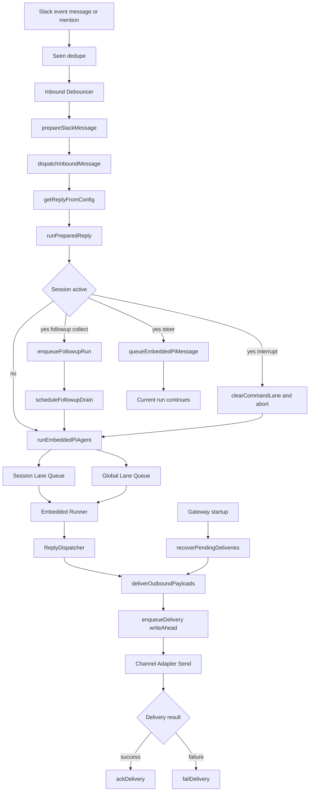
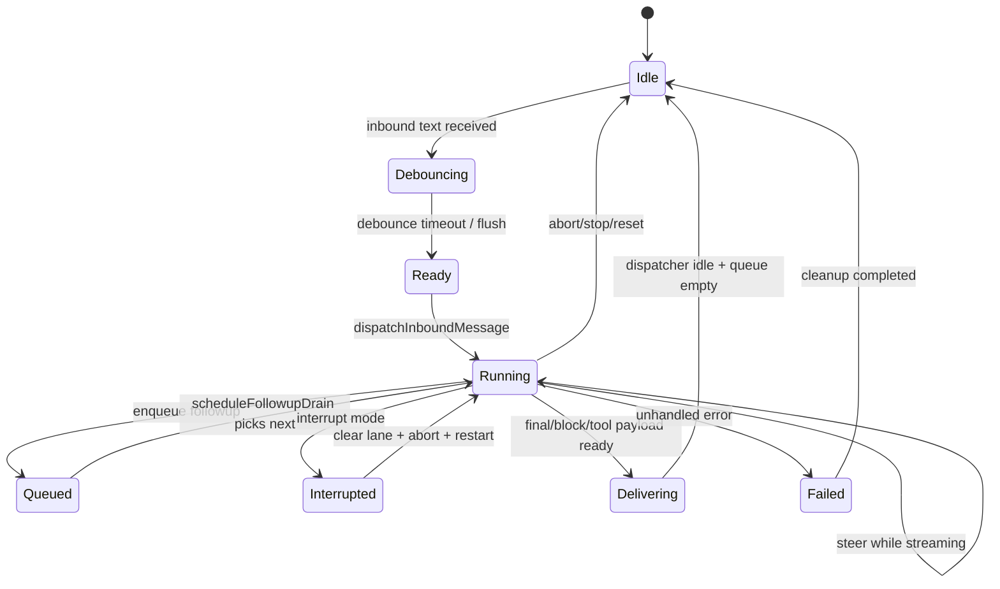
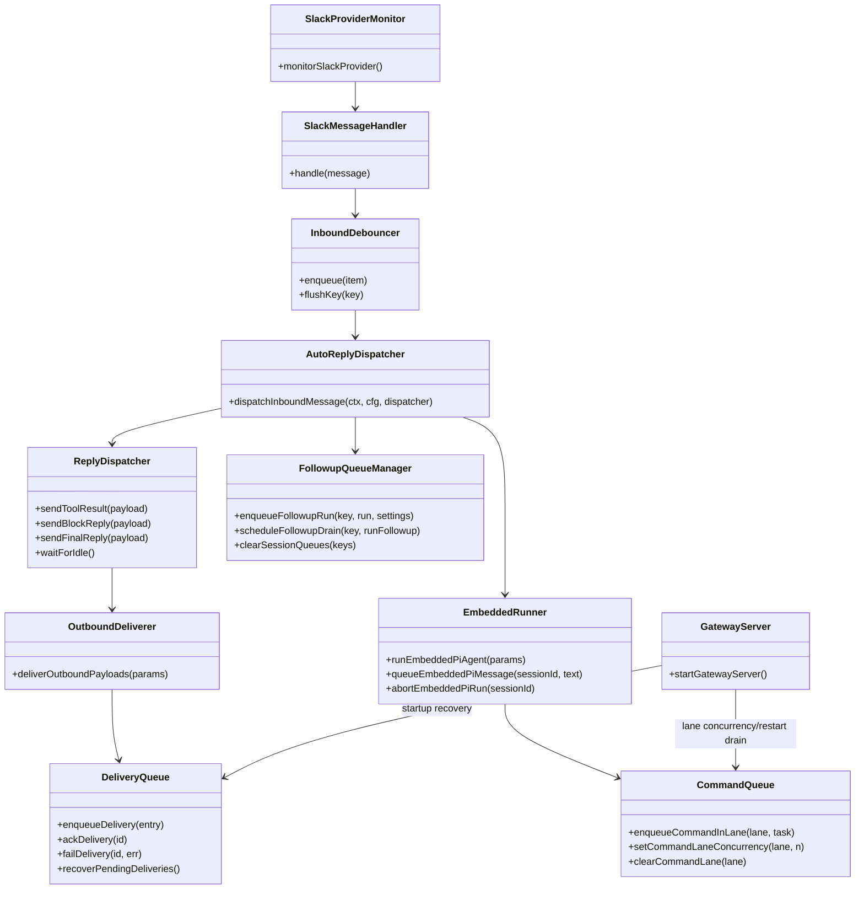

# OpenClaw メッセージ交通整理アーキテクチャ

## 対象

- `vendor/openclaw` における、Slack などのチャネル入力から AI エージェント実行、返信配信までのメッセージ処理。
- 特に「メッセージキューを挟んでいるか」「どこで交通整理しているか」に焦点を当てる。

## 概要

- OpenClaw は Kafka / SQS / Redis などの外部メッセージブローカーを中核経路には使わない。
- 代わりに、用途別に複数のインプロセスキューを重ねる。
- ただし、返信配信（outbound）だけはクラッシュ復旧のためにディスク永続の write-ahead キューを使う。

## 目的

- 受信イベントの重複・連投を吸収して、不要なエージェント実行を減らす。
- セッション単位で実行順序を保証し、競合や文脈破壊を防ぐ。
- 実行中メッセージを `steer / followup / collect / interrupt` で制御し、応答体験を安定化する。
- 返信配信の喪失を防ぎ、再起動後も未送信分をリカバリする。

## 詳細な流れ

1. 受信

- Slack では Bolt の `message` / `app_mention` イベントを受信する。
- 受信時にメッセージ重複チェックを行う（短時間 TTL の seen キャッシュ）。

2. 入口の交通整理（軽量）

- 同一送信者・同一スレッド軸で inbound デバウンスを行う。
- 連投テキストはまとめ、コマンドや添付付きメッセージは即時 flush する。

3. 共通ディスパッチへ投入

- `dispatchInboundMessage` に正規化済みコンテキストを渡す。
- 返信送信自体は `ReplyDispatcher` で順序制御（tool/block/final）する。

4. 実行中セッションの交通整理（重量）

- セッションが実行中なら queue mode に応じて処理分岐する。
- `steer`: ストリーム中ランへ追加入力。
- `followup/collect/steer-backlog`: follow-up queue に積んで後続実行。
- `interrupt`: セッション lane をクリアし、実行中ランを abort して新規実行。

5. エージェント実行

- `runEmbeddedPiAgent` は二段キューで実行される。
- セッション lane（順序保証）とグローバル lane（全体同時実行制御）を通過する。

6. 返信配信

- 送信前に write-ahead で `delivery-queue` へ永続化する。
- 配信成功で ACK、失敗で retry 情報を更新する。

7. 再起動時リカバリ

- Gateway 起動時に pending delivery を走査し、backoff 付きで再送する。
- 上限超過は `failed/` に退避する。

## フロー図

## 状態遷移図

## クラス図

## 主要実装ポイント（参照）

- Slack受信入口: `vendor/openclaw/src/slack/monitor/events/messages.ts`
- Slackデバウンス: `vendor/openclaw/src/slack/monitor/message-handler.ts`
- 共通ディスパッチ: `vendor/openclaw/src/auto-reply/dispatch.ts`
- 実行時キューモード判定: `vendor/openclaw/src/auto-reply/reply/get-reply-run.ts`
- follow-up queue: `vendor/openclaw/src/auto-reply/reply/queue/`
- laneキュー実装: `vendor/openclaw/src/process/command-queue.ts`
- embedded runner: `vendor/openclaw/src/agents/pi-embedded-runner/run.ts`
- outbound write-ahead queue: `vendor/openclaw/src/infra/outbound/delivery-queue.ts`
- outbound配信ラッパ: `vendor/openclaw/src/infra/outbound/deliver.ts`
- 起動時リカバリ: `vendor/openclaw/src/gateway/server.impl.ts`

## 補足

- OpenClaw には Gmail 用の Pub/Sub 関連コードはあるが、Slack -> Agent 本線の交通整理に常設ブローカーを使う設計ではない。
