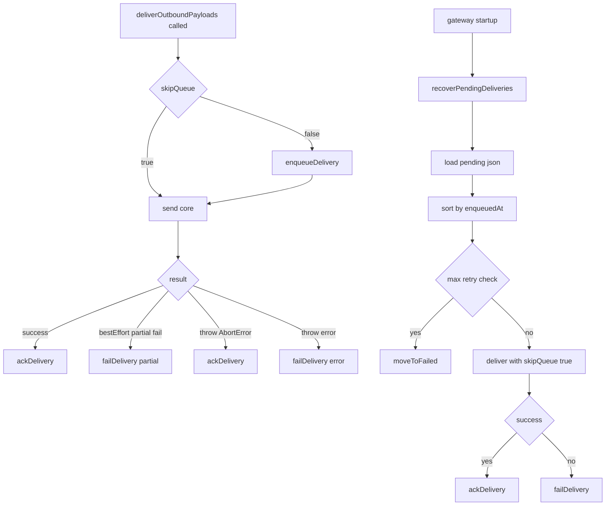
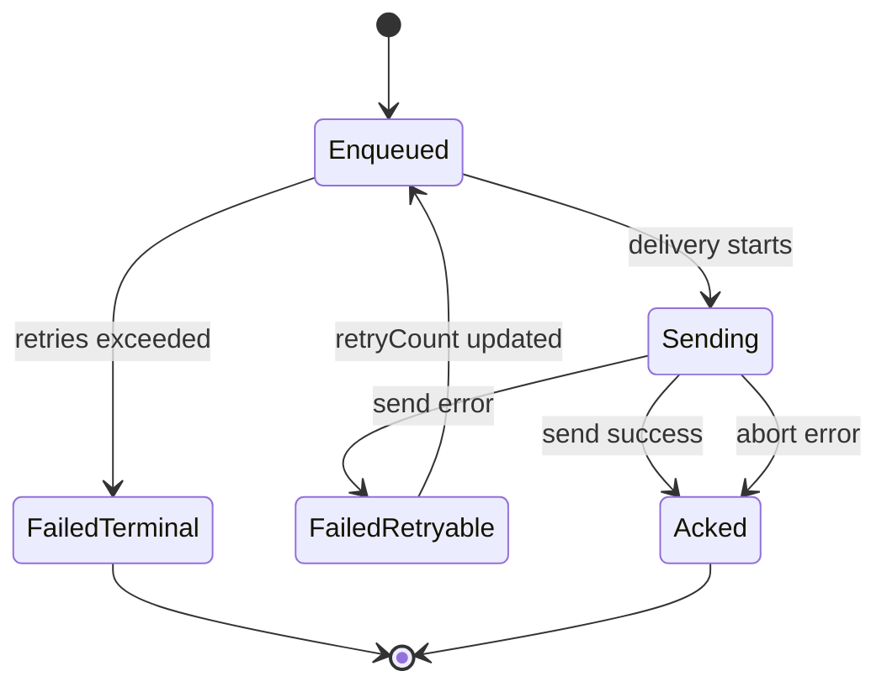

# OpenClaw Write-Ahead 配送キュー実装メモ

## 概要

- OpenClaw の outbound 配信では、送信前に配送要求をディスクへ先書きする。
- 送信成功時にキューエントリを削除し、失敗時に retry 情報を更新する。
- Gateway 再起動時は残存エントリを再送して、クラッシュ後の取りこぼしを減らす。

## 目的

- プロセスクラッシュや再起動で「送るはずだった返信」が消えるリスクを下げる。
- 配送が成功するまで配送意図をローカル状態に保持する。
- 起動時に自動復旧して可用性を上げる。

## 実装ファイル

- キュー本体: `vendor/openclaw/src/infra/outbound/delivery-queue.ts`
- 配送ラッパ: `vendor/openclaw/src/infra/outbound/deliver.ts`
- 起動時リカバリ起点: `vendor/openclaw/src/gateway/server.impl.ts`
- テスト: `vendor/openclaw/src/infra/outbound/outbound.test.ts`
- テスト（部分失敗・abort）: `vendor/openclaw/src/infra/outbound/deliver.test.ts`

## 1. キューの配置とデータ構造

### 配置

- キューディレクトリ: `<stateDir>/delivery-queue`
- 失敗退避先: `<stateDir>/delivery-queue/failed`
- `stateDir` は `resolveStateDir()` で解決される。

### 1件のエントリ（QueuedDelivery）

- `id`: UUID
- `enqueuedAt`: enqueue 時刻（ms）
- `channel`, `to`, `accountId`
- `payloads`: 元の返信 payload（プラグイン hook 前）
- `threadId`, `replyToId`
- `bestEffort`, `gifPlayback`, `silent`, `mirror`
- `retryCount`, `lastError`

## 2. 先書き（enqueue）実装

1. `enqueueDelivery()` で UUID を採番する。
2. JSON を `<id>.json` へ直接書かず、一時ファイル `<id>.json.<pid>.tmp` に書く。
3. `rename(tmp, final)` で原子的に確定する。

このため「中途半端な内容の本番ファイル」が残りにくい。

## 3. 成功・失敗の更新

### 成功

- `ackDelivery(id)` で `<id>.json` を削除。
- `ENOENT` は無視して idempotent にしている。

### 失敗

- `failDelivery(id, error)` で JSON を読み直し、
  - `retryCount += 1`
  - `lastError = error`
    を更新して同様に tmp + rename で書き戻す。

## 4. 配送ラッパ側の制御

`deliverOutboundPayloads()` は以下の順で動く。

1. `skipQueue` が false の場合だけ `enqueueDelivery()` を実行。
2. キュー書き込み失敗は `.catch(() => null)` で握り、送信自体は続行。
3. 実送信は `deliverOutboundPayloadsCore()` へ委譲。
4. 送信結果に応じて:

- 完全成功: `ackDelivery`
- `bestEffort` で部分失敗あり: `failDelivery("partial delivery failure (bestEffort)")`
- 例外失敗: `failDelivery(error message)`
- `AbortError`: `ackDelivery`（中断は再送対象にしない）

## 5. 起動時リカバリ

Gateway 起動時に `recoverPendingDeliveries()` が実行される。

1. `loadPendingDeliveries()` で `delivery-queue` の `*.json` を読む。
2. `enqueuedAt` 昇順（古い順）で処理する。
3. `retryCount >= MAX_RETRIES(5)` は `failed/` へ移動して skip。
4. 再試行前に backoff を待機する（5s, 25s, 120s, 600s...）。
5. `deliver(..., skipQueue: true)` で再送する。
6. 成功なら `ackDelivery`、失敗なら `failDelivery` で retryCount を進める。
7. `maxRecoveryMs`（既定 60s）を超える分は次回起動へ defer。

## 6. フロー図

## 7. 状態遷移図

## 8. テストで担保されている挙動

- enqueue -> ack ライフサイクル
- `ackDelivery` の idempotent 動作（missing file 無視）
- `failDelivery` の retryCount 増分と `lastError` 更新
- max retries 超過時の `failed/` 退避
- recovery 時の `skipQueue: true` 伝播
- recovery 時のオプション再現（`bestEffort`, `mirror` など）
- `maxRecoveryMs` の時間予算超過時 defer
- `bestEffort` 部分失敗時に `ack` せず `fail` すること
- `AbortError` は `ack` 扱いで残さないこと

## 9. 既知の設計トレードオフ

- キュー書き込み失敗は配送を止めないため、最悪時は永続化なしで送信される。
- recovery は起動時実行で、常時バックグラウンド再試行ではない。
- 単純なファイルキューのため、分散ロックや外部ブローカー由来の厳密順序保証は持たない。
- malformed JSON は `loadPendingDeliveries()` でスキップされる（回復不能データは取りこぼす）。
