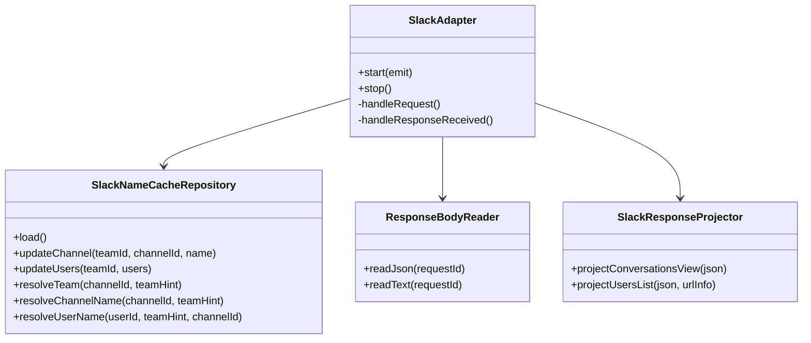
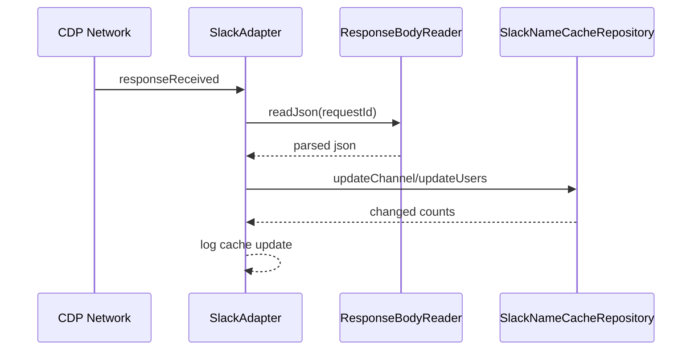

## 1. 概要と目的 Overview and Purpose

- What  
  `src/slack/adapter.ts` の責務過多を解消し、名前解決 キャッシュ 永続化 レスポンス解析を分離する。
- Why  
  SOLID KISS DRY を満たし、イベント正規化の変更容易性とテスト容易性を高める。TDDで安全に段階移行する。
- How  
  既存挙動を契約テストで固定した上で、`NameCacheRepository` と `ResponseBodyReader` と `SlackNameResolver` を抽出し、`SlackAdapter` をオーケストレータに縮小する。

## 2. 仕様と受け入れ条件 Specification and Acceptance Criteria

### 2.1 スコープ Scope

- 今回やること
  - `SlackAdapter` から以下を分離
    - team別 channel user キャッシュの読込 更新 永続化
    - response body の decode parse 共通化
    - channel user 名の解決ロジック共通化
  - 既存テストを維持しつつ、分離したモジュール単体テストを追加
- 成果物
  - 新規モジュール 3つ以上
  - 既存イベント系テスト green 維持
  - 計画書と契約更新
- 制約
  - Prototype First とし、旧キャッシュ形式の後方互換は原則削除

### 2.2 非スコープ Non Scope

- DOM capture ロジックの全面刷新
- Debug UI 機能追加
- Slack Events API adapter 実装

### 2.3 ユースケース Use Cases

- 正常系
  - `responseReceived /api/conversations.view` を受信すると team別 channel cache が更新 永続化される
  - `responseReceived /cache/{team}/users/list` を受信すると team別 user cache が更新 永続化される
  - post reaction notification 正規化時に cache から channel user 名が解決される
- 異常系
  - response body が取得不可でも処理は継続し、イベント処理全体は停止しない
  - cache ファイル破損時でも起動は継続し、該当 cache を無視する

### 2.4 受け入れ条件 Acceptance Criteria

1. Given `conversations.view` の正常レスポンスがある  
   When `SlackAdapter` が `responseReceived` を処理する  
   Then `channel-names-by-team/<team>.json` が更新され更新ログが出る
2. Given `users/list` の正常レスポンスがある  
   When `SlackAdapter` が `responseReceived` を処理する  
   Then `user-names-by-team/<team>.json` が更新され更新ログが出る
3. Given team別 cache に channel user 名がある  
   When post reaction notification を正規化する  
   Then payload由来の名前より cache 由来の名前が優先される
4. Given response body decode parse のエラーが発生する  
   When hook 処理を継続する  
   Then アダプタはクラッシュせず次イベント処理を継続する
5. Given 既存テストスイート  
   When `pnpm test` と `pnpm run typecheck` を実行する  
   Then すべて成功する

### 2.5 既知の制約 Known Limitations

- channelId userId の team 推定は、`team hint` または `channel->team` 既知関係に依存する
- users/list が未到達の場合は actor が `unknown` のままになる
- 後方互換削除後は旧単一ファイル cache を自動読込しない

## 3. 前提技術スタック Context and Tech Stack

- Language Framework  
  TypeScript 5.x Node.js ESM
- Libraries  
  chrome-remote-interface, tsx
- Style Guide  
  ESLint Prettier 既存設定に従う
- Runtime Deployment  
  Node.js local run via `pnpm start`
- Testing  
  Node test runner via `node --import tsx --test`, `pnpm run typecheck`

## 4. インターフェース契約 Interface Contracts

### 4.1 公開APIまたは外部I O一覧

- CLI: `pnpm start`
- 永続化ストレージ
  - `data/_cache/slack/channel-names-by-team/<TEAM_ID>.json`
  - `data/_cache/slack/user-names-by-team/<TEAM_ID>.json`
- 外部サービス連携
  - Slack Desktop CDP (`Network.responseReceived`, `Fetch.requestPaused`, `webSocketFrameReceived`)

### 4.2 データモデルとスキーマ

- Channel cache
  - `{ schema, updated_at, team_id, channels: Record<channelId, channelName> }`
- User cache
  - `{ schema, updated_at, team_id, users: Record<userId, userName> }`
- NameResolver 入出力
  - input: `{ teamIdHint?, channelId?, userId? }`
  - output: `{ resolvedChannelName?, resolvedUserName?, resolvedTeamId? }`

### 4.3 エラーと例外 Error Handling

- エラー分類
  - レスポンス取得失敗
  - JSON parse 失敗
  - cache read write 失敗
- リトライ方針
  - なし。次イベントで自然回復
- タイムアウト方針
  - CDP 呼び出し既存仕様に従う
- ログ方針と個人情報の扱い
  - ログは件数と team id のみ。本文やPIIを追加しない

### 4.4 代表的な例 Examples

- キャッシュ更新ログ
  - `[Adjutant] Slack user cache updated team=T0A... changed=12 total_users=233`
- チャンネルキャッシュファイル

```json
{
  "schema": "adjutant.slack.channel-cache.v1",
  "updated_at": "2026-02-11T11:37:55.508Z",
  "team_id": "T04FQAVAVDZ",
  "channels": { "C04GE5BMZCY": "general" }
}
```

- ユーザーキャッシュファイル

```json
{
  "schema": "adjutant.slack.user-cache.v1",
  "updated_at": "2026-02-11T11:50:00.000Z",
  "team_id": "T04FQAVAVDZ",
  "users": { "U0AA05G77UY": "masahide.y" }
}
```

## 5. アーキテクチャと設計図 Architecture and Diagrams

### 5.1 図の選択方針

- 複数責務分割のためクラス図を必須
- 非同期 I O の流れ把握のためシーケンス図を追加

### 5.2 クラス図 Class Diagram



### 5.3 その他の図 Optional



## 6. テスト戦略 Test Strategy

### 6.1 テストの種類

- Unit
  - `SlackNameCacheRepository` の resolve update persist load を検証
  - `ResponseBodyReader` の decode parse error handling を検証
  - `SlackResponseProjector` の API 応答投影を検証
- Integration
  - 既存 `tests/slackAdapter.events.test.ts` で end-to-end 経路を維持
- Contract
  - cache ファイル schema とログ出力契約を検証

### 6.2 カバレッジ対象

- 重要ロジック
  - team 推定
  - channel user 名解決
  - changed count 集計
- エラー分岐
  - getResponseBody 失敗
  - JSON parse 失敗
  - cache read write 失敗
- 境界条件
  - team hint 不在
  - 同一 ID が複数 team に存在

## 7. 実装タスクリスト Implementation Plan

### Phase 1 設計と準備

- [x] 要件と仕様の確定 受け入れ条件の確定
- [x] インターフェース契約の確定 スキーマと例の追加
- [x] Mermaid図の作成 更新
- [x] インターフェース 型定義の作成
- [x] テスト基盤の確認 例 テストランナー モックユーティリティ

### Phase 2 キャッシュ責務分離の実装

- [x] Test `SlackNameCacheRepository` の失敗するテストケースを作成 Red
- [x] Impl team別 channel user cache の最小実装 Green
- [x] Refactor `SlackAdapter` から cache 読込 更新 resolve を移譲
- [x] Integration `slackAdapter.events` に repo 経路の検証を追加
- [x] Docs cache 契約と図を更新

### Phase 3 レスポンス解析責務分離の実装

- [x] Test `ResponseBodyReader` と `SlackResponseProjector` の失敗するテストケースを作成 Red
- [x] Impl response decode parse と conversations.view users/list 投影の最小実装 Green
- [x] Refactor `handleResponseReceived` の重複除去 DRY
- [x] Integration 既存 raw_fetch と cache 更新テストを維持
- [x] Docs エラー契約とログ仕様を更新

### Phase 4 統合と検証

- [x] 全体テストの実行
- [x] エッジケースの動作確認
- [x] ログと例外の確認 想定外入力 タイムアウト リトライ
- [x] ドキュメント更新 仕様 契約 図

## 8. 完了の定義 Definition of Done

### 8.1 機能DoD Functional DoD

- [ ] 受け入れ条件がすべて満たされていること
- [ ] 既知の制約が明文化され、想定通りであること
- [ ] 契約の例に対して期待通りの結果が得られること

### 8.2 品質DoD Quality DoD

- [x] 全てのテストがパスしていること
- [x] Linter Formatterのエラーがないこと
- [x] 不要なデバッグコードが削除されていること
- [x] 主要な変更点がドキュメントに反映されていること

## 9. 懸念事項と未確定事項 Concerns and Questions

- 破壊点
  - 旧単一ファイル cache 読込を削除済みのため、旧形式ファイルは読まれない
- 決定事項
  - 旧形式フォールバックは今サイクルで即削除する
  - notification の actor 補完は users cache を優先し、未解決時は `bot_name` と `bot_profile.name` を許可する
- 残課題
  - users/list 未到達環境で actor が `unknown` になるケースの最小運用手順を README に明記する

---
