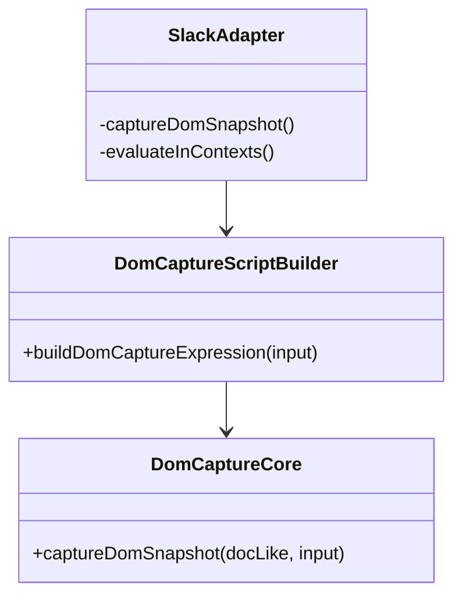
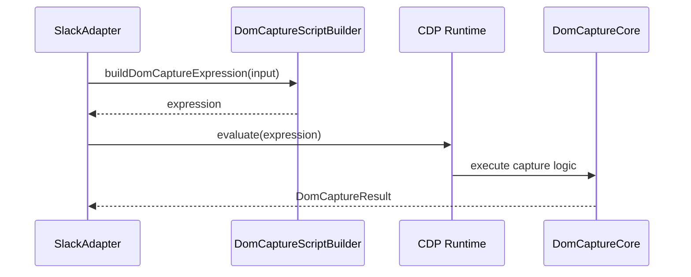

## 1. 概要と目的 Overview and Purpose

- What  
  `src/slack/adapter.ts` の `DOM_CAPTURE_SCRIPT` インライン文字列を分離し、DOM キャプチャロジックをテスト可能なモジュールへ再設計する。
- Why  
  文字列埋め込み実装は可読性と保守性が低く、DOM 判定の単体テストが困難。責務分離により変更容易性と回帰検知性を高める。
- How  
  `domCaptureCore`（純ロジック）と `domCaptureScript`（CDP実行式ビルダー）を導入し、`SlackAdapter` はオーケストレーションのみ担う。

## 2. 仕様と受け入れ条件 Specification and Acceptance Criteria

### 2.1 スコープ Scope

- 今回やること
  - `DOM_CAPTURE_SCRIPT` を `adapter.ts` から除去
  - DOM 探索ロジックを `src/slack/domCaptureCore.ts` に抽出
  - CDP `Runtime.evaluate` 用スクリプト生成を `src/slack/domCaptureScript.ts` に抽出
  - 既存 DOM キャプチャ挙動を維持する回帰テストと新規単体テストを追加
- 成果物
  - 新規モジュール 2 つ（core/script）
  - DOM キャプチャ関連ユニットテスト
  - 既存 integration テスト green 維持
- 制約
  - Prototype First とし後方互換は必要最小限
  - 既存イベントスキーマや外部 I/O 契約は維持

### 2.2 非スコープ Non Scope

- Debug UI の機能追加
- Slack 通知種別の追加や正規化仕様の変更
- Slack Workflow / Events API アダプタ実装

### 2.3 ユースケース Use Cases

- 正常系
  - リアクションイベント処理時に DOM から本文を抽出し既存どおり message_text に反映できる
  - script builder が `Runtime.evaluate` で実行可能な JS 式を生成できる
- 異常系
  - ts 未指定時は `no-ts` を返しアダプタ処理は継続する
  - DOM 候補未検出時は `no-target` を返しアダプタはクラッシュしない
  - script 実行例外時は `error` を返し次イベント処理を継続する

### 2.4 受け入れ条件 Acceptance Criteria

1. Given `SlackAdapter` が DOM キャプチャを実行する  
   When `Runtime.evaluate` を呼ぶ  
   Then インライン文字列ではなく `domCaptureScript` が生成した式を使用する
2. Given `domCaptureCore` に有効な ts と DOM が渡される  
   When capture を実行する  
   Then `{ text, channel, channelId, matchedTs }` が取得できる
3. Given `domCaptureCore` に ts が無い  
   When capture を実行する  
   Then `status: "no-ts"` を返す
4. Given `domCaptureCore` でターゲットが見つからない  
   When capture を実行する  
   Then `status: "no-target"` を返す
5. Given 既存テストスイート  
   When `pnpm run typecheck` と `pnpm test` を実行する  
   Then すべて成功する

### 2.5 既知の制約 Known Limitations

- DOM 構造依存は引き続き存在し、Slack UI の大きな変更で検出率が低下し得る
- Node だけで完全なブラウザDOM再現は困難なため、ユニットでは最小モックで検証する
- 実ブラウザ差異は integration テストと手動確認で補完する

## 3. 前提技術スタック Context and Tech Stack

- Language Framework  
  TypeScript 5.x Node.js ESM
- Libraries  
  tsx, chrome-remote-interface, Node test runner
- Style Guide  
  ESLint / Prettier の既存設定に準拠
- Runtime Deployment  
  Node.js local run via `pnpm start`
- Testing  
  `node --import tsx --test`, `pnpm run typecheck`

## 4. インターフェース契約 Interface Contracts

### 4.1 公開APIまたは外部I O一覧

- `SlackAdapter` 内部依存として利用
  - `buildDomCaptureExpression(input)`
  - `captureDomSnapshot(domLike, input)`
- CDP Runtime
  - `Runtime.evaluate({ expression, contextId })`

### 4.2 データモデルとスキーマ

- `DomCaptureInput`
  - `tsList: string[]`
  - `selectors: { root: string[]; body: string[]; channel: string[] }`
  - `debugMode: boolean`
- `DomCaptureResult`
  - 成功: `{ text: string; channel?: string|null; channelId?: string|null; matchedTs?: string[] }`
  - 失敗: `{ status: "no-ts" | "no-target" | "empty-text"; ... }`
  - 例外: `{ error: string }`

### 4.3 エラーと例外 Error Handling

- エラー分類
  - スクリプト式生成失敗
  - DOM 探索失敗
  - Runtime.evaluate 失敗
- リトライ方針
  - 既存 DOM リトライ制御（adapter 側）を維持
- タイムアウト方針
  - 既存 CDP 呼び出し挙動に従う
- ログ方針と個人情報の扱い
  - 既存 `safePreview` 経由のログのみを利用し、本文/PII の追加ログは行わない

### 4.4 代表的な例 Examples

- script builder 利用例

```ts
const expression = buildDomCaptureExpression({
  tsList: ["1770797741.000001"],
  selectors,
  debugMode: false,
});
```

- core 成功結果

```json
{
  "text": "hello",
  "channel": "general",
  "channelId": "C123",
  "matchedTs": ["1770797741.000001"]
}
```

- core 失敗結果

```json
{
  "status": "no-target",
  "needles": ["1770797741.000001"],
  "candidateCount": 0
}
```

## 5. アーキテクチャと設計図 Architecture and Diagrams

### 5.1 図の選択方針

- 責務分割が主目的のためクラス図を必須
- CDP 呼び出し連携のためシーケンス図を追加

### 5.2 クラス図 Class Diagram



### 5.3 その他の図 Optional



## 6. テスト戦略 Test Strategy

### 6.1 テストの種類

- Unit
  - `domCaptureCore` の判定分岐（success/no-ts/no-target/empty-text/error）
  - `domCaptureScript` の式生成と構文妥当性
- Integration
  - `tests/slack/adapter.reactions.test.ts` で DOM キャプチャ経路の回帰確認
- Contract
  - `DomCaptureResult` の shape を固定し、adapter 側期待と齟齬がないことを検証

### 6.2 カバレッジ対象

- 重要ロジック
  - ts 正規化とターゲット探索
  - channel/channelId 抽出
  - body 取得と sanitize
- エラー分岐
  - script 実行例外
  - ts 欠落
  - ターゲット未検出
- 境界条件
  - 複数 ts 候補
  - 空テキストノード

## 7. 実装タスクリスト Implementation Plan

### Phase 1 設計と準備

- [ ] 要件と仕様の確定 受け入れ条件の確定
- [ ] インターフェース契約の確定 スキーマと例の追加
- [ ] Mermaid図の作成 更新
- [ ] インターフェース 型定義の作成
- [ ] テスト基盤の確認 例 テストランナー モックユーティリティ

### Phase 2 DOM core 分離の実装

- [ ] Test `domCaptureCore` の失敗するテストケースを作成 Red
- [ ] Impl `captureDomSnapshot` の最小実装 Green
- [ ] Refactor 重複処理 attr 取得 sanitize を整理
- [ ] Integration adapter 経路テストで回帰確認
- [ ] Docs 契約と図を更新

### Phase 3 script builder 分離の実装

- [ ] Test `domCaptureScript` の失敗するテストケースを作成 Red
- [ ] Impl `buildDomCaptureExpression` の最小実装 Green
- [ ] Refactor `adapter.ts` からインラインスクリプトを除去
- [ ] Integration `Runtime.evaluate` 呼び出し経路の既存テストを維持
- [ ] Docs エラー契約と利用例を更新

### Phase 4 統合と検証

- [ ] 全体テストの実行
- [ ] エッジケースの動作確認
- [ ] ログと例外の確認 想定外入力 タイムアウト リトライ
- [ ] ドキュメント更新 仕様 契約 図

## 8. 完了の定義 Definition of Done

### 8.1 機能DoD Functional DoD

- [ ] 受け入れ条件がすべて満たされていること
- [ ] 既知の制約が明文化され、想定通りであること
- [ ] 契約の例に対して期待通りの結果が得られること

### 8.2 品質DoD Quality DoD

- [ ] 全てのテストがパスしていること
- [ ] Linter Formatterのエラーがないこと
- [ ] 不要なデバッグコードが削除されていること
- [ ] 主要な変更点がドキュメントに反映されていること

## 9. 懸念事項と未確定事項 Concerns and Questions

- 技術的な懸念点
  - DOM API 差分をどこまで unit モックで吸収するか
  - スクリプト文字列化時のエスケープ不備による実行失敗リスク
- 仕様が曖昧で決定が必要な事項
  - `domCaptureCore` を完全純関数にするか、最小の DOM-like interface を許容するか
  - `no-target` 時に返すデバッグ情報の上限（payload サイズ管理）
- プロトタイプとして許容するリスク
  - Slack UI 更新に伴う selector 劣化
- 将来的な拡張に伴うリスク
  - Workflow/Events API 対応時、DOM 依存を残す設計だと transport ごとの差分が増える

