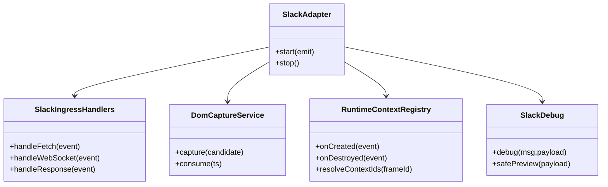
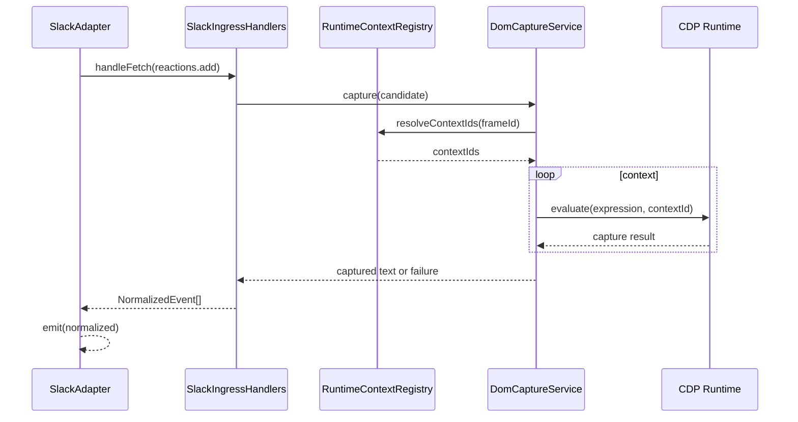

## 1. 概要と目的 Overview and Purpose

- What
  `src/slack/adapter.ts` の肥大化した責務を分割し、オーケストレーション中心の薄いアダプタへ段階的にリファクタリングする。
- Why
  現状はネットワーク受信、DOMキャプチャ、Runtime context 管理、デバッグ出力、パース処理が1ファイルに集中しており、変更時の回帰リスクと認知負荷が高い。責務分割により保守性、テスト容易性、変更安全性を向上させる。
- How
  既存挙動を固定するテストを先に整備し、`RuntimeContextRegistry`、`DomCaptureService`、`SlackIngressHandlers`、`SlackDebug` へ順次抽出する。`SlackAdapter` は依存注入とフロー制御のみ担当する。

## 2. 仕様と受け入れ条件 Specification and Acceptance Criteria

### 2.1 スコープ Scope

- 今回やること
  - `adapter.ts` の内部責務をモジュール分割
  - ハンドラ登録、Runtime context 管理、DOM capture 実行、デバッグ補助を抽出
  - `SlackDebug` を全モジュールで共通利用できる形で提供する
  - 既存 API 契約を維持したまま `SlackAdapter` の行数と複雑度を削減
  - 回帰防止テストの追加または強化
- 成果物
  - 新規モジュール群（registry/service/handlers/debug）
  - 既存テストの更新と追加テスト
  - リファクタ後の設計を反映した計画更新
- 制約
  - Prototype First を維持しつつ、既存 CI (`pnpm check`) は必ず通す
  - `IngestionAdapter` 契約および既存正規化イベント出力は不変

### 2.2 非スコープ Non Scope

- Slackイベント種別や normalize 仕様の追加変更
- 永続化フォーマット（キャッシュJSON）変更
- 外部公開 API や CLI 仕様の変更
- Debug UI 機能追加

### 2.3 ユースケース Use Cases

- 正常系
  - Fetch の `chat.postMessage` / `reactions.*` を受信し、従来通り正規化イベントを emit できる
  - WebSocket frame から通知イベント候補を抽出し、従来通り通知イベントを emit できる
  - Runtime context を使った DOM capture が従来通り成功し `message_text` に反映される
- 異常系
  - Runtime.evaluate が失敗しても次イベント処理を継続する
  - DOM capture が `no-target` や `error` を返してもクラッシュしない
  - response body が不正JSONでも処理全体は継続する

### 2.4 受け入れ条件 Acceptance Criteria

1. Given `SlackAdapter.start()` を実行する
   When ハンドラ初期化が行われる
   Then `SlackAdapter` 本体では登録オーケストレーションのみを担当し、登録詳細は抽出モジュールで管理される
2. Given 各モジュールがデバッグログを出力する
   When ログ出力・サニタイズ処理を呼ぶ
   Then `SlackDebug` 共通モジュールを経由し、同一の redact/safePreview ルールが適用される
3. Given Runtime execution context created/destroyed イベント
   When context 管理を行う
   Then `RuntimeContextRegistry` が `resolveContextIds` 契約を満たし既存挙動と同等の順序で context 候補を返す
4. Given reaction DOM capture の実行要求
   When DOM探索を行う
   Then `DomCaptureService` 経由で `text/channel/channelId/matchedTs` または失敗契約を返し、adapter は継続処理できる
5. Given 既存の Fetch/WebSocket 入力
   When 正規化処理を通す
   Then 既存テストの期待値（UID, message_text, notification）を維持する
6. Given `pnpm run typecheck` と `pnpm test`
   When リファクタ後に実行する
   Then すべて成功する

### 2.5 既知の制約 Known Limitations

- DOM依存による Slack UI 変更耐性の弱さは継続する
- 完全な pure function 化は行わず、必要最小限の stateful service を許容する
- 大規模分割のため、段階ごとに一時的な重複コードが発生する可能性がある

## 3. 前提技術スタック Context and Tech Stack

- Language Framework
  TypeScript 5.x Node.js ESM
- Libraries
  chrome-remote-interface, tsx, Node test runner
- Style Guide
  既存 ESLint / Prettier 設定に従う
- Runtime Deployment
  Node.js local run (`pnpm start`)
- Testing
  `node --import tsx --test`, `pnpm run typecheck`, `pnpm check`

## 4. インターフェース契約 Interface Contracts

### 4.1 公開APIまたは外部I O一覧

- `SlackAdapter` の公開契約
  - `start(emit: EmitFn): Promise<void>`
  - `stop(): Promise<void>`
- CDP Client I/O
  - `Fetch.on("requestPaused")`
  - `Network.on("webSocketFrameReceived" | "webSocketFrameSent" | "responseReceived" | "requestWillBeSent")`
  - `Runtime.on("executionContextCreated" | "executionContextDestroyed")`
  - `Runtime.evaluate(...)`
- ファイルI/O
  - `SlackNameCacheRepository` を通じた channel/user cache 読み書き

### 4.2 データモデルとスキーマ

- `RuntimeContextRegistry`
  - input: executionContext created/destroyed events
  - output: `resolveContextIds(frameId?): Array<number | null>`
- `DomCaptureService`
  - input: `ReactionDomCandidate`
  - output: success/failure/error を含む capture outcome
  - contract: `capture(candidate): Promise<void>`, `consume(ts): captured | null`
- `SlackIngressHandlers`
  - input: FetchPausedEvent / WebSocketFrameEvent / ResponseReceivedEvent
  - output: `NormalizedEvent[]` または副作用（cache更新）
  - contract:
    `handleRequest(event): Promise<NormalizedEvent[]>`
    `handleWebSocketFrame(event,direction): Promise<NormalizedEvent[]>`
    `handleResponseReceived(event): Promise<void>`

### 4.3 エラーと例外 Error Handling

- エラー分類
  - request payload parse error
  - Runtime.evaluate error
  - DOM capture no-target/error
  - response body parse error
- リトライ方針
  - DOM capture は既存の retry delay を維持
- タイムアウト方針
  - CDP API 呼び出しタイムアウト戦略は現行踏襲
- ログ方針と個人情報の扱い
  - 既存 `safePreview` と redact ポリシーを維持し、機密情報を直接出力しない

### 4.4 代表的な例 Examples

- Runtime context 利用例

```ts
const contextIds = runtimeContextRegistry.resolveContextIds(frameId);
for (const contextId of contextIds) {
  await Runtime.evaluate({ expression, contextId, returnByValue: true });
}
```

- DOM capture service 利用例

```ts
await domCaptureService.capture({
  channelId: "C123",
  ts: "1711112222.000300",
  normalizedTs: "1711112222.000300",
});
const captured = domCaptureService.consume("1711112222.000300");
```

- Adapter 側フロー例

```ts
const normalizedEvents = await ingressHandlers.handleFetch(event);
for (const normalized of normalizedEvents) {
  await emit(normalized);
}
```

- Ingress handlers 利用例

```ts
const notifications = await ingressHandlers.handleWebSocketFrame(event, "received");
for (const notification of notifications) {
  await deliver(notification, emit);
}
```

## 5. アーキテクチャと設計図 Architecture and Diagrams

### 5.1 図の選択方針

- 責務分割が主目的のためクラス図を必須とする
- Runtime evaluate と capture の非同期連携が重要なためシーケンス図を追加する

### 5.2 クラス図 Class Diagram



### 5.3 その他の図 Optional



## 6. テスト戦略 Test Strategy

### 6.1 テストの種類

- Unit
  - `RuntimeContextRegistry` の context 追加削除と解決順序
  - `DomCaptureService` の成功/失敗/例外分岐
  - `SlackDebug` の redact/safePreview
- Integration
  - `tests/slack/adapter.reactions.test.ts` と `tests/slackAdapter.events.test.ts` で回帰確認
  - start 時ハンドラ登録が全イベントで維持されることを確認
- Contract
  - `SlackAdapter` の emit される `NormalizedEvent` shape と主要フィールドを固定

### 6.2 カバレッジ対象

- 重要ロジック
  - request body parse と normalize 分岐
  - Runtime context 優先順位
  - DOM capture 結果の cache 反映
- エラー分岐
  - Runtime.evaluate throw
  - no-target / empty-text / parse failure
- 境界条件
  - 複数 context
  - 重複 ts variants
  - 巨大 payload の debug preview

## 7. 実装タスクリスト Implementation Plan

### Phase 1 設計と準備

- [x] 要件と仕様の確定 受け入れ条件の確定
- [x] インターフェース契約の確定 スキーマと例の追加
- [x] Mermaid図の作成 更新
- [x] インターフェース 型定義の作成
- [x] テスト基盤の確認 例 テストランナー モックユーティリティ

### Phase 2 Runtime context と Debug の分離

- [x] Test `runtimeContextRegistry` の失敗するテストケースを作成 Red
- [x] Test `slackDebug` 共通化の失敗するテストケースを作成 Red
- [x] Impl context create/destroy/resolve の最小実装 Green
- [x] Impl `slackDebug` 共通モジュールの最小実装 Green
- [x] Refactor `adapter.ts` から context 管理状態を除去
- [x] Refactor 既存ログ処理を `slackDebug` 経由へ統一
- [x] Integration Runtime イベント経路の既存テスト維持
- [x] Docs 契約と図を更新

### Phase 3 DOM capture service の分離

- [x] Test `domCaptureService` の失敗するテストケースを作成 Red
- [x] Impl capture/consume/store の最小実装 Green
- [x] Refactor `adapter.ts` から DOM capture 実行詳細を除去
- [x] Integration reaction 経路の回帰確認
- [x] Docs エラー契約と利用例を更新

### Phase 4 Ingress handlers と最終統合

- [x] Test `slackIngressHandlers` の失敗するテストケースを作成 Red
- [x] Impl Fetch/WebSocket/Response 処理の最小実装 Green
- [x] Refactor `SlackAdapter` をオーケストレーション中心へ整理
- [x] Integration 全体テストを実行し回帰なしを確認
- [x] Docs 仕様 契約 図を最終更新

## 8. 完了の定義 Definition of Done

### 8.1 機能DoD Functional DoD

- [x] 受け入れ条件がすべて満たされていること
- [x] 既知の制約が明文化され、想定通りであること
- [x] 契約の例に対して期待通りの結果が得られること

### 8.2 品質DoD Quality DoD

- [x] 全てのテストがパスしていること
- [x] Linter Formatterのエラーがないこと
- [x] 不要なデバッグコードが削除されていること
- [x] 主要な変更点がドキュメントに反映されていること

## 9. 懸念事項と未確定事項 Concerns and Questions

- 技術的な懸念点
  - handler 分離時に内部 state 共有が増え、逆に依存が複雑化するリスク
  - Runtime context 解決順序の微妙な差分が DOM capture 成功率に影響するリスク
- 仕様が曖昧で決定が必要な事項
  - `SlackIngressHandlers` は class として実装する方針で確定
- プロトタイプとして許容するリスク
  - 一時的な adapter 内委譲コード増加
- 将来的な拡張に伴うリスク
  - Workflow / Events API 対応時に ingress 抽象が不足する可能性
