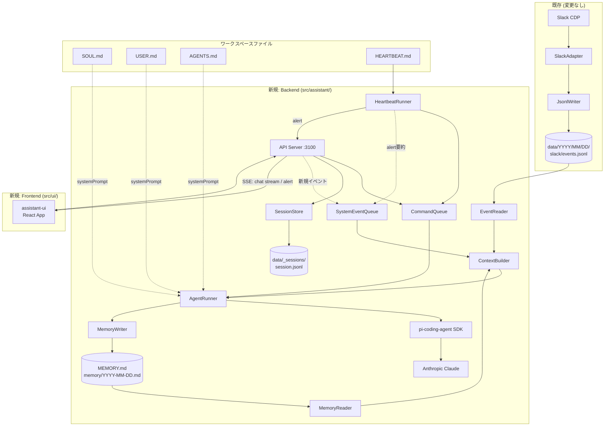
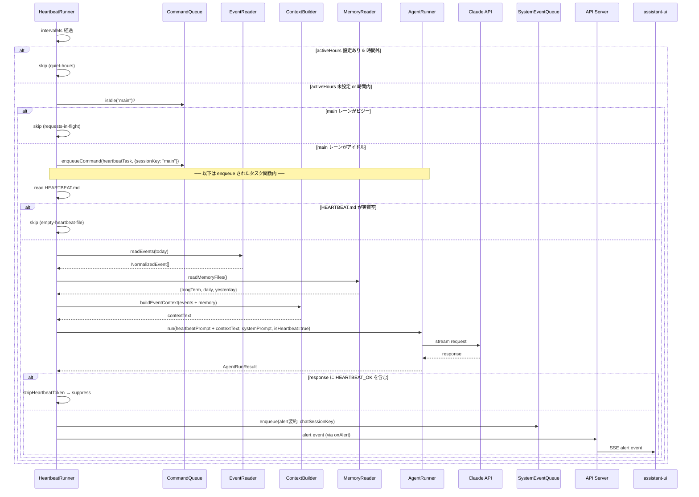
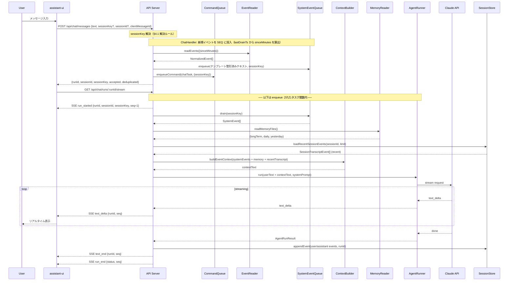
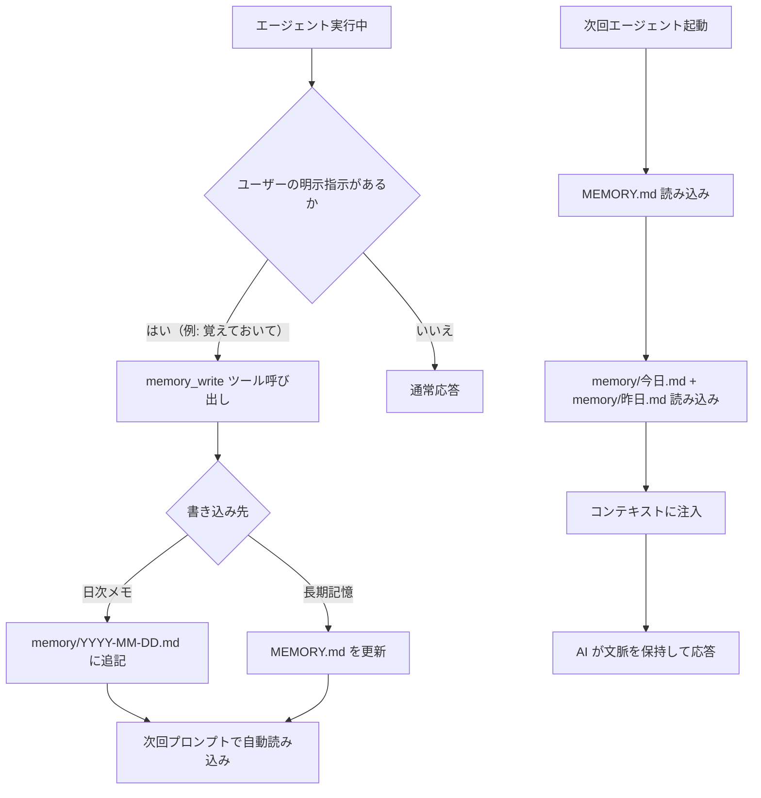
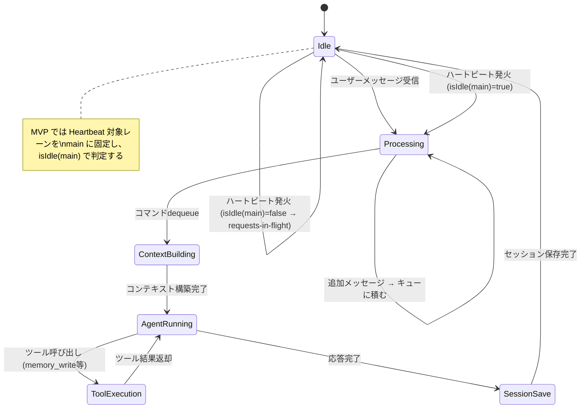

# AI Assistant MVP 要件定義

## 1. 概要と目的 Overview and Purpose

### What

Adjutant が収集済みの Slack イベント JSONL を AI に読み込ませ、プロアクティブに動作するパーソナル AI アシスタントを構築する。
OpenClaw のハートビート機構・メモリシステム・メッセージキューを参考に、定期ポーリングで「注目すべきことがあるか」を AI に判断させ、ユーザーへ通知する。
対話 UI は assistant-ui (`@assistant-ui/react`) を採用し、ブラウザ上でストリーミングチャットを提供する。

### Why

- Slack の大量メッセージから「自分に関係のある情報」を AI が自動的にピックアップする
- ユーザーが能動的にログを読む必要をなくし、重要な情報の見落としを防ぐ
- 対話形式で「あの件どうなった？」と聞ける自然なインターフェースを提供する
- AI が過去の文脈を記憶し、繰り返しの説明なしに「阿吽の呼吸」で応答する

### How

```
[既存] CDP → SlackAdapter → JSONL (data/YYYY/MM/DD/slack/events.jsonl)
                                ↓
[新規] EventReader ← JSONL ファイル読み込み
                                ↓
[新規] SystemEventQueue ← イベントをエフェメラルキューに蓄積
                                ↓
[新規] MemoryReader ← MEMORY.md / memory/YYYY-MM-DD.md 読み込み
                                ↓
[新規] ContextBuilder → AI 向けコンテキスト組み立て（イベント + メモリ）
                                ↓
[新規] HeartbeatRunner ← 定期ポーリング（OpenClaw 模倣）
          ↓                     ↓
[新規] CommandQueue ← 排他制御（ハートビートとユーザー入力の直列化）
                                ↓
[新規] AgentRunner ← pi-coding-agent SDK でセッション管理・LLM 呼び出し
          ↓                     ↓
[新規] MemoryWriter ← MEMORY.md / memory/YYYY-MM-DD.md 書き出し
                                ↓
[新規] SessionStore ← セッション履歴 JSONL 永続化
                                ↓
[新規] API Server (HTTP/SSE) ← ストリーミング応答
                                ↓
[新規] Web UI (assistant-ui) ← ブラウザ対話
```

---

## 2. 仕様と受け入れ条件

### 2.1 スコープ Scope

**今回やること:**

1. **JSONL イベント読み込みモジュール** — 日付指定で `data/YYYY/MM/DD/slack/events.jsonl` を読み、`NormalizedEvent[]` として返す
2. **システムイベントキュー** — セッション単位のエフェメラルなインメモリキューに通知テキストを蓄積し、次のエージェントプロンプトに前置き注入する（OpenClaw `system-events.ts` パターン。`sessionKey` 単位で分離し、別セッションへの混入を防ぐ）。MVP での投入元は 2 つ:（a）HeartbeatRunner がアラート生成時にチャットセッションのキューへ要約を投入（ハートビート→チャットのコンテキスト橋渡し）、（b）ChatHandler がユーザーメッセージ処理開始時に EventReader の新規イベントをテンプレート整形して投入（LLM は使わず、プログラム的に `[#channel] user: text` 形式へ変換する）。既存 CDP パイプラインへの hook は MVP では行わない
3. **AI コンテキストビルダー** — イベント配列 + メモリファイルを LLM が理解しやすいプロンプトに変換する
4. **ハートビートランナー** — 設定間隔（デフォルト 30 分）で AI にポーリングし、注目すべきイベントがあればアラートを生成する（OpenClaw `heartbeat-runner` パターン）
5. **コマンドキュー（排他制御）** — ハートビートとユーザー入力が同時に来ても直列に処理する。エージェント処理中はハートビートをスキップする。`sessionKey` 単位のレーンで分離し、異なるセッション間の混線を防ぐ（OpenClaw `CommandLane` パターン）
6. **エージェントランナー** — `@mariozechner/pi-coding-agent` SDK を使い、セッション管理・LLM 呼び出し・ストリーミングを行う
7. **メモリシステム（簡易版）** — エージェントが重要と判断した情報を `MEMORY.md`（長期）/ `memory/YYYY-MM-DD.md`（日次）に書き出す。次のプロンプトでこれらを読み込み、文脈を保持する（OpenClaw メモリパターンの簡易実装）
8. **セッション永続化** — pi-coding-agent SDK のセッション管理を正（source of truth）とする。`SessionStore` は UI 表示用のイベントログ（タイムスタンプ・role 付き）としてのみ機能し、SDK セッションと二重管理しない。JSONL ファイルに保存し、プロセス再起動後も会話を継続できるようにする
9. **ワークスペースファイル** — `HEARTBEAT.md`（チェックリスト）、`SOUL.md`（エージェントのペルソナ・口調設定）、`USER.md`（ユーザーの情報・好み）、`AGENTS.md`（運用ルール・応答ポリシー）をエージェントの動作カスタマイズに使用する
10. **ハートビート用モデル設定** — ハートビートには安価なモデル（例: GPT-4o mini, Gemini Flash）を使用し、対話には上位モデル（Claude）を使う設定を可能にする（OpenClaw モデルカスケードパターン）
11. **API サーバー** — HTTP エンドポイント + SSE ストリーミングで assistant-ui フロントエンドと接続する。メッセージ送信（POST）とストリーム取得（GET SSE）を分離する 2 段パターンを採用
12. **Web UI** — `@assistant-ui/react` を使ったチャット画面。ハートビートアラートの表示と自由対話の両方を提供する

**MVP必須（優先実装）:**

1. JSONL 読み込み + `SystemEventQueue` 前置き注入（`sessionKey` 分離）
2. `CommandQueue` による同一セッション排他と別セッション分離
3. Heartbeat コア契約（`HEARTBEAT_OK` 抑制、空ファイルスキップ、`activeHours`、重複抑止）
4. pi-coding-agent SDK 実行基盤（lock/repair/open/create/dispose）
5. 簡易メモリ（`MEMORY.md` / `memory/YYYY-MM-DD.md`）の読み書き
6. ワークスペースファイル反映（`SOUL.md` / `USER.md` / `AGENTS.md` / `HEARTBEAT.md`）
7. assistant-ui 連携の 2 段 API（`POST /api/chat/messages` + `GET /api/chat/runs/:runId/stream`）
8. Heartbeat API（`POST /api/heartbeat/run` + `GET /api/heartbeat/last`）+ 履歴取得 API（`GET /api/chat/sessions/:sessionId/messages`）

**成果物:**

- `src/assistant/` — バックエンド実装
- `src/ui/` — フロントエンド（assistant-ui ベース）
- `HEARTBEAT.md` — ハートビートチェックリスト（ユーザー設定可能）
- `SOUL.md` — エージェントのペルソナ定義（ユーザー設定可能）
- `USER.md` — ユーザー情報定義（名前、所属、好み等）
- `AGENTS.md` — ワークスペース運用ルール定義（ユーザー設定可能）
- テストコード
- この要件定義ドキュメント

**制約:**

- 既存の CDP → JSONL パイプライン (`src/slack/`, `src/io/`) には手を入れない
- LLM プロバイダーは設定で差し替え可能とし、MVPのデフォルトは Claude とする（pi-coding-agent SDK 経由）
- ベクトル検索・SQLite インデックスは導入しない（メモリファイルは全文読み込み）

### 2.2 非スコープ Non Scope

- GitHub / git-local イベントの取り込み
- ベクトル DB / SQLite によるセマンティック検索（将来: sqlite-vec + FTS5 のハイブリッド検索。OpenClaw はベクトル 70% + BM25 30% の加重平均）
- 自動メモリフラッシュ / 事前圧縮フラッシュ（将来: コンテキスト 80% 超過時にサイレントターンで重要事実を MEMORY.md に退避。OpenClaw `compaction.memoryFlush` パターン）
- 回転型ハートビート（将来: 全チェックではなく「最も overdue なタスク」を 1 つだけ実行する最適化）
- Cron ジョブ / 外部 Webhook トリガー（ハートビートのみで MVP は十分）
- ユーザー認証・マルチテナント
- モバイル対応
- Slack への書き戻し（メッセージ送信）等の外部副作用の実行。MVP ではアラート・提案の生成のみ

**今回延期（MVP+）:**

- セッション切り替え UI（初版は単一セッション固定で可）

### 2.3 ユースケース Use Cases

**UC-1: ハートビートによるプロアクティブ通知**
1. ハートビートタイマーが発火する（30 分間隔）
2. `activeHours` 設定がある場合、現在時刻が時間外であればスキップする（quiet-hours）
3. Heartbeat 対象レーン（MVP既定: `sessionKey="main"`）がアイドルであることを `isIdle("main")` で確認する。ビジー時は `requests-in-flight` としてスキップし、1 秒後に再試行する
4. `sessionKey` がグループセッションを指す場合は Heartbeat を実行しない（MVP では無効）
5. HEARTBEAT.md を読み込み、実質空であればモデル呼び出しなしでスキップする（AC-09）
6. JSONL から「直近 N 分 + 上限件数」でイベント窓を読み込む
7. HEARTBEAT.md のチェックリスト + systemPrompt（SOUL.md + USER.md + AGENTS.md）+ メモリファイルとイベントを AI に渡す
8. AI が「注目すべきこと」を判断する
   - 何もなければ `HEARTBEAT_OK` を返し、UI には通知しない（出力抑制）
   - 注目事項があればアラートテキストを生成し、API Server 経由で UI に SSE push する
9. アラート生成時、チャットセッションの SystemEventQueue にアラート要約を投入する（UC-3 フォローアップ用）
10. ハートビートの実行は内部的なものであり、セッションの「最終活動時刻」を更新しない

**UC-2: ユーザーからの対話クエリ**
1. ユーザーが UI のチャット欄に「今日の #general で何が話されてた？」と入力する
2. ChatHandler が EventReader で新規イベントを取得し、テンプレート整形して SystemEventQueue に投入する。その後リクエストをコマンドキューに投入する
3. タスク関数内で SystemEventQueue を drain し、MEMORY.md と合わせてコンテキストを構築する
4. AI がストリーミングで回答する
5. assistant-ui がリアルタイムで表示する
6. 対話履歴がセッション JSONL に追記保存される

**UC-3: アラートへのフォローアップ（Human-in-the-Loop）**
1. ハートビートアラートが UI に表示される（例：「#incident に障害報告がありました。詳細を確認しますか？」）
2. ユーザーがアラートに対して「詳しく教えて」と返信する
3. AI がセッション履歴 + メモリを参照し、追加の詳細を返す
4. **MVP では外部副作用（Slack への書き戻し、メール送信等）は実行しない**。提案テキストと追加説明の提示に限定する

**UC-4: メモリの蓄積と活用**
1. 対話の中でユーザーが「この件は覚えておいて」と指示する
2. AI が memory/YYYY-MM-DD.md に情報を書き出す
3. 後日、ユーザーが「あの件の進捗は？」と聞くと、AI がメモリから文脈を復元して回答する

**メモリ書き込みガード:** メモリへの書き込みは **明示的なユーザー発話トリガー時のみ** 許可する。ハートビートによる自動実行時はメモリ書き込みツールを無効化し、意図しないメモリ汚染を防ぐ。具体的には `AgentRunOptions.isHeartbeat === true` の場合、`memory_write` ツールをツールリストから除外する

**UC-5: セッション継続**
1. プロセスを再起動する
2. SDK の SessionManager が自身のセッションファイルを読み込み、LLM 向けの会話コンテキストを復元する（source of truth）
3. SessionStore（表示用ログ）を読み込み、UI にメッセージ履歴を表示する
4. ユーザーが「さっきの続き」と言えば、SDK セッション由来の文脈で応答する

### 2.4 受け入れ条件 Acceptance Criteria

この節の AC 番号は `doc/mvp-proactive-assistant-requirements.md` の `AC-01..AC-22` に一致させる。

**AC-01: Slackイベント保存**
- Slack イベントが `adjutant.event.v1.1` 形式で JSONL に追記保存される

**AC-02: JSONL文脈注入**
- AI 応答時に JSONL 由来のイベント窓が入力コンテキストへ取り込まれる

**AC-03: SDK実行手順準拠**
- OpenClaw 準拠の SDK 実行手順（lock→open→create→subscribe→dispose）を満たす

**AC-04: 同一sessionKey排他**
- 同一 `sessionKey` で同時実行が発生しない

**AC-05: sessionKey分離**
- 異なる `sessionKey` 間でコンテキストが混線しない

**AC-06: 失敗時再試行**
- 一時失敗時に 1 回再試行/切り詰め再試行が機能する

**AC-07: HEARTBEAT_OK抑制**
- `HEARTBEAT_OK` 抑制時は `HeartbeatRunResult.status: "ran"` を維持し、`HeartbeatEventPayload.status: "ok-token" | "ok-empty"` が記録される

**AC-08: Heartbeatアラート通知**
- 注目イベント時に Heartbeat アラートが通知される

**AC-09: 空HEARTBEATスキップ**
- `HEARTBEAT.md` 実質空で `status: "skipped"` になる（モデル呼び出しなし）

**AC-10: トランスクリプト永続化**
- セッショントランスクリプトが `sessionId/sessionKey/runId` 付きで JSONL 永続化される

**AC-11: メモリ書き込みガード**
- 明示指示時のみメモリ書き込みされ、次回ターンで再利用される。Heartbeat 実行時は書き込まれない

**AC-12: SOUL反映**
- `SOUL.md` が通常対話/Heartbeat の応答方針に反映される

**AC-13: SystemEventQueue注入/排出**
- SystemEventQueue が `sessionKey` ごとに注入・drain される

**AC-14: UI表示とHeartbeat状態表示**
- `assistant-ui` でストリーミング表示され、`run_end` で完了確定して履歴保存される。`text_delta` が 0 件でも `text_end.text` で本文表示を更新できる。`main` セッションの Heartbeat 状態は `GET /api/heartbeat/last` ポーリングで更新表示される

**AC-15: メモリ参照（通常/Heartbeat）**
- 通常対話/Heartbeat の両方で `MEMORY.md` と当日・前日メモが入力コンテキストへ取り込まれる

**AC-16: 重複通知抑制**
- 24時間以内の同一 Heartbeat 本文は `reason: "duplicate"` で抑制され、`HeartbeatRunResult.status: "ran"` を維持する

**AC-17: トランスクリプト直近窓注入**
- AI 実行時にセッショントランスクリプト直近窓が入力へ取り込まれ、再開時の文脈復元に利用される

**AC-18: readiness失敗の記録**
- アラート配信前の readiness 失敗時に `HeartbeatRunResult.status: "skipped"` と `HeartbeatEventPayload.status: "skipped"` が記録される。`ok-token`/`ok-empty` の可視化判定側 readiness 失敗は `HeartbeatRunResult.status: "ran"` と `HeartbeatEventPayload.status: "ok-token" | "ok-empty"` を維持する

**AC-19: 終端一意性**
- 致命的エラー時は `error` を診断用に送出しつつ、最終的に `run_end(status: "failed")` で終端する（`run_end` は `runId` ごとに 1 回）

**AC-20: Current time注入**
- Heartbeat 送信 Body 末尾に `Current time: <formattedTime> (<userTimezone>)` 行が注入され、同一実行で重複挿入されない

**AC-21: 冪等再送**
- 同一 `sessionKey` + `clientMessageId` 再送時は冪等処理され、既存 `runId` を返して重複 run を作らない

**AC-22: requests-in-flight再試行**
- `requests-in-flight` 時は `status: "skipped"` で記録され、1秒後再試行が行われる

**補助検証（トレーサビリティ外）**
- P-01: `pnpm run assistant` で API サーバーと Web UI が起動し、チャット画面が表示される
- P-02: `pnpm run check` が成功し、既存 Slack 収集パイプラインに破壊的変更がない
- P-03: グループセッションを Heartbeat 対象に指定した場合、Heartbeat は実行されず `status: "skipped"`（`reason: "group-session-disabled"`）となる

### 2.5 既知の制約 Known Limitations

- メモリファイルは全文読み込み（ベクトル検索なし）。ファイルが大きくなるとコンテキストウィンドウを圧迫する
- JSONL の窓読み（sinceMinutes + limit）で運用するため、古い文脈の取りこぼしが発生する可能性がある
- ハートビート重複排除はセッションストア（`lastHeartbeatText` / `lastHeartbeatSentAt`）に依存するため、セッション単位の精度となる
- セッションコンパクション（自動要約・圧縮）は未実装。履歴が長くなると手動で `/new` 相当の操作が必要
- 実行中の run をキャンセルする abort API は未実装（OpenClaw は `chat.abort` を提供）。長時間実行が発生した場合はプロセス再起動で対応
- pi-coding-agent SDK のバージョンに依存する

### 2.6 セキュリティ Security

- API サーバーは既定で `127.0.0.1` にのみバインドし、外部公開を前提にしない
- Slack トークンや個人情報を UI ログ・SSE レスポンスに平文表示しない
- JSONL を外部共有する場合はマスキング手順を用意する（MVP では手動）
- 副作用ツールを将来有効化する場合は、実行先を制限したサンドボックスを推奨する

### 2.7 可観測性 Observability

- Heartbeat 実行結果（status, modelId, contentHash）をイベントログに記録し、コスト分析・デバッグを可能にする
- セッション単位で run の状態遷移をログに記録する（開始・完了・失敗・リトライ）
- SystemEventQueue の drain 件数をログに残し、キュー滞留の検知に使う

### 2.8 性能目標 Performance

- 通常チャット応答の初回トークン開始を **5 秒以内**（ローカル開発環境）を目標とする
- ハートビート 1 回あたりの LLM 呼び出しは 30 秒以内に完了すること（タイムアウト上限）

### 2.9 順序保証 Ordering

- 同一セッション内のイベントは、SessionStore への保存順と UI 表示順が一致すること
- CommandQueue 内の待ち行列は投入順（FIFO）を維持すること
- SSE ストリームでは全公開イベントに `seq`（runId ごとの 1..N 連番）を付与し、クライアント側で欠落・逆転を検知可能にすること

---

## 3. 前提技術スタック

- **Language**: TypeScript 5.x, ESM
- **Runtime**: Node.js (tsx)
- **AI SDK**: `@mariozechner/pi-coding-agent`（セッション管理: `createAgentSession`, `SessionManager`）、`@mariozechner/pi-ai`（LLM 呼び出し: `streamSimple`）
- **LLM**: Anthropic Claude (pi-coding-agent 経由)。ハートビートには安価なモデル（GPT-4o mini 等）を設定可能（モデルカスケード）
- **Frontend**: `@assistant-ui/react` + React 19
- **Bundler/Dev**: Vite（フロントエンド用）
- **API**: Node.js HTTP サーバー + SSE ストリーミング
- **Testing**: Node.js `--test` モジュール（既存と同じ）
- **Style Guide**: 既存の Prettier / ESLint 設定に準拠

---

## 4. インターフェース契約

### 4.1 モジュール境界

#### EventReader

```typescript
// src/assistant/event-reader.ts
export type ReadEventsOptions = {
  dataDir: string;
  date?: string;        // "YYYY-MM-DD" (default: today)
  kinds?: string[];     // filter by event kind
  channels?: string[];  // filter by channel_id
  sinceMinutes?: number; // 直近 N 分以内のイベントのみ (default: 60)
  limit?: number;        // 最大取得件数、新しい順に切り詰め (default: 200)
};

export function readEvents(opts: ReadEventsOptions): Promise<NormalizedEvent[]>;
```

#### SystemEventQueue

```typescript
// src/assistant/system-event-queue.ts
// OpenClaw の system-events.ts パターンを簡易実装。
// 次のプロンプト構築時に drain して前置き注入する。
//
// --- MVP での投入元 ---
// 1. HeartbeatRunner: アラート生成時に、要約テキストをチャットセッションの
//    キューに投入する（ハートビート → チャット間のコンテキスト橋渡し）。
//    これにより UC-3 フォローアップ時にアラート文脈が自動で利用可能になる。
// 2. ChatHandler (API Server): ユーザーメッセージ処理開始時に、
//    EventReader で前回 drain 以降の新規イベントをテンプレート整形してキューに投入する（LLM は使わない）。
//    投入判定: 前回 drain 時刻（sessionKey 単位で保持）より新しいイベントのみ。
// ※ 既存 CDP → JSONL パイプラインへの直接 hook は MVP では行わない。
//    リアルタイム投入（file watcher / pipeline hook）は §10 次フェーズ候補。

// SystemEvent はキュー格納要素の最小型。ルーティング情報は含めない（OpenClaw 準拠）。
export type SystemEvent = {
  text: string;
  ts: number;  // epoch ms
};

// enqueue 時のオプション。sessionKey は必須のルーティングキー。
// contextKey は SessionQueue 側の補助状態（lastContextKey）としてのみ保持し、
// SystemEvent 本体には格納しない。
export type SystemEventEnqueueOptions = {
  sessionKey: string;  // 必須（ルーティングキー）
  contextKey?: string; // 同一文脈判定用キー（任意）
};

// --- キュー制約 ---
// - セッション単位の FIFO キュー。最大 MAX_EVENTS = 20 件。超過時は古い方を破棄する
//   （OpenClaw system-events.ts:7 準拠）
// - 連続する同一テキストのイベントはドロップする（連続重複排除）
//   前回 enqueue されたテキストと同一の場合は無視して蓄積しない
//   （OpenClaw system-events.ts:69-71 準拠）
// - drain 後はキューを空にし、lastText をリセットする
// - contextKey を使って文脈変化を検知できるようにする（任意）
//   （OpenClaw isSystemEventContextChanged パターン）

export function enqueueSystemEvent(event: SystemEvent, opts: SystemEventEnqueueOptions): void;
export function drainSystemEvents(sessionKey: string): SystemEvent[];
export function peekSystemEvents(sessionKey: string): SystemEvent[];
export function hasSystemEvents(sessionKey: string): boolean;
// isSystemEventContextChanged: HeartbeatRunner がアラート生成後にチャットセッションの
// キューに投入した要約が、直前のハートビートと同一文脈かを判定する際に使用する。
// contextKey にはハートビートの contentHash を渡し、文脈変化時のみ再投入する。
// MVP では任意実装（なくても動作する）。将来のリアルタイム投入で本格利用。
export function isSystemEventContextChanged(
  sessionKey: string,
  contextKey?: string,
): boolean;
```

#### ContextBuilder

```typescript
// src/assistant/context-builder.ts
//
// --- 責務境界 ---
// ContextBuilder は「動的コンテキスト」
// （イベント + メモリ + SystemEvent + セッショントランスクリプト直近窓）を組み立てる。
// 「静的ペルソナ」（SOUL.md / USER.md / AGENTS.md）は ContextBuilder の管轄外。
// 静的ペルソナは呼び出し元が直接読み込み、AgentRunOptions.systemPrompt に渡す。
// これにより ContextBuilder は純粋な「データ → プロンプトテキスト」変換に集中できる。
//
// --- フロー別の使い分け ---
// ハートビートフロー: events = EventReader 結果, systemEvents = 空, recentTranscript = 空
//   → HB が直接 EventReader を呼び、生イベントをコンテキストに含める
// チャットフロー:     events = 空,             systemEvents = SEQ drain 結果, recentTranscript = SessionStore 直近窓
//   → ChatHandler が EventReader → テンプレート整形 → SEQ 投入済み。
//     呼び出し元（ChatHandler）が SEQ を drain し、SessionStore 直近窓と合わせて ContextBuilder に渡す
// 両パラメータを同時に渡さないことで、イベント情報の重複注入を防ぐ。

export type ContextBuildOptions = {
  events: NormalizedEvent[];         // ハートビートフロー用（チャットフローでは空配列）
  systemEvents?: SystemEvent[];     // チャットフロー用（ハートビートフローでは省略）
  recentTranscript?: SessionTranscriptEvent[]; // FR-06: セッショントランスクリプト直近窓
                                               // payload からの表示/要約用投影は ContextBuilder 側で行う
  memoryContent?: string;           // MEMORY.md の内容
  dailyMemoryContent?: string;      // memory/YYYY-MM-DD.md の内容 (today)
  yesterdayMemoryContent?: string;   // memory/YYYY-MM-DD.md の内容 (yesterday)
  maxTokenEstimate?: number;        // 概算トークン上限 (default: 8000)
};

export type ContextBuildResult = {
  text: string;          // LLM プロンプトに挿入可能なテキストブロック
  truncated: boolean;    // トークン上限による切り詰めが発生したか
  eventCount: number;    // 含まれたイベント数
};

export function buildEventContext(opts: ContextBuildOptions): ContextBuildResult;
```

#### CommandQueue

```typescript
// src/assistant/command-queue.ts
// OpenClaw の CommandLane パターンを簡易実装。
// sessionKey 単位のレーンでエージェント実行を直列化し、同時実行・セッション混線を防ぐ。

export type CommandFn<T> = () => Promise<T>;

export type CommandQueueOptions = {
  sessionKey: string;  // セッション単位のレーン分離
};

export function enqueueCommand<T>(fn: CommandFn<T>, opts: CommandQueueOptions): Promise<T>;
export function getQueueSize(sessionKey: string): number;
export function isIdle(sessionKey: string): boolean;
export function isGlobalIdle(): boolean;  // 補助API（MVP Heartbeat 判定は isIdle("main") を使用）
```

#### HeartbeatRunner

```typescript
// src/assistant/heartbeat-runner.ts
export type HeartbeatConfig = {
  intervalMs: number;         // default: 1800000 (30m)
  timeoutMs?: number;         // default: 30000 (§2.8: HB 1 回あたりの LLM タイムアウト上限)
  sessionKey?: string;        // default: "main"（MVP既定。グループセッションは無効）
  chatSessionKey?: string;    // default: "main"（アラート要約を投入する先のチャットセッション）
  heartbeatFilePath: string;  // default: "HEARTBEAT.md"
  soulFilePath: string;       // default: "SOUL.md"
  userFilePath: string;       // default: "USER.md"
  agentsFilePath: string;     // default: "AGENTS.md"
  dataDir: string;
  timezone: string;           // default: USER.md の timezone / 未設定時はホスト環境
  retryDelayMs?: number;      // default: 1000 (requests-in-flight 時の短周期再試行)
  maxRetries?: number;        // default: 10 (requests-in-flight 再試行の上限回数。超過時は次周期待ち)
  ackMaxChars: number;        // default: 300 (HEARTBEAT_OK 判定閾値)
  showOk?: boolean;           // default: false
  showAlerts?: boolean;       // default: true
  useIndicator?: boolean;     // default: true
  model?: string;             // ハートビート用モデル（省略時はデフォルトモデル）
                              // コスト最適化: 安価なモデルを指定可能
  activeHours?: {             // アクティブ時間帯設定（省略時は常時有効）
    start: string;            // 開始時刻 "HH:MM"（例: "09:00"）
    end: string;              // 終了時刻 "HH:MM"（例: "22:00"、"24:00" 可。start > end で深夜跨ぎ）
    timezone?: string;        // "user"（USER.md の timezone）| "local"（ホスト環境）| IANA タイムゾーン名
  };                          // OpenClaw heartbeat-active-hours.ts 準拠
};

// HeartbeatRunResult は判別共用体（discriminated union）とする。
// status ごとに有効なフィールドが型で確定し、実装ミスを防ぐ。
export type HeartbeatRunResult =
  | {
      status: "ran";
      durationMs: number;
      alert?: string;        // アラートテキスト（抑制時は undefined）
      contentHash?: string;  // ログ・可観測性用（重複排除は lastHeartbeatText で行う）
      modelId?: string;      // 使用モデル ID（コスト分析用）
    }
  | {
      status: "skipped";
      reason: string;        // OpenClaw 準拠: alerts-disabled / readiness の詳細理由を含む
    }
  | {
      status: "failed";
      reason: string;
    };

// HeartbeatEventPayload は通知・抑制種別のイベントログ型。
// HeartbeatRunResult は「実行結果」、HeartbeatEventPayload は「通知/抑制の詳細ログ」として責務分離する。
// to, channel, accountId, hasMedia, silent は OpenClaw マルチチャネル通知との互換用。
// Adjutant MVP（Web UI のみ）では undefined のまま省略してよい。
export type HeartbeatEventPayload = {
  ts: number; // epoch ms
  status: "sent" | "ok-empty" | "ok-token" | "skipped" | "failed";
  reason?: string;
  to?: string;
  channel?: string;
  accountId?: string;
  preview?: string;
  durationMs?: number;
  hasMedia?: boolean;
  silent?: boolean;
  indicatorType?: "ok" | "alert" | "error";
};

// HeartbeatRunRecord は実行結果の監査用レコード。
// HeartbeatEventPayload（通知/抑制ログ）とは別に保存し、モデル呼び出し回数の追跡に使う。
export type HeartbeatRunRecord = {
  schema: "adjutant.heartbeat.result.v1";
  runAt: string;    // ISO8601
  sessionId?: string;
  sessionKey?: string;
  result: HeartbeatRunResult;
  modelId?: string;
  preview?: string;
};

// --- 重複排除仕様 ---
// - キー: 直前送達テキスト（セッションストアの lastHeartbeatText）
// - ウィンドウ: 24 時間（lastHeartbeatSentAt との差分で判定）
// - 保持: セッションストアに永続化（プロセス再起動後も有効）
// - 判定タイミング: stripHeartbeatToken() 後、UI 送信前
//   → モデルは呼び出し済みのため HeartbeatRunResult { status: "ran", durationMs: ... } を返し、
//     HeartbeatEventPayload でも status: "skipped", reason: "duplicate" を記録
//   （OpenClaw heartbeat-runner.ts:646 準拠: 重複検出時も status: "ran"）
//
// --- Current time 注入仕様 ---
// Heartbeat 実行時の送信 Body 末尾に以下の1行を注入する（時刻依存判断の安定化）:
//   Current time: <formattedTime> (<userTimezone>)
// 送信 Body にすでに "Current time:" 行が含まれる場合、同一実行で重複挿入しない。
// timezone は HeartbeatConfig.timezone を使用する。
// （OpenClaw heartbeat-runner.ts 準拠）
//
// --- requests-in-flight 再試行仕様 ---
// - requests-in-flight で skipped になった場合は、そのまま次周期待ちにせず短時間で再試行する
// - 既定再試行間隔: retryDelayMs=1000ms
// - 再試行上限: maxRetries=10（既定）。超過時は当該周期を諦め次の定期周期まで待機する
//   ※ OpenClaw heartbeat-wake.ts は上限なし（無限リトライ）だが、
//     MVP では常時ビジー時の CPU 浪費を防ぐため上限を設ける。
//   （OpenClaw heartbeat-wake.ts:39-43 ベース）

// --- stripHeartbeatToken 仕様 ---
// HEARTBEAT_OK トークンの検出時、以下のマークアップ正規化を事前に行う
// （OpenClaw heartbeat.ts:121-129 準拠）:
//   1. HTML タグを除去 (<b>HEARTBEAT_OK</b> → HEARTBEAT_OK)
//   2. &nbsp; を空白に変換
//   3. 先頭・末尾の Markdown 修飾文字 (*`~_) を除去 (**HEARTBEAT_OK** → HEARTBEAT_OK)
// 正規化後のテキストから HEARTBEAT_OK を先頭/末尾で繰り返し除去し、
// 残テキストが ackMaxChars 以下なら shouldSkip=true とする。
//
// --- 可視性設定 ---
// showOk / showAlerts / useIndicator がすべて false の場合は、
// Heartbeat 自体を実行しない（モデル呼び出しなし）。

export function startHeartbeat(
  config: HeartbeatConfig,
  onAlert: (result: HeartbeatRunResult) => void,
): { stop: () => void };
```

#### AgentRunner

AgentRunner は以下のサブ要件を満たす。各要件は受け入れ条件と対応する。

| サブ要件 | 内容 | 対応 AC |
|----------|------|---------|
| **FR-AG-1** | OpenClaw 準拠の SDK 利用手順（下記 6 ステップ）を遵守する | AC-03 |
| **FR-AG-2** | 最終回答と途中イベント（ツール実行・推論メタ情報）を分離し、部分応答の順序保証を行う | AC-14 / AC-19 |
| **FR-AG-3** | 一時失敗（通信/HTTP 系）は 2.5 秒待機後に 1 回再試行。コンテキスト超過時は切り詰めて再試行 | AC-06 |
| **FR-AG-4** | セッションファイル破損を検知し修復/退避できる設計とする | AC-03 |

```typescript
// src/assistant/agent-runner.ts
// pi-coding-agent の createAgentSession / activeSession.prompt を使用。
//
// --- FR-AG-1: SDK 利用手順（OpenClaw 規範実装に準拠）---
// 実行フローは以下の順序を満たすこと:
//   1. セッションファイルの排他ロックを取得する
//      （同一セッションファイルへの同時書き込み防止。CommandQueue の論理排他とは別層の物理防御）
//   2. セッションファイルの修復/事前準備を行い、SessionManager を開く（既存セッション再利用 or 新規作成）
//   3. SettingsManager を生成（モデル・ツール等の実行設定を反映）
//   4. createAgentSession で実行セッションを構築
//   5. 購読層でストリーミングイベントを受け取り、UI 向けに整形（FR-AG-2）
//   6. 実行終了時にセッションを確定・解放
// 例外発生時もセッション後処理（flush/dispose + ロック解放）を finally 相当で必須とする（FR-AG-4）。
//
// 参照: vendor/openclaw/src/agents/pi-embedded-runner/run/attempt.ts

export type AgentRunOptions = {
  runId: string;               // 一意な実行 ID。呼び出し元が事前生成して渡す。
                                //   2 段 API パターン: POST レスポンスで runId を返却後、
                                //   CQ にエンキューされたタスク内で AgentRunner に渡す。
                                //   SSE ストリームのルーティングに使用する。
  prompt: string;
  systemPrompt?: string;       // 静的ペルソナ（SOUL.md + USER.md + AGENTS.md を結合したテキスト）。
                                //   呼び出し元が読み込み・結合して渡す。ContextBuilder の管轄外。
                                //   SDK の system prompt として LLM に送信される。
  sessionKey: string;
  sessionId?: string;          // UI 表示用の会話ID（必要時）
  isHeartbeat?: boolean;       // true の場合:
                                //   - updatedAt を復元する（SDK 実行前の値を保存し、
                                //     実行後に restoreHeartbeatUpdatedAt() で戻す。
                                //     並行更新があった場合は Math.max で新しい方を保持する。
                                //     OpenClaw heartbeat-runner.ts:343 準拠）
                                //   - memory_write ツールを無効化（メモリ書き込みガード）
  model?: string;              // 使用する LLM モデル（省略時はデフォルトモデル）。
                                //   HeartbeatRunner がモデルカスケード設定（HeartbeatConfig.model）を
                                //   ここに渡すことで、安価なモデルでの実行が可能になる。
                                //   SettingsManager 生成時に反映される。
  onTextDelta?: (delta: string) => void;
  onToolCall?: (name: string, params: unknown) => void;
};

export type AgentRunResult = {
  runId: string;               // AgentRunOptions.runId をそのまま返す（呼び出し元との紐付け用）
  text: string;
  toolCalls?: Array<{ name: string; result: unknown }>;
};

export function runAgent(opts: AgentRunOptions): Promise<AgentRunResult>;
```

#### MemoryReader

```typescript
// src/assistant/memory-reader.ts
// メモリファイルの読み込みを担当。ContextBuilder へのメモリ注入に使用する。

export type MemoryReadOptions = {
  workspaceDir: string;
  timezone: string;  // default: USER.md の timezone / 未設定時はホスト環境
};

export function readMemoryFiles(opts: MemoryReadOptions): Promise<{
  longTerm: string | null;      // MEMORY.md
  daily: string | null;         // memory/YYYY-MM-DD.md (today)
  yesterday: string | null;     // memory/YYYY-MM-DD.md (yesterday)
}>;
```

#### MemoryWriter

```typescript
// src/assistant/memory-writer.ts
// エージェントのツールとして登録し、AI が判断して書き出す。

export type MemoryWriteOptions = {
  workspaceDir: string;
  timezone: string;  // default: USER.md の timezone / 未設定時はホスト環境
};

// memory/YYYY-MM-DD.md に追記
export function appendDailyMemory(content: string, opts: MemoryWriteOptions): Promise<void>;

// MEMORY.md を更新（上書き）
export function updateLongTermMemory(content: string, opts: MemoryWriteOptions): Promise<void>;
```

#### SessionStore（表示用イベントログ）

```typescript
// src/assistant/session-store.ts
// UI 表示用のイベントログ。JSONL 形式で対話イベントを記録する。
//
// ⚠️ セッション管理の正（source of truth）は pi-coding-agent SDK が担う。
// SessionStore は SDK セッションとは独立した「表示用ログ」として機能し、
// UI でのメッセージ一覧表示・タイムスタンプ表示に使用する。
// SDK セッションの復元・コンパクション・ツール状態管理は SDK に委譲する。

// イベント種別（将来の索引化を見据えた分類）
export type SessionEventType =
  | "user_message"
  | "assistant_message"
  | "tool_call"        // payload: { name: string, params: unknown }
  | "tool_result"      // payload: { name: string, result: unknown }
  | "system_event";    // payload: { source: string }

// 永続化する JSONL の 1 行（FR-06 要件準拠）。
export type SessionTranscriptEvent = {
  schema: "adjutant.session.event.v1";
  sessionId: string;
  sessionKey: string;
  runId: string;
  ts: string; // ISO8601
  type: SessionEventType;
  payload: Record<string, unknown>;
};

// UI 表示のために SessionTranscriptEvent から投影した表示モデル。
export type SessionMessage = {
  type: SessionEventType;
  role: "user" | "assistant" | "system";  // 後方互換・簡易フィルタ用
  content: string;
  ts: string;
  sessionId: string;
  sessionKey: string;
  runId: string;
  isHeartbeat?: boolean;
  payload?: Record<string, unknown>;  // type 固有の構造化データ
};

export type SessionStoreOptions = {
  sessionDir: string;  // default: "data/_sessions/"
  sessionId: string;
};

export function appendEvent(
  evt: SessionTranscriptEvent,
  opts: SessionStoreOptions,
): Promise<void>;
export function loadSessionEvents(opts: SessionStoreOptions): Promise<SessionTranscriptEvent[]>;
export function loadMessages(opts: SessionStoreOptions): Promise<SessionMessage[]>;
export function loadRecentSessionEvents(
  opts: SessionStoreOptions & { limit: number },
): Promise<SessionTranscriptEvent[]>;
export function listSessions(sessionDir: string): Promise<string[]>;
```

#### API Server

```typescript
// src/assistant/api-server.ts
//
// assistant-ui との統合を考慮し、メッセージ送信（POST）と
// ストリーミング取得（GET SSE）を分離する 2 段パターンを採用する。
// これにより assistant-ui の useExternalStoreRuntime や
// カスタム Runtime との接続が容易になる。

// --- チャット ---

// POST /api/chat/messages — ユーザーメッセージ送信、run を作成
// Request:  { text: string, sessionId?: string, sessionKey?: string, clientMessageId: string }
// Response: { runId: string, sessionId: string, sessionKey: string, accepted: true, deduplicated: boolean }
//   → コマンドキュー経由で直列化。run は非同期で実行開始される。
//   → clientMessageId は冪等キー。同一 (sessionKey, clientMessageId) の再送は
//     冪等 TTL（既定 300 秒）内であれば既存 runId を返し、新規キュー投入しない。
//     deduplicated: true の場合は既存 run への合流を示す。
//
// --- sessionKey 解決ルール ---
// 外部 API は sessionId/sessionKey の両方を受け付けるが、
// 実行前に必ず sessionKey へ解決してからキュー投入する。
// 優先順:
//   1. sessionKey 指定時はそれを優先
//   2. sessionId のみ指定時は sessionId → sessionKey を引いて解決
//   3. 両方指定で不整合な場合は 400 Bad Request
//   4. どちらも未指定時は "main" 用の既定 sessionKey を採用し、
//      必要に応じて新規 sessionId を採番

// GET /api/chat/runs/:runId/stream — 指定 run の SSE ストリーム
// Response: SSE stream (text/event-stream)
//   event: run_started  data: { runId: string, sessionId: string, sessionKey: string, seq: number }
//   event: text_delta   data: { runId: string, delta: string, seq: number }
//   event: tool_call    data: { runId: string, toolCallId: string, name: string, params: object, seq: number }
//   event: tool_result  data: { runId: string, toolCallId: string, name: string, isError: boolean, result: unknown, seq: number }
//   event: text_end     data: { runId: string, text: string, seq: number }
//   event: run_end      data: { runId: string, status: "completed" | "failed", seq: number }
//   event: error        data: { runId: string, message: string, seq: number }
//
// --- 内部→公開 SSE 変換ルール（OpenClaw 参照）---
// pi-coding-agent SDK の内部イベントを公開 SSE へ変換する規則:
//   stream: "lifecycle", phase: "start"       → run_started
//   stream: "assistant" の増分                → text_delta
//   stream: "tool", phase: "start"            → tool_call
//   stream: "tool", phase: "result"           → tool_result
//   アシスタント最終本文確定（message_end 相当）→ text_end
//   stream: "lifecycle", phase: "end"         → run_end (status: "completed")
//   stream: "lifecycle", phase: "error"       → run_end (status: "failed")
//   実行例外/購読例外 → error（診断用）送出後、必ず run_end (status: "failed") で終端
// tool_call と tool_result の相関は toolCallId で行い、同一 run 内で同名ツールが
// 複数回呼ばれても突合可能にする。
// compaction / thinking など MVP 非対応ストリームは公開 SSE へ流さず、
// デバッグログにのみ残す。
// tool_call / tool_result は公開 SSE として流れるが、MVP UI では表示必須としない
// （受信して無視可）。
//
// --- seq 連番 ---
// seq は runId ごとに 1..N の連番で再採番する。
// クライアントは seq の欠落・逆転を検知して順序保証の確認に使用できる。
//
// --- run 終了 ---
// text_end は本文確定イベント。runId ごとに 1 回のみ送信する。
// 非ストリーミングモデルでは text_delta が 0 件のまま text_end のみ到着しうるため、
// クライアントは text_end.text 単独で本文表示を更新できること。
// run_end が run の唯一の終端イベント。runId ごとに 1 回のみ送信する。
// 重複終端を検出した場合、2 件目以降は公開 SSE へ送らず内部診断ログに記録する。
// text_end は本文確定イベントであり、終端判定には使わない。
// error は診断用イベントであり、終端判定には使わない。
// 致命的エラー時は error を送出した後、必ず run_end(status: "failed") で終端する。
// run_end 送信後、サーバーは SSE 接続を閉じる。
//
// --- keepalive ---
// サーバーは 15 秒間隔で SSE コメント行（`: ping\n\n`）を送信する。
// クライアントはコメント行を無視してよい（OpenClaw signal/client.ts 準拠）。
//
// --- 再接続ポリシー ---
// クライアントは接続断時に指数バックオフで再接続を試行する。
// （OpenClaw reconnect.ts 準拠: initial=2s, max=30s, factor=1.8, jitter=25%, maxAttempts=12）
// 再接続後、run が既に完了していた場合は run_end を即送信して閉じる。
//
// --- stream 未接続時 ---
// クライアントが SSE 接続する前に run が完了した場合、
// 接続時に完了済みの run_end を即座に送信して閉じる。結果は SessionStore にも記録済み。
//
// --- 順序保証 ---
// SSE は HTTP/1.1 単一接続で送信順 = 受信順が保証される。
// 全公開 SSE イベントに seq（runId 単位の連番）を付与し、送信順序の検証を可能にする。
// 同一セッション内のイベントは、SessionStore への保存順と UI 表示順が一致すること。

// --- ハートビート ---

// POST /api/heartbeat/run — Heartbeat 実行（手動/定期）
// Request:  { mode: "now" | "scheduled" }
// Response: HeartbeatRunResult
//
// GET /api/heartbeat/last — 最新ハートビート結果取得（ポーリング）
// Response: HeartbeatEventPayload | null
//   - MVP は "main" セッションの最新イベントを返す
//   - クライアントは 3 秒間隔でポーリングする（OpenClaw UI debug poll 準拠）
//   - sessionKey 指定での取得は MVP 対象外（将来拡張）
//
// GET /api/chat/sessions/:sessionId/messages — 表示用履歴取得
// Response: SessionMessage[]
```

### 4.2 データモデル

既存の `NormalizedEvent` (`src/core/events.ts`) をそのまま使用する。
新規の型定義は `SessionTranscriptEvent` / `SessionMessage`、`SystemEvent`、`SystemEventEnqueueOptions`、`HeartbeatRunResult`、`HeartbeatEventPayload`、`HeartbeatRunRecord`、`ContextBuildResult`、`StreamEvent` など最小限に留める。

#### StreamEvent（SSE 公開イベントの union 型）

```typescript
// seq は公開 SSE の連番。runId ごとに 1..N で再採番する。
type StreamEvent =
  | { type: "run_started"; runId: string; sessionId: string; sessionKey: string; seq: number }
  | { type: "text_delta"; runId: string; delta: string; seq: number }
  | {
      type: "tool_call";
      runId: string;
      toolCallId: string;
      name: string;
      params: unknown;
      seq: number;
    }
  | {
      type: "tool_result";
      runId: string;
      toolCallId: string;
      name: string;
      isError: boolean;
      result: unknown;
      seq: number;
    }
  | { type: "text_end"; runId: string; text: string; seq: number }
  | { type: "run_end"; runId: string; status: "completed" | "failed"; seq: number }
  | { type: "error"; runId: string; message: string; seq: number };
```

#### AgentRunStatus（実行状態の記録用）

```typescript
// 可観測性（§2.7）で求められる run 状態遷移のログ記録に使用する型。
// 永続化対象: SessionStore のイベントログ / 診断ログ。
export type AgentRunStatus = {
  schema: "adjutant.agent.run-status.v1";
  sessionId: string;
  sessionKey: string;
  runId: string;
  status: "queued" | "running" | "completed" | "failed";
  reason?: string;       // failed 時の理由
  updatedAt: string;     // ISO8601
};
```

### 4.3 エラーと例外

| エラー | 対応 |
|--------|------|
| JSONL ファイル不在 | 空配列を返す（エラーにしない） |
| LLM API 一時エラー（通信/HTTP 系） | 2.5 秒待機後にリトライ 1 回（OpenClaw 準拠）、失敗時はエラーイベントを SSE で返す |
| LLM コンテキスト超過エラー | イベント/履歴入力を新しい順に切り詰めて再試行（1 回）。再試行も失敗時はエラーを返す |
| LLM モデル利用不可 | 即座に失敗を返す。フォールバックモデルへの切り替えは将来拡張 |
| HEARTBEAT.md 不在 | デフォルトプロンプトで実行（OpenClaw と同様） |
| SOUL.md 不在 | デフォルトのペルソナで動作 |
| USER.md 不在 | ユーザー情報なしで動作（デフォルト設定） |
| AGENTS.md 不在 | 追加の運用ルールなしで動作（デフォルト設定） |
| MEMORY.md 不在 | メモリなしで動作（初回起動時） |
| セッション JSONL 破損（SessionStore 表示ログ） | 読める行だけ読み込み、破損行はスキップ。破損検知をログに記録する |
| SDK セッションファイル破損（pi-coding-agent トランスクリプト） | SessionManager open 前に修復/事前準備を試行する（FR-AG-4 準拠）。修復不能な場合はセッションファイルを退避（rename）して新規作成で復旧。破損検知をログに記録 |
| SDK セッション解放失敗 | 例外発生時も finally で flush/dispose + ロック解放を実行。失敗をログに記録 |

### 4.4 代表的な例

**チャット API リクエスト（2段パターン）:**
```bash
# Step 1: メッセージ送信 → runId 取得
curl -X POST http://localhost:3100/api/chat/messages \
  -H "Content-Type: application/json" \
  -d '{"text": "今日の #general で何が話されてた？", "clientMessageId": "msg_001"}'
# Response: {"runId": "run_abc123", "sessionId": "sess_main", "sessionKey": "main", "accepted": true, "deduplicated": false}

# Step 2: runId で SSE ストリーム接続
curl -N http://localhost:3100/api/chat/runs/run_abc123/stream
```

**SSE レスポンス:**
```
event: run_started
data: {"runId": "run_abc123", "sessionId": "sess_main", "sessionKey": "main", "seq": 1}

event: text_delta
data: {"runId": "run_abc123", "delta": "今日の #general では主に", "seq": 2}

event: text_delta
data: {"runId": "run_abc123", "delta": "3つのトピックが議論されていました...", "seq": 3}

event: text_end
data: {"runId": "run_abc123", "text": "今日の #general では主に3つのトピックが議論されていました...", "seq": 4}

event: run_end
data: {"runId": "run_abc123", "status": "completed", "seq": 5}
```

**HEARTBEAT.md の例:**
```markdown
# Heartbeat Checklist

- 自分宛のメンション (@masahide) があれば教えて
- #incident チャンネルに新しい投稿があればサマリーを出して
- リアクションが5個以上ついたメッセージがあれば教えて
```

**SOUL.md の例:**
```markdown
# Adjutant AI Assistant

あなたは Adjutant の AI アシスタントです。

## 基本方針
- 簡潔に、要点を絞って回答する
- Slack のチャンネル名やユーザー名は可能な限り解決して表示する
- 日本語で応答する

## ハートビート時の振る舞い
- 緊急度の高いものを優先して通知する
- 同じ内容を繰り返し通知しない
- 通知は短く（3行以内）、詳細はユーザーに聞かれてから答える

## メモリ管理
- ユーザーが「覚えておいて」と言った情報は memory/YYYY-MM-DD.md に記録する
- 重要な長期的事実（プロジェクト名、チームメンバー、好み）は、ユーザーの明示指示がある場合のみ MEMORY.md に記録する
```

**USER.md の例:**
```markdown
# User Profile

## 基本情報
- 名前: masahide
- Slack表示名: @masahide
- 所属チーム: Platform Engineering
- タイムゾーン: Asia/Tokyo（例）

## 関心のあるチャンネル
- #incident（障害対応）
- #platform-eng（チーム）
- #general（全社）

## 好み・指示
- 技術的な内容は詳細に、それ以外は簡潔に
- 障害関連は最優先で通知してほしい
```

---

## 5. アーキテクチャ

### 5.1 コンポーネント図



### 5.2 ハートビートシーケンス図



### 5.3 チャットシーケンス図



### 5.4 メモリ読み書きフロー



### 5.5 コマンドキュー状態遷移図



---

## 6. テスト戦略

### 6.1 テストの種類

| 種類 | 対象 | 方針 |
|------|------|------|
| Unit | EventReader | JSONL パース、日付フィルタ、sinceMinutes/limit 切り詰め、空ファイル処理 |
| Unit | SystemEventQueue | enqueue/drain/peek、MAX_EVENTS=20 上限、sessionKey 分離、連続重複排除、contextKey 変化検知、drain 後の cleanup |
| Unit | ContextBuilder | トークン切り詰め、truncated フラグ、メモリ注入、SystemEvent 注入、フォーマット出力 |
| Unit | CommandQueue | sessionKey レーン分離、直列実行、isIdle 判定 |
| Unit | HeartbeatRunner | タイマー制御、HEARTBEAT_OK 判定（stripHeartbeatToken + マークアップ正規化）、空ファイルスキップ（実質空判定）、requests-in-flight/quiet-hours/alerts-disabled/readiness-failed/group-session-disabled スキップ、requests-in-flight 短周期再試行、重複排除（`lastHeartbeatText` + `lastHeartbeatSentAt`、24h）、modelId 記録、Current time 注入（重複防止含む）、可視性設定（showOk/showAlerts/useIndicator） |
| Unit | MemoryReader | timezone に基づく today/yesterday 日付計算、ファイル不在時の null 返却、正常読み込み |
| Unit | MemoryWriter | ファイル追記・更新、日付パーティション |
| Unit | SessionStore | SessionTranscriptEvent JSONL 読み書き、必須項目（schema/sessionId/sessionKey/runId/type/ts/payload）検証、破損行スキップ、loadMessages への投影 |
| Unit | AgentRunner | メモリ書き込みガード（明示トリガーありで memory_write 実行 / 明示トリガーなしで不実行 / ハートビート時は常に除外）、メモリ保存内容の次回ターン再利用、SDK セッション後処理（例外時 flush/dispose）、コンテキスト超過時の切り詰め再試行 |
| Integration | API Server | 2 段パターン（POST → runId → GET SSE）、seq 連番検証、text_end 単発保証（text_delta 0 件ケース含む）、run_end 終端保証（重複run_endは公開SSEへ出さず内部診断ログへ記録）、clientMessageId 冪等性、sessionKey 解決ルール（4段階）、tool_call/tool_result SSE 中継、SSE keepalive/reconnect、エラーレスポンス |
| Contract | NormalizedEvent | 既存スキーマとの整合性 |

### 6.2 モック境界

- LLM API 呼び出し → モック（テストで実 API を叩かない）
- JSONL ファイル読み込み → テスト用フィクスチャファイル
- タイマー → `node:timers/promises` の mock
- ファイルシステム（メモリ書き出し） → テスト用 tmpdir

---

## 7. 実装タスクリスト

### Phase 1: 基盤準備

- [ ] 要件定義レビュー・確定
- [ ] `package.json` に `"assistant"` スクリプトを追加（P-01 前提）
- [ ] pi-coding-agent SDK の依存追加と接続確認
- [ ] assistant-ui 基盤セットアップ（Vite + React）
- [ ] HEARTBEAT.md テンプレート作成
- [ ] SOUL.md テンプレート作成
- [ ] USER.md / AGENTS.md テンプレート作成

### Phase 2: EventReader + SystemEventQueue

- [ ] Test: JSONL 読み込みの失敗テスト作成 (Red)
- [ ] Impl: `readEvents()` 実装 (Green)
- [ ] Test: SystemEventQueue の enqueue/drain テスト (Red)
- [ ] Impl: SystemEventQueue 実装 (Green)
- [ ] Refactor: フィルタオプション整理

### Phase 3: ContextBuilder + MemoryReader + MemoryWriter

- [ ] Test: イベント配列 → プロンプトテキスト変換テスト (Red)
- [ ] Impl: `buildEventContext()` 実装 (Green)
- [ ] Test: メモリ注入、SystemEvent 注入テスト (Red)
- [ ] Impl: メモリ・SystemEvent コンテキスト統合 (Green)
- [ ] Test: MemoryReader timezone 日付計算・ファイル不在時 null 返却テスト (Red)
- [ ] Impl: `readMemoryFiles()` 実装 (Green)
- [ ] Test: MemoryWriter ファイル追記テスト (Red)
- [ ] Impl: `appendDailyMemory()` / `updateLongTermMemory()` 実装 (Green)
- [ ] Refactor: トークン概算と切り詰めロジック

### Phase 4: CommandQueue + HeartbeatRunner

- [ ] Test: CommandQueue sessionKey 単位のレーン分離テスト (Red)
- [ ] Impl: CommandQueue 実装（sessionKey レーン + isIdle(main) 判定）(Green)
- [ ] Test: HeartbeatRunner タイマー発火テスト (Red)
- [ ] Impl: `startHeartbeat()` 実装 (Green)
- [ ] Test: HEARTBEAT_OK 判定、空ファイルスキップ、requests-in-flight テスト (Red)
- [ ] Test: requests-in-flight 時の短周期再試行テスト (Red)
- [ ] Test: グループセッション指定時は Heartbeat を実行せず `status: "skipped"` / `reason: "group-session-disabled"` になるテスト (Red)
- [ ] Test: readiness 失敗時に `status: "skipped"` とイベントログ `status: "skipped"` が記録されるテスト (Red)
- [ ] Test: `ok-token`/`ok-empty` の可視化判定側 readiness 失敗では `ran + ok-*` を維持するテスト (Red)
- [ ] Test: showOk/showAlerts/useIndicator が全falseのときモデル呼び出しなしテスト (Red)
- [ ] Test: 重複排除（24h ウィンドウ + `lastHeartbeatText/lastHeartbeatSentAt`、ウィンドウ期限切れ後の再通知）(Red)
- [ ] Test: Current time 注入テスト — Body 末尾に時刻行が付与され、既存時は重複挿入しない (Red)
- [ ] Impl: stripHeartbeatToken、スキップロジック、重複排除、Current time 注入実装 (Green)
- [ ] Refactor: OpenClaw パターンとの整合確認

### Phase 5: SessionStore + AgentRunner

- [ ] Test: SessionTranscriptEvent JSONL 読み書き + 必須項目（schema/sessionId/sessionKey/runId/type/ts/payload）検証テスト (Red)
- [ ] Impl: SessionStore 実装 (Green)
- [ ] Test: LLM ストリーミングのモックテスト (Red)
- [ ] Test: セッショントランスクリプト直近窓が入力コンテキストへ注入されるテスト (Red)
- [ ] Impl: AgentRunner 実装（SDK 利用手順: SessionManager → SettingsManager → createAgentSession → subscribe → dispose）(Green)
- [ ] Test: メモリ書き込みガード — 明示トリガーありで memory_write が実行されるテスト (Red)
- [ ] Test: メモリ書き込みガード — 明示トリガーなしでは memory_write が実行されないテスト (Red)
- [ ] Test: メモリ再利用 — memory_write で保存した内容が次回ターンの入力コンテキストへ再注入されるテスト (Red)
- [ ] Test: SDK セッション後処理テスト — 例外発生時も flush/dispose が確実に実行される (Red)
- [ ] Test: コンテキスト超過時の切り詰め再試行テスト (Red)
- [ ] Impl: 失敗回復ロジック（1 回再試行 + 切り詰め再試行）(Green)
- [ ] Impl: memory_write ツール登録 + 明示トリガー判定実装 (Green)
- [ ] Integration: AgentRunner + SessionStore + MemoryWriter 結合テスト

### Phase 6: API Server

- [ ] Test: 2 段パターン（POST → runId → GET SSE）基本フローテスト (Red)
- [ ] Test: POST /api/chat/messages が `accepted: true` を返す契約テスト (Red)
- [ ] Test: clientMessageId 冪等性テスト — TTL 内再送で既存 runId 返却 (Red)
- [ ] Test: SSE seq 連番・text_end 単発保証（text_delta 0 件ケース含む）・run_end 終端保証テスト（重複run_endは公開SSEへ出さず内部診断ログへ記録）(Red)
- [ ] Test: sessionKey 解決ルール（4段階優先順 + 不整合 400）テスト (Red)
- [ ] Test: tool_call/tool_result SSE 中継テスト (Red)
- [ ] Test: GET /api/chat/sessions/:id/messages / POST /api/heartbeat/run / GET /api/heartbeat/last（3秒ポーリング契約）テスト (Red)
- [ ] Impl: API Server 実装（CommandQueue sessionKey レーン経由、sessionKey 解決、`127.0.0.1` バインド、冪等キー管理）(Green)
- [ ] Impl: GET /api/chat/sessions/:id/messages / POST /api/heartbeat/run / GET /api/heartbeat/last 実装 (Green)
- [ ] Impl: SSE keepalive + reconnect ポリシー
- [ ] Integration: チャット → CommandQueue → AgentRunner → SSE の結合テスト

### Phase 7: Web UI

- [ ] assistant-ui の Thread + Composer 組み込み
- [ ] SSE ストリーミング接続（カスタム Runtime）
- [ ] ハートビートアラート表示コンポーネント
- [ ] [MVP+ 任意] セッション切り替え UI
- [ ] 開発サーバー設定（Vite proxy → API Server）

### Phase 8: 統合と検証

- [ ] 全テスト実行 (`pnpm run check`)
- [ ] JSONL 収集プロセスとの並行動作確認
- [ ] ハートビート E2E 動作確認（HEARTBEAT_OK 抑制、アラート表示）
- [ ] メモリ読み書きの E2E 確認
- [ ] セッション永続化と復元の E2E 確認
- [ ] ドキュメント更新（README, CLAUDE.md）

---

## 8. 完了の定義

### 8.1 機能 DoD

- [ ] AC-01: Slack イベントが JSONL 追記保存される
- [ ] AC-02: AI 応答に JSONL 由来コンテキストが取り込まれる
- [ ] AC-03: OpenClaw 準拠の SDK 実行手順を満たす
- [ ] AC-04: 同一 `sessionKey` で同時実行が発生しない
- [ ] AC-05: 異なる `sessionKey` 間でコンテキストが混線しない
- [ ] AC-06: 一時失敗時の再試行/切り詰め再試行が機能する
- [ ] AC-07: HEARTBEAT_OK 抑制時に `ran` 維持 + `ok-*` ログが残る
- [ ] AC-08: Heartbeat アラートが通知される
- [ ] AC-09: `HEARTBEAT.md` 実質空で `skipped` になる
- [ ] AC-10: セッショントランスクリプトが `sessionId/sessionKey/runId` 付きで永続化される
- [ ] AC-11: 明示指示時のみメモリ書き込みされ、次回ターンで再利用される。Heartbeat 実行時は書き込まれない
- [ ] AC-12: `SOUL.md` が通常対話/Heartbeat の応答方針に反映される
- [ ] AC-13: SystemEventQueue が `sessionKey` ごとに注入・drain される
- [ ] AC-14: UI ストリーミング完了 + `GET /api/heartbeat/last` 表示更新が機能する
- [ ] AC-15: 通常対話/Heartbeat の両方で `MEMORY.md` と当日・前日メモを参照する
- [ ] AC-16: 24h 同一 Heartbeat 本文が `duplicate` で抑制され `ran` を維持する
- [ ] AC-17: セッショントランスクリプト直近窓が入力へ取り込まれる
- [ ] AC-18: アラート配信前 readiness 失敗は `skipped` 記録、`ok-token`/`ok-empty` 側の可視化判定では `ran + ok-*` を維持する
- [ ] AC-19: 致命的エラー時に `error` 後 `run_end(status: "failed")` で終端する
- [ ] AC-20: Heartbeat 送信 Body に Current time 行が重複なく注入される
- [ ] AC-21: 同一 `sessionKey` + `clientMessageId` 再送が冪等処理される
- [ ] AC-22: `requests-in-flight` 時に `skipped` 記録 + 1 秒後再試行される
- [ ] P-01: `pnpm run assistant` で起動しチャット画面が表示される
- [ ] P-03: グループセッション指定時は Heartbeat が実行されず `group-session-disabled` でスキップされる

### 8.2 品質 DoD

- [ ] P-02: 全テストがパスし `pnpm run check` が成功する
- [ ] 既存の Slack 収集パイプラインに影響がない
- [ ] API サーバーが `127.0.0.1` にのみバインドされている

---

## 9. 懸念事項と未確定事項

### 方針確定

1. **pi-coding-agent SDK の利用範囲** — MVP ではフル統合（`createAgentSession` + `activeSession.prompt` + `SessionManager`）を採用し、セッション管理を自前実装しない

2. **assistant-ui の Runtime 接続方式** — MVP ではカスタム Runtime + SSE（POST で run 作成、GET SSE で購読）に固定する

3. **フロントエンドのビルド・配信方式** — Vite dev server + proxy で開発し、本番配信方式は次フェーズで確定する

4. **メモリファイルの管理ポリシー** — memory/YYYY-MM-DD.md はMVPでは手動管理とし、将来的に MEMORY.md への昇格・古いファイルの削除を検討する

### 技術的懸念

- JSONL が 1 日数千行を超える場合のコンテキストウィンドウ管理（切り詰めアルゴリズムの精度）
- ハートビートの AI 呼び出しコスト（30 分毎 × 1 日 = 最大 48 回/日）。モデルカスケードで安価なモデルを設定することで緩和可能
- pi-coding-agent SDK のライセンスと再配布可能性
- メモリファイルが大きくなった場合のプロンプト圧迫（ベクトル検索なしのため）

### プロトタイプとして許容するリスク

- ベクトル検索なし（全文読み込みのみ）
- セッションコンパクションなし（履歴が長くなると手動リセット）
- シングルユーザー前提
- JSONL の窓読み（sinceMinutes + limit）に依存。古い文脈が取りこぼされる可能性がある

---

## 10. 次フェーズ候補（MVP 後）

MVP 完了後に検討する機能拡張の候補。優先度・実施判断は MVP の運用結果を踏まえて行う。

1. **JSONL 索引化** — SQLite または軽量インデックスでコンテキスト抽出を高速化し、窓読みの取りこぼしを解消
2. **重要イベント分類器** — ルールベース + LLM によるイベント重要度判定で、Heartbeat 誤通知を削減
3. **マルチチャネル統合** — GitHub / git-local イベントの取り込みと横断要約
4. **通知ポリシー / 静穏時間の高度化** — ユーザーごとのカスタム通知ルール、曜日別 activeHours
5. **Cron / Webhook / PubSub 連携** — ハートビート以外のマルチトリガー起動（OpenClaw Cron パターン）
6. **モデルカスケードの本格実装** — 軽量モデル判定 + 上位モデル昇格の自動切り替え
7. **Hook 拡張点** — `before_agent_start` / `agent_end` フックの提供（プラグイン的な前後処理）
8. **実行中 run への steer / abort** — 割り込み追加入力とキャンセル API の導入
9. **action 承認 API** — approve/reject による Human-in-the-Loop の外部副作用実行
10. **セマンティック検索** — sqlite-vec + FTS5 のハイブリッド検索（OpenClaw はベクトル 70% + BM25 30% の加重平均）

---

## Appendix: OpenClaw から取り込んだ設計パターン

| パターン | OpenClaw の実装 | Adjutant MVP での実装 |
|----------|----------------|----------------------|
| **ハートビート** | `heartbeat-runner.ts`: 30分間隔タイマー、HEARTBEAT_OK 抑制、アクティブ時間帯制御 | 同等。MVP でも `activeHours` を採用 |
| **システムイベントキュー** | `system-events.ts`: セッション単位の FIFO キュー（最大20件）、次のプロンプトに前置き注入 | 同等（`sessionKey` 単位で分離） |
| **コマンドキュー（排他制御）** | `command-queue.ts` + `CommandLane`: セッション/グローバルレーンで直列化 | 同等（`sessionKey` 単位のレーンで分離） |
| **HEARTBEAT_OK トークン制御** | `heartbeat.ts`: `stripHeartbeatToken()` でトークン除去、`ackMaxChars` で閾値判定、HTML タグ・Markdown 修飾除去後に判定 | 同等（マークアップ正規化を含む） |
| **メモリシステム** | `MEMORY.md` + `memory/*.md` + SQLite ベクトル検索 + chokidar 監視 | 簡易版（ファイル全文読み込み、ベクトル検索なし） |
| **SOUL.md / AGENTS.md / USER.md** | システムプロンプトにペルソナ（SOUL.md）・ユーザー情報（USER.md）・ワークスペースルール（AGENTS.md）を注入 | 同等（SOUL.md / USER.md / AGENTS.md を注入） |
| **モデルカスケード** | ハートビートに安価モデル、複雑な推論に上位モデルを使い分け。コスト最適化 | ハートビート用モデル設定（`heartbeat.model`）で同等。対話はデフォルトモデル |
| **セッション永続化** | JSONL 形式でセッション履歴保存、セッションマネージャで管理 | SDK が正（source of truth）、SessionStore は UI 表示用イベントログ |
| **Human-in-the-Loop** | アラートは提案形式、実行はユーザー承認後 | MVPでは提案と追質問の対話に限定。外部副作用は実行しない |
| **重複排除** | 24時間内の同一アラート抑制。直前 1 件の完全テキストをセッションストアに永続化（`lastHeartbeatText` + `lastHeartbeatSentAt`）。プロセス再起動後も有効 | 同等。セッションストアに `lastHeartbeatText` + `lastHeartbeatSentAt` を永続化し、24h ウィンドウで完全テキスト比較。`contentHash`（SHA-256 先頭 16 文字）はログ・可観測性用途のみ |
