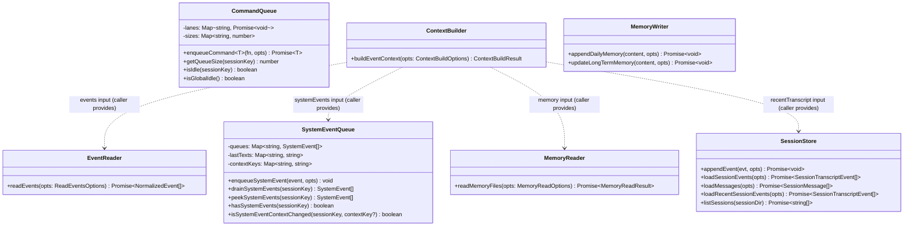
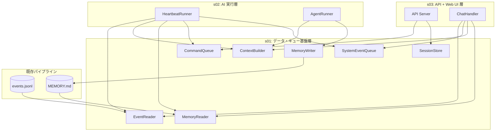

# データ・キュー基盤層

> **マスタープラン**: `doc/plan/260214-s01-ai-assistant-mvp.md`
> **担当**: 担当 A（バックエンド基盤）
> **並行プラン**: s02（AI 実行層）、s03（API + Web UI 層）

---

## 1. 概要と目的 Overview and Purpose

### What

AI Assistant MVP のデータ I/O・キュー・コンテキスト組み立てを担う基盤モジュール群を実装する。
他の 2 プラン（AI 実行層・API+UI 層）が依存するインターフェースを提供する最下層レイヤー。

### Why

- すべての上位モジュール（AgentRunner, HeartbeatRunner, API Server）がこの層のインターフェースに依存する
- 先行して型定義とモジュールを確定させることで、並行開発のブロッカーを解消する

### How

以下の 7 モジュールを TDD で実装し、上位レイヤーが mock 可能なインターフェースを提供する。

- **EventReader** — JSONL からイベント窓を読み込む
- **SystemEventQueue** — sessionKey 単位の FIFO キューで前置き注入パターンを実現
- **CommandQueue** — sessionKey 単位レーンでの排他制御
- **ContextBuilder** — イベント + メモリ + SystemEvent + transcript → プロンプトテキスト
- **MemoryReader / MemoryWriter** — メモリファイルの読み書き
- **SessionStore** — UI 表示用イベントログの JSONL 永続化

---

## 2. 仕様と受け入れ条件 Specification and Acceptance Criteria

### 2.1 スコープ Scope

**今回やること:**

- 7 モジュール（EventReader, SystemEventQueue, CommandQueue, ContextBuilder, MemoryReader, MemoryWriter, SessionStore）の実装
- 全プラン共有の型定義ファイル `src/assistant/types.ts` の作成
- ワークスペースファイルテンプレート（HEARTBEAT.md, SOUL.md, USER.md, AGENTS.md）の作成

**成果物:**

| モジュール | ファイル | 責務 |
|-----------|---------|------|
| **EventReader** | `src/assistant/event-reader.ts` | JSONL からイベント窓を読み込み `NormalizedEvent[]` を返す |
| **SystemEventQueue** | `src/assistant/system-event-queue.ts` | sessionKey 単位の FIFO キュー。前置き注入パターン |
| **CommandQueue** | `src/assistant/command-queue.ts` | sessionKey 単位レーンでの排他制御 |
| **ContextBuilder** | `src/assistant/context-builder.ts` | イベント + メモリ + SystemEvent + transcript → プロンプトテキスト |
| **MemoryReader** | `src/assistant/memory-reader.ts` | MEMORY.md / memory/YYYY-MM-DD.md の読み込み |
| **MemoryWriter** | `src/assistant/memory-writer.ts` | memory/YYYY-MM-DD.md 追記、MEMORY.md 更新 |
| **SessionStore** | `src/assistant/session-store.ts` | UI 表示用イベントログの JSONL 永続化 |

**制約:**

- 既存の CDP → JSONL パイプライン (`src/slack/`, `src/io/`) には手を入れない
- 外部依存（LLM API、ネットワーク）はなく、ファイル I/O とインメモリ処理のみ
- Phase 0 で共有型を確定させ、s02/s03 の並行開発を可能にする

### 2.2 非スコープ Non Scope

- **AI 実行層**（AgentRunner, HeartbeatRunner）→ s02 が担当
- **API サーバー / Web UI** → s03 が担当
- ベクトル検索・SQLite インデックスの導入
- メモリの自動圧縮・自動フラッシュ
- 既存 CDP パイプラインへの hook

### 2.3 ユースケース Use Cases

**UC-1: イベント窓の読み込み（正常系）**
1. 上位モジュール（HeartbeatRunner 等）が `readEvents({ dataDir, sinceMinutes: 60, limit: 200 })` を呼び出す
2. EventReader が `data/YYYY/MM/DD/slack/events.jsonl` を読み込み、時刻・kinds・channels フィルタを適用する
3. 新しい順に limit 件で切り詰めた `NormalizedEvent[]` を返す

**UC-2: イベント窓の読み込み（異常系 — ファイル不在）**
1. データ未収集の日付で `readEvents()` が呼ばれる
2. JSONL ファイルが存在しないため、空配列 `[]` を返す（エラーにしない）

**UC-3: SystemEvent の前置き注入**
1. ChatHandler が新規イベントをテンプレート整形して `enqueueSystemEvent()` で投入する
2. AgentRunner が `drainSystemEvents()` でキューを排出し、コンテキストに前置きする
3. drain 後はキューが空になり、次の run まで新たな投入を待つ

**UC-4: コマンドの排他実行**
1. Heartbeat とユーザーチャットが同一 sessionKey で同時到着する
2. CommandQueue が先着を実行中に後着をキューイングする
3. 先着完了後に後着が実行される（直列保証）

**UC-5: メモリの読み書き**
1. AgentRunner が `readMemoryFiles()` で長期メモリ + 当日・前日メモを取得する
2. 対話中にユーザーが「覚えておいて」と指示すると、AgentRunner が `appendDailyMemory()` で書き込む
3. 次回実行時に `readMemoryFiles()` で書き込んだ内容が読み込まれる

**UC-6: セッション JSONL の破損行スキップ（異常系）**
1. プロセス異常終了で JSONL の末尾行が破損する
2. `loadSessionEvents()` が破損行をスキップし、読める行だけを返す
3. 破損検知をログに記録する

### 2.4 受け入れ条件 Acceptance Criteria

マスタープラン AC 番号に対応させる。

**AC-01: Slack イベント JSONL 保存**
- Given: 既存 JSONL ファイルが `data/YYYY/MM/DD/slack/events.jsonl` に存在する
- When: `readEvents()` を日付指定で呼び出す
- Then: `NormalizedEvent[]` として正しくパースされる

**AC-02: JSONL 文脈注入**
- Given: JSONL 由来のイベント配列がある
- When: `buildEventContext()` にイベントを渡す
- Then: AI が理解可能なプロンプトテキストに変換される

**AC-04: 同一 sessionKey 排他**
- Given: 同一 sessionKey で 2 つのコマンドが投入される
- When: 1 つ目が実行中に 2 つ目が投入される
- Then: 2 つ目は 1 つ目の完了後に実行される（同時実行は発生しない）

**AC-05: sessionKey 分離**
- Given: 異なる sessionKey ("main", "other") でコマンド/イベントが投入される
- When: 各キューの状態を確認する
- Then: 異なる sessionKey 間でコンテキスト・キューが混線しない

**AC-10: トランスクリプト永続化**
- Given: SessionTranscriptEvent が生成される
- When: `appendEvent()` で永続化し `loadSessionEvents()` で読み込む
- Then: sessionId/sessionKey/runId 付きで正しく復元される

**AC-13: SystemEventQueue 注入/排出**
- Given: sessionKey "main" に SystemEvent が 3 件投入されている
- When: `drainSystemEvents("main")` を呼ぶ
- Then: 投入順に 3 件取得でき、drain 後のキューは空になる

**AC-15: メモリ参照（通常/Heartbeat）**
- Given: MEMORY.md と memory/2026-02-15.md が存在する
- When: `readMemoryFiles()` を呼ぶ
- Then: longTerm, daily, yesterday が正しく読み込まれる（不在時は null）

**AC-17: トランスクリプト直近窓注入**
- Given: SessionTranscriptEvent が 10 件保存されている
- When: `buildEventContext()` に recentTranscript を渡す
- Then: 入力コンテキストにトランスクリプト直近窓が含まれる

### 2.5 既知の制約 Known Limitations

- JSONL は全行読み込み後にフィルタするため、1 日数千行を超えると I/O 性能が劣化する可能性がある
- ContextBuilder のトークン概算は文字数ベースの概算であり、実際のトークン数との乖離がある（MVP 割り切り）
- SessionStore の `loadMessages()` はファイル全読み込みのため、履歴が肥大化すると性能劣化する（MVP 割り切り）
- メモリファイルは全文読み込み（ベクトル検索なし）

---

## 3. 前提技術スタック Context and Tech Stack

- **Language / Framework**: TypeScript 5.x, ESM
- **Runtime**: Node.js (tsx)
- **Libraries**: なし（本プランは外部ライブラリ依存なし。ファイル I/O は `node:fs/promises`、日付は標準 API + timezone 文字列）
- **Style Guide**: 既存の Prettier / ESLint 設定に準拠（ダブルクォート、トレイリングカンマ es5、printWidth 100）
- **Testing**: Node.js `--test` モジュール（`describe`, `it`, `mock`）。テストは `tests/` 配下
- **Deployment**: ローカル実行（既存プロセスに組み込み）

---

## 4. インターフェース契約 Interface Contracts

マスタープラン §4.1 の該当モジュールをそのまま準拠する。

### 4.1 公開 API 一覧

本プランは HTTP API / CLI を持たない。上位モジュール（s02, s03）向けの TypeScript モジュールインターフェースを提供する。

| モジュール | 公開関数 | 消費先 |
|-----------|---------|--------|
| EventReader | `readEvents()` | s02: HeartbeatRunner, s03: ChatHandler |
| SystemEventQueue | `enqueueSystemEvent()`, `drainSystemEvents()`, `peekSystemEvents()`, `hasSystemEvents()`, `isSystemEventContextChanged()` | s02: HeartbeatRunner, s03: ChatHandler |
| CommandQueue | `enqueueCommand()`, `getQueueSize()`, `isIdle()`, `isGlobalIdle()` | s02: HeartbeatRunner, s03: API Server |
| ContextBuilder | `buildEventContext()` | s02: HeartbeatRunner / AgentRunner, s03: ChatHandler |
| MemoryReader | `readMemoryFiles()` | s02: HeartbeatRunner, s03: ChatHandler |
| MemoryWriter | `appendDailyMemory()`, `updateLongTermMemory()` | s02: AgentRunner (ツール登録) |
| SessionStore | `appendEvent()`, `loadSessionEvents()`, `loadMessages()`, `loadRecentSessionEvents()`, `listSessions()` | s03: API Server |

### 4.2 データモデルとスキーマ

#### 共有型定義 (`src/assistant/types.ts`)

```typescript
// NormalizedEvent は既存 src/core/events.ts から re-export
export type { NormalizedEvent } from "../core/events.js";

export type SystemEvent = {
  text: string;
  ts: number; // epoch ms
};

export type SessionEventType =
  | "user_message"
  | "assistant_message"
  | "tool_call"
  | "tool_result"
  | "system_event";

export type SessionTranscriptEvent = {
  schema: "adjutant.session.event.v1";
  sessionId: string;
  sessionKey: string;
  runId: string;
  ts: string; // ISO8601
  type: SessionEventType;
  payload: Record<string, unknown>;
};

export type SessionMessage = {
  type: SessionEventType;
  role: "user" | "assistant" | "system";
  content: string;
  ts: string;
  sessionId: string;
  sessionKey: string;
  runId: string;
  isHeartbeat?: boolean;
  payload?: Record<string, unknown>;
};

// --- SSE 公開イベント型（s03 API Server が使用）---
export type StreamEvent =
  | { type: "run_started"; runId: string; sessionId: string; sessionKey: string; seq: number }
  | { type: "text_delta"; runId: string; delta: string; seq: number }
  | { type: "tool_call"; runId: string; toolCallId: string; name: string; params: unknown; seq: number }
  | { type: "tool_result"; runId: string; toolCallId: string; name: string; isError: boolean; result: unknown; seq: number }
  | { type: "text_end"; runId: string; text: string; seq: number }
  | { type: "run_end"; runId: string; status: "completed" | "failed"; seq: number }
  | { type: "error"; runId: string; message: string; seq: number };

// --- 可観測性: run 状態遷移ログ型（マスタープラン §2.7 / §4.2）---
export type AgentRunStatus = {
  schema: "adjutant.agent.run-status.v1";
  sessionId: string;
  sessionKey: string;
  runId: string;
  status: "queued" | "running" | "completed" | "failed";
  reason?: string;       // failed 時の理由
  updatedAt: string;     // ISO8601
};

// --- Heartbeat 関連型（s02 HeartbeatRunner が使用）---
// 以下の型定義は s02 の実装インターフェースで使用されるが、
// 全プラン共有型として types.ts に集約する。
export type HeartbeatRunResult =
  | { status: "ran"; durationMs: number; alert?: string; contentHash?: string; modelId?: string }
  | { status: "skipped"; reason: string }
  | { status: "failed"; reason: string };

export type HeartbeatEventPayload = {
  ts: number;
  status: "sent" | "ok-empty" | "ok-token" | "skipped" | "failed";
  reason?: string;
  to?: string;
  channel?: string;
  accountId?: string;
  preview?: string;
  durationMs?: number;
  hasMedia?: boolean;
  silent?: boolean;
  indicatorType?: "ok" | "alert" | "error";
};

export type HeartbeatRunRecord = {
  schema: "adjutant.heartbeat.result.v1";
  runAt: string;
  sessionId?: string;
  sessionKey?: string;
  result: HeartbeatRunResult;
  mode?: "now" | "scheduled";  // 実行トリガー種別
  modelId?: string;
  preview?: string;
};
```

> **注**: s02/s03 はこのファイルから共有型を import する。
> 例: `import { StreamEvent, AgentRunStatus, HeartbeatRunResult } from "./types.js";`

#### EventReader

```typescript
export type ReadEventsOptions = {
  dataDir: string;
  date?: string;        // "YYYY-MM-DD" (default: today)
  kinds?: string[];     // filter by event kind
  channels?: string[];  // filter by channel_id
  sinceMinutes?: number; // 直近 N 分以内のイベントのみ (default: 60)
  limit?: number;        // 最大取得件数、新しい順に切り詰め (default: 200)
};

export function readEvents(opts: ReadEventsOptions): Promise<NormalizedEvent[]>;
```

#### SystemEventQueue

```typescript
export type SystemEventEnqueueOptions = {
  sessionKey: string;
  contextKey?: string;
};

// キュー制約:
// - sessionKey 単位 FIFO、MAX_EVENTS = 20、超過時は古い方を破棄
// - 連続する同一テキストはドロップ（連続重複排除）
// - drain 後はキューを空にし lastText をリセット

export function enqueueSystemEvent(event: SystemEvent, opts: SystemEventEnqueueOptions): void;
export function drainSystemEvents(sessionKey: string): SystemEvent[];
export function peekSystemEvents(sessionKey: string): SystemEvent[];
export function hasSystemEvents(sessionKey: string): boolean;
export function isSystemEventContextChanged(sessionKey: string, contextKey?: string): boolean;
```

#### CommandQueue

```typescript
export type CommandFn<T> = () => Promise<T>;

export type CommandQueueOptions = {
  sessionKey: string;
};

export function enqueueCommand<T>(fn: CommandFn<T>, opts: CommandQueueOptions): Promise<T>;
export function getQueueSize(sessionKey: string): number;
export function isIdle(sessionKey: string): boolean;
export function isGlobalIdle(): boolean;
```

#### ContextBuilder

```typescript
export type ContextBuildOptions = {
  events: NormalizedEvent[];
  systemEvents?: SystemEvent[];
  recentTranscript?: SessionTranscriptEvent[];
  memoryContent?: string;
  dailyMemoryContent?: string;
  yesterdayMemoryContent?: string;
  maxTokenEstimate?: number; // default: 8000
};

export type ContextBuildResult = {
  text: string;
  truncated: boolean;
  eventCount: number;
};

export function buildEventContext(opts: ContextBuildOptions): ContextBuildResult;
```

#### MemoryReader / MemoryWriter

```typescript
// MemoryReader
export type MemoryReadOptions = {
  workspaceDir: string;
  timezone: string;
};

export function readMemoryFiles(opts: MemoryReadOptions): Promise<{
  longTerm: string | null;
  daily: string | null;
  yesterday: string | null;
}>;

// MemoryWriter
export type MemoryWriteOptions = {
  workspaceDir: string;
  timezone: string;
};

export function appendDailyMemory(content: string, opts: MemoryWriteOptions): Promise<void>;
export function updateLongTermMemory(content: string, opts: MemoryWriteOptions): Promise<void>;
```

#### SessionStore

```typescript
export type SessionStoreOptions = {
  sessionDir: string;
  sessionId: string;
};

export function appendEvent(evt: SessionTranscriptEvent, opts: SessionStoreOptions): Promise<void>;
export function loadSessionEvents(opts: SessionStoreOptions): Promise<SessionTranscriptEvent[]>;
export function loadMessages(opts: SessionStoreOptions): Promise<SessionMessage[]>;
export function loadRecentSessionEvents(
  opts: SessionStoreOptions & { limit: number },
): Promise<SessionTranscriptEvent[]>;
export function listSessions(sessionDir: string): Promise<string[]>;
```

### 4.3 エラーと例外 Error Handling

| エラー | 分類 | 対応 |
|--------|------|------|
| JSONL ファイル不在 | 正常系 | 空配列を返す（エラーにしない） |
| MEMORY.md 不在 | 正常系 | `null` を返す（初回起動時） |
| memory/YYYY-MM-DD.md 不在 | 正常系 | `null` を返す |
| セッション JSONL 破損行 | 準正常系 | 読める行だけ読み込み、破損行はスキップ。破損検知を `console.warn` でログ出力 |
| JSONL パース失敗（個別行） | 準正常系 | その行をスキップし、残りを処理する |
| ファイル書き込み失敗 | 異常系 | 例外をそのまま throw（上位で catch） |

- **リトライ方針**: 本プランのモジュールにリトライロジックは持たせない。上位レイヤーの責務とする
- **タイムアウト方針**: ファイル I/O に対するタイムアウトは設けない（ローカルファイルシステム前提）
- **ログ方針**: 破損行スキップ時のみ `console.warn`。個人情報（メッセージ本文）はログに出力しない

### 4.4 代表的な例 Examples

**EventReader 使用例:**

```typescript
import { readEvents } from "./assistant/event-reader.js";

const events = await readEvents({
  dataDir: "data",
  sinceMinutes: 60,
  limit: 200,
  kinds: ["post"],
  channels: ["C01234567"],
});
// → NormalizedEvent[] (最大200件、直近60分、post のみ、#general のみ)
```

**SystemEventQueue 使用例:**

```typescript
import { enqueueSystemEvent, drainSystemEvents } from "./assistant/system-event-queue.js";

enqueueSystemEvent(
  { text: "[#general] alice: デプロイ完了しました", ts: Date.now() },
  { sessionKey: "main" },
);

const events = drainSystemEvents("main");
// → [{ text: "[#general] alice: デプロイ完了しました", ts: ... }]
// drain 後: drainSystemEvents("main") → []
```

**ContextBuilder 使用例:**

```typescript
import { buildEventContext } from "./assistant/context-builder.js";

const result = buildEventContext({
  events,
  systemEvents: [{ text: "[#general] alice: 重要な報告です", ts: Date.now() }],
  memoryContent: "# Long-term Memory\n- alice は SRE チーム所属",
  dailyMemoryContent: "# 2026-02-15\n- 午前中にデプロイ作業あり",
  maxTokenEstimate: 8000,
});
// → { text: "...(フォーマット済みプロンプト)", truncated: false, eventCount: 5 }
```

---

## 5. アーキテクチャと設計図 Architecture and Diagrams

### 5.1 図の選択方針

- 複数モジュール間のデータフローを示すため **クラス図** を作成する
- 上位レイヤーとの依存関係を示すため **コンポーネント図** を補助的に追加する

### 5.2 クラス図 Class Diagram



### 5.3 コンポーネント図（上位レイヤーとの関係）



---

## 6. テスト戦略 Test Strategy

### 6.1 テストの種類

**Unit テスト:**

| 対象 | モック境界 | 主要テスト観点 |
|------|----------|--------------|
| EventReader | テスト用 JSONL フィクスチャ | パース、日付フィルタ、sinceMinutes/limit 切り詰め、空ファイル処理、kinds/channels フィルタ |
| SystemEventQueue | なし（インメモリ） | enqueue/drain/peek、MAX_EVENTS=20 上限、sessionKey 分離、連続重複排除、contextKey 変化検知、drain 後 cleanup |
| CommandQueue | なし（インメモリ） | sessionKey レーン分離、直列実行、isIdle/isGlobalIdle 判定、getQueueSize |
| ContextBuilder | なし（純粋関数） | トークン切り詰め、truncated フラグ、メモリ注入、SystemEvent 注入、recentTranscript 注入、フォーマット出力 |
| MemoryReader | テスト用 tmpdir | timezone 日付計算、ファイル不在時 null、正常読み込み |
| MemoryWriter | テスト用 tmpdir | ファイル追記・更新、日付パーティション |
| SessionStore | テスト用 tmpdir | JSONL 読み書き、必須項目検証、破損行スキップ、loadMessages 投影、loadRecentSessionEvents |

**Contract テスト:**

| 対象 | 方針 |
|------|------|
| NormalizedEvent | 既存スキーマ `adjutant.event.v1.1` との整合性を検証する |

**Integration テスト:**

本プランのモジュールはすべてローカルファイル I/O またはインメモリのため、外部依存の統合テストは不要。
ファイル I/O を伴うモジュール（EventReader, MemoryReader/Writer, SessionStore）は tmpdir を使った Unit テストでカバーする。

### 6.2 カバレッジ対象

- **重要ロジック**: EventReader のフィルタ・切り詰め、ContextBuilder のトークン概算・フォーマット、CommandQueue の排他制御
- **エラー分岐**: ファイル不在時の空配列/null 返却、JSONL 破損行スキップ
- **境界条件**: MAX_EVENTS=20 の上限到達、sinceMinutes=0、limit=0、空のイベント配列、空のメモリファイル

---

## 7. 実装タスクリスト Implementation Plan

### Phase 1: 設計と準備

- [ ] 要件と仕様の確定（本プラン §2.4 受け入れ条件の確認）
- [ ] `src/assistant/types.ts` に全プラン共有の型定義を作成（NormalizedEvent re-export、SystemEvent、SessionTranscriptEvent、SessionMessage、StreamEvent、AgentRunStatus、HeartbeatRunResult、HeartbeatEventPayload、HeartbeatRunRecord）。s02/s03 はこのファイルから import する
- [ ] HEARTBEAT.md テンプレート作成
- [ ] SOUL.md テンプレート作成
- [ ] USER.md / AGENTS.md テンプレート作成
- [ ] テスト基盤の確認（`node --test` 動作確認、tmpdir ヘルパー）

### Phase 2: EventReader の実装

- [ ] Test: JSONL 読み込み — ファイル不在時に空配列、正常パース、日付フィルタ (Red)
- [ ] Impl: `readEvents()` 実装 (Green)
- [ ] Test: sinceMinutes/limit 切り詰め — 新しい順に切り詰め (Red)
- [ ] Impl: フィルタ・切り詰めロジック (Green)
- [ ] Test: kinds/channels フィルタ (Red)
- [ ] Impl: フィルタオプション (Green)
- [ ] Refactor: パースとフィルタロジックの整理

### Phase 3: SystemEventQueue の実装

- [ ] Test: enqueue/drain 基本動作 — enqueue した順に drain される (Red)
- [ ] Impl: 基本 FIFO キュー (Green)
- [ ] Test: sessionKey 分離 — 異なる sessionKey 間でイベントが混線しない (Red)
- [ ] Impl: sessionKey ルーティング (Green)
- [ ] Test: MAX_EVENTS=20 上限 — 超過時は古い方から破棄 (Red)
- [ ] Test: 連続重複排除 — 同一テキスト連続投入でドロップ (Red)
- [ ] Test: contextKey 変化検知 — isSystemEventContextChanged (Red)
- [ ] Test: drain 後の cleanup — キュー空 + lastText リセット (Red)
- [ ] Impl: 上限・重複排除・contextKey ロジック (Green)
- [ ] Refactor: キュー管理の内部構造整理

### Phase 4: CommandQueue の実装

- [ ] Test: sessionKey 単位のレーン分離 — 異なる sessionKey は並行実行可能 (Red)
- [ ] Test: 同一 sessionKey の直列実行 — 同時実行が発生しない (Red)
- [ ] Test: isIdle / isGlobalIdle 判定 (Red)
- [ ] Test: getQueueSize (Red)
- [ ] Impl: CommandQueue 実装 (Green)
- [ ] Refactor: Promise チェーン管理の整理

### Phase 5: MemoryReader + MemoryWriter の実装

- [ ] Test: MemoryReader timezone 日付計算 — today/yesterday の正確な算出 (Red)
- [ ] Test: MemoryReader ファイル不在時の null 返却 (Red)
- [ ] Test: MemoryReader 正常読み込み (Red)
- [ ] Impl: `readMemoryFiles()` 実装 (Green)
- [ ] Test: MemoryWriter ファイル追記 — memory/YYYY-MM-DD.md に追記 (Red)
- [ ] Test: MemoryWriter 長期メモリ更新 — MEMORY.md 上書き (Red)
- [ ] Impl: `appendDailyMemory()` / `updateLongTermMemory()` 実装 (Green)
- [ ] Refactor: ファイルパス生成ロジックの共通化

### Phase 6: ContextBuilder の実装

- [ ] Test: イベント配列 → プロンプトテキスト変換 (Red)
- [ ] Test: メモリ注入（longTerm + daily + yesterday） (Red)
- [ ] Test: SystemEvent 注入 (Red)
- [ ] Test: recentTranscript 注入（SessionTranscriptEvent[] からの投影） (Red)
- [ ] Test: maxTokenEstimate 超過時の切り詰め + truncated フラグ (Red)
- [ ] Test: ハートビートフロー（events あり, systemEvents 空）とチャットフロー（events 空, systemEvents あり）の排他パターン (Red)
- [ ] Impl: `buildEventContext()` 実装 (Green)
- [ ] Refactor: トークン概算と切り詰めロジック整理

### Phase 7: SessionStore の実装

- [ ] Test: appendEvent + loadSessionEvents — 基本 JSONL 読み書き (Red)
- [ ] Test: 必須項目（schema/sessionId/sessionKey/runId/type/ts/payload）検証 (Red)
- [ ] Test: loadMessages — SessionTranscriptEvent → SessionMessage 投影 (Red)
- [ ] Test: loadRecentSessionEvents — limit 指定での直近 N 件取得 (Red)
- [ ] Test: 破損行スキップ — 壊れた行を含む JSONL でも読める行だけ返す (Red)
- [ ] Test: listSessions — セッション一覧取得 (Red)
- [ ] Impl: SessionStore 実装 (Green)
- [ ] Refactor: JSONL 読み書きユーティリティの整理

### Phase 8: 統合と検証

- [ ] 全体テストの実行（`pnpm run test`）
- [ ] エッジケースの動作確認（空ファイル、破損 JSONL、timezone 境界）
- [ ] `pnpm run typecheck` がエラーなし
- [ ] `pnpm run lint` がエラーなし
- [ ] 契約の例（§4.4）に対して期待通りの結果が得られることを確認

---

## 8. 完了の定義 Definition of Done

### 8.1 機能 DoD Functional DoD

- [ ] AC-01: 既存 JSONL が EventReader で正しく読み込まれる
- [ ] AC-02: ContextBuilder が JSONL 由来イベントをプロンプトテキストに変換できる
- [ ] AC-04: CommandQueue が同一 sessionKey の同時実行を防止する
- [ ] AC-05: CommandQueue / SystemEventQueue が異なる sessionKey 間で分離される
- [ ] AC-10: SessionStore が sessionId/sessionKey/runId 付きで JSONL 永続化する
- [ ] AC-13: SystemEventQueue の enqueue/drain が sessionKey 単位で正しく動作する
- [ ] AC-15: MemoryReader が MEMORY.md + 当日・前日メモを正しく読み込む
- [ ] AC-17: ContextBuilder が recentTranscript を入力コンテキストに注入する
- [ ] 既知の制約（§2.5）が明文化され、想定通りであること
- [ ] 契約の例（§4.4）に対して期待通りの結果が得られること

### 8.2 品質 DoD Quality DoD

- [ ] P-02: `pnpm run check` が成功し、既存 Slack 収集パイプラインに破壊的変更がない
- [ ] 全てのテストがパスしていること（`pnpm run test`）
- [ ] `pnpm run typecheck` がエラーなし
- [ ] `pnpm run lint` がエラーなし
- [ ] 不要なデバッグコードが削除されていること
- [ ] 型定義（`src/assistant/types.ts`）が s02/s03 で利用可能な状態であること

---

## 9. 懸念事項と未確定事項 Concerns and Questions

### 技術的な懸念点

- JSONL が 1 日数千行を超える場合の EventReader の I/O 性能とメモリ使用量。ストリーミング読み込みへの変更が将来必要になる可能性
- ContextBuilder のトークン概算精度（文字数ベースの概算 vs tiktoken 等）。MVP では文字数ベースで割り切る
- SessionStore の JSONL が肥大化した場合の loadMessages 性能。MVP ではファイル全読み込みで割り切る

### 仕様が曖昧で決定が必要な事項

- `AgentRunStatus` の記録責務: 型は s01 の types.ts で定義するが、実際の記録（SessionStore への書き込み）は s02 AgentRunner または s03 ChatHandler の責務。MVP では s03 の ChatHandler がコマンド実行前後に記録する方針とする

### プロトタイプとして許容するリスク

- トークン概算の精度不足により、コンテキストウィンドウのオーバーフローが発生する可能性がある。`truncated` フラグで検知は可能
- MemoryWriter の並行書き込み制御は行わない。CommandQueue による排他が上位で保証される前提

### 将来的な拡張に伴うリスク

- EventReader をストリーミング読み込みに変更する場合、インターフェース（`Promise<NormalizedEvent[]>` → `AsyncIterable`）の変更が必要
- SessionStore にインデックスを追加する場合、JSONL → SQLite への移行が必要
