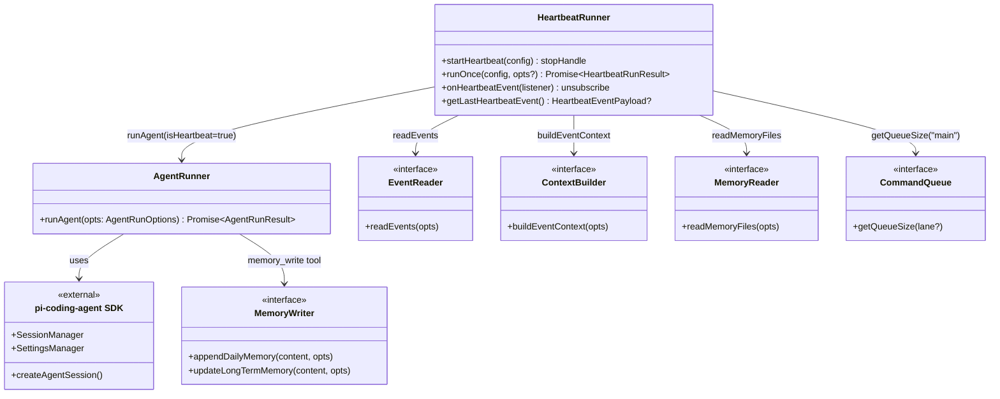
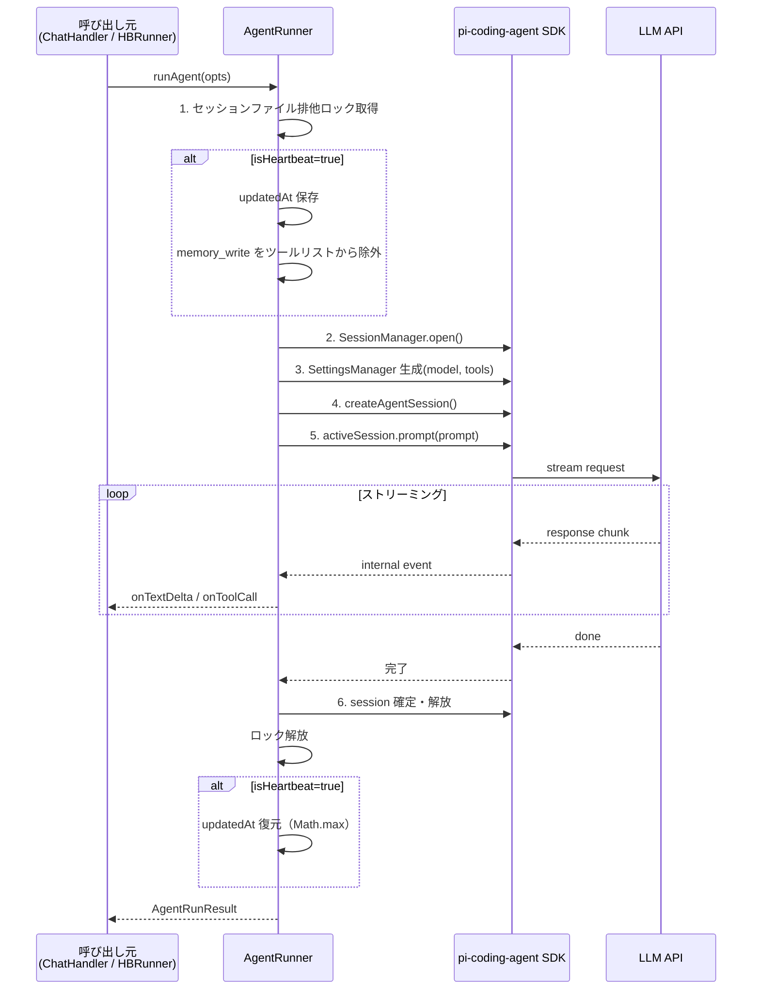
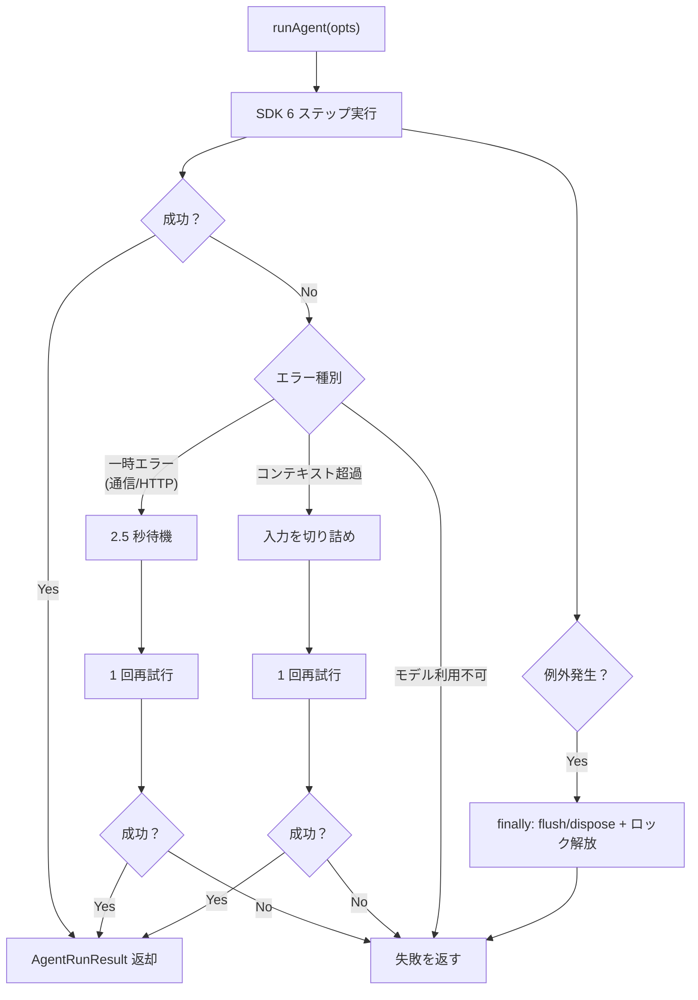
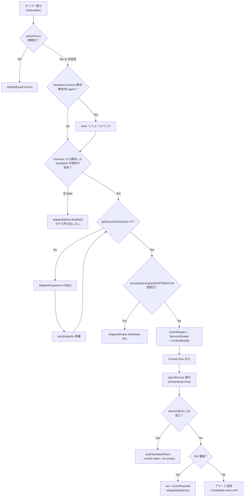

# AI 実行層（AgentRunner + HeartbeatRunner）

> **マスタープラン**: `doc/plan/260214-s01-ai-assistant-mvp.md`
> **担当**: 担当 B（AI 実行）
> **並行プラン**: s01（データ・キュー基盤層）、s03（API + Web UI 層）

---

## 1. 概要と目的 Overview and Purpose

### What

pi-coding-agent SDK を使った LLM 実行基盤（AgentRunner）と、定期ポーリングでプロアクティブ通知を行うハートビート機構（HeartbeatRunner）を実装する。
AI Assistant MVP の「頭脳」に相当するレイヤー。

### Why

- AgentRunner は全てのLLM呼び出しの唯一の実行経路。チャットもハートビートもこれを通る
- HeartbeatRunner はMVPの差別化機能。「指示を待たず自ら気づいて動く」エージェントの核心

### How

- AgentRunner は pi-coding-agent SDK の `createAgentSession` / `SessionManager` を利用し、OpenClaw 準拠の 6 ステップ実行手順を遵守する
- HeartbeatRunner は設定間隔（デフォルト30分）で EventReader → ContextBuilder → AgentRunner のパイプラインを起動し、HEARTBEAT_OK 判定・重複排除・各種スキップ条件を制御する

---

## 2. 仕様と受け入れ条件 Specification and Acceptance Criteria

### 2.1 スコープ Scope

**今回やること:**

- AgentRunner: pi-coding-agent SDK によるセッション管理・LLM 実行・ストリーミング・ツール登録・失敗回復
- HeartbeatRunner: 定期ポーリング、HEARTBEAT_OK 判定、重複排除、各種スキップ条件、Current time 注入

**実装モジュール:**

| モジュール          | ファイル                            | 責務                                                                                        |
| ------------------- | ----------------------------------- | ------------------------------------------------------------------------------------------- |
| **AgentRunner**     | `src/assistant/agent-runner.ts`     | pi-coding-agent SDK を使った LLM 実行。セッション管理、ストリーミング、ツール登録、失敗回復 |
| **HeartbeatRunner** | `src/assistant/heartbeat-runner.ts` | 定期ポーリング、HEARTBEAT_OK 判定、重複排除、スキップ制御、Current time 注入                |

**成果物:**

- `src/assistant/agent-runner.ts`
- `src/assistant/heartbeat-runner.ts`
- `tests/agent-runner.test.ts`
- `tests/heartbeat-runner.test.ts`

**制約:**

- LLM API は直接呼び出さず、必ず pi-coding-agent SDK 経由とする
- s01（基盤層）のモジュールは本プランでは実装しない（インターフェースをモックして開発）
- API サーバー・Web UI は s03 の担当

### 2.2 非スコープ Non Scope

- EventReader / ContextBuilder / MemoryReader / MemoryWriter / CommandQueue / SystemEventQueue / TranscriptReader の実装（→ s01）
- API サーバー / Web UI（→ s03）
- ベクトル検索・SQLite インデックス
- セッションコンパクション
- Cron ジョブ / 外部 Webhook トリガー

### 2.3 ユースケース Use Cases

**UC-HB: ハートビートによるプロアクティブ通知**（マスタープラン UC-1 の本プラン担当部分）

1. HeartbeatRunner のタイマーが発火する（30 分間隔）
2. `activeHours` 時間外であればスキップ（quiet-hours）
3. `heartbeat.session` 指定は OpenClaw 解決規則で canonical 化し、無効/他 agent 指定は `main` にフォールバックする
4. channels 設定から解決した heartbeat 可視性（showOk/showAlerts/useIndicator）が全 false ならスキップ（alerts-disabled）
5. `getQueueSize("main")` でビジー判定。ビジー時は requests-in-flight スキップ + 短周期再試行（OpenClaw heartbeat-wake 準拠）
6. assistant/prompts/HEARTBEAT.md 読み込み、実質空ならスキップ（empty-heartbeat-file）
7. EventReader → MemoryReader → ContextBuilder でコンテキスト構築
8. AgentRunner 経由で LLM に送信（`isHeartbeat=true`）
9. HEARTBEAT_OK 判定 → 抑制（ok-token / ok-empty）or アラート生成 → 重複排除判定 → heartbeat イベント配信（HeartbeatRunner 自体は SystemEventQueue へ enqueue しない）

**UC-AG: AgentRunner による LLM 実行**（マスタープラン UC-2 の実行部分）

1. 呼び出し元（ChatHandler / HeartbeatRunner）が AgentRunOptions を渡す
2. SDK 6 ステップ（lock → open → create → subscribe → dispose）を実行
3. ストリーミングイベントを onTextDelta / onToolCall コールバックで通知
4. `isHeartbeat=true` の場合は updatedAt 復元 + memory_write 除外
5. 一時失敗時は 2.5 秒後に 1 回再試行。コンテキスト超過時は切り詰めて再試行
6. 例外時は finally で flush/dispose + ロック解放

**UC-MG: メモリ書き込みガード**（マスタープラン UC-4 / AC-11）

1. ユーザーが「覚えておいて」と明示指示 → memory_write ツールが実行される
2. 明示指示がない通常対話 → memory_write は実行されない
3. `isHeartbeat=true` → memory_write がツールリストから除外される
4. memory_write で保存した内容は次回ターンの入力コンテキストへ再注入される

### 2.4 受け入れ条件 Acceptance Criteria

**AC-03: SDK 実行手順準拠**

- Given AgentRunner が `runAgent()` で呼び出される When SDK セッションを使用する Then lock → open → create → subscribe → dispose の順序で実行される

**AC-06: 失敗時再試行**

- Given LLM API が一時エラーを返す When AgentRunner が失敗を検知する Then 2.5 秒待機後に 1 回再試行する
- Given LLM がコンテキスト超過エラーを返す When AgentRunner が失敗を検知する Then イベント/履歴入力を切り詰めて 1 回再試行する

**AC-07: HEARTBEAT_OK 抑制**

- Given HeartbeatRunner が LLM 応答を受け取る When 応答に HEARTBEAT_OK トークンを含む Then `HeartbeatRunResult.status: "ran"` を維持し `HeartbeatEventPayload.status: "ok-token" | "ok-empty"` が記録される

**AC-08: Heartbeat アラート通知**

- Given HeartbeatRunner が LLM 応答を受け取る When 応答が注目イベントを含む Then アラートテキストが生成され heartbeat イベントとして配信される

**AC-09: 空 HEARTBEAT スキップ**

- Given assistant/prompts/HEARTBEAT.md が実質空である When HeartbeatRunner がファイルを読み込む Then モデル呼び出しなしで `status: "skipped"` となる

**AC-11: メモリ書き込みガード**

- Given ユーザーが明示的に記憶を指示する When AgentRunner が実行する Then memory_write ツールが実行され、次回ターンで再利用される
- Given `isHeartbeat=true` When AgentRunner が実行する Then memory_write がツールリストから除外される

**AC-12: SOUL 反映**

- Given assistant/prompts/SOUL.md / assistant/prompts/USER.md / assistant/prompts/AGENTS.md が存在する When AgentRunner が実行する Then systemPrompt にこれらの内容が反映される

**AC-16: 重複通知抑制**

- Given 24h 以内に同一テキストのアラートが送信済みである When HeartbeatRunner が同一テキストを生成する Then `HeartbeatRunResult.status: "ran"` を維持し `HeartbeatEventPayload.status: "skipped", reason: "duplicate"` が記録される

**AC-18: readiness 失敗の記録**

- Given アラート配信前に readiness チェックが失敗する When HeartbeatRunner が結果を記録する Then `HeartbeatRunResult.status: "skipped"` と `HeartbeatEventPayload.status: "skipped"` が記録される
- Given ok-token/ok-empty の可視化判定側で readiness が失敗する When HeartbeatRunner が結果を記録する Then `HeartbeatRunResult.status: "ran"` と `HeartbeatEventPayload.status: "ok-token" | "ok-empty"` を維持する

**AC-20: Current time 注入**

- Given HeartbeatRunner がプロンプトを構築する When Body 末尾に Current time 行がない Then `Current time: <formattedTime> (<userTimezone>)` が注入される
- Given Body に既に "Current time:" 行が存在する When HeartbeatRunner が注入を試みる Then 重複挿入しない

**AC-22: requests-in-flight 再試行**

- Given `getQueueSize("main")` が 0 より大きい When HeartbeatRunner がタイマー発火する Then `status: "skipped"` で記録し、retryDelayMs 後に再試行する

**P-03: heartbeat.session フォールバック**

- Given `heartbeat.session` が無効/他 agent セッションを指す When HeartbeatRunner が実行判定する Then `main` セッションへフォールバックして継続する

### 2.5 既知の制約 Known Limitations

- pi-coding-agent SDK のバージョンに強く依存する。SDK の API 変更時にこのプランのモジュールが直接影響を受ける
- FR-AG-4（セッションファイル破損修復）は SDK 内部の保存フォーマットに依存するため、修復ロジックの精度は SDK バージョンに左右される
- 重複排除の `lastHeartbeatText` / `lastHeartbeatSentAt` は Session Entry（`sessions.json`）に永続化する（プロセス再起動後も有効）。表示専用の投影層（TranscriptReader）には HeartbeatRunner 固有のフィールドを持たせず、責務を分離する

---

## 3. 前提技術スタック Context and Tech Stack

- **Language**: TypeScript 5.x, ESM strict モード
- **Runtime**: Node.js (tsx)
- **AI SDK**: `@mariozechner/pi-coding-agent`（`createAgentSession`, `SessionManager`, `SettingsManager`）、`@mariozechner/pi-ai`（`streamSimple`）
- **Testing**: Node.js `--test` モジュール（`node:test` の `describe`, `it`, `mock`）
- **Style Guide**: Prettier（ダブルクォート、トレイリングカンマ es5、printWidth 100）+ ESLint（`@typescript-eslint`、`_` プレフィックスで未使用引数許可）
- **命名**: camelCase（変数/関数）、PascalCase（型）、UPPER_SNAKE_CASE（定数）、named export
- **共有型の取り込み**: s01 の `src/assistant/types.ts` から `SystemEvent`, `SessionTranscriptEvent`, `NormalizedEvent`, `AgentRunStatus` 等を import する

---

## 4. インターフェース契約 Interface Contracts

### 4.1 公開 API

#### AgentRunner

```typescript
// src/assistant/agent-runner.ts
// pi-coding-agent の createAgentSession / activeSession.prompt を使用。
//
// --- FR-AG-1: SDK 利用手順（OpenClaw 規範実装に準拠）---
//   1. セッションファイルの排他ロックを取得
//   2. セッションファイルの修復/事前準備、SessionManager を開く
//   3. SettingsManager を生成（モデル・ツール等の実行設定を反映）
//   4. createAgentSession で実行セッションを構築
//   5. 購読層でストリーミングイベントを受け取り、UI 向けに整形
//   6. 実行終了時にセッションを確定・解放
// 例外発生時も finally で flush/dispose + ロック解放を必須とする。

export type AgentRunOptions = {
  runId: string;
  prompt: string;
  systemPrompt?: string; // assistant/prompts/SOUL.md + assistant/prompts/USER.md + assistant/prompts/AGENTS.md 結合テキスト
  sessionKey: string;
  sessionId?: string;
  isHeartbeat?: boolean; // true → updatedAt 復元 + memory_write 無効化
  model?: string; // モデルカスケード用
  onTextDelta?: (delta: string) => void;
  onToolCall?: (name: string, params: unknown) => void;
};

export type AgentRunResult = {
  runId: string;
  text: string;
  toolCalls?: Array<{ name: string; result: unknown }>;
};

export function runAgent(opts: AgentRunOptions): Promise<AgentRunResult>;
```

**サブ要件:**

| サブ要件 | 内容                                                                     | 対応 AC       |
| -------- | ------------------------------------------------------------------------ | ------------- |
| FR-AG-1  | OpenClaw 準拠の SDK 利用手順                                             | AC-03         |
| FR-AG-2  | 最終回答と途中イベントの分離、部分応答の順序保証                         | AC-14 / AC-19 |
| FR-AG-3  | 一時失敗は 2.5 秒待機後に 1 回再試行。コンテキスト超過時は切り詰め再試行 | AC-06         |
| FR-AG-4  | セッションファイル破損の検知・修復/退避                                  | AC-03         |

#### HeartbeatRunner

```typescript
// src/assistant/heartbeat-runner.ts
export type HeartbeatConfig = {
  intervalMs: number; // default: 1800000 (30m)
  timeoutMs?: number; // default: 30000
  sessionKey?: string; // default: "main"
  heartbeatFilePath: string; // default: "assistant/prompts/HEARTBEAT.md"
  soulFilePath: string; // default: "assistant/prompts/SOUL.md"
  userFilePath: string; // default: "assistant/prompts/USER.md"
  agentsFilePath: string; // default: "assistant/prompts/AGENTS.md"
  dataDir: string;
  userTimezone?: string; // default: agents.defaults.userTimezone（未設定時はホスト環境）
  retryDelayMs?: number; // default: 1000
  ackMaxChars: number; // default: 300
  // 可視性設定（showOk/showAlerts/useIndicator）は channels 設定から解決する
  model?: string;
  activeHours?: {
    start: string; // "HH:MM"
    end: string; // "HH:MM"（"24:00" 可、start > end で深夜跨ぎ）
    timezone?: string; // "user" | "local" | IANA タイムゾーン名
  };
};

// ※ 以下の 3 型定義は参照用。正（source of truth）は s01 の src/assistant/types.ts。
export type HeartbeatRunResult =
  | {
      status: "ran";
      durationMs: number;
      alert?: string;
      contentHash?: string;
      modelId?: string;
    }
  | {
      status: "skipped";
      reason: string; // OpenClaw 準拠: alerts-disabled / readiness の詳細理由を含む
    }
  | {
      status: "failed";
      reason: string;
    };

export type HeartbeatEventPayload = {
  ts: number;
  status: "sent" | "ok-empty" | "ok-token" | "skipped" | "failed";
  reason?: string;
  to?: string; // OpenClaw互換, MVP省略可
  channel?: string; // OpenClaw互換, MVP省略可
  accountId?: string; // OpenClaw互換, MVP省略可
  preview?: string;
  durationMs?: number;
  hasMedia?: boolean; // OpenClaw互換, MVP省略可
  silent?: boolean; // OpenClaw互換, MVP省略可
  indicatorType?: "ok" | "alert" | "error";
};

export type HeartbeatRunRecord = {
  schema: "adjutant.heartbeat.result.v1";
  runAt: string; // ISO8601
  sessionId?: string;
  sessionKey?: string;
  result: HeartbeatRunResult;
  triggerReason?: string; // OpenClaw runHeartbeatOnce(reason) と整合
  modelId?: string;
  preview?: string;
};

export function startHeartbeat(config: HeartbeatConfig): { stop: () => void };
// 手動実行 API（POST /api/heartbeat/run）向けの単発実行フック。
// 内部の runHeartbeatOnce(reason) を公開契約化したもの。
export function runOnce(
  config: HeartbeatConfig,
  opts?: { reason?: string }
): Promise<HeartbeatRunResult>;
export function onHeartbeatEvent(listener: (evt: HeartbeatEventPayload) => void): () => void;
export function getLastHeartbeatEvent(): HeartbeatEventPayload | null;
```

**HeartbeatRunner 内部仕様（マスタープラン §4.1 より）:**

- **stripHeartbeatToken**: HTML タグ除去 → `&nbsp;` 空白変換 → Markdown 修飾除去 → HEARTBEAT_OK 除去 → 残テキスト ≤ ackMaxChars なら `shouldSkip=true`
- **重複排除**: 直前送達テキスト（`lastHeartbeatText`）と 24h ウィンドウ（`lastHeartbeatSentAt`）で判定。Session Entry（`sessions.json`）に保持。重複時は `HeartbeatRunResult.status: "ran"` を維持し、`HeartbeatEventPayload.status: "skipped", reason: "duplicate"` を記録
- **Current time 注入**: Body 末尾に `Current time: <formattedTime> (<userTimezone>)` を注入。既存時は重複挿入しない
- **requests-in-flight 再試行**: `retryDelayMs` 間隔で再試行し、wake ハンドラが coalesce/retry を管理する
- **可視性設定（alerts-disabled）**: channels から解決した showOk / showAlerts / useIndicator が全 false の場合は `reason: "alerts-disabled"` でスキップ（モデル呼び出しなし）
- **heartbeat.session 解決**: 無効/他 agent セッション指定は `main` へフォールバックして継続する

### 4.2 依存モジュール契約（s01 から消費）

本プランのモジュールは s01（データ・キュー基盤層）のインターフェースに依存する。
開発中はこれらをモックして先行実装可能。

| 消費モジュール                                                | 使用箇所        | 用途                                        |
| ------------------------------------------------------------- | --------------- | ------------------------------------------- |
| `EventReader.readEvents()`                                    | HeartbeatRunner | イベント窓の読み込み                        |
| `ContextBuilder.buildEventContext()`                          | HeartbeatRunner | プロンプト組み立て                          |
| `MemoryReader.readMemoryFiles()`                              | HeartbeatRunner | メモリ読み込み                              |
| `MemoryWriter.appendDailyMemory()` / `updateLongTermMemory()` | AgentRunner     | memory_write ツール                         |
| `CommandQueue.getQueueSize("main")`                           | HeartbeatRunner | main レーンの混雑判定（requests-in-flight） |

### 4.3 エラーと例外 Error Handling

| エラー                                                                                   | 分類                   | 対応                                                      |
| ---------------------------------------------------------------------------------------- | ---------------------- | --------------------------------------------------------- |
| LLM API 一時エラー（通信/HTTP 系）                                                       | リトライ可             | 2.5 秒待機後にリトライ 1 回。失敗時はエラーイベントを返す |
| LLM コンテキスト超過エラー                                                               | リトライ可（切り詰め） | イベント/履歴入力を新しい順に切り詰めて再試行（1 回）     |
| LLM モデル利用不可                                                                       | 即時失敗               | 即座に失敗を返す                                          |
| assistant/prompts/HEARTBEAT.md 不在                                                      | フォールバック         | デフォルトプロンプトで実行                                |
| assistant/prompts/SOUL.md / assistant/prompts/USER.md / assistant/prompts/AGENTS.md 不在 | フォールバック         | デフォルト設定で動作                                      |
| SDK セッションファイル破損                                                               | 修復/退避              | 修復試行 → 修復不能時はファイル退避 + 新規作成            |
| SDK セッション解放失敗                                                                   | ログ記録               | finally で flush/dispose + ロック解放。失敗をログに記録   |

### 4.4 代表的な例 Examples

**ハートビート実行結果:**

```typescript
// アラート生成時
const alertResult: HeartbeatRunResult = {
  status: "ran",
  durationMs: 2500,
  alert: "#incident に障害報告がありました。詳細を確認しますか？",
  contentHash: "a1b2c3d4e5f6g7h8",
  modelId: "gpt-4o-mini",
};

// HEARTBEAT_OK 抑制時（ok-token）
const okResult: HeartbeatRunResult = {
  status: "ran",
  durationMs: 1200,
  contentHash: "f8e7d6c5b4a39281",
  modelId: "gpt-4o-mini",
};
const okPayload: HeartbeatEventPayload = {
  ts: Date.now(),
  status: "ok-token",
  durationMs: 1200,
  indicatorType: "ok",
};

// スキップ時
const skipResult: HeartbeatRunResult = {
  status: "skipped",
  reason: "quiet-hours",
};

// 重複排除時
const dupResult: HeartbeatRunResult = {
  status: "ran",
  durationMs: 2000,
  contentHash: "a1b2c3d4e5f6g7h8",
  modelId: "gpt-4o-mini",
};
const dupPayload: HeartbeatEventPayload = {
  ts: Date.now(),
  status: "skipped",
  reason: "duplicate",
  indicatorType: "ok",
};
```

**AgentRunner 呼び出し:**

```typescript
// チャットフロー
const chatResult = await runAgent({
  runId: "run_abc123",
  prompt: "今日の #general で何が話されてた？\n\n" + contextText,
  systemPrompt: soulText + "\n\n" + userText + "\n\n" + agentsText,
  sessionKey: "main",
  onTextDelta: (delta) => sseEmitter.emit("chat", { state: "delta", delta }),
  onToolCall: (name, params) => sseEmitter.emit("tool_call", { name, params }),
});

// ハートビートフロー（memory_write 無効化 + updatedAt 復元）
const hbResult = await runAgent({
  runId: "hb_run_001",
  prompt:
    heartbeatPrompt + "\n\n" + contextText + "\n\nCurrent time: 2026-02-15 14:30 (Asia/Tokyo)",
  systemPrompt: soulText,
  sessionKey: "main",
  isHeartbeat: true,
  model: "gpt-4o-mini",
});
```

---

## 5. アーキテクチャと設計図 Architecture and Diagrams

### 5.1 図の選択方針

- 本プランは AgentRunner / HeartbeatRunner と s01 複数モジュールを跨ぐためクラス図を必須とする
- SDK 利用手順が非同期であるためシーケンス図、判定分岐が多いためフローチャートを補助として追加する

### 5.2 クラス図 Class Diagram



### 5.3 AgentRunner 実行シーケンス



### 5.4 AgentRunner 失敗回復フロー



### 5.5 HeartbeatRunner 判定フロー



---

## 6. テスト戦略 Test Strategy

### 6.1 テストの種類

| 種類        | 対象                       | モック境界                                                                                                                                                                   | 方針                                                                                                                                                                                                                                                                                                                                                                                                                                             |
| ----------- | -------------------------- | ---------------------------------------------------------------------------------------------------------------------------------------------------------------------------- | ------------------------------------------------------------------------------------------------------------------------------------------------------------------------------------------------------------------------------------------------------------------------------------------------------------------------------------------------------------------------------------------------------------------------------------------------ |
| Unit        | AgentRunner                | SDK (SessionManager / createAgentSession)、LLM API                                                                                                                           | SDK 利用手順（6 ステップ）、メモリ書き込みガード（明示トリガーありで memory_write 実行 / 明示トリガーなしで不実行 / ハートビート時は常に除外）、メモリ保存内容の次回ターン再利用、updatedAt 復元、SDK セッション後処理（例外時 flush/dispose）、コンテキスト超過時の切り詰め再試行、一時失敗リトライ                                                                                                                                             |
| Unit        | HeartbeatRunner            | EventReader / ContextBuilder / MemoryReader / CommandQueue（s01 実装に依存しない）、AgentRunner、タイマー (`node:timers/promises` mock)、ファイルシステム（テスト用 tmpdir） | タイマー制御、HEARTBEAT_OK 判定（stripHeartbeatToken + マークアップ正規化）、空ファイルスキップ（実質空判定）、requests-in-flight/quiet-hours/alerts-disabled/readiness-failed スキップ、requests-in-flight 短周期再試行、重複排除（24h + lastHeartbeatText/lastHeartbeatSentAt）、modelId 記録、Current time 注入（重複防止含む）、channels からの可視性設定解決、heartbeat.session の main フォールバック、ok-token/ok-empty 側 readiness 判定 |
| Integration | AgentRunner + MemoryWriter | LLM API                                                                                                                                                                      | memory_write ツール経由でメモリファイルが書き出される                                                                                                                                                                                                                                                                                                                                                                                            |

### 6.2 カバレッジ対象

- **重要ロジック**: SDK 6 ステップ順序（lock → open → create → subscribe → dispose）、stripHeartbeatToken（HTML/Markdown 正規化）、重複排除 24h ウィンドウ（lastHeartbeatText + lastHeartbeatSentAt）
- **エラー分岐**: 一時失敗リトライ（2.5 秒待機 + 1 回再試行）、コンテキスト超過切り詰め、モデル利用不可（即時失敗）
- **境界条件**: ackMaxChars 閾値（残テキスト ≤ ackMaxChars で shouldSkip=true）、activeHours 深夜跨ぎ（start > end）

---

## 7. 実装タスクリスト Implementation Plan

### Phase 1: AgentRunner

- [x] Test: SDK 利用手順 — lock → open → create → subscribe → dispose の順序が守られる (Red)
- [x] Impl: AgentRunner 基本実装（SDK 6 ステップ） (Green)
- [x] Test: メモリ書き込みガード — 明示トリガーありで memory_write が実行される (Red)
- [x] Test: メモリ書き込みガード — 明示トリガーなしでは memory_write が実行されない (Red)
- [x] Test: メモリ書き込みガード — `isHeartbeat=true` では memory_write がツールリストから常に除外される (Red)
- [x] Test: メモリ再利用 — memory_write で保存した内容が次回ターンの入力コンテキストへ再注入される (Red)
- [x] Test: ハートビート時の updatedAt 復元 — 実行後に元の値に戻る（並行更新時は Math.max） (Red)
- [x] Impl: isHeartbeat フラグ処理 + 明示トリガー判定 (Green)
- [x] Test: onTextDelta / onToolCall コールバック — ストリーミングイベントが正しく通知される (Red)
- [x] Impl: 購読層とコールバック整形 (Green)
- [x] Test: SDK セッション後処理 — 例外発生時も flush/dispose + ロック解放が確実に実行される (Red)
- [x] Impl: finally ブロックでの後処理 (Green)
- [x] Test: 一時失敗リトライ — 通信エラー時に 2.5 秒後 1 回再試行、成功/失敗の両方 (Red)
- [x] Test: コンテキスト超過時の切り詰め再試行 — 入力を切り詰めて 1 回再試行 (Red)
- [x] Impl: 失敗回復ロジック (Green)
- [x] Test: LLM モデル利用不可 — 即座に失敗を返す (Red)
- [x] Impl: モデル可用性チェック (Green)
- [x] Test: セッションファイル破損 — 修復試行 → 修復不能時はファイル退避 + 新規作成 (Red)
- [x] Impl: FR-AG-4 修復/退避ロジック (Green)
- [x] Impl: memory_write ツール登録 + 明示トリガー判定実装（MemoryWriter 連携） (Green)
- [x] Integration: AgentRunner + MemoryWriter 結合テスト
- [x] Refactor: SDK 呼び出しラッパーとエラーハンドリングの整理

### Phase 2: HeartbeatRunner — 基本フロー

- [x] Test: タイマー発火 — intervalMs 後に heartbeat タスクが実行される (Red)
- [x] Impl: `startHeartbeat()` 基本ループ (Green)
- [x] Test: `runOnce()` — 単発実行で HeartbeatRunResult を返す（POST /api/heartbeat/run 契約）(Red)
- [x] Test: `runOnce()` — `reason` が HeartbeatRunRecord.triggerReason に記録される (Red)
- [x] Impl: `runOnce()` 実装（内部 runHeartbeatOnce の公開ラッパー） (Green)
- [x] Test: `onHeartbeatEvent()` — heartbeat payload を購読/解除できる (Red)
- [x] Impl: `onHeartbeatEvent()` 実装（購読ハンドラ管理） (Green)
- [x] Test: `getLastHeartbeatEvent()` — 直近の HeartbeatEventPayload を返す / 未実行時は null (Red)
- [x] Impl: `getLastHeartbeatEvent()` 実装（プロセス内スナップショット保持） (Green)
- [x] Test: 空ファイルスキップ — assistant/prompts/HEARTBEAT.md が実質空で `skipped(empty-heartbeat-file)` (Red)
- [x] Impl: 実質空判定ロジック (Green)
- [x] Test: HEARTBEAT_OK 判定 — stripHeartbeatToken でマークアップ正規化後、ackMaxChars 以下で `shouldSkip=true` (Red)
- [x] Test: stripHeartbeatToken — HTML タグ除去、`&nbsp;` 変換、Markdown 修飾除去 (Red)
- [x] Impl: stripHeartbeatToken + HEARTBEAT_OK 判定 (Green)
- [x] Test: アラート生成 — 注目イベント時にアラートテキストが返り、heartbeat event が配信される (Red)
- [x] Impl: アラート生成 + heartbeat event 配信 (Green)
- [x] Refactor: startHeartbeat 内部ロジック整理

### Phase 3: HeartbeatRunner — スキップ条件

- [x] Test: quiet-hours スキップ — activeHours 時間外で `skipped(quiet-hours)` (Red)
- [x] Test: activeHours 深夜跨ぎ（start > end）(Red)
- [x] Impl: activeHours 判定ロジック (Green)
- [x] Test: requests-in-flight スキップ — getQueueSize("main") > 0 で `skipped(requests-in-flight)` (Red)
- [x] Test: requests-in-flight 短周期再試行 — retryDelayMs 後に再試行 (Red)
- [x] Impl: requests-in-flight + 再試行ロジック (Green)
- [x] Test: readiness 失敗 — アラート配信前失敗時に `skipped(readiness-failed)` + EventPayload `skipped` (Red)
- [x] Test: ok-token/ok-empty 可視化判定側 readiness 失敗 — `ran` + `ok-*` を維持 (Red)
- [x] Impl: readiness 判定 + EventPayload 記録 (Green)
- [x] Test: `heartbeat.session` が無効/他 agent 指定時に main へフォールバックして継続 (Red)
- [x] Impl: heartbeat.session 解決 + main フォールバック (Green)
- [x] Test: channels から解決した showOk/showAlerts/useIndicator が全 false — `skipped(alerts-disabled)` でモデル呼び出しなし (Red)
- [x] Impl: channels 可視性解決 + alerts-disabled 判定 (Green)
- [x] Refactor: スキップ条件の判定チェーンと EventPayload 記録の整理

### Phase 4: HeartbeatRunner — 重複排除 + Current time

- [x] Test: 重複排除 — 24h 以内の同一テキストで `HeartbeatRunResult.status: "ran"` 維持 + `HeartbeatEventPayload.status: "skipped", reason: "duplicate"` (Red)
- [x] Test: 重複排除 — ウィンドウ期限切れ後の再通知 (Red)
- [x] Test: 重複排除 — lastHeartbeatText / lastHeartbeatSentAt の `sessions.json` 永続化（プロセス再起動後も有効） (Red)
- [x] Impl: 重複排除ロジック (Green)
- [x] Test: Current time 注入 — Body 末尾に `Current time: <formattedTime> (<userTimezone>)` が付与される (Red)
- [x] Test: Current time 注入 — 既存 "Current time:" 行がある場合は重複挿入しない (Red)
- [x] Impl: Current time 注入ロジック (Green)
- [x] Test: HeartbeatRunRecord 記録 — 実行結果が監査用レコードとして保存される (Red)
- [x] Impl: HeartbeatRunRecord 記録 (Green)
- [x] Refactor: OpenClaw パターンとの整合確認

---

## 8. 完了の定義 Definition of Done

### 8.1 機能 DoD

- [x] AC-03: SDK 実行手順（lock→open→create→subscribe→dispose）を満たす
- [x] AC-06: 一時失敗時の再試行/切り詰め再試行が機能する
- [x] AC-07: HEARTBEAT_OK 抑制時に `ran` 維持 + `ok-*` ログが残る
- [x] AC-08: Heartbeat アラートが通知される
- [x] AC-09: assistant/prompts/HEARTBEAT.md 実質空で `skipped` になる
- [x] AC-11: 明示指示時のみメモリ書き込みされ、Heartbeat 実行時は書き込まれない
- [x] AC-12: assistant/prompts/SOUL.md が通常対話/Heartbeat の応答方針に反映される
- [x] AC-16: 24h 同一 Heartbeat 本文が `duplicate` で抑制され `ran` を維持する
- [x] AC-18: アラート配信前 readiness 失敗は `skipped` 記録、ok-token/ok-empty 側は `ran + ok-*` 維持
- [x] AC-20: Heartbeat 送信 Body に Current time 行が重複なく注入される
- [x] AC-22: requests-in-flight 時に skipped 記録 + 1 秒後再試行される
- [x] P-03: `heartbeat.session` の無効/他 agent 指定が main セッションへフォールバックされる

### 8.2 品質 DoD

- [x] P-02: `pnpm run check` が成功し、既存 Slack 収集パイプラインに破壊的変更がない
- [x] 全ユニットテストがパスする
- [x] `pnpm run typecheck` がエラーなし
- [x] `pnpm run lint` がエラーなし
- [x] `pnpm run format` がエラーなし

---

## 9. 懸念事項と未確定事項 Concerns and Questions

### 技術的な懸念点

- pi-coding-agent SDK のバージョンに強く依存する。SDK の API 変更時にこのプランのモジュールが直接影響を受ける
- AgentRunner の FR-AG-4（セッションファイル破損修復）は SDK 内部の保存フォーマットに依存するため、修復ロジックの精度は SDK バージョンに左右される

### 仕様が曖昧で決定が必要な事項

- ~~重複排除の永続化先~~: 確定済み。Session Entry（`sessions.json`）に永続化する（§2.5 参照）

### プロトタイプとして許容するリスク

- HeartbeatRunner のテストケースが多い（~30 テスト）。Phase 2-4 を順に進め、各 Phase 完了時点で動作確認を入れることを推奨
- SDK セッションファイルの修復ロジック精度は SDK バージョンに左右される。修復不能時はファイル退避 + 新規作成で対応する
