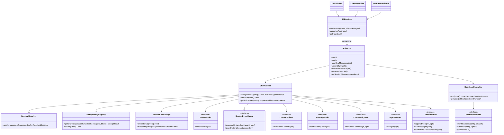
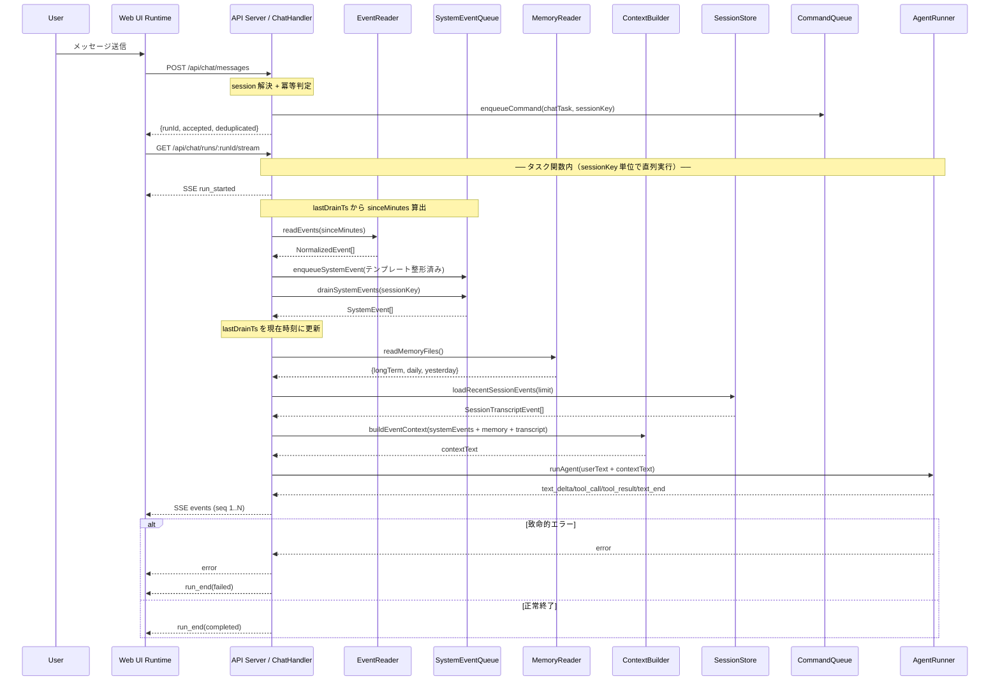

# API サーバー + Web UI 層

> **マスタープラン**: `doc/plan/260214-s01-ai-assistant-mvp.md`
> **担当**: 担当 C（API + フロントエンド）
> **並行プラン**: s01（データ・キュー基盤層）、s02（AI 実行層）

---

## 1. 概要と目的 Overview and Purpose

### What

HTTP API サーバー（SSE ストリーミング含む）と `@assistant-ui/react` ベースの Web UI を実装し、MVP の対話インターフェースを提供する。

### Why

API と UI の契約を単一レイヤーで管理することで、ストリーミング表示、終端整合性、ハートビート可視化を一貫させる。特に AC-14、AC-19、AC-21 を本プランで閉じる。

### How

`POST /api/chat/messages` と `GET /api/chat/runs/:runId/stream` の 2 段フローを採用し、サーバー側で公開 SSE 契約を固定する。ChatHandler はマスタープラン §5.3 に基づき、CommandQueue タスク関数内で EventReader による新規イベント取得 → SystemEventQueue 投入 → drain → MemoryReader + SessionStore から直近窓取得 → ContextBuilder でプロンプト組み立て → AgentRunner で実行、というパイプラインを構築する。readEvents → SEQ 投入 → drain → lastDrainTs 更新は CQ タスク関数内で実行し、sessionKey 単位の直列化により lastDrainTs 競合を防止する。UI はカスタム Runtime で SSE とハートビートポーリングを扱い、依存モジュール（s01/s02）はモックから段階的に結合する。

---

## 2. 仕様と受け入れ条件 Specification and Acceptance Criteria

### 2.1 スコープ Scope

**今回やること:**

- API Server 実装（`src/assistant/api-server.ts`）: チャット送信、SSE 配信、履歴 API、ハートビート API、keepalive（15 秒間隔 `: ping\n\n`）
- ChatHandler 実装（`src/assistant/chat-handler.ts`）: session 解決、冪等判定、EventReader → SystemEventQueue 投入、ContextBuilder 連携、CommandQueue 連携、AgentRunner 連携
- Web UI 実装（`src/ui/`）: Thread、Composer、SSE Runtime（再接続: initial=2s, max=30s, factor=1.8, jitter=25%, maxAttempts=12）、HeartbeatIndicator
- 実行導線追加: `package.json` に `"assistant"` スクリプト追加、`pnpm run assistant` で API + UI を起動
- テスト追加: HTTP/SSE 契約のユニットテスト、API-UI の統合スモークテスト

**成果物:**

- `src/assistant/api-server.ts`
- `src/assistant/chat-handler.ts`
- `src/ui/App.tsx`, `src/ui/runtime.ts`, `src/ui/components/HeartbeatIndicator.tsx`
- `vite.config.ts`, UI エントリポイント、関連テスト

> **注**: `StreamEvent` 型は s01 の `src/assistant/types.ts` で定義される共有型を import する（§3 参照）。本プランでは `stream-event.ts` を別途作成しない。

**制約:**

- Prototype First として本番配備要件（認証、マルチノード、永続再生）は対象外
- API Server はローカルバインド（`127.0.0.1`）を維持
- s01/s02 の契約を前提にし、公開 API 破壊が必要な場合は明示して移行方針を記載
- 共有型（`StreamEvent`, `SessionTranscriptEvent`, `SystemEvent` 等）は s01 の `src/assistant/types.ts` から import する

### 2.2 非スコープ Non Scope

- ユーザー認証、認可、監査ログなどのセキュリティ実装
- 本番配信トポロジー（CDN、リバースプロキシ、TLS 終端）
- `Last-Event-ID` を使ったサーバー側リプレイ再開
- 複数セッション切替 UI（MVP+ 項目）
- E2E テスト完全自動化（本プランはユニット/統合 + 手動確認まで）

### 2.3 ユースケース Use Cases

1. ユーザーがメッセージを送信すると、API が `runId` を返し、UI が SSE で逐次応答を表示する。
2. モデルが非ストリーミング応答を返した場合でも、`text_end.text` のみで UI が本文を確定表示する。
3. 同一 `sessionKey + clientMessageId` を再送した場合、TTL 内なら同一 `runId` に合流し重複実行しない。
4. 実行中に致命的エラーが起きた場合、`error` の後に `run_end(status: "failed")` で必ず終端する。
5. UI が `GET /api/heartbeat/last` を 3 秒ポーリングし、`indicatorType` ごとに状態バッジを表示する。
6. 実行済み run に対して遅れて stream 接続した場合、完了済み `run_end` を即時返却して接続を閉じる。

### 2.4 受け入れ条件 Acceptance Criteria

マスタープラン AC 番号に対応させる。

**AC-14: UI 表示と Heartbeat 状態表示**
- Given `text_delta` が 0 件の run を UI が購読している
- When `text_end` が到着する
- Then UI は `text_end.text` を本文として表示更新し、`run_end` 到着で完了状態に遷移する
- Given UI が 3 秒ポーリングで `GET /api/heartbeat/last` を呼ぶ
- When `indicatorType` が `ok | alert | error` で返る
- Then それぞれ対応するバッジとプレビューを表示する

**AC-19: 終端一意性**
- Given AgentRunner が致命的エラーを返す
- When stream を配信する
- Then SSE は `error` を先に送り、続けて `run_end(status: "failed")` を 1 回だけ送る

**AC-21: 冪等再送**
- Given 同一 `sessionKey + clientMessageId` を 300 秒以内に再送する
- When `POST /api/chat/messages` を再度呼ぶ
- Then 初回と同じ `runId` を返し、`deduplicated: true` となり新規キュー投入を行わない

**P-01: assistant スクリプト起動**
- Given `pnpm run assistant` を実行する
- When API Server と Vite UI が起動する
- Then ブラウザでチャット画面が表示され、送信から応答表示まで完了できる

**補足条件（AC 番号なし）:**

- Given API Server が起動している When `POST /api/chat/messages` に新規 `clientMessageId` を送る Then `200` で `{ accepted, deduplicated, runId, sessionId, sessionKey }` を返す
- Given run が完了済みで stream 未接続だった When `GET /api/chat/runs/:runId/stream` を開く Then 完了済み `run_end` を即時送信し、接続を閉じる

### 2.5 既知の制約 Known Limitations

- 冪等キャッシュと run 状態はプロセス内メモリで管理するため、再起動時に失われる。
- SSE 再接続はクライアント主導（指数バックオフ）のみで、サーバー側リプレイは未対応。
- ハートビート取得 API は MVP では `main` セッションの最新結果のみ返す。
- UI の動作保証はユニットテスト + 手動確認が中心で、クロスブラウザ E2E は対象外。

---

## 3. 前提技術スタック Context and Tech Stack

- **Language / Framework**: TypeScript 5.x、Node.js（ESM）、React 19、Vite
- **Libraries**: `@assistant-ui/react`、`@mariozechner/pi-coding-agent`、既存の Node 標準 `http` / `stream` API
- **Style Guide**: 既存の ESLint（`@typescript-eslint`）と Prettier（2 spaces / double quotes）に準拠
- **Runtime / Deployment**: 開発環境ローカル実行。API Server は `127.0.0.1:3100`、UI は Vite（既定 `5173`）で proxy 連携
- **Testing**: `node --test` + `tsx`（既存 `pnpm run test`）、`pnpm run check` を品質ゲートとする
- **共有型の取り込み**: s01 の `src/assistant/types.ts` から `StreamEvent`, `SessionTranscriptEvent`, `SystemEvent`, `AgentRunStatus` 等を import する

---

## 4. インターフェース契約 Interface Contracts

### 4.1 公開 API または外部 I/O 一覧

| 種別 | エンドポイント/境界 | 入力 | 出力 | 備考 |
|---|---|---|---|---|
| HTTP API | `POST /api/chat/messages` | `text`, `clientMessageId`, `sessionId?`, `sessionKey?` | `runId`, `sessionId`, `sessionKey`, `accepted`, `deduplicated` | run 作成と冪等判定 |
| HTTP API | `GET /api/chat/runs/:runId/stream` | `runId` | `text/event-stream` | `run_started` から `run_end` までの公開 SSE |
| HTTP API | `GET /api/chat/sessions/:sessionId/messages` | `sessionId` | `SessionMessage[]` | UI 初期表示用履歴 |
| HTTP API | `POST /api/heartbeat/run` | `{ mode: "now" \| "scheduled" }` | `HeartbeatRunResult` | 手動/定期 heartbeat 実行 |
| HTTP API | `GET /api/heartbeat/last` | なし | `HeartbeatEventPayload \| null` | UI は 3 秒ポーリング |
| 外部 I/O | `EventReader.readEvents` | `ReadEventsOptions` | `NormalizedEvent[]` | s01 契約。ChatHandler が新規イベント取得に使用 |
| 外部 I/O | `SystemEventQueue.enqueueSystemEvent` / `drainSystemEvents` | `SystemEvent`, `sessionKey` | `void` / `SystemEvent[]` | s01 契約。ChatHandler が投入・排出 |
| 外部 I/O | `ContextBuilder.buildEventContext` | `ContextBuildOptions` | `ContextBuildResult` | s01 契約。ChatHandler がプロンプト組み立て |
| 外部 I/O | `MemoryReader.readMemoryFiles` | `MemoryReadOptions` | `{longTerm, daily, yesterday}` | s01 契約。ChatHandler がメモリ読み込み |
| 外部 I/O | `CommandQueue.enqueueCommand` | `sessionKey`, task | Promise 結果 | s01 契約。sessionKey 単位直列化 |
| 外部 I/O | `AgentRunner.runAgent` | prompt, callbacks | `AgentRunResult` | s02 契約に依存 |
| 外部 I/O | `HeartbeatRunner.startHeartbeat` | `HeartbeatConfig`, `onAlert` callback | `{ stop: () => void }` | s02 契約。定期タイマー起動 |
| 外部 I/O | `HeartbeatRunner.runOnce` | `HeartbeatConfig`, `opts?: { mode }` | `Promise<HeartbeatRunResult>` | s02 契約。手動/定期の単発実行 |
| 外部 I/O | `HeartbeatRunner.getLastResult` | なし | `HeartbeatEventPayload \| null` | s02 契約。最新結果取得 |
| 外部 I/O | `SessionStore` | append/load | transcript | s01 契約。永続ログ |

### 4.2 データモデルとスキーマ

```typescript
type PostChatMessageRequest = {
  text: string;
  clientMessageId: string;
  sessionId?: string;
  sessionKey?: string;
};

type PostChatMessageResponse = {
  runId: string;
  sessionId: string;
  sessionKey: string;
  accepted: true;
  deduplicated: boolean;
};

// StreamEvent は s01 の src/assistant/types.ts で定義。本プランでは import して使用する。
// import { StreamEvent } from "./types.js";
```

- session 解決ルール
  - `sessionKey` 指定時は最優先で採用
  - `sessionId` のみ指定時は `sessionId -> sessionKey` を逆引き
  - 両方指定で不整合なら `400 Bad Request`
  - どちらも未指定なら既定 `sessionKey: "main"` で `sessionId` を採番
- バリデーション方針
  - 必須項目欠落は `400`
  - `clientMessageId` は空文字不可
  - SSE `seq` は `runId` ごとに 1..N を単調増加させる
  - `run_end` は `runId` ごとに 1 回のみ公開する
- lastDrainTs 管理（イベント再注入防止）
  - ChatHandler は sessionKey 単位で `lastDrainTs`（前回 drain 時刻、epoch ms）を保持する
  - `lastDrainTs` から現在までの差分を `sinceMinutes` に換算し `EventReader.readEvents()` に渡す
  - 初回（`lastDrainTs` 未設定）はデフォルト `sinceMinutes`（60 分）を使用
  - `drainSystemEvents()` 実行後に `lastDrainTs` を現在時刻に更新する
  - **重要**: readEvents → SEQ enqueue → drain → lastDrainTs 更新の一連の処理は CommandQueue タスク関数内で実行する（sessionKey 単位の直列化により、同時リクエストでの lastDrainTs 競合・イベント重複注入を防止）
  - プロセス内メモリ管理（再起動時はリセット。MVP 割り切り）

### 4.3 エラーと例外 Error Handling

| 分類 | 条件 | API/SSE 挙動 | リトライ/タイムアウト | ログ方針 |
|---|---|---|---|---|
| 入力エラー | `sessionKey` と `sessionId` 不整合、必須欠落 | HTTP `400` | リトライ不要 | request id と理由を info/warn に記録 |
| 冪等再送 | TTL 内の重複 `clientMessageId` | HTTP `200` + `deduplicated: true` | リトライ不要 | dedupe hit を debug 記録 |
| 実行失敗 | AgentRunner 例外 | SSE `error` 後に `run_end(failed)` | AgentRunner 側方針に従う | stack を内部ログ、UI には簡潔な message |
| 接続切断 | クライアント SSE 切断 | サーバーは購読解除 | クライアントは `initial=2s, max=30s, factor=1.8, jitter=25%, maxAttempts=12` | 接続回数と切断理由を記録 |
| 完了後接続 | run 終了後に stream 接続 | `run_end` 即送信して close | リトライ不要 | close reason を debug 記録 |

- 個人情報の扱い
  - ログにはメッセージ全文を残さず、`runId`、`sessionKey`、イベント種別を中心に記録する。
  - エラー応答は内部パスや secret を含まない。

### 4.4 代表的な例 Examples

```bash
curl -X POST http://127.0.0.1:3100/api/chat/messages \
  -H "Content-Type: application/json" \
  -d '{
    "text": "直近の要点をまとめて",
    "clientMessageId": "msg-001",
    "sessionKey": "main"
  }'
```

```json
{
  "runId": "run_260215_0001",
  "sessionId": "sess_main_0012",
  "sessionKey": "main",
  "accepted": true,
  "deduplicated": false
}
```

```text
GET /api/chat/runs/run_260215_0001/stream

event: run_started
data: {"type":"run_started","runId":"run_260215_0001","sessionId":"sess_main_0012","sessionKey":"main","seq":1}

event: text_end
data: {"type":"text_end","runId":"run_260215_0001","text":"要点は3つです。","seq":2}

event: run_end
data: {"type":"run_end","runId":"run_260215_0001","status":"completed","seq":3}
```

```bash
curl http://127.0.0.1:3100/api/heartbeat/last
```

```json
{
  "ts": 1760457900000,
  "status": "sent",
  "preview": "未返信のメンションがあります",
  "indicatorType": "alert"
}
```

---

## 5. アーキテクチャと設計図 Architecture and Diagrams

### 5.1 図の選択方針

- 本プランは API Server、UI Runtime、s01/s02 モジュールを跨ぐためクラス図を必須とする。
- SSE 配信と再接続の非同期挙動が要件の中心であるため、補助としてシーケンス図を追加する。

### 5.2 クラス図 Class Diagram



### 5.3 その他の図 Optional



---

## 6. テスト戦略 Test Strategy

### 6.1 テストの種類

- Unit
  - `POST /api/chat/messages`: session 解決 4 分岐、`accepted` 契約、冪等 TTL、ChatHandler の EventReader → SEQ 投入、タスク関数内の SEQ drain → MemoryReader → SessionStore 直近窓 → ContextBuilder パイプライン
  - `GET /api/chat/runs/:runId/stream`: `seq` 単調増加、`text_end` 単発、`run_end` 一意、`error -> run_end(failed)` 順序、keepalive
  - SSE 変換: 内部イベントから公開 `StreamEvent` への射影（不要イベント除外含む）
  - Heartbeat API: `POST /api/heartbeat/run`、`GET /api/heartbeat/last`
  - UI Runtime: `text_delta` 0 件時の `text_end` 反映、seq 欠落検知、再接続バックオフ
- Integration
  - API Server + CommandQueue + AgentRunner + SessionStore の結合
  - Vite proxy 経由の UI -> API 疎通スモーク
- Contract
  - `StreamEvent` 型契約とサンプル JSON スナップショット
  - `PostChatMessageResponse` の後方互換チェック（必須フィールド維持）
  - Heartbeat payload の `indicatorType` 契約チェック

### 6.2 カバレッジ対象

- 重要ロジック
  - session 解決優先順位
  - `clientMessageId` 冪等管理（TTL 内外）
  - SSE 終端一意性ガード
  - `lastDrainTs` ベースの増分イベント取得（再注入防止）
  - AgentRunStatus 状態遷移記録（queued → running → completed/failed）
- エラー分岐
  - 不正入力 `400`
  - AgentRunner 失敗時の終端順序
  - stream 未接続 run の遅延購読
- 境界条件
  - `text_delta` 0 件
  - keepalive 間隔（15 秒）
  - 再接続回数上限（12 回）

---

## 7. 実装タスクリスト Implementation Plan

### Phase 1 設計と準備

- [ ] 要件と仕様の確定（AC-14/19/21 と P-01 の観測可能な完了条件を固定）
- [ ] インターフェース契約確定（API schema、SSE schema、エラー契約、サンプル更新）
- [ ] Mermaid 図作成更新（クラス図 + シーケンス図）
- [ ] 型定義作成（API request/response 型。`StreamEvent` は s01 `types.ts` から import）
- [ ] `package.json` に `"assistant"` スクリプトを追加（P-01 前提。マスタープラン Phase 1 準拠）
- [ ] テスト基盤確認（`node --test` で HTTP/SSE テストユーティリティを整備）

### Phase 2 API Server 基本フロー

- [ ] Test: `POST /api/chat/messages` 新規受理ケース（Red）
- [ ] Test: session 解決 4 分岐（Red）
- [ ] Impl: ChatHandler + SessionResolver（Green）
- [ ] Test: ChatHandler の lastDrainTs 管理 — 同一 sessionKey で同時 2 リクエストを投入しても、CQ 直列化により前回 drain 以降のイベントのみ取得され同一イベントが再注入されない（Red）
- [ ] Test: ChatHandler が EventReader で新規イベントを取得し SystemEventQueue に投入する（Red）
- [ ] Test: タスク関数内で SEQ drain → MemoryReader → SessionStore 直近窓 → ContextBuilder でプロンプト構築（Red）
- [ ] Impl: ChatHandler の EventReader → SEQ → ContextBuilder パイプライン（Green）
- [ ] Refactor: resolver と request validation の重複排除
- [ ] Test: `GET /api/chat/runs/:runId/stream` 基本フロー（Red）
- [ ] Impl: SSE 基本配信 + keepalive（15 秒間隔 `: ping\n\n`）（Green）
- [ ] Refactor: stream 接続管理と close cleanup

### Phase 3 API Server 拡張

- [ ] Test: `seq` 単調増加、`text_end` 単発、`run_end` 一意（Red）
- [ ] Test: `error -> run_end(failed)` 順序保証（Red）
- [ ] Impl: StreamEventBridge + terminal guard（Green）
- [ ] Refactor: SSE 変換レイヤー分離
- [ ] Test: 冪等 TTL 内外の再送（Red）
- [ ] Impl: IdempotencyRegistry（Map + TTL cleanup）（Green）
- [ ] Test: AgentRunStatus 状態遷移記録 — コマンド実行前に `queued`/`running`、完了後に `completed`/`failed` が SessionStore に記録される（Red）
- [ ] Impl: ChatHandler の AgentRunStatus 記録（コマンド実行前後で状態遷移を SessionStore に appendEvent）（Green）
- [ ] Test: 履歴 API と heartbeat API（Red）
- [ ] Impl: `GET /api/chat/sessions/:sessionId/messages`、`POST/GET /api/heartbeat/*`（Green）
- [ ] Integration: API Server と s01/s02 実装の結合テスト

### Phase 4 Web UI 実装

- [ ] Test: Runtime が `text_delta` 0 件時に `text_end.text` で本文更新（Red）
- [ ] Test: Runtime の seq 欠落検知（Red）
- [ ] Test: SSE 再接続バックオフ — initial=2s, max=30s, factor=1.8, jitter=25%, maxAttempts=12（Red）
- [ ] Impl: SSE 再接続ロジック（指数バックオフ + jitter + 完了済み run 判定）（Green）
- [ ] Impl: Thread + Composer + Runtime（Green）
- [ ] Refactor: UI state と SSE parser の責務分離
- [ ] Test: HeartbeatIndicator の 3 秒ポーリング表示（Red）
- [ ] Impl: HeartbeatIndicator + 履歴初期読み込み（Green）
- [ ] Integration: Vite proxy 経由の送受信スモーク

### Phase 5 統合と検証

- [ ] 全体テスト実行（`pnpm run check`）
- [ ] エッジケース確認（完了後 stream 接続、再接続上限、重複終端）
- [ ] ログと例外確認（不正入力、タイムアウト、AgentRunner 失敗）
- [ ] ドキュメント更新（`README.md`、`CLAUDE.md`、本計画）
- [ ] P-01 検証（`pnpm run assistant` で画面起動と 1 往復チャット成功）

---

## 8. 完了の定義 Definition of Done

### 8.1 機能 DoD Functional DoD

- [ ] AC-14: UI が `text_delta` 0 件でも `text_end.text` で本文表示でき、heartbeat 状態を表示できる
- [ ] AC-19: 致命的エラー時に `error` の後で `run_end(failed)` が 1 回だけ配信される
- [ ] AC-21: 同一 `sessionKey + clientMessageId` の再送が冪等処理される
- [ ] P-01: `pnpm run assistant` で API + UI が起動し、チャット画面から送受信できる
- [ ] 契約例（4.4）のリクエスト/レスポンスが実装と一致する

### 8.2 品質 DoD Quality DoD

- [ ] `pnpm run check` が成功する（format、typecheck、test）
- [ ] 追加した Unit/Integration/Contract テストが全てパスする
- [ ] API Server が `127.0.0.1` のみにバインドされている
- [ ] 不要なデバッグログや実験コードが残っていない
- [ ] 仕様・契約・図の差分がドキュメントに反映されている

---

## 9. 懸念事項と未確定事項 Concerns and Questions

### 技術的な懸念点

- assistant-ui Runtime API の変更追従コストが高いため、薄い adapter 層を入れるかどうかを実装時に判断する
- UI の再接続失敗時 UX（自動再試行のみ/手動再接続ボタン併用）の最終判断が必要

### 仕様が曖昧で決定が必要な事項

- `runId` / `sessionId` の採番方式（UUIDv7 か既存規約か）が未確定。s01/s02 と共通化が必要
- `GET /api/heartbeat/last` を将来マルチセッション化する際の query 仕様（`sessionKey` 追加可否）が未決定

### プロトタイプとして許容するリスク

- 冪等キャッシュと run 状態はプロセス内メモリ管理のため、再起動時にキャッシュが失われる
- SSE 再接続はクライアント主導のみ。サーバー側 `Last-Event-ID` リプレイは未対応
