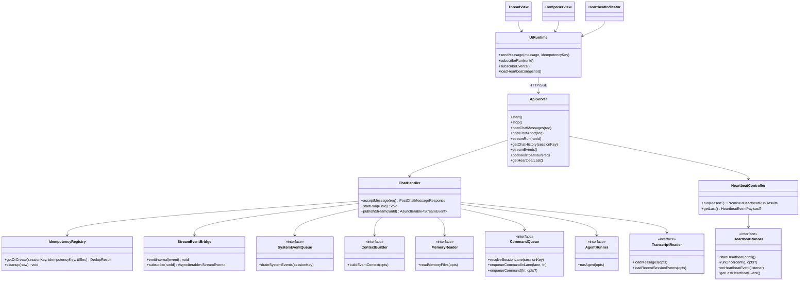
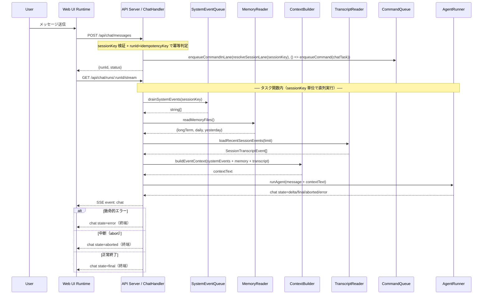

# API サーバー + Web UI 層

> **マスタープラン**: `doc/plan/260214-s01-ai-assistant-mvp.md`
> **担当**: 担当 C（API + フロントエンド）
> **並行プラン**: s01（データ・キュー基盤層）、s02（AI 実行層）

---

## 1. 概要と目的 Overview and Purpose

### What

HTTP API サーバー（SSE ストリーミング含む）と `@assistant-ui/react` ベースの Web UI を実装し、MVP の対話インターフェースを提供する。

### Why

API と UI の契約を単一レイヤーで管理することで、ストリーミング表示、終端整合性、ハートビート可視化を一貫させる。特に AC-14、AC-19、AC-21 を本プランで閉じる。

### How

`POST /api/chat/messages` と `GET /api/chat/runs/:runId/stream` の 2 段フローを採用し、サーバー側で OpenClaw 準拠の `event: chat` 契約（`state: "delta" | "final" | "aborted" | "error"`）を固定する。ChatHandler はマスタープラン §5.3 に基づき、CommandQueue タスク関数内で `SystemEventQueue.drain` → `MemoryReader` + `TranscriptReader` から直近窓取得 → `ContextBuilder` でプロンプト組み立て → `AgentRunner` 実行のパイプラインを構築する。ユーザー run は `enqueueCommandInLane(resolveSessionLane(sessionKey), () => enqueueCommand(chatTask))` で直列化し、UI はカスタム Runtime で SSE（chat / heartbeat）と heartbeat スナップショットを扱う。

---

## 2. 仕様と受け入れ条件 Specification and Acceptance Criteria

### 2.1 スコープ Scope

**今回やること:**

- API Server 実装（`src/assistant/api-server.ts`）: チャット送信、SSE 配信、履歴 API、ハートビート API、keepalive（15 秒間隔 `: ping\n\n`）
- ChatHandler 実装（`src/assistant/chat-handler.ts`）: sessionKey 検証、冪等判定、SystemEventQueue drain、ContextBuilder 連携、CommandQueue（`main` + `session:<sessionKey>`）連携、AgentRunner 連携
- Web UI 実装（`src/ui/`）: Thread、Composer、SSE Runtime（再接続: initial=2s, max=30s, factor=1.8, jitter=25%, maxAttempts=12）、HeartbeatIndicator
- 実行導線追加: `package.json` に `"assistant"` スクリプト追加、`pnpm run assistant` で API + UI を起動
- テスト追加: HTTP/SSE 契約のユニットテスト、API-UI の統合スモークテスト

**成果物:**

- `src/assistant/api-server.ts`
- `src/assistant/chat-handler.ts`
- `src/ui/App.tsx`, `src/ui/runtime.ts`, `src/ui/components/HeartbeatIndicator.tsx`
- `vite.config.ts`, UI エントリポイント、関連テスト

> **注**: `StreamEvent` 型は s01 の `src/assistant/types.ts` で定義される共有型を import する（§3 参照）。本プランでは `stream-event.ts` を別途作成しない。

**制約:**

- Prototype First として本番配備要件（認証、マルチノード、永続再生）は対象外
- API Server はローカルバインド（`127.0.0.1`）を維持
- s01/s02 の契約を前提にし、公開 API 破壊が必要な場合は明示して移行方針を記載
- 共有型（`StreamEvent`, `SessionTranscriptEvent`, `SystemEvent` 等）は s01 の `src/assistant/types.ts` から import する

### 2.2 非スコープ Non Scope

- ユーザー認証、認可、監査ログなどのセキュリティ実装
- 本番配信トポロジー（CDN、リバースプロキシ、TLS 終端）
- `Last-Event-ID` を使ったサーバー側リプレイ再開
- 複数セッション切替 UI（MVP+ 項目）
- E2E テスト完全自動化（本プランはユニット/統合 + 手動確認まで）

### 2.3 ユースケース Use Cases

1. ユーザーがメッセージを送信すると、API が `runId`（=`idempotencyKey`）と `status` を返し、UI が SSE で逐次応答を表示する。
2. モデルが非ストリーミング応答を返した場合でも、`state: "final"` の `message` だけで本文を確定表示できる。
3. 同一 `sessionKey + idempotencyKey` を再送した場合、TTL 内なら同一 `runId` に合流し重複実行しない。
4. 実行中に致命的エラーが起きた場合、`state: "error"` を終端として 1 回だけ配信する。
5. UI が `GET /api/events/stream` を購読して heartbeat push を受け、初期表示は `GET /api/heartbeat/last` で復元する。
6. 実行済み run に対して遅れて stream 接続した場合、完了済み終端 state（`final`/`aborted`/`error`）を即時返却して接続を閉じる。

### 2.4 受け入れ条件 Acceptance Criteria

マスタープラン AC 番号に対応させる。

**AC-14: UI 表示と Heartbeat 状態表示**

- Given `state: "delta"` が 0 件の run を UI が購読している
- When `state: "final"` が到着する
- Then UI は `final.message` を本文として表示更新し、終端状態に遷移する
- Given UI が `GET /api/events/stream` + `GET /api/heartbeat/last` を利用する
- When `indicatorType` が `ok | alert | error` で返る
- Then それぞれ対応するバッジとプレビューを表示する

**AC-19: 終端一意性**

- Given AgentRunner が致命的エラーを返す
- When stream を配信する
- Then SSE は `state: "error"` を終端として 1 回だけ送る

**AC-21: 冪等再送**

- Given 同一 `sessionKey + idempotencyKey` を 300 秒以内に再送する
- When `POST /api/chat/messages` を再度呼ぶ
- Then 初回と同じ `runId` を返し、`status: "in_flight" | "ok" | "error"` を返して新規キュー投入を行わない

**P-01: assistant スクリプト起動**

- Given `pnpm run assistant` を実行する
- When API Server と Vite UI が起動する
- Then ブラウザでチャット画面が表示され、送信から応答表示まで完了できる

**補足条件（AC 番号なし）:**

- Given API Server が起動している When `POST /api/chat/messages` に新規 `idempotencyKey` を送る Then `200` で `{ runId, status, summary? }` を返す
- Given run が完了済みで stream 未接続だった When `GET /api/chat/runs/:runId/stream` を開く Then 完了済み終端 state を即時送信し、接続を閉じる

### 2.5 既知の制約 Known Limitations

- 冪等キャッシュと run 状態はプロセス内メモリで管理するため、再起動時に失われる。
- SSE 再接続はクライアント主導（指数バックオフ）のみで、サーバー側リプレイは未対応。
- `GET /api/heartbeat/last` は MVP では「最後に emit された heartbeat イベント」1 件のみ返す（sessionKey 指定の取得は将来拡張）。
- UI の動作保証はユニットテスト + 手動確認が中心で、クロスブラウザ E2E は対象外。

---

## 3. 前提技術スタック Context and Tech Stack

- **Language / Framework**: TypeScript 5.x、Node.js（ESM）、React 19、Vite
- **Libraries**: `@assistant-ui/react`、`@mariozechner/pi-coding-agent`、既存の Node 標準 `http` / `stream` API
- **Style Guide**: 既存の ESLint（`@typescript-eslint`）と Prettier（2 spaces / double quotes）に準拠
- **Runtime / Deployment**: 開発環境ローカル実行。API Server は `127.0.0.1:3100`、UI は Vite（既定 `5173`）で proxy 連携
- **Testing**: `node --test` + `tsx`（既存 `pnpm run test`）、`pnpm run check` を品質ゲートとする
- **共有型の取り込み**: s01 の `src/assistant/types.ts` から `StreamEvent`, `SessionTranscriptEvent`, `SystemEvent`, `AgentRunStatus` 等を import する

---

## 4. インターフェース契約 Interface Contracts

### 4.1 公開 API または外部 I/O 一覧

| 種別     | エンドポイント/境界                                                                         | 入力                                      | 出力                                              | 備考                                                      |
| -------- | ------------------------------------------------------------------------------------------- | ----------------------------------------- | ------------------------------------------------- | --------------------------------------------------------- |
| HTTP API | `POST /api/chat/messages`                                                                   | `message`, `sessionKey`, `idempotencyKey` | `runId`, `status`, `summary?`                     | run 作成と冪等判定（`runId=idempotencyKey`）              |
| HTTP API | `POST /api/chat/abort`                                                                      | `sessionKey`, `runId?`                    | `{ ok, aborted, runIds }`                         | OpenClaw chat.abort 準拠                                  |
| HTTP API | `GET /api/chat/runs/:runId/stream`                                                          | `runId`                                   | `text/event-stream`                               | `event: chat`（`state: delta/final/aborted/error`）       |
| HTTP API | `GET /api/chat/history?sessionKey=...`                                                      | `sessionKey`                              | `{ sessionKey, sessionId?, messages: unknown[] }` | OpenClaw chat.history 準拠                                |
| HTTP API | `POST /api/heartbeat/run`                                                                   | `{ reason?: string }`                     | `HeartbeatRunResult`                              | 手動 heartbeat 実行（`runOnce` を同期実行して結果を返す） |
| HTTP API | `GET /api/events/stream`                                                                    | なし                                      | `text/event-stream`                               | `event: heartbeat` push                                   |
| HTTP API | `GET /api/heartbeat/last`                                                                   | なし                                      | `HeartbeatEventPayload \| null`                   | heartbeat 最新スナップショット                            |
| 外部 I/O | `SystemEventQueue.drainSystemEvents`                                                        | `sessionKey`                              | `string[]`                                        | s01 契約。ChatHandler が排出のみ行う                      |
| 外部 I/O | `ContextBuilder.buildEventContext`                                                          | `ContextBuildOptions`                     | `ContextBuildResult`                              | s01 契約。ChatHandler がプロンプト組み立て                |
| 外部 I/O | `MemoryReader.readMemoryFiles`                                                              | `MemoryReadOptions`                       | `{longTerm, daily, yesterday}`                    | s01 契約。ChatHandler がメモリ読み込み                    |
| 外部 I/O | `CommandQueue.resolveSessionLane` + `enqueueCommandInLane` + `enqueueCommand`               | `lane`, task                              | Promise 結果                                      | s01 契約。`main` + `session:<sessionKey>` 直列化          |
| 外部 I/O | `AgentRunner.runAgent`                                                                      | prompt, callbacks                         | `AgentRunResult`                                  | s02 契約に依存                                            |
| 外部 I/O | `HeartbeatRunner.startHeartbeat` + `runOnce` + `onHeartbeatEvent` + `getLastHeartbeatEvent` | `HeartbeatConfig`, reason/listener        | stop/one-shot/unsubscribe/snapshot                | s02 契約。heartbeat push + 手動実行 + スナップショット    |
| 外部 I/O | `TranscriptReader.loadMessages` / `loadRecentSessionEvents`                                 | `sessionKey`, `limit`                     | `unknown[]` / `SessionTranscriptEvent[]`          | s01 契約。履歴表示と直近窓                                |

### 4.2 データモデルとスキーマ

```typescript
type PostChatMessageRequest = {
  message: string;
  sessionKey: string;
  idempotencyKey: string;
};

type PostChatMessageResponse = {
  runId: string;
  status: "started" | "in_flight" | "ok" | "error";
  summary?: string;
};

// StreamEvent は s01 の src/assistant/types.ts で定義。本プランでは import して使用する。
// import { StreamEvent } from "./types.js";
```

- session 解決ルール
  - `sessionKey` は必須。未指定/空文字は `400 Bad Request`
  - `runId` は `${sessionKey}:${idempotencyKey}` で生成する（クロスセッション衝突防止）
- バリデーション方針
  - 必須項目欠落は `400`
  - `idempotencyKey` は OpenClaw `NonEmptyString` 準拠（`minLength: 1` のみ）
  - `idempotencyKey` に独自の `maxLength` / 文字種 `pattern` 制約は追加しない
  - chat payload の `seq` は `runId` ごとに単調増加（通常 1 始まり、互換予約で 0 許容）
  - 終端 state（`final`/`aborted`/`error`）は `runId` ごとに 1 回のみ公開する
- ChatHandler タスク関数内の実行順
  - `drainSystemEvents(sessionKey)` → `readMemoryFiles()` → `loadRecentSessionEvents()` → `buildEventContext()` → `runAgent()`
  - 上記一連を `enqueueCommandInLane(resolveSessionLane(sessionKey), () => enqueueCommand(chatTask))` で直列化する

### 4.3 エラーと例外 Error Handling

| 分類       | 条件                          | API/SSE 挙動                                             | リトライ/タイムアウト                                                        | ログ方針                                |
| ---------- | ----------------------------- | -------------------------------------------------------- | ---------------------------------------------------------------------------- | --------------------------------------- | ------------ | ------------------------ |
| 入力エラー | `sessionKey` 欠落、必須欠落   | HTTP `400`                                               | リトライ不要                                                                 | request id と理由を info/warn に記録    |
| 冪等再送   | TTL 内の重複 `idempotencyKey` | HTTP `200` + `status: "in_flight"                        | "ok"                                                                         | "error"`                                | リトライ不要 | dedupe hit を debug 記録 |
| 実行失敗   | AgentRunner 例外              | SSE `event: chat` with `state: "error"` を終端として送信 | AgentRunner 側方針に従う                                                     | stack を内部ログ、UI には簡潔な message |
| 接続切断   | クライアント SSE 切断         | サーバーは購読解除                                       | クライアントは `initial=2s, max=30s, factor=1.8, jitter=25%, maxAttempts=12` | 接続回数と切断理由を記録                |
| 完了後接続 | run 終了後に stream 接続      | 完了済み終端 state を即送信して close                    | リトライ不要                                                                 | close reason を debug 記録              |

- 個人情報の扱い
  - ログにはメッセージ全文を残さず、`runId`、`sessionKey`、イベント種別を中心に記録する。
  - エラー応答は内部パスや secret を含まない。

### 4.4 代表的な例 Examples

```bash
curl -X POST http://127.0.0.1:3100/api/chat/messages \
  -H "Content-Type: application/json" \
  -d '{
    "message": "直近の要点をまとめて",
    "idempotencyKey": "msg-001",
    "sessionKey": "main"
  }'
```

```json
{
  "runId": "msg-001",
  "status": "started"
}
```

```text
GET /api/chat/runs/msg-001/stream

event: chat
data: {"runId":"msg-001","sessionKey":"main","seq":1,"state":"delta","message":{"role":"assistant","content":[{"type":"text","text":"要点は"}],"timestamp":1760457900000}}

event: chat
data: {"runId":"msg-001","sessionKey":"main","seq":2,"state":"final","message":{"role":"assistant","content":[{"type":"text","text":"要点は3つです。"}],"timestamp":1760457900400}}
```

```bash
curl http://127.0.0.1:3100/api/heartbeat/last
```

```json
{
  "ts": 1760457900000,
  "status": "sent",
  "preview": "未返信のメンションがあります",
  "indicatorType": "alert"
}
```

---

## 5. アーキテクチャと設計図 Architecture and Diagrams

### 5.1 図の選択方針

- 本プランは API Server、UI Runtime、s01/s02 モジュールを跨ぐためクラス図を必須とする。
- SSE 配信と再接続の非同期挙動が要件の中心であるため、補助としてシーケンス図を追加する。

### 5.2 クラス図 Class Diagram



### 5.3 その他の図 Optional



---

## 6. テスト戦略 Test Strategy

### 6.1 テストの種類

- Unit
  - `POST /api/chat/messages`: `sessionKey` 必須、`runId=idempotencyKey`、冪等 TTL、ChatHandler の SEQ drain → MemoryReader → TranscriptReader 直近窓 → ContextBuilder パイプライン
  - `POST /api/chat/abort`: run 単位キャンセル / sessionKey 全件キャンセル / stop トリガー経路
  - `GET /api/chat/runs/:runId/stream`: `event: chat` の `seq` 単調増加、終端 state（`final`/`aborted`/`error`）一意、keepalive
  - SSE 変換: 内部イベントから公開 `StreamEvent` への射影（不要イベント除外含む）
  - Heartbeat API: `POST /api/heartbeat/run`、`GET /api/events/stream`、`GET /api/heartbeat/last`
  - UI Runtime: delta 0 件時の final 表示、seq 欠落検知、再接続バックオフ
- Integration
  - API Server + CommandQueue + AgentRunner + TranscriptReader の結合
  - Vite proxy 経由の UI -> API 疎通スモーク
- Contract
  - `StreamEvent` 型契約とサンプル JSON スナップショット
  - `PostChatMessageResponse` の後方互換チェック（必須フィールド維持）
  - Heartbeat payload の `indicatorType` 契約チェック

### 6.2 カバレッジ対象

- 重要ロジック
  - `runId=idempotencyKey` の冪等管理（TTL 内外）
  - SSE 終端一意性ガード
  - `main` + `session:<sessionKey>` レーン直列化
  - AgentRunStatus 状態遷移記録（queued → running → completed/failed）
- エラー分岐
  - 不正入力 `400`
  - AgentRunner 失敗時の終端順序
  - stream 未接続 run の遅延購読
- 境界条件
  - delta 0 件
  - keepalive 間隔（15 秒）
  - 再接続回数上限（12 回）

---

## 7. 実装タスクリスト Implementation Plan

### Phase 1 設計と準備

- [x] 要件と仕様の確定（AC-14/19/21 と P-01 の観測可能な完了条件を固定）
- [x] インターフェース契約確定（API schema、SSE schema、エラー契約、サンプル更新）
- [x] Mermaid 図作成更新（クラス図 + シーケンス図）
- [x] 型定義作成（API request/response 型。`StreamEvent` は s01 `types.ts` から import）
- [x] `package.json` に `"assistant"` スクリプトを追加（P-01 前提。マスタープラン Phase 1 準拠）
- [x] テスト基盤確認（`node --test` で HTTP/SSE テストユーティリティを整備）

### Phase 2 API Server 基本フロー

- [x] Test: `POST /api/chat/messages` 新規受理ケース（Red）
- [x] Test: `sessionKey` 必須バリデーション（Red）
- [x] Impl: ChatHandler request validation（Green）
- [x] Test: タスク関数内で SEQ drain → MemoryReader → TranscriptReader 直近窓 → ContextBuilder でプロンプト構築（Red）
- [x] Impl: ChatHandler の SEQ drain → ContextBuilder パイプライン（Green）
- [x] Refactor: validation と handler 分離
- [x] Test: `GET /api/chat/runs/:runId/stream` 基本フロー（Red）
- [x] Impl: SSE 基本配信 + keepalive（15 秒間隔 `: ping\n\n`）（Green）
- [x] Refactor: stream 接続管理と close cleanup

### Phase 3 API Server 拡張

- [x] Test: `seq` 単調増加、終端 state（`final`/`aborted`/`error`）一意（Red）
- [x] Test: `state: "error"` 終端保証（Red）
- [x] Test: `POST /api/chat/abort` — run 単位キャンセル / sessionKey 全件キャンセル / stop トリガー経路（Red）
- [x] Impl: StreamEventBridge + terminal guard（Green）
- [x] Impl: chat.abort ハンドラ（Green）
- [x] Refactor: SSE 変換レイヤー分離
- [x] Test: 冪等 TTL 内外の再送（Red）
- [x] Impl: IdempotencyRegistry（Map + TTL cleanup）（Green）
- [x] Test: AgentRunStatus 状態遷移記録 — コマンド実行前に `queued`/`running`、完了後に `completed`/`failed` が診断ログへ記録される（Red）
- [x] Impl: ChatHandler の AgentRunStatus 記録（コマンド実行前後で状態遷移を記録）（Green）
- [x] Test: 履歴 API と heartbeat API（Red）
- [x] Impl: `GET /api/chat/history`、`GET /api/events/stream`、`POST/GET /api/heartbeat/*`（Green）
- [x] Integration: API Server と s01/s02 実装の結合テスト

### Phase 4 Web UI 実装

- [x] Test: Runtime が delta 0 件時に final.message で本文更新（Red）
- [x] Test: Runtime の seq 欠落検知（Red）
- [x] Test: SSE 再接続バックオフ — initial=2s, max=30s, factor=1.8, jitter=25%, maxAttempts=12（Red）
- [x] Impl: SSE 再接続ロジック（指数バックオフ + jitter + 完了済み run 判定）（Green）
- [x] Impl: Thread + Composer + Runtime（Green）
- [x] Refactor: UI state と SSE parser の責務分離
- [x] Test: HeartbeatIndicator が `events/stream` の heartbeat push と `heartbeat/last` 初期復元を処理できる（Red）
- [x] Impl: HeartbeatIndicator + heartbeat snapshot 初期読み込み（Green）
- [x] Integration: Vite proxy 経由の送受信スモーク

### Phase 5 統合と検証

- [x] 全体テスト実行（`pnpm run check`）
- [x] エッジケース確認（完了後 stream 接続、再接続上限、重複終端）
- [x] ログと例外確認（不正入力、タイムアウト、AgentRunner 失敗）
- [x] ドキュメント更新（`README.md`、`CLAUDE.md`、本計画）
- [x] P-01 検証（`pnpm run assistant` で画面起動と 1 往復チャット成功）

---

## 8. 完了の定義 Definition of Done

### 8.1 機能 DoD Functional DoD

- [x] AC-14: UI が delta 0 件でも final.message で本文表示でき、heartbeat 状態を表示できる
- [x] AC-19: 致命的エラー時に `state: "error"` が終端として 1 回だけ配信される
- [x] AC-21: 同一 `sessionKey + idempotencyKey` の再送が冪等処理される
- [x] P-01: `pnpm run assistant` で API + UI が起動し、チャット画面から送受信できる
- [x] 契約例（4.4）のリクエスト/レスポンスが実装と一致する

### 8.2 品質 DoD Quality DoD

- [x] `pnpm run check` が成功する（format、typecheck、test）
- [x] 追加した Unit/Integration/Contract テストが全てパスする
- [x] API Server が `127.0.0.1` のみにバインドされている
- [x] 不要なデバッグログや実験コードが残っていない
- [x] 仕様・契約・図の差分がドキュメントに反映されている

---

## 9. 懸念事項と未確定事項 Concerns and Questions

### 技術的な懸念点

- assistant-ui Runtime API の変更追従コストが高いため、薄い adapter 層を入れるかどうかを実装時に判断する
- UI の再接続失敗時 UX（自動再試行のみ/手動再接続ボタン併用）の最終判断が必要

### 仕様が曖昧で決定が必要な事項

- `GET /api/heartbeat/last` を将来マルチセッション化する際の query 仕様（`sessionKey` 追加可否）が未決定

### プロトタイプとして許容するリスク

- 冪等キャッシュと run 状態はプロセス内メモリ管理のため、再起動時にキャッシュが失われる
- SSE 再接続はクライアント主導のみ。サーバー側 `Last-Event-ID` リプレイは未対応
