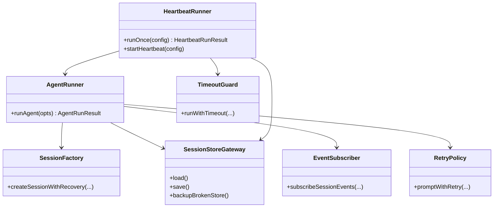
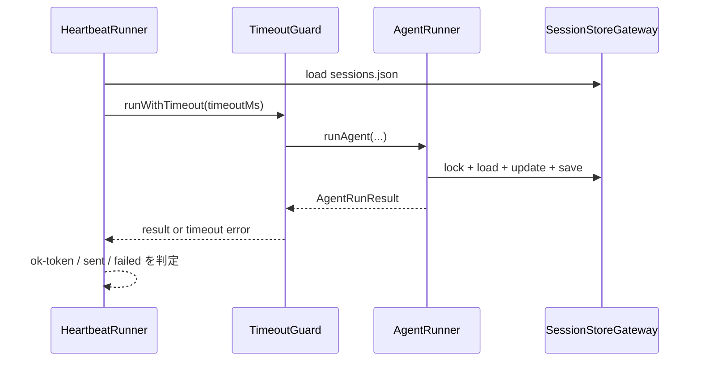

# 原則準拠リファクタリング（Assistant 実行層）

> 対象ガイド: `doc/AI_PLANNINGAI_GUIDE.md`
> 対象領域: `src/assistant/agent-runner.ts` / `src/assistant/heartbeat-runner.ts` / `src/assistant/session-entry-store.ts`

---

## 1. 概要と目的 Overview and Purpose

- What  
  Assistant 実行層の内部設計を、Prototype First / SOLID / KISS / YAGNI / DRY の原則に合わせて再整理する。  
  主目的は「挙動を維持したまま、責務分割と重複排除で保守性を上げる」こと。
- Why  
  現状は単一関数内に複数責務が混在し、再利用不能な分岐や重複処理が増えやすい。  
  仕様拡張時に不具合混入しやすく、テスト追加コストが高い。
- How  
  既存テストを安全網にして TDD で段階的に分割する。  
  まず契約テストを固定し、次にオーケストレーション層・永続化層・イベント処理層へ分離する。

---

## 2. 仕様と受け入れ条件 Specification and Acceptance Criteria

### 2.1 スコープ Scope

- 今回やること
  - `runAgent` の責務分割（セッション作成、購読、リトライ、永続化）
  - `runOnce` の timeout / skip / alert 判定の分割と命名整理
  - `sessions.json` 破損・競合処理の共通化と重複排除
  - 既存仕様を守るための契約テスト追加
- 成果物
  - `src/assistant/agent-runner.ts`
  - `src/assistant/heartbeat-runner.ts`
  - `src/assistant/session-entry-store.ts`
  - `tests/assistant/agent-runner.test.ts`
  - `tests/assistant/heartbeat-runner.test.ts`
  - `tests/assistant/session-entry-store.test.ts`
- 制約
  - `pnpm check` を必ず通す
  - 公開契約変更は最小化し、変更する場合は移行手順を明記
  - 新規ライブラリ導入は行わない（YAGNI）

### 2.2 非スコープ Non Scope

- Slack ingest 系（`src/slack/*`）の設計変更
- API/UI（s03 領域）への機能追加
- LLM モデル選定ポリシーの仕様変更
- データストレージ種別の変更（JSON -> DB など）

### 2.3 ユースケース Use Cases

- 正常系: `runAgent` がセッションを開き、ストリーミングを購読し、結果と `sessions.json` 更新を返す
- 正常系: `runOnce` が timeout 内で heartbeat 判定を行い、ok-token/alert を返す
- 異常系: セッションファイル破損時に自動退避し、再作成して継続する
- 異常系: `runAgent` 未完了でも `runOnce(timeoutMs)` は `failed` で必ず復帰する

### 2.4 受け入れ条件 Acceptance Criteria

- Given `runAgent` が呼び出される When 実行が成功する Then 公開戻り値（`runId/text/toolCalls/sessionId/modelId`）契約を維持する
- Given `sessions.json` を共有する2リクエストが同時実行される When 処理が完了する Then 両セッションの更新が欠落しない
- Given セッションJSONが破損している When 読み込みが走る Then `*.broken-<ts>` へ退避し空ストアで復帰する
- Given `runOnce` に `timeoutMs` を指定する When `runAgent` がハングする Then `runOnce` は `failed(timeout)` で返る
- Given 既存テストスイートがある When リファクタ完了後に `pnpm check` を実行する Then 全テストが成功する
- Given 公開API変更が発生する When プランを提示する Then 破壊点と最小移行手順を文書化する

### 2.5 既知の制約 Known Limitations

- `@mariozechner/pi-coding-agent` の内部仕様変更には引き続き追従が必要
- `sessions.json` は単一ファイルであり、高頻度同時更新時のスループット制約が残る
- heartbeat 判定ロジックのドメインルール（文言判定）はルールベースで、完全自動化ではない

---

## 3. 前提技術スタック Context and Tech Stack

- Language Framework  
  TypeScript 5.x / Node.js / ESM
- Libraries  
  `@mariozechner/pi-coding-agent` / `node:test` / 標準 `fs` API
- Style Guide  
  ESLint + Prettier + 既存命名規約
- Runtime Deployment  
  ローカル Node 実行（`tsx`）
- Testing  
  `node --test`（ユニット中心、必要箇所のみ統合）

---

## 4. インターフェース契約 Interface Contracts

### 4.1 公開APIまたは外部I O一覧

- 公開関数
  - `runAgent(opts: AgentRunOptions): Promise<AgentRunResult>`
  - `runOnce(config: HeartbeatConfig): Promise<HeartbeatRunResult>`
- 設定ファイル / 永続化
  - `sessions.json`
  - `assistant/prompts/HEARTBEAT.md` / `SOUL.md` / `USER.md` / `AGENTS.md`
- 外部サービス
  - `pi-coding-agent` SDK

### 4.2 データモデルとスキーマ

- `AgentRunOptions`
  - `runId`, `prompt`, `sessionKey` 必須
  - `sessionId`, `model`, `isHeartbeat` は任意
- `AgentRunResult`
  - `runId`, `text` を必須
  - `toolCalls`, `sessionId`, `modelId`, `durationMs` は任意
- `sessions.json`
  - `Record<sessionKey, { sessionId?, sessionFile?, updatedAt?, lastHeartbeatText?, lastHeartbeatSentAt? }>`
- バリデーション方針
  - I/O境界で null/空文字を正規化
  - 破損JSONは退避して空ストアへフォールバック

### 4.3 エラーと例外 Error Handling

- エラー分類
  - `model_unavailable`
  - `transient`
  - `context_overflow`
  - `session_corruption`
  - `timeout`
- リトライ方針
  - `transient`: 2.5秒待機で1回
  - `context_overflow`: prompt縮小して1回
- タイムアウト方針
  - heartbeat 実行は `timeoutMs` で強制復帰
- ログ方針と個人情報
  - 破損退避は warning を出すが、機密値はログ出力しない

### 4.4 代表的な例 Examples

```ts
// 例1: 通常対話
const result = await runAgent({
  runId: "run-001",
  prompt: "今日の要点をまとめて",
  sessionKey: "main",
});
```

```ts
// 例2: heartbeat 実行（10秒で強制復帰）
const hb = await runOnce({
  dataDir: "./data",
  timeoutMs: 10000,
});
```

```json
// 例3: sessions.json 断片
{
  "main": {
    "sessionId": "session-main-001",
    "sessionFile": "sessions/session-main-001.jsonl",
    "updatedAt": "2026-02-15T12:34:56.000Z"
  }
}
```

### 4.5 破壊的変更と最小移行方針

- 現時点の想定
  - 公開APIの破壊的変更は原則なし
  - 内部関数分割とテスト構造のみ変更
- 破壊が必要になった場合の最小移行
  - 破壊点を plan の AC と本節に追記
  - 互換ラッパを1リリースだけ残す
  - 呼び出し側修正点を 3 ステップで提示（型修正 -> 呼び出し修正 -> テスト修正）

---

## 5. アーキテクチャと設計図 Architecture and Diagrams

### 5.1 図の選択方針

- 複数モジュール（AgentRunner / HeartbeatRunner / SessionEntryStore）を跨ぐためクラス図を必須
- heartbeat の timeout・判定順序が重要なためシーケンス図を追加

### 5.2 クラス図 Class Diagram



### 5.3 その他の図 Optional



---

## 6. テスト戦略 Test Strategy

### 6.1 テストの種類

- Unit
  - `createSessionWithRecovery` の分岐（通常/破損復旧）
  - `promptWithRetry` の再試行分岐
  - `runWithTimeout` の強制復帰
- Integration
  - `sessions.json` への実ファイル更新と退避
  - 並行実行時の更新欠落防止
- Contract
  - `runAgent` 戻り値契約
  - `runOnce(timeoutMs)` 契約

### 6.2 カバレッジ対象

- 重要ロジック
  - セッション競合制御
  - heartbeat timeout
- エラー分岐
  - JSON破損
  - SDK失敗
- 境界条件
  - 空 sessionKey 正規化
  - `timeoutMs` 最小値

---

## 7. 実装タスクリスト Implementation Plan

### Phase 1 設計と準備

- [x] 要件と仕様の確定 受け入れ条件の確定
- [x] インターフェース契約の確定 スキーマと例の追加
- [x] Mermaid図の作成 更新
- [x] インターフェース 型定義の作成
- [x] テスト基盤の確認 例 テストランナー モックユーティリティ

### Phase 2 AgentRunner リファクタ

- [x] Test `runAgent` 契約維持テストを追加 Red
- [x] Test 並行更新欠落防止テストを追加 Red
- [x] Impl `createSessionWithRecovery` / `subscribeSessionEvents` / `promptWithRetry` / `persistSessionStore` へ分割 Green
- [x] Refactor 関数名整理と重複排除 DRY
- [x] Integration `sessions.json` 更新の実ファイル検証を追加
- [x] Docs 必要なら契約と図を更新

### Phase 3 HeartbeatRunner / SessionEntryStore リファクタ

- [x] Test `timeoutMs` 強制復帰テスト Red
- [x] Test 破損JSON退避テスト Red
- [x] Impl timeout ガードと退避処理を簡潔化 Green
- [x] Refactor skip 判定チェーンの責務分離 KISS
- [x] Integration `runOnce` の end-to-end 既存ケース再確認
- [x] Docs 必要なら契約と図を更新

### Phase 4 統合と検証

- [x] 全体テストの実行
- [x] エッジケースの動作確認
- [x] ログと例外の確認 想定外入力 タイムアウト リトライ
- [x] ドキュメント更新 仕様 契約 図

---

## 8. 完了の定義 Definition of Done

### 8.1 機能DoD Functional DoD

- [x] 受け入れ条件がすべて満たされていること
- [x] 既知の制約が明文化され、想定通りであること
- [x] 契約の例に対して期待通りの結果が得られること

### 8.2 品質DoD Quality DoD

- [x] 全てのテストがパスしていること
- [x] Linter Formatterのエラーがないこと
- [x] 不要なデバッグコードが削除されていること
- [x] 主要な変更点がドキュメントに反映されていること

---

## 9. 懸念事項と未確定事項 Concerns and Questions

- `runAgent` をどこまで分割するか（過分割による読みにくさとのトレードオフ）
- `sessions.json` のロック粒度を将来キー単位へ戻すべきか（現状は安全性優先）
- SDK更新時に `SessionManager` の永続仕様が変わるリスク
- 公開APIを将来縮小する場合、s03 側との同期タイミングをどう管理するか
