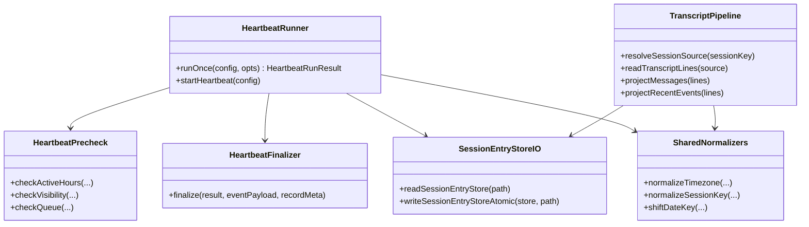
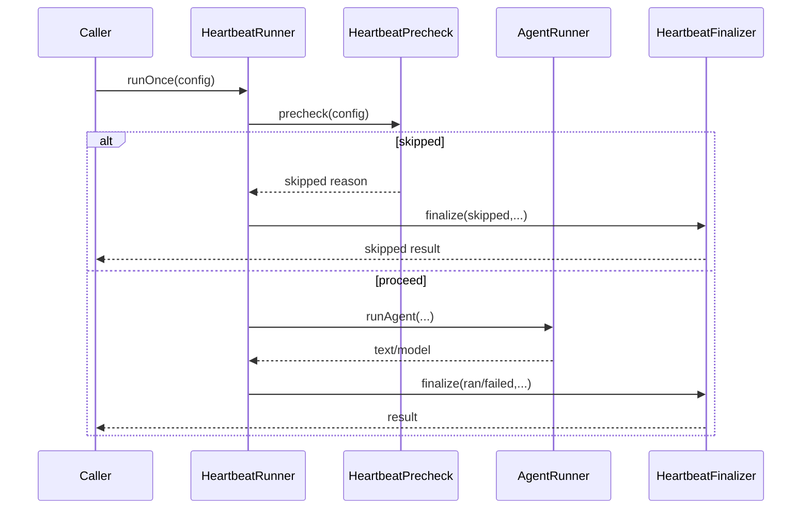

# Core Principles 準拠リファクタリング（Assistant 実行層 v2）

> 対象ガイド: `doc/AI_PLANNINGAI_GUIDE.md`  
> 対象領域: `src/assistant/heartbeat-runner.ts` / `src/assistant/transcript-reader.ts` / `src/assistant/session-entry-store.ts` / `src/assistant/event-reader.ts` / `src/assistant/memory-paths.ts` / `src/assistant/command-queue.ts`

---

## 1. 概要と目的 Overview and Purpose

- What  
  Assistant 実行層の重複ロジックと責務過多を整理し、Core Principles（Prototype First / SOLID / KISS / YAGNI / DRY）に沿って内部設計を再編する。
- Why  
  `runOnce` の終了処理重複、`transcript-reader` の読込重複、日付ユーティリティ重複が将来改修時の不整合リスクを上げているため。  
  小さい変更で保守性と変更安全性を上げる。
- How  
  公開APIは維持しつつ、内部ヘルパーを抽出して責務を分離する。  
  TDD（Red -> Green -> Refactor）で契約テストを先に固定し、段階的に置換する。

---

## 2. 仕様と受け入れ条件 Specification and Acceptance Criteria

### 2.1 スコープ Scope

- 今回やること
  - `runOnce` の「イベント送信 + 実行記録 + 戻り値」を共通化し重複を削減
  - `runOnce` の事前判定（quiet-hours / visibility / queue）を小関数へ分割
  - `transcript-reader` の共通読込パイプライン化（セッション解決、候補探索、JSONL走査）
  - 日付/設定の正規化ユーティリティを共有化（timezone/sessionKey/dateKey）
  - `session-entry-store` の原子的保存（tmp -> rename）へ変更
  - `command-queue` の後処理重複を `finally` で整理
- 成果物
  - `src/assistant/heartbeat-runner.ts`
  - `src/assistant/transcript-reader.ts`
  - `src/assistant/session-entry-store.ts`
  - `src/assistant/event-reader.ts`
  - `src/assistant/memory-paths.ts`
  - `src/assistant/command-queue.ts`
  - 必要に応じた共通ユーティリティファイル（例: `src/assistant/shared/*.ts`）
  - `tests/assistant/*.test.ts` の追加/更新
- 制約
  - `pnpm check` を通す
  - 新規ライブラリ導入なし
  - 公開API（`src/assistant/index.ts` の export）は原則変更しない

### 2.2 非スコープ Non Scope

- Slack ingest / CDP adapter の設計変更
- heartbeat 判定ルールそのものの仕様変更（文言ルール変更など）
- ストレージ種別の変更（JSON -> DB）
- UI/API（s03領域）の挙動変更

### 2.3 ユースケース Use Cases

- 正常系: `runOnce` が内部ヘルパー経由で `skipped/ran/failed` を返し、イベントと run record を一貫して記録する
- 正常系: `loadMessages` と `loadRecentSessionEvents` が共通パイプラインから期待結果を返す
- 異常系: `sessions.json` 保存中に中断しても既存ファイル破損を避ける
- 異常系: 破損 transcript 行は警告してスキップし処理継続する

### 2.4 受け入れ条件 Acceptance Criteria

- Given `runOnce` が `quiet-hours` で早期終了する When 実行する Then 既存と同じ `skipped` 結果を返し run record も1件記録される
- Given `runOnce` の終了分岐（ok/alert/failed）が発生する When 実行する Then 共通の finalize 経路を通ってイベントと記録が欠落しない
- Given `loadMessages` と `loadRecentSessionEvents` が同じ transcript を読む When 実行する Then 既存契約を維持しつつ重複実装がなくなる
- Given `writeSessionEntryStore` が呼ばれる When 保存が成功する Then ファイルは原子的に更新され、JSONの途中書き込み状態を残さない
- Given `pnpm check` を実行する When リファクタ後に検証する Then format/typecheck/test がすべて成功する

### 2.5 既知の制約 Known Limitations

- 単一 `sessions.json` のスループット制約は残る
- heartbeat 文言判定はルールベースのまま
- `@mariozechner/pi-coding-agent` 依存の内部仕様変化リスクは継続

---

## 3. 前提技術スタック Context and Tech Stack

- Language Framework  
  TypeScript 5.x / Node.js / ESM
- Libraries  
  `@mariozechner/pi-coding-agent` / Node標準 `fs` / `node:test`
- Style Guide  
  ESLint + Prettier（既存設定）
- Runtime Deployment  
  ローカル Node 実行（`tsx`）
- Testing  
  `node --test`（既存テストスイートを拡張）

---

## 4. インターフェース契約 Interface Contracts

### 4.1 公開APIまたは外部I O一覧

- 公開関数（維持対象）
  - `runOnce(config, opts?)`
  - `startHeartbeat(config)`
  - `loadMessages(opts)`
  - `loadRecentSessionEvents(opts)`
  - `readSessionEntryStore(customPath?)`
  - `writeSessionEntryStore(store, customPath?)`
- 永続化
  - `sessions.json`
  - `heartbeat-runs.jsonl`
  - transcript JSONL

### 4.2 データモデルとスキーマ

- `HeartbeatRunResult` 契約は維持（`status: skipped|ran|failed`）
- `SessionEntryStore` は `Record<string, SessionEntryRecord>` を維持
- transcript 読込結果
  - `loadMessages`: `unknown[]`
  - `loadRecentSessionEvents`: `SessionTranscriptEvent[]`
- バリデーション方針
  - 文字列は trim 正規化
  - malformed JSONL 行はスキップ
  - 破損セッションストアは退避して復旧

### 4.3 エラーと例外 Error Handling

- エラー分類
  - `timeout`
  - `session_corruption`
  - `io_error`
  - `malformed_line`
- リトライ方針
  - 既存ポリシーを維持（heartbeat 側は再試行ロジック変更なし）
- タイムアウト方針
  - `runOnce(timeoutMs)` を維持
- ログ方針と個人情報
  - 警告ログは継続、機密は出力しない

### 4.4 代表的な例 Examples

```ts
// 例1: runOnce の早期スキップ（quiet-hours）
const result = await runOnce({
  dataDir: "./data",
  activeHours: { start: "09:00", end: "18:00", timezone: "UTC" },
});
// => { status: "skipped", reason: "quiet-hours" }
```

```ts
// 例2: transcript 共通読込パイプライン経由
const messages = await loadMessages({ sessionKey: "main", limit: 50 });
const recent = await loadRecentSessionEvents({ sessionKey: "main", limit: 20 });
```

```ts
// 例3: セッションストア保存（内部で atomic write）
await writeSessionEntryStore({ main: { sessionId: "session-main-001" } }, "./sessions.json");
```

### 4.5 破壊的変更と最小移行方針

- 現時点の想定
  - 公開APIの破壊的変更はなし
  - 変更は内部関数構造・保存方式・テスト追加に限定
- 破壊が必要になった場合
  - plan に破壊点を追記
  - 互換ラッパを1リリース残す
  - 呼び出し側修正を3ステップで提示（型 -> 呼び出し -> テスト）

---

## 5. アーキテクチャと設計図 Architecture and Diagrams

### 5.1 図の選択方針

- 複数モジュールを跨ぐ責務分割のためクラス図を採用
- `runOnce` の非同期分岐と finalize 経路の可視化にシーケンス図を追加

### 5.2 クラス図 Class Diagram



### 5.3 その他の図 Optional



---

## 6. テスト戦略 Test Strategy

### 6.1 テストの種類

- Unit
  - `runOnce` の precheck 判定関数
  - finalize 共通関数の分岐（skipped/ran/failed）
  - date/session/timezone 正規化関数
  - `command-queue` の finally 後処理
- Integration
  - `writeSessionEntryStore` の atomic write 実ファイル検証
  - transcript 共通読込で `loadMessages` / `loadRecentSessionEvents` の両結果確認
- Contract
  - `runOnce` 返却契約維持
  - transcript reader 公開契約維持

### 6.2 カバレッジ対象

- 重要ロジック
  - heartbeat finalize 経路の一貫性
  - transcript 共通パイプライン
  - atomic write
- エラー分岐
  - malformed JSONL
  - sessions.json 破損復旧
  - timeout
- 境界条件
  - 空 sessionKey 正規化
  - `timeoutMs` 最小値
  - `limit` 0 / 非数

---

## 7. 実装タスクリスト Implementation Plan

### Phase 1 設計と準備

- [ ] 要件と受け入れ条件を固定し、既存契約との差分を明文化（Task P1-1, `doc/plan/260215-s05-*.md`）
- [ ] 内部インターフェース（precheck/finalize/transcript pipeline）を型定義（Task P1-2, `src/assistant/*`）
- [ ] Mermaid 図を確定（Task P1-3, `doc/plan/260215-s05-*.md`）
- [ ] 既存テストのベースライン実行（Task P1-4, `pnpm check`）
- [ ] 影響ファイルの責務マップを作成（Task P1-5, 計画書内メモ）

### Phase 2 HeartbeatRunner の重複削減

- [ ] Test finalize 共通化の失敗テストを追加（Red, Task P2-1, `tests/assistant/heartbeat-runner.test.ts`）
- [ ] Test precheck 分割後の契約維持テストを追加（Red, Task P2-2, `tests/assistant/heartbeat-runner.test.ts`）
- [ ] Impl `runOnce` の終了処理を `finalize` に統合（Green, Task P2-3, `src/assistant/heartbeat-runner.ts`）
- [ ] Refactor precheck / prompt build / postprocess を分離（Task P2-4, `src/assistant/heartbeat-runner.ts`）
- [ ] Integration `startHeartbeat` と短周期再試行の既存ケース再確認（Task P2-5, `tests/assistant/heartbeat-runner.test.ts`）
- [ ] Docs 必要時に契約と図を更新（Task P2-6, `doc/plan/260215-s05-*.md`）

### Phase 3 Shared Utilities / Transcript / Store の整理

- [ ] Test transcript 共通パイプラインの失敗テストを追加（Red, Task P3-1, `tests/assistant/transcript-reader.test.ts`）
- [ ] Test atomic write の失敗テストを追加（Red, Task P3-2, `tests/assistant/session-entry-store.test.ts`）
- [ ] Impl transcript 読込共通化（Green, Task P3-3, `src/assistant/transcript-reader.ts`）
- [ ] Impl date/timezone/sessionKey 正規化の共有化（Green, Task P3-4, `src/assistant/event-reader.ts`, `src/assistant/memory-paths.ts`, `src/assistant/*`）
- [ ] Impl `writeSessionEntryStore` を原子的保存へ変更（Green, Task P3-5, `src/assistant/session-entry-store.ts`）
- [ ] Refactor `command-queue` 後処理の重複削減（Task P3-6, `src/assistant/command-queue.ts`）
- [ ] Integration 関連テストの全再実行（Task P3-7, `pnpm test`）

### Phase 4 統合と検証

- [ ] `pnpm check` 実行で quality gate 通過を確認（Task P4-1）
- [ ] 主要エッジケース（timeout/malformed/limit）再確認（Task P4-2）
- [ ] ログと例外の挙動を確認（Task P4-3）
- [ ] 計画書の進捗チェック更新（Task P4-4, `doc/plan/260215-s05-*.md`）

---

## 8. 完了の定義 Definition of Done

### 8.1 機能DoD Functional DoD

- [ ] `runOnce` の分岐結果と副作用（イベント/記録）が既存契約どおりであること
- [ ] transcript reader の公開挙動が維持されること
- [ ] セッションストア保存が原子的更新であること

### 8.2 品質DoD Quality DoD

- [ ] 追加/既存テストがすべて成功すること
- [ ] Lint/Format/Typecheck エラーがないこと
- [ ] 重複ロジックが削減され、責務が明確になっていること
- [ ] 変更内容が計画書と整合していること

---

## 9. 懸念事項と未確定事項 Concerns and Questions

- `runOnce` の分割粒度を細かくしすぎると可読性が落ちる可能性
- atomic write で `rename` 挙動が環境依存になるリスク（同一ディレクトリ前提で対応）
- 共通ユーティリティ導入時に過度な抽象化へ寄るリスク（YAGNI違反）
- `getQueueSize("main")` の意味（全レーン監視へ変更するか）は設計判断が必要
- 既存 export surface を維持しつつ内部再編するため、命名の一貫性ルールを先に決める必要
