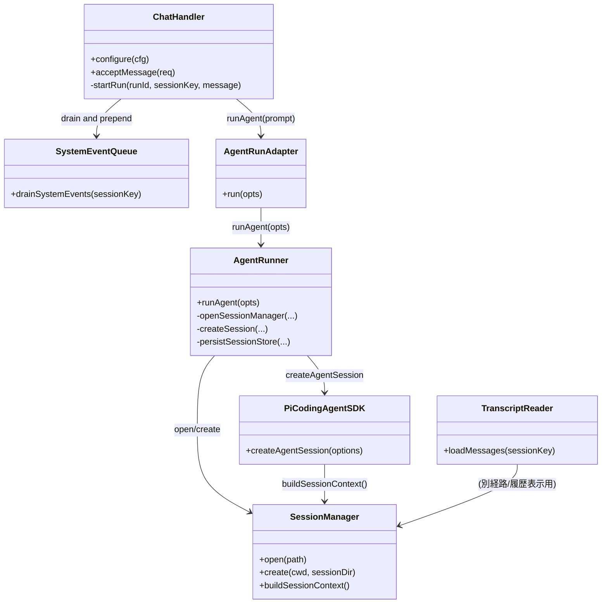
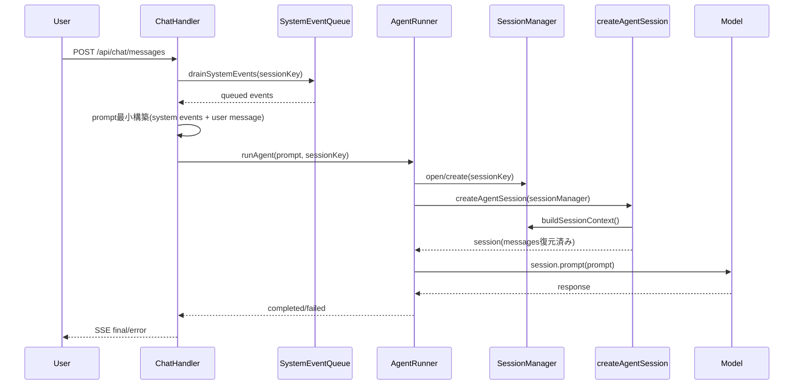

# 1. 概要と目的 Overview and Purpose

- What  
  adjutant の会話コンテキスト構築を `SessionManager.buildSessionContext()` ベースへ統一する。  
  具体的には、`ChatHandler` で行っている transcript 再注入と memory 再注入を廃止し、会話履歴の復元は `createAgentSession()` 内部の `SessionManager` 復元経路に一本化する。
- Why  
  現状は「SessionManager 復元」と「ChatHandler の再注入」が並走しており、文脈重複、compaction/branch 不整合、プロンプト肥大化のリスクがある。  
  OpenClaw 方針と同様に、保存は append-only、送信時の会話履歴は `buildSessionContext()` で解決する責務分離へ寄せる。  
  一方で system event は履歴とは別レイヤの一時入力として維持する。
- How  
  `ChatHandler` を「実行キュー制御 + system event の drain/注入 + user message 受け渡し」に限定する。  
  履歴復元は `SessionManager`/`createAgentSession` を唯一の会話履歴ソースとする。  
  `GET /api/chat/history` は OpenClaw 同様、表示用途として transcript 読み取り経路を維持する。

---

# 2. 仕様と受け入れ条件 Specification and Acceptance Criteria

## 2.1 スコープ Scope

- 今回やること
  - `src/assistant/chat-handler.ts` から transcript 再注入フローを削除する。
  - `src/assistant/chat-handler.ts` から memory 再注入フローを削除する。
  - `ChatHandler` の system event 注入フロー（`drainSystemEvents` + prompt 前置）は維持する。
  - `ChatHandlerConfig` から `transcriptLimit` を削除し、関連呼び出しとテストを更新する。
  - `src/assistant/main.ts` とテスト設定の `transcriptLimit` 指定を削除する。
  - prompt 文字列契約として `## User Message` マーカーを維持する。
  - `GET /api/chat/history` は transcript-reader ベースの表示用途として維持する。
- 成果物
  - `ChatHandler` の入力プロンプト構築ロジック修正。
  - 設定型/初期化コード修正。
  - テスト更新と追加（回帰防止）。
  - 設計意図を記した計画書と必要最小限のコードコメント。
- 制約
  - 既存 HTTP API 仕様 (`/api/chat/messages`, `/api/chat/history`) は破壊しない。
  - `SessionManager` の保存形式や transcript ファイル形式は変更しない。
  - system event キューの永続化方式（メモリキュー）は変更しない。
  - プロトタイプ優先だが、既存テスト・CI を通すこと。

## 2.2 非スコープ Non Scope

- `src/assistant/transcript-reader.ts` を `buildSessionContext()` ベースに全面置換する作業。
- `GET /api/chat/history` を `buildSessionContext()` 準拠に変更する作業。
- OpenClaw の sanitize/truncate/repair パイプラインを adjutant に移植する作業。
- モデルプロバイダ別の新しい最適化ロジック追加。

## 2.3 ユースケース Use Cases

- 正常系: 既存セッション継続
  - ユーザーが同一 `sessionKey` へ再投稿すると、モデルは `SessionManager` 復元済み履歴のみを会話文脈として利用する。
- 正常系: system event 付き投稿
  - system event が存在する場合、`ChatHandler` は system event と `## User Message` を含む最小プロンプトを渡す。
- 正常系: system event の消費
  - 同一 `sessionKey` で system event が注入されたターンの後、同じ event は次ターンに再注入されない（drain される）。
- 重要異常系: transcript が複雑な枝分かれ/compaction を含む
  - `ChatHandler` が生 transcript を再注入しないため、`buildSessionContext()` が解決した経路と不整合が起きにくい。
- 重要異常系: run 中断/失敗
  - 既存の abort/error 終端イベント配信契約は維持される。
- 正常系: UI 履歴表示
  - `GET /api/chat/history` は transcript 生読みの表示結果を返し、推論コンテキストと完全一致を要件化しない。

## 2.4 受け入れ条件 Acceptance Criteria

1. Given 既存 transcript を持つ `sessionKey`  
   When `/api/chat/messages` で新規メッセージを実行する  
   Then `ChatHandler` が `loadRecentSessionEvents` を使わずに `runAgent` を呼び出すこと。
2. Given memory ファイルが存在する  
   When `ChatHandler` がプロンプトを組み立てる  
   Then `ChatHandler` 側プロンプトに memory セクションが含まれないこと。
3. Given system event がキューに存在する  
   When `ChatHandler` が prompt を組み立てて `runAgent` を呼び出す  
   Then prompt 先頭に `## System Events` セクションが付与され、同一 event は次ターンで再注入されないこと。
4. Given `ChatHandler.configure` を呼び出すコード/テスト  
   When ビルドとテストを実行する  
   Then `transcriptLimit` なしで型エラーなく通過すること。
5. Given 既存の abort/error/final シーケンスを検証するテスト  
   When 修正後にテストを実行する  
   Then 終端イベント契約が従来どおり成立すること。
6. Given UI の履歴復元 (`/api/chat/history`)  
   When 履歴取得を実行する  
   Then transcript-reader ベースの既存レスポンス契約を破壊しないこと。

## 2.5 既知の制約 Known Limitations

- UI 向け履歴取得は引き続き transcript 生読みベースであり、モデル送信時の `buildSessionContext()` と完全一致しない場合がある。
- `buildSessionContext()` の仕様は依存ライブラリ `@mariozechner/pi-coding-agent` バージョンに依存する。
- system event は会話履歴とは別の一時入力として引き続き prompt に注入される。

---

# 3. 前提技術スタック Context and Tech Stack

- Language Framework  
  TypeScript 5.x / Node.js ESM
- Libraries  
  `@mariozechner/pi-coding-agent@^0.52.12`, `@mariozechner/pi-ai`, Node 標準 API
- Style Guide  
  既存 ESLint + Prettier 設定に準拠
- Runtime Deployment  
  ローカル Node 実行（API サーバ + Vite 開発サーバ）
- Testing  
  Node test runner (`node --import tsx --test`)、既存 `tests/assistant/*`

---

# 4. インターフェース契約 Interface Contracts

## 4.1 公開APIまたは外部I O一覧

- HTTP API
  - `POST /api/chat/messages`（変更なし）
  - `GET /api/chat/history`（変更なし）
  - `POST /api/chat/abort`（変更なし）
- CLI
  - `pnpm assistant`, `pnpm test`, `pnpm check`
- 設定ファイル
  - `src/assistant/chat-handler.ts` の `ChatHandlerConfig`（`transcriptLimit` 削除、system event 注入は維持）
- 永続化ストレージ
  - `data/_assistant/sessions.json`（メタ情報）
  - `data/_assistant/sessions/*.jsonl`（SessionManager transcript）
- 外部サービス連携
  - LLM 呼び出しは `createAgentSession` 経由（変更なし）

## 4.2 データモデルとスキーマ

- 変更対象型
  - `ChatHandlerConfig` から `transcriptLimit: number` を削除。
- prompt 契約
  - `ChatHandler -> runAgent` に渡す prompt は最小構成にする。
  - `## System Events` は event がある場合のみ前置する。
  - `## User Message` マーカーは維持し、UI 側の抽出ロジック互換性を保つ。
  - transcript/memory の再注入セクションは含めない。
- 永続化スキーマ
  - `sessions.json` は `sessionId`, `sessionFile`, `updatedAt` のメタ管理を維持。
  - transcript JSONL スキーマは変更しない。
- バリデーション方針
  - 既存入力検証（`sessionKey`, `idempotencyKey`, `message` 必須）を維持。

## 4.3 エラーと例外 Error Handling

- エラー分類
  - 既存の run 失敗時 `error` 終端配信を維持。
- リトライ方針
  - `AgentRunner` 既存方針（transient/context overflow 1回リトライ）を維持。
- タイムアウト方針
  - 既存実装を変更しない。
- ログ方針と個人情報の扱い
  - 既存ログ出力レベルを維持し、追加ログは最小限。

## 4.4 代表的な例 Examples

- 例1: `ChatHandler` から `runAgent` へ渡す prompt（修正後）
  - system event あり:  
    `## System Events ...` + `## User Message\n<user text>`
  - system event なし:  
    `## User Message\n<user text>`
- 例2: 会話継続時の履歴ソース
  - `SessionManager.open(...)` -> `createAgentSession(...)` -> `buildSessionContext()` で復元された `messages` が会話履歴として使用される。
- 例3: UI 履歴取得
  - `GET /api/chat/history` は従来どおり transcript 読み取り結果を返す（推論コンテキスト構築とは分離）。
- 例4: system event の消費
  - `drainSystemEvents(sessionKey)` で取り出した event はそのターンでのみ注入され、次ターンには残らない。

---

# 5. アーキテクチャと設計図 Architecture and Diagrams

## 5.1 図の選択方針

- モジュール跨ぎ（ChatHandler, AgentRunner, SessionManager, API）があるためクラス図を作成する。
- 非同期処理の責務分離を明確にするためシーケンス図を追加する。

## 5.2 クラス図 Class Diagram

## 5.3 その他の図 Optional

---

# 6. テスト戦略 Test Strategy

## 6.1 テストの種類

- Unit
  - `ChatHandler` の prompt 構築が transcript/memory 非依存であることを検証。
  - `ChatHandler` の system event 注入と drain（一度だけ注入）を検証。
  - `ChatHandlerConfig` 変更に伴う型/初期化経路検証。
- Integration
  - `runAgent` 実行時にセッション継続とイベント終端契約が壊れないことを既存テストで確認。
- Contract
  - `POST /api/chat/messages` と `GET /api/chat/history` の外部契約が変わらないことを API テストで担保。

## 6.2 カバレッジ対象

- 重要ロジック
  - `ChatHandler.startRun()` の prompt 作成（system event 前置含む）と `runAgent` 呼び出し。
- エラー分岐
  - run 失敗/abort 時の終端イベント配信。
- 境界条件
  - system event なし/あり、drain 後再実行、空文字の扱い、既存 session あり/なし。

---

# 7. 実装タスクリスト Implementation Plan

### Phase 1 設計と準備

- [x] 要件と仕様の確定 受け入れ条件の確定（本計画）
- [x] インターフェース契約の確定 スキーマと例の追加（`ChatHandlerConfig` 変更）
- [x] Mermaid図の作成 更新（本計画）
- [x] インターフェース 型定義の作成（`transcriptLimit` 削除）
- [x] テスト基盤の確認（`tests/assistant/*` 影響把握）

### Phase 2 Prompt Source 統一（ChatHandler）

- [x] Test `chat-handler` に transcript/memory 再注入が無いことを検証する失敗テストを追加 Red
- [x] Test system event がある場合のみ `## System Events` が付与され、実行後に drain されることを検証する失敗テストを追加 Red
- [x] Impl `src/assistant/chat-handler.ts` から `loadRecentSessionEvents` と `readMemoryFiles` 依存を削除 Green
- [x] Refactor prompt 組み立てを最小関数へ整理し可読性を向上（system event 経路は維持）
- [x] Integration 既存 `chat-handler`/`api-server` テスト通過確認
- [x] Docs 必要なら `doc/` 配下に責務分離メモを追記

### Phase 3 設定契約の整理

- [x] Test `transcriptLimit` を要求しない設定で `configure` 可能なテストへ更新 Red
- [x] Impl `ChatHandlerConfig` と `src/assistant/main.ts` から `transcriptLimit` を削除 Green
- [x] Refactor `tests/assistant/chat-handler.test.ts` / `tests/assistant/api-server.test.ts` の重複設定を整理
- [x] Integration `pnpm test` で assistant 系回帰確認
- [x] Docs 設定項目ドキュメントがあれば更新

### Phase 4 統合と検証

- [x] 全体テスト実行（`pnpm test`, 必要に応じ `pnpm check`）
- [x] エッジケース確認（branch/compaction セッション継続の手動確認）
- [x] エッジケース確認（system event 注入の1ターン消費）
- [x] ログと例外確認（abort/error 終端、context overflow リトライ）
- [x] ドキュメント更新（仕様・契約・図、履歴APIは表示用途で維持）

---

# 8. 完了の定義 Definition of Done

## 8.1 機能DoD Functional DoD

- [x] 受け入れ条件がすべて満たされていること
- [x] 既知の制約が明文化され、想定通りであること
- [x] 契約の例に対して期待通りの結果が得られること

## 8.2 品質DoD Quality DoD

- [x] 全てのテストがパスしていること
- [x] Linter Formatterのエラーがないこと
- [x] 不要なデバッグコードが削除されていること
- [x] 主要な変更点がドキュメントに反映されていること

---

# 9. 懸念事項と未確定事項 Concerns and Questions

- 技術的な懸念点
  - UI 履歴表示は transcript 生読みで、モデル送信コンテキストと乖離する可能性が残る。
- 仕様の決定事項（OpenClaw 準拠）
  - `ChatHandler` の system event 注入は継続する（履歴復元とは別責務）。
  - `/api/chat/history` は transcript-reader ベースを維持し、`buildSessionContext()` 準拠へは寄せない。
- プロトタイプとして許容するリスク
  - `@mariozechner/pi-coding-agent` のマイナーバージョン差異により、OpenClaw と厳密同一挙動でない可能性。
- 将来的な拡張に伴うリスク
  - transcript-reader を表示用途で維持する限り、枝分かれ/compaction セッションで UX と実際推論履歴の差が顕在化する可能性。
