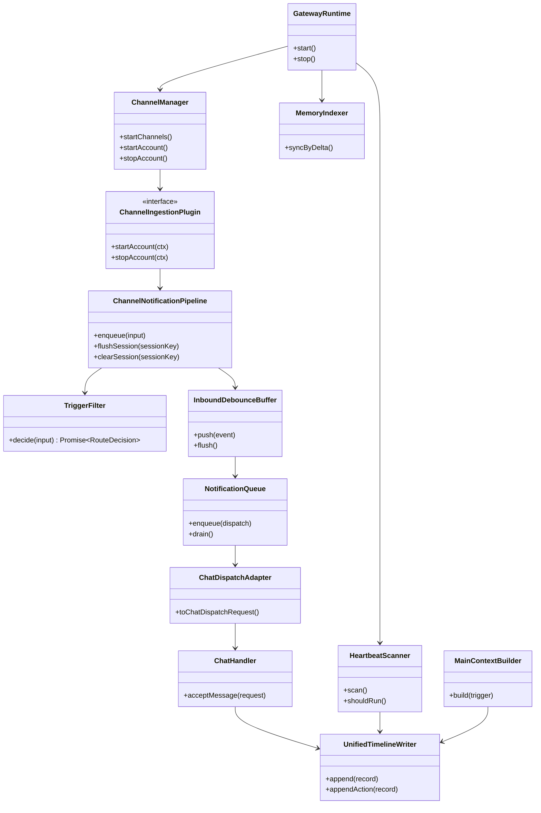
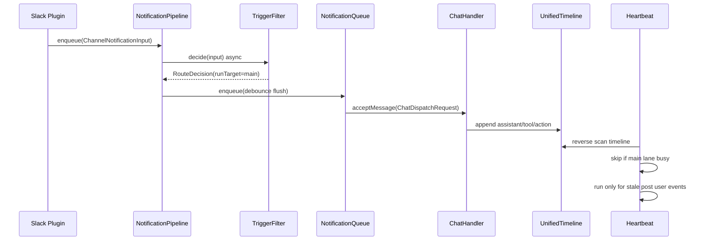

# OpenClaw Proactive Gateway Integration Plan

この計画書の正本は `doc/plan/260217-s01-openclaw-proactive-gateway-integration.md` とする。
`doc/openclaw/ext-plan.md` は同内容の作業コピーとして同期する。

## 1. 概要と目的 Overview and Purpose

- What: Slack 受信イベント処理を OpenClaw 準拠の `GatewayRuntime + ChannelManager + plugin.startAccount` 方式へ統合し、Fast Path と Slow Path と Background Path を一体で実装する。
- Why: 未対応メッセージ取りこぼしの防止、チャネル追加時の拡張容易性、運用時の監査可能性を確保する。
- How: `RouteDecision(runTarget)` を中心に、`main` 司令塔セッションと spoke セッションを分離し、統合タイムライン JSONL を唯一の巡回判定ソースとして扱う。

## 2. 仕様と受け入れ条件 Specification and Acceptance Criteria

### 2.1 スコープ Scope

- `assistant` 起動時に plugin registry と ChannelManager と API/UI を単一プロセスで起動する。
- `ChannelNotificationPipeline` を導入し、`trigger-filter` と `inbound-debounce-buffer` と `notification-queue` を責務分離する。
- `RouteDecision` に `runTarget: "main" | "session"` を持たせ、既定を `main` にする。
- `NormalizedEvent -> ChatDispatchRequest -> ChatHandler.acceptMessage` の変換契約を固定する。
- 統合タイムライン `memory/timeline-YYYY-MM-DD.jsonl` を append-only で運用する。
- heartbeat 判定を統合タイムライン逆走査へ一本化し、`main` lane busy 時の skip を導入する。
- stale 判定を `recordType="event" && role=user && kind="post"` のみに限定し、`reaction/notification` だけでは起動しない。
- Phase 1 のクロスセッション介入は `sessions_send` のみを対象にする。

### 2.2 非スコープ Non Scope

- Slack 直接投稿 `message` ツールの導入と `sessions_send` との最終使い分け確定。
- outbound delivery queue の新規拡張や配送 WAL の仕様変更。
- 既存 UI 履歴 API の prompt 完全再現。
- 後方互換移行ロジックの追加。
- 2nd チャネル本実装の完成。

### 2.3 ユースケース Use Cases

- UC-1 正常系: channel/thread に `post` が来る。デバウンス後に 1 dispatch へ束ねて `runTarget=main` で司令塔が応答し、必要なら `sessions_send` で spoke に介入する。
- UC-2 正常系: `reaction` のみ連続到着。run は軽量トリガー文、詳細は system event に保持される。
- UC-3 異常系: self 判定 ID が未解決。`post` は fail-safe drop、`reaction/notification` は system-only とする。
- UC-4 正常系: heartbeat が日跨ぎで発火。`timeline-当日` から `timeline-前日` へフォールバック逆走査し、未対応 post のみ判定する。
- UC-5 競合系: `main` lane が busy 中に heartbeat 発火。heartbeat は skip し duplicate run を積まない。

### 2.4 受け入れ条件 Acceptance Criteria

1. Given `assistant` を起動したとき、When Slack plugin が有効で CDP 接続可能、Then `startAccount(ctx)` が開始され API/UI と同時稼働する。
2. Given 同一スレッドで短時間に複数 `post` が到着したとき、When デバウンス窓内で flush される、Then `acceptMessage` は 1 回だけ呼ばれ `eventUids` が集約される。
3. Given `RouteDecision.run=true` かつ `runTarget=main` のとき、When dispatch を生成する、Then `sessionKey=agent:{agentId}:main` かつ `originSessionKey` が保持される。
4. Given heartbeat が発火したとき、When `main` lane が busy、Then heartbeat は skip され `main` の duplicate run は enqueue されない。
5. Given heartbeat が発火したとき、When 対応境界より新しい行が `reaction/notification` のみ、Then 未対応判定せず静音終了する。
6. Given `sessions_send` を実行したとき、When 統合タイムラインへ追記する、Then `recordType="action"` と `action.action="sessions_send"` と `targetSessionKey` が必ず保存される。
7. Given spoke セッションで run 実行時、When メモリ解決を行う、Then `MEMORY.md` と `memory/*.md` はロードされない。

### 2.5 既知の制約 Known Limitations

- notification queue は現時点でインメモリ運用で永続化しない。
- heartbeat 逆走査の既定値は未確定であり、`maxHeartbeatScanLines` と `maxHeartbeatScanDays` は暫定運用値で開始する。
- `runTarget=session` は互換用途で残すが、初期運用は `runTarget=main` 優先とする。
- Fast Path の対象は初期版で `post|reaction|notification` 全件であり、精緻な抑制は後続調整とする。

## 3. 前提技術スタック Context and Tech Stack

- Language Framework: TypeScript ESM, Node.js runtime, 既存 `src/index.ts` と `src/assistant/*`。
- Libraries: `chrome-remote-interface`, 既存 queue 実装、OpenClaw vendor 参照実装。
- Style Guide: リポジトリの ESLint と Prettier と `pnpm check` を準拠基準にする。
- Runtime Deployment: 単一プロセス実行、Slack CDP 接続を前提。
- Testing: unit は Vitest/Jest 想定、統合は `pnpm check` と E2E 観点で検証。

## 4. インターフェース契約 Interface Contracts

### 4.1 公開APIまたは外部I O一覧

- Channel plugin 入力: `ChannelGatewayContext.emit(input)`。
- Fast Path 入力: `ChannelNotificationPipeline.enqueue(input)`。
- Agent 実行入力: `ChatHandler.acceptMessage(ChatDispatchRequest)`。
- 永続化: session JSONL と unified timeline JSONL への append-only 二重追記。
- 外部連携: Slack CDP、将来チャネル plugin、`sessions_send` ツール。

### 4.2 データモデルとスキーマ

```ts
type ChannelNotificationInput = {
  event: NormalizedEvent;
  accountId: string;
  channelId: string;
};

type RouteDecision = {
  run: boolean;
  pending: boolean;
  system: boolean;
  drop: boolean;
  runTarget: "main" | "session";
  reason?: string;
};

type ChatDispatchRequest = {
  message: string;
  sessionKey: string;
  originSessionKey: string;
  runTarget: "main" | "session";
  accountId: string;
  idempotencyKey: string;
  eventUids: string[];
  uidOverflowCount?: number;
  messageTruncated?: boolean;
  originalCharCount?: number;
  dispatchedCharCount?: number;
  messageIds?: string[];
};

type UnifiedTimelineRecord = {
  uid: string;
  ts: string;
  accountId: string;
  channelId: string;
  sessionKey: string;
  originSessionKey: string;
  recordType: "event" | "assistant" | "tool" | "action";
  role: "user" | "assistant" | "tool";
  kind?: "post" | "reaction" | "notification";
  toolName?: string;
  routeDecision?: RouteDecision;
  action?: {
    kind: "action";
    action: "sessions_send";
    sourceSessionKey: string;
    targetSessionKey: string;
    target: string;
    status?: "accepted" | "ok" | "timeout" | "error";
  };
};
```

- `idempotencyKey` は `sha256(sessionKey + "\n" + sorted(eventUids).join("\n"))` で決定的に生成する。
- `runTarget=main` は `sessionKey=mainSessionKey` とし、`originSessionKey` で起点を保持する。
- 統合タイムラインの物理フォーマットは `memory/timeline-YYYY-MM-DD.jsonl` に固定する。

### 4.3 エラーと例外 Error Handling

- self 判定不可時の fail-safe。
- `post`: run/system ともに drop。
- `reaction/notification`: run 禁止、system-only。
- queue overflow は `dropPolicy=summarize` を既定とし、summary system event へ変換する。
- heartbeat 逆走査が `maxHeartbeatScanLines` または `maxHeartbeatScanDays` を超過した場合は warn を出し fail-open で `main` 起動する。
- 軽量 LLM 二次判定が timeout または失敗した場合、一次判定へフォールバックする。
- ログは `accountId/sessionKey/eventUid/runTarget` を含め、本文は `textPreview` までに制限する。

### 4.4 代表的な例 Examples

例1: `post` の dispatch 生成

```json
{
  "message": "<debounced text>",
  "sessionKey": "agent:assistant:main",
  "originSessionKey": "agent:assistant:slack:C123:thread:1730000000.000100",
  "runTarget": "main",
  "accountId": "default",
  "idempotencyKey": "sha256:8b3...",
  "eventUids": ["slack:msg:1", "slack:msg:2"]
}
```

例2: `sessions_send` action の統合タイムライン

```json
{
  "uid": "run:2026-02-17T10:20:00Z:action:1",
  "recordType": "action",
  "role": "tool",
  "sessionKey": "agent:assistant:main",
  "originSessionKey": "agent:assistant:slack:C123",
  "action": {
    "kind": "action",
    "action": "sessions_send",
    "sourceSessionKey": "agent:assistant:main",
    "targetSessionKey": "agent:assistant:slack:C123",
    "target": "#project-a",
    "status": "ok"
  }
}
```

例3: heartbeat 判定条件

- 対応境界より新しい行に `recordType="event" && role=user && kind="post" && stale>=heartbeatStaleMs` が 1 件以上あるときのみ起動する。
- `main` lane busy または `reaction/notification` のみの場合は skip する。

## 5. アーキテクチャと設計図 Architecture and Diagrams

### 5.1 図の選択方針

- 本計画は複数モジュールと外部 I/O を跨ぐためクラス図を必須とする。
- 非同期処理と lane 競合が重要なためシーケンス図を追加する。

### 5.2 クラス図 Class Diagram



### 5.3 その他の図 Optional



## 6. テスト戦略 Test Strategy

### 6.1 テストの種類

- Unit: `trigger-filter`, `inbound-debounce-buffer`, `notification-queue`, `heartbeat-scanner`, `main-context-builder`。
- Integration: Slack plugin から `acceptMessage` までの経路、session JSONL と unified timeline の二重追記。
- Contract: `ChatDispatchRequest` 必須項目、`UnifiedTimelineRecord` スキーマ、`runTarget/main-origin` 関係、fail-safe 動作。

### 6.2 カバレッジ対象

- 重要ロジック: idempotency key 生成、sessionKey 解決、runTarget 振り分け、busy skip。
- エラー分岐: self 判定不可、LLM timeout、queue overflow、timeline scan 超過。
- 境界条件: 日跨ぎ逆走査、`maxDispatchChars` 超過、`maxEventUidsPerDispatch` 超過、pending 回収。

## 7. 実装タスクリスト Implementation Plan

### Phase 1 設計と準備

- [x] P1-01 要件と仕様の確定、`runTarget` と司令塔モデルの確定。
- [x] P1-02 `ChannelNotificationInput` と `ChatDispatchRequest` 契約確定。
- [x] P1-03 `sessionKey` 解決規約（`resolveAgentRoute + resolveThreadSessionKeys`）確定。
- [x] P1-04 heartbeat しおり判定契約（統合タイムライン逆走査、busy skip、post限定）確定。
- [x] P1-05 統合タイムライン JSONL 固定と action 記録規約確定。
- [ ] P1-06 TODO `sessions_send` と `message` の使い分け最終方針を確定。

### Phase 2 機能A Fast Path と main routing の実装

- [ ] P2-A-RED `trigger-filter` 非同期判定と timeout fallback の失敗テストを追加する。
- [ ] P2-A-GREEN `TriggerFilter.decide(): Promise<RouteDecision>` を実装しテストを通す。
- [ ] P2-A-REFACTOR run/pending/system/drop 判定ロジックを整理し重複を除去する。
- [ ] P2-A-INTEGRATION plugin 受信から `acceptMessage` までの経路を統合テストで確認する。
- [ ] P2-A-DOC 契約例と図を実装に合わせて更新する。
- [ ] P2-B-RED `NormalizedEvent -> ChatDispatchRequest` 変換失敗ケースのテストを追加する。
- [ ] P2-B-GREEN idempotency key 生成、truncation、UID overflow を実装する。
- [ ] P2-B-REFACTOR adapter を純粋関数化し依存を分離する。

### Phase 3 機能B Slow Path と timeline/context の実装

- [ ] P3-B-RED heartbeat 逆走査の境界テスト（assistant/tool/action 境界、busy skip、reaction除外）を追加する。
- [ ] P3-B-GREEN `HeartbeatScanner` と日跨ぎフォールバック実装を追加する。
- [ ] P3-B-REFACTOR scan 処理を I/O 層と判定層に分離する。
- [ ] P3-B-INTEGRATION timeline 二重追記と `sessions_send` action 記録を統合テストで確認する。
- [ ] P3-C-RED `MainContextBuilder` の token guard と pending 注入テストを追加する。
- [ ] P3-C-GREEN 差分抽出とアンカー保持切り詰めを実装する。
- [ ] P3-C-REFACTOR context 構築メトリクスを `MainContextWindowMeta` へ集約する。

### Phase 4 統合と検証

- [ ] P4-01 `pnpm check` を実行し失敗を解消する。
- [ ] P4-02 E2E 観点で heartbeat 自律起動と skip 条件を検証する。
- [ ] P4-03 ログと例外を確認し、想定外入力と timeout 時の fail-open を確認する。
- [ ] P4-04 ドキュメント更新（仕様 契約 図）を最終反映する。

## 8. 完了の定義 Definition of Done

### 8.1 機能DoD Functional DoD

- [ ] 受け入れ条件 7 件をすべて満たす。
- [ ] Unified Timeline の action 記録から介入先追跡が可能である。
- [ ] heartbeat が stale post のみで起動し、busy 時は skip する。
- [ ] spoke セッションで MEMORY ロード禁止が守られている。

### 8.2 品質DoD Quality DoD

- [ ] Unit Integration Contract テストがすべてパスする。
- [ ] `pnpm check` が成功する。
- [ ] queue overflow timeout self判定不可のログが期待通り出力される。
- [ ] 主要変更が `doc/plan` と `doc/openclaw/ext-plan.md` に反映されている。

## 9. 懸念事項と未確定事項 Concerns and Questions

- heartbeat 閾値 `heartbeatStaleMs` と `maxHeartbeatScanLines` と `maxHeartbeatScanDays` の既定値。
- route 二次判定の運用値 `maxConcurrentRouteLlm` と `routeLlmTimeoutMs`。
- notification queue 永続化の要否。
- `sessions_send` と `message` の将来使い分けポリシー。
- plugin 起動失敗時の既定動作（単一チャネル fail-open/fail-stop）。
- session memory の retention と再構築ポリシー。

