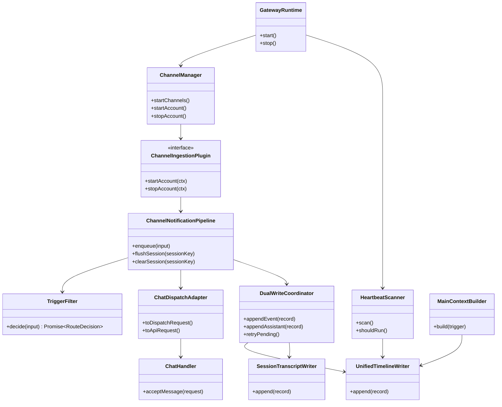
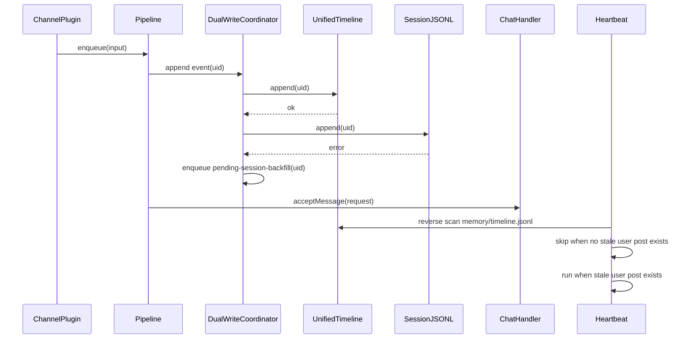

# OpenClaw Proactive Gateway Integration Plan

この計画書の正本は `doc/plan/260217-s01-openclaw-proactive-gateway-integration.md` とする。
詳細仕様の正本は `doc/openclaw/ext-plan.md` とし、実装の微細規約は同ファイルを参照する。

## 1. 概要と目的 Overview and Purpose

- What: Slack 受信イベント処理を OpenClaw 準拠の `GatewayRuntime + ChannelManager + startAccount` 構成へ統合し、Fast Path と Slow Path と Background Path を一体化する。
- Why: 未対応メッセージの取りこぼし防止、ルーティングの一貫性、運用監査性、将来チャネル拡張性を確保する。
- How: OpenClaw 準拠の `run/pending/drop + system` ルーティングを採用し、heartbeat は統合タイムライン（1ファイル）を後ろから逆走査して起動可否を決め、二重追記失敗時の回復契約を明文化する。

## 2. 仕様と受け入れ条件 Specification and Acceptance Criteria

### 2.1 スコープ Scope

- `assistant` 起動で plugin registry と ChannelManager と API/UI を単一プロセス起動する。
- `ChannelNotificationPipeline` を導入し、`trigger-filter` と `inbound-debounce-buffer` と `notification-queue` を責務分離する。
- `RouteDecision` は `run/pending/drop` と独立 `system` フラグで定義し、制約（`drop` 排他、`run/pending` 排他）を validator とテストで担保する。
- `NormalizedEvent -> ChatDispatchRequest -> ChatHandler.acceptMessage` 変換契約を固定する。
- `memory/timeline.jsonl` を統合タイムライン形式として固定する。
- heartbeat 判定は全セッションのイベントを集約した `memory/timeline.jsonl` の逆走査のみに一本化する。
- spoke セッションでの `MEMORY.md` / `memory/*.md` ロードを禁止し、main セッションのみ許可する。
- 既存 API 契約（`message/sessionKey/idempotencyKey`）を壊さない段階移行を定義する。
- CDP 接続障害を API/UI へ伝播させず、`CDP停止 -> 通知キューflush -> API停止` の shutdown 順序を固定する。

### 2.2 非スコープ Non Scope

- Slack 直接投稿 `message` ツールの本実装と `sessions_send` との最終ポリシー確定。
- outbound 配送 WAL の機能拡張。
- UI 履歴 API の prompt 完全一致表示。
- 一括破壊的リリースによる API 契約変更。
- 2nd チャネル本番運用の完了。

### 2.3 ユースケース Use Cases

- UC-1 正常系: `post` 到着後、デバウンス flush 単位で 1 dispatch へ集約し `run` 判定で処理する。
- UC-2 正常系: `reaction/notification` は run 側を軽量トリガー文に留め、詳細は system event へ保持する。
- UC-3 異常系: self 判定不可時、`post` は drop、`reaction/notification` は system-only で fail-safe 継続する。
- UC-4 正常系: heartbeat 発火時、`memory/timeline.jsonl` を逆走査して最新の対応境界までの区間に stale な user post が無い場合は静音 skip する。
- UC-5 回復系: 二重追記の片側失敗時に retry/backfill キューで整合回復する。
- UC-6 境界系: heartbeat 発火時、`memory/timeline.jsonl` を逆走査して最新の対応境界までの区間に stale な user post があり、かつ `pending-session-backfill` 未滞留の場合はメインエージェントを起動する。

### 2.4 受け入れ条件 Acceptance Criteria

1. Given `assistant` 起動時、When Slack plugin と CDP が利用可能、Then `startAccount(ctx)` が開始され API/UI と同時稼働する。
2. Given 同一スレッドで複数 `post` が短時間到着、When デバウンス flush される、Then 1 回の `acceptMessage` 呼び出しに集約される。
3. Given `reaction` が同一 `contextKey` で連続到着、When dedupe が適用される、Then 重複 system event は注入されない。
4. Given queue cap 超過、When `dropPolicy=summarize`、Then LLM 非使用の summary system event が 1 件注入される。
5. Given dispatch 本文が `maxDispatchChars` 超過、When adapter が生成する、Then切り詰めと `messageTruncated/originalCharCount/dispatchedCharCount` が付与される。
6. Given heartbeat 発火、When `memory/timeline.jsonl` を後ろから逆走査して最新の対応境界（`role=assistant | role=tool | recordType=action`）を見つけ、末尾からその境界までの区間に stale な `recordType=event && role=user && kind=post` が存在しない、Then heartbeat は起動せず静音終了する。
7. Given heartbeat 発火、When `memory/timeline.jsonl` を後ろから逆走査して最新の対応境界（`role=assistant | role=tool | recordType=action`）を見つけ、末尾からその境界までの区間に stale な `recordType=event && role=user && kind=post` が存在し、かつ該当 `uid` が `pending-session-backfill` に存在しない、Then メインエージェントが起動し未対応メッセージ群を再評価して必要時は遅延対応する。
8. Given 二重追記の片側失敗、When retry/backfill が実行される、Then `uid` idempotent で最終的に session JSONL と統合タイムラインの整合が回復する。
9. Given spoke セッション run、When runAgent がコンテキスト構築する、Then `MEMORY.md` / `memory/*.md` はロードされない。
10. Given 既存 API クライアント、When `POST /api/chat/messages` を呼ぶ、Then `message/sessionKey/idempotencyKey` の最小契約で継続動作する。
11. Given CDP が切断したとき、When 再接続待機中または停止処理を実行する、Then API/UI は継続稼働し、shutdown は `CDP停止 -> 通知キューflush -> API停止` 順で実行される。

### 2.5 既知の制約 Known Limitations

- notification queue は現時点でインメモリ運用で永続化しない。
- heartbeat の放置判定閾値の既定値は未確定で、初期は運用値で開始する。
- Fast Path の対象は初期版で `post|reaction|notification` 全件。
- 統合タイムラインは単一ファイル運用のため、逆走査上限（行数/時間窓）の調整は運用で継続する。
- `reaction/notification` pending は単独 heartbeat では起動せず、次回 `post` 起点の run で補助コンテキストとして回収する。

### 2.6 詳細仕様参照マップ Detailed Rule Map

実装時は以下をこの計画書の補助契約として必ず参照する。

| 項目                              | 参照先                                 |
| --------------------------------- | -------------------------------------- |
| 処理順序 9 ステップ               | `doc/openclaw/ext-plan.md` の `3.2.1`  |
| デバウンス後 cap 判定             | `doc/openclaw/ext-plan.md` の `3.2.2`  |
| `kind=post` inbound/outbound 識別 | `doc/openclaw/ext-plan.md` の `3.2.4`  |
| summarize drop policy 詳細        | `doc/openclaw/ext-plan.md` の `3.2.5`  |
| queue key フォールバック          | `doc/openclaw/ext-plan.md` の `3.2.6`  |
| イベント種別ルーティング表        | `doc/openclaw/ext-plan.md` の `3.2.7`  |
| run message 生成規則              | `doc/openclaw/ext-plan.md` の `3.2.8`  |
| run + system 重複規約             | `doc/openclaw/ext-plan.md` の `3.2.9`  |
| contextKey 生成規則               | `doc/openclaw/ext-plan.md` の `3.2.10` |
| dispatch サイズ上限               | `doc/openclaw/ext-plan.md` の `3.2.11` |
| pending 一括回収                  | `doc/openclaw/ext-plan.md` の `3.2.12` |
| accountId/sessionKey 契約         | `doc/openclaw/ext-plan.md` の `4.2`    |

実装同期先（Phase 2 現時点）:

- ルーティング state machine / validator: `src/openclaw/route-decision.ts`
- 非同期 trigger-filter: `src/openclaw/trigger-filter.ts`
- `resolveAgentRoute + resolveThreadSessionKeys + queue key` フォールバック: `src/openclaw/session-route-resolver.ts`
- `NormalizedEvent -> ChatDispatchRequest -> API request` 変換: `src/openclaw/dispatch-adapter.ts`
- plugin registry / ChannelManager / `startAccount` 統合経路: `src/openclaw/plugin-registry.ts`, `src/openclaw/channel-manager.ts`
- system event enqueue 接続を含む通知パイプライン: `src/openclaw/channel-notification-pipeline.ts`

## 3. 前提技術スタック Context and Tech Stack

- Language Framework: TypeScript ESM, Node.js runtime, 既存 `src/index.ts` と `src/assistant/*`。
- Libraries: `chrome-remote-interface`、既存 queue 実装、OpenClaw vendor 参照実装。
- Style Guide: 既存 ESLint/Prettier/`pnpm check` に準拠する。
- Runtime Deployment: 単一プロセス、Slack CDP 接続前提。
- Testing: 既存方針に合わせ `node:test` を使用する。新規に Vitest/Jest は導入しない。

## 4. インターフェース契約 Interface Contracts

### 4.1 公開APIまたは外部I O一覧

- Channel plugin I/O: `startAccount(ctx)` が `emit(ChannelNotificationInput)` を呼ぶ。
- Fast Path I/O: `enqueue -> decide -> debounce -> queue -> acceptMessage`。
- Agent 実行 I/O: `ChatHandler.acceptMessage(PostChatMessageRequest)`。
- 永続化 I/O: session JSONL と unified timeline JSONL（`memory/timeline.jsonl`）への append-only 二重追記。
- API I/O: `POST /api/chat/messages` は既存最小契約を維持し、内部 adapter で拡張契約へ変換する。

### 4.2 データモデルとスキーマ

```ts
type ChannelNotificationInput = {
  event: NormalizedEvent;
  accountId: string;
  channelId: string;
};

type ChannelGatewayContext = {
  accountId: string;
  runtime: RuntimeEnv;
  abortSignal: AbortSignal;
  emit: (input: ChannelNotificationInput) => Promise<void>;
  getStatus: () => ChannelAccountSnapshot;
  setStatus: (next: ChannelAccountSnapshot) => void;
};

type ChannelIngestionPlugin = {
  id: string;
  startAccount: (ctx: ChannelGatewayContext) => Promise<unknown>;
  stopAccount?: (ctx: ChannelGatewayContext) => Promise<void>;
};

type NotificationQueueConfig = {
  cap: number;
  debounceMs: number;
  dropPolicy: "summarize" | "old" | "new";
  maxDispatchChars: number;
  maxEventUidsPerDispatch: number;
};

type ResolveAccountIdInput = {
  event: NormalizedEvent;
  configuredDefaultAccountId?: string;
};

type ResolveSessionKeyInput = {
  accountId: string;
  channelId?: string;
  channelType?: "im" | "mpim" | "channel" | "group";
  threadTs?: string;
  senderId?: string;
};

type ResolveSessionKeyResult = {
  baseSessionKey: string;
  sessionKey: string;
  parentSessionKey?: string;
  chatType: "direct" | "group" | "channel";
};

type RouteDecision = {
  run: boolean;
  pending: boolean;
  system: boolean;
  drop: boolean;
  reason?: string;
};

type ChatDispatchRequest = {
  message: string;
  sessionKey: string;
  accountId: string;
  idempotencyKey: string;
  eventUids: string[];
  uidOverflowCount?: number;
  messageTruncated?: boolean;
  originalCharCount?: number;
  dispatchedCharCount?: number;
  messageIds?: string[];
};
```

- `RouteDecision` は `run/system/pending/drop` を保持し、以下制約を validator で保証する。
- `drop=true` のとき `run=false && pending=false && system=false`。
- `run=true` と `pending=true` は同時に許可しない。
- `idempotencyKey` は `sha256(sessionKey + "\\n" + sorted(eventUids).join("\\n"))` で生成する。
- Slack channel id マッピングは `ext-plan.md:4.2` に従う。
- `D*` は `slack:{channelId}`、`G*` は `slack:group:{channelId}`、`C*` は `slack:channel:{channelId}` を適用する。
- thread reply は `baseSessionKey:thread:{threadTs}` として親キーを保持する。
- queue key は `accountId:sessionKey:senderId:threadKey` で生成し、`senderId` 欠落時は `unknown-sender`、`threadKey` 欠落時は `channel:{channelKey|sessionKey}` へフォールバックする。
- accountId 解決順は `ADJUTANT_SLACK_ACCOUNT_ID -> "default"`。
- self-message 判定 ID は `botUserIdByAccount` 優先で解決し、未解決時は fail-safe を適用する。

### 4.3 エラーと例外 Error Handling

- self 判定不可時の fail-safe。
- `post`: run/system ともに drop。
- `reaction/notification`: run 禁止、system-only。
- `dropPolicy=summarize` は LLM 非使用でテンプレート合成する。
- ルーター二次判定 timeout/失敗時は一次判定へフォールバックする。
- heartbeat 判定は `memory/timeline.jsonl` の逆走査のみを用い、最初に見つかった `role=assistant | role=tool | recordType=action` を対応境界として打ち切る。境界までの区間に stale な `recordType=event && role=user && kind=post` がある場合のみ起動し、該当 `uid` が `pending-session-backfill` に存在する間は起動を見送る。判定失敗時は warn ログを出して次周期へ再試行する。

二重追記の整合回復契約:

1. `recordType=event` の受信時は `UnifiedTimeline` への append を先に行う。
2. timeline append 成功後に session JSONL append を行う。
3. timeline append 失敗時は `pending-timeline-writes` へ退避し、retry 成功まで run/pending 判定へ進めない。
4. session append 失敗時は `pending-session-backfill` へ登録し、run/pending は継続する。
5. replay は `uid` で idempotent に実行し、重複追記を防ぐ。
6. backfill 未解消が一定時間を超えた場合は health warning を出す。

API 接続契約:

- `POST /api/chat/messages` は既存最小契約（`message/sessionKey/idempotencyKey`）を維持する。
- Fast Path は `ChatDispatchRequest` から API 要求を生成して `acceptMessage` を呼ぶ。
- `eventUids/accountId` は internal log と統合タイムラインへ保持する。

### 4.4 代表的な例 Examples

例1: RouteDecision の合法状態

```json
{ "run": true, "pending": false, "system": true, "drop": false }
```

```json
{ "run": false, "pending": false, "system": false, "drop": true }
```

例2: API 送信リクエスト

```ts
const request = {
  message: dispatch.message,
  sessionKey: dispatch.sessionKey,
  idempotencyKey: dispatch.idempotencyKey,
};
```

例3: 二重追記の片側失敗

- event `uid=e1` で timeline append 成功、session append 失敗。
- `pending-session-backfill` に `uid=e1` を登録。
- retry worker が `uid=e1` を再試行し成功後に backlog から削除。

## 5. アーキテクチャと設計図 Architecture and Diagrams

### 5.1 図の選択方針

- 複数モジュールと外部 I/O を跨ぐためクラス図を必須とする。
- 非同期判定、二重追記、heartbeat 競合が重要なためシーケンス図を追加する。

### 5.2 クラス図 Class Diagram



### 5.3 その他の図 Optional



## 6. テスト戦略 Test Strategy

### 6.1 テストの種類

- Unit (`node:test`): `trigger-filter`, `decision-normalizer`, `dispatch-adapter`, `dual-write-coordinator`, `heartbeat-scanner`, `main-context-builder`。
- Integration (`node:test`): plugin 受信から `acceptMessage` までの経路、session/timeline 二重追記、backfill replay。
- Contract (`node:test`): RouteDecision 制約、`ChatDispatchRequest` 必須フィールド、API 最小契約互換、memory load gating。

### 6.2 カバレッジ対象

- 重要ロジック: idempotency key 生成、sessionKey 解決、run/pending/system/drop 振り分け、busy skip。
- エラー分岐: self 判定不可、LLM timeout、queue overflow、heartbeat 逆走査判定失敗、片側書き込み失敗。
- 境界条件: heartbeat 放置閾値境界、heartbeat 逆走査上限境界、`maxDispatchChars` 超過、`maxEventUidsPerDispatch` 超過、pending 回収。

## 7. 実装タスクリスト Implementation Plan

### Phase 1 設計と準備

- [x] P1-01 仕様確定: Fast Path ルーティング、heartbeat 逆走査境界、JSONL 固定。
- [x] P1-02 参照分離: 詳細仕様正本を `doc/openclaw/ext-plan.md` に戻し、計画書から参照マップを定義。
- [x] P1-03 契約補強: RouteDecision フラグ制約、二重追記回復契約、API 接続契約を追加。
- [x] P1-04 testing 方針を `node:test` へ統一。
- [x] P1-05 TODO `sessions_send` と `message` の将来使い分け規約を確定。

### Phase 2 機能A Fast Path と routing の実装

- [x] P2-A-RED RouteDecision の矛盾状態を拒否する unit test を追加する。
- [x] P2-A-GREEN `TriggerFilter.decide(): Promise<RouteDecision>` と `decision-normalizer` を実装する。
- [x] P2-A-REFACTOR run/pending/system/drop の分岐を state machine 化する。
- [x] P2-A-INTEGRATION `ChannelManager` と plugin registry と `startAccount` 起動経路を統合する。
- [x] P2-A-INTEGRATION system event enqueue/drain を pipeline に接続する。
- [x] P2-B-RED `NormalizedEvent -> ChatDispatchRequest` 変換失敗ケースを追加する。
- [x] P2-B-GREEN dispatch adapter と API request 変換を実装する。
- [x] P2-B-REFACTOR `resolveAgentRoute + resolveThreadSessionKeys` resolver を独立モジュール化する。
- [x] P2-B-DOC ルーティング表と queue key フォールバックを実装と同期する。

### Phase 3 機能B Slow Path と二重追記回復の実装

- [ ] P3-C-RED 二重追記の片側失敗と replay の失敗テストを追加する。
- [ ] P3-C-GREEN `DualWriteCoordinator` と pending retry/backfill を実装する。
- [ ] P3-C-REFACTOR write order と health warning を整理する。
- [ ] P3-D-RED heartbeat 境界テスト（統合タイムライン逆走査で最新の対応境界までの区間に stale user post 無しは skip / 有りかつ `pending-session-backfill` 未滞留で起動）を追加する。
- [ ] P3-D-GREEN `memory/timeline.jsonl` 逆走査判定と放置閾値判定を実装する。
- [ ] P3-D-REFACTOR 逆走査 I/O 層と判定層を分離する。
- [x] P3-E-RED spoke memory load 禁止の失敗テストを追加する。
- [x] P3-E-GREEN `runAgent` に `memoryScope` 制御を追加する。

### Phase 4 統合と検証

- [x] P4-01 `pnpm check` を実行し失敗を解消する。
- [ ] P4-02 E2E で heartbeat 自律起動と skip 条件を検証する。
- [ ] P4-03 API 最小契約（`message/sessionKey/idempotencyKey`）互換性を回帰テストする。
- [ ] P4-04 ログと例外を確認し、逆走査判定失敗時の再試行挙動が想定どおりであることを確認する。
- [ ] P4-05 ドキュメント更新（仕様 契約 図）を最終反映する。

## 8. 完了の定義 Definition of Done

### 8.1 機能DoD Functional DoD

- [ ] 受け入れ条件 11 件がすべて満たされる。
- [ ] RouteDecision の違法状態が validator とテストで防止される。
- [ ] 二重追記失敗時の回復が `uid` idempotent で実証される。
- [ ] heartbeat が「統合タイムライン逆走査で最新の対応境界までの区間に stale user post 無しは skip、有りかつ `pending-session-backfill` 未滞留で起動」を満たす。
- [ ] spoke セッションで MEMORY ロード禁止が守られる。

### 8.2 品質DoD Quality DoD

- [x] `node:test` の Unit/Integration/Contract がすべてパスする。
- [x] `pnpm check` が成功する。
- [ ] queue overflow timeout self判定不可のログが期待どおり出る。
- [ ] `doc/plan/...` と `doc/openclaw/ext-plan.md` の参照整合が保たれている。

## 9. 懸念事項と未確定事項 Concerns and Questions

### 9.1 決定済み

- heartbeat 判定データソースは統合タイムライン `memory/timeline.jsonl`（1ファイル）に固定。
- heartbeat は `memory/timeline.jsonl` を後ろから逆走査し、最初に見つかった `role=assistant | role=tool | recordType=action` を対応境界として打ち切る。末尾からその境界までの区間に stale な `recordType=event && role=user && kind=post` があり、かつ `pending-session-backfill` 未滞留の場合のみ起動する。
- `sessions_send` は統合タイムラインへ `recordType=action` で構造化記録。
- 現行の outbound 実行は `sessions_send` を唯一の送信手段とし、`message` は未実装のため使用しない。
- `kind=post` は inbound 専用。
- queue cap 既定は 20。
- RouteDecision は `run/system/pending/drop` フラグ表現を採用し、制約は validator で担保する。

### 9.2 未確定

- heartbeat の放置判定閾値（既定値）と、逆走査上限（行数/時間窓）の既定値。
- route 二次判定の運用値 `maxConcurrentRouteLlm` と `routeLlmTimeoutMs`。
- notification queue 永続化要否。
- `message` 実装後の切替条件（チャネル種別、監査ログ形式、失敗時フォールバック）の確定。
- plugin 起動失敗時の既定動作（単一チャネル fail-open/fail-stop）。
- session memory の retention と再構築ポリシー。
