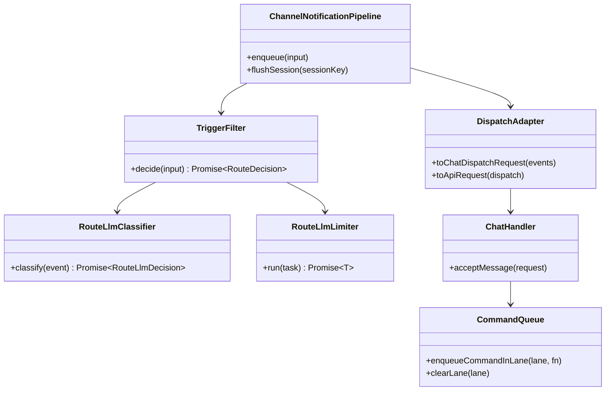
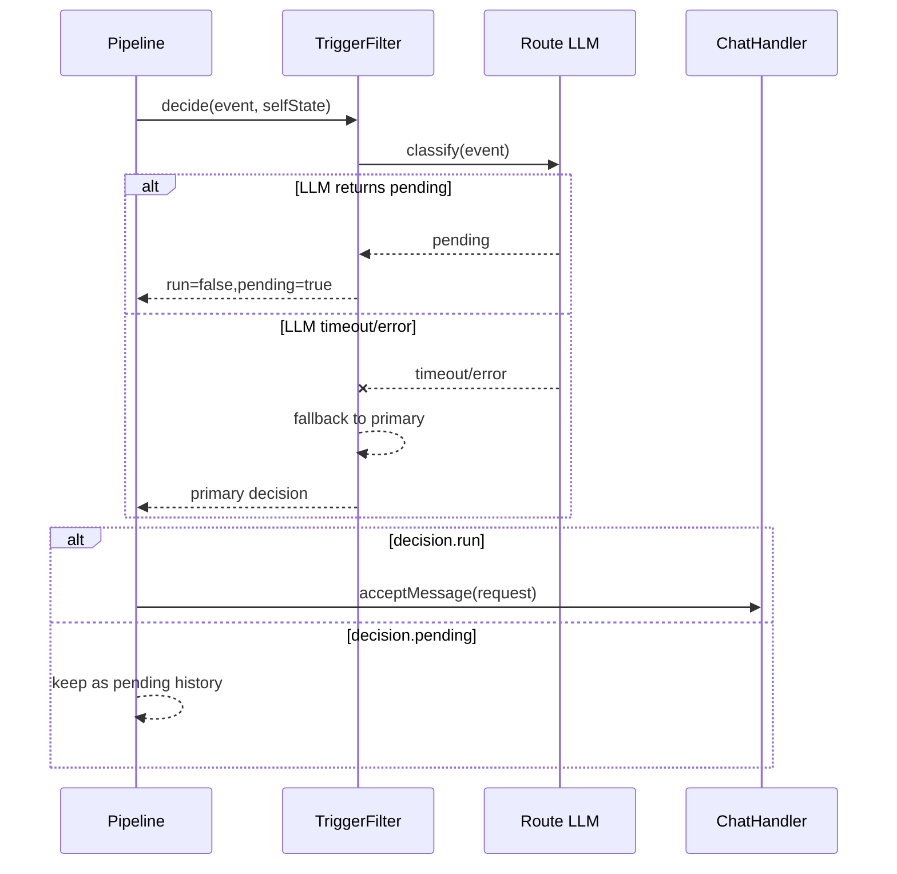

# Slack Proactive Remaining Work Plan

## 1. 概要と目的 Overview and Purpose

- What  
  `doc/slack-proactive.md` と `doc/ext-plan.md` で定義済みのうち、未完了の実装項目（軽量LLM一次判定、キュー運用強化、検証とドキュメント整合）を完了する。
- Why  
  要件定義に明記済みの「軽量LLMで一次判定」と、現行実装のギャップを解消し、Fast Path のコスト最適化と運用監査性を担保する。
- How  
  既存 `TriggerFilter` の拡張ポイント（`secondaryClassifier`）を中核に、timeout/fallback 契約と並列上限を実装する。併せて `command-queue` と `notification-queue` の未完了検証を TDD で埋め、`pnpm check` を完走可能にする。

## 2. 仕様と受け入れ条件 Specification and Acceptance Criteria

### 2.1 スコープ Scope

- 軽量LLM一次判定（Route 二次判定）を `TriggerFilter` に実装する。
- 一次判定プロンプトと出力スキーマを契約化し、timeout/不正応答時の deterministic fallback を実装する。
- `maxConcurrentRouteLlm` / `routeLlmTimeoutMs` を設定化し、ランタイム注入可能にする。
- route LLM の実行プロバイダは OpenAI を採用する。
- `command-queue` の残タスク（lane concurrency / clear）を実装し、関連テストを追加する。
- `queue overflow / dedupe / debounce` の不足テストを追加する。
- 2nd チャネル plugin は本番接続ではなく、最小 PoC（テスト用 plugin）で「本体改修なし追加可能」を検証する。
- `maxConcurrentRouteLlm` の既定値は `1` とし、逐次評価を基準にする（将来の性能検証で再評価）。
- `pnpm check` を通し、残タスクのチェックリストを更新する。

成果物:

- 実装: `src/proactive/*`, `src/assistant/command-queue.ts`, `src/assistant/main.ts`
- テスト: `tests/proactive/*`, `tests/assistant/command-queue.test.ts`
- ドキュメント: `doc/slack-proactive.md`, `doc/ext-plan.md`, `doc/plan/pending-tasks.md`

制約:

- 既存 API 最小契約 `message/sessionKey/idempotencyKey` は維持する。
- Fast Path の `RouteDecision` 制約（`drop` 排他、`run/pending` 排他）は維持する。
- PII を含む本文は監査ログへ平文出力しない。

### 2.2 非スコープ Non Scope

- 外部チャネル（Telegram/Discord）の本番運用開始。
- `message` ツール本実装と `sessions_send` 最終ポリシー確定。
- 永続 notification queue（DB/WAL）導入。
- Route LLM の高機能最適化（AB テスト、学習ループ、モデル自動選択）。

### 2.3 ユースケース Use Cases

- UC-1 正常系: `post` 受信時、軽量LLMが `pending` 判定を返し、run 起動せず pending として履歴保持する。
- UC-2 正常系: `reaction/notification` 受信時、run 判定なら軽量トリガー文を dispatch し、詳細は system event に保持する。
- UC-3 異常系: 軽量LLM timeout/失敗/不正応答時、一次判定へフォールバックして処理継続する。
- UC-4 異常系: queue overflow 発生時、`dropPolicy=summarize` で summary system event を注入し処理継続する。
- UC-5 正常系: 新規チャネル plugin を registry 登録した際、Fast Path 本体コード変更なしで連携できる。
- UC-6 品質系: `pnpm check` 完走と主要テスト通過により、要件と実装の整合を確認する。

### 2.4 受け入れ条件 Acceptance Criteria

1. Given non-self の `post` イベント、When route LLM が `pending` を返す、Then `RouteDecision` は `pending=true/run=false/drop=false` になる。
2. Given route LLM が timeout または例外、When `TriggerFilter.decide()` を実行する、Then warning を記録し一次判定結果へフォールバックする。
3. Given route LLM の応答が契約外値、When 判定を正規化する、Then run/pending のいずれかへ安全に丸めるか一次判定へフォールバックする。
4. Given queue cap 超過、When `dropPolicy=summarize`、Then summary system event を 1 件注入し Fast Path は停止しない。
5. Given 新規 plugin が `startAccount()` で `ChannelNotificationInput` を emit、When registry に登録して起動する、Then Fast Path 本体変更なしで enqueue 連携できる。
6. Given lane clear を呼ぶ、When 対象 lane に待機ジョブがある、Then実行中ジョブ以外を取り除き、後続実行を停止できる。
7. Given CI 相当チェック、When `pnpm check` を実行する、Then format/typecheck/test がすべて成功する。

### 2.5 既知の制約 Known Limitations

- 初期版 route LLM は閾値やfew-shot最適化を行わず、低コストの判定器として利用する。
- 2nd チャネル検証は PoC レベル（テスト plugin）とし、実チャネル接続は別計画とする。
- 軽量LLM呼び出し基盤が利用不能な環境では deterministic 判定で運用継続する。

## 3. 前提技術スタック Context and Tech Stack

- Language Framework  
  TypeScript (ESM), Node.js ランタイム
- Libraries  
  既存 `@mariozechner/pi-coding-agent`, `@assistant-ui/react`, Node 標準 API
- Style Guide  
  既存の ESLint / Prettier / TypeScript 設定に準拠
- Runtime Deployment  
  ローカル実行（`pnpm run assistant`）を基準。CDP 連携あり
- Testing  
  `node:test` + `tsx`（`pnpm run test` / `pnpm check`）

## 4. インターフェース契約 Interface Contracts

### 4.1 公開APIまたは外部I O一覧

- HTTP API: `POST /api/chat/messages`（最小契約維持）
- 設定: route LLM の timeout / concurrency / 有効化フラグ
- 永続化: `memory/timeline.jsonl`, `memory/sessions/*.jsonl`
- 外部連携: Slack CDP イベント、OpenAI API（route LLM）

### 4.2 データモデルとスキーマ

```ts
type RouteLlmDecision = {
  outcome: "run" | "pending";
  confidence?: number;
  reason?: string;
};

type RouteLlmConfig = {
  enabled: boolean;
  timeoutMs: number; // routeLlmTimeoutMs
  maxConcurrent: number; // maxConcurrentRouteLlm
};
```

- `RouteLlmDecision` は `TriggerFilter` 内で `RouterOutcome` へ正規化する。
- 契約外値は不正応答として扱い、一次判定へフォールバックする。
- `ChatDispatchRequest` と API request 契約は既存のまま維持する。

### 4.3 エラーと例外 Error Handling

- 分類:
- route LLM timeout
- route LLM 通信失敗
- route LLM 応答スキーマ不一致
- 方針:
- いずれも fail-open ではなく「一次判定へのフォールバック」で継続
- 例外は warning ログへ記録し、処理全体は継続
- タイムアウト:
- `routeLlmTimeoutMs` 超過時に即 fallback
- ログ方針:
- `uid/eventKind/fallbackReason` は記録
- Slack本文テキストは原則ログに直接出さない

### 4.4 代表的な例 Examples

例1: route LLM 正常応答

```json
{ "outcome": "pending", "confidence": 0.82, "reason": "FYI notification only" }
```

例2: timeout 時の内部判定

```ts
// secondary classifier timeout -> primary outcome used
const decision = await triggerFilter.decide({ event, selfState: "non-self" });
```

例3: 既存 API 契約（変更なし）

```json
{ "message": "...", "sessionKey": "main", "idempotencyKey": "sha256:..." }
```

## 5. アーキテクチャと設計図 Architecture and Diagrams

### 5.1 図の選択方針

- Fast Path は複数モジュール（pipeline/filter/queue/API）と外部 I/O（LLM）を跨ぐためクラス図を必須とする。
- timeout/fallback の非同期挙動が重要なためシーケンス図を追加する。

### 5.2 クラス図 Class Diagram



### 5.3 その他の図 Optional



## 6. テスト戦略 Test Strategy

### 6.1 テストの種類

- Unit  
  `trigger-filter`, route LLM 正規化、timeout/fallback、`command-queue` clear/lane concurrency
- Integration  
  `channel-notification-pipeline` で route LLM 判定から dispatch までを実接続（fake classifier）
- Contract  
  `RouteDecision` 制約維持、API最小契約維持、設定値バリデーション

### 6.2 カバレッジ対象

- 重要ロジック:
- secondary classifier 正規化
- fallback 条件
- queue clear と lane順序
- エラー分岐:
- timeout
- classifier 例外
- 不正応答
- 境界条件:
- `maxConcurrentRouteLlm=1` と高負荷入力
- queue cap 境界
- `routeLlmTimeoutMs` 最小値

## 7. 実装タスクリスト Implementation Plan

### Phase 1 設計と準備

- [x] 要件と仕様の確定（軽量LLM一次判定の契約と受け入れ条件を確定）
- [x] インターフェース契約確定（RouteLlmDecision/Config、fallback契約、ログ契約）
- [x] Mermaid 図を本計画へ記載し設計を固定
- [x] 設定値と環境変数の命名を確定（`maxConcurrentRouteLlm`, `routeLlmTimeoutMs`）
- [x] テスト基盤確認（timeout制御、fake classifier、並列検証ヘルパ）

### Phase 2 機能A: 軽量LLM一次判定

- [x] Test: secondary classifier の `run/pending` 反映テストを追加 (Red)
- [x] Test: timeout/例外/不正応答で一次判定へ fallback するテストを追加 (Red)
- [x] Impl: `TriggerFilter` に route LLM classifier + timeout + fallback を実装 (Green)
- [x] Refactor: 判定正規化と warning ログ処理を分離 (Refactor)
- [x] Integration: `ChannelNotificationPipeline` 経由で route LLM 判定を検証 (Integration)
- [x] Docs: `doc/slack-proactive.md` と `doc/ext-plan.md` の契約欄を同期 (Docs)

### Phase 3 機能B: キュー拡張と検証不足解消

- [x] Test: `command-queue` lane concurrency/clear の失敗テストを追加 (Red)
- [x] Impl: `command-queue` に lane clear と concurrency 制御を実装 (Green)
- [x] Test: queue overflow/dedupe/debounce の不足ケースを追加 (Red)
- [x] Impl: 必要な挙動差分を最小実装で修正 (Green)
- [x] Integration: 2nd channel 用のテスト plugin（擬似イベント発火のみ）を registry 登録し連携検証 (Integration)
- [x] Docs: 起動手順/運用手順（README）を更新 (Docs)

### Phase 4 統合と検証

- [x] `pnpm check` を実行し失敗（format/typecheck/test）を解消
- [x] エッジケース検証（timeout, self判定不可, queue overflow）
- [x] warning/error ログを確認し、PII 非露出と原因追跡性を確認
- [x] `doc/plan/pending-tasks.md` と計画チェックボックスを最新化

## 8. 完了の定義 Definition of Done

### 8.1 機能DoD Functional DoD

- [x] 軽量LLM一次判定が `run/pending` 判定へ反映される
- [x] timeout/失敗時の deterministic fallback が機能する
- [x] `command-queue` の lane clear/concurrency 契約が満たされる
- [x] queue overflow/dedupe/debounce の検証観点が満たされる

### 8.2 品質DoD Quality DoD

- [x] `pnpm check` が成功する
- [x] 追加した Unit/Integration/Contract テストが安定してパスする
- [x] 警告ログで fallback 理由を追跡可能である
- [x] 要件書と計画書（`doc/slack-proactive.md`, `doc/ext-plan.md`, `doc/plan/pending-tasks.md`）が整合している

## 9. 確定事項と残懸念 Confirmed Decisions and Risks

確定事項:

- route LLM 実プロバイダは OpenAI。認証管理は既存の秘密情報運用（環境変数）に統一する。
- `maxConcurrentRouteLlm` の既定値は `1`（逐次評価）とする。必要なら別タスクで性能再評価する。
- 2nd channel PoC は「実チャネル接続」ではなく「自動テストで使うテスト plugin」のみを対象とする。

残懸念:

- `pnpm check` 失敗要因（format起因）の運用ルールを、PR前に自動修正するか明示運用にするか。
