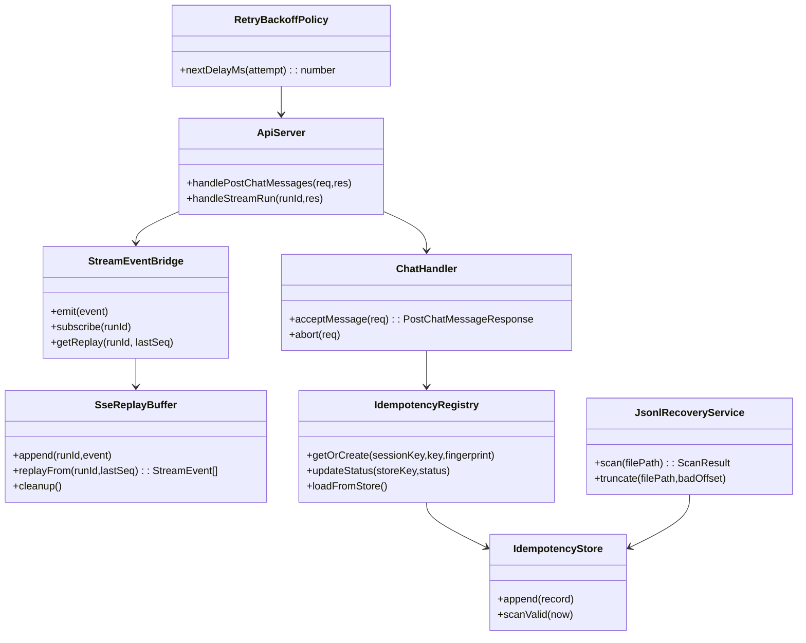
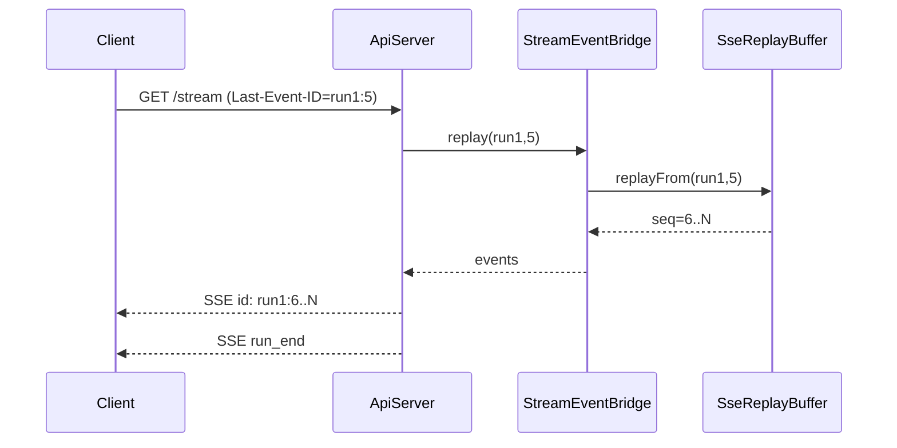
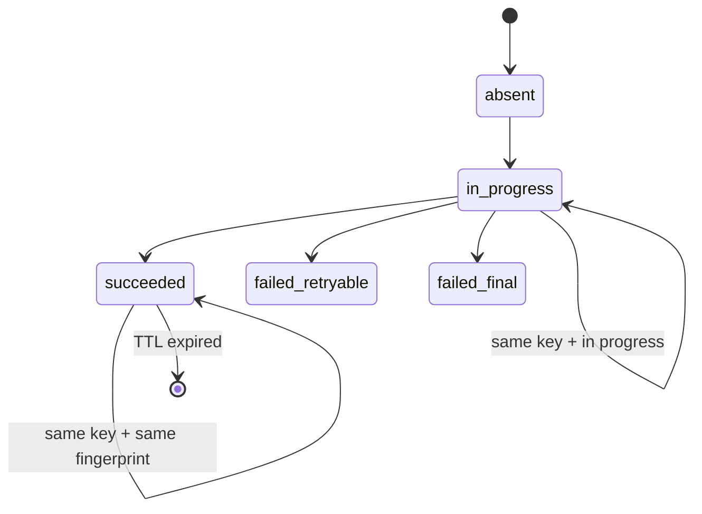

# レジリエンス強化実装計画（SSE/再接続/JSONL/冪等）

## 1. 概要と目的 Overview and Purpose

- What  
  以下 5 項目を短期優先順で実装する。
  1. SSE `id` 付与 + `Last-Event-ID` 再送（リングバッファ）
  2. CDP 再接続を full jitter 化
  3. JSONL 末尾破損検知 + truncate 復旧
  4. `Idempotency-Key` 正式化（`clientMessageId` 互換受理）
  5. 永続 dedup（厳密キー少量保持、必要に応じて Bloom 補助）
- Why  
  切断復帰、再起動、重複送信、I/O 失敗の各障害面で UI 一貫性と運用ノイズを改善し、障害時の説明可能性を上げる。
- How  
  既存の `src/assistant`/`src/proactive`/`src/io` を中心に、契約を先に固定してから TDD で段階導入する。  
  API 契約は後方互換を維持しつつ、新契約 (`Idempotency-Key`, SSE replay) を優先導線に移す。

## 2. 仕様と受け入れ条件 Specification and Acceptance Criteria

### 2.1 スコープ Scope

- 今回やること
  - SSE イベントに `id: <runId>:<seq>` を付与する
  - `GET /api/chat/runs/:runId/stream` が `Last-Event-ID` から欠落区間を再送する
  - CDP 再接続待機を `full jitter` (`random(0, min(cap, base*2^attempt))`) に変更する
  - JSONL 復旧処理を追加し、末尾破損を検知して truncate 復旧できるようにする
  - `POST /api/chat/messages` で `Idempotency-Key` ヘッダを正式受理し、`clientMessageId` と互換運用する
  - 冪等/重複排除状態を永続化し、再起動後も TTL 内は同一キー再送を再現応答できるようにする
- 成果物
  - サーバ実装変更（`src/assistant/*`, `src/proactive/*`, `src/io/*`, `src/index.ts`）
  - 仕様更新（`doc/spec-unified.md`）
  - テスト追加/更新（`tests/assistant/*`, `tests/proactive/*`, `tests/jsonlWriter.test.ts`）
- 制約
  - プロトタイプ優先。ただし既存 API の破壊は避け、段階移行で導入する
  - 既存 `run_end` 終端契約は維持する
  - 既存 UI の最小契約を壊さない

### 2.2 非スコープ Non Scope

- 今回やらないこと
  - DB 置換（SQLite への全面移行）
  - 大規模 compaction バッチの本実装
  - Bloom filter の本番有効化（必要時の補助導入設計まで）
  - `runId` 生成方式の全面変更（現状の `idempotencyKey` 準拠を維持）
- 将来検討だが今回除外すること
  - cross-process ロックを伴う厳密 exactly-once
  - 履歴 API と SSE の統合再同期 API 新設

### 2.3 ユースケース Use Cases

- 正常系: ユーザーが `POST /api/chat/messages` 後に SSE を購読し、切断後に `Last-Event-ID` 付き再接続で欠落イベントを受け取り `run_end` で終端する
- 正常系: Slack CDP が一時切断しても、複数プロセスが同時再接続に集中せず、jitter により再接続が分散する
- 異常系: `timeline.jsonl` の末尾が途中書き込みで壊れていても、起動時に破損位置で truncate して再起動できる
- 異常系: 同一 `Idempotency-Key` で本文が異なる再送が来た場合、`409 IDEMPOTENCY_PAYLOAD_MISMATCH` を返して重複実行を防ぐ
- 復旧系: サーバ再起動後に同一キー再送が来ても、永続 dedup により同一 run 扱いで応答する

### 2.4 受け入れ条件 Acceptance Criteria

1. Given run の SSE が `seq=1..N` で配信済み  
   When クライアントが `Last-Event-ID=<runId>:k` で再接続する  
   Then サーバは `k+1..N` のみ再送し、終端は `run_end` で一意判定できる
2. Given 複数接続が同時に CDP 切断した  
   When 再接続待機を計算する  
   Then 待機時間は `0..cap` の範囲で分散し、固定増分リトライにならない
3. Given JSONL の末尾に不完全行または不正 JSON がある  
   When 起動時復旧を実行する  
   Then 破損位置まで truncate して継続起動できる
4. Given `Idempotency-Key` があり、同一 `sessionKey` かつ同一 payload で再送された  
   When `POST /api/chat/messages` を呼ぶ  
   Then 新規 run を作らず既存 run を返す
5. Given `Idempotency-Key` が同一で payload が異なる  
   When `POST /api/chat/messages` を呼ぶ  
   Then `409 IDEMPOTENCY_PAYLOAD_MISMATCH` を返し重複実行しない
6. Given サーバを再起動した  
   When TTL 内の同一冪等キーで再送する  
   Then 永続 dedup を参照して同一結果を返す
7. Given pending timeline が残っている  
   When 実行受付を試みる  
   Then `503 DUAL_WRITE_PENDING_TIMELINE` で fail-fast し、誤った run 判定に進まない

### 2.5 既知の制約 Known Limitations

- SSE 再送はリングバッファ保持期間内のみ保証し、期限超過は再同期要求にフォールバックする
- 永続 dedup は TTL + 上限件数運用のため、長期履歴全件の厳密排除は提供しない
- `checksum` は新規行から適用し、旧データは互換読み込みで扱う

## 3. 前提技術スタック Context and Tech Stack

- Language Framework  
  TypeScript (ESM), Node.js (`node:http`, `node:fs/promises`)
- Libraries  
  `chrome-remote-interface`, 既存内部モジュール（`StreamEventBridge`, `DualWriteCoordinator`）
- Style Guide  
  既存 ESLint + Prettier 準拠（2スペース、double quotes）
- Runtime Deployment  
  単一 Node プロセス（assistant gateway / slack ingestion）
- Testing  
  `node:test` + `assert/strict`、必要に応じて tmpdir を使った file I/O テスト

## 4. インターフェース契約 Interface Contracts

### 4.1 公開APIまたは外部I O一覧

- HTTP API
  - `POST /api/chat/messages`
  - `GET /api/chat/runs/:runId/stream`
- 設定
  - `ADJUTANT_DUAL_WRITE_RETRY_INTERVAL_MS`
  - `ADJUTANT_IDEMPOTENCY_TTL_SEC`（新設予定）
  - `ADJUTANT_SSE_REPLAY_BUFFER_SIZE`（新設予定）
  - `ADJUTANT_SSE_REPLAY_MAX_AGE_MS`（新設予定）
- 永続化ストレージ
  - `data/YYYY/MM/DD/slack/events.jsonl`
  - `memory/timeline.jsonl`
  - `session JSONL`（現実装は `memory/sessions/*.jsonl`、仕様書上は `_sessions/*.jsonl`）
  - `memory/idempotency.jsonl`（新設予定）
  - `memory/dedup-keys.jsonl`（新設予定）
- 外部サービス連携
  - CDP endpoint（Slack Desktop）

### 4.2 データモデルとスキーマ

- SSE event id
  - `id = "<runId>:<seq>"`
  - `Last-Event-ID` は同フォーマットのみ受理
- 冪等キー
  - `effectiveKey = header["Idempotency-Key"] ?? body.clientMessageId ?? body.idempotencyKey`
  - `fingerprint = sha256(method + path + canonicalBody)`
- 永続冪等レコード（JSONL）
  - `{ sessionKey, idempotencyKey, fingerprint, status, runId, createdAt, expiresAt }`
- 永続 dedup レコード（JSONL）
  - `{ uid, firstSeenAt, expiresAt, source }`
- JSONL 整合性
  - 新規行は `checksum` を持つ（旧行は checksum なし互換）

### 4.3 エラーと例外 Error Handling

- エラー分類
  - 入力不正: `400 INVALID_JSON` / `400 INVALID_REQUEST`
  - 冪等衝突: `409 IDEMPOTENCY_IN_PROGRESS` / `409 IDEMPOTENCY_PAYLOAD_MISMATCH`
  - 再送不能: `409 LAST_EVENT_ID_EXPIRED`
  - 一時障害: `503 DUAL_WRITE_PENDING_TIMELINE`, `503 IDEMPOTENCY_STORE_UNAVAILABLE`
  - 内部障害: `500 INTERNAL_ERROR`
- リトライ方針
  - CDP 再接続は full jitter
  - HTTP 503/一部 409 は `Retry-After` を返し再試行可能
- タイムアウト方針
  - SSE keepalive を維持し、再接続はクライアント主導
- ログ方針と個人情報の扱い
  - payload 全文はログしない
  - `runId`, `sessionKey`, `idempotencyKey hash`, `error code` を中心に構造化ログ化

### 4.4 代表的な例 Examples

```bash
curl -sS -X POST http://127.0.0.1:3100/api/chat/messages \
  -H 'Content-Type: application/json' \
  -H 'Idempotency-Key: msg-20260221-001' \
  -d '{"sessionKey":"main","message":"hello","clientMessageId":"legacy-001"}'
```

```bash
curl -N http://127.0.0.1:3100/api/chat/runs/msg-20260221-001/stream \
  -H 'Last-Event-ID: msg-20260221-001:3'
```

```json
{
  "error": {
    "code": "IDEMPOTENCY_PAYLOAD_MISMATCH",
    "message": "same idempotency key was used with different payload",
    "retryable": false
  }
}
```

## 5. アーキテクチャと設計図 Architecture and Diagrams

### 5.1 図の選択方針

- 本件は API、ストリーム、永続化、再接続を跨ぐためクラス図を必須とする
- 非同期再送の挙動確認のためシーケンス図を追加する
- 冪等状態が重要なため状態遷移図を追加する

### 5.2 クラス図 Class Diagram



### 5.3 その他の図 Optional





## 6. テスト戦略 Test Strategy

### 6.1 テストの種類

- Unit
  - `SseReplayBuffer`: 追記/再送/期限切れ/範囲外
  - `RetryBackoffPolicy`: full jitter 範囲保証と cap 保証
  - `JsonlRecoveryService`: 不正末尾検知、truncate オフセット計算
  - `IdempotencyRegistry`: key/fingerprint 判定、状態遷移
- Integration
  - `ApiServer`: `Last-Event-ID` 付き SSE 再接続 end-to-end
  - `ChatHandler + IdempotencyStore`: 再起動模擬ロード後の再送動作
  - `slack-channel-plugin` / `src/index.ts`: jitter 再接続の遅延レンジ確認
- Contract
  - API エラーコードと HTTP ステータス対応
  - `run_end` 終端契約維持（`text_end` で終端しない）

### 6.2 カバレッジ対象

- 重要ロジック
  - SSE リプレイの `id/seq` 整合
  - 冪等 fingerprint 不一致分岐
  - JSONL truncate 境界
- エラー分岐
  - 不正 `Last-Event-ID`
  - 永続ストア I/O 失敗
  - pending timeline の受付拒否
- 境界条件
  - リングバッファ空/満杯
  - TTL 直前/直後
  - 再接続試行回数増加時の cap

## 7. 実装タスクリスト Implementation Plan

### Phase 1 設計と準備

- [x] 要件と仕様の確定 受け入れ条件の確定（`doc/spec-unified.md` との差分を確定）
- [x] インターフェース契約の確定 スキーマと例の追加（API error code / SSE id / idempotency）
- [x] Mermaid図の作成 更新（クラス図、SSE再接続シーケンス、冪等状態遷移）
- [x] インターフェース 型定義の作成（`src/assistant/api-types.ts`, `src/assistant/types.ts`）
- [x] テスト基盤の確認（`tests/assistant/*`, `tests/proactive/*`, tmpdir I/O テスト）

### Phase 2 SSE id 付与 + Last-Event-ID 再送

- [x] Test `GET /stream` で `id: <runId>:<seq>` が出る失敗テストを追加 Red  
       対象: `tests/assistant/api-server.test.ts`, `tests/assistant/stream-event-bridge.test.ts`
- [x] Impl リングバッファと replay API を追加 Green  
       対象: `src/assistant/stream-event-bridge.ts`, `src/assistant/api-server.ts`
- [x] Refactor replay バッファの cleanup と設定値注入  
       対象: `src/assistant/main.ts`, `src/assistant/api-server.ts`
- [x] Integration 再接続（切断→`Last-Event-ID`）を E2E 追加
- [x] Docs SSE 再接続契約とエラーコードを更新

### Phase 3 CDP リトライ full jitter 化

- [x] Test 再接続待機が linear ではなく jitter 範囲に収まる失敗テスト Red  
       対象: `tests/proactive/slack-channel-plugin.test.ts`（必要なら `tests/runtime/*` 新設）
- [x] Impl full jitter policy 実装 Green  
       対象: `src/proactive/slack-channel-plugin.ts`, `src/index.ts`
- [x] Refactor retry policy を純粋関数化して再利用  
       対象: `src/runtime/retry-policy.ts`（新設）
- [x] Integration 切断連続時の backoff 挙動確認
- [x] Docs 再接続式の記述更新

### Phase 4 JSONL 末尾破損検知 + truncate 復旧

- [x] Test 末尾不正 JSON / 途中行で起動復旧できる失敗テスト Red  
       対象: `tests/jsonlWriter.test.ts`, `tests/assistant/*`（復旧起動テスト新設）
- [x] Impl `JsonlRecoveryService` と起動フック実装 Green  
       対象: `src/io/jsonl-recovery.ts`（新設）, `src/assistant/main.ts`, `src/index.ts`
- [x] Refactor checksum 計算ユーティリティ導入  
       対象: `src/io/jsonl-checksum.ts`（新設）, `src/io/jsonlWriter.ts`
- [x] Integration `events/timeline/session` の 3 系統復旧テスト
- [x] Docs 復旧手順と内部判定コードを確定

### Phase 5 Idempotency-Key 正式化（互換受理）

- [x] Test `Idempotency-Key` 優先、`clientMessageId` 互換、payload 不一致 409 の失敗テスト Red  
       対象: `tests/assistant/api-server.test.ts`, `tests/assistant/chat-handler.test.ts`
- [x] Impl API 受理ルールと fingerprint 判定実装 Green  
       対象: `src/assistant/api-server.ts`, `src/assistant/chat-handler.ts`, `src/assistant/api-types.ts`
- [x] Refactor エラー型と共通レスポンス整形  
       対象: `src/assistant/errors.ts`（新設）
- [x] Integration 既存クライアント（body `idempotencyKey`）の互換動作確認
- [x] Docs API 契約例と移行方針を更新

### Phase 6 永続 dedup（厳密キー少量保持）

- [x] Test 再起動後 dedup 維持、TTL 失効、上限件数 eviction の失敗テスト Red  
       対象: `tests/assistant/idempotency-registry.test.ts`, `tests/assistant/chat-handler.test.ts`
- [x] Impl 永続ストア（JSONL）読み書きと起動ロード Green  
       対象: `src/assistant/idempotency-registry.ts`, `src/assistant/idempotency-store.ts`（新設）
- [x] Refactor strict key store と任意 Bloom 補助の境界分離  
       対象: `src/assistant/dedup-store.ts`（新設）
- [x] Integration ストア破損時の fail-open/fail-closed 方針テスト
- [x] Docs 既知制約と運用パラメータ更新

### Phase 7 統合と検証

- [x] 全体テストの実行（`pnpm run test`, `pnpm check`）
- [x] エッジケースの動作確認（SSE切断, pending timeline, store障害）
- [x] ログと例外の確認（想定外入力 タイムアウト リトライ）
- [x] ドキュメント更新（仕様 契約 図）

## 8. 完了の定義 Definition of Done

### 8.1 機能DoD Functional DoD

- [x] 受け入れ条件がすべて満たされていること
- [x] 既知の制約が明文化され、想定通りであること
- [x] 契約の例に対して期待通りの結果が得られること

### 8.2 品質DoD Quality DoD

- [x] 全てのテストがパスしていること
- [x] Linter Formatterのエラーがないこと
- [x] 不要なデバッグコードが削除されていること
- [x] 主要な変更点がドキュメントに反映されていること

## 9. 懸念事項と未確定事項 Concerns and Questions

- session JSONL パスが仕様 (`_sessions/<sessionId>.jsonl`) と現実装 (`memory/sessions/<sessionKey>.jsonl`) で不一致。今回の対象をどちらに統一するかを確定したい
- `runId = idempotencyKey` を維持するか、内部採番へ分離するか。今回は互換優先で維持案だが将来的に衝突リスクがある
- 永続 dedup ストア障害時の方針（fail-open で継続か、fail-closed で 503 か）を運用要件に合わせて決める必要がある
- `fdatasync` 導入時の I/O コスト増加をどこまで許容するか（全レコード同期か、バッチ同期か）
- Bloom filter は偽陽性で正規イベントを落とすため、補助利用時の適用範囲を read-path 限定にするか要判断
