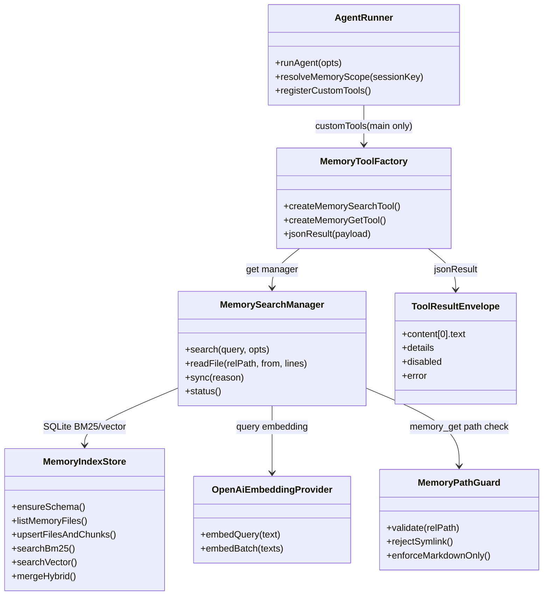
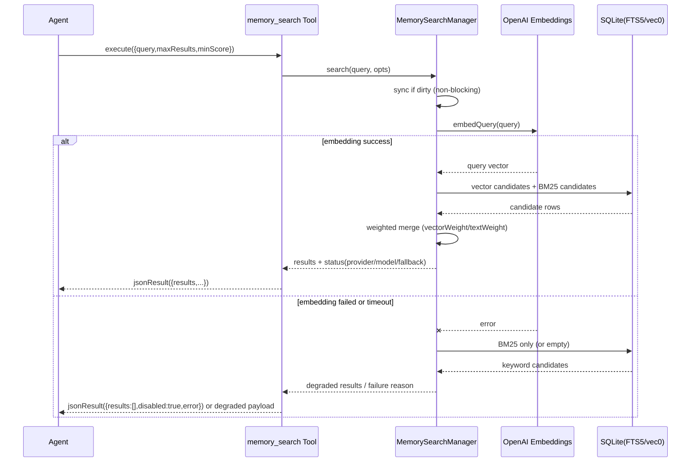
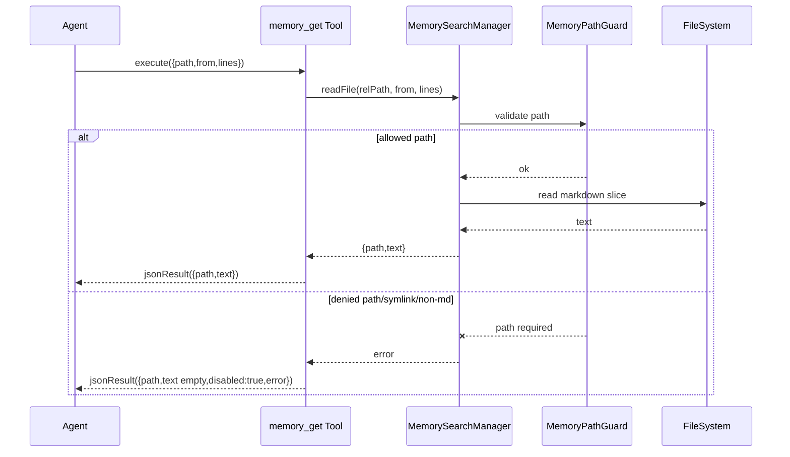

# SQLite Hybrid Memory Search 組み込み計画

## 1. 概要と目的 Overview and Purpose

- What  
  `adjutant` に、`MEMORY.md` と `memory/*.md` を対象にしたローカルファイルファーストの `memory_search` / `memory_get` を実装する。  
  検索は SQLite を基盤に、BM25（FTS5）とベクター検索（sqlite-vec）をハイブリッドで提供する。

- Why  
  現在は main セッションで `MEMORY.md` と日次メモを毎ターン注入しており、トークン消費と文脈ノイズが大きい。  
  必要な時だけ検索して必要な行だけ取得する方式へ寄せることで、精度・コスト・応答速度を改善する。

- How  
  `src/assistant` 配下にメモリ検索サブシステムを追加し、`agent-runner` の `customTools` に `memory_search` / `memory_get` を統合する。  
  Markdown を source of truth とし、インデックスは再構築可能なキャッシュとして扱う。

## 2. 仕様と受け入れ条件 Specification and Acceptance Criteria

### 2.1 スコープ Scope

- 今回やること
  - `MEMORY.md` と `memory/**/*.md` の列挙・チャンク化・SQLite インデックス化
  - BM25 検索（FTS5）実装
  - ベクター検索実装（sqlite-vec 前提。ロード失敗時は fail-fast）
  - `memory_search` / `memory_get` ツール実装と `agent-runner` への組み込み
  - `main` と `spoke` の memory 権限分離を維持
  - OpenAI 埋め込み（第一段階）での運用
  - テスト追加（unit / integration / contract）

- 成果物
  - `src/assistant/memory-search/*`（新規）
  - `src/assistant/agent-runner.ts`（ツール統合）
  - `tests/assistant/memory-search*.test.ts`（新規）
  - 仕様反映ドキュメント更新（`doc/slack-proactive.md` / `doc/spec-unified.md` の該当節）

- 制約
  - プロトタイプ優先。既存 API 契約は維持しつつ、内部構造最適化を優先
  - 既存 `memory_write` ツールと競合しないこと

### 2.2 非スコープ Non Scope

- QMD バックエンド導入
- セッショントランスクリプト（`memory/sessions/*.jsonl`）の埋め込み検索統合
- 再ランク専用モデル導入
- UI 側の高度表示（citation UI 専用コンポーネント追加など）
- Linux / Windows での sqlite-vec 動作保証（当面は macOS 前提）

### 2.3 ユースケース Use Cases

- 正常系1  
  main セッションで「先週決めた方針は？」と質問すると、エージェントが `memory_search` を呼び、該当スニペットの path+line を得る。

- 正常系2  
  取得した path に対して `memory_get` を `from` / `lines` 指定で呼び、必要部分だけ読んで回答する。

- 正常系3  
  `memory_write` で日次メモ更新後、次回 `memory_search` で更新内容が検索ヒットする。

- 異常系1  
  sqlite-vec 拡張がロード不可なら、メモリ検索機能を起動せず fail-fast として明示エラーを返す。

- 異常系2  
  `memory_get` に `../../secret.txt` や symlink パスを渡しても拒否される。

- 異常系3  
  spoke セッションでは `memory_search` / `memory_get` が無効化され、`MEMORY.md` を読まない。

### 2.4 受け入れ条件 Acceptance Criteria

- Given main セッションで `memory_search` を呼ぶ  
  When `MEMORY.md` と `memory/*.md` に一致情報がある  
  Then `results[]` に `path/startLine/endLine/score/snippet` が返る

- Given macOS 環境で sqlite-vec の smoke test が成功  
  When `memory_search` 実行  
  Then vec0 + BM25 のハイブリッド検索結果が返る

- Given `memory_get` に許可外パスが渡される  
  When ツール実行  
  Then ファイル内容は返さず、契約済みエラー形式を返す

- Given spoke セッションで runAgent 実行  
  When ツール一覧が解決される  
  Then `memory_search` / `memory_get` は登録されない

- Given `memory_write` でファイル更新済み  
  When 次回 `memory_search` 実行  
  Then インデックス同期後に更新内容が検索対象になる

- Given OpenAI 埋め込み API が失敗またはタイムアウト  
  When `memory_search` 実行  
  Then 呼び出し全体は失敗させず、BM25 優先で継続し監査ログに理由を残す

### 2.5 既知の制約 Known Limitations

- 初回検索時はインデックス作成でレイテンシが増える
- 日本語トークン化は簡易実装（char ベース分割）から開始する
- ベクター品質は利用モデル依存。第1段階は OpenAI 固定
- 当面は macOS 前提で運用し、sqlite-vec ロード失敗時は機能を fail-fast で停止する

## 3. 前提技術スタック Context and Tech Stack

- Language Framework  
  TypeScript 5.x / Node.js ESM（現行構成に準拠）

- Libraries  
  `openai`（既存）  
  `node:sqlite`（Node 組み込み）  
  `sqlite-vec`（新規依存、必須）

- Style Guide  
  既存の ESLint / Prettier / tsconfig に準拠

- Runtime Deployment  
  `pnpm run assistant` 単一ランタイム構成

- Testing  
  Node built-in test runner（`node --test` + `tsx`）  
  既存 `tests/assistant` パターンに準拠

## 4. インターフェース契約 Interface Contracts

### 4.1 公開APIまたは外部 I/O 一覧

- Tool: `memory_search`
  - input: `{ query: string, maxResults?: number, minScore?: number }`
  - output（OpenClaw準拠、`details` ペイロード）:
    - 成功: `{ results: MemorySearchResult[], provider: string, model?: string, fallback?: { from: string, reason?: string }, citations?: "on" | "off" | "auto" }`
    - 失敗/無効: `{ results: [], disabled: true, error?: string }`
  - tool result envelope（OpenClaw `jsonResult` 準拠）:
    - `{ content: [{ type: "text", text: "<payload JSON>" }], details: <payload> }`
  - 例外ポリシー:
    - 実行時例外は外へ throw せず、上記の `disabled/error` 形式へ正規化して返す

- Tool: `memory_get`
  - input: `{ path: string, from?: number, lines?: number }`
  - output（OpenClaw準拠、`details` ペイロード）:
    - 成功: `{ path: string, text: string }`
    - 失敗/無効: `{ path: string, text: "", disabled: true, error?: string }`
  - tool result envelope（OpenClaw `jsonResult` 準拠）:
    - `{ content: [{ type: "text", text: "<payload JSON>" }], details: <payload> }`
  - 例外ポリシー:
    - 実行時例外は外へ throw せず、上記の `disabled/error` 形式へ正規化して返す

- Filesystem
  - read target: `<workspace>/MEMORY.md`, `<workspace>/memory/**/*.md`
  - index DB: `<workspace>/memory/index/main.sqlite`（初期値）

- Config（環境変数、名称と既定値を確定）
  - `ADJUTANT_MEMORY_SEARCH_ENABLED`（default: `true`）
  - `ADJUTANT_MEMORY_SEARCH_MODEL`（default: `"text-embedding-3-small"`）
  - `ADJUTANT_MEMORY_SEARCH_MAX_RESULTS`（default: `5`）
  - `ADJUTANT_MEMORY_SEARCH_MIN_SCORE`（default: `0`）
  - `ADJUTANT_MEMORY_SEARCH_VECTOR_ENABLED`（default: `true`）
  - `ADJUTANT_MEMORY_SEARCH_SQLITE_VEC_PATH`（default: `""` = sqlite-vec 既定探索）

### 4.2 データモデルとスキーマ

- `MemorySearchResult`（OpenClaw型に寄せる）
  - `path: string`
  - `startLine: number`
  - `endLine: number`
  - `score: number`
  - `snippet: string`
  - `source: "memory" | "sessions"`（初期実装では `"memory"` のみ運用）
  - `citation?: string`（`memory.citations=on/auto` で付与）

- `files` テーブル
  - `path` PK, `hash`, `mtime`, `size`, `source`

- `chunks` テーブル
  - `id` PK, `path`, `start_line`, `end_line`, `hash`, `model`, `text`, `embedding`, `updated_at`, `source`

- `chunks_fts`（FTS5）
  - `text`, `id`, `path`, `start_line`, `end_line`, `model`, `source`

- `chunks_vec`（sqlite-vec 必須）
  - `id`, `embedding FLOAT[dims]`

- バリデーション方針
  - ツール引数は JSON Schema で strict validation
  - パスは workspace 相対化 + allowlist + symlink 拒否 + `.md` 限定

### 4.3 エラーと例外 Error Handling

- エラー分類
  - `validation_error`（不正引数）
  - `index_unavailable`（DB/拡張利用不可）
  - `embedding_unavailable`（埋め込み取得不可）
  - `permission_denied`（パス拒否）
  - `tool_contract_error`（契約外出力を検知した場合の正規化用内部分類）

- リトライ方針
  - 埋め込み API: 最大1回の短い再試行
  - SQLite busy: 指数バックオフで最大1回

- タイムアウト方針
  - 埋め込み API タイムアウトを明示設定（例: 10秒）
  - 検索はタイムアウト時に BM25 のみで返却

- ログ方針と個人情報
  - スニペット本文はログへ出さない
  - path, line range, duration, error reason のみ監査記録
  - tool 実行失敗時も `disabled/error` を返し、失敗内容は監査ログへ集約

### 4.4 代表的な例 Examples

```json
{
  "tool": "memory_search",
  "args": { "query": "通知ルーターの判定ロジック", "maxResults": 5 }
}
```

```json
{
  "results": [
    {
      "path": "memory/2026-02-20.md",
      "startLine": 12,
      "endLine": 24,
      "score": 0.78,
      "snippet": "...",
      "source": "memory",
      "citation": "memory/2026-02-20.md#L12-L24"
    }
  ],
  "provider": "openai",
  "model": "text-embedding-3-small",
  "citations": "auto"
}
```

```json
{
  "tool": "memory_get",
  "args": { "path": "MEMORY.md", "from": 30, "lines": 20 }
}
```

```json
{
  "path": "memory/NOPE.md",
  "text": "",
  "disabled": true,
  "error": "path required"
}
```

## 5. アーキテクチャと設計図 Architecture and Diagrams

### 5.1 図の選択方針

- 複数モジュールと外部 I/O（SQLite/OpenAI）を跨ぐためクラス図を採用
- 非同期同期（index sync）を表すためシーケンス図を追加

### 5.2 クラス図 Class Diagram



### 5.3 その他の図 Optional





## 6. テスト戦略 Test Strategy

### 6.1 テストの種類

- Unit
  - パス検証（許可/拒否）
  - チャンク分割
  - BM25 スコア変換とハイブリッド統合
  - sqlite-vec preflight 失敗時の fail-fast

- Integration
  - 一時ディレクトリで `MEMORY.md` + `memory/*.md` をインデックス化して検索
  - `memory_write` 後の再検索で新規内容ヒット
  - `agent-runner` 経由のツール登録（main/spoke）

- Contract
  - ツール入出力 JSON 形状固定
  - エラー時に throw せず契約形で返すこと

### 6.2 カバレッジ対象

- 重要ロジック
  - ファイル列挙・差分同期
  - FTS + vector マージ
  - readFile セキュリティ境界

- エラー分岐
  - 埋め込み失敗
  - sqlite busy
  - invalid path

- 境界条件
  - 空クエリ
  - 結果0件
  - 大きい markdown ファイル

## 7. 実装タスクリスト Implementation Plan

### Phase 1 設計と準備

- [x] 要件と仕様の確定（本計画の合意、環境変数名とデフォルト値の確定）
- [x] インターフェース契約の確定（`memory_search` / `memory_get` JSON 契約）
- [x] Mermaid図の作成 更新（本ファイルを正として維持）
- [x] 型定義作成（`src/assistant/memory-search/types.ts`）
- [x] テスト基盤確認（`tests/assistant` 配下の新規ファイル雛形）

### Phase 2 Memory Index Core（Red/Green/Refactor）

- [x] Test Red: `MEMORY.md` / `memory/*.md` の列挙と path allowlist テスト
- [x] Impl Green: file catalog + path validator + `memory_get` 実装
- [x] Refactor: validator と fs アクセス責務分離
- [x] Test Red: SQLite schema / upsert / BM25 検索失敗テスト
- [x] Impl Green: `MemoryIndexStore` と FTS5 検索実装
- [x] Refactor: SQL 文定数化とエラーマッピング整理

### Phase 3 Vector Hybrid + Tool Integration（Red/Green/Refactor）

- [x] Test Red: 埋め込みあり/なしでハイブリッド順位が変わるテスト
- [x] Impl Green: OpenAI 埋め込み + sqlite-vec ハイブリッド実装（JS cosine fallback なし）
- [x] Refactor: `EmbeddingProvider` 抽象化（OpenAI 専用実装を分離）
- [x] Test Red: `agent-runner` main/spoke でツール公開差分テスト
- [x] Impl Green: `agent-runner` の customTools に `memory_search` / `memory_get` を統合
- [x] Docs: `doc/slack-proactive.md` と `doc/spec-unified.md` の要求仕様反映

### Phase 4 統合と検証

- [x] 全体テストの実行（`pnpm run test`, `pnpm run typecheck`）
- [x] エッジケース確認（invalid path, sqlite-vec preflight failure, empty query）
- [x] ログと例外の確認（本文非記録、error reason 記録）
- [x] ドキュメント更新（設定項目、運用手順、既知制約）

## 8. 完了の定義 Definition of Done

### 8.1 機能DoD Functional DoD

- [x] `memory_search` / `memory_get` が main セッションで利用可能
- [x] `MEMORY.md` / `memory/*.md` がインデックス化され検索可能
- [x] spoke セッションで memory ツールが無効
- [x] macOS 前提環境で sqlite-vec が安定ロードされる（smoke test 通過）

### 8.2 品質DoD Quality DoD

- [x] 追加テストが全てパス
- [x] `pnpm run typecheck` / `pnpm run lint` / `pnpm run format` が通る
- [x] 監査ログに機微本文が含まれない
- [x] 関連仕様ドキュメント更新済み

## 9. 懸念事項と未確定事項 Concerns and Questions

- Node.js バージョンで `node:sqlite` の利用可否が変わる。実行環境最低バージョンを確定する必要がある。
- main セッションで従来の「全量メモリ注入」を残すか、`memory_search` 優先へ段階移行するかを確定する必要がある。
- インデックス DB 配置パスを workspace 直下に置くか、`data` 配下に隔離するかを確定する必要がある。
