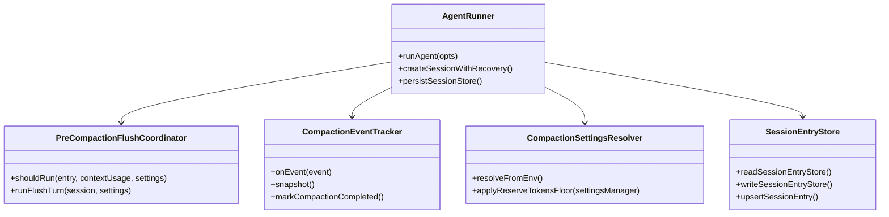
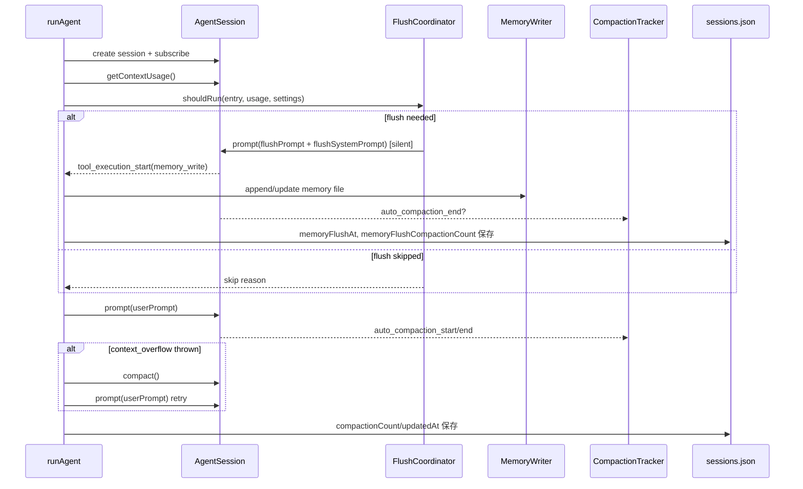

# Pre-Compaction Memory Flush と Context Compaction 組み込み計画

## 1. 概要と目的 Overview and Purpose

- What
  `adjutant` の `runAgent` に、`vendor/openclaw` 相当の「コンテキスト圧縮前メモリフラッシュ」と「圧縮イベント連動の実行制御」を追加する。
  具体的には、コンテキスト逼迫時に `MEMORY.md` / `memory/YYYY-MM-DD.md` へ先行書き出しを行い、その後の compaction を前提に安定動作させる。

- Why
  現状は `context_overflow` 検知時に `shrinkPrompt` で入力を切り詰めるのみで、圧縮直前の durable memory 退避がない。
  このままだと重要な文脈が compaction 前に永続化されず取りこぼすリスクがあり、長時間運用で回答品質が劣化する。

- How
  `agent-runner` に pre-compaction flush 判定・実行層を追加し、Pi SDK (`@mariozechner/pi-coding-agent`) の `getContextUsage()` / `auto_compaction_*` イベント / `compact()` を利用して compaction ライフサイクルを制御する。
  セッションメタデータに compaction 回数と flush 実績を保存し、「1 compaction cycle 1 flush」を保証する。

## 2. 仕様と受け入れ条件 Specification and Acceptance Criteria

### 2.1 スコープ Scope

- 今回やること
  - pre-compaction memory flush 判定ロジックの追加
  - flush 実行用の内部プロンプト（silent turn）導入
  - `sessions.json` へ compaction/flush メタデータ保存
  - compaction イベントを監視した `runAgent` の再試行制御改善
  - 既存 `shrinkPrompt` ベースの overflow 回復戦略を compaction 優先へ置換
  - 設定値（環境変数）と既定値の追加

- 成果物
  - `src/assistant/agent-runner.ts`（主変更）
  - `src/assistant/session-entry-store.ts`（メタデータ型拡張）
  - `src/assistant/*`（flush/compaction 補助モジュールの新設）
  - `tests/assistant/agent-runner*.test.ts`（Red/Green の追加）
  - `doc/slack-proactive.md`, `doc/spec-unified.md`（仕様同期）

- 制約
  - プロトタイプ優先で後方互換は最小限
  - `main`/`spoke` の memory 権限分離は維持
  - 既存 Slack 通知パイプライン契約（Fast Path/Slow Path）を壊さない

### 2.2 非スコープ Non Scope

- `vendor/openclaw` と完全同一の Gateway hooks 実装（`before_compaction` 等）
- QMD 連携や memory backend 置換
- セッション pruning の新規導入
- UI への compaction 進捗表示追加

### 2.3 ユースケース Use Cases

- 正常系1
  main セッションの context 使用量が閾値を超えたとき、通常プロンプト実行前に silent flush turn が走り、必要な内容が `memory/YYYY-MM-DD.md` または `MEMORY.md` に書き込まれる。

- 正常系2
  同じ compaction cycle で連続して `runAgent` が呼ばれても flush は1回のみ実行される。

- 正常系3
  overflow 発生時は compaction を優先した回復を行い、入力切り詰めなしで元プロンプト再試行が行われる。

- 異常系1
  flush turn が失敗しても本来のユーザー処理は継続し、warning ログのみ残す。

- 異常系2
  workspace が実質 read-only の場合は flush をスキップし、compaction 処理のみ継続する。

### 2.4 受け入れ条件 Acceptance Criteria

- Given main セッションで context 使用量が `threshold = contextWindow - reserveTokensFloor - softThresholdTokens` を超える
  When `runAgent` を実行する
  Then 通常プロンプト前に flush turn が1回実行される

- Given `sessions.json` の `memoryFlushCompactionCount` が現在 `compactionCount` と一致している
  When 次の `runAgent` が同 cycle 内で実行される
  Then flush は再実行されない

- Given `auto_compaction_end` イベントが `aborted=false` かつ `result` ありで到達する
  When セッションを保存する
  Then `compactionCount` が加算される

- Given `context_overflow` エラーが発生する
  When 回復処理を実行する
  Then `shrinkPrompt` ではなく compaction 優先の再試行経路が使われる

- Given spoke セッションで `runAgent` を実行する
  When pre-compaction flush 判定を行う
  Then `MEMORY.md` / `memory/*.md` への書き込み処理は走らない

- Given flush 実行中
  When 内部処理が完了する
  Then flush の中間出力はユーザー向け応答へ混入しない

### 2.5 既知の制約 Known Limitations

- `getContextUsage().tokens` は compaction 直後に `null` になり得るため、判定スキップが発生する
- flush プロンプト品質はモデル依存で、memory_write 呼び出し率に揺らぎがある
- Pi SDK 側の auto-compaction 挙動変更に追従が必要（SDK更新時の回帰リスク）

## 3. 前提技術スタック Context and Tech Stack

- Language Framework
  TypeScript 5.x / Node.js ESM

- Libraries
  `@mariozechner/pi-coding-agent`（`AgentSession.getContextUsage`, `compact`, `auto_compaction_*` event）

- Style Guide
  既存 ESLint / Prettier / tsconfig に準拠

- Runtime Deployment
  `pnpm run assistant` 単一ランタイム

- Testing
  Node built-in test runner (`node --test` with `tsx`)

## 4. インターフェース契約 Interface Contracts

### 4.1 公開APIまたは外部 I/O 一覧

- Env Config（新規）
  - `ADJUTANT_COMPACTION_ENABLED`（default: `true`）
  - `ADJUTANT_COMPACTION_RESERVE_TOKENS_FLOOR`（default: `20000`）
  - `ADJUTANT_MEMORY_FLUSH_ENABLED`（default: `true`）
  - `ADJUTANT_MEMORY_FLUSH_SOFT_THRESHOLD_TOKENS`（default: `4000`）
  - `ADJUTANT_MEMORY_FLUSH_PROMPT`（default: openclaw相当の pre-compaction prompt）
  - `ADJUTANT_MEMORY_FLUSH_SYSTEM_PROMPT`（default: openclaw相当の system prompt）

- Session metadata (`sessions.json`)
  - `compactionCount?: number`
  - `memoryFlushAt?: string`（ISO8601）
  - `memoryFlushCompactionCount?: number`
  - `contextTokens?: number | null`（任意保存）
  - `contextWindowTokens?: number | null`（任意保存）

- Runtime Event handling
  - input: Pi SDK `AgentSessionEvent`
  - monitored types: `auto_compaction_start`, `auto_compaction_end`, `tool_execution_start`, `tool_execution_end`

### 4.2 データモデルとスキーマ

- `PreCompactionFlushSettings`
  - `enabled: boolean`
  - `softThresholdTokens: number`
  - `reserveTokensFloor: number`
  - `prompt: string`
  - `systemPrompt: string`

- `CompactionRuntimeState`
  - `compactionCountAtStart: number`
  - `didCompactionComplete: boolean`
  - `compactionReason?: "threshold" | "overflow"`
  - `flushTriggered: boolean`

- `SessionEntryRecord` 拡張
  - 既存 `updatedAt` を維持しつつ上記 compaction/flush フィールドを追加

### 4.3 エラーと例外 Error Handling

- エラー分類
  - `memory_flush_skipped`（閾値未達・read-only・spoke）
  - `memory_flush_failed`（flush turn 失敗）
  - `compaction_recovery_failed`（overflow 回復失敗）
  - `context_overflow`（最終的に解消不可）

- リトライ方針
  - flush turn: 失敗時リトライなし（本処理優先）
  - overflow 回復: compaction 経路で最大1回再試行
  - transient: 既存 2.5秒待機 + 1回再試行を維持

- タイムアウト方針
  - flush turn は通常 turn と同一 SDK タイムアウトに従う
  - flush による遅延が上限を超える場合は warning してスキップ可能にする（実装で上限導入）

- ログ方針と個人情報
  - flush/compaction 監査ログは本文を記録しない
  - 記録対象は `sessionKey`, `runId`, `tokens`, `threshold`, `outcome`, `durationMs`, `reason`

### 4.4 代表的な例 Examples

```text
ADJUTANT_MEMORY_FLUSH_ENABLED=true
ADJUTANT_MEMORY_FLUSH_SOFT_THRESHOLD_TOKENS=4000
ADJUTANT_COMPACTION_RESERVE_TOKENS_FLOOR=20000
```

```json
{
  "main": {
    "sessionId": "s-main",
    "updatedAt": "2026-02-21T12:00:00.000Z",
    "compactionCount": 3,
    "memoryFlushAt": "2026-02-21T11:59:10.000Z",
    "memoryFlushCompactionCount": 3
  }
}
```

```text
[AgentRunner][Compaction] pre-flush skipped session=main reason=below-threshold tokens=152000 threshold=176000
```

## 5. アーキテクチャと設計図 Architecture and Diagrams

### 5.1 図の選択方針

- `agent-runner` から複数責務（flush判定、event追跡、store更新）へ分離するためクラス図を採用
- flush → prompt → auto-compaction の時系列差分が重要なためシーケンス図を追加

### 5.2 クラス図 Class Diagram



### 5.3 その他の図 Optional



## 6. テスト戦略 Test Strategy

### 6.1 テストの種類

- Unit
  - flush 閾値判定（threshold 算出、tokens null、cycle重複）
  - env 設定の正規化と default 適用
  - compaction event から metadata を算出する追跡ロジック

- Integration
  - `runAgent` で flush 実行→memory_write 書き込み→本prompt継続
  - `auto_compaction_end` 発火時の `compactionCount` 永続化
  - overflow で compaction recovery を通る経路

- Contract
  - `sessions.json` への追記フィールド形状固定
  - flush 中間出力が `AgentRunResult.text` に混入しないこと
  - spoke で flush 無効であること

### 6.2 カバレッジ対象

- 重要ロジック
  - soft threshold 判定
  - 1 cycle 1 flush ガード
  - compaction 優先リカバリ

- エラー分岐
  - flush 失敗時の継続
  - compact() 失敗時の最終エラー
  - sessions.json 書き込み失敗時の警告

- 境界条件
  - tokens/contextWindow が `null`
  - `reserveTokensFloor` が contextWindow 以上
  - heartbeat 実行時の flush skip

## 7. 実装タスクリスト Implementation Plan

### Phase 1 設計と準備

- [x] 要件と仕様の確定（openclaw同等範囲の確定、受け入れ条件凍結）
- [x] インターフェース契約の確定（環境変数、sessions.json拡張項目）
- [x] Mermaid図の作成 更新（本ファイル）
- [x] インターフェース 型定義の作成（flush settings / tracker state）
- [x] テスト基盤確認（`tests/assistant/agent-runner` 拡張方針）

### Phase 2 Pre-Compaction Memory Flush 実装

- [x] Test Red: 閾値超過時のみ flush 実行されるテスト
- [x] Impl Green: `PreCompactionFlushCoordinator` 追加と `runAgent` 組み込み
- [x] Refactor: flush 判定・実行・ログ責務を分離
- [x] Integration: memory_write 実行と flush 中間出力非表示の結合テスト
- [x] Docs: `doc/slack-proactive.md` に flush 契約を追記

### Phase 3 Context Compaction 処理強化

- [x] Test Red: `auto_compaction_end` で `compactionCount` が更新されるテスト
- [x] Impl Green: compaction event tracker + session metadata 永続化
- [x] Refactor: `promptWithRetry` の overflow回復を compaction 優先へ置換
- [x] Integration: overflow -> compact -> retry 成功の結合テスト
- [x] Docs: `doc/spec-unified.md` の compaction/metadata 節更新

### Phase 4 統合と検証

- [x] 全体テストの実行（`pnpm run check`）
- [x] エッジケースの動作確認（tokens null/read-only/spoke）
- [x] ログと例外の確認（本文非出力、理由のみ）
- [x] ドキュメント更新（env一覧、運用注意、既知制約）

## 8. 完了の定義 Definition of Done

### 8.1 機能DoD Functional DoD

- [x] pre-compaction memory flush が main セッションで動作する
- [x] 1 compaction cycle あたり flush は最大1回である
- [x] context_overflow 回復で compaction 優先経路が使われる
- [x] spoke/heartbeat/read-only 条件で flush が正しく抑止される

### 8.2 品質DoD Quality DoD

- [x] 追加テストがすべてパス
- [x] `pnpm run check` が成功
- [x] ログにメモ本文やユーザー本文が露出しない
- [x] 仕様書（`doc/slack-proactive.md`, `doc/spec-unified.md`）と実装が同期している

## 9. 懸念事項と未確定事項 Concerns and Questions

- `memory_write` の実行責務が現在は event購読側にあるため、flush 導入時に副作用境界が曖昧になりやすい（tool execute 側への移管可否を要判断）。
- Pi SDK の auto-compaction が既に回復を行うため、`runAgent` 側の追加回復と二重化しないよう条件整理が必要。
- `reserveTokensFloor` の既定値（`20000`）は小コンテキストモデルでは閾値計算を圧迫する可能性があるため、モデル別 override を将来検討する。
- flush prompt の文面はモデル依存で出力ぶれがある。運用開始後に監査ログを見て prompt tuning が必要。
