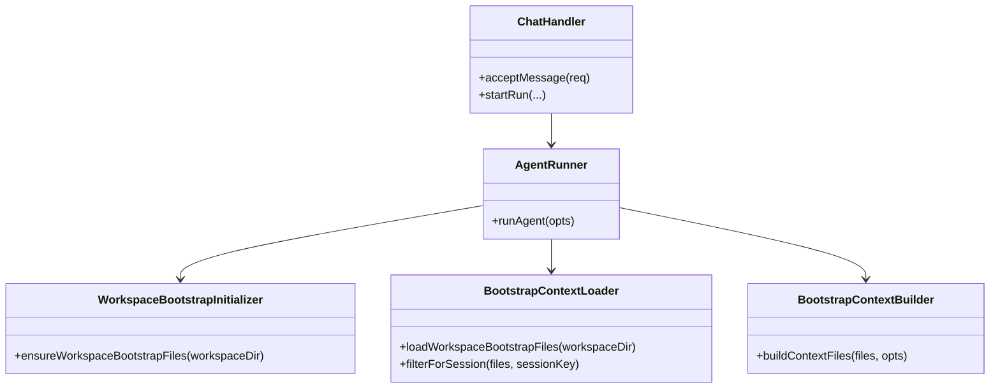
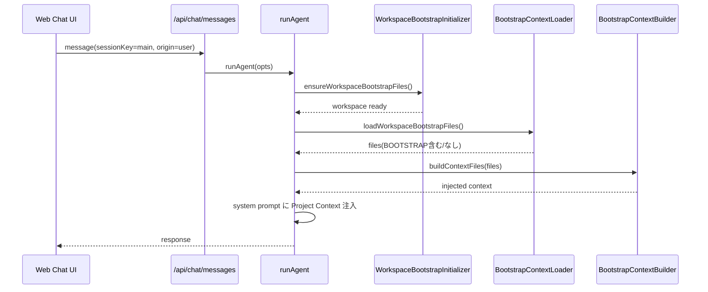

# 初回実行リチュアル（openclaw準拠BOOTSTRAP注入）組み込み計画

## 1. 概要と目的 Overview and Purpose

- What
  `vendor/openclaw` の BOOTSTRAP 運用に寄せて、`adjutant` のエージェント実行時に workspace ファイル群を prompt context として注入する。  
  UI は新設せず、既存の Web Chat UI をそのまま利用する。

- Why
  `openclaw` では `BOOTSTRAP.md` を「初回だけ特別判定」ではなく、**ファイルが存在する間は毎ターン注入**し、対話完了時にエージェントが自律的に削除する前提で設計されている。  
  `adjutant` でも同じ前提に寄せることで、挙動を単純化し、運用時の再開・再試行を自然に扱える。

- How
  `runAgent` 実行前に openclaw 同等の workspace 初期化を行い、workspace が無ければ作成する。  
  `AGENTS.md` / `SOUL.md` / `TOOLS.md` / `IDENTITY.md` / `USER.md` / `HEARTBEAT.md` は「無ければ作成」、`BOOTSTRAP.md` は brand-new workspace のときのみ作成する。
  `runAgent` 実行時に openclaw 同等のファイルローダーを走らせ、`AGENTS.md` / `SOUL.md` / `TOOLS.md` / `IDENTITY.md` / `USER.md` / `HEARTBEAT.md` / `BOOTSTRAP.md`（+ 任意で `MEMORY.md` / `memory.md`）を context として system prompt に注入する。  
  `BOOTSTRAP.md` が存在する限り毎ターン注入し、削除されたら自動的に非注入へ遷移する。one-shot 状態は `sessions.json` では持たない。

## 2. 仕様と受け入れ条件 Specification and Acceptance Criteria

### 2.1 スコープ Scope

- 今回やること
  - openclaw準拠の workspace 自動初期化（存在しない場合の作成）
  - openclaw準拠の bootstrap テンプレート配置（missing のみ作成）
  - openclaw準拠の workspace bootstrap file ローダー実装
  - openclaw準拠の context file 生成（欠損表現・文字数トリミング）
  - `runAgent` への prompt 注入統合（Web Chat 実行経路）
  - `BOOTSTRAP.md` が残っている間の継続注入
  - `origin=pipeline` / heartbeat / spoke 除外の維持（adjutant 独自要件）
  - 関連ドキュメント更新

- 成果物
  - `src/assistant/agent-runner.ts`
  - `src/assistant/chat-handler.ts`
  - `src/assistant/api-types.ts`（`origin` 導入時）
  - `src/assistant/workspace-bootstrap.ts`（新規）
  - `src/assistant/bootstrap-context.ts`（新規）
  - `assistant/prompts/TOOLS.md`（新規）
  - `assistant/prompts/IDENTITY.md`（新規）
  - `assistant/prompts/BOOTSTRAP.md`（新規、openclaw template 準拠）
  - `tests/assistant/*` / `tests/proactive/*` の関連テスト
  - `doc/slack-proactive.md` / `doc/spec-unified.md` の契約更新

- 制約
  - ウィザードUIは追加しない
  - 実行面は既存 Web Chat UI と API をそのまま使う
  - 既存 Fast Path / Slow Path / memory flush 導線を壊さない

### 2.2 非スコープ Non Scope

- 今回やらないこと
  - フォーム型オンボーディングUI
  - openclaw hook（`agent:bootstrap`）互換
  - bootstrap 完了フラグの DB 永続化
  - `bootstrap_profile_upsert` 等の専用ツール新設

- 将来検討だが今回除外すること
  - bootstrap ファイルの多言語切替
  - Control UI 相当の bootstrap pending 表示

### 2.3 ユースケース Use Cases

- 正常系0
  workspace が未作成の状態で初回実行すると、workspace ディレクトリが自動作成され、初期テンプレート群が投入される。

- 正常系1
  `<workspaceDir>/BOOTSTRAP.md` が存在している状態で Web Chat から main 会話を開始すると、`BOOTSTRAP.md` を含む workspace context が prompt に注入される。

- 正常系2
  エージェントは `BOOTSTRAP.md` の指示に従って対話し、`IDENTITY.md` / `USER.md` / `SOUL.md` を更新し、最後に `BOOTSTRAP.md` を削除する。

- 正常系3
  `BOOTSTRAP.md` が残っている間は次ターン以降も注入され、削除されたターン以降は注入されない。

- 異常系1
  ファイル読込エラー時は該当ファイルのみ missing 扱い（または空扱い）にして継続し、ラン全体は失敗させない。

- 異常系2
  `origin=pipeline` / `isHeartbeat=true` / `memoryScope=spoke` では bootstrap 注入を行わない。

### 2.4 受け入れ条件 Acceptance Criteria

- Given `sessionKey=main` かつ `origin=user` かつ `BOOTSTRAP.md` が存在
  When `runAgent` を実行する
  Then prompt の Project Context に `BOOTSTRAP.md` が含まれる

- Given `workspaceDir` が存在しない
  When 初回の `runAgent` を実行する
  Then workspace が作成され、`AGENTS.md` / `SOUL.md` / `TOOLS.md` / `IDENTITY.md` / `USER.md` / `HEARTBEAT.md` が配置される

- Given brand-new workspace（上記主要ファイルが全て未存在）
  When workspace 初期化を実行する
  Then `BOOTSTRAP.md` も配置される

- Given 1ターン目の後も `BOOTSTRAP.md` が存在
  When 2ターン目を実行する
  Then 再度 `BOOTSTRAP.md` が注入される

- Given `BOOTSTRAP.md` が削除済み
  When 次ターンを実行する
  Then `BOOTSTRAP.md` は注入されない

- Given `origin=pipeline` または `isHeartbeat=true` または `memoryScope=spoke`
  When `runAgent` を実行する
  Then workspace bootstrap context は注入されない

- Given context file が上限文字数を超える
  When context を組み立てる
  Then openclaw同等のヘッド/テール保持でトリミングし、警告ログを残す

### 2.5 既知の制約 Known Limitations

- `BOOTSTRAP.md` 削除をモデル挙動に依存するため、残存時は意図的に再注入される。
- prompt へのファイル注入量が増えるため、巨大ファイル時はトリミングに依存する。
- openclaw の hook 拡張は未導入のため、完全互換ではない。

## 3. 前提技術スタック Context and Tech Stack

- Language Framework
  TypeScript 5.x / Node.js ESM

- Libraries
  `@mariozechner/pi-coding-agent`

- Style Guide
  既存 ESLint / Prettier / tsconfig に準拠

- Runtime Deployment
  `pnpm run assistant` 単一ランタイム

- Testing
  Node built-in test runner（`node --import tsx --test`）

## 4. インターフェース契約 Interface Contracts

### 4.1 公開APIまたは外部 I/O 一覧

- HTTP API
  - `POST /api/chat/messages` に `origin?: "user" | "pipeline" | "system"` を追加（未指定は `user`）

- ファイルI/O（read）
  - `<workspaceDir>/AGENTS.md`
  - `<workspaceDir>/SOUL.md`
  - `<workspaceDir>/TOOLS.md`
  - `<workspaceDir>/IDENTITY.md`
  - `<workspaceDir>/USER.md`
  - `<workspaceDir>/HEARTBEAT.md`
  - `<workspaceDir>/BOOTSTRAP.md`
  - `<workspaceDir>/MEMORY.md`（存在時）
  - `<workspaceDir>/memory.md`（存在時・重複は実体パスで除外）

- ファイルI/O（write, 初期化時）
  - `<workspaceDir>/`（mkdir）
  - `<workspaceDir>/AGENTS.md`
  - `<workspaceDir>/SOUL.md`
  - `<workspaceDir>/TOOLS.md`
  - `<workspaceDir>/IDENTITY.md`
  - `<workspaceDir>/USER.md`
  - `<workspaceDir>/HEARTBEAT.md`
  - `<workspaceDir>/BOOTSTRAP.md`（brand-new 時のみ）

### 4.2 データモデルとスキーマ

- `WorkspaceBootstrapFile`
  - `name: string`
  - `path: string`
  - `content?: string`
  - `missing: boolean`

- `EmbeddedContextFile`
  - `path: string`
  - `content: string`

- `BootstrapContextOptions`
  - `maxCharsPerFile: number`（既定 `20000`）
  - `headRatio: number`（`0.7`）
  - `tailRatio: number`（`0.2`）

- `WorkspaceInitDecision`
  - `createdWorkspace: boolean`
  - `isBrandNewWorkspace: boolean`
  - `createdFiles: string[]`

### 4.3 エラーと例外 Error Handling

- エラー分類
  - `bootstrap_context_read_error`
  - `bootstrap_context_truncated`
  - `bootstrap_context_skipped`

- リトライ方針
  - bootstrap 読込の自動リトライなし（次ターンで再評価）

- ログ方針
  - ファイル本文はログ出力しない
  - `sessionKey`, `origin`, `fileName`, `decision`, `truncated` のみ出力

### 4.4 代表的な例 Examples

```json
{
  "message": "こんにちは",
  "sessionKey": "main",
  "idempotencyKey": "cli-001",
  "origin": "user"
}
```

```json
{
  "path": "BOOTSTRAP.md",
  "content": "# BOOTSTRAP.md - Hello, World\n..."
}
```

## 5. アーキテクチャと設計図 Architecture and Diagrams

### 5.1 図の選択方針

- openclaw 同様に「ファイル収集」と「context 生成」を分離するためクラス図を採用
- openclaw 同様に「workspace 初期化」「ファイル収集」「context 生成」を分離する
- 毎ターン注入と削除後の自然停止を示すためシーケンス図を採用

### 5.2 クラス図 Class Diagram



### 5.3 その他の図 Optional



## 6. テスト戦略 Test Strategy

### 6.1 テストの種類

- Unit
  - workspace 初期化（未作成時の mkdir、missing ファイル作成）
  - brand-new 判定時のみ `BOOTSTRAP.md` を作成
  - bootstrap file 一覧読込（存在/欠損）
  - セッションフィルタ（main/spoke）
  - 20k超のトリミング（head/tail/marker）

- Integration
  - `BOOTSTRAP.md` 存在時に毎ターン注入される
  - `BOOTSTRAP.md` 削除後に非注入へ遷移
  - `origin=pipeline` / heartbeat / spoke の非注入

- Contract
  - `origin` 未指定時は `user` 互換
  - 既存 Slack pipeline との互換

### 6.2 カバレッジ対象

- 重要ロジック
  - workspace 作成と初期テンプレート投入
  - context file ロード順と注入
  - BOOTSTRAP存在時の継続注入

- エラー分岐
  - read failure
  - truncate warning

- 境界条件
  - 空ファイル
  - 欠損ファイル
  - 巨大ファイル

## 7. 実装タスクリスト Implementation Plan

### Phase 1 設計と準備

- [x] 要件と仕様の確定（openclaw準拠の注入方式、除外条件）
- [x] インターフェース契約の確定（`origin`, context file 契約）
- [x] Mermaid図の更新（本計画書）
- [x] 型定義の作成（`WorkspaceBootstrapFile`, `EmbeddedContextFile`）
- [x] テスト追加方針の確定（`tests/assistant/agent-runner.test.ts` ほか）

### Phase 2 openclaw準拠ローダー実装

- [x] Test Red: workspace 未存在時の自動作成失敗テスト
- [x] Impl Green: `workspace-bootstrap.ts` 実装（mkdir + missing テンプレート投入）
- [x] Integration: brand-new 判定時のみ `BOOTSTRAP.md` 作成されるテスト
- [x] Test Red: workspace bootstrap file 一覧読込の失敗テスト
- [x] Impl Green: `bootstrap-context.ts` 実装（読込 + セッションフィルタ）
- [x] Refactor: ファイル列挙とトリミング処理の分離
- [x] Integration: `BOOTSTRAP.md` を含む context 生成テスト
- [x] Docs: `doc/slack-proactive.md` に起動条件を追記

### Phase 3 runAgent統合

- [x] Test Red: main/user で Project Context 注入される失敗テスト
- [x] Impl Green: `agent-runner.ts` に context 注入統合
- [x] Refactor: prompt 合成責務の整理
- [x] Integration: 削除前は毎ターン注入、削除後は非注入
- [x] Docs: `doc/spec-unified.md` に注入契約追記

### Phase 4 統合と検証

- [x] 全体テスト実行（`pnpm run check`）
- [x] 手動検証（Web Chat で BOOTSTRAP 対話開始 → 削除完了）
- [x] ログ検証（本文非出力、メタのみ）
- [x] ドキュメント同期

## 8. 完了の定義 Definition of Done

### 8.1 機能DoD Functional DoD

- [x] `BOOTSTRAP.md` 存在時に main/user の実行で注入される
- [x] workspace 未作成でも初回実行で自動作成される
- [x] `BOOTSTRAP.md` が残る限り継続注入される
- [x] `BOOTSTRAP.md` 削除後は自動的に非注入となる
- [x] `origin=pipeline` / heartbeat / spoke では注入されない

### 8.2 品質DoD Quality DoD

- [x] 追加テストがすべてパス
- [x] `pnpm run check` が成功
- [x] 本文ログを出さない
- [x] `doc/slack-proactive.md` / `doc/spec-unified.md` と実装が同期

## 9. 懸念事項と未確定事項 Concerns and Questions

- `adjutant` には openclaw の hook 拡張がないため、将来拡張時の注入前加工ポイントをどこに置くかは未確定。
- `origin` が未導入のまま実装を進める場合、Slack通知経路まで BOOTSTRAP 注入されるリスクがある。
- `BOOTSTRAP.md` の削除失敗時は継続注入となるため、運用上の手動介入手順を README へ明記する必要がある。
