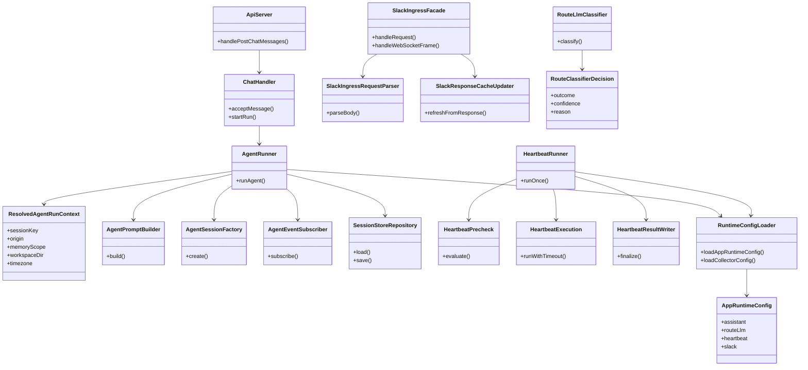
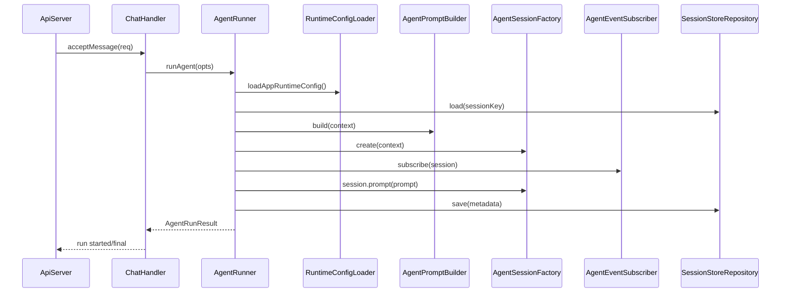

# Core Principles準拠リファクタリング計画（SOLID/KISS/YAGNI/DRY）

## 1. 概要と目的 Overview and Purpose

- What
  現行コードの責務集中・重複・設定散在を解消するため、`assistant` / `proactive` / `slack` の中核モジュールを段階的に分割し、依存方向と契約を明確化する。

- Why
  現在は `agent-runner` / `heartbeat-runner` / `slackIngressHandlers` に責務が集中しており、仕様追加時に回帰リスクが高い。  
  Core Principles（Prototype First, SOLID, KISS, YAGNI, DRY）に合わせて構造を最適化し、以降の機能追加（軽量LLM判定、memory機能拡張、bootstrap運用）を安全に進める。

- How
  P0→P1→P2 の順で、巨大モジュール分割、環境変数設定の統合、判定I/Fの堅牢化、重複ユーティリティ統合を行う。  
  既存HTTP API契約は維持しつつ、内部モジュール契約を再設計する。TDDで差分を固定してから実装する。

## 2. 仕様と受け入れ条件 Specification and Acceptance Criteria

### 2.1 スコープ Scope

- 今回やること
  - `src/assistant/agent-runner.ts` の責務分割（session生成、prompt構築、event購読、永続化）
  - `src/assistant/heartbeat-runner.ts` の責務分割（precheck、prompt組立、実行、結果保存）
  - `src/slack/slackIngressHandlers.ts` の責務分割（request解析、ws正規化、response由来cache更新）
  - `process.env` 参照・parseロジックの共通化（`src/runtime`配下へ集約）
  - route LLM一次判定の出力契約を「JSON文字列パース前提」から「構造化契約前提」へ移行可能な境界に変更
  - 重複ユーティリティ（`asRecord`, bool/int parser, path/timezone解決）の統合
  - 未使用データ（YAGNI対象）の削除

- 成果物
  - `src/assistant/*` の新規分割モジュール
  - `src/slack/*` の新規分割モジュール
  - `src/proactive/route-llm-classifier.ts` 周辺の契約更新
  - `src/runtime/*` の設定読込モジュール
  - 既存テスト更新 + 新規テスト追加（unit/integration/contract）
  - 本計画ファイルと関連仕様書の更新

- 制約
  - Prototype Firstとして内部構造は最適化優先（互換レイヤは最小限）
  - 既存CI（`pnpm check`）を必ず通す
  - 外部公開API（`/api/chat/*`, `/api/heartbeat/*`）は維持する

### 2.2 非スコープ Non Scope

- 今回やらないこと
  - UIデザイン改修
  - 新規永続ストレージ導入（DB種別追加）
  - Slackイベント仕様拡張（新イベント種の追加）
  - 大規模な命名変更（ディレクトリ丸ごと移動など）

- 将来検討だが今回除外すること
  - Observability基盤（OpenTelemetry等）の導入
  - 権限境界を伴う複数ワークスペース完全分離
  - LLMプロバイダ複数対応の本格抽象化

### 2.3 ユースケース Use Cases

- 正常系1
  `POST /api/chat/messages` で開始した run が従来どおり streaming 完了し、内部では分割済みモジュールが連携する。

- 正常系2
  Heartbeat実行時、precheckでskip判定された場合はLLM呼び出しせず従来どおり `skipped` を返す。

- 正常系3
  Slack ingressでpost/reaction/notificationを受信した際、正規化結果は変更前と同じ契約でpipelineに渡る。

- 異常系1
  route LLM一次判定で不正出力を受けても、契約境界でfallbackしてprimary判定へ戻る。

- 異常系2
  環境変数の不正値（timeoutやbool）が来ても、共通parserで既定値にフォールバックし起動継続する。

### 2.4 受け入れ条件 Acceptance Criteria

- Given 既存のchat APIクライアント
  When リファクタリング後に `POST /api/chat/messages` とSSE streamを実行する
  Then run lifecycle（started/final/error/aborted）の挙動とレスポンス契約が維持される

- Given heartbeatがquiet-hours条件に該当
  When `runOnce` を実行する
  Then LLM呼び出しなしで `status=skipped, reason=quiet-hours` となる

- Given Slackのpost/reaction/notificationイベント
  When ingress処理を通す
  Then `NormalizedEvent` の契約互換が保たれる

- Given route LLM一次判定がタイムアウトまたは契約外出力
  When trigger filterが判定する
  Then primary判定へフォールバックし、warn監査ログが残る

- Given 環境変数の数値/真偽値が不正
  When 設定解決を行う
  Then 共通設定モジュールが既定値へ正規化する

- Given 分割後コード
  When `pnpm check` を実行する
  Then format/typecheck/test がすべて成功する

### 2.5 既知の制約 Known Limitations

- 構造化を優先するため、短期的にはファイル数が増加する。
- 一部内部関数は移動に伴い import path が変更される（外部APIは維持）。
- route LLMの「専用ツール出力方式」本実装は次段で行い、本計画では移行しやすい境界整備までを含む。

## 3. 前提技術スタック Context and Tech Stack

- Language Framework
  TypeScript 5.x / Node.js ESM

- Libraries
  `@mariozechner/pi-coding-agent`, `openai`, `node:sqlite`（既存）

- Style Guide
  既存 ESLint / Prettier / tsconfig を遵守

- Runtime Deployment
  `pnpm start`（collector）, `pnpm run assistant`（assistant gateway）

- Testing
  Node built-in test runner + tsx（既存 `tests/` 構成に準拠）

## 4. インターフェース契約 Interface Contracts

### 4.1 公開APIまたは外部I/O一覧

- HTTP API（維持）
  - `POST /api/chat/messages`
  - `POST /api/chat/abort`
  - `GET /api/chat/runs/:runId/stream`
  - `POST /api/heartbeat/run`
  - `GET /api/events/stream`

- 内部公開契約（新設）
  - `AgentSessionFactory.create(...)`
  - `AgentPromptBuilder.build(...)`
  - `AgentEventSubscriber.subscribe(...)`
  - `SessionStoreRepository.load/save(...)`
  - `HeartbeatPrecheck.evaluate(...)`
  - `HeartbeatExecution.runWithTimeout(...)`
  - `HeartbeatResultWriter.finalize(...)`
  - `SlackIngressRequestParser.parse(...)`

- 設定I/O
  - 既存 `ADJUTANT_*`, `OPENAI_API_KEY` を `runtime env module` で一元解決

### 4.2 データモデルとスキーマ

- `AgentRunOptions` / `AgentRunResult`
  - 外部契約は維持
  - 内部で `ResolvedAgentRunContext` を新設し、`sessionKey/workspace/timezone/origin/memoryScope` を正規化

- `RouteClassifierDecision`（新設）
  - `outcome: "run" | "pending"`
  - `confidence?: number`
  - `reason?: string`
  - 文字列JSONを直接扱う層を classifier module の内部へ閉じ込める

- `AppRuntimeConfig`（新設）
  - env由来設定を型付きで保持
  - bool/int/stringのparserを共通化

### 4.3 エラーと例外 Error Handling

- エラー分類
  - `validation_error`
  - `transient_error`
  - `context_overflow`
  - `integration_error`（Slack/CDP/OpenAI）
  - `contract_error`（二次分類器の契約外出力）

- リトライ方針
  - 既存方針維持（transient時のみ最小回数）
  - classifierはtimeout/error時にprimaryへfallback

- タイムアウト方針
  - 既存の `ADJUTANT_ROUTE_LLM_TIMEOUT_MS` / heartbeat timeoutを維持
  - 不正値は共通parserで既定値化

- ログ方針と個人情報
  - 本文全文ログを禁止
  - runId/sessionKey/error category/decision metadataのみ出力
  - debugログでpayloadを出す場合も既存redactionルールに従う

### 4.4 代表的な例 Examples

```ts
// 新しい内部契約（例）
const context = resolveAgentRunContext(opts, runtimeConfig);
const prompt = agentPromptBuilder.build(context);
const session = await agentSessionFactory.create(context);
```

```json
{
  "classifierResult": {
    "outcome": "pending",
    "confidence": 0.82,
    "reason": "fyi-notification"
  }
}
```

```ts
// 共通env parser（例）
const cfg = loadAssistantRuntimeConfig(process.env);
// cfg.routeLlm.timeoutMs は常に正の整数
```

## 5. アーキテクチャと設計図 Architecture and Diagrams

### 5.1 図の選択方針

- 複数モジュール（assistant/proactive/slack/runtime）を跨ぐためクラス図を必須
- 非同期run処理の境界を明確化するためシーケンス図を追加

### 5.2 クラス図 Class Diagram



### 5.3 その他の図 Optional



## 6. テスト戦略 Test Strategy

### 6.1 テストの種類

- Unit
  - `AgentPromptBuilder`, `AgentSessionFactory`, `HeartbeatPrecheck`, `RuntimeConfigLoader` の単体テスト
  - classifier契約正規化（正常/不正/timeout）

- Integration
  - chat run end-to-end（api-server→chat-handler→agent-runner）
  - heartbeat run end-to-end（precheck/skip含む）
  - slack ingress end-to-end（request/ws/response）

- Contract
  - HTTPレスポンス契約固定
  - `NormalizedEvent` 形状固定
  - route判定のfallback契約固定

### 6.2 テスト基盤確認結果

- 既存helper再利用
  - `tests/assistant/chat-handler-test-helpers.ts` を chat/api-server 系で継続利用
  - reset 系 helper（queue/stream/system events）を流用し、Phase 2 以降の分割テストでも再利用

- fixture整理方針
  - 現時点は `tests/fixtures/` を現状維持（新規fixture導入は Red テストで必要になった時のみ）
  - `mkdtemp` 利用の一時workspace生成を優先し、固定fixture肥大化を避ける

- 追加で固定した契約テスト
  - `tests/proactive/route-classifier-decision.test.ts` を追加し、`RouteClassifierDecision` の正規化契約を固定

### 6.3 カバレッジ対象

- 重要ロジック
  - run lifecycle
  - session store更新
  - route判定fallback
  - queue/buffer flush

- エラー分岐
  - classifier timeout/error
  - malformed payload
  - env不正値

- 境界条件
  - empty input
  - long prompt/context
  - duplicate/abort

## 7. 実装タスクリスト Implementation Plan

### Phase 1 設計と準備

- [x] 要件と仕様の確定（本計画の合意、優先度P0/P1/P2の確定）
- [x] インターフェース契約の確定（新規内部I/Fと保持する外部契約の凍結）
- [x] Mermaid図の作成 更新（本ファイル）
- [x] インターフェース 型定義の作成（`ResolvedAgentRunContext`, `AppRuntimeConfig`, `RouteClassifierDecision`）
- [x] テスト基盤の確認（既存helper再利用、必要ならfixture整理）

### Phase 2 `agent-runner` / `heartbeat-runner` 分割（P0）

- [x] Test `agent-runner` 分割前提の失敗テストを追加 Red
- [x] Impl `AgentPromptBuilder` / `AgentSessionFactory` / `AgentEventSubscriber` / `SessionStoreRepository` の最小実装 Green
- [x] Refactor `runAgent` 本体を orchestration のみに縮小（目標 300行以下）
- [x] Integration chat run の既存e2eを更新し回帰防止
- [x] Docs 契約変更点（内部）を計画書へ反映

- [x] Test `heartbeat-runner` precheck/execution分離の失敗テストを追加 Red
- [x] Impl `HeartbeatPrecheck` / `HeartbeatExecution` / `HeartbeatResultWriter` の最小実装 Green
- [x] Refactor `runOnce` の責務を分離（判定と副作用の分割）
- [x] Integration heartbeat e2e と重複通知抑止テストを更新
- [x] Docs 契約・図の更新

### Phase 3 `slackIngressHandlers` 分割 + 設定集約（P0/P1）

- [ ] Test request/ws/response 処理の契約固定テストを追加 Red
- [ ] Impl `SlackIngressRequestParser` / `SlackWsNormalizer` / `SlackResponseCacheUpdater` を追加 Green
- [ ] Refactor `SlackIngressHandlers` を facade 化（依存注入のみ）
- [ ] Integration Slack adapter 系テストを更新
- [ ] Docs 仕様と責務境界を更新

- [ ] Test env parser 共通化の失敗テストを追加 Red
- [ ] Impl `RuntimeConfigLoader`（bool/int/string parser統合） Green
- [ ] Refactor `main.ts` / `index.ts` / classifier/heartbeat から `process.env` 直参照を削減
- [ ] Contract 既存envキーと既定値互換を固定するテストを追加
- [ ] Docs 環境変数表を更新

### Phase 4 route判定契約強化 + 重複排除 + 統合検証（P1/P2）

- [ ] Test route classifier の不正出力/timeout/fallbackテストを追加 Red
- [ ] Impl 判定境界を `RouteClassifierDecision` 契約へ移行 Green
- [ ] Refactor JSON文字列依存を局所化し、将来の専用ツール出力へ差し替え可能にする
- [ ] Integration trigger-filter 連携テストを更新
- [ ] Docs classifier契約の更新

- [ ] Refactor 重複ユーティリティ統合（`asRecord`, parser, path/timezone）
- [ ] Refactor YAGNI対象の削除（未使用フィールド・不要分岐）
- [ ] 全体テストの実行（`pnpm check`）
- [ ] エッジケースの動作確認（abort, duplicate, malformed payload, timeout）
- [ ] ログと例外の確認（本文非出力・監査情報のみ）
- [ ] ドキュメント更新（仕様 契約 図）

## 8. 完了の定義 Definition of Done

### 8.1 機能DoD Functional DoD

- [ ] 受け入れ条件がすべて満たされていること
- [ ] 既知の制約が明文化され、想定通りであること
- [ ] 外部API契約（chat/heartbeat/SSE）が維持されていること
- [ ] route判定のfallback契約が壊れていないこと

### 8.2 品質DoD Quality DoD

- [ ] 全てのテストがパスしていること（`pnpm check`）
- [ ] Linter Formatterのエラーがないこと
- [ ] 不要なデバッグコードが削除されていること
- [ ] 主要な変更点がドキュメントに反映されていること
- [ ] 主要モジュールの責務分割がレビューで合意されていること

## 9. 懸念事項と未確定事項 Concerns and Questions

- 技術的な懸念点
  - 分割途中でテストのモック境界が一時的に不安定化する可能性
  - セッション永続化まわりは副作用が多く、分割時の順序バグに注意が必要

- 仕様が曖昧で決定が必要な事項
  - `agent-runner` の目標最終分割粒度（モジュール数の上限）
  - route判定の最終契約（専用ツール出力へ移行するタイミング）

- プロトタイプとして許容するリスク
  - 内部import path変更に伴う一時的な大規模差分

- 将来的な拡張に伴うリスク
  - runtime config loader を肥大化させると再度DRY崩壊するため、ドメイン別分割が必要

---
