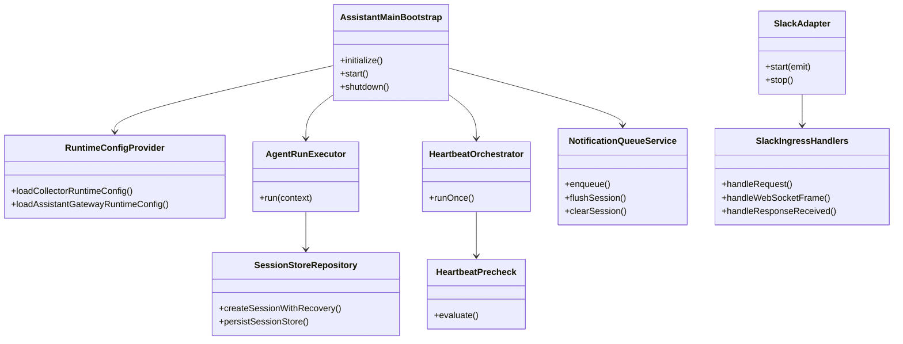
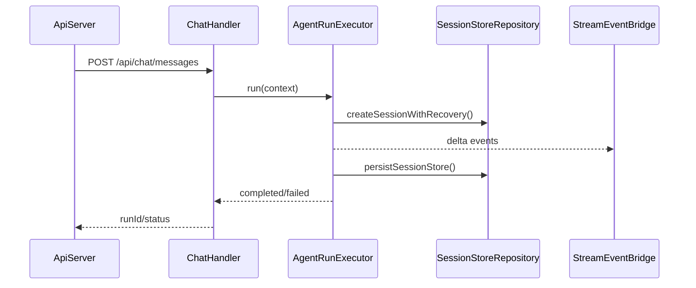

# Core Principles準拠ターゲット別リファクタリング計画（SOLID/KISS/YAGNI/DRY）

## 1. 概要と目的 Overview and Purpose

- What  
  `assistant` / `slack` / `proactive` / `runtime` の責務集中と重複を、公開APIを維持したまま段階的に分割する。  
  対象は主に `agent-runner`、`heartbeat-runner`、`main`、`slack adapter`、`channel-notification-pipeline`、`process.env` 参照分散である。

- Why  
  変更影響範囲を縮小し、回帰リスクと保守コストを下げる。  
  既存コードでは 900行超級ファイルと同種ユーティリティ重複があり、SOLID/DRY/KISS に反しているため、次機能追加時の速度と安全性が下がる。

- How  
  P0（重複削減と死蔵コード除去）→ P1（責務分割）→ P2（設定境界統一と運用安全性向上）の順で実施する。  
  各Phaseは TDD（Red/Green/Refactor）で進め、`pnpm check` 通過をゲートにする。

## 2. 仕様と受け入れ条件 Specification and Acceptance Criteria

### 2.1 スコープ Scope

- 今回やること
  - `src/assistant/agent-runner.ts` の責務分割と未使用重複関数の削除
  - `src/assistant/heartbeat-runner.ts` の実行オーケストレーション分割
  - `src/assistant/main.ts` のコンポジションルート整理（bootstrap/wiring/lifecycle）
  - `src/slack/adapter.ts` の配線責務集中化（ingressロジックと初期化ロジックの分離）
  - `src/proactive/channel-notification-pipeline.ts` のキュー管理とdispatch境界の分離
  - `process.env` 直参照の runtime config への集約
  - `asRecord` 等の重複ユーティリティを最小共通化

- 成果物
  - 新規内部モジュール（例: `assistant/*-service.ts`, `runtime/*config.ts`）
  - 既存モジュールの縮小差分
  - ユニット/統合/契約テストの更新
  - 本計画書のタスク進捗更新

- 制約
  - 公開APIは維持: `/api/chat/*`, `/api/heartbeat/*`, `/api/events/stream`
  - 既存CI（`pnpm check`）を必須通過
  - 後方互換層は最小限（Prototype First）

### 2.2 非スコープ Non Scope

- 今回やらないこと
  - UIデザイン変更
  - 新規ストレージ（RDB/外部キュー）導入
  - 新しいSlackイベント種の追加
  - LLMプロバイダ多重化

- 将来検討だが今回除外すること
  - OpenTelemetryなど観測基盤の本格導入
  - マルチワークスペース厳密分離
  - 本番向け認証/認可層の導入

### 2.3 ユースケース Use Cases

- 正常系1  
  Chat API経由の run が従来通り開始/ストリーム/完了し、内部のみ分割後モジュールに置換される。

- 正常系2  
  Heartbeat が quiet-hours または precheck 条件でスキップされ、LLM未呼び出しのまま従来契約で返る。

- 正常系3  
  Slack ingress で post/reaction/notification を受けたとき、`NormalizedEvent` 契約を維持したまま downstream に渡る。

- 異常系1  
  route secondary classifier が timeout/契約外出力でも primary 判定へフォールバックする。

- 異常系2  
  session store が壊れている場合、修復後に継続実行し、run が異常終了しない。

### 2.4 受け入れ条件 Acceptance Criteria

- Given 既存クライアント  
  When `POST /api/chat/messages` と SSE を実行  
  Then `started/delta/final/error/aborted` の振る舞いとレスポンス契約が維持される

- Given heartbeat実行条件が quiet-hours  
  When `runOnce()` を実行  
  Then `status=skipped, reason=quiet-hours` を返し LLM 呼び出しは発生しない

- Given Slack post/reaction/notification の入力  
  When ingestion pipeline を通す  
  Then `NormalizedEvent` スキーマ互換を満たす

- Given secondary classifier が timeout または invalid outcome  
  When trigger filter が判定  
  Then primary 判定を採用し警告ログを出す

- Given 不正な環境変数値  
  When runtime config を解決  
  Then fallback 既定値で正規化し起動継続する

- Given リファクタリング後コード  
  When `pnpm check` 実行  
  Then format/typecheck/test がすべて成功する

### 2.5 既知の制約 Known Limitations

- 構造最適化のため短期的にファイル数は増える。
- internal import path は変更される可能性がある。
- CORS厳格化は設定追加まで行い、環境ごとの最終値は運用決定に委ねる。

## 3. 前提技術スタック Context and Tech Stack

- Language Framework  
  TypeScript 5.x / Node.js ESM

- Libraries  
  `@mariozechner/pi-coding-agent`, `openai`, `chrome-remote-interface`, `sqlite-vec`

- Style Guide  
  既存 ESLint / Prettier / tsconfig に準拠

- Runtime Deployment  
  `pnpm start`（collector）, `pnpm run assistant`（assistant gateway）

- Testing  
  Node test runner + tsx（`pnpm run test`）

## 4. インターフェース契約 Interface Contracts

### 4.1 公開APIまたは外部I O一覧

- HTTP API（互換維持）
  - `POST /api/chat/messages`
  - `POST /api/chat/abort`
  - `GET /api/chat/runs/:runId/stream`
  - `GET /api/chat/history`
  - `POST /api/heartbeat/run`
  - `GET /api/heartbeat/last`
  - `GET /api/events/stream`

- 設定入力（集約対象）
  - `ADJUTANT_*`
  - `CDP_*`
  - `OPENAI_API_KEY`

- 永続化I/O
  - session store (`data/_assistant/sessions.json`)
  - timeline/session jsonl
  - idempotency store

### 4.2 データモデルとスキーマ

- `AgentRunOptions` / `AgentRunResult`  
  公開契約は維持。内部は `ResolvedAgentRunContext` を唯一の入力に統一。

- `HeartbeatRunResult`  
  既存 status/reason 契約は維持し、precheck/execution/result writer の境界を明確化。

- `NotificationQueueConfig` / `ChatDispatchRequest`  
  外部挙動不変。キュー状態管理を専用モジュールに分離。

- バリデーション方針  
  文字列trim/empty判定/数値正規化は runtime parsers に統一。

### 4.3 エラーと例外 Error Handling

- エラー分類
  - `validation_error`
  - `transient_error`
  - `context_overflow`
  - `model_unavailable`
  - `contract_error`
  - `integration_error`

- リトライ方針
  - 既存踏襲: transient のみ最小回数リトライ
  - route secondary classifier は timeout/error 時に primary fallback

- タイムアウト方針
  - heartbeat timeout / route classifier timeout は既存 env を尊重
  - 不正値は fallback 既定値へ

- ログ方針と個人情報の扱い
  - 本文生データは原則ログしない
  - runId/sessionKey/category/reason のみを標準ログに出す
  - debug 出力は既存 redaction 経由に限定

### 4.4 代表的な例 Examples

```ts
// 新しい内部境界（例）
const cfg = loadAssistantGatewayRuntimeConfig(process.env);
const context = resolveAgentRunContext(opts, cfg.app.assistant);
const result = await agentRunExecutor.run(context);
```

```ts
// fallback契約（例）
const decision = await triggerFilter.decide({ event, selfState: "non-self" });
// secondary timeout時でも decision は必ず返る
```

```bash
pnpm check
# format + typecheck + test が成功すること
```

## 5. アーキテクチャと設計図 Architecture and Diagrams

### 5.1 図の選択方針

- `assistant/slack/proactive/runtime` の複数モジュールを跨ぐためクラス図を必須とする。
- 非同期run（chat/heartbeat/queue flush）が重要なためシーケンス図を追加する。

### 5.2 クラス図 Class Diagram



### 5.3 その他の図 Optional



## 6. テスト戦略 Test Strategy

### 6.1 テストの種類

- Unit
  - `agent-runner` 分割後の pure function（context解決、error分類、memory write parsing）
  - `heartbeat` precheck と visibility 正規化
  - `notification queue` の cap/drop/debounce
  - env parser と config 解決

- Integration
  - chat run の end-to-end（idempotency + stream）
  - heartbeat runOnce の skip/ran/failed
  - slack ingress request/ws/response の連携

- Contract
  - API レスポンス shape 固定
  - `NormalizedEvent` スキーマ固定
  - route classifier fallback 契約固定

### 6.2 カバレッジ対象

- 重要ロジック
  - session recovery / persist
  - queue flush と dual-writeゲート
  - timeout と retry 分岐

- エラー分岐
  - invalid env
  - invalid classifier output
  - ENOENT / malformed json

- 境界条件
  - 空メッセージ、最大文字数、空配列イベント、重複UID

## 7. 実装タスクリスト Implementation Plan

### Phase 1 設計と準備

- [x] 要件と仕様の確定 受け入れ条件の確定（本計画）
- [x] インターフェース契約の確定 スキーマと例の追加
- [x] Mermaid図の作成 更新
- [x] 内部インターフェース 型定義の作成
- [x] テスト基盤の確認（既存 `pnpm run test`）

### Phase 2 機能名Aの実装（AgentRunner責務分割 + DRY）

- [x] Test `agent-runner` の既存挙動固定テストを追加 Red
- [x] Impl `AgentRunExecutor` / `SessionPersistence` へ分割して最小実装 Green
- [x] Refactor 未使用重複関数削除（`createSessionWithRecovery` など）と `asRecord` 共通化
- [x] Integration chat run 回帰テスト追加
- [x] Docs 契約図と対象ファイル更新

### Phase 3 機能名Bの実装（Heartbeat/Queue/Slack境界整理）

- [x] Test `heartbeat runOnce/startHeartbeat` と queue flush の失敗テスト Red
- [x] Impl `HeartbeatOrchestrator` / `NotificationQueueService` 分離実装 Green
- [x] Refactor `slack adapter` をイベント配線に集中、env直参照を config注入へ置換
- [x] Integration heartbeat + proactive + slack連携テスト追加
- [x] Docs 契約と図を更新

### Phase 4 統合と検証

- [x] 全体テストの実行（`pnpm check`）
- [x] エッジケースの動作確認（timeout/fallback/corrupted store）
- [x] ログと例外の確認（想定外入力、タイムアウト、リトライ）
- [x] ドキュメント更新（spec/plan）

## 8. 完了の定義 Definition of Done

### 8.1 機能DoD Functional DoD

- [x] 受け入れ条件がすべて満たされていること
- [x] 既知の制約が明文化され、想定通りであること
- [x] 契約の例に対して期待通りの結果が得られること

### 8.2 品質DoD Quality DoD

- [x] 全てのテストがパスしていること
- [x] Linter Formatterのエラーがないこと
- [x] 不要なデバッグコードが削除されていること
- [x] 主要な変更点がドキュメントに反映されていること

## 9. 懸念事項と未確定事項 Concerns and Questions

- 技術的な懸念点
  - `agent-runner` の分割で event購読順序が変わると delta/toolCall の時系列がずれるリスクがある。
  - queue分割時に debounce タイミング差分で dispatch 粒度が変わる可能性がある。

- 仕様が曖昧で決定が必要な事項
  - CORS許可オリジンの既定値（開発/本番）をどこまで厳格化するか。
  - `ADJUTANT_SLACK_ACCOUNT_ID` の優先順位を config へ寄せる際の互換範囲。

- プロトタイプとして許容するリスク
  - 内部モジュール構成の変更により、短期的に import パスの変更量が増える。
  - 一時的にテストのモック境界が増え、初回の調整コストが発生する。

- 将来的な拡張に伴うリスク
  - 今回の分割境界が LLM provider 多重化時に再調整を要する可能性がある。
  - dual-write の永続化戦略は将来DB導入時に再設計が必要。

### 破壊点と最小移行方針（Prototype First補足）

- 想定破壊点
  - internal import path 変更
  - テストモック対象の変更
  - config 解決ルートの変更

- 最小移行方針
  - 公開API契約は維持する
  - internal alias export を一時的に残し段階移行する
  - 破壊検知は contract test と `pnpm check` で担保する
