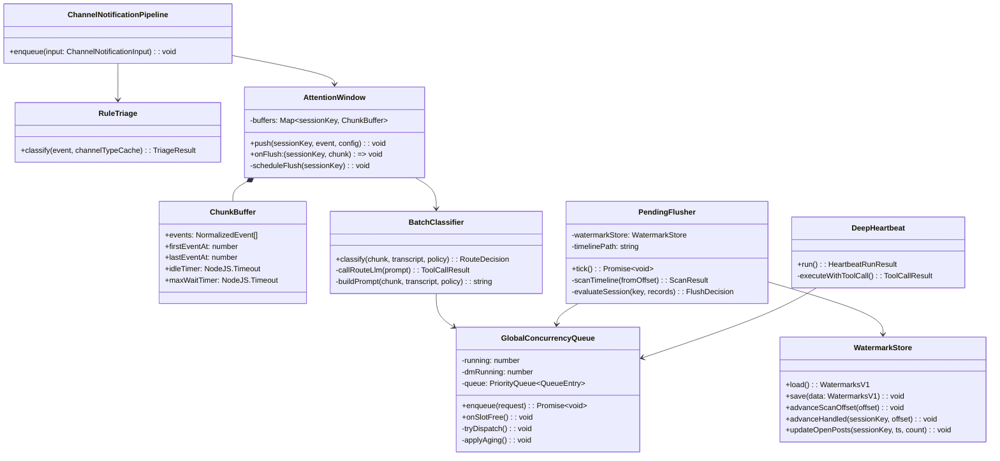
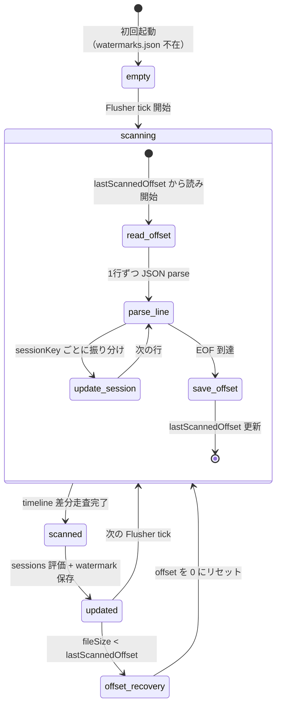

# ルーティングパイプライン v1.5 実装計画

## 1. 概要と目的 Overview and Purpose

- What
  イベント単位の LLM 判定を廃止し、「会話塊（チャンク）」単位の 6 層パイプラインに再構築する。
  1. タイムラインレコードに `sessionKey` を必須化し、watermark による sessionKey 別境界管理を導入する
  2. ルールベース即時判定 + アテンションウィンドウによるバッチ形成を実装する
  3. 軽量 LLM によるバッチ分類（構造化出力）を実装する
  4. グローバル並行制御キュー（優先度付き）を実装する
  5. Pending Flusher（5 分周期の未処理救済）を実装する
  6. Deep Heartbeat（定期巡回専用、未処理救済の責務を分離）に改修する
- Why
  現設計（§9）では全イベントに対して個別に Route LLM を呼び出しており、文脈不足による誤分類、不要なエージェント起動、コスト増が発生する。
  また Heartbeat の逆走査境界がグローバル（sessionKey なし）であり、別セッションの assistant 応答が未対応 post を隠す致命的バグがある。
  3 つの AI エージェント（Claude Code / GPT / Gemini）による設計レビューで合意した改善案を実装する。
- How
  既存の `src/proactive/` を中心に、データモデル変更を先行させてから各層を段階的に導入する。
  既存の `channel-notification-pipeline.ts` / `trigger-filter.ts` / `route-decision.ts` を新パイプラインに置換する。
  Heartbeat の未処理救済ロジックを `heartbeat-scanner.ts` から分離して Pending Flusher に移管する。

## 2. 仕様と受け入れ条件 Specification and Acceptance Criteria

### 2.1 スコープ Scope

- 今回やること
  - `timeline.jsonl` のレコードスキーマに `sessionKey` を必須化する（v1.5 スキーマ）
  - `memory/watermarks.json` を新設し、スキャン進捗と sessionKey 別対応境界を管理する
  - `memory/POLICY_ROUTING.json` を新設し、ルーティングポリシーを MEMORY.md から分離する
  - ルールベース即時判定（層 0）を実装する
  - アテンションウィンドウ（層 1: micro-batch / window-batch）を実装する
  - バッチ分類（層 2: 軽量 LLM + `report_route_decision` ツール強制）を実装する
  - グローバル並行制御キュー（層 3: 優先度キュー + DM 例外枠 + aging）を実装する
  - Pending Flusher（層 4: 5 分周期 + watermark 差分走査）を実装する
  - Deep Heartbeat（層 5: 未処理救済を層 4 に委譲）に改修する
  - `assistant_final` / `assistant_aborted` / `assistant_error` 終端レコードの書き込みを実装する
  - オブザーバビリティ指標（4 メトリクス）のログ出力を追加する
- 成果物
  - データモデル変更（`src/proactive/dual-write-coordinator.ts`, 新規 watermark/policy モジュール）
  - パイプライン再構築（`src/proactive/` 配下の複数ファイル新設・改修）
  - Heartbeat 改修（`src/assistant/heartbeat-runner.ts`, `src/proactive/heartbeat-scanner.ts`）
  - テスト追加（`tests/proactive/*`, `tests/assistant/*`）
  - 計画書本文（本ファイル）
- 制約
  - Prototype First。ただし既存 API（`POST /api/chat/messages` 等）の契約は維持する
  - pi-coding-agent SDK のツール呼び出し機構を前提とする（OpenAI Structured Outputs は直接使用しない）
  - 旧タイムラインレコード（`sessionKey` なし）との後方互換を維持する

### 2.2 非スコープ Non Scope

- 今回やらないこと
  - Route LLM の kNN ベースルーティング（将来検討）
  - DRR / Token Bucket による高度な並行制御（単一ユーザー MVP では過剰）
  - Pending Flusher 内のトリアージ LLM（運用データで必要性を判断）
  - due-based rescue（JSONL 上では Flusher の定期スキャンと同等コスト。SQLite 移行時に再検討）
  - 通知予算の hard limit 実装（soft limit としてプロンプト注入のみ）
  - JSONL から SQLite への全面移行
  - `urgent/soon/batch` 3 段階ルーティング（2 段階 `immediate/pending` で MVP 開始）
- 将来検討だが今回除外すること
  - マルチユーザー対応
  - Watermark の SQLite 化
  - confidence 値の calibration（実運用データ蓄積後に検討）

### 2.3 ユースケース Use Cases

- 正常系: DM メッセージ受信 → ルール判定で即時ルート → micro-batch (200ms) で分割送信をまとめ → エージェント 1 回起動
- 正常系: チャンネルで 5 件の連続投稿 → window-batch (idle=3s / maxWait=30s) で 1 チャンク化 → Route LLM が `respond` 判定 → エージェント 1 回起動
- 正常系: Route LLM が `note` 判定 → system-event-queue に追加 → 次回エージェント起動時に文脈として参照
- 正常系: Route LLM が `ignore` 判定 → タイムラインには記録済み、エージェント起動なし
- 正常系: Pending Flusher が 5 分周期で watermark 差分走査 → sessionKey=slack:C123 に未対応 post 発見 → エージェント起動
- 正常系: Deep Heartbeat が HEARTBEAT.md 指示を実行 → `report_heartbeat_status` ツール呼び出しで結果報告
- 異常系: Route LLM タイムアウト → fail-closed で `note`（保留）扱い
- 異常系: Route LLM が `confidence=0.5` → fail-closed で `note` 扱い
- 異常系: エージェント実行が異常終了 → `assistant_error` レコードを timeline に書き込み → watermark は進めない → Flusher が次周期で再回収
- 異常系: maxConcurrent=3 全スロット使用中に DM 受信 → DM burst slot (+1) で即時起動
- 異常系: プロセス再起動 → watermarks.json から境界を復元 → 旧レコード（sessionKey なし）は Flusher 対象外として無視
- 異常系: timeline.jsonl の truncate 復旧で lastScannedOffset を超えた → offset を 0 にリセットして全走査

### 2.4 受け入れ条件 Acceptance Criteria

1. Given チャンネルで 3 件のメッセージが 1 秒間隔で投稿された
   When window-batch の idle=3s が経過する
   Then 3 件が 1 チャンクとして Route LLM に渡され、LLM 呼び出しは 1 回のみ
2. Given DM で 2 件のメッセージが 100ms 間隔で投稿された
   When micro-batch の idle=200ms が経過する
   Then 2 件が 1 チャンクとして即時ルート（層 2 スキップ）で処理される
3. Given Route LLM がタイムアウトした
   When バッチ分類が完了する
   Then イベントは `note` として system-event-queue に送られ、エージェントは起動しない
4. Given sessionKey=A のエージェントが応答完了し `assistant_final` が記録された
   When sessionKey=B に未対応 post がある
   Then Flusher は sessionKey=B の未対応を正しく検出する（sessionKey=A の境界に隠れない）
5. Given maxConcurrent=3 が全て使用中
   When DM メッセージが到着する
   Then DM burst slot により即時エージェント起動され、4 並行が許可される
6. Given Pending Flusher が未対応 post を検出したスレッドに他者の返信がある
   When Flusher が判定する
   Then 抑制バイアスにより即時起動せず、次周期まで様子見する
7. Given Deep Heartbeat が実行される
   When エージェントが完了する
   Then `report_heartbeat_status` ツールが呼び出され、`HEARTBEAT_OK` 文字列マッチは使用されない

### 2.5 既知の制約 Known Limitations

- 旧タイムラインレコード（sessionKey なし）は Flusher の未対応判定対象外となる（移行期の取りこぼし許容）
- Route LLM の confidence 値は LLM の self-reported であり、実際の判定精度との calibration は未実施
- POLICY_ROUTING.json は手動作成が必要（MVP では main セッションのエージェントが更新する機構は未実装）
- window-batch の maxWaitMs=30s は活発チャンネルで最大 30 秒の遅延を生む
- Flusher の「他者返信あり」判定はヒューリスティクスであり、確定的な解決検出ではない
- Watermark の lastHandledOffset は timeline.jsonl の物理 byte offset であり、ファイルローテーション時は再計算が必要

## 3. 前提技術スタック Context and Tech Stack

- Language Framework
  TypeScript (ESM), Node.js (`node:fs/promises`, `node:http`)
- Libraries
  `@mariozechner/pi-coding-agent`（エージェント SDK）, `openai`（Route LLM）, 既存内部モジュール
- Style Guide
  既存 ESLint + Prettier 準拠（2 スペース、double quotes、trailing comma es5）
- Runtime Deployment
  単一 Node プロセス（assistant gateway）
- Testing
  `node:test` + `assert/strict`、tmpdir による file I/O テスト

## 4. インターフェース契約 Interface Contracts

### 4.1 公開 API または外部 I/O 一覧

- HTTP API（変更なし）
  - `POST /api/chat/messages` — origin に `"pipeline"` が Fast Path 由来
  - `GET /api/chat/runs/:runId/stream`
  - `GET /api/heartbeat/last`
  - `POST /api/heartbeat/run`
- 設定（新設）
  - `ADJUTANT_ROUTING_IDLE_MS`: チャンネル用 idle（既定 `3000`）
  - `ADJUTANT_ROUTING_MAX_WAIT_MS`: チャンネル用 maxWait（既定 `30000`）
  - `ADJUTANT_ROUTING_DM_IDLE_MS`: DM 用 idle（既定 `200`）
  - `ADJUTANT_ROUTING_DM_MAX_WAIT_MS`: DM 用 maxWait（既定 `1000`）
  - `ADJUTANT_ROUTING_CONFIDENCE_THRESHOLD`: Route LLM confidence 閾値（既定 `0.7`）
  - `ADJUTANT_GLOBAL_MAX_CONCURRENT`: エージェント同時起動上限（既定 `3`）
  - `ADJUTANT_GLOBAL_DM_BURST_SLOT`: DM 例外枠（既定 `1`）
  - `ADJUTANT_GLOBAL_STARVATION_MS`: aging 昇格閾値（既定 `120000`）
  - `ADJUTANT_FLUSHER_INTERVAL_MS`: Flusher 周期（既定 `300000`）
  - `ADJUTANT_FLUSHER_STALE_MS`: 未対応判定閾値（既定 `900000`）
- 永続化ストレージ（新設/改修）
  - `memory/timeline.jsonl` — スキーマ v1.5 化（sessionKey 必須）
  - `memory/watermarks.json` — sessionKey 別境界管理
  - `memory/POLICY_ROUTING.json` — ルーティングポリシー

### 4.2 データモデルとスキーマ

#### TimelineRecordV1_5

```ts
type TimelineRecordV1_5 = {
  schema: "adjutant.timeline.record.v1.5";
  recordType: "event" | "action";
  role: "user" | "assistant" | "tool";
  sessionKey: string;
  ts: string; // ISO8601

  // event 用
  kind?: string;
  uid?: string;
  actor?: string;

  // action 用（エージェント実行の終端マーカー）
  actionType?: "assistant_final" | "assistant_aborted" | "assistant_error";
  runId?: string;
};
```

- `assistant_final`: エージェント実行が正常完了。watermark の `lastHandledOffset` を進める唯一のトリガー
- `assistant_aborted`: エージェント実行が中断。watermark は進めない（Flusher が再回収）
- `assistant_error`: エージェント実行がエラー終了。watermark は進めない

#### WatermarksV1

```ts
type WatermarksV1 = {
  schema: "adjutant.watermarks.v1";
  updatedAt: string; // ISO8601

  scan: {
    timelinePath: "memory/timeline.jsonl";
    lastScannedOffset: number; // 追い読み開始位置 (byte offset)
    lastGoodOffset: number;   // JSON parse 成功した安全な offset
  };

  sessions: Record<string, {
    handled: {
      lastHandledOffset: number; // assistant_final を観測した timeline 上の byte offset
    };
    open: {
      oldestOpenPostTs?: string; // 最古の未対応 post 時刻（stale 判定用）
      openPostCount?: number;    // 未対応 post カウンタ
    };
  }>;
};
```

- 更新は `.tmp` + `fs.rename` によるアトミック書き込み
- timeline.jsonl が truncate 復旧で縮小した場合、`lastScannedOffset > fileSize` なら offset を `0` にリセット

#### PolicyRoutingV1

```ts
type PolicyRoutingV1 = {
  schema: "adjutant.policy.routing.v1";
  channels?: Record<string, {
    priority?: "high" | "normal" | "low";
    quietHoursStart?: string; // "HH:mm" (timezone は ADJUTANT_TZ)
    quietHoursEnd?: string;
    notifyBudgetPerHour?: number; // soft limit
    cooldownMs?: number;
  }>;
  defaults?: {
    notifyBudgetPerHour?: number;
    cooldownMs?: number;
  };
};
```

#### ルーティングツール定義

```ts
// Route LLM が必ず呼び出すツール
type ReportRouteDecisionInput = {
  action: "respond" | "note" | "ignore";
  confidence: number; // 0.0-1.0
  reason: string;
};

// Heartbeat が必ず呼び出すツール
type ReportHeartbeatStatusInput = {
  status: "no_action_needed" | "needs_attention" | "task_completed";
  notify: boolean;
  reason: string;
};
```

### 4.3 エラーと例外 Error Handling

- エラー分類
  - Route LLM タイムアウト: fail-closed → `note`（保留）
  - Route LLM 不正出力（ツール未呼び出し / confidence 不足）: fail-closed → `note`
  - Watermark I/O 失敗: warn ログ + 次周期で再試行（Flusher は安全に skip）
  - Global queue 満杯（DM 以外）: 待機キューに積む（aging で昇格）
  - エージェント異常終了: `assistant_error` 記録 + watermark 不進行 + Flusher 再回収
- リトライ方針
  - Route LLM: リトライなし（タイムアウトでフォールバック）
  - Watermark 書き込み: 次の Flusher 周期で自然にリトライ
  - エージェント実行: 既存の 1 回リトライ方針を維持
- タイムアウト方針
  - Route LLM: `ADJUTANT_ROUTE_LLM_TIMEOUT_MS`（既定 1000ms）
  - Attention window: `idleMs` + `maxWaitMs` で制御
  - Global queue aging: `starvationMs`（既定 120000ms）
- ログ方針と個人情報の扱い
  - Route LLM の入力テキストはログしない
  - `uid`, `sessionKey`, `action`, `confidence`, `durationMs` を構造化ログ
  - POLICY_ROUTING.json の内容はログ可（個人情報を含まない設計）

### 4.4 代表的な例 Examples

Route LLM への入力例（会話塊）:

```
System: You are a lightweight classifier for a proactive Slack assistant.
You must call the report_route_decision tool exactly once.
Choose "respond" when the user needs an AI response.
Choose "note" for FYI/low-priority updates.
Choose "ignore" for casual chatter unrelated to the user.

User: The following is a batch of recent Slack messages in channel #dev-team:
---
[2026-02-22T10:30:00] @alice: デプロイ完了しました
[2026-02-22T10:30:05] @bob: お疲れ様です
[2026-02-22T10:30:15] @alice: staging環境で確認お願いします @you
---
Recent context: You were asked to review the PR yesterday.
Channel policy: priority=high, notifyBudgetRemaining=4/5
```

Watermarks.json の例:

```json
{
  "schema": "adjutant.watermarks.v1",
  "updatedAt": "2026-02-22T10:35:00.000Z",
  "scan": {
    "timelinePath": "memory/timeline.jsonl",
    "lastScannedOffset": 84720,
    "lastGoodOffset": 84720
  },
  "sessions": {
    "slack:D001": {
      "handled": { "lastHandledOffset": 83200 },
      "open": { "oldestOpenPostTs": null, "openPostCount": 0 }
    },
    "slack:channel:C123": {
      "handled": { "lastHandledOffset": 81000 },
      "open": { "oldestOpenPostTs": "2026-02-22T10:25:00.000Z", "openPostCount": 2 }
    }
  }
}
```

## 5. アーキテクチャと設計図 Architecture and Diagrams

### 5.1 図の選択方針

- パイプライン全体のデータフローを示すフローチャート
- 各層の主要クラス関係を示すクラス図
- Watermark 更新の状態遷移図

### 5.2 パイプラインフロー図

```
NormalizedEvent (from SlackPlugin.emit())
    │
    ▼
┌─────────────────────────────────────────────────┐
│ 層0: RuleTriage                                  │
│   self → DROP                                    │
│   DM/@mention → IMMEDIATE ──────────┐            │
│   other → ACCUMULATE                │            │
└────────────┬────────────────────────┘            │
             │                                      │
             ▼                                      │
┌─────────────────────────────────┐                │
│ 層1: AttentionWindow            │                │
│   DM: idle=200ms, max=1000ms    │◄───────────────┘
│   CH: idle=3000ms, max=30000ms  │
│   → flush → ConversationChunk   │
└────────────┬────────────────────┘
             │
             ▼
┌─────────────────────────────────────────┐
│ 層2: BatchClassifier (Route LLM)         │
│   input: chunk + transcript + policy     │
│   output: report_route_decision tool     │
│   respond → enqueue ──────────┐          │
│   note → SystemEventQueue     │          │
│   ignore → (timeline only)    │          │
│   fail → note (fail-closed)   │          │
└───────────────────────────────┘          │
                                            │
┌───────────────────────────────────────┐  │
│ 層4: PendingFlusher (5min cycle)      │  │
│   watermark diff scan                 │  │
│   stale + no human reply → enqueue ───┤  │
│   stale + human reply → suppress      │  │
└───────────────────────────────────────┘  │
                                            │
             ┌──────────────────────────────┘
             │
             ▼
┌────────────────────────────────────────────┐
│ 層3: GlobalConcurrencyQueue                 │
│   maxConcurrent=3, dmBurstSlot=1            │
│   priority: DM>Group>Channel>Flusher>HB     │
│   aging: starvationMs=120s → priority boost  │
│   → AgentRunner.runAgent()                   │
└─────────────────────────────────────────────┘
             │
             ▼
┌──────────────────────────────────┐
│ 層5: DeepHeartbeat (30-60min)     │
│   HEARTBEAT.md 指示のみ           │
│   → report_heartbeat_status tool  │
│   未処理救済なし（層4に委譲）      │
└──────────────────────────────────┘
```

### 5.3 クラス図



### 5.4 Watermark 状態遷移



## 6. テスト戦略 Test Strategy

### 6.1 テストの種類

- Unit
  - `RuleTriage`: self/DM/mention/channel の分類正確性、channel type キャッシュ依存
  - `AttentionWindow`: idle タイマー動作、maxWait 強制フラッシュ、バッファ合流
  - `BatchClassifier`: ツール呼び出し parse、confidence 閾値、タイムアウトフォールバック
  - `GlobalConcurrencyQueue`: maxConcurrent 遵守、DM burst slot、aging 昇格、FIFO 順序
  - `WatermarkStore`: atomic write、truncate 復旧、offset リセット
  - `PendingFlusher`: 差分走査、sessionKey 別境界、他者返信の抑制バイアス、旧レコード無視
  - `DeepHeartbeat`: ツール呼び出し強制、HEARTBEAT_OK 文字列マッチ非使用
- Integration
  - パイプライン E2E: イベント投入 → 層 0-3 → エージェント起動確認
  - Flusher + Watermark: timeline 書き込み → 5 分後 → Flusher 検出 → エージェント起動
  - 再起動復旧: watermarks.json 復元 → 旧レコード無視 → 新レコード処理
- Contract
  - Route LLM ツール定義の入出力スキーマ
  - `POST /api/chat/messages` の origin=pipeline 互換

### 6.2 カバレッジ対象

- 重要ロジック
  - sessionKey 別の境界判定（グローバル混線防止）
  - `assistant_final` のみ watermark 進行（aborted/error は不進行）
  - fail-closed フォールバック（Route LLM タイムアウト/不正出力/低 confidence）
- エラー分岐
  - Watermark I/O 失敗時の graceful skip
  - Route LLM API エラー時のフォールバック
  - maxConcurrent 超過時のキューイング
- 境界条件
  - idle=0ms（即時フラッシュ）
  - maxWait に達する直前/直後
  - timeline.jsonl が空の場合
  - watermarks.json 不在での初回起動
  - 旧スキーマレコードと新スキーマレコードの混在

## 7. 実装タスクリスト Implementation Plan

### Phase 1: データモデル基盤

- [ ] Test `TimelineRecordV1_5` の型定義と validate 関数の失敗テスト Red
      対象: `tests/proactive/timeline-record.test.ts`（新設）
- [ ] Impl `TimelineRecordV1_5` 型定義と validate 実装 Green
      対象: `src/proactive/timeline-record.ts`（新設）
- [ ] Test `WatermarkStore` の load/save/atomic-write/truncate-recovery の失敗テスト Red
      対象: `tests/proactive/watermark-store.test.ts`（新設）
- [ ] Impl `WatermarkStore` 実装 Green
      対象: `src/proactive/watermark-store.ts`（新設）
- [ ] Test `PolicyRoutingV1` の load/defaults の失敗テスト Red
      対象: `tests/proactive/policy-routing.test.ts`（新設）
- [ ] Impl `PolicyRoutingV1` loader 実装 Green
      対象: `src/proactive/policy-routing.ts`（新設）
- [ ] Refactor `DualWriteCoordinator` が `sessionKey` を必須で timeline に書き込むように改修
      対象: `src/proactive/dual-write-coordinator.ts`
- [ ] Impl エージェント終端レコード（`assistant_final` / `assistant_aborted` / `assistant_error`）の timeline 書き込み
      対象: `src/assistant/agent-runner.ts`（finally ブロック追加）

### Phase 2: 層 0 + 層 1（ルール判定 + アテンションウィンドウ）

- [ ] Test `RuleTriage` の self/DM/mention/channel 分類テスト Red
      対象: `tests/proactive/rule-triage.test.ts`（新設）
- [ ] Impl `RuleTriage` 実装 Green
      対象: `src/proactive/rule-triage.ts`（新設）
- [ ] Test `AttentionWindow` の idle/maxWait/flush テスト Red
      対象: `tests/proactive/attention-window.test.ts`（新設）
- [ ] Impl `AttentionWindow` 実装 Green
      対象: `src/proactive/attention-window.ts`（新設）
- [ ] Refactor `ChannelNotificationPipeline` が `RuleTriage` + `AttentionWindow` を使うよう改修
      対象: `src/proactive/channel-notification-pipeline.ts`

### Phase 3: 層 3（グローバル並行制御キュー）

- [ ] Test `GlobalConcurrencyQueue` の maxConcurrent/burst-slot/aging/priority テスト Red
      対象: `tests/proactive/global-concurrency-queue.test.ts`（新設）
- [ ] Impl `GlobalConcurrencyQueue` 実装 Green
      対象: `src/proactive/global-concurrency-queue.ts`（新設）
- [ ] Refactor エージェント起動パスを `GlobalConcurrencyQueue` 経由に統一
      対象: `src/proactive/channel-notification-pipeline.ts`, `src/assistant/chat-handler.ts`

### Phase 4: 層 2（バッチ分類）

- [ ] Test `BatchClassifier` のツール呼び出し parse / confidence 閾値 / タイムアウト テスト Red
      対象: `tests/proactive/batch-classifier.test.ts`（新設）
- [ ] Impl `BatchClassifier` 実装（Route LLM + ツール強制呼び出し）Green
      対象: `src/proactive/batch-classifier.ts`（新設）
- [ ] Impl Route LLM 用ツール定義（`report_route_decision`）
      対象: `src/proactive/routing-tools.ts`（新設）
- [ ] Refactor `AttentionWindow.onFlush` → `BatchClassifier` → `GlobalConcurrencyQueue` の接続
      対象: `src/proactive/channel-notification-pipeline.ts`

### Phase 5: 層 4（Pending Flusher）

- [ ] Test `PendingFlusher` の差分走査 / sessionKey 別境界 / 他者返信抑制 / 旧レコード無視 テスト Red
      対象: `tests/proactive/pending-flusher.test.ts`（新設）
- [ ] Impl `PendingFlusher` 実装 Green
      対象: `src/proactive/pending-flusher.ts`（新設）
- [ ] Refactor `heartbeat-scanner.ts` の未処理走査ロジックを `PendingFlusher` に移管
      対象: `src/proactive/heartbeat-scanner.ts`（走査部分を削除/委譲）

### Phase 6: 層 5（Deep Heartbeat 改修）

- [ ] Test `DeepHeartbeat` の `report_heartbeat_status` ツール強制テスト Red
      対象: `tests/assistant/heartbeat-runner.test.ts`
- [ ] Impl `report_heartbeat_status` ツール定義と Heartbeat 改修 Green
      対象: `src/assistant/heartbeat-runner.ts`, `src/proactive/routing-tools.ts`
- [ ] Refactor Heartbeat から未処理救済ロジックを完全に除去
      対象: `src/assistant/heartbeat-runner.ts`

### Phase 7: オブザーバビリティ

- [ ] Impl 4 メトリクスのログ出力追加
      - `route_llm_calls_per_hour`: `BatchClassifier` に計測追加
      - `flusher_fire_count`: `PendingFlusher` に計測追加
      - `agent_invocations_by_source`: `GlobalConcurrencyQueue` に source 別集計追加
      - `event_to_response_p95_ms`: パイプライン入口と出口にタイムスタンプ追加
      対象: 各モジュール + `src/proactive/metrics.ts`（新設）

### Phase 8: 統合と検証

- [ ] 全体テスト実行（`pnpm run check`）
- [ ] E2E シナリオ検証（DM 即時 / チャンネルバッチ / Flusher 救済 / Heartbeat 分離）
- [ ] 旧レコード混在時のマイグレーション動作確認
- [ ] ログとメトリクスの出力確認
- [ ] `doc/spec-unified.md` の差分更新

## 8. 完了の定義 Definition of Done

### 8.1 機能 DoD Functional DoD

- [ ] 受け入れ条件（§2.4）が全て満たされていること
- [ ] 既知の制約（§2.5）が明文化され、想定通りであること
- [ ] 代表例（§4.4）に対して期待通りの結果が得られること

### 8.2 品質 DoD Quality DoD

- [ ] 全てのテストがパスしていること（`pnpm run test`）
- [ ] Linter / Formatter のエラーがないこと（`pnpm run lint`, `pnpm run format`）
- [ ] 不要なデバッグコードが削除されていること
- [ ] 主要な変更点が `doc/spec-unified.md` に反映されていること

## 9. 懸念事項と未確定事項 Concerns and Questions

- Route LLM のモデル選定: `gpt-4o-mini` が最適か、他の軽量モデル（`gpt-5-mini` 等）を検証すべきか。コスト/精度/レイテンシのトレードオフを実測で決定する必要がある
- `report_route_decision` ツールを pi-coding-agent SDK のカスタムツール機構で定義できるか要確認。SDK の制約次第ではスタンドアロンの OpenAI API 呼び出し（現行 `route-llm-classifier.ts` ベース）を継続する可能性がある
- Route LLM のバッチ分類は pi-coding-agent SDK のセッション外で動作するため、SDK のセッション管理/コンテキストとは独立。ツール定義の共有方法を検討する必要がある
- `POLICY_ROUTING.json` の初期値をどう作成するか。ワークスペース初期化時にデフォルトファイルを生成するか、存在しない場合はデフォルト値にフォールバックするか
- Watermark の `lastHandledOffset` は byte offset であり、Node.js の `fs.read` による部分読み込みが前提。大規模 timeline での性能を実測で確認する必要がある
- `assistant_final` の書き込みが agent-runner の `finally` ブロックで保証されるとしても、プロセス自体が SIGKILL で死んだ場合は書き込まれない。この場合の Flusher の挙動（永久に未対応扱い）が許容可能か要確認
