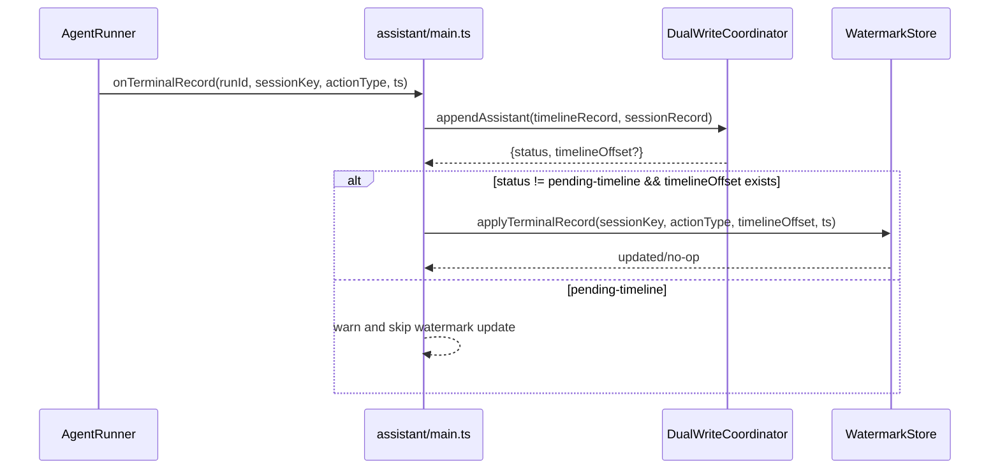

# Terminal Record Watermark 統合計画

## 1. 概要と目的 Overview and Purpose

- What  
  `assistant_final` を handled 境界へ反映する契約を、実行経路（`onTerminalRecord`）へ接続する。`assistant_aborted` / `assistant_error` は境界を進めない仕様を、実コードとテストで保証する。
- Why  
  現状は `WatermarkStore.applyTerminalRecord()` が未接続で、Flusher の session 境界が想定どおり更新されない。これにより stale 判定が遅延または誤再回収するリスクがある。
- How  
  terminal record 永続化時に timeline 追記 offset を取得し、`onTerminalRecord` 内で `applyTerminalRecord()` を呼ぶ。offset は `DualWriteCoordinator` の戻り値契約に昇格し、main 側で byte offset を正確に算出する。

## 2. 仕様と受け入れ条件 Specification and Acceptance Criteria

### 2.1 スコープ Scope

- 今回やること
  - `DualWriteCoordinator` の timeline append 契約を offset 返却可能な形へ拡張
  - `assistant/main.ts` の terminal record 書き込みで timeline byte offset を取得
  - `onTerminalRecord` で `watermarkStore.applyTerminalRecord()` を呼び出し
  - `assistant_final` のみ handled 境界前進、`assistant_aborted` / `assistant_error` は no-op を保証
  - 契約テスト、統合テストを追加
  - Mermaid 図と仕様書更新
- 成果物
  - `src/proactive/dual-write-coordinator.ts` の戻り値契約更新
  - `src/assistant/main.ts` の terminal path 改修
  - `tests/proactive/dual-write-coordinator.test.ts` / `tests/assistant/*` の追加更新
  - `doc/spec.md` と本計画書の更新
- 制約
  - 既存公開 API（HTTP エンドポイント）は変更しない
  - 既存 `pnpm run check` が通ること
  - Prototype First: 永続ストレージは現行 JSONL + watermarks.json 前提

### 2.2 非スコープ Non Scope

- 今回やらないこと
  - Watermark を DB 化する変更
  - timeline 差分読み最適化の本格導入
  - multi-process 分散ロック実装
- 将来検討だが今回除外すること
  - timeline append の fsync 厳密保証
  - terminal record 以外の action 種別追加

### 2.3 ユースケース Use Cases

- 正常系
  - エージェント完了で `assistant_final` が timeline に追記され、同 offset で handled 境界が更新される
  - エージェント中断/失敗で terminal record は残るが handled は進まない
- 異常系
  - timeline append 失敗時は offset 不在となり watermark 更新を行わず warn を出す
  - session append 失敗（pending-session-backfill）でも timeline 成功時は `assistant_final` 境界更新が可能

### 2.4 受け入れ条件 Acceptance Criteria

1. Given `assistant_final` terminal record が timeline へ commit される  
   When `onTerminalRecord` が処理される  
   Then `watermarkStore.applyTerminalRecord(actionType=assistant_final, offset=<timelineOffset>)` が 1 回呼ばれる
2. Given `assistant_aborted` または `assistant_error` terminal record が commit される  
   When `onTerminalRecord` が処理される  
   Then `applyTerminalRecord()` は呼ばれても handled 境界は前進しない
3. Given timeline append が失敗し `pending-timeline` になる  
   When `onTerminalRecord` が終了する  
   Then watermark は更新されず、警告ログが記録される
4. Given session append が失敗し `pending-session-backfill` になる（timeline は成功）  
   When actionType が `assistant_final` である  
   Then handled 境界は timeline offset で更新される
5. Given プロセス再起動後に watermarks を load する  
   When Flusher が次周期で走査する  
   Then 更新済み handled 境界を使って stale 判定が行われる

### 2.5 既知の制約 Known Limitations

- offset 算出は単一プロセス前提（同一ファイルへの並行外部書き込みは非対応）
- `pending-timeline` の terminal record は retry 後に初めて watermark 反映可能
- JSONL 直書きのため、巨大ファイル時の追記性能は将来最適化対象

## 3. 前提技術スタック Context and Tech Stack

- Language Framework  
  TypeScript (ESM), Node.js
- Libraries  
  既存内部モジュール (`dual-write-coordinator`, `watermark-store`, `chat-handler`)
- Style Guide  
  repository の ESLint / Prettier 設定準拠
- Runtime Deployment  
  single-node process (`src/assistant/main.ts`)
- Testing  
  `node:test` + `assert/strict`, `pnpm run check`

## 4. インターフェース契約 Interface Contracts

### 4.1 公開APIまたは外部 I/O 一覧

- HTTP API  
  変更なし
- 設定ファイル  
  変更なし
- 永続化ストレージ
  - `memory/timeline.jsonl`: terminal record 追記時の offset が境界更新ソース
  - `memory/watermarks.json`: `sessions[sessionKey].handled.lastHandledOffset` 更新

### 4.2 データモデルとスキーマ

- `DualWriteAppendResult`（内部契約）
  - `committed` / `pending-session-backfill` の場合 `timelineOffset?: number` を保持
  - `pending-timeline` は `timelineOffset` なし
- `onTerminalRecord`（`main.ts`）
  - `appendAssistant()` の戻り値から `timelineOffset` を受領
  - `watermarkStore.applyTerminalRecord({ sessionKey, actionType, offset, ts })` を呼ぶ
- `WatermarkStore.applyTerminalRecord`
  - `assistant_final`: `advanceHandled()` 実行
  - `assistant_aborted` / `assistant_error`: no-op

### 4.3 エラーと例外 Error Handling

- エラー分類
  - timeline append 失敗
  - session append 失敗
  - watermark save 失敗
- リトライ方針
  - timeline/session append は既存 `retryPending()` を継続利用
  - watermark 更新は terminal path 内で 1 回実施、失敗時 warn（再実行は次回 terminal/retry 経路）
- タイムアウト方針
  - 新規追加なし（既存 async path に準拠）
- ログ方針と個人情報
  - runId/sessionKey/actionType/status/offset のみ。本文や機微情報は出力しない

### 4.4 代表的な例 Examples

- 例1: final 正常系

```ts
const result = await dualWriteCoordinator.appendAssistant(...);
if (result.status !== "pending-timeline" && typeof result.timelineOffset === "number") {
  await watermarkStore.applyTerminalRecord({
    sessionKey,
    actionType: "assistant_final",
    offset: result.timelineOffset,
    ts,
  });
}
```

- 例2: error 終端

```ts
await watermarkStore.applyTerminalRecord({
  sessionKey,
  actionType: "assistant_error",
  offset,
  ts,
});
// handled は進まない
```

## 5. アーキテクチャと設計図 Architecture and Diagrams

### 5.1 図の選択方針

- `agent-runner` / `main` / `dual-write-coordinator` / `watermark-store` の複数モジュールを跨ぐためクラス図を必須化
- 非同期処理順序が重要なためシーケンス図を追加

### 5.2 クラス図 Class Diagram

```mermaid
classDiagram
  class AgentRunner {
    +runAgent(opts)
    +onTerminalRecord(input)
  }

  class AssistantMain {
    +onTerminalRecord(input)
    -appendTimelineWithOffset(record) {offset}
  }

  class DualWriteCoordinator {
    +appendAssistant(input) DualWriteAppendResult
    +retryPending()
  }

  class WatermarkStore {
    +applyTerminalRecord(input)
    +advanceHandled(sessionKey, offset, ts)
  }

  AgentRunner --> AssistantMain : terminal callback
  AssistantMain --> DualWriteCoordinator : appendAssistant
  AssistantMain --> WatermarkStore : applyTerminalRecord
```

### 5.3 その他の図 Optional



## 6. テスト戦略 Test Strategy

### 6.1 テストの種類

- Unit
  - `DualWriteCoordinator` が terminal append 成果として `timelineOffset` を返す
  - `WatermarkStore.applyTerminalRecord` の final/error/aborted 分岐
- Integration
  - `onTerminalRecord` から `appendAssistant` → `applyTerminalRecord` の接続
  - `pending-timeline` 時に watermark 更新されないこと
- Contract
  - `assistant_final` のみ handled 境界前進という契約をテストで固定

### 6.2 カバレッジ対象

- 重要ロジック
  - terminal append offset 取得
  - final の境界前進
- エラー分岐
  - pending-timeline / pending-session-backfill
  - watermark 更新失敗時 warn
- 境界条件
  - offset 未定義
  - 同一 session 連続 terminal

## 7. 実装タスクリスト Implementation Plan

### Phase 1 設計と準備

- [x] 要件と仕様の確定（受け入れ条件の確定）
- [x] インターフェース契約の確定（`DualWriteAppendResult` と `onTerminalRecord` 接続契約）
- [x] Mermaid図の作成 更新
- [x] 型定義の更新（offset 返却契約）
- [x] テスト基盤の確認（既存 `node:test`）

### Phase 2 Terminal Offset 契約の実装

- [x] Test `DualWriteCoordinator.appendAssistant` の offset 返却 Red
- [x] Impl offset 返却対応 Green
- [x] Refactor append path の重複排除
- [x] Integration timeline success/failure の統合テスト
- [x] Docs 契約更新

### Phase 3 Watermark 接続実装

- [x] Test `onTerminalRecord -> applyTerminalRecord` 接続 Red
- [x] Impl `assistant/main.ts` で terminal 後に `applyTerminalRecord` 呼び出し Green
- [x] Refactor warning/log を統一
- [x] Integration `assistant_final` のみ handled 前進を確認
- [x] Docs `doc/spec.md` 更新

### Phase 4 統合と検証

- [x] 全体テストの実行（`pnpm run check`）
- [x] エッジケース確認（pending-timeline / pending-session-backfill）
- [x] ログと例外の確認（offset 未取得、watermark 保存失敗）
- [x] ドキュメント更新（仕様 契約 図）

## 8. 完了の定義 Definition of Done

### 8.1 機能DoD Functional DoD

- [x] 受け入れ条件がすべて満たされていること
- [x] 既知の制約が明文化され、想定通りであること
- [x] 契約の例に対して期待通りの結果が得られること

### 8.2 品質DoD Quality DoD

- [x] 全てのテストがパスしていること
- [x] Linter Formatterのエラーがないこと
- [x] 不要なデバッグコードが削除されていること
- [x] 主要な変更点がドキュメントに反映されていること

## 9. 懸念事項と未確定事項 Concerns and Questions

- timeline offset を取得する append 実装は、単一プロセス前提で十分か（現行運用では十分、将来 multi-writer で要再設計）
- `pending-session-backfill` でも final 境界を進める方針は妥当か（timeline を正とする設計では妥当）
- watermark 更新失敗時の再試行ポリシーを即時リトライにするか、warn のみに留めるか（MVP では warn + 次回回復）
- terminal record write と watermark write の厳密なトランザクション性は持たない（プロトタイプ許容）
