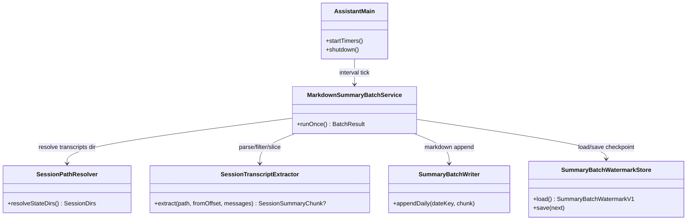
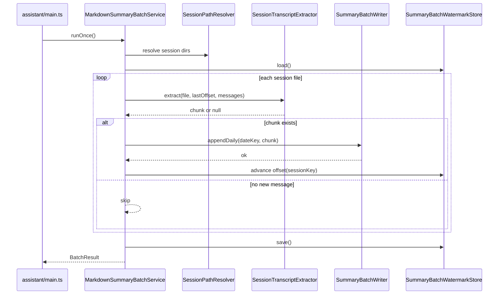

# 日次 Markdown 要約バッチ 実装計画（OpenClaw 準拠）

## 1. 概要と目的 Overview and Purpose

- What  
  `doc/spec.md` の未実装項目「日次 Markdown 要約バッチ」を実装する。workspace 外の state 配下 `agents/<agentId>/sessions/*.jsonl` を日次で集約し、`memory/YYYY-MM-DD.md` へ要約追記する内部バッチを追加する。あわせてセッション保存ディレクトリ運用を OpenClaw 構造へ寄せる。
- Why  
  現状は `memory_write` による都度保存しかなく、日単位での運用ログ要約が欠落している。次回セッションの文脈注入（Today/Yesterday）と検索再利用性を高めるため、定期的な Markdown 化が必要。
- How  
  OpenClaw の `session-memory` 実装（`vendor/openclaw/src/hooks/bundled/session-memory/handler.ts`）を準拠点として、以下を日次バッチに移植する。  
  準拠点: 「user/assistant 抽出」「`/` 開始コマンド除外」「非JSON/非メッセージ行スキップ」「filter 後 slice」「失敗時非致命」。  
  差分: OpenClaw は `/new` 単発フックだが、本実装は `assistant/main.ts` で定期実行する。セッション JSONL の配置は workspace 配下ではなく state 配下へ寄せる。

## 2. 仕様と受け入れ条件 Specification and Acceptance Criteria

### 2.1 スコープ Scope

- 今回やること
  - 日次要約バッチランナーを新規実装し、`assistant/main.ts` から定期起動する
  - `<stateDir>/agents/<agentId>/sessions/*.jsonl` から user/assistant 発話を抽出する
  - 既存 `workspace/memory/sessions/*.jsonl` から OpenClaw 寄せディレクトリへの移行方針（読取互換期間 + 新規書込先切替）を実装する
  - OpenClaw 準拠の抽出ルールを適用する
  - 進捗管理用チェックポイントを state 配下（`<stateDir>/agents/<agentId>/summary-batch-watermark.json`）に保存する
  - 出力を `memory/YYYY-MM-DD.md` に追記する
  - 単体テストと統合テストを追加する
  - `doc/spec.md` を更新する
- 成果物
  - `src/assistant/markdown-summary-batch.ts`（新規）
  - `src/assistant/main.ts`（バッチタイマー配線）
  - `src/runtime/app-runtime-config.ts` / `src/runtime/runtime-config-loader.ts`（設定追加）
  - `src/assistant/session-paths.ts`（新規、state 配下パス解決）
  - `tests/assistant/markdown-summary-batch.test.ts`（新規）
  - `tests/assistant/main-adapter.test.ts` または同等の統合観点テスト更新
  - `doc/spec.md`（実装済み項目更新）
- 制約
  - 既存 API 互換を維持する（HTTP/SSE 契約は不変更）
  - 既存 `memory/YYYY-MM-DD.md` 運用を維持する（ファイル命名は既存優先）
  - セッション正本は workspace 外へ分離し、OpenClaw と同様に state 配下管理とする
  - バッチ失敗でエージェント本線を停止させない

### 2.2 非スコープ Non Scope

- 今回やらないこと
  - LLM による高品質抽象要約の生成（v1 は抽出要約）
  - `MEMORY.md` の自動リライト
  - 既存 `memory_write` ツール契約の変更
  - 週次/月次ロールアップ
- 将来検討だが今回除外すること
  - OpenClaw 同等の slug 付きファイル分割（`YYYY-MM-DD-slug.md`）
  - 重要度分類つきサマリ（priority タグ）
  - まとめ生成時の外部モデル選択制御

### 2.3 ユースケース Use Cases

- 正常系: 定期 tick で state 配下の未処理セッションを検出し、日付別 Markdown へ追記できる
- 正常系: JSONL に tool/action 行が混在していても user/assistant 発話のみ抽出できる
- 正常系: `/new` や `/help` 等のコマンド文を要約対象から除外できる
- 異常系: 壊れた JSONL 行が混在していても処理継続し、読める行だけ取り込む
- 異常系: 出力書き込み失敗時に警告ログを残し、次 tick で再試行できる

### 2.4 受け入れ条件 Acceptance Criteria

1. Given `<stateDir>/agents/main/sessions/main.jsonl` に user/assistant/tool 行が混在している  
   When 日次バッチが走る  
   Then `memory/YYYY-MM-DD.md` には user/assistant のみが追記される
2. Given user 発話に `/new` と通常文が混在する  
   When 日次バッチが走る  
   Then `/` で始まる発話は除外され通常文のみ残る
3. Given 対象セッションの発話数が `messages=15` を超える  
   When 日次バッチが走る  
   Then 「filter 後に末尾 15 件」が採用される
4. Given 同一入力でバッチが 2 回連続実行される  
   When 2 回目が開始される  
   Then チェックポイントにより重複追記されない
5. Given 一部セッションファイルが壊れている  
   When バッチが走る  
   Then 壊れた行は無視され、処理全体は失敗しない
6. Given バッチ出力先への書き込みに失敗する  
   When run が終了する  
   Then warning が記録されプロセスは継続する
7. Given 旧保存先 `workspace/memory/sessions/*.jsonl` に既存データがある  
   When 移行後のバッチが走る  
   Then 旧データを取りこぼさず処理しつつ、新規書込先は state 配下のみになる

### 2.5 既知の制約 Known Limitations

- v1 は抽出要約のため、文脈圧縮率は LLM 要約より低い
- 同日大量セッション時は `memory/YYYY-MM-DD.md` が肥大化する可能性がある
- 単一プロセス運用前提（複数プロセス同時書き込みは対象外）

## 3. 前提技術スタック Context and Tech Stack

- Language Framework  
  TypeScript (ESM), Node.js
- Libraries  
  既存の `node:fs/promises`, 既存 assistant/proactive モジュール群
- Style Guide  
  既存 ESLint / Prettier / TypeScript strict 設定に準拠
- Runtime Deployment  
  `pnpm run assistant` の単一プロセス
- Testing  
  `node --test`（既存 `tests/**/*.test.ts`） + `pnpm run check`

## 4. インターフェース契約 Interface Contracts

### 4.1 公開APIまたは外部 I/O 一覧

- HTTP API  
  変更なし
- 設定ファイル / 環境変数（新規）
  - `ADJUTANT_MARKDOWN_SUMMARY_BATCH_ENABLED` (`0|1`, default `0`)
  - `ADJUTANT_MARKDOWN_SUMMARY_BATCH_INTERVAL_MS` (default `3600000`)
  - `ADJUTANT_MARKDOWN_SUMMARY_BATCH_MESSAGES` (default `15`)
  - `ADJUTANT_MARKDOWN_SUMMARY_BATCH_MAX_SESSIONS` (default `200`)
  - `ADJUTANT_STATE_DIR`（default は runtime で決定する state ルート）
  - `ADJUTANT_SESSION_AGENT_ID`（default `main`）
  - `ADJUTANT_SESSION_TRANSCRIPTS_DIR`（未指定時 `<stateDir>/agents/<agentId>/sessions`）
- 永続化ストレージ
  - 入力（正本）: `<stateDir>/agents/<agentId>/sessions/*.jsonl`
  - 入力（移行互換）: `<workspace>/memory/sessions/*.jsonl`（互換期間のみ）
  - 出力: `<workspace>/memory/YYYY-MM-DD.md`
  - チェックポイント: `<stateDir>/agents/<agentId>/summary-batch-watermark.json`

### 4.2 データモデルとスキーマ

- `SummaryBatchWatermarkV1`

```ts
type SummaryBatchWatermarkV1 = {
  schema: "adjutant.summary.batch.watermark.v1";
  updatedAt: string;
  sessions: Record<
    string,
    {
      lastProcessedOffset: number;
      lastProcessedTs?: string;
    }
  >;
};
```

- `SessionSummaryChunk`

```ts
type SessionSummaryChunk = {
  sessionKey: string;
  dateKey: string; // timezone 基準 YYYY-MM-DD
  lines: string[]; // "user: ...", "assistant: ..."
  sourcePath: string;
};
```

- `runMarkdownSummaryBatch(input) -> { processedSessions, writtenEntries, skippedEntries, warnings }`
- `resolveSessionTranscriptsDir(input) -> string`
  - OpenClaw 準拠優先: `<stateDir>/agents/<agentId>/sessions`
  - 明示 override がある場合のみ `ADJUTANT_SESSION_TRANSCRIPTS_DIR` を採用

### 4.3 エラーと例外 Error Handling

- エラー分類
  - セッションファイル読み込み失敗
  - JSON パース失敗（行単位）
  - 出力追記失敗
  - チェックポイント保存失敗
- リトライ方針
  - 行パース失敗はスキップして継続
  - ファイル書き込み失敗は当該 tick で warning、次 tick で再試行
- タイムアウト方針
  - 本バッチはローカル I/O のみ。明示タイムアウトは設けない
- ログ方針と個人情報
  - ログは `sessionKey`, `path`, `offset`, `error` のみ
  - メッセージ本文は warning/info に出さない

### 4.4 代表的な例 Examples

- 例1: 入力 JSONL（抜粋）

```json
{"recordType":"event","role":"user","kind":"post","text":"/new","loggedAt":"2026-02-22T10:00:00.000Z"}
{"recordType":"event","role":"user","kind":"post","text":"明日のリリース手順を整理したい","loggedAt":"2026-02-22T10:01:00.000Z"}
{"recordType":"event","role":"assistant","kind":"post","text":"まず rollback 条件を決めましょう","loggedAt":"2026-02-22T10:01:30.000Z"}
{"recordType":"action","actionType":"assistant_final","loggedAt":"2026-02-22T10:02:00.000Z"}
```

- 例2: 出力 Markdown（`memory/2026-02-22.md` 追記）

```markdown
## Session Summary

- Session Key: main
- Source: agents/main/sessions/main.jsonl
- user: 明日のリリース手順を整理したい
- assistant: まず rollback 条件を決めましょう
```

- 例3: watermark

```json
{
  "schema": "adjutant.summary.batch.watermark.v1",
  "updatedAt": "2026-02-22T10:05:00.000Z",
  "sessions": { "main": { "lastProcessedOffset": 18240, "lastProcessedTs": "2026-02-22T10:02:00.000Z" } }
}
```

## 5. アーキテクチャと設計図 Architecture and Diagrams

### 5.1 図の選択方針

- `main` と新規バッチサービス、ファイル I/O、watermark 管理を跨ぐためクラス図を必須化
- 定期実行と checkpoint 更新順序が重要なためシーケンス図を追加

### 5.2 クラス図 Class Diagram



### 5.3 その他の図 Optional



## 6. テスト戦略 Test Strategy

### 6.1 テストの種類

- Unit
  - 抽出ルール: user/assistant のみ採用
  - フィルタ順: filter 後 slice（OpenClaw `#2681` 同等）
  - `/` 開始コマンド除外
  - 壊れた JSON 行スキップ
  - timezone 日付キー分岐
- Integration
  - バッチ実行で `memory/YYYY-MM-DD.md` へ追記される
  - watermark により再実行時重複が抑止される
  - `assistant/main.ts` タイマー配線の起動/停止
  - state 配下セッション保存と要約バッチ入力の整合性（旧 `workspace/memory/sessions` 互換含む）
- Contract
  - `summary-batch-watermark.json` スキーマ互換
  - `doc/spec.md` 記載契約に対する回帰テスト

### 6.2 カバレッジ対象

- 重要ロジック
  - セッション JSONL 抽出と整形
  - watermark 更新順序
- エラー分岐
  - 読み込み失敗、書き込み失敗、JSON 破損
- 境界条件
  - メッセージ 0 件
  - `messages=1`
  - 非常に長いテキスト

## 7. 実装タスクリスト Implementation Plan

### Phase 1 設計と準備

- [ ] OpenClaw 準拠仕様を `doc/spec.md` の「日次 Markdown 要約バッチ」節へ具体化
- [ ] 新規設定値（enabled/interval/messages/maxSessions）の契約を runtime config に追加
- [ ] セッション保存先を workspace から state 配下へ寄せるパス契約を追加（`<stateDir>/agents/<agentId>/sessions`）
- [ ] watermark スキーマ `adjutant.summary.batch.watermark.v1` を定義
- [ ] バッチ I/O パスを「入力=state 配下」「出力=workspace memory」に分離定義
- [ ] テスト雛形を作成（tmp workspace ヘルパ活用）

### Phase 2 抽出器の実装

- [ ] Test `SessionTranscriptExtractor`: 非 message 行除外（Red）
- [ ] Impl user/assistant 抽出 + `/` 開始行除外（Green）
- [ ] Refactor filter 後 slice の共通化（OpenClaw 準拠）
- [ ] Test 壊れた JSON 行が混在しても継続する（Red→Green）
- [ ] Docs 抽出契約を plan/spec に反映

### Phase 3 バッチランナーの実装

- [ ] Test `MarkdownSummaryBatchService`: 未処理オフセットのみを処理する（Red）
- [ ] Impl chunk 生成と `memory/YYYY-MM-DD.md` 追記（Green）
- [ ] Refactor writer/watermark の責務分離
- [ ] Integration 旧 `workspace/memory/sessions` からの移行互換（読取）と新規書込先固定（state）を検証
- [ ] Integration 同一入力 2 回実行で重複追記しない
- [ ] Docs watermark 例とフォーマット例を更新

### Phase 4 ゲートウェイ統合と検証

- [ ] `assistant/main.ts` に batch timer を配線（起動/停止）
- [ ] dual-write session 出力先を state 配下に切替し、バッチ入力と一致させる
- [ ] バッチ失敗時 warning ログのみで継続することを確認
- [ ] `pnpm run check` 実行
- [ ] `doc/spec.md` の未実装項目更新

## 8. 完了の定義 Definition of Done

### 8.1 機能DoD Functional DoD

- [ ] 受け入れ条件 7 件を満たす
- [ ] OpenClaw 準拠抽出ルール（filter→slice、command除外、非致命）が実装されている
- [ ] セッション正本配置が workspace 外 state 配下へ統一されている
- [ ] 日次 Markdown への追記が checkpoint ベースで冪等動作する

### 8.2 品質DoD Quality DoD

- [ ] 追加テストが全て成功する
- [ ] `pnpm run check` が成功する
- [ ] warning ログが本文を出力しない
- [ ] `doc/spec.md` と本計画が実装内容に一致する

## 9. 懸念事項と未確定事項 Concerns and Questions

- OpenClaw には「日次バッチ」そのものは存在せず、近似機能は `/new` トリガの `session-memory` フックである。  
  日次スケジュールの境界時刻（00:00 固定か、運用上の締め時刻か）は決定が必要。
- state ルートの既定値をどこに置くか（`~/.adjutant` か既存 `DATA_DIR` 派生か）は決定が必要。  
  OpenClaw 互換性優先なら `~/.adjutant/agents/<agentId>/sessions` のような専用 state ルートが望ましい。
- v1 を抽出要約にするか、LLM 要約まで含めるか。  
  本計画は安全側として抽出要約を採用している。
- 出力形式を `memory/YYYY-MM-DD.md` へ統合するか、OpenClaw 寄りに `YYYY-MM-DD-slug.md` 分割へ寄せるか。  
  現行 `MemoryReader` 互換のため統合形式を選択している。
- 1 tick あたりの最大処理セッション数上限（`maxSessions`）の初期値は運用負荷に応じて最終調整が必要。
