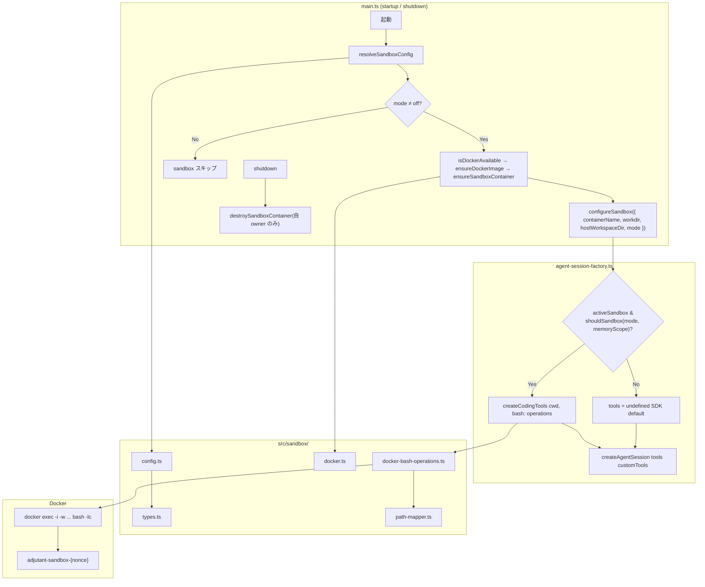
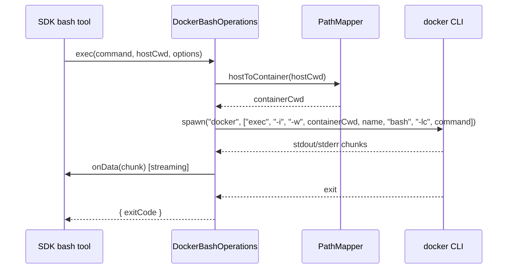

# 260222-s06-sandbox-bash-tool

## 1. 概要と目的 Overview and Purpose

### What

AI エージェントの bash ツール実行を Docker コンテナ内にサンドボックス化する。

### Why

現在 `createAgentSession` のデフォルト `bashTool` はホスト OS 上で直接コマンドを実行しており、エージェントの誤動作でホスト環境を破壊するリスクがある。Docker コンテナ内実行に切り替えることで、ホストへの影響を最小限に抑える。

### How

SDK の `createBashTool(cwd, { operations })` に備わる **`BashOperations` プラグイン機構** を使い、実行バックエンドだけを `docker exec` に差し替える。ツール全体の自作は不要。

```
SDK bash tool (スキーマ・出力整形)
    ↓ BashOperations.exec()
DockerBashOperations (docker exec 経由)
    ↓
Docker container (sleep infinity 常駐)
```

---

## 2. 仕様と受け入れ条件 Specification and Acceptance Criteria

### 2.1 スコープ Scope

- bash ツールの Docker コンテナ内実行（`bash -lc` で bash 互換保証）
- 1プロセス1コンテナ（その中で全セッション共有。owner label + nonce で所有権管理、複数プロセス同時起動対応）
- 環境変数による有効化 (`ADJUTANT_SANDBOX_MODE=non-main|all`)
- コンテナのライフサイクル管理（起動時 ensure、終了時は自プロセス所有のみ destroy）
- Dockerfile と build スクリプト（イメージビルド済み必須）

成果物:

- `src/sandbox/` — サンドボックスモジュール一式
- `tests/sandbox/` — ユニットテスト
- `Dockerfile.sandbox` — サンドボックスイメージ

### 2.2 非スコープ Non Scope

- read/write/edit/grep/find/ls のサンドボックス化（Phase 2）
- セッション単位のコンテナ分離（Phase 2）
- ツール allow/deny ポリシー（Phase 2）
- Registry / 自動 prune（Phase 2）
- PTY 対応、ブラウザサンドボックス
- seccomp / AppArmor プロファイル
- ネットワーク遮断（sandbox の主目的は破壊防止。ネットワークは bridge のまま）

### 2.3 ユースケース Use Cases

**正常系:**

1. `ADJUTANT_SANDBOX_MODE=all` で起動 → Docker コンテナが作成される → 全セッションの bash 実行がコンテナ内で行われる
2. `ADJUTANT_SANDBOX_MODE=non-main` で起動 → main セッションはホスト実行、spoke セッションのみコンテナ内実行
3. コンテナが既に起動中（同一 owner）→ そのまま再利用される
4. エージェントが `ls /workspace` 実行 → ホストのワークスペースファイルが見える
5. 複数 assistant プロセスが同時起動 → 各プロセスが独立したコンテナを作成・管理

**異常系:**

1. Docker デーモンが利用不可 → 起動時にエラーで停止（fail-safe）
2. Docker イメージが未ビルド → エラーメッセージ（`pnpm sandbox:build` を促す）で起動中断
3. コンテナ内コマンドがタイムアウト → `SIGKILL` で強制終了、エラー返却
4. `ADJUTANT_SANDBOX_MODE=off`（デフォルト）→ 従来通りホスト実行
5. 他プロセスの owner label を持つコンテナが同名で存在 → 名前衝突を検出し起動中断

### 2.4 受け入れ条件 Acceptance Criteria

1. **Given** sandbox mode = all, Docker 利用可能 **When** assistant 起動 **Then** コンテナが作成・起動され、bash ツール実行がコンテナ内で行われる
2. **Given** sandbox mode = non-main **When** main セッション **Then** ホスト上で bash 実行。spoke セッション **Then** コンテナ内で bash 実行
3. **Given** sandbox mode ≠ off, Docker 利用不可 **When** assistant 起動 **Then** エラーメッセージを出力して起動を中断する
4. **Given** sandbox mode = off **When** assistant 起動 **Then** 従来通りホスト上で bash ツールが実行される
5. **Given** sandbox モードでコマンド実行 **When** ホスト上で write ツールがファイル作成済み **Then** コンテナ内 bash からそのファイルが参照できる（bind mount）
6. **Given** sandbox モードでコマンド実行 **When** タイムアウト到達 **Then** プロセスが kill され、エラーが返る
7. **Given** SIGINT/SIGTERM **When** shutdown **Then** 自プロセスが作成したコンテナのみ `docker rm -f` で破棄される（owner label 検証）
8. **Given** 全テスト **When** `pnpm run check` **Then** Docker 不要で全パス

### 2.5 既知の制約 Known Limitations

- コンテナ内 `sandbox` ユーザー（UID 1000）で実行するため、bash で作成されたファイルのホスト側オーナーが UID 1000 になる。`docker create --user` と Dockerfile `USER` で UID を固定。
- ネットワークはデフォルト bridge（破壊防止が主目的）。`ADJUTANT_SANDBOX_NETWORK=none` で opt-in 遮断可能。
- 1プロセス内の全セッションがコンテナを共有するため、セッション間のファイルシステム分離はない。

---

## 3. 前提技術スタック Context and Tech Stack

- **Language/Framework:** TypeScript 5.x, ESM strict mode
- **Runtime:** Node.js 22+, Docker Engine
- **Libraries:** `@mariozechner/pi-coding-agent` v0.52.12 — `BashOperations` / `createCodingTools` / `createBashTool`
- **Style Guide:** Prettier (double quote, trailing comma es5, printWidth 100) + ESLint (`@typescript-eslint`)
- **Testing:** `node:test` (describe/it/mock)

---

## 4. インターフェース契約 Interface Contracts

### 4.1 環境変数（設定ファイル）

| 変数名                              | デフォルト                     | 説明                                               |
| ----------------------------------- | ------------------------------ | -------------------------------------------------- |
| `ADJUTANT_SANDBOX_MODE`             | `off`                          | `off` / `non-main` / `all`                         |
| `ADJUTANT_SANDBOX_IMAGE`            | `adjutant-sandbox:trixie-slim` | Docker イメージ名                                  |
| `ADJUTANT_SANDBOX_CONTAINER_PREFIX` | `adjutant-sandbox`             | コンテナ名接頭辞（実際の名前: `{prefix}-{nonce}`） |
| `ADJUTANT_SANDBOX_WORKDIR`          | `/workspace`                   | コンテナ内作業ディレクトリ                         |
| `ADJUTANT_SANDBOX_NETWORK`          | (未設定=bridge)                | Docker ネットワーク。`none` で遮断                 |
| `ADJUTANT_SANDBOX_MEMORY`           | (未設定=制限なし)              | メモリ制限 (例: `1g`)                              |
| `ADJUTANT_SANDBOX_PIDS_LIMIT`       | `256`                          | PID 制限                                           |

### 4.2 データモデルとスキーマ

```typescript
// src/sandbox/types.ts
export type SandboxMode = "off" | "non-main" | "all";

export type SandboxDockerConfig = {
  image: string;
  containerPrefix: string;
  workdir: string;
  readOnlyRoot: boolean;
  tmpfs: string[];
  network: string | undefined;
  capDrop: string[];
  pidsLimit: number | undefined;
  memory: string | undefined;
};

export type SandboxConfig = {
  mode: SandboxMode;
  docker: SandboxDockerConfig;
};
```

SDK の `BashOperations` インターフェース（準拠先）:

```typescript
// @mariozechner/pi-coding-agent — BashOperations
{
  exec: (
    command: string,
    cwd: string,
    options: {
      onData: (data: Buffer) => void;
      signal?: AbortSignal;
      timeout?: number;
      env?: NodeJS.ProcessEnv;
    }
  ) => Promise<{ exitCode: number | null }>;
}
```

### 4.3 エラーと例外 Error Handling

| ケース                             | 動作                                                                       |
| ---------------------------------- | -------------------------------------------------------------------------- |
| Docker デーモン未起動              | `isDockerAvailable()` が false → 起動中断（throw）                         |
| イメージ未ビルド                   | `docker inspect --type=image` 失敗 → エラー（`pnpm sandbox:build` を促す） |
| コンテナ名衝突（他プロセス owner） | `adjutant.sandbox.owner` ラベル不一致 → 起動中断（throw）                  |
| コンテナ作成失敗                   | 例外を throw → 起動中断                                                    |
| `docker exec` 失敗                 | `exitCode` を返却（bash ツールの通常エラー扱い）                           |
| タイムアウト                       | `SIGKILL` 送信、timeout エラー reject                                      |
| AbortSignal                        | `SIGKILL` 送信、aborted エラー reject                                      |

### 4.4 代表的な例 Examples

**例 1: Docker コンテナ作成コマンド**

```bash
docker create --name adjutant-sandbox-a1b2c3 \
  --label adjutant.sandbox=1 \
  --label adjutant.sandbox.owner=a1b2c3 \
  --read-only \
  --tmpfs /tmp --tmpfs /var/tmp --tmpfs /run \
  --cap-drop ALL \
  --security-opt no-new-privileges \
  --pids-limit 256 \
  --user 1000:1000 \
  --workdir /workspace \
  -v /host/workspace:/workspace \
  adjutant-sandbox:trixie-slim sleep infinity
```

**例 2: docker exec によるコマンド実行**

```bash
docker exec -i -w /workspace/subdir adjutant-sandbox-a1b2c3 bash -lc "ls -la"
```

**例 3: sandbox 無効（デフォルト）での起動**

```bash
# ADJUTANT_SANDBOX_MODE 未設定 → 従来通りホスト実行
pnpm assistant
```

---

## 5. アーキテクチャと設計図 Architecture and Diagrams

### 5.1 コンポーネント図



### 5.2 シーケンス図（bash 実行フロー）



### 5.3 sandbox 設定の注入方式

`agent-session-factory.ts` にモジュールレベルの `activeSandbox` 変数を持ち、`main.ts` から `configureSandbox()` で注入する。

```typescript
// agent-session-factory.ts
let activeSandbox: {
  containerName: string;
  workdir: string;
  hostWorkspaceDir: string;
  mode: SandboxMode;
} | null = null;

export function configureSandbox(
  config: {
    containerName: string;
    workdir: string;
    hostWorkspaceDir: string;
    mode: SandboxMode;
  } | null
): void {
  activeSandbox = config;
}

// セッション作成時の判定
function shouldSandbox(mode: SandboxMode, memoryScope: "main" | "spoke" | undefined): boolean {
  if (mode === "all") return true;
  if (mode === "non-main") return memoryScope !== "main";
  return false;
}
```

### 5.4 コンテナ所有権管理

起動時に短い UUID nonce（例: `crypto.randomUUID().slice(0,6)`）を生成し、コンテナ名とラベルに使用する。PID のみだと OS の PID 再利用で古い残骸コンテナと衝突するため、nonce で一意性を保証する。

```
起動時:
  nonce = crypto.randomUUID().slice(0, 6)   // 例: "a1b2c3"
  containerName = `${prefix}-${nonce}`
  docker create --label adjutant.sandbox.owner=${nonce} ...

shutdown 時:
  docker inspect → label adjutant.sandbox.owner === nonce ?
    → Yes: docker rm -f
    → No: skip (他プロセスのコンテナ)
```

この方式の理由:

- `AgentRunnerRuntime.createSession` のパラメータ追加が不要（既存インターフェース変更なし）
- nonce ベースの名前で複数プロセス・PID 再利用の衝突を回避
- owner label で他プロセスのコンテナを誤って破壊しない

---

## 6. テスト戦略 Test Strategy

### 6.1 テストの種類

**Unit:**

- `child_process.spawn` を `mock.fn()` でモックし、Docker 不要で全テスト実行
- 純粋関数（`buildSandboxCreateArgs`, `buildDockerExecArgs`, `hostToContainer`, `resolveSandboxConfig`, `shouldSandbox`）は入出力の検証のみ
- `ensureSandboxContainer` は spawn モック + 状態分岐をカバー

**Integration:**

- なし（Phase 1 では Docker 実環境テストは手動検証）

**Contract:**

- `BashOperations` インターフェースへの準拠は型レベルで保証（TypeScript strict）

### 6.2 カバレッジ対象

| ファイル                                       | 観点                                                                                                                                                                                                                 |
| ---------------------------------------------- | -------------------------------------------------------------------------------------------------------------------------------------------------------------------------------------------------------------------- |
| `tests/sandbox/config.test.ts`                 | デフォルト値、全 7 変数オーバーライド、空文字列→フォールバック、`SandboxMode` 3 値                                                                                                                                   |
| `tests/sandbox/path-mapper.test.ts`            | ルート変換、サブディレクトリ、workspace 外パス                                                                                                                                                                       |
| `tests/sandbox/docker.test.ts`                 | `buildSandboxCreateArgs` 引数（`--user 1000:1000`, owner label nonce 含む）、`ensureSandboxContainer` 分岐（新規/停止/running(自owner)/running(他owner)衝突）、`isDockerAvailable`、`ensureDockerImage`（存在/不在） |
| `tests/sandbox/docker-bash-operations.test.ts` | `buildDockerExecArgs` 引数（`bash -lc`）、正常終了/エラー終了/タイムアウト/AbortSignal、`shouldSandbox` の mode×scope マトリクス                                                                                     |

---

## 7. 実装タスクリスト Implementation Plan

### Phase 1: 設計と準備

- [x] 計画書を `doc/plan/260222-s06-sandbox-bash-tool.md` に作成
- [x] SDK 型（`BashOperations`, `createCodingTools`）のエクスポート確認済み

### Phase 2: 型定義と設定解決

- [x] **Test** `tests/sandbox/config.test.ts` — 環境変数からの設定解決テスト (Red)
  - `SandboxMode` 3 値（`off`/`non-main`/`all`）、不正値→`off` フォールバック
  - `containerPrefix`（旧 `containerName`）のデフォルトとオーバーライド
- [x] **Impl** `src/sandbox/types.ts` + `src/sandbox/config.ts` — 型定義と `resolveSandboxConfig()` (Green)
  - 再利用: `src/runtime/env-parsers.ts` の `parseStringEnv`, `parsePositiveIntEnv`

### Phase 3: パス変換

- [x] **Test** `tests/sandbox/path-mapper.test.ts` — ホスト↔コンテナパス変換テスト (Red)
- [x] **Impl** `src/sandbox/path-mapper.ts` — `createPathMapper()` → `{ hostToContainer(path) }` (Green)

### Phase 4: Docker 操作

- [x] **Test** `tests/sandbox/docker.test.ts` (Red)
  - `buildSandboxCreateArgs()` — `--user 1000:1000`, `--label adjutant.sandbox.owner=<nonce>`
  - `ensureSandboxContainer()` — 4 分岐: 新規作成 / 停止中→start / running(自owner)→再利用 / running(他owner)→エラー
  - `isDockerAvailable()`、`ensureDockerImage()` — 存在→OK / 不在→エラー（pull しない）
  - `destroySandboxContainer()` — owner label 一致時のみ rm -f
- [x] **Impl** `src/sandbox/docker.ts` — Docker CLI ラッパー群 (Green)

### Phase 5: BashOperations 実装

- [x] **Test** `tests/sandbox/docker-bash-operations.test.ts` (Red)
  - `buildDockerExecArgs()` — `bash -lc`（`sh` ではなく `bash`）
  - `shouldSandbox()` — mode×scope マトリクス
  - 正常終了/エラー終了/タイムアウト/AbortSignal
- [x] **Impl** `src/sandbox/docker-bash-operations.ts` — `BashOperations` 実装 (Green)

### Phase 6: ファクトリー統合

- [x] **Impl** `src/assistant/agent-session-factory.ts` — `configureSandbox()` + `shouldSandbox()` 追加、`createCodingTools` 分岐
  - heartbeat → `readOnlyTools`（変更なし）
  - `shouldSandbox(mode, memoryScope)` === true → `createCodingTools(cwd, { bash: { operations } })`
  - else → `undefined`（SDK デフォルト、変更なし）
- [x] **Impl** `src/runtime/app-runtime-config.ts` — `SandboxRuntimeConfig` 型追加
- [x] **Impl** `src/runtime/runtime-config-loader.ts` — `resolveSandboxConfig` 呼び出し追加

### Phase 7: ライフサイクル統合

- [x] **Impl** `src/assistant/main.ts`
  - 起動時: `mode ≠ off` → `isDockerAvailable()` → `ensureDockerImage()` → `ensureSandboxContainer(prefix, ownerNonce)` → `configureSandbox()`
  - shutdown 時: `destroySandboxContainer(containerName)` （owner label 検証付き）
- [x] **Impl** `Dockerfile.sandbox` — `apt-get install bash git curl jq ripgrep`, `USER 1000`
- [x] **Impl** `package.json` — `sandbox:build` スクリプト追加

### Phase 8: 検証と文書更新

- [x] `pnpm run check` 全パス
- [x] `CLAUDE.md` にサンドボックス環境変数 7 項目を追記

---

## 8. 完了の定義 Definition of Done

### 8.1 機能 DoD

- [ ] 受け入れ条件 8 項目がすべて満たされていること
- [ ] `ADJUTANT_SANDBOX_MODE=all` で bash 実行がコンテナ内で行われること
- [ ] `ADJUTANT_SANDBOX_MODE=non-main` で main はホスト、spoke はコンテナで実行されること
- [ ] `ADJUTANT_SANDBOX_MODE=off` で従来動作が維持されること
- [ ] Docker 未インストール環境で sandbox≠off 時にエラーで停止すること
- [ ] 複数プロセス起動時に互いのコンテナを破壊しないこと

### 8.2 品質 DoD

- [x] `pnpm run check` (format → typecheck → test) パス
- [x] Docker 不要で全テストパス
- [x] CLAUDE.md の環境変数テーブルが更新されていること

---

## 9. 懸念事項と未確定事項 Concerns and Questions

1. ~~**ファイルオーナーシップ:**~~ → **解決:** Dockerfile で `USER 1000`、docker create で `--user 1000:1000` を明示。ホスト側 UID との不一致が起きる環境では将来的に `--user $(id -u):$(id -g)` を検討。

2. **`createCodingTools` の内部ツール構成変化:** SDK アップデートで構成が変わった場合、`createCodingTools` 経由なら自動追従される。ただし新ツールが `BashOperations` に依存する場合は未検証。

3. ~~**PATH リセット問題:**~~ → **解決:** `bash -lc` を使用し bash 互換を保証。Dockerfile に bash をインストール。

4. ~~**イメージ自動ビルド vs 手動ビルド:**~~ → **解決:** イメージ未ビルド時は起動エラー（`pnpm sandbox:build` を促す）。自動 pull は行わない。

5. ~~**PID 再利用:**~~ → **解決:** owner を PID ではなく起動時 UUID nonce にすることで、PID 再利用による誤再利用を回避。

---

## 対象ファイル一覧

### 新規作成 (11 files)

| ファイル                                       | 目的                                                                  |
| ---------------------------------------------- | --------------------------------------------------------------------- |
| `src/sandbox/types.ts`                         | SandboxConfig 型定義（`SandboxMode = "off" \| "non-main" \| "all"`）  |
| `src/sandbox/config.ts`                        | 環境変数→設定解決 (`resolveSandboxConfig`)                            |
| `src/sandbox/docker.ts`                        | Docker CLI 操作（owner label 管理含む）                               |
| `src/sandbox/docker-bash-operations.ts`        | BashOperations 実装（`bash -lc`）+ `shouldSandbox()`                  |
| `src/sandbox/path-mapper.ts`                   | パス変換                                                              |
| `src/sandbox/index.ts`                         | sandbox モジュールの再エクスポート                                    |
| `tests/sandbox/config.test.ts`                 | 設定テスト                                                            |
| `tests/sandbox/path-mapper.test.ts`            | パス変換テスト                                                        |
| `tests/sandbox/docker.test.ts`                 | Docker 操作テスト（owner 衝突含む）                                   |
| `tests/sandbox/docker-bash-operations.test.ts` | BashOperations テスト + shouldSandbox テスト                          |
| `Dockerfile.sandbox`                           | サンドボックスイメージ（bash/git/curl/jq/rg インストール、USER 1000） |

### 既存修正 (7 files)

| ファイル                                      | 変更内容                                                                |
| --------------------------------------------- | ----------------------------------------------------------------------- |
| `src/assistant/agent-session-factory.ts`      | `configureSandbox()` + `shouldSandbox()` 追加、`createCodingTools` 分岐 |
| `src/runtime/app-runtime-config.ts`           | `SandboxRuntimeConfig` 型追加                                           |
| `src/runtime/runtime-config-loader.ts`        | sandbox 設定読み込み追加                                                |
| `src/assistant/main.ts`                       | 起動時コンテナ確保（owner label 付き）、shutdown 時自 owner のみ破棄    |
| `package.json`                                | `sandbox:build` スクリプト追加                                          |
| `CLAUDE.md`                                   | 環境変数テーブル追記                                                    |
| `tests/runtime/runtime-config-loader.test.ts` | sandbox 設定の読み込み検証ケース追加                                    |

---

## レビュー指摘対応サマリー

| #   | 指摘                                 | 対応                                                                                                                          |
| --- | ------------------------------------ | ----------------------------------------------------------------------------------------------------------------------------- |
| 1   | 共有コンテナ+固定名+rm -f で相互破壊 | コンテナ名を `{prefix}-{nonce}` に変更、`adjutant.sandbox.owner={nonce}` label で所有権管理、shutdown 時は自 owner のみ rm -f |
| 2   | `sh -lc` で bash 互換性回帰          | `bash -lc` に変更、Dockerfile に bash インストール                                                                            |
| 3   | デフォルト bridge が緩すぎる         | ユーザー確認: 主目的は破壊防止のみ→bridge 維持、`none` は opt-in                                                              |
| 4   | off/on だけで non-main がない        | `SandboxMode = "off" \| "non-main" \| "all"` に拡張、`shouldSandbox(mode, scope)` で判定                                      |
| 5   | auto-pull の再現性が弱い             | イメージ未ビルド時はエラーで起動中断。auto-pull 廃止                                                                          |
| 6   | ファイル所有者ポリシーが曖昧         | `docker create --user 1000:1000` + Dockerfile `USER 1000` を明示                                                              |
