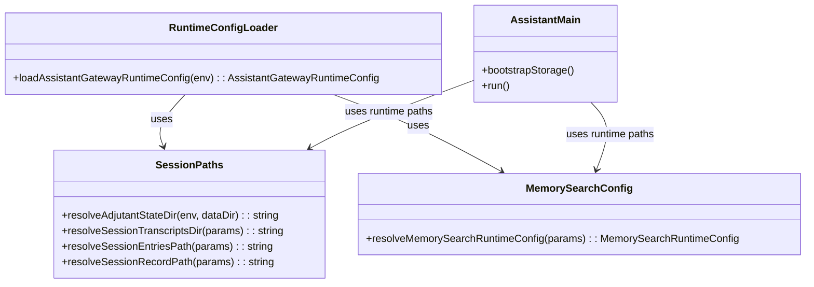
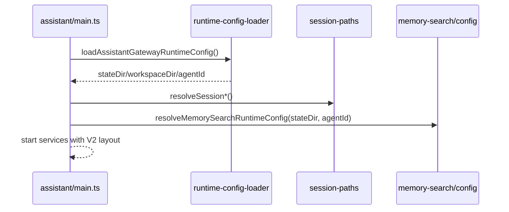

# 260223-s01-openclaw-storage-layout-alignment

## 1. 概要と目的 Overview and Purpose

### What

`adjutant` の永続ストレージ配置を `vendor/openclaw` の実装方針に寄せる。
具体的には、AI が読み書きする workspace と、セッション JSONL/メタデータ/インデックスなどの state を明確に分離する。

### Why

- 現状は `workspace` 配下に state 由来ファイルが混在し、openclaw の運用前提とズレる。
- セッション JSONL が workspace 近傍に存在すると、AI からの直接参照や accidental edit のリスクが上がる。
- ディレクトリ責務を openclaw に揃えることで、設計・運用・ドキュメントの整合が上がる。
- 未リリース段階のため、旧レイアウト互換を持たずクリーンブレイクできる。

### How

- `session-paths` と `runtime-config-loader` を起点に「保存場所契約」を再定義する。
- 既存 env 名は維持しつつ、デフォルト値と解決ロジックを openclaw 寄りに変更する。
- 旧パスの移行処理は実装せず、新レイアウトを唯一の正規パスとして扱う。

---

## 2. 仕様と受け入れ条件 Specification and Acceptance Criteria

### 2.1 スコープ Scope

- state/workspace の役割を次のように再定義する。
  - `workspace`: AI が作業するファイル（`AGENTS.md`, `MEMORY.md`, `memory/*.md`, skills など）
  - `state`: セッション履歴、セッションメタ、SQLite index、watermark、idempotency、timeline
- 既定パスの見直し。
  - `ADJUTANT_STATE_DIR` の既定を `~/.adjutant`（案）へ変更
  - `ADJUTANT_WORKSPACE_DIR` の既定を `~/.adjutant/workspace`（案）へ変更
- セッション関連パスの再配置。
  - transcript: `<stateDir>/agents/<agentId>/sessions/<sessionKey>.jsonl`
  - session entries: `<stateDir>/agents/<agentId>/sessions/sessions.json`
- memory search SQLite の既定パスを state 側へ移動。
  - `<stateDir>/memory/<agentId>.sqlite`
- recovery / summary / session store の参照先を新レイアウトに統一する。
- 仕様書・README のパス表を更新する。

成果物:

- `src/assistant/session-paths.ts` の path 契約更新
- `src/runtime/runtime-config-loader.ts` のデフォルト見直し
- `src/assistant/memory-search/config.ts` の DB 既定パス見直し
- `src/assistant/main.ts` の recovery 対象・初期化導線の調整
- テスト更新（runtime/session-paths/memory-search）
- `README.md`, `doc/spec.md` の反映

制約:

- Prototype First。後方互換は考慮しない（マイグレーション処理は入れない）。
- 既存 CI（`pnpm run check`）は必ず通す。

### 2.2 非スコープ Non Scope

- 旧ログファイルや既存ファイルの自動移行処理
- openclaw の全機能互換（multi-agent routing, auth profile, channel credentials 分離など）
- `qmd` backend 相当の導入
- state 配下ファイルの暗号化
- リモート同期/バックアップ機能

### 2.3 ユースケース Use Cases

正常系:

1. 初回起動時に `~/.adjutant` と `~/.adjutant/workspace` が作成され、セッション JSONL は state 側へ保存される。
2. AI エージェントは workspace 内の `MEMORY.md` / `memory/*.md` を読み書きできるが、session transcript は参照対象外となる。
3. memory search の SQLite は state 側 DB を使って検索できる。

異常系:

1. stateDir が書き込み不可の場合、起動時に明示的エラーで停止する（fail-fast）。
2. DB ファイルが壊れている場合、再作成（再インデックス）フローへフォールバックする。
3. 旧レイアウトのファイルが残っていても自動移行しない。必要なら手動で整理する。

### 2.4 受け入れ条件 Acceptance Criteria

1. Given env 未設定 When assistant 起動 Then session transcript は `workspace` ではなく `state/agents/<agentId>/sessions/` に作成される。
2. Given env 未設定 When assistant 起動 Then `sessions.json` は `state/agents/<agentId>/sessions/sessions.json` に作成される。
3. Given env 未設定 When memory_search 初期化 Then SQLite DB は `state/memory/<agentId>.sqlite` を使用する。
4. Given workspace 配下に `memory/sessions/*.jsonl` が存在しても When 通常起動 Then 参照対象は state 側のみとなる。
5. Given 旧パスにデータが残っている When 起動 Then 自動移行は行わず、warning を出さずに新パスで動作する。
6. Given `pnpm run check` When 実行 Then format/typecheck/test がすべて成功する。

### 2.5 既知の制約 Known Limitations

- 既定パスの変更は破壊的変更。旧レイアウトのデータは自動で引き継がれない。
- 既存データを使いたい場合は手動でファイルを移す必要がある。
- リリース前提でクリーンブレイクを採用しているため、将来リリース後は別途 migration 方針が必要。

---

## 3. 前提技術スタック Context and Tech Stack

- Language/Framework: TypeScript 5.x, Node.js ESM
- Runtime: Node.js 22+
- Persistence: JSONL + node:sqlite + sqlite-vec
- Style Guide: ESLint + Prettier（既存設定準拠）
- Testing: `node --test` + `tsx`

---

## 4. インターフェース契約 Interface Contracts

### 4.1 公開APIまたは外部 I/O 一覧

- 環境変数
  - `ADJUTANT_STATE_DIR`（既存）
  - `ADJUTANT_WORKSPACE_DIR`（既存）
  - `ADJUTANT_SESSION_TRANSCRIPTS_DIR`（既存 override）
  - `ADJUTANT_SESSION_ENTRIES_PATH`（既存 override）
  - `ADJUTANT_MEMORY_SEARCH_DB_PATH`（既存 override）
- 永続化パス（新契約）
  - Session transcript: `<stateDir>/agents/<agentId>/sessions/*.jsonl`
  - Session store: `<stateDir>/agents/<agentId>/sessions/sessions.json`
  - Memory index DB: `<stateDir>/memory/<agentId>.sqlite`
  - Timeline/Idempotency: `<stateDir>/timeline.jsonl`, `<stateDir>/idempotency.jsonl`（案）

### 4.2 データモデルとスキーマ

```ts
export type StorageLayoutV2 = {
  stateDir: string;
  workspaceDir: string;
  agentId: string;
  sessionsDir: string; // <stateDir>/agents/<agentId>/sessions
  sessionStorePath: string; // <sessionsDir>/sessions.json
  memoryIndexPath: string; // <stateDir>/memory/<agentId>.sqlite
};
```

バリデーション方針:

- 解決後パスは `resolve()` で絶対化。
- `agentId` は既存 sanitize ルールを継続。
- override が指定された場合は override を優先し、デフォルト契約変更の影響を受けない。

### 4.3 エラーと例外 Error Handling

- 起動前チェック
  - stateDir 作成不可: throw（起動中断）
  - workspaceDir 作成不可: throw（起動中断）
- DB
  - DB open 失敗: warning + 再作成フロー
  - sqlite-vec 不可: 既存の fallback 契約を継続

ログ方針:

- path は必要最小限のみ記録し、機密 payload は出力しない。

### 4.4 代表的な例 Examples

例1: デフォルト起動時の配置

```text
~/.adjutant/
  agents/main/sessions/
    sessions.json
    main.jsonl
  memory/main.sqlite

~/.adjutant/workspace/
  AGENTS.md
  MEMORY.md
  memory/2026-02-23.md
```

例2: 明示 override

```bash
ADJUTANT_STATE_DIR=/var/lib/adjutant/state \
ADJUTANT_WORKSPACE_DIR=/srv/adjutant/workspace \
pnpm run assistant
```

例3: 旧パスが残っているケース

```text
workspace/memory/sessions/main.jsonl   # 旧データ（参照されない）
state/agents/main/sessions/main.jsonl  # 現行で参照・追記される
```

---

## 5. アーキテクチャと設計図 Architecture and Diagrams

### 5.1 図の選択方針

- 保存先契約の再定義は複数モジュールに跨るため、クラス図を必須とする。
- 起動構成の解決フローを示すため、シーケンス図を追加する。

### 5.2 クラス図 Class Diagram



### 5.3 その他の図 Optional



---

## 6. テスト戦略 Test Strategy

### 6.1 テストの種類

- Unit
  - `session-paths`: 新既定値と sessions.json のネスト変更を検証
  - `memory-search/config`: DB 既定値が state 側になることを検証
- Integration
  - `runtime-config-loader` から main 初期化までのパス伝播
  - `main` の recovery/summarizer が state 側のみを参照することを検証
- Contract
  - env override 優先順位（既存契約）
  - session store 参照契約（`sessionEntriesPath`）

### 6.2 カバレッジ対象

- 重要ロジック
  - デフォルト path 解決
  - session/timeline/index の保存先統一
- エラー分岐
  - mkdir 失敗
  - DB open 失敗
- 境界条件
  - override 指定あり
  - 旧パスにファイルが存在

---

## 7. 実装タスクリスト Implementation Plan

### Phase 1 設計と準備

- [ ] 要件確定: openclaw 準拠レイアウトと adjutant 現行差分の最終確認
- [ ] 契約確定: V2 ストレージ契約（state/workspace 分離）を仕様化
- [ ] 図更新: 本計画の class/sequence をベースに実装図へ反映

### Phase 2 パス解決の Red/Green

- [ ] Test `tests/assistant/session-paths.test.ts` 追加/更新（Red）
  - `sessions.json` が `<sessionsDir>/sessions.json` になること
  - default state/workspace の分離
- [ ] Impl `src/assistant/session-paths.ts`（Green）
  - 新 default 契約
  - entries path のネスト修正
- [ ] Refactor path 組み立てロジックを重複排除

### Phase 3 Runtime 設定反映の Red/Green

- [ ] Test `tests/runtime/runtime-config-loader.test.ts`（Red）
  - 新 default path を検証
  - override 優先を維持
- [ ] Impl `src/runtime/runtime-config-loader.ts`, `src/runtime/app-runtime-config.ts`（Green）
  - timeline/idempotency を state 側へ移す（採用時）
- [ ] Refactor 設定解決ヘルパーを整理

### Phase 4 Memory DB パス変更の Red/Green

- [ ] Test `tests/assistant/memory-search-config.test.ts` 新規（Red）
  - DB 既定値 `<stateDir>/memory/<agentId>.sqlite`
- [ ] Impl `src/assistant/memory-search/config.ts`（Green）
  - `workspaceDir` 依存を縮小し state/agentId 依存へ
- [ ] Integration `memory_search` 初期化テスト更新

### Phase 5 サブシステム追従

- [ ] `src/assistant/markdown-summary-batch.ts` の input/recovery 対象を state のみに調整
- [ ] `src/assistant/main.ts` の recovery 対象から legacy workspace sessions を削除
- [ ] `src/assistant/session-entry-store.ts` の既定 path 契約を更新

### Phase 6 ドキュメント更新と検証

- [ ] `README.md` 更新（state/workspace と既定値）
- [ ] `doc/spec.md` 更新（保存パス）
- [ ] `pnpm run check` 実行
- [ ] 完了チェックを本計画へ反映

---

## 8. 完了の定義 Definition of Done

### 8.1 機能DoD Functional DoD

- [ ] 受け入れ条件 6 件を満たす
- [ ] セッション JSONL/メタ/SQLite index が state 配下へ統一される
- [ ] workspace には memory と bootstrap ファイルのみが残る

### 8.2 品質DoD Quality DoD

- [ ] すべての追加/更新テストがパスする
- [ ] `pnpm run check` が成功する
- [ ] 仕様書と README のパス表が実装と一致する

---

## 9. 懸念事項と未確定事項 Concerns and Questions

1. `ADJUTANT_STATE_DIR` の既定値を `~/.adjutant` に変えるか、現行の `<dataDir>/_assistant` を維持するか。
2. `timeline.jsonl` / `idempotency.jsonl` を state 側へ移すか（openclaw 寄せ）現状維持か。
3. 旧 `workspace/memory/sessions/*.jsonl` を無視する方針を `doc/spec.md` にどこまで明示するか。
4. 既存手動運用スクリプトが旧パスを参照している場合、告知のみで十分か。
