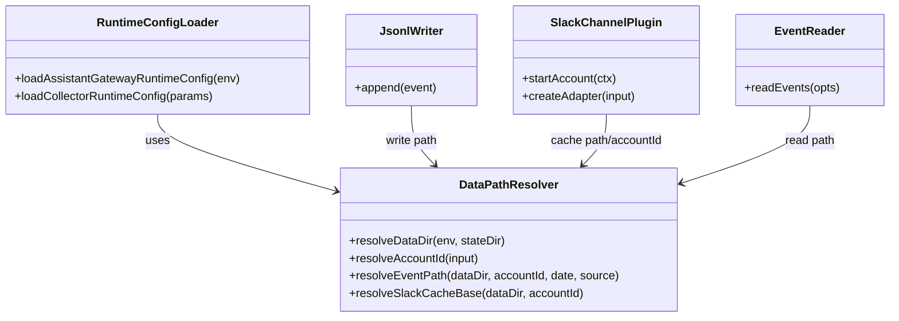
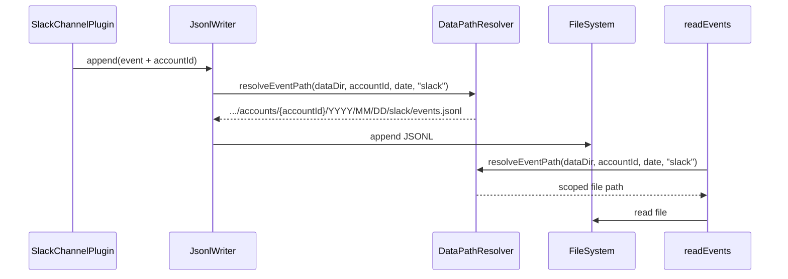

# 260223-s02-user-scoped-account-data-layout

## 0. 基本原則 Core Principles

- Prototype First
  - 本変更はプロトタイプ前提として、旧 `data/YYYY/MM/DD/...` レイアウトとの後方互換・自動移行は実装しない。
  - ただし、既存CIや公開env契約を壊さないよう、env名は維持しデフォルト値と保存先契約のみを変更する。
- SOLID
  - path解決、設定解決、I/O責務を分離し、各モジュールの単一責務を維持する。
  - `readEvents` と writer の契約変更は、呼び出し側へ明示的に伝播させる。
- KISS
  - 保存先は `accounts/<accountId>/...` の単純な規則で統一し、暗黙フォールバックや複雑な探索ロジックを持ち込まない。
- YAGNI
  - 今回は Slack の account 分離に限定し、multi-account横断検索や保持期間制御は実装しない。
- DRY
  - account/path 正規化ロジックを共通化し、writer/reader/pluginで重複した文字列結合を避ける。

## 1. 概要と目的 Overview and Purpose

### What

`data` 保存レイアウトを「workspace 依存」から「ユーザー(state) 依存」へ変更し、Slack 収集データを `accountId` 単位で分離する。

### Why

- 収集データの主体はプロジェクトではなくユーザー権限である。
- 複数 workspace で同じ連携先データを再利用しやすくなる。
- `accountId` 単位で分離しないと、複数連携時に events/caches が混在し運用事故の原因になる。
- openclaw 準拠の「workspace と state の責務分離」を `data` にも徹底できる。

### How

- `ADJUTANT_DATA_DIR` / `DATA_DIR` のデフォルトを `<stateDir>/data` に寄せる。
- Slack 永続化パスを `data/accounts/<accountId>/...` 構造へ変更する。
- 読み取り (`readEvents`) も `accountId` スコープで解決する。
- 旧レイアウト互換は持たず、プロトタイプ方針でクリーンブレイクする。

---

## 2. 仕様と受け入れ条件 Specification and Acceptance Criteria

### 2.1 スコープ Scope

今回やること:

- `dataDir` 既定値の変更
  - Collector: `DATA_DIR` 未指定時 `~/.adjutant/data`
  - Assistant: `ADJUTANT_DATA_DIR` 未指定時 `~/.adjutant/data`
- Slack events 保存先の account 分離
  - `<dataDir>/accounts/<accountId>/YYYY/MM/DD/slack/events.jsonl`
- Slack cache 保存先の account 分離
  - `<dataDir>/accounts/<accountId>/_cache/slack/channel-names-by-team/{teamId}.json`
  - `<dataDir>/accounts/<accountId>/_cache/slack/user-names-by-team/{teamId}.json`
- イベント書き込み時の `meta.account_id` 明示
  - ルーティング/読取双方で account の一貫性を担保
- `readEvents` の account スコープ対応
  - `ReadEventsOptions` に `accountId` を追加
  - 未指定時は `ADJUTANT_SLACK_ACCOUNT_ID`（既定 `default`）を利用
- JSONL recovery 対象の確認
  - `<dataDir>/accounts/**` を自然に走査できること
- 仕様書とファイルパス文書の更新

成果物:

- `src/runtime/config.ts`
- `src/runtime/runtime-config-loader.ts`
- `src/io/jsonlWriter.ts`
- `src/proactive/slack-channel-plugin.ts`
- `src/assistant/event-reader.ts`
- `src/assistant/heartbeat-runner.ts`（readEvents 呼び出しへ accountId 伝播）
- テスト更新（runtime/io/assistant/proactive）
- `doc/spec.md` / `doc/file-paths.md` 更新

制約:

- Prototype First として後方互換・移行処理は実装しない。
- 公開 API 互換（既存 env 名）は維持し、デフォルト値と保存契約のみ変更する。

### 2.2 非スコープ Non Scope

- 旧 `data/YYYY/MM/DD/...` の自動移行
- 複数 `accountId` 横断の集約検索機能
- GitHub/git-local など Slack 以外ソースの account 分離拡張
- データ暗号化、リモート同期、保持期間管理 UI

### 2.3 ユースケース Use Cases

正常系:

1. env 未指定で起動すると、events は `~/.adjutant/data/accounts/default/...` に保存される。
2. `ADJUTANT_SLACK_ACCOUNT_ID=work` で起動すると、`accounts/work/...` に保存・参照される。
3. `accountA` と `accountB` を並行運用しても events/caches がディレクトリ分離される。

重要な異常系:

1. `accountId` が空文字の場合は `default` にフォールバックする。
2. 旧レイアウトのみ存在する環境では、readEvents は空を返す（旧パスを読まない）。
3. `ADJUTANT_DATA_DIR` を明示指定した場合は新既定値より優先する。

### 2.4 受け入れ条件 Acceptance Criteria

1. Given `ADJUTANT_DATA_DIR` 未指定 When assistant 起動 Then `app.assistant.dataDir` は `<stateDir>/data` になる。
2. Given `DATA_DIR` 未指定 When collector 起動 Then writer は `<stateDir>/data/accounts/default/.../events.jsonl` へ書き込む。
3. Given `ADJUTANT_SLACK_ACCOUNT_ID=work` When Slack event 保存 Then 出力先は `<dataDir>/accounts/work/...` になる。
4. Given `accountA` と `accountB` のイベント When 同日保存 Then それぞれ別ファイルへ保存され、同一ファイルへ混在しない。
5. Given `readEvents({ dataDir, accountId: "work" })` When 実行 Then `accounts/work` 配下のみを読み、他 account は返さない。
6. Given `pnpm run check` When 実行 Then format/typecheck/test が成功する。

### 2.5 既知の制約 Known Limitations

- 旧レイアウトから自動移行しないため、既存データを使うには手動移設が必要。
- 初期段階は `readEvents` を単一 account スコープに限定する（横断集約は将来検討）。
- accountId の命名規則は既存 sanitize 方針に従うため、表示名と完全一致しない場合がある。

---

## 3. 前提技術スタック Context and Tech Stack

- Language/Framework: TypeScript 5.x, Node.js ESM
- Runtime: Node.js 22+
- Persistence: JSONL（正本）, SQLite（検索インデックス）
- Style Guide: 既存 ESLint + Prettier に準拠
- Testing: `node --test` + `tsx`（既存 `pnpm run check`）

---

## 4. インターフェース契約 Interface Contracts

### 4.1 公開APIまたは外部 I/O 一覧

- 環境変数
  - `ADJUTANT_STATE_DIR`（既存）
  - `ADJUTANT_DATA_DIR`（既存、既定値変更）
  - `DATA_DIR`（collector 側、既定値変更）
  - `ADJUTANT_SLACK_ACCOUNT_ID`（既存、既定 `default`）
- 永続化ストレージ
  - events: `<dataDir>/accounts/<accountId>/YYYY/MM/DD/slack/events.jsonl`
  - cache: `<dataDir>/accounts/<accountId>/_cache/slack/...`
  - debug log: `<dataDir>/_debug/*.jsonl`（今回変更なし）

### 4.2 データモデルとスキーマ

```ts
export type AccountScopedDataPathInput = {
  dataDir: string;
  accountId: string;
  dateKey: string; // YYYY-MM-DD
  source: "slack" | "github" | "git-local";
};

export type ReadEventsOptions = {
  dataDir: string;
  accountId?: string; // 未指定時は defaultAccountId
  date?: string;
  timezone?: string;
  kinds?: string[];
  channels?: string[];
  sinceMinutes?: number;
  limit?: number;
};
```

バリデーション方針:

- `accountId` は trim + sanitize。空なら `default`。
- path 解決は `resolve()` / `join()` を使用し、手書き文字列結合を禁止。
- 旧レイアウトへのフォールバック読取は実装しない。

### 4.3 エラーと例外 Error Handling

- 設定解決
  - 不正/空 `accountId`: warning を出さず `default` フォールバック
- I/O
  - `ENOENT`: 現行どおりスキップ（readEvents は空配列）
  - JSONL 破損行: 現行どおりスキップ
- ログ
  - accountId, path は出力可
  - イベント payload 本文は不要に出力しない

### 4.4 代表的な例 Examples

例1: デフォルト起動

```text
~/.adjutant/data/
  accounts/default/
    2026/02/23/slack/events.jsonl
    _cache/slack/channel-names-by-team/Txxx.json
    _cache/slack/user-names-by-team/Txxx.json
  _debug/cdp-events.jsonl
```

例2: account 指定起動

```bash
ADJUTANT_SLACK_ACCOUNT_ID=work \
ADJUTANT_DATA_DIR=$HOME/.adjutant/data \
pnpm run assistant
```

例3: account 切替で分離保存

```text
accounts/work/2026/02/23/slack/events.jsonl
accounts/private/2026/02/23/slack/events.jsonl
```

---

## 5. アーキテクチャと設計図 Architecture and Diagrams

### 5.1 図の選択方針

- 複数モジュール（runtime/io/proactive/assistant）に跨るためクラス図を必須とする。
- 読み書きの非同期フロー確認のためシーケンス図を追加する。

### 5.2 クラス図 Class Diagram



### 5.3 その他の図 Optional



---

## 6. テスト戦略 Test Strategy

### 6.1 テストの種類

- Unit
  - `runtime/config` と `runtime-config-loader` の既定値解決
  - `jsonlWriter` の出力パス解決（account 分離）
  - `event-reader` の account スコープ読取
- Integration
  - `slack-channel-plugin` で accountA/accountB の保存先分離
  - `heartbeat-runner` が指定 account の events を参照すること
- Contract
  - env override の優先順位（既存契約）
  - 旧レイアウト非互換（フォールバックしない）を固定化

### 6.2 カバレッジ対象

- 重要ロジック
  - accountId sanitize + fallback
  - dataDir default の state 依存解決
- エラー分岐
  - ENOENT, 破損 JSONL
- 境界条件
  - 空 accountId
  - 複数 account 同日書き込み

---

## 7. 実装タスクリスト Implementation Plan

### Phase 1 設計と準備

- [x] 要件と仕様の確定（本計画の契約・非互換方針の確定）
- [x] `accountId` 正規化ルールと path 契約の確定
- [x] Mermaid 図の最終化
- [x] 影響ファイル一覧の確定（runtime/io/proactive/assistant/tests/docs）
- [x] テスト基盤確認（既存テストの更新方針を確定）

### Phase 2 データパス契約の実装

- [x] Test `runtime/config` と `runtime-config-loader` の失敗テスト追加（既定値変更の Red）
- [x] Impl `dataDir` 既定値を `<stateDir>/data` へ変更（Green）
- [x] Refactor path 解決ロジックを共通化（必要なら `data-paths.ts` 新設）
- [x] Integration collector/assistant 双方で同じ既定値契約になることを検証
- [x] Docs `doc/spec.md` / `doc/file-paths.md` のパス表更新

### Phase 3 account 分離保存と読取の実装

- [x] Test `jsonlWriter`/`slack-channel-plugin` の account 分離保存テスト追加（Red）
- [x] Impl events と cache の保存先を `accounts/<accountId>` 化（Green）
- [x] Test `event-reader` の account スコープ読取テスト追加（Red）
- [x] Impl `readEvents` に `accountId` オプション追加、`heartbeat-runner` へ伝播（Green）
- [x] Refactor `meta.account_id` の付与責務を整理し重複を除去

### Phase 4 統合と検証

- [x] 全体テストの実行（`pnpm run check`）
- [x] エッジケース確認（空 accountId、複数 account 同日、ENOENT）
- [x] ログ/例外確認（不要ログがないこと）
- [x] ドキュメント最終更新（仕様・契約・図・既知制約）

---

## 8. 完了の定義 Definition of Done

### 8.1 機能DoD Functional DoD

- [x] 受け入れ条件 1-6 を満たす
- [x] 保存先が user(state) 配下かつ account 分離になっている
- [x] 旧レイアウト非互換方針が仕様書に明記されている

### 8.2 品質DoD Quality DoD

- [x] `pnpm run check` が成功
- [x] Linter/Formatter エラーなし
- [x] テストが新契約を破壊的変更から保護している
- [x] 主要変更が `doc/spec.md` と `doc/file-paths.md` に反映済み

---

## 9. 懸念事項と未確定事項 Concerns and Questions

- Collector 単体起動時の `accountId` 決定源を `ADJUTANT_SLACK_ACCOUNT_ID` に統一して問題ないか。
- `readEvents` を将来 multi-account 集約対応する際の API 形（`accountIds: string[]` 追加など）をどうするか。
- account 増加時のディスク使用量増加に対する保持期間ポリシーは別タスクで定義が必要。
- 既存ローカルデータの手動移設手順を README にどこまで記載するか（実装はしない）。
