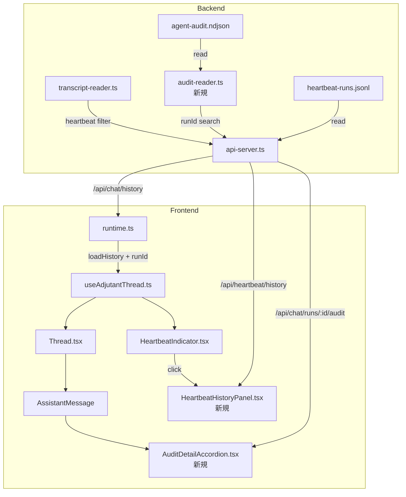
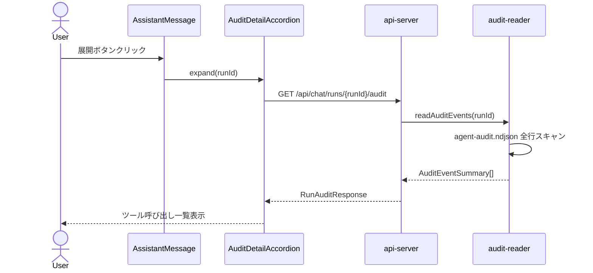
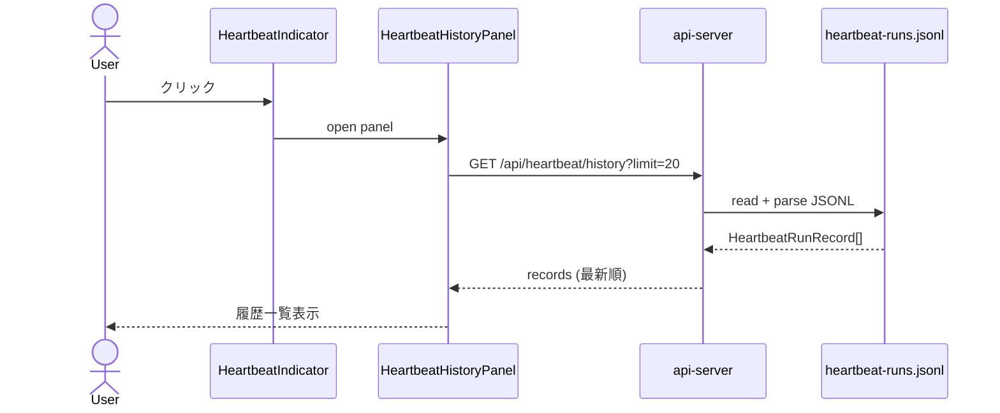

# 260223-s04: チャットUI改善 — Heartbeatターン非表示 & コマンド実行詳細展開

## 1. 概要と目的 Overview and Purpose

- **What**
  チャットUIにおいて (A) Heartbeat由来のターンをメインチャットから除外し、別パネルで確認可能にする (B) AIエージェントのコマンド実行詳細を監査ログから取得し、チャット上でクリック展開表示する

- **Why**
  Heartbeatターンがユーザーとの対話に混ざり、会話の可読性が低下している。またAIエージェントが実行したツール呼び出しの内容を即座に確認できず、透明性が不足している

- **How**
  - バックエンド: トランスクリプト読み込み時に heartbeat 由来メッセージをフィルタリングし、Heartbeat履歴専用APIとAudit取得APIを追加
  - フロントエンド: メッセージに `runId` を紐付け、assistant メッセージにツール実行詳細の展開UIを追加。HeartbeatIndicator にクリックで開く履歴パネルを追加

## 2. 仕様と受け入れ条件 Specification and Acceptance Criteria

### 2.1 スコープ Scope

- **今回やること**
  1. トランスクリプトからの heartbeat ターン除外ロジック
  2. Heartbeat 履歴一覧 API (`GET /api/heartbeat/history`)
  3. Audit ログ runId 検索 API (`GET /api/chat/runs/:runId/audit`)
  4. メッセージモデルへの `runId` 伝搬（リアルタイムストリーム＋履歴復元）
  5. Heartbeat 履歴パネル UI コンポーネント
  6. ツール実行詳細アコーディオン UI コンポーネント

- **成果物**
  - `src/assistant/transcript-reader.ts` — heartbeat フィルタ追加
  - `src/assistant/audit-reader.ts` — 新規：audit ログの runId 検索
  - `src/assistant/api-server.ts` — 2つの API エンドポイント追加
  - `src/ui/runtime.ts` — RuntimeMessage に runId 追加、履歴ロード拡張
  - `src/ui/components/HeartbeatHistoryPanel.tsx` — 新規
  - `src/ui/components/AuditDetailAccordion.tsx` — 新規
  - `src/ui/components/Thread.tsx` — AssistantMessage に展開ボタン追加
  - `src/ui/components/HeartbeatIndicator.tsx` — クリックでパネル開閉
  - テスト群

- **制約**
  - pi-coding-agent SDK のトランスクリプト形式は変更不可（SDK外部）
  - audit ログファイルの全行スキャンが必要（インデックスなし）

### 2.2 非スコープ Non Scope

- audit ログのインデックス化・DB 化
- Heartbeat ターンの完全削除（トランスクリプトからは削除せず、UI 表示のみフィルタ）
- ツール実行結果の編集・再実行機能
- Heartbeat 設定変更 UI

### 2.3 ユースケース Use Cases

**UC-1: ユーザーがチャット履歴を確認する**
→ Heartbeat ターンが混ざらず、ユーザー対話のみが表示される

**UC-2: ユーザーが直近の Heartbeat を確認する**
→ HeartbeatIndicator をクリック → パネルが開き、直近 N 件の heartbeat 結果（時刻、ステータス、プレビュー、所要時間）が一覧表示される

**UC-3: ユーザーがAIの実行詳細を確認する**
→ assistant メッセージの展開ボタンをクリック → ツール呼び出し一覧（ツール名、引数、結果サマリ、所要時間、ステータス）がアコーディオン表示される

**UC-4（異常系）: audit ログが存在しない/runId が見つからない**
→ 「実行詳細なし」と表示、エラーにはしない

### 2.4 受け入れ条件 Acceptance Criteria

1. **Given** メインセッションに heartbeat ターンと通常会話が混在するトランスクリプト
   **When** `/api/chat/history?sessionKey=main` を取得する
   **Then** heartbeat 由来のメッセージが含まれない

2. **Given** heartbeat-runs.jsonl に 5 件以上の結果がある
   **When** `GET /api/heartbeat/history?limit=10` を呼ぶ
   **Then** 最新から最大 10 件の `HeartbeatRunRecord` が返る

3. **Given** agent-audit.ndjson に runId=`run-abc` のツールイベントがある
   **When** `GET /api/chat/runs/run-abc/audit` を呼ぶ
   **Then** 該当 runId の `tool.start`/`tool.end` イベントが時系列で返る

4. **Given** リアルタイムストリーミング中の assistant メッセージ
   **When** ストリーム完了後にUIに表示される
   **Then** メッセージに紐づく runId で展開ボタンが有効になる

5. **Given** HeartbeatIndicator をクリック
   **When** パネルが開く
   **Then** 直近の heartbeat 結果リストが表示される

6. **Given** audit ログに該当 runId が存在しない
   **When** 展開ボタンをクリック
   **Then** 「実行詳細はありません」が表示される

### 2.5 既知の制約 Known Limitations

- **Heartbeat 判定精度**: トランスクリプト行自体に `isHeartbeat` フラグがないため、`runId` の `hb-` プレフィックスで判定する。SDK が runId をトランスクリプトに記録しない場合、ユーザープロンプトの内容パターンマッチにフォールバックする
- **Audit 検索性能**: ファイル全行スキャンのため、ログが大きくなると遅延する。プロトタイプ段階では許容する
- **履歴復元時の runId**: pi-coding-agent SDK のトランスクリプト形式次第で、履歴メッセージに runId を紐付けられない可能性がある。その場合、履歴メッセージの展開ボタンは非表示とする

## 3. 前提技術スタック Context and Tech Stack

- **Language/Framework**: TypeScript 5.x, ESM
- **Backend**: Node.js, `node:http`
- **Frontend**: React 19, `@assistant-ui/react`, Tailwind CSS, Lucide Icons
- **Libraries**: `@mariozechner/pi-coding-agent` (SDK)
- **Style Guide**: 既存 ESLint + Prettier 設定準拠
- **Testing**: `node:test` (`describe`, `it`, `mock`)

## 4. インターフェース契約 Interface Contracts

### 4.1 公開 API

#### `GET /api/chat/history?sessionKey={key}`（既存・変更）

レスポンスの `messages` 配列から heartbeat 由来メッセージを除外する。
各メッセージに `runId` フィールドを追加（取得可能な場合）。

```typescript
type HistoryMessage = {
  role: "user" | "assistant" | "system";
  content: string | Array<{ type: string; text: string }>;
  timestamp?: number;
  runId?: string;       // 新規追加
};
```

#### `GET /api/heartbeat/history?limit={n}` （新規）

```typescript
// Response
type HeartbeatHistoryResponse = {
  records: HeartbeatRunRecord[];
};
```

- `limit`: 省略時デフォルト 20、最大 100
- 最新順（降順）で返す

#### `GET /api/chat/runs/:runId/audit` （新規）

```typescript
// Response
type RunAuditResponse = {
  runId: string;
  events: AuditEventSummary[];
};

type AuditEventSummary = {
  type: "tool.start" | "tool.end" | "run.start" | "run.end" | "file.read" | "file.write";
  ts: string;
  toolName?: string;
  toolCallId?: string;
  args?: unknown;
  resultSummary?: unknown;
  status?: string;
  durationMs?: number;
  truncated?: boolean;
  path?: string;
  operation?: string;
  error?: string;
};
```

- 該当 runId なし → `{ runId, events: [] }` (200)
- audit ログファイルなし → `{ runId, events: [] }` (200)

### 4.2 データモデルとスキーマ

**RuntimeMessage 拡張**:

```typescript
type RuntimeMessage = {
  role: "user" | "assistant";
  content: string;
  timestamp: number;
  runId?: string;  // 新規追加
};
```

### 4.3 エラーと例外 Error Handling

- audit ファイル読み込みエラー → 空配列を返す、warn ログ出力
- heartbeat-runs.jsonl 読み込みエラー → 空配列を返す、warn ログ出力
- 不正な JSON 行 → スキップ、warn ログ出力
- limit パラメータ不正 → デフォルト値を使用

### 4.4 代表的な例 Examples

**Heartbeat 履歴取得:**
```
GET /api/heartbeat/history?limit=5
→ 200
{
  "records": [
    {
      "schema": "adjutant.heartbeat.result.v1",
      "runAt": "2026-02-23T10:30:00.000Z",
      "sessionKey": "main",
      "result": { "status": "ran", "durationMs": 3200 },
      "triggerReason": "scheduled",
      "preview": "特に対応が必要な通知はありません"
    }
  ]
}
```

**Audit 詳細取得:**
```
GET /api/chat/runs/run-abc123/audit
→ 200
{
  "runId": "run-abc123",
  "events": [
    {
      "type": "tool.start",
      "ts": "2026-02-23T10:00:01.000Z",
      "toolName": "bash",
      "args": { "command": "ls -la" }
    },
    {
      "type": "tool.end",
      "ts": "2026-02-23T10:00:02.500Z",
      "toolName": "bash",
      "status": "ok",
      "durationMs": 1500,
      "resultSummary": "total 24\ndrwxr-xr-x ..."
    }
  ]
}
```

## 5. アーキテクチャと設計図 Architecture and Diagrams

### 5.1 コンポーネント図



### 5.2 シーケンス図: ツール実行詳細展開



### 5.3 シーケンス図: Heartbeat 履歴表示



## 6. テスト戦略 Test Strategy

### 6.1 テストの種類

- **Unit**
  - `audit-reader.ts`: JSONL パース、runId フィルタ、不正行スキップ、空ファイル
  - `transcript-reader.ts`: heartbeat フィルタロジック（`hb-` プレフィックス判定、フォールバックパターン判定）
  - `api-server.ts`: 新エンドポイントのルーティングとレスポンス形式
  - `runtime.ts`: RuntimeMessage の runId 伝搬

- **Integration**
  - API → audit-reader → ファイル読み込みの一気通貫テスト
  - API → heartbeat-runs.jsonl 読み込みの一気通貫テスト

### 6.2 カバレッジ対象

- heartbeat 判定ロジックの正確性（hb- プレフィックスあり/なし、通常メッセージの誤判定なし）
- audit 検索の runId 一致/不一致
- JSONL パーサーの壊れた行ハンドリング
- limit パラメータの境界値（0, 1, max, 超過）

## 7. 実装タスクリスト Implementation Plan

### Phase 1: 設計と準備

- [ ] 要件と仕様の確定（本計画書の承認）
- [ ] トランスクリプト行に runId が含まれるか SDK 動作を実機確認
- [ ] インターフェース型定義の作成

### Phase 2: Heartbeat フィルタ＋履歴 API

- [ ] Test: `transcript-reader` の heartbeat フィルタテスト作成（Red）
- [ ] Impl: `loadMessages()` に heartbeat 判定・除外ロジック追加（Green）
- [ ] Test: `audit-reader` の JSONL 読み込み＋ runId フィルタテスト作成（Red）
- [ ] Impl: `src/assistant/audit-reader.ts` 新規作成（Green）
- [ ] Test: `GET /api/heartbeat/history` のテスト作成（Red）
- [ ] Impl: `api-server.ts` に heartbeat 履歴エンドポイント追加（Green）
- [ ] Test: `GET /api/chat/runs/:runId/audit` のテスト作成（Red）
- [ ] Impl: `api-server.ts` に audit エンドポイント追加（Green）
- [ ] Refactor: 共通 JSONL リーダーユーティリティの抽出（必要に応じて）

### Phase 3: メッセージモデル runId 伝搬

- [ ] Impl: `StreamEvent` → `runtime.ts` での runId 保持ロジック追加
- [ ] Impl: `/api/chat/history` レスポンスへの runId 付与（可能な範囲）
- [ ] Impl: `useAdjutantThread` の `ThreadMessageLike` に `metadata.runId` を含める

### Phase 4: フロントエンド UI

- [ ] Impl: `HeartbeatHistoryPanel.tsx` 新規作成（パネルUI、API呼び出し、一覧表示）
- [ ] Impl: `HeartbeatIndicator.tsx` にクリックハンドラ追加、パネル開閉制御
- [ ] Impl: `AuditDetailAccordion.tsx` 新規作成（展開UI、API呼び出し、ツール一覧）
- [ ] Impl: `Thread.tsx` の `AssistantMessage` にアコーディオン組み込み
- [ ] Refactor: スタイル調整、レスポンシブ対応

### Phase 5: 統合と検証

- [ ] 全体テストの実行 (`pnpm run check`)
- [ ] 実機動作確認（heartbeat 混在トランスクリプトでの表示）
- [ ] エッジケース確認（audit ログなし、heartbeat ログなし、大量データ）
- [ ] CLAUDE.md の環境変数テーブル更新（必要な場合）

## 8. 完了の定義 Definition of Done

### 8.1 機能 DoD Functional DoD

- [ ] チャット履歴に heartbeat ターンが表示されない
- [ ] HeartbeatIndicator クリックで直近の heartbeat 結果が確認できる
- [ ] assistant メッセージからツール実行詳細が展開表示できる
- [ ] audit ログ/heartbeat ログが存在しない場合もエラーにならない

### 8.2 品質 DoD Quality DoD

- [ ] 全てのテストがパスしている
- [ ] Linter/Formatter のエラーがない
- [ ] 不要なデバッグコードが削除されている

## 9. 懸念事項と未確定事項 Concerns and Questions

1. **トランスクリプト行の runId 有無**: pi-coding-agent SDK がトランスクリプト JSONL に `runId` を書き込むかは実機確認が必要。書き込まない場合、heartbeat 判定はプロンプト内容のパターンマッチに依存し精度が下がる。履歴メッセージの runId 紐付けも不可能になる

2. **Audit ファイルサイズ**: 長期運用で `agent-audit.ndjson` が肥大化した場合、全行スキャンが遅くなる。将来的にはファイルローテーションまたは runId インデックスが必要になる可能性がある

3. **Heartbeat のセッションキー**: heartbeat-runner の `sessionKey` が `"main"` 以外の場合、フィルタ対象のセッションが異なる。現状の heartbeat-runner 実装を確認した限り、設定次第で変わりうる

4. **@assistant-ui/react のメッセージメタデータ**: `ThreadMessageLike` に `metadata` としてカスタムデータ（runId）を渡せるか、ライブラリ側の制約確認が必要。渡せない場合は外部ステートで管理する
