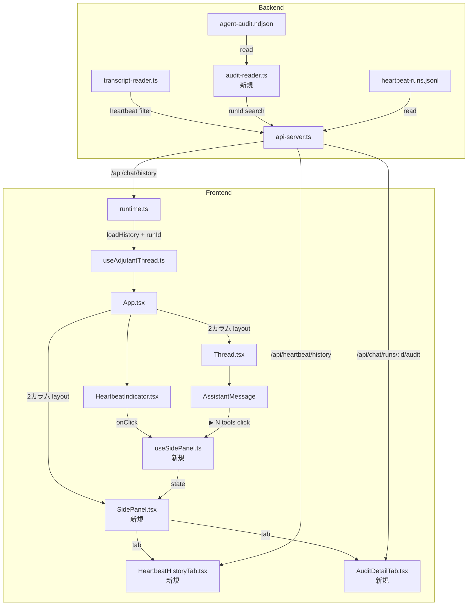
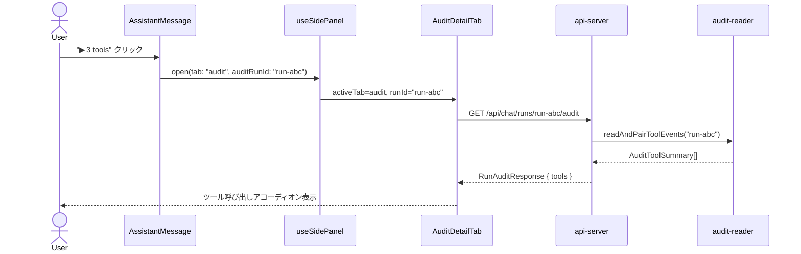
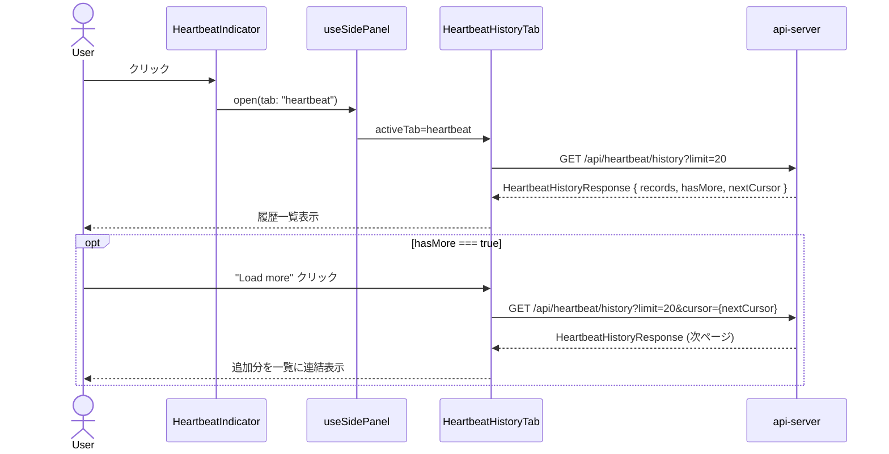

# 260223-s04: チャットUI改善 — Heartbeatターン非表示 & 汎用サイドパネル & コマンド実行詳細

## 1. 概要と目的 Overview and Purpose

- **What**
  チャットUIにおいて (A) Heartbeat由来のターンをメインチャットから除外する (B) 画面右側に汎用サイドパネル（タブ切替式）を設け、Heartbeat履歴タブとAudit詳細タブを配置する (C) チャット内のassistantメッセージからワンクリックでサイドパネルのAuditタブに遷移し、実行詳細を確認できるようにする

- **Why**
  Heartbeatターンがユーザーとの対話に混ざり、会話の可読性が低下している。またAIエージェントが実行したツール呼び出しの内容を即座に確認できず、透明性が不足している

- **How**
  - バックエンド: トランスクリプト読み込み時に heartbeat 由来メッセージをフィルタリングし、Heartbeat履歴APIとAudit取得APIを追加
  - フロントエンド: 画面右側にタブ切替式サイドパネルを新設。HeartbeatIndicatorクリックでパネルのHeartbeatタブを開く。assistantメッセージのツール件数クリックでAuditタブに切り替わり実行詳細を表示する

## 2. 仕様と受け入れ条件 Specification and Acceptance Criteria

### 2.1 スコープ Scope

- **今回やること**
  1. トランスクリプトからの heartbeat ターン除外ロジック
  2. Heartbeat 履歴一覧 API (`GET /api/heartbeat/history`)
  3. Audit ログ runId 検索 API (`GET /api/chat/runs/:runId/audit`)
  4. メッセージモデルへの `runId` 伝搬（リアルタイムストリーム＋履歴復元）
  5. 汎用サイドパネル基盤（開閉制御＋タブ切替）
  6. Heartbeat 履歴タブ
  7. Audit 詳細タブ
  8. チャット内 assistant メッセージからのサイドパネル連携

- **成果物**
  - `src/assistant/transcript-reader.ts` — heartbeat フィルタ追加
  - `src/assistant/audit-reader.ts` — 新規：audit ログの runId 検索
  - `src/assistant/api-server.ts` — 2つの API エンドポイント追加
  - `src/ui/runtime.ts` — RuntimeMessage に runId 追加、履歴ロード拡張
  - `src/ui/components/SidePanel.tsx` — 新規：汎用サイドパネル基盤（タブ切替）
  - `src/ui/components/HeartbeatHistoryTab.tsx` — 新規：Heartbeat タブ内容
  - `src/ui/components/AuditDetailTab.tsx` — 新規：Audit タブ内容
  - `src/ui/components/Thread.tsx` — AssistantMessage にツール件数バッジ追加
  - `src/ui/components/HeartbeatIndicator.tsx` — クリックでサイドパネル Heartbeat タブを開く
  - `src/ui/hooks/useSidePanel.ts` — 新規：サイドパネル状態管理フック
  - `src/ui/App.tsx` — レイアウト変更（チャット + サイドパネル 2カラム構成）
  - テスト群

- **制約**
  - pi-coding-agent SDK のトランスクリプト形式は変更不可（SDK外部）
  - audit ログファイルの全行スキャンが必要（インデックスなし）

### 2.2 非スコープ Non Scope

- audit ログのインデックス化・DB 化
- Heartbeat ターンの完全削除（トランスクリプトからは削除せず、UI 表示のみフィルタ）
- ツール実行結果の編集・再実行機能
- Heartbeat 設定変更 UI

### 2.3 ユースケース Use Cases

**UC-1: ユーザーがチャット履歴を確認する**
→ Heartbeat ターンが混ざらず、ユーザー対話のみが表示される

**UC-2: ユーザーが直近の Heartbeat を確認する**
→ HeartbeatIndicator をクリック → 右サイドパネルが開き Heartbeat タブがアクティブに → 直近 N 件の heartbeat 結果（時刻、ステータス、プレビュー、所要時間）が一覧表示される

**UC-3: ユーザーがAIの実行詳細を確認する**
→ assistant メッセージの `▶ N tools` バッジをクリック → 右サイドパネルが開き Audit タブがアクティブに → 該当 runId のツール呼び出し一覧（ツール名、引数、結果サマリ、所要時間、ステータス）がアコーディオン表示される

**UC-4: サイドパネルのタブを切り替える**
→ サイドパネル上部のタブをクリック → Heartbeat / Audit が切り替わる。Audit タブは最後に選択した runId の結果を保持する

**UC-5（異常系）: audit ログが存在しない/runId が見つからない**
→ Audit タブに「実行詳細はありません」と表示、エラーにはしない

### 2.4 受け入れ条件 Acceptance Criteria

1. **Given** メインセッションに heartbeat ターンと通常会話が混在するトランスクリプト
   **When** `/api/chat/history?sessionKey=main` を取得する
   **Then** audit ログで `origin: "system"` と記録された runId に紐づくメッセージがレスポンスに含まれない（audit ログが利用不可の場合はプロンプトパターンマッチによるベストエフォート除外）

2. **Given** heartbeat-runs.jsonl に 25 件の結果がある
   **When** `GET /api/heartbeat/history?limit=10` を呼ぶ
   **Then** 最新から 10 件の `HeartbeatRunRecord` が返り、`hasMore: true` かつ `nextCursor` が非 null で返る
   **When** 続けて `GET /api/heartbeat/history?limit=10&cursor={nextCursor}` を呼ぶ
   **Then** 次の 10 件が返り、先のレスポンスと重複・欠落がない

3. **Given** agent-audit.ndjson に runId=`run-abc` のツールイベントがある
   **When** `GET /api/chat/runs/run-abc/audit` を呼ぶ
   **Then** 該当 runId の `tool.start`/`tool.end` をペアリングした `AuditToolSummary[]` が `tools` フィールドに返る

4. **Given** リアルタイムストリーミング中の assistant メッセージ
   **When** ストリーム完了後にUIに表示される
   **Then** メッセージに紐づく runId で展開ボタンが有効になる

5. **Given** HeartbeatIndicator をクリック
   **When** サイドパネルが開く
   **Then** Heartbeat タブがアクティブになり、直近の heartbeat 結果リストが表示される

6. **Given** サイドパネルが Heartbeat タブで開いている状態
   **When** HeartbeatIndicator を再クリック
   **Then** サイドパネルが閉じる（トグル動作）

7. **Given** assistant メッセージに `▶ 3 tools` バッジが表示されている
   **When** バッジをクリック
   **Then** サイドパネルが開き、Audit タブに該当 runId のツール実行一覧が表示される

8. **Given** audit ログに該当 runId が存在しない
   **When** Audit タブに遷移
   **Then** 「実行詳細はありません」が表示される

### 2.5 既知の制約 Known Limitations

- **Heartbeat 判定方式**: トランスクリプト行自体に origin フラグがないため、audit ログの `run.start` イベント（`origin: "system"`）から heartbeat runId 集合を構築し、トランスクリプト行の runId と突合して判定する。トランスクリプトに runId が記録されていない場合は、ユーザープロンプト先頭の `# HEARTBEAT` マーカーでフォールバック判定する（設定ファイルでプロンプトが変更されている場合は漏れる可能性あり）
- **Audit 検索性能**: ファイル全行スキャンのため、ログが大きくなると遅延する。連続クリック対策として runId → events の短期 LRU キャッシュ（最大 32 エントリ、TTL 60秒）を audit-reader に設ける。プロトタイプ段階ではこれで許容する
- **履歴復元時の runId**: pi-coding-agent SDK のトランスクリプト形式次第で、履歴メッセージに runId を紐付けられない可能性がある。その場合、履歴メッセージの `▶ N tools` バッジは非表示とする（リアルタイムストリーム経由のメッセージのみバッジ表示）
- **`hb-` プレフィックス非依存**: heartbeat の runId は `hb-${timestamp}` だが、chat の runId は `idempotencyKey` がそのまま使われる（`idempotency-registry.ts:33`）。ユーザーが `hb-` で始まる idempotencyKey を送信する可能性があるため、runId のプレフィックスではなく audit ログの `origin` フィールドで判定する

## 3. 前提技術スタック Context and Tech Stack

- **Language/Framework**: TypeScript 5.x, ESM
- **Backend**: Node.js, `node:http`
- **Frontend**: React 19, `@assistant-ui/react`, Tailwind CSS, Lucide Icons
- **Libraries**: `@mariozechner/pi-coding-agent` (SDK)
- **Style Guide**: 既存 ESLint + Prettier 設定準拠
- **Testing**: `node:test` (`describe`, `it`, `mock`)

## 4. インターフェース契約 Interface Contracts

### 4.1 公開 API

#### `GET /api/chat/history?sessionKey={key}`（既存・変更）

レスポンスの `messages` 配列から heartbeat 由来メッセージを除外する。
各メッセージに `runId` と `toolCount` フィールドを追加（取得可能な場合）。
`role: "system"` のメッセージ（compaction 等）も除外する（UI側は `user` / `assistant` のみ受け付ける）。

```typescript
type HistoryMessage = {
  role: "user" | "assistant";  // system は API 層で除外
  content: string | Array<{ type: string; text: string }>;
  timestamp?: number;
  runId?: string;         // 新規追加
  toolCount?: number;     // 新規追加: assistant メッセージのツール実行件数
};
```

**toolCount の算出**: `/api/chat/history` が audit ログから各 runId の `tool.end` イベント数を集計して付与する。audit ログが利用不可の場合は省略（undefined）する。

#### `GET /api/heartbeat/history?limit={n}&cursor={opaque}` （新規）

```typescript
// Response
type HeartbeatHistoryResponse = {
  records: HeartbeatRunRecord[];
  hasMore: boolean;
  nextCursor: string | null;  // 次ページ取得用カーソル（opaque token）
};
```

- `limit`: 省略時デフォルト 20、最大 100
- `cursor`: opaque カーソル文字列（前回レスポンスの `nextCursor` をそのまま渡す）。省略時は最新から。内部形式は `{runAt}:{fileOffset}` の複合値とし、同一タイムスタンプでの重複・欠落を防止する
- 最新順（降順）で返す
- `hasMore`: limit より多くのレコードが存在する場合 true
- `nextCursor`: `hasMore === true` のとき、次のリクエストに渡すべきカーソル値。クライアントは内部形式に依存せず opaque として扱う

#### `GET /api/chat/runs/:runId/audit` （新規）

```typescript
// Response
type RunAuditResponse = {
  runId: string;
  origin?: "user" | "pipeline" | "system";
  tools: AuditToolSummary[];     // tool.start/end をペアリング済み
};

// tool.start と tool.end をペアリングしたツール単位のサマリ
type AuditToolSummary = {
  toolName: string;
  toolCallId?: string;
  args?: unknown;              // audit ログで既にサニタイズ済み（※後述）
  resultSummary?: unknown;     // 同上
  status?: "ok" | "error";
  durationMs?: number;
  truncated?: boolean;
  error?: string;
  startedAt?: string;          // tool.start の ts
  endedAt?: string;            // tool.end の ts
};
```

**ペアリングロジック**: `toolCallId` が存在する場合は同一 `toolCallId` の start/end を対にする。`toolCallId` が null の場合は時系列順で同一 `toolName` の直近 start に対する end をマッチする。start のみ（end なし）のツールは `status: undefined` として返す。

**サニタイズ方針**: `args` と `resultSummary` は `agent-audit.ts` の `sanitizeField()` が書き込み時に以下を適用済み:
- `token|api_key|password|authorization|secret|cookie|session|credential` にマッチするキーは `"***"` に置換
- `maxFieldChars`（デフォルト4000文字）を超える値は切り詰め + `truncated: true`
- API レスポンスではこの既サニタイズ済みデータをそのまま返す。追加のマスク処理は行わない

- 該当 runId なし → `{ runId, tools: [] }` (200)
- audit ログファイルなし → `{ runId, tools: [] }` (200)

### 4.2 データモデルとスキーマ

**RuntimeMessage 拡張**:

```typescript
type RuntimeMessage = {
  role: "user" | "assistant";
  content: string;
  timestamp: number;
  runId?: string;       // 新規追加: audit 詳細取得用
  toolCount?: number;   // 新規追加: ▶ N tools バッジ表示用（assistant のみ）
};
```

**role の責務境界**: API レスポンスでは `role: "system"` を含めない（transcript-reader 層またはAPI層で除外）。UI の RuntimeMessage は `"user" | "assistant"` のみ。system/tool/other は全て除外する。

### 4.3 エラーと例外 Error Handling

- audit ファイル読み込みエラー → 空配列を返す、warn ログ出力
- heartbeat-runs.jsonl 読み込みエラー → 空配列を返す、warn ログ出力
- 不正な JSON 行 → スキップ、warn ログ出力
- limit パラメータ不正 → デフォルト値を使用

### 4.4 代表的な例 Examples

**Heartbeat 履歴取得（初回）:**
```
GET /api/heartbeat/history?limit=3
→ 200
{
  "records": [
    {
      "schema": "adjutant.heartbeat.result.v1",
      "runAt": "2026-02-23T10:30:00.000Z",
      "sessionKey": "main",
      "result": { "status": "ran", "durationMs": 3200 },
      "triggerReason": "scheduled",
      "preview": "特に対応が必要な通知はありません"
    },
    { "runAt": "2026-02-23T10:00:00.000Z", "result": { "status": "ran", "durationMs": 2800 }, ... },
    { "runAt": "2026-02-23T09:30:00.000Z", "result": { "status": "skipped", "reason": "quiet-hours" }, ... }
  ],
  "hasMore": true,
  "nextCursor": "2026-02-23T09:30:00.000Z:4821"
}
```

**Heartbeat 履歴取得（Load more）:**
```
GET /api/heartbeat/history?limit=3&cursor=2026-02-23T09:30:00.000Z:4821
→ 200
{ "records": [...], "hasMore": false, "nextCursor": null }
```

**Audit 詳細取得:**
```
GET /api/chat/runs/run-abc123/audit
→ 200
{
  "runId": "run-abc123",
  "origin": "user",
  "tools": [
    {
      "toolName": "bash",
      "toolCallId": "tc_001",
      "args": { "command": "ls -la" },
      "resultSummary": "total 24\ndrwxr-xr-x ...",
      "status": "ok",
      "durationMs": 1500,
      "startedAt": "2026-02-23T10:00:01.000Z",
      "endedAt": "2026-02-23T10:00:02.500Z"
    },
    {
      "toolName": "read_file",
      "args": { "path": "/workspace/README.md" },
      "status": "ok",
      "durationMs": 300,
      "startedAt": "2026-02-23T10:00:03.000Z",
      "endedAt": "2026-02-23T10:00:03.300Z"
    }
  ]
}
```

## 5. アーキテクチャと設計図 Architecture and Diagrams

### 5.1 画面レイアウト設計

**通常時（サイドパネル閉）:**

```
┌─────────────────────────────────────────────────┐
│ header: [Adjutant Assistant]         [OK] ←click│
├─────────────────────────────────────────────────┤
│                                                 │
│  Thread (max-w: 48rem, 全幅)                     │
│    [User] こんにちは                              │
│    [Bot]  了解しました。                          │
│           ▶ 3 tools ←click                      │
│                                                 │
│  ┌─────────────────────────┐                    │
│  │ Composer (sticky bottom) │                    │
│  └─────────────────────────┘                    │
└─────────────────────────────────────────────────┘
```

**サイドパネル展開時（Heartbeat タブ）:**

```
┌──────────────────────────────┬──────────────────┐
│ header: [Adjutant]    [OK]   │ [Heartbeat][Audit]│ ← タブ切替
├──────────────────────────────┤──────────────────┤
│                              │                  │
│  Thread (幅が縮小)            │ 10:30  [OK]  3.2s│
│    [User] こんにちは          │  特に問題なし     │
│    [Bot]  了解しました。      │ ─────────────── │
│           ▶ 3 tools          │ 10:00  [OK]  2.8s│
│                              │  確認完了         │
│                              │ ─────────────── │
│  ┌──────────────────┐        │ 09:30  [!]   4.1s│
│  │ Composer          │        │  新着DMあり       │
│  └──────────────────┘        │ ─────────────── │
│                              │ 09:00  [-]       │
│                              │  quiet hours     │
│                              │                  │
│                              │ [Load more...]   │
└──────────────────────────────┴──────────────────┘
```

**サイドパネル展開時（Audit タブ — チャット内 ▶ クリックで遷移）:**

```
┌──────────────────────────────┬──────────────────┐
│ header: [Adjutant]    [OK]   │ [Heartbeat][Audit]│
├──────────────────────────────┤──────────────────┤
│                              │ Run: run-abc123  │
│  Thread                      │ ──────────────── │
│    [User] ファイル一覧見せて   │ ▼ bash     1.5s │
│    [Bot]  以下の通りです。    │   command:       │
│         ▶ 3 tools ←selected  │    ls -la        │
│                              │   result:        │
│                              │    total 24      │
│                              │    drwxr-xr-x ..│
│                              │   status: ok     │
│                              │ ──────────────── │
│  ┌──────────────────┐        │ ▶ read_file 0.3s│
│  │ Composer          │        │ ▶ write_file 0.2s│
│  └──────────────────┘        │                  │
└──────────────────────────────┴──────────────────┘
```

### 5.2 UI 操作フロー

| 操作 | 結果 |
|------|------|
| HeartbeatIndicator クリック | サイドパネルが開く → Heartbeat タブがアクティブに |
| サイドパネル開いた状態で HeartbeatIndicator 再クリック | サイドパネルが閉じる |
| AssistantMessage の `▶ N tools` クリック | サイドパネルが開く → Audit タブがアクティブに → 該当 runId のイベントを表示 |
| Audit タブで既に同じ runId 表示中に同じ `▶` 再クリック | サイドパネルが閉じる |
| サイドパネル内のタブクリック | タブ切替（データは遅延ロード） |
| サイドパネル右上の × ボタン | サイドパネルが閉じる |

### 5.3 サイドパネル幅とレスポンシブ

- **パネル幅**: 固定 `w-80`（320px）。リサイズ不可（プロトタイプ）
- **最小ビューポート幅**: 768px 未満ではパネルをオーバーレイ表示（チャット上にかぶせる、半透明背景）
- **768px 以上**: チャットとパネルが横並び。チャット幅は `flex-1` で残り幅に追従
- **開閉アニメーション**: `transition-all duration-200` で横幅の変化をスムーズに

### 5.4 サイドパネル状態モデル

```typescript
type SidePanelState = {
  open: boolean;
  activeTab: "heartbeat" | "audit";
  auditRunId: string | null;  // Audit タブで表示中の runId
};

// 操作
type SidePanelAction =
  | { type: "open"; tab: "heartbeat" | "audit"; auditRunId?: string }
  | { type: "close" }
  | { type: "switchTab"; tab: "heartbeat" | "audit" }
  | { type: "setAuditRunId"; runId: string };
```

### 5.5 コンポーネント図



### 5.6 シーケンス図: Audit 詳細表示（チャット → サイドパネル連携）



### 5.7 シーケンス図: Heartbeat 履歴表示



## 6. テスト戦略 Test Strategy

### 6.1 テストの種類

- **Unit**
  - `audit-reader.ts`: JSONL パース、runId フィルタ、tool.start/end ペアリング、toolCallId あり/なしのペアリング、不正行スキップ、空ファイル、LRU キャッシュ動作
  - `transcript-reader.ts`: heartbeat フィルタロジック（audit ログの `origin: "system"` 突合による除外、フォールバック時のプロンプトパターンマッチ判定）
  - `api-server.ts`: 新エンドポイントのルーティング、レスポンス形式、ページネーション（カーソル）動作
  - `runtime.ts`: RuntimeMessage の runId/toolCount 伝搬

- **Integration**
  - API → audit-reader → ファイル読み込み → ペアリング済み `AuditToolSummary[]` 返却の一気通貫テスト
  - API → heartbeat-runs.jsonl 読み込み → カーソルページネーションの一気通貫テスト

### 6.2 カバレッジ対象

- heartbeat 判定ロジックの正確性（audit ログ `origin: "system"` 突合あり/audit ログ不在時のパターンマッチフォールバック/通常メッセージの誤判定なし）
- audit 検索の runId 一致/不一致
- tool.start/end ペアリング（toolCallId あり、toolCallId なし、start のみで end なし）
- JSONL パーサーの壊れた行ハンドリング
- limit パラメータの境界値（0, 1, max, 超過）
- カーソルページネーション（初回/2ページ目/同一 runAt での安定性/最終ページ）

## 7. 実装タスクリスト Implementation Plan

### Phase 1: 設計と準備

- [ ] 要件と仕様の確定（本計画書の承認）
- [ ] トランスクリプト行に runId が含まれるか SDK 動作を実機確認
  - **結果A（runId あり）**: トランスクリプト行の runId と audit ログの `origin: "system"` を突合して heartbeat 判定。履歴メッセージにも runId/toolCount を付与可能
  - **結果B（runId なし）**: heartbeat 判定はプロンプト先頭 `# HEARTBEAT` パターンマッチにフォールバック。履歴メッセージの `▶ N tools` バッジは非表示（リアルタイムストリーム経由のメッセージのみ表示）。Phase 2 に「プロンプトパターンマッチ設計」タスクを追加する
- [ ] インターフェース型定義の作成

### Phase 2: Heartbeat フィルタ＋バックエンド API

- [ ] Test: `transcript-reader` の heartbeat フィルタテスト作成（Red）
- [ ] Impl: `loadMessages()` に heartbeat 判定・除外ロジック追加（Green）
- [ ] Test: `audit-reader` の JSONL 読み込み＋ runId フィルタテスト作成（Red）
- [ ] Impl: `src/assistant/audit-reader.ts` 新規作成（Green）
- [ ] Test: `GET /api/heartbeat/history` のテスト作成（Red）
- [ ] Impl: `api-server.ts` に heartbeat 履歴エンドポイント追加（Green）
- [ ] Test: `GET /api/chat/runs/:runId/audit` のテスト作成（Red）
- [ ] Impl: `api-server.ts` に audit エンドポイント追加（Green）
- [ ] Refactor: 共通 JSONL リーダーユーティリティの抽出（必要に応じて）

### Phase 3: メッセージモデル runId + toolCount 伝搬

- [ ] Test: `runtime.ts` の runId/toolCount 保持ロジックのテスト作成（Red）
- [ ] Impl: `StreamEvent` → `runtime.ts` での runId 保持ロジック追加（Green）
- [ ] Impl: リアルタイムストリーム中の tool call イベントをカウントし toolCount を RuntimeMessage に付与
- [ ] Test: `/api/chat/history` レスポンスに runId/toolCount が含まれるテスト作成（Red）
- [ ] Impl: `/api/chat/history` で audit ログから runId/toolCount を付与（Green）
- [ ] Impl: `useAdjutantThread` の `ThreadMessageLike` に `metadata.runId` と `metadata.toolCount` を含める

### Phase 4: フロントエンド — サイドパネル基盤

- [ ] Impl: `src/ui/hooks/useSidePanel.ts` 新規作成（open/close/tab切替/auditRunId 状態管理）
- [ ] Impl: `src/ui/components/SidePanel.tsx` 新規作成（タブヘッダー、閉じるボタン、タブコンテンツ切替）
- [ ] Impl: `src/ui/App.tsx` レイアウト変更（flex-row 2カラム: Thread + SidePanel）
- [ ] Impl: サイドパネル開閉時の Thread 幅のリサイズ遷移（CSS transition）

### Phase 5: フロントエンド — Heartbeat タブ

- [ ] Impl: `src/ui/components/HeartbeatHistoryTab.tsx` 新規作成（API呼び出し、一覧表示、Load more）
- [ ] Impl: `HeartbeatIndicator.tsx` にクリックハンドラ追加（useSidePanel の open(heartbeat) を呼ぶ）

### Phase 6: フロントエンド — Audit タブ＋チャット連携

- [ ] Impl: `src/ui/components/AuditDetailTab.tsx` 新規作成（runId でAPI呼び出し、ツールアコーディオン表示）
- [ ] Impl: `Thread.tsx` の `AssistantMessage` に `▶ N tools` バッジ追加
- [ ] Impl: バッジクリック → useSidePanel の open(audit, runId) 呼び出し連携

### Phase 7: 統合と検証

- [ ] 全体テストの実行 (`pnpm run check`)
- [ ] 実機動作確認（heartbeat 混在トランスクリプトでの表示）
- [ ] エッジケース確認（audit ログなし、heartbeat ログなし、大量データ）
- [ ] サイドパネル開閉・タブ切替の操作感確認
- [ ] CLAUDE.md の環境変数テーブル更新（必要な場合）

## 8. 完了の定義 Definition of Done

### 8.1 機能 DoD Functional DoD

- [ ] チャット履歴に heartbeat ターンが表示されない
- [ ] HeartbeatIndicator クリックでサイドパネルが開き、Heartbeat タブに直近の結果が一覧表示される
- [ ] assistant メッセージの `▶ N tools` クリックでサイドパネルが開き、Audit タブにツール実行詳細が表示される
- [ ] サイドパネルのタブ切替が機能する
- [ ] サイドパネルの開閉トグルが正しく動作する
- [ ] audit ログ/heartbeat ログが存在しない場合もエラーにならない

### 8.2 品質 DoD Quality DoD

- [ ] 全てのテストがパスしている
- [ ] Linter/Formatter のエラーがない
- [ ] 不要なデバッグコードが削除されている

## 9. 懸念事項と未確定事項 Concerns and Questions

1. **トランスクリプト行の runId 有無（Phase 1 で確認必須）**: pi-coding-agent SDK がトランスクリプト JSONL に `runId` を書き込むかは実機確認が必要。書き込まない場合の影響:
   - heartbeat 判定 → audit ログ突合ができず、プロンプトパターンマッチにフォールバック（精度低下）
   - 履歴メッセージの runId 紐付け → 不可能。`▶ N tools` バッジはリアルタイムメッセージのみ
   - `/api/chat/history` の toolCount 付与 → 不可能。audit ログとトランスクリプトの対応付けができない

2. **Audit ファイルサイズ**: 長期運用で `agent-audit.ndjson` が肥大化した場合、全行スキャンが遅くなる。短期 LRU キャッシュで連続アクセスは軽減するが、初回アクセスの遅延は残る。将来的にはファイルローテーションまたは runId インデックスが必要

3. **Heartbeat のセッションキー**: heartbeat-runner の `sessionKey` が `"main"` 以外の場合、フィルタ対象のセッションが異なる。設定次第で変わりうるが、audit ログの `origin: "system"` 判定であればセッションキーに依存しない

4. **@assistant-ui/react のメッセージメタデータ**: `ThreadMessageLike` に `metadata` としてカスタムデータ（runId, toolCount）を渡せるか、ライブラリ側の制約確認が必要。渡せない場合は外部ステート（`Map<messageId, {runId, toolCount}>` を useSidePanel 等で管理）で対応する

5. **Heartbeat プロンプトの可変性**: デフォルトプロンプトは `# HEARTBEAT` で始まるが、`assistant/prompts/HEARTBEAT.md` で上書き可能。パターンマッチフォールバック時にカスタムプロンプトが `# HEARTBEAT` を含まない場合、heartbeat ターンが漏れる。Phase 1 の SDK 確認結果次第で、フォールバック方式の信頼性を再評価する

6. **`/api/chat/history` の heartbeat フィルタのパフォーマンス**: 結果A（runId あり）の場合、audit ログから heartbeat runId 集合を構築する追加 I/O が発生する。起動時に一度読み込んでキャッシュし、以降は audit ログ書き込み時にインクリメンタル更新する方式が望ましいが、プロトタイプでは毎回読み込みで許容する
