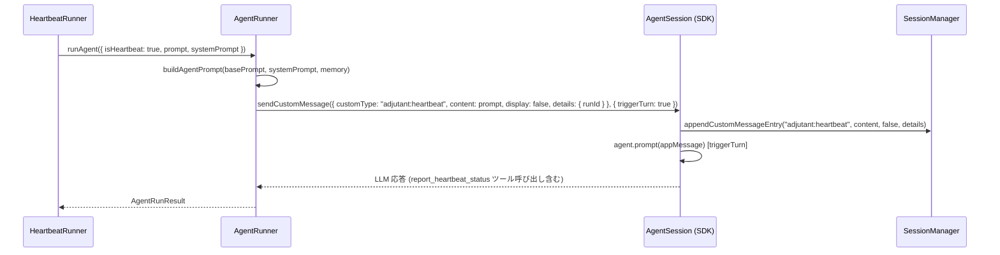
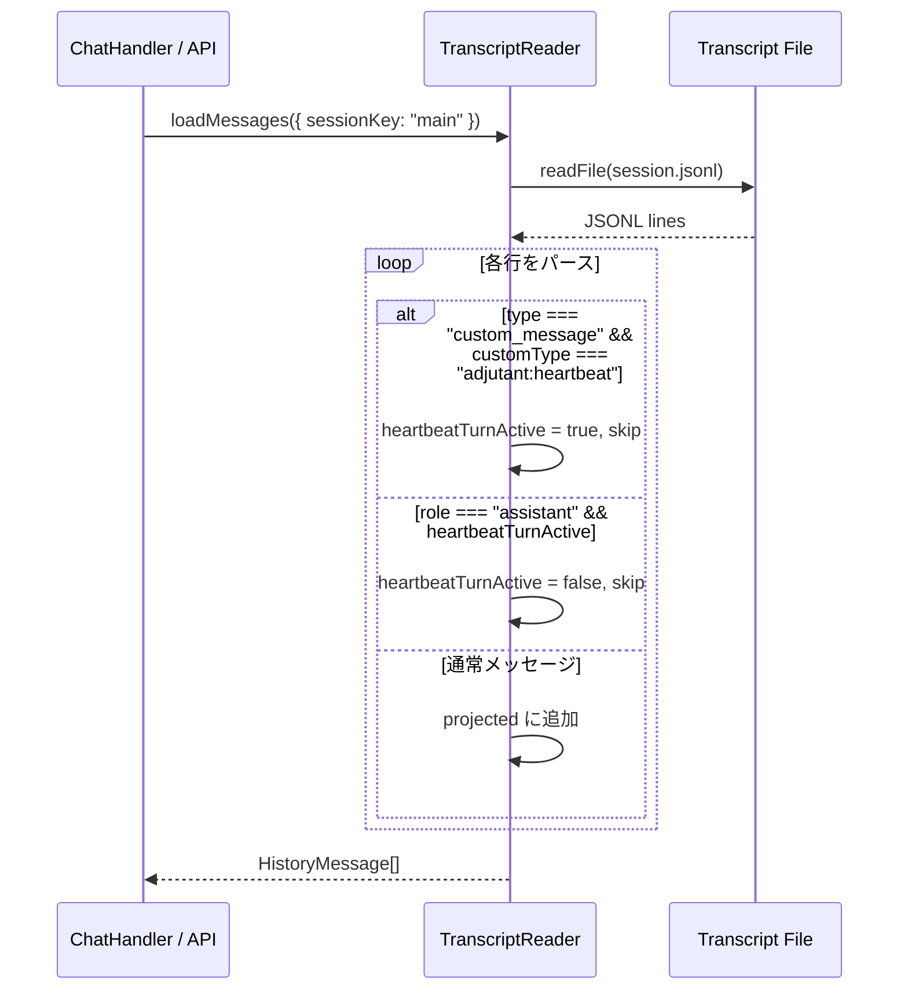
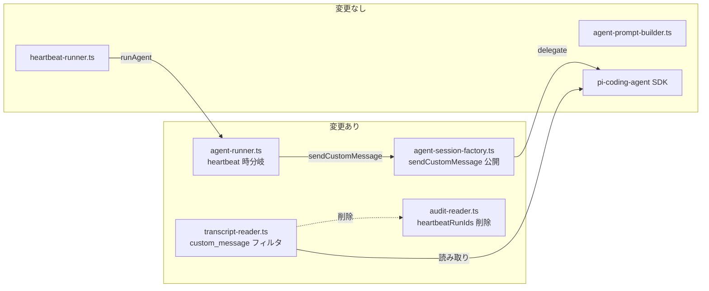

# 260223-s05: ハートビート送信を sendCustomMessage に移行

## 1. 概要と目的 Overview and Purpose

- **What**
  heartbeat-runner が `runAgent()` → `session.prompt()` で送信しているハートビートメッセージを、SDK の `AgentSession.sendCustomMessage()` を経由する方式に変更する。これにより、トランスクリプト上で heartbeat メッセージが `custom_message` エントリとして型レベルで識別可能になる。

- **Why**
  現行実装では `buildAgentPrompt()` が SOUL/USER/AGENTS テキストを heartbeat 本文の**前**に結合するため、`isHeartbeatPrompt()` の「先頭が `# HEARTBEAT` で始まるか」判定が失敗する。結果、heartbeat メッセージがチャット UI に漏洩する。audit ログの `origin === "system"` によるフォールバックもあるが、audit ファイルが欠損・遅延すると機能しない。`custom_message` エントリの `customType` フィールドで構造的に判別することで、テキストパターンマッチや外部ログに依存しないロバストなフィルタリングを実現する。

- **How**
  1. `AgentSessionLike` インターフェースに `sendCustomMessage` メソッドを追加
  2. `agent-runner.ts` の `promptWithRetry` を heartbeat 用 / 通常用に分岐し、heartbeat 時は `sendCustomMessage({ customType: "adjutant:heartbeat", ... }, { triggerTurn: true })` を使用
  3. `transcript-reader.ts` の `loadMessages` ループで `type === "custom_message"` かつ `customType === "adjutant:heartbeat"` を検出して heartbeatTurnActive をセット
  4. 旧方式のフォールバック（`isHeartbeatPrompt` テキストマッチ、`heartbeatRunIds` audit ベースマッチング）を削除

## 2. 仕様と受け入れ条件 Specification and Acceptance Criteria

### 2.1 スコープ Scope

- 今回やること
  - `AgentSessionLike` に `sendCustomMessage` を追加
  - `agent-session-factory.ts` で SDK の `AgentSession` から `sendCustomMessage` を公開
  - `agent-runner.ts` で heartbeat 時に `sendCustomMessage` を使用
  - `transcript-reader.ts` で `custom_message` エントリによるフィルタリングを実装
  - `isHeartbeatPrompt` 関数および `heartbeatPromptMarker` オプションの削除
  - `audit-reader.ts` の `heartbeatRunIds` コレクションおよび transcript-reader での参照の削除
  - 関連テストの追加・更新
- 成果物
  - 変更ファイル: `agent-session-factory.ts`, `agent-runner.ts`, `transcript-reader.ts`, `audit-reader.ts`
  - テストファイル: 上記に対応する `tests/assistant/*.test.ts`
- 制約
  - SDK バージョン `@mariozechner/pi-coding-agent@0.52.12` の `sendCustomMessage` API を前提
  - 既存の `prompt()` ベースの通常チャットフローには影響を与えない

### 2.2 非スコープ Non Scope

- 既存トランスクリプトの後方互換: フォールバック判定は削除する（ユーザー確認済み）
- heartbeat-runner.ts 自体のプロンプト構築ロジックの変更（`buildAgentPrompt` の呼び出し構造はそのまま）
- UI 側の表示ロジック変更（transcript-reader の出力がフィルタ済みであるため不要）
- compaction 時の memory flush ターン（heartbeat 以外の `session.prompt` 呼び出し）

### 2.3 ユースケース Use Cases

1. **正常系: heartbeat 実行時**
   - heartbeat-runner が `runAgent({ isHeartbeat: true, ... })` を呼び出す
   - agent-runner が `sendCustomMessage` で heartbeat プロンプトを送信
   - トランスクリプトに `{ type: "custom_message", customType: "adjutant:heartbeat", ... }` が記録される
   - LLM が応答を返し、`report_heartbeat_status` ツールを呼ぶ
   - transcript-reader の `loadMessages` が `custom_message` エントリと後続の assistant 応答を除外する

2. **正常系: 通常チャット時**
   - ユーザーが通常のチャットメッセージを送信
   - agent-runner は従来通り `session.prompt()` を使用
   - transcript-reader は通常通りメッセージを返す

3. **異常系: sendCustomMessage が SDK 上で未定義の場合**
   - `AgentSessionLike.sendCustomMessage` が undefined
   - フォールバックとして `session.prompt()` を使用（graceful degradation）

### 2.4 受け入れ条件 Acceptance Criteria

1. **Given** heartbeat 実行時 **When** `runAgent({ isHeartbeat: true })` が呼ばれる **Then** `sendCustomMessage({ customType: "adjutant:heartbeat" }, { triggerTurn: true })` が呼ばれ `session.prompt()` は呼ばれない

2. **Given** 通常チャット実行時 **When** `runAgent({ isHeartbeat: false })` が呼ばれる **Then** 従来通り `session.prompt()` が呼ばれ `sendCustomMessage` は呼ばれない

3. **Given** トランスクリプトに `custom_message` (customType=`adjutant:heartbeat`) エントリがある **When** `loadMessages()` が呼ばれる **Then** そのエントリと後続の assistant 応答が結果から除外される

4. **Given** トランスクリプトに通常の user/assistant メッセージのみがある **When** `loadMessages()` が呼ばれる **Then** 全メッセージが結果に含まれる

5. **Given** `sendCustomMessage` が session に存在しない **When** heartbeat 実行時 **Then** `session.prompt()` にフォールバックする

6. **Given** 全テスト **When** `pnpm run check` を実行 **Then** typecheck, lint, format, test がすべてパスする

### 2.5 既知の制約 Known Limitations

- 既存のトランスクリプトファイル内の旧形式 heartbeat メッセージは `loadMessages` でフィルタされなくなる（フォールバック削除のため）。新しいセッションでは問題なし。
- `sendCustomMessage` の `details` フィールドは LLM に送信されないため、heartbeat の runId 等のメタデータは audit ログ経由でのみ参照可能。

## 3. 前提技術スタック Context and Tech Stack

- **Language / Framework**: TypeScript 5.x, ESM, Node.js
- **Libraries**: `@mariozechner/pi-coding-agent@0.52.12` (AgentSession.sendCustomMessage API)
- **Style Guide**: 既存の Prettier / ESLint 設定に従う
- **Testing**: Node.js 標準 `node:test` モジュール (`describe`, `it`, `mock`)
- **Runtime**: Node.js (開発環境)

## 4. インターフェース契約 Interface Contracts

### 4.1 公開 API / 外部 I/O 一覧

変更なし（内部リファクタリングのみ）。外部 HTTP API や CLI インターフェースへの影響なし。

### 4.2 データモデルとスキーマ

#### AgentSessionLike 拡張

```typescript
export type AgentSessionLike = {
  subscribe: (listener: (event: unknown) => void) => () => void;
  prompt: (text: string) => Promise<void>;
  sendCustomMessage?: <T = unknown>(
    message: {
      customType: string;
      content: string | Array<{ type: string; text: string }>;
      display: boolean;
      details?: T;
    },
    options?: {
      triggerTurn?: boolean;
      deliverAs?: "steer" | "followUp" | "nextTurn";
    },
  ) => Promise<void>;
  getContextUsage?: () => ContextUsage | undefined;
  compact?: (customInstructions?: string) => Promise<unknown>;
  dispose: () => void;
  sessionId?: string;
  sessionFile?: string;
  model?: unknown;
};
```

#### トランスクリプト custom_message エントリ形式

```json
{
  "type": "custom_message",
  "id": "entry-uuid",
  "parentId": "parent-entry-uuid",
  "timestamp": "2026-02-23T10:30:00.000Z",
  "customType": "adjutant:heartbeat",
  "content": "# HEARTBEAT\n...",
  "display": false,
  "details": { "runId": "hb-1708678200000" }
}
```

### 4.3 エラーと例外 Error Handling

- `sendCustomMessage` が未定義の場合: `session.prompt()` にフォールバック（ログ出力なし、サイレント）
- `sendCustomMessage` が例外をスローした場合: 既存の `promptWithRetry` と同じリトライポリシーを適用
- transient エラー: 1回リトライ（2500ms 待機）
- context_overflow: compaction 試行またはプロンプト縮小

### 4.4 代表的な例 Examples

**例1: heartbeat 送信**

```typescript
// agent-runner.ts 内
await session.sendCustomMessage(
  {
    customType: "adjutant:heartbeat",
    content: prompt,  // buildAgentPrompt の結果
    display: false,
    details: { runId: context.runId },
  },
  { triggerTurn: true }
);
```

**例2: トランスクリプト読み込みでのフィルタ**

```typescript
// transcript-reader.ts 内
// parsed.type === "custom_message" のエントリを検出
const lineRecord = parsed as Record<string, unknown>;
if (lineRecord.type === "custom_message" && lineRecord.customType === "adjutant:heartbeat") {
  heartbeatTurnActive = true;
  continue;
}
```

## 5. アーキテクチャと設計図 Architecture and Diagrams

### 5.1 図の選択方針

単一パイプライン内の変更であるため、シーケンス図で変更の流れを表現する。

### 5.2 シーケンス図: heartbeat 送信フロー（変更後）



### 5.3 シーケンス図: チャット履歴読み込み（変更後）



### 5.4 コンポーネント図: 変更対象



## 6. テスト戦略 Test Strategy

### 6.1 テストの種類

- **Unit**
  - `agent-runner.ts`: `promptWithRetry` の heartbeat 分岐テスト（mock session の `sendCustomMessage` / `prompt` 呼び出し検証）
  - `transcript-reader.ts`: `custom_message` エントリのフィルタリングテスト
  - `audit-reader.ts`: `heartbeatRunIds` 削除後の `readAuditRunMetadata` 戻り値テスト
  - モック境界: `AgentSessionLike` (session.sendCustomMessage, session.prompt)

- **Integration**
  - `agent-session-factory.ts`: SDK の `createAgentSession` が返すオブジェクトに `sendCustomMessage` が存在することの確認（型レベル + runtime assertion）

- **Contract**
  - `AgentSessionLike` の型定義が SDK の `AgentSession` と互換であることを型チェックで担保

### 6.2 カバレッジ対象

- heartbeat 時に `sendCustomMessage` が呼ばれ `prompt` が呼ばれないこと
- 通常チャット時に `prompt` が呼ばれ `sendCustomMessage` が呼ばれないこと
- `sendCustomMessage` が undefined の場合に `prompt` にフォールバックすること
- `sendCustomMessage` が transient エラーをスローした場合のリトライ
- `custom_message` エントリがある場合にフィルタされること
- `custom_message` エントリの直後の assistant メッセージもフィルタされること
- 通常メッセージはフィルタされないこと

## 7. 実装タスクリスト Implementation Plan

### Phase 1: 設計と準備

- [ ] 要件と仕様の確定（本計画書）
- [ ] インターフェース契約の確定（AgentSessionLike 拡張仕様）
- [ ] Mermaid 図の作成（本計画書に含む）

### Phase 2: AgentSessionLike の拡張

- [ ] Test: `AgentSessionLike` に `sendCustomMessage` が optional で型定義されることの確認テスト (Red)
- [ ] Impl: `agent-session-factory.ts` — `AgentSessionLike` 型に `sendCustomMessage` を追加 (Green)
- [ ] Impl: `agent-session-factory.ts` — `createAgentSessionFromSdk` で SDK session から `sendCustomMessage` を公開
- [ ] Refactor: 型定義の整理

### Phase 3: agent-runner の heartbeat 分岐

- [ ] Test: `promptWithRetry` が `isHeartbeat: true` 時に `sendCustomMessage` を呼び、`prompt` を呼ばないことの検証テスト (Red)
- [ ] Test: `promptWithRetry` が `isHeartbeat: false` 時に `prompt` を呼び、`sendCustomMessage` を呼ばないことの検証テスト (Red)
- [ ] Test: `sendCustomMessage` が undefined の場合に `prompt` にフォールバックするテスト (Red)
- [ ] Test: `sendCustomMessage` が transient エラーをスローした場合のリトライテスト (Red)
- [ ] Impl: `agent-runner.ts` — `promptWithRetry` に heartbeat 分岐を追加 (Green)
- [ ] Refactor: 共通リトライロジックの整理

### Phase 4: transcript-reader の custom_message フィルタ

- [ ] Test: `custom_message` (customType=`adjutant:heartbeat`) エントリが `loadMessages` から除外されるテスト (Red)
- [ ] Test: `custom_message` 直後の assistant メッセージも除外されるテスト (Red)
- [ ] Test: 通常メッセージはフィルタされないことの確認テスト (Red)
- [ ] Impl: `transcript-reader.ts` — `loadMessages` ループに `custom_message` 判定を追加 (Green)
- [ ] Impl: `isHeartbeatPrompt` 関数と `heartbeatPromptMarker` オプションの削除
- [ ] Impl: `audit-reader.ts` — `heartbeatRunIds` の収集と transcript-reader での参照を削除
- [ ] Impl: `TranscriptReadOptions` から `heartbeatPromptMarker` フィールドを削除
- [ ] Refactor: 不要になったインポートやヘルパーの削除

### Phase 5: 統合と検証

- [ ] 全体テストの実行 (`pnpm run check`)
- [ ] typecheck パスの確認
- [ ] lint / format パスの確認
- [ ] 既存テストの破損がないことの確認

## 8. 完了の定義 Definition of Done

### 8.1 機能 DoD Functional DoD

- [ ] 受け入れ条件 1-5 がすべて満たされていること
- [ ] 既知の制約が明文化され、想定通りであること
- [ ] heartbeat 送信時に `sendCustomMessage` が使用されることが単体テストで検証済み

### 8.2 品質 DoD Quality DoD

- [ ] 全てのテストがパスしていること (`pnpm run test`)
- [ ] 型チェックが通ること (`pnpm run typecheck`)
- [ ] Linter / Formatter のエラーがないこと (`pnpm run lint`, `pnpm run format`)
- [ ] 不要なデバッグコードが削除されていること
- [ ] 主要な変更点が本計画書のタスクチェックリストに反映されていること

## 9. 懸念事項と未確定事項 Concerns and Questions

- **SDK バージョン依存**: `sendCustomMessage` は `@mariozechner/pi-coding-agent@0.52.12` で確認済みだが、将来の SDK アップデートで API が変更される可能性がある。`AgentSessionLike` での optional 定義とフォールバックで緩和する。
- **custom_message のトランスクリプト形式**: SDK 内部の実装で `custom_message` エントリが `message` フィールドではなく `content` を直接持つ形式になっている。transcript-reader のパースロジックがこの形式を正しくハンドリングできるか実装時に検証が必要。
- **compaction との相互作用**: `sendCustomMessage` で送信した `custom_message` エントリが compaction 時にどう扱われるか（削除されるか保持されるか）は SDK の実装に依存する。heartbeat の場合は compaction で消えても問題ないが、挙動は確認しておく。
- **promptWithRetry の分岐複雑化**: heartbeat 用と通常用で `promptWithRetry` の呼び出しパスが分岐するため、テストカバレッジの漏れに注意する。
