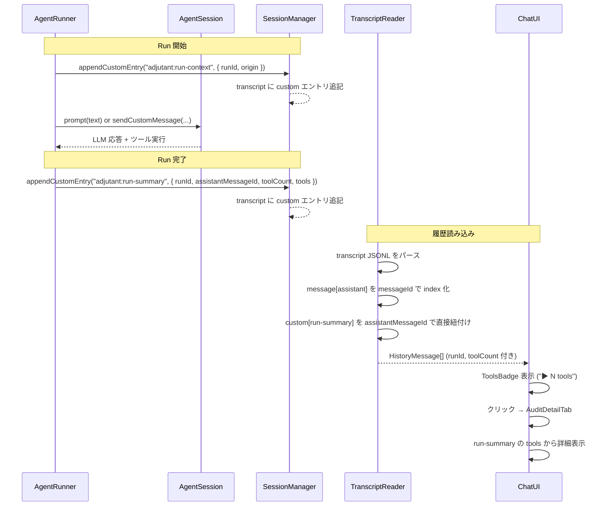
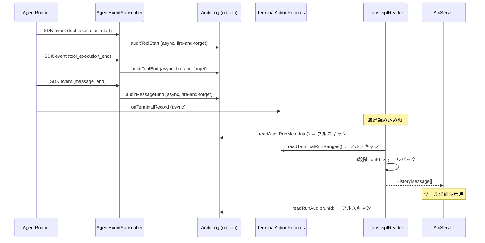
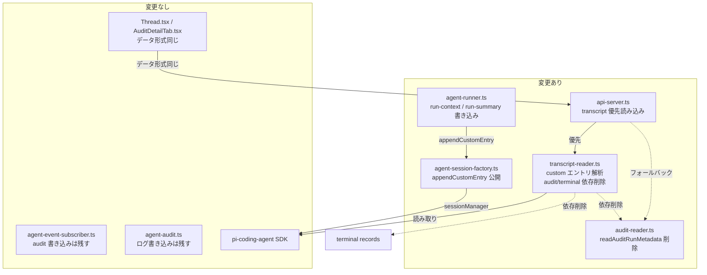

# 260223-s06: トランスクリプト埋め込み run メタデータによるツール表示改善

## 1. 概要と目的 Overview and Purpose

- **What**
  agent run の実行コンテキスト（runId, origin）とツール実行サマリー（assistantMessageId, toolCount, tools 詳細）をSDK トランスクリプトの `custom` エントリとして直接埋め込む。これにより、チャット UI のツール実行バッジ表示とツール詳細パネルの表示が、audit ログや terminal action records への依存なしにトランスクリプト単体で完結する。

- **Why**
  現状のツール実行表示は 3 つの独立したデータソース（SDK トランスクリプト、audit ログ、terminal action records）を 3 段階フォールバック（payload 直接 → audit message.bind → ±15秒タイムスタンプ近似）で紐付けている。この設計には以下の問題がある:
  - audit ログの非同期 fire-and-forget 書き込みにより、読み込み時に flush されていない可能性
  - タイムスタンプ近似は並行 run があるとミスマッチしうる
  - audit ログが単一ファイルで全 run が混在し、毎回フルスキャン
  - 3 データソースの整合性保証がない

- **How**
  SDK の `SessionManager.appendCustomEntry(customType, data?)` を使用する。このメソッドはトランスクリプト JSONL に `{ type: "custom", customType, data }` エントリを追記するが、LLM コンテキストには含まれない。`AgentSession` は `sessionManager` を public readonly で公開しており、`session.dispose()` の前であればアクセス可能。
  - run 開始前: `adjutant:run-context` エントリ（runId, origin, sessionKey）
  - run 完了後: `adjutant:run-summary` エントリ（runId, assistantMessageId, toolCount, tools 詳細, durationMs, modelId）
  - transcript-reader は `assistantMessageId` で該当 assistant メッセージに直接紐付ける（pending 方式は使わない）
  - `/api/chat/runs/:runId/audit` は `runId -> sessionKey` 索引を参照して対象トランスクリプトを特定し、全セッション走査を避ける

## 2. 仕様と受け入れ条件 Specification and Acceptance Criteria

### 2.1 スコープ Scope

- 今回やること
  - `AgentSessionLike` に `appendCustomEntry` を optional メソッドとして追加
  - `agent-session-factory.ts` で SDK の `AgentSession.sessionManager.appendCustomEntry` を公開
  - `agent-runner.ts` の `runAgentInternal` で run 前後にカスタムエントリを書き込み
  - `runId -> sessionKey` を解決する run 索引（state 配下の JSONL）を追加し、run 開始時に追記
  - `transcript-reader.ts` の `loadMessages` で `custom` エントリを解析し `assistantMessageId` ベースで toolCount を解決
  - `transcript-reader.ts` から `readAuditRunMetadata` への依存を削除（`toolEndCountByRunId`, `messageRunIdByMessageId`）
  - `transcript-reader.ts` から terminal run ranges によるタイムスタンプ近似を削除
  - `audit-reader.ts` から `readAuditRunMetadata` / `AuditRunMetadata` 型を削除
  - API サーバーの `/api/chat/runs/:runId/audit` エンドポイントに run 索引経由でのトランスクリプト内 run-summary 読み込みを追加（audit ログへのフォールバック付き）
  - `agent-runner.ts` の `run.end` 記録直後に audit logger の flush を実行し、完了を待機する
  - 関連テストの追加・更新

- 成果物
  - 変更ファイル: `agent-session-factory.ts`, `agent-runner.ts`, `transcript-reader.ts`, `audit-reader.ts`, `api-server.ts`, `run-index-repository.ts`（新規）
  - テストファイル: 対応する `tests/assistant/*.test.ts`

- 制約
  - SDK `@mariozechner/pi-coding-agent@0.52.12` の `SessionManager.appendCustomEntry` API を前提
  - s05（heartbeat の sendCustomMessage 移行）が先に完了していること
  - audit ログの書き込み自体は残す（デバッグ・監視用途）

### 2.2 非スコープ Non Scope

- audit ログのファイル分割やインデックス化
- audit ログの書き込み（`agent-audit.ts`, `agent-event-subscriber.ts`）の削除（デバッグ用途で残す）
- UI コンポーネント（`AuditDetailTab.tsx`, `ToolsBadge`, `Thread.tsx`）の変更（データ形式が同じため不要）
- `readRunAudit` 関数自体の削除（API エンドポイントのフォールバックとして残す）
- heartbeat フィルタリング（s05 のスコープ）
- run-index のローテーション/圧縮/TTL 管理（append-only での運用最適化は本スコープ外）

### 2.3 ユースケース Use Cases

1. **正常系: ユーザーチャットでツール実行あり**
   - ユーザーが「ファイルを読んで」とメッセージを送信
   - agent-runner が `adjutant:run-context` エントリをトランスクリプトに書き込む
   - LLM が bash ツールを呼び出し、応答を返す
   - agent-runner が `adjutant:run-summary` エントリ（assistantMessageId, toolCount: 1, tools 詳細）を書き込む
   - チャット UI が「▶ 1 tools」バッジを表示
   - バッジをクリック → AuditDetailTab がツール詳細を表示

2. **正常系: ツール実行なしのチャット**
   - 通常の会話メッセージ
   - `adjutant:run-summary` の toolCount が 0
   - ToolsBadge は非表示

3. **正常系: 履歴読み込み**
   - `loadMessages()` がトランスクリプトを読み込む
   - `custom` エントリから runId と toolCount を解決（toolCount は assistantMessageId で直接紐付け）
   - audit ログや terminal records の読み込みは不要

4. **異常系: appendCustomEntry が未定義（SDK 非対応）**
   - `AgentSessionLike.appendCustomEntry` が undefined
   - カスタムエントリの書き込みをスキップ
   - transcript-reader は runId が取れないメッセージとして処理（既存の extractRunId フォールバック）

### 2.4 受け入れ条件 Acceptance Criteria

1. **Given** agent run 実行時 **When** `runAgentInternal` が正常完了する **Then** トランスクリプトに `adjutant:run-context` と `adjutant:run-summary` の `custom` エントリが記録される

2. **Given** トランスクリプトに `adjutant:run-context` エントリがある **When** `loadMessages()` が呼ばれる **Then** 後続の assistant メッセージの `runId` がそのエントリの runId と一致する

3. **Given** トランスクリプトに `adjutant:run-summary` エントリ（assistantMessageId, toolCount > 0）がある **When** `loadMessages()` が呼ばれる **Then** `assistantMessageId` と一致する assistant メッセージの `toolCount` がそのエントリの toolCount と一致する

4. **Given** `loadMessages()` 実行時 **When** audit ログファイルが存在しない **Then** メッセージの runId と toolCount は正しく解決される（audit ログに依存しない）

5. **Given** `/api/chat/runs/:runId/audit` API 呼び出し **When** 該当 runId の `adjutant:run-summary` がトランスクリプトにある **Then** そこからツール詳細を返す

6. **Given** `appendCustomEntry` が session に存在しない **When** agent run が実行される **Then** エラーにならず、カスタムエントリなしで正常完了する

7. **Given** `/api/chat/runs/:runId/audit` API 呼び出し **When** run 索引に runId が存在する **Then** 全 transcript フルスキャンなしで対象セッションを解決できる

8. **Given** `run.end` 記録後 **When** `runAgentInternal` が終了する **Then** audit logger の pending write が flush 済みである

9. **Given** 全テスト **When** `pnpm run check` を実行 **Then** typecheck, lint, format, test がすべてパスする

### 2.5 既知の制約 Known Limitations

- `appendCustomEntry` は LLM コンテキストに含まれないため、LLM 側からは run のメタデータを参照できない（意図通り）
- `custom` エントリの `data` フィールドはツール引数・結果のサマリーであり、audit ログほど詳細ではない場合がある（`agent-audit.ts` の sanitize/truncate ロジックを共通化して使用）
- 既存のトランスクリプト（本変更前に作成されたもの）には `custom` エントリがないため、`loadMessages` は runId を解決できない。ただし audit ログが存在すればフォールバックとして `readRunAudit` API は引き続き使える
- `appendCustomEntry` の呼び出しが `promptWithRetry` の後・`session.dispose()` の前というタイミング制約がある
- `assistantMessageId` が取得できない run では run-summary による toolCount 補完はスキップし、runId のみを返す（フォールバックは runId + 直近 assistant を採用）
- run-index は append-only のため運用期間に応じて増加する（本スコープではローテーション未実装）

## 3. 前提技術スタック Context and Tech Stack

- **Language / Framework**: TypeScript 5.x, ESM, Node.js
- **Libraries**: `@mariozechner/pi-coding-agent@0.52.12`
  - `SessionManager.appendCustomEntry(customType, data?)` → `{ type: "custom", id, parentId, timestamp, customType, data }` エントリ
  - `AgentSession.sessionManager` (public readonly) でアクセス
- **Style Guide**: 既存の Prettier / ESLint 設定に従う
- **Testing**: Node.js 標準 `node:test` モジュール
- **依存**: s05（heartbeat の sendCustomMessage 移行）完了後

## 4. インターフェース契約 Interface Contracts

### 4.1 公開 API / 外部 I/O 一覧

- `/api/chat/runs/:runId/audit` — 既存エンドポイント。レスポンス形式は変更なし。内部ではトランスクリプトの `adjutant:run-summary` を優先し、なければ audit ログにフォールバック。
- `run-index.ndjson`（新規, `${ADJUTANT_STATE_DIR}/index/run-index.ndjson`）— `runId -> sessionKey` を保持する内部索引。`/api/chat/runs/:runId/audit` の探索キーとして利用。

### 4.2 データモデルとスキーマ

#### AgentSessionLike 拡張（s05 からの差分）

```typescript
export type AgentSessionLike = {
  // ... s05 時点のフィールド ...
  appendCustomEntry?: (customType: string, data?: unknown) => string;
};
```

#### RunSummaryTool（新規）

```typescript
type RunSummaryTool = {
  toolName: string;
  toolCallId?: string;
  status?: "ok" | "error";
  durationMs?: number;
  startedAt?: string;
  endedAt: string; // runtime.ts 互換のため必須
  args?: unknown;
  resultSummary?: unknown;
  truncated?: boolean;
  error?: string;
};
```

#### adjutant:run-context エントリ

```json
{
  "type": "custom",
  "id": "a1b2c3d4",
  "parentId": "prev-entry-id",
  "timestamp": "2026-02-23T10:30:00.000Z",
  "customType": "adjutant:run-context",
  "data": {
    "runId": "msg-1708678200000-abc123",
    "origin": "user",
    "sessionKey": "main"
  }
}
```

#### adjutant:run-summary エントリ

```json
{
  "type": "custom",
  "id": "e5f6g7h8",
  "parentId": "assistant-message-entry-id",
  "timestamp": "2026-02-23T10:30:05.000Z",
  "customType": "adjutant:run-summary",
  "data": {
    "runId": "msg-1708678200000-abc123",
    "assistantMessageId": "assistant-msg-01",
    "origin": "user",
    "durationMs": 5000,
    "modelId": "anthropic/claude-sonnet-4-20250514",
    "toolCount": 2,
    "tools": [
      {
        "toolName": "bash",
        "toolCallId": "call_123",
        "status": "ok",
        "durationMs": 1200,
        "startedAt": "2026-02-23T10:30:01.100Z",
        "endedAt": "2026-02-23T10:30:02.300Z",
        "args": { "command": "ls -la" },
        "resultSummary": "total 48\ndrwxr-xr-x..."
      },
      {
        "toolName": "bash",
        "toolCallId": "call_456",
        "status": "ok",
        "durationMs": 800,
        "startedAt": "2026-02-23T10:30:03.000Z",
        "endedAt": "2026-02-23T10:30:03.800Z",
        "args": { "command": "cat README.md" },
        "resultSummary": "# Project..."
      }
    ]
  }
}
```

#### HistoryMessage（変更なし）

```typescript
export type HistoryMessage = {
  role: "user" | "assistant";
  content: string | Array<{ type: string; text: string }>;
  timestamp: number;
  runId?: string;
  toolCount?: number;
};
```

### 4.3 エラーと例外 Error Handling

- `appendCustomEntry` が undefined: サイレントスキップ（ログ出力なし）
- `appendCustomEntry` が例外をスロー: warn ログを出力し、run 自体は正常完了させる（best-effort）
- audit logger flush が失敗: warn ログを出力し、run 自体は正常完了させる（best-effort）
- `assistantMessageId` が欠落: runId + 直近 assistant へフォールバックし、対象が特定できない場合は toolCount 付与をスキップ
- トランスクリプトの `custom` エントリが破損: スキップして次のエントリを処理
- `/api/chat/runs/:runId/audit` API: トランスクリプトから取得失敗 → audit ログにフォールバック → 両方失敗なら空レスポンス

### 4.4 代表的な例 Examples

**例1: agent-runner でのカスタムエントリ書き込み**

```typescript
// runAgentInternal 内 — promptWithRetry の前後
if (typeof session.appendCustomEntry === "function") {
  try {
    session.appendCustomEntry("adjutant:run-context", {
      runId: context.runId,
      origin: context.origin,
      sessionKey: context.sessionKey,
    });
  } catch { /* best-effort */ }
}

await promptWithRetry({ ... });
await subscribed.waitForSettledMemoryWrites();
const assistantMessageId = subscribed.lastAssistantMessageId;

if (typeof session.appendCustomEntry === "function") {
  try {
    // tools は subscriber が収集する詳細（toolCallId/status/durationMs/args/resultSummary/startedAt/endedAt）を使用
    session.appendCustomEntry("adjutant:run-summary", {
      runId: context.runId,
      assistantMessageId,
      origin: context.origin,
      durationMs,
      modelId: sessionMetadata?.modelId ?? context.model,
      toolCount: subscribed.toolCalls.length,
      tools: subscribed.toolCalls,
    });
  } catch { /* best-effort */ }
}

auditRunEnd({ ... });
await flushAgentAuditLogger();
```

**例2: transcript-reader での解析**

```typescript
// loadMessages ループ内
const assistantById = new Map<string, HistoryMessage>();

// message 行を読み込むたびに index 化
if (role === "assistant" && messageId) {
  assistantById.set(messageId, historyMessage);
}

// custom run-summary は ID で直接付与
if (lineRecord.type === "custom" && lineRecord.customType === "adjutant:run-summary") {
  const data = lineRecord.data as Record<string, unknown> | undefined;
  const assistantMessageId =
    typeof data?.assistantMessageId === "string" ? data.assistantMessageId : undefined;
  const toolCount = typeof data?.toolCount === "number" ? data.toolCount : undefined;
  if (assistantMessageId && typeof toolCount === "number") {
    const target = assistantById.get(assistantMessageId);
    if (target) {
      target.toolCount = toolCount;
    }
  }
}
```

**例3: API レスポンス（変更なし）**

```bash
curl http://localhost:3100/api/chat/runs/msg-123/audit
```

```json
{
  "runId": "msg-123",
  "origin": "user",
  "runEnded": true,
  "tools": [
    {
      "toolName": "bash",
      "status": "ok",
      "durationMs": 1200,
      "args": { "command": "ls" },
      "resultSummary": "..."
    }
  ]
}
```

## 5. アーキテクチャと設計図 Architecture and Diagrams

### 5.1 図の選択方針

データフローの変更が主であるため、シーケンス図で変更前後を比較し、コンポーネント図で変更範囲を示す。

### 5.2 シーケンス図: ツール実行表示の新フロー



### 5.3 シーケンス図: 旧フロー（参考・削除対象）



### 5.4 コンポーネント図: 変更対象と依存関係



## 6. テスト戦略 Test Strategy

### 6.1 テストの種類

- **Unit**
  - `agent-session-factory.ts`: `appendCustomEntry` を `.bind(sessionManager)` 済みで公開し、`this` 依存エラーにならないことの検証
  - `agent-runner.ts`: run 前後に `appendCustomEntry` が正しい customType と data で呼ばれることの検証
  - `agent-runner.ts`: run-summary に `assistantMessageId` が含まれることの検証
  - `agent-event-subscriber.ts`: `message_end(role=assistant)` 受信時に `lastAssistantMessageId` が更新されることの検証
  - `agent-event-subscriber.ts`: tool summary に `toolCallId/status/durationMs/args/resultSummary/startedAt/endedAt` が入ることの検証
  - `agent-runner.ts`: `appendCustomEntry` が undefined の場合にエラーにならないことの検証
  - `agent-runner.ts`: `appendCustomEntry` が例外をスローした場合に run が正常完了することの検証
  - `agent-runner.ts`: `run.end` 記録後に audit logger flush を await することの検証
  - `transcript-reader.ts`: `custom[adjutant:run-context]` → 後続 assistant メッセージの runId 解決
  - `transcript-reader.ts`: `custom[adjutant:run-summary]` の `assistantMessageId` → toolCount 解決
  - `transcript-reader.ts`: audit ログなしで runId / toolCount が正しく解決されることの検証
  - `transcript-reader.ts`: `custom` エントリが存在しない旧トランスクリプトでもエラーにならないことの検証
  - モック境界: `AgentSessionLike`（appendCustomEntry）

- **Integration**
  - `api-server.ts`: `/api/chat/runs/:runId/audit` がトランスクリプトから読めない場合に audit ログにフォールバックすることの検証

- **Contract**
  - `AgentSessionLike` の型定義が SDK の `AgentSession` と互換であることを型チェックで担保

### 6.2 カバレッジ対象

- run-context エントリの runId, origin, sessionKey が正しいこと
- run-summary エントリの assistantMessageId, toolCount, tools 詳細, durationMs, modelId が正しいこと
- run-summary の `tools[].endedAt` が常に設定され、runtime の toolCount 補完と互換であること
- ツール実行がない run では toolCount === 0 であること
- 複数の run が連続するトランスクリプトで各 assistant メッセージに正しい runId / toolCount が紐付くこと
- `custom` エントリが破損している場合にスキップされること
- audit ログの `readAuditRunMetadata` が `loadMessages` から呼ばれないこと

## 7. 実装タスクリスト Implementation Plan

### Phase 1: 設計と準備

- [x] 要件と仕様の確定（本計画書）
- [x] s05 の完了確認（heartbeat sendCustomMessage 移行）
- [x] インターフェース契約の確定（adjutant:run-context / adjutant:run-summary スキーマ）
- [x] Mermaid 図の作成（本計画書に含む）

### Phase 2: AgentSessionLike の拡張

- [x] Test: `AgentSessionLike` に `appendCustomEntry` が optional で型定義されることの確認
- [x] Test: `appendCustomEntry` が `sessionManager` に bind 済みで this 依存エラーにならないことの確認
- [x] Impl: `agent-session-factory.ts` — `AgentSessionLike` 型に `appendCustomEntry` を追加
- [x] Impl: `agent-session-factory.ts` — `createAgentSessionFromSdk` で `session.sessionManager.appendCustomEntry` をバインドして公開
- [x] Refactor: 型定義の整理

### Phase 3: agent-runner での run メタデータ書き込み

- [x] Test: `runAgentInternal` が promptWithRetry 前に `appendCustomEntry("adjutant:run-context", ...)` を呼ぶテスト (Red)
- [x] Test: `runAgentInternal` が promptWithRetry 後に `appendCustomEntry("adjutant:run-summary", ...)` を呼ぶテスト (Red)
- [x] Test: `runAgentInternal` の run-summary に `assistantMessageId` が含まれるテスト (Red)
- [x] Test: `appendCustomEntry` が undefined の場合にエラーにならないテスト (Red)
- [x] Test: `appendCustomEntry` が例外をスローした場合に run が正常完了するテスト (Red)
- [x] Test: run-summary の tools 詳細が agent-event-subscriber の収集データと一致するテスト (Red)
- [x] Test: run-summary の `tools[].endedAt` が設定されるテスト (Red)
- [x] Test: `message_end(role=assistant)` 後に `subscribed.lastAssistantMessageId` が設定されるテスト (Red)
- [x] Impl: `agent-event-subscriber.ts` — `lastAssistantMessageId` フィールドを追加し、assistant の `message_end` で更新
- [x] Impl: `agent-event-subscriber.ts` — toolCalls の型を詳細版へ拡張（toolCallId/status/durationMs/args/resultSummary/startedAt/endedAt）
- [x] Impl: `agent-runner.ts` — run-summary の tools は subscriber 詳細データをそのまま使用
- [x] Impl: sanitize/truncate は `agent-audit.ts` 共通ロジックを再利用（重複実装しない）
- [x] Impl: `agent-runner.ts` — promptWithRetry 前後での appendCustomEntry 呼び出し追加 (Green)
- [x] Impl: `agent-runner.ts` — `auditRunEnd` 後に `flushAgentAuditLogger()` を await (Green)
- [x] Refactor: エラーハンドリングの整理

### Phase 4: transcript-reader の custom エントリ解析

- [x] Test: `custom[adjutant:run-context]` → 後続 assistant の runId 解決テスト (Red)
- [x] Test: `custom[adjutant:run-summary]` の `assistantMessageId` → 対応 assistant の toolCount 解決テスト (Red)
- [x] Test: `assistantMessageId` が不正/欠落時は toolCount を付与しないテスト (Red)
- [x] Test: `assistantMessageId` 欠落時は runId + 直近 assistant フォールバックが適用されるテスト (Red)
- [x] Test: 複数 run 連続でそれぞれ正しく紐付くテスト (Red)
- [x] Test: `custom` エントリなし（旧トランスクリプト）でエラーにならないテスト (Red)
- [x] Test: audit ログなしで runId / toolCount が正しく解決されるテスト (Red)
- [x] Impl: `transcript-reader.ts` — `assistant` メッセージを `messageId` で index 化し、run-summary を `assistantMessageId` で直接適用 (Green)
- [x] Impl: `transcript-reader.ts` — `readAuditRunMetadata` 呼び出しの削除
- [x] Impl: `transcript-reader.ts` — `readTerminalRunRanges` 呼び出しの削除
- [x] Refactor: 不要なインポートとヘルパーの削除

### Phase 5: audit-reader のクリーンアップ

- [x] Test: `readAuditRunMetadata` が export から削除されていることの確認
- [x] Impl: `audit-reader.ts` — `readAuditRunMetadata` / `AuditRunMetadata` の削除
- [x] Impl: `audit-reader.ts` — `readAuditRunMetadata` でのみ使用されていた内部ヘルパーの削除
- [x] Refactor: テストファイルから `readAuditRunMetadata` 関連テストの削除

### Phase 6: API サーバーのトランスクリプト優先読み込み

- [x] Test: `/api/chat/runs/:runId/audit` が run-index で sessionKey を解決し、対象 transcript から run-summary を返すテスト (Red)
- [x] Test: run-index に runId がない場合は audit ログにフォールバックするテスト (Red)
- [x] Test: run-summary がない場合は audit ログにフォールバックするテスト (Red)
- [x] Impl: `run-index-repository.ts`（新規）— `appendRunIndex(runId, sessionKey, ts)` / `resolveSessionKeyByRunId(runId)` の追加
- [x] Impl: `agent-runner.ts` — run 開始時に run-index へ追記
- [x] Impl: `api-server.ts` — run-index -> transcript -> audit の順で解決 (Green)
- [x] Refactor: レスポンス形式の一貫性確認

### Phase 7: 統合と検証

- [x] 全体テストの実行 (`pnpm run check`)
- [x] typecheck パスの確認
- [x] lint / format パスの確認
- [x] 既存テストの破損がないことの確認
- [x] ToolsBadge → AuditDetailTab の E2E 動作確認（手動）

## 8. 完了の定義 Definition of Done

### 8.1 機能 DoD Functional DoD

- [x] 受け入れ条件 1-9 がすべて満たされていること
- [x] 既知の制約が明文化され、想定通りであること
- [x] `loadMessages` が audit ログを読み込まないことがテストで検証済み
- [] ToolsBadge とツール詳細パネルが正常に表示されること（手動確認）

### 8.2 品質 DoD Quality DoD

- [x] 全てのテストがパスしていること (`pnpm run test`)
- [x] 型チェックが通ること (`pnpm run typecheck`)
- [x] Linter / Formatter のエラーがないこと (`pnpm run lint`, `pnpm run format`)
- [x] 不要なデバッグコードが削除されていること
- [x] 主要な変更点が本計画書のタスクチェックリストに反映されていること

## 9. 懸念事項と未確定事項 Concerns and Questions

- **`appendCustomEntry` のタイミング**: `promptWithRetry` 完了後〜`session.dispose()` の間に呼ぶ必要がある。エラーパス（catch ブロック）でも run-summary を書くべきかは要検討。エラー時は toolCalls が不完全な可能性があるため、スキップが安全か。
- **ツールサマリーのデータサイズ**: sanitize/truncate は `agent-audit.ts` の共通ロジック再利用で確定。残課題は二重切り詰めを避けつつ transcript サイズ増加を許容範囲に収める検証。
- **`assistantMessageId` の取得元**: run-summary は message 順序ではなく `assistantMessageId` で紐付ける。`message_end(role=assistant)` から最後の assistant message id を保持して書き込み、欠落時は `runId + 直近 assistant` へフォールバックする方針で確定。残課題は誤紐付けリスクをテストで抑えること。
- **旧トランスクリプトとの移行期間**: `loadMessages` の旧フォールバック（audit message.bind / terminal timestamp 近似）は削除する。一方で `/api/chat/runs/:runId/audit` の audit ログフォールバックは運用互換のため維持する。
- **`readAuditRunMetadata` 削除時の副作用**: `audit-reader.ts` 内の共有パーサー（`parseAuditLine` など）は `readRunAudit` でも利用される。readAuditRunMetadata 専用ロジックのみ削除し、共有ヘルパーを誤って消さないことを要確認。
- **`agent-event-subscriber` との責務分担**: ツールサマリー構築を subscriber 側に移すか runner 側に持つか。subscriber は既にツール情報を収集しているため、サマリー構築のヘルパーを subscriber 側に置き、runner から呼ぶのが自然。
