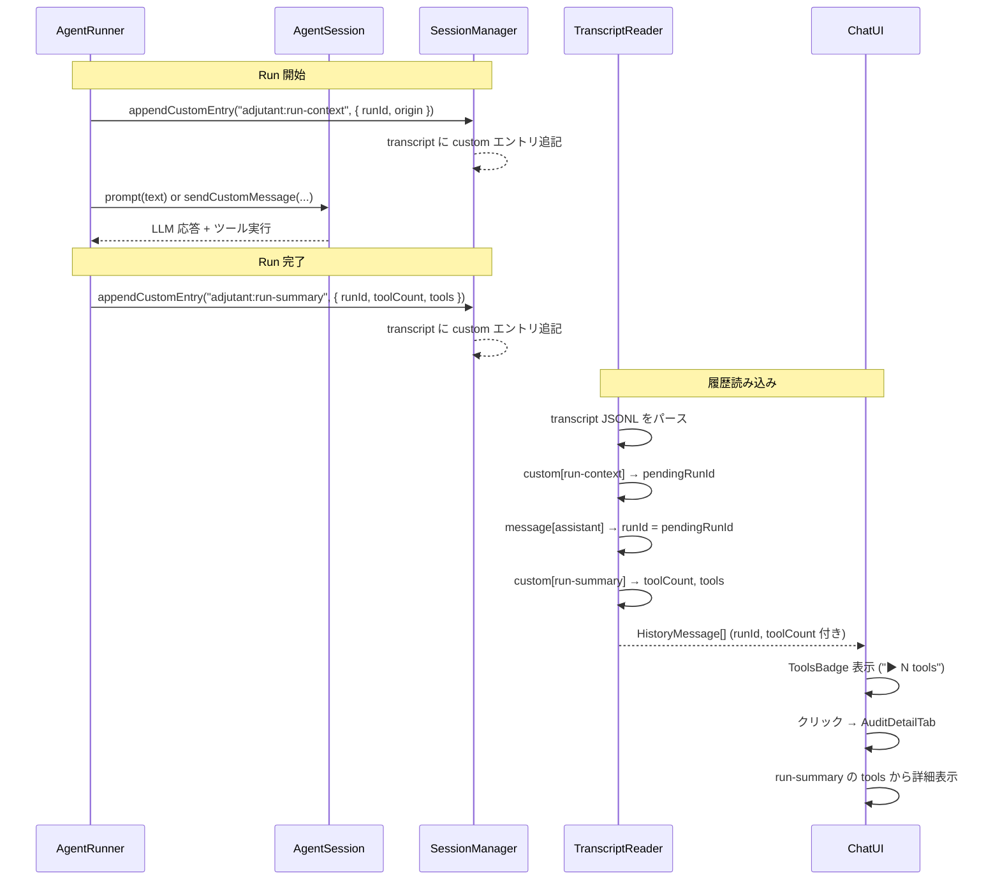
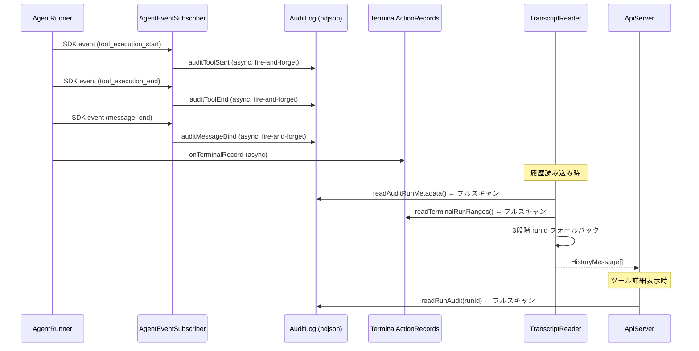
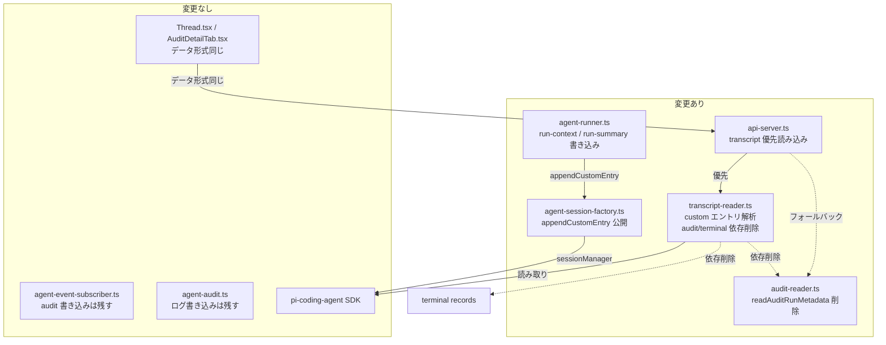

# 260223-s06: トランスクリプト埋め込み run メタデータによるツール表示改善

## 1. 概要と目的 Overview and Purpose

- **What**
  agent run の実行コンテキスト（runId, origin）とツール実行サマリー（toolCount, tools 詳細）をSDK トランスクリプトの `custom` エントリとして直接埋め込む。これにより、チャット UI のツール実行バッジ表示とツール詳細パネルの表示が、audit ログや terminal action records への依存なしにトランスクリプト単体で完結する。

- **Why**
  現状のツール実行表示は 3 つの独立したデータソース（SDK トランスクリプト、audit ログ、terminal action records）を 3 段階フォールバック（payload 直接 → audit message.bind → ±15秒タイムスタンプ近似）で紐付けている。この設計には以下の問題がある:
  - audit ログの非同期 fire-and-forget 書き込みにより、読み込み時に flush されていない可能性
  - タイムスタンプ近似は並行 run があるとミスマッチしうる
  - audit ログが単一ファイルで全 run が混在し、毎回フルスキャン
  - 3 データソースの整合性保証がない

- **How**
  SDK の `SessionManager.appendCustomEntry(customType, data?)` を使用する。このメソッドはトランスクリプト JSONL に `{ type: "custom", customType, data }` エントリを追記するが、LLM コンテキストには含まれない。`AgentSession` は `sessionManager` を public readonly で公開しており、`session.dispose()` の前であればアクセス可能。
  - run 開始前: `adjutant:run-context` エントリ（runId, origin, sessionKey）
  - run 完了後: `adjutant:run-summary` エントリ（runId, toolCount, tools 詳細, durationMs, modelId）
  - transcript-reader がこれらを解析し、HistoryMessage に紐付ける

## 2. 仕様と受け入れ条件 Specification and Acceptance Criteria

### 2.1 スコープ Scope

- 今回やること
  - `AgentSessionLike` に `appendCustomEntry` を optional メソッドとして追加
  - `agent-session-factory.ts` で SDK の `AgentSession.sessionManager.appendCustomEntry` を公開
  - `agent-runner.ts` の `runAgentInternal` で run 前後にカスタムエントリを書き込み
  - `transcript-reader.ts` の `loadMessages` で `custom` エントリを解析し runId / toolCount を解決
  - `transcript-reader.ts` から `readAuditRunMetadata` への依存を削除（`toolEndCountByRunId`, `messageRunIdByMessageId`）
  - `transcript-reader.ts` から terminal run ranges によるタイムスタンプ近似を削除
  - `audit-reader.ts` から `readAuditRunMetadata` / `AuditRunMetadata` 型を削除
  - API サーバーの `/api/chat/runs/:runId/audit` エンドポイントにトランスクリプト内 run-summary からの読み込みを追加（audit ログへのフォールバック付き）
  - 関連テストの追加・更新

- 成果物
  - 変更ファイル: `agent-session-factory.ts`, `agent-runner.ts`, `transcript-reader.ts`, `audit-reader.ts`, `api-server.ts`
  - テストファイル: 対応する `tests/assistant/*.test.ts`

- 制約
  - SDK `@mariozechner/pi-coding-agent@0.52.12` の `SessionManager.appendCustomEntry` API を前提
  - s05（heartbeat の sendCustomMessage 移行）が先に完了していること
  - audit ログの書き込み自体は残す（デバッグ・監視用途）

### 2.2 非スコープ Non Scope

- audit ログのファイル分割やインデックス化
- audit ログの書き込み（`agent-audit.ts`, `agent-event-subscriber.ts`）の削除（デバッグ用途で残す）
- UI コンポーネント（`AuditDetailTab.tsx`, `ToolsBadge`, `Thread.tsx`）の変更（データ形式が同じため不要）
- `readRunAudit` 関数自体の削除（API エンドポイントのフォールバックとして残す）
- heartbeat フィルタリング（s05 のスコープ）

### 2.3 ユースケース Use Cases

1. **正常系: ユーザーチャットでツール実行あり**
   - ユーザーが「ファイルを読んで」とメッセージを送信
   - agent-runner が `adjutant:run-context` エントリをトランスクリプトに書き込む
   - LLM が bash ツールを呼び出し、応答を返す
   - agent-runner が `adjutant:run-summary` エントリ（toolCount: 1, tools 詳細）を書き込む
   - チャット UI が「▶ 1 tools」バッジを表示
   - バッジをクリック → AuditDetailTab がツール詳細を表示

2. **正常系: ツール実行なしのチャット**
   - 通常の会話メッセージ
   - `adjutant:run-summary` の toolCount が 0
   - ToolsBadge は非表示

3. **正常系: 履歴読み込み**
   - `loadMessages()` がトランスクリプトを読み込む
   - `custom` エントリから runId と toolCount を解決
   - audit ログや terminal records の読み込みは不要

4. **異常系: appendCustomEntry が未定義（SDK 非対応）**
   - `AgentSessionLike.appendCustomEntry` が undefined
   - カスタムエントリの書き込みをスキップ
   - transcript-reader は runId が取れないメッセージとして処理（既存の extractRunId フォールバック）

### 2.4 受け入れ条件 Acceptance Criteria

1. **Given** agent run 実行時 **When** `runAgentInternal` が正常完了する **Then** トランスクリプトに `adjutant:run-context` と `adjutant:run-summary` の `custom` エントリが記録される

2. **Given** トランスクリプトに `adjutant:run-context` エントリがある **When** `loadMessages()` が呼ばれる **Then** 後続の assistant メッセージの `runId` がそのエントリの runId と一致する

3. **Given** トランスクリプトに `adjutant:run-summary` エントリ（toolCount > 0）がある **When** `loadMessages()` が呼ばれる **Then** 対応する assistant メッセージの `toolCount` がそのエントリの toolCount と一致する

4. **Given** `loadMessages()` 実行時 **When** audit ログファイルが存在しない **Then** メッセージの runId と toolCount は正しく解決される（audit ログに依存しない）

5. **Given** `/api/chat/runs/:runId/audit` API 呼び出し **When** 該当 runId の `adjutant:run-summary` がトランスクリプトにある **Then** そこからツール詳細を返す

6. **Given** `appendCustomEntry` が session に存在しない **When** agent run が実行される **Then** エラーにならず、カスタムエントリなしで正常完了する

7. **Given** 全テスト **When** `pnpm run check` を実行 **Then** typecheck, lint, format, test がすべてパスする

### 2.5 既知の制約 Known Limitations

- `appendCustomEntry` は LLM コンテキストに含まれないため、LLM 側からは run のメタデータを参照できない（意図通り）
- `custom` エントリの `data` フィールドはツール引数・結果のサマリーであり、audit ログほど詳細ではない場合がある（audit ログの `maxFieldChars` による切り詰め後の値を使用するため）
- 既存のトランスクリプト（本変更前に作成されたもの）には `custom` エントリがないため、`loadMessages` は runId を解決できない。ただし audit ログが存在すればフォールバックとして `readRunAudit` API は引き続き使える
- `appendCustomEntry` の呼び出しが `promptWithRetry` の後・`session.dispose()` の前というタイミング制約がある

## 3. 前提技術スタック Context and Tech Stack

- **Language / Framework**: TypeScript 5.x, ESM, Node.js
- **Libraries**: `@mariozechner/pi-coding-agent@0.52.12`
  - `SessionManager.appendCustomEntry(customType, data?)` → `{ type: "custom", id, parentId, timestamp, customType, data }` エントリ
  - `AgentSession.sessionManager` (public readonly) でアクセス
- **Style Guide**: 既存の Prettier / ESLint 設定に従う
- **Testing**: Node.js 標準 `node:test` モジュール
- **依存**: s05（heartbeat の sendCustomMessage 移行）完了後

## 4. インターフェース契約 Interface Contracts

### 4.1 公開 API / 外部 I/O 一覧

- `/api/chat/runs/:runId/audit` — 既存エンドポイント。レスポンス形式は変更なし。内部ではトランスクリプトの `adjutant:run-summary` を優先し、なければ audit ログにフォールバック。

### 4.2 データモデルとスキーマ

#### AgentSessionLike 拡張（s05 からの差分）

```typescript
export type AgentSessionLike = {
  // ... s05 時点のフィールド ...
  appendCustomEntry?: (customType: string, data?: unknown) => string;
};
```

#### adjutant:run-context エントリ

```json
{
  "type": "custom",
  "id": "a1b2c3d4",
  "parentId": "prev-entry-id",
  "timestamp": "2026-02-23T10:30:00.000Z",
  "customType": "adjutant:run-context",
  "data": {
    "runId": "msg-1708678200000-abc123",
    "origin": "user",
    "sessionKey": "main"
  }
}
```

#### adjutant:run-summary エントリ

```json
{
  "type": "custom",
  "id": "e5f6g7h8",
  "parentId": "assistant-message-entry-id",
  "timestamp": "2026-02-23T10:30:05.000Z",
  "customType": "adjutant:run-summary",
  "data": {
    "runId": "msg-1708678200000-abc123",
    "origin": "user",
    "durationMs": 5000,
    "modelId": "anthropic/claude-sonnet-4-20250514",
    "toolCount": 2,
    "tools": [
      {
        "toolName": "bash",
        "toolCallId": "call_123",
        "status": "ok",
        "durationMs": 1200,
        "args": { "command": "ls -la" },
        "resultSummary": "total 48\ndrwxr-xr-x..."
      },
      {
        "toolName": "bash",
        "toolCallId": "call_456",
        "status": "ok",
        "durationMs": 800,
        "args": { "command": "cat README.md" },
        "resultSummary": "# Project..."
      }
    ]
  }
}
```

#### HistoryMessage（変更なし）

```typescript
export type HistoryMessage = {
  role: "user" | "assistant";
  content: string | Array<{ type: string; text: string }>;
  timestamp: number;
  runId?: string;
  toolCount?: number;
};
```

### 4.3 エラーと例外 Error Handling

- `appendCustomEntry` が undefined: サイレントスキップ（ログ出力なし）
- `appendCustomEntry` が例外をスロー: warn ログを出力し、run 自体は正常完了させる（best-effort）
- トランスクリプトの `custom` エントリが破損: スキップして次のエントリを処理
- `/api/chat/runs/:runId/audit` API: トランスクリプトから取得失敗 → audit ログにフォールバック → 両方失敗なら空レスポンス

### 4.4 代表的な例 Examples

**例1: agent-runner でのカスタムエントリ書き込み**

```typescript
// runAgentInternal 内 — promptWithRetry の前後
const appendEntry = session.appendCustomEntry;
if (typeof appendEntry === "function") {
  try {
    appendEntry("adjutant:run-context", {
      runId: context.runId,
      origin: context.origin,
      sessionKey: context.sessionKey,
    });
  } catch { /* best-effort */ }
}

await promptWithRetry({ ... });
await subscribed.waitForSettledMemoryWrites();

if (typeof appendEntry === "function") {
  try {
    appendEntry("adjutant:run-summary", {
      runId: context.runId,
      origin: context.origin,
      durationMs,
      modelId: sessionMetadata?.modelId ?? context.model,
      toolCount: subscribed.toolCalls.length,
      tools: buildToolSummaries(subscribed),
    });
  } catch { /* best-effort */ }
}
```

**例2: transcript-reader での解析**

```typescript
// loadMessages ループ内
const lineRecord = parsed as Record<string, unknown>;
if (lineRecord.type === "custom") {
  const customType = lineRecord.customType;
  const data = lineRecord.data as Record<string, unknown> | undefined;

  if (customType === "adjutant:run-context" && data) {
    pendingRunId = typeof data.runId === "string" ? data.runId : undefined;
  }
  if (customType === "adjutant:run-summary" && data) {
    pendingToolCount = typeof data.toolCount === "number" ? data.toolCount : undefined;
    pendingToolDetails = data.tools;
  }
  continue;
}
```

**例3: API レスポンス（変更なし）**

```bash
curl http://localhost:3100/api/chat/runs/msg-123/audit
```

```json
{
  "runId": "msg-123",
  "origin": "user",
  "runEnded": true,
  "tools": [
    { "toolName": "bash", "status": "ok", "durationMs": 1200, "args": {"command":"ls"}, "resultSummary": "..." }
  ]
}
```

## 5. アーキテクチャと設計図 Architecture and Diagrams

### 5.1 図の選択方針

データフローの変更が主であるため、シーケンス図で変更前後を比較し、コンポーネント図で変更範囲を示す。

### 5.2 シーケンス図: ツール実行表示の新フロー



### 5.3 シーケンス図: 旧フロー（参考・削除対象）



### 5.4 コンポーネント図: 変更対象と依存関係



## 6. テスト戦略 Test Strategy

### 6.1 テストの種類

- **Unit**
  - `agent-runner.ts`: run 前後に `appendCustomEntry` が正しい customType と data で呼ばれることの検証
  - `agent-runner.ts`: `appendCustomEntry` が undefined の場合にエラーにならないことの検証
  - `agent-runner.ts`: `appendCustomEntry` が例外をスローした場合に run が正常完了することの検証
  - `transcript-reader.ts`: `custom[adjutant:run-context]` → 後続 assistant メッセージの runId 解決
  - `transcript-reader.ts`: `custom[adjutant:run-summary]` → toolCount 解決
  - `transcript-reader.ts`: audit ログなしで runId / toolCount が正しく解決されることの検証
  - `transcript-reader.ts`: `custom` エントリが存在しない旧トランスクリプトでもエラーにならないことの検証
  - モック境界: `AgentSessionLike`（appendCustomEntry）

- **Integration**
  - `api-server.ts`: `/api/chat/runs/:runId/audit` がトランスクリプトから読めない場合に audit ログにフォールバックすることの検証

- **Contract**
  - `AgentSessionLike` の型定義が SDK の `AgentSession` と互換であることを型チェックで担保

### 6.2 カバレッジ対象

- run-context エントリの runId, origin, sessionKey が正しいこと
- run-summary エントリの toolCount, tools 詳細, durationMs, modelId が正しいこと
- ツール実行がない run では toolCount === 0 であること
- 複数の run が連続するトランスクリプトで各 assistant メッセージに正しい runId が紐付くこと
- `custom` エントリが破損している場合にスキップされること
- audit ログの `readAuditRunMetadata` が `loadMessages` から呼ばれないこと

## 7. 実装タスクリスト Implementation Plan

### Phase 1: 設計と準備

- [ ] 要件と仕様の確定（本計画書）
- [ ] s05 の完了確認（heartbeat sendCustomMessage 移行）
- [ ] インターフェース契約の確定（adjutant:run-context / adjutant:run-summary スキーマ）
- [ ] Mermaid 図の作成（本計画書に含む）

### Phase 2: AgentSessionLike の拡張

- [ ] Test: `AgentSessionLike` に `appendCustomEntry` が optional で型定義されることの確認
- [ ] Impl: `agent-session-factory.ts` — `AgentSessionLike` 型に `appendCustomEntry` を追加
- [ ] Impl: `agent-session-factory.ts` — `createAgentSessionFromSdk` で `session.sessionManager.appendCustomEntry` をバインドして公開
- [ ] Refactor: 型定義の整理

### Phase 3: agent-runner での run メタデータ書き込み

- [ ] Test: `runAgentInternal` が promptWithRetry 前に `appendCustomEntry("adjutant:run-context", ...)` を呼ぶテスト (Red)
- [ ] Test: `runAgentInternal` が promptWithRetry 後に `appendCustomEntry("adjutant:run-summary", ...)` を呼ぶテスト (Red)
- [ ] Test: `appendCustomEntry` が undefined の場合にエラーにならないテスト (Red)
- [ ] Test: `appendCustomEntry` が例外をスローした場合に run が正常完了するテスト (Red)
- [ ] Test: run-summary の tools 詳細が agent-event-subscriber の収集データと一致するテスト (Red)
- [ ] Impl: `agent-runner.ts` — ツールサマリー構築ヘルパー関数の追加
- [ ] Impl: `agent-runner.ts` — promptWithRetry 前後での appendCustomEntry 呼び出し追加 (Green)
- [ ] Refactor: エラーハンドリングの整理

### Phase 4: transcript-reader の custom エントリ解析

- [ ] Test: `custom[adjutant:run-context]` → 後続 assistant の runId 解決テスト (Red)
- [ ] Test: `custom[adjutant:run-summary]` → 対応 assistant の toolCount 解決テスト (Red)
- [ ] Test: 複数 run 連続でそれぞれ正しく紐付くテスト (Red)
- [ ] Test: `custom` エントリなし（旧トランスクリプト）でエラーにならないテスト (Red)
- [ ] Test: audit ログなしで runId / toolCount が正しく解決されるテスト (Red)
- [ ] Impl: `transcript-reader.ts` — `loadMessages` ループに `custom` エントリ判定を追加 (Green)
- [ ] Impl: `transcript-reader.ts` — `readAuditRunMetadata` 呼び出しの削除
- [ ] Impl: `transcript-reader.ts` — `readTerminalRunRanges` 呼び出しの削除
- [ ] Impl: `transcript-reader.ts` — `TranscriptReadOptions` から `heartbeatPromptMarker` 削除（s05 で残っていれば）
- [ ] Impl: `transcript-reader.ts` — `isHeartbeatPrompt` 関数の削除（s05 で残っていれば）
- [ ] Refactor: 不要なインポートとヘルパーの削除

### Phase 5: audit-reader のクリーンアップ

- [ ] Test: `readAuditRunMetadata` が export から削除されていることの確認
- [ ] Impl: `audit-reader.ts` — `readAuditRunMetadata` / `AuditRunMetadata` の削除
- [ ] Impl: `audit-reader.ts` — `readAuditRunMetadata` でのみ使用されていた内部ヘルパーの削除
- [ ] Refactor: テストファイルから `readAuditRunMetadata` 関連テストの削除

### Phase 6: API サーバーのトランスクリプト優先読み込み

- [ ] Test: `/api/chat/runs/:runId/audit` がトランスクリプトの run-summary から返すテスト (Red)
- [ ] Test: トランスクリプトに run-summary がない場合に audit ログにフォールバックするテスト (Red)
- [ ] Impl: transcript から run-summary を検索するヘルパー関数の追加
- [ ] Impl: `api-server.ts` — audit エンドポイントの読み込み元をトランスクリプト優先に変更 (Green)
- [ ] Refactor: レスポンス形式の一貫性確認

### Phase 7: 統合と検証

- [ ] 全体テストの実行 (`pnpm run check`)
- [ ] typecheck パスの確認
- [ ] lint / format パスの確認
- [ ] 既存テストの破損がないことの確認
- [ ] ToolsBadge → AuditDetailTab の E2E 動作確認（手動）

## 8. 完了の定義 Definition of Done

### 8.1 機能 DoD Functional DoD

- [ ] 受け入れ条件 1-6 がすべて満たされていること
- [ ] 既知の制約が明文化され、想定通りであること
- [ ] `loadMessages` が audit ログを読み込まないことがテストで検証済み
- [ ] ToolsBadge とツール詳細パネルが正常に表示されること（手動確認）

### 8.2 品質 DoD Quality DoD

- [ ] 全てのテストがパスしていること (`pnpm run test`)
- [ ] 型チェックが通ること (`pnpm run typecheck`)
- [ ] Linter / Formatter のエラーがないこと (`pnpm run lint`, `pnpm run format`)
- [ ] 不要なデバッグコードが削除されていること
- [ ] 主要な変更点が本計画書のタスクチェックリストに反映されていること

## 9. 懸念事項と未確定事項 Concerns and Questions

- **`appendCustomEntry` のタイミング**: `promptWithRetry` 完了後〜`session.dispose()` の間に呼ぶ必要がある。エラーパス（catch ブロック）でも run-summary を書くべきかは要検討。エラー時は toolCalls が不完全な可能性があるため、スキップが安全か。
- **ツールサマリーのデータサイズ**: `agent-event-subscriber` が収集する `toolCalls` はツール結果の全体を含む。`appendCustomEntry` に渡す前に audit ログと同等の切り詰め（`maxFieldChars`）を適用すべきか。トランスクリプトファイルの肥大化リスク。
- **`custom` エントリの順序保証**: SDK の `appendCustomEntry` は現在の leaf に追記するため、`run-context → user message → assistant message → run-summary` の順序は `promptWithRetry` のタイミングで自然に保証される。ただし compaction が挟まった場合に `custom` エントリが消えるリスクがある。
- **旧トランスクリプトとの移行期間**: フォールバックを完全削除すると、s06 デプロイ前のセッションで ToolsBadge が表示されなくなる。許容するか、一時的に audit ログフォールバックを残すか。→ プロトタイプ方針に従い、フォールバックは削除する。
- **`agent-event-subscriber` との責務分担**: ツールサマリー構築を subscriber 側に移すか runner 側に持つか。subscriber は既にツール情報を収集しているため、サマリー構築のヘルパーを subscriber 側に置き、runner から呼ぶのが自然。
