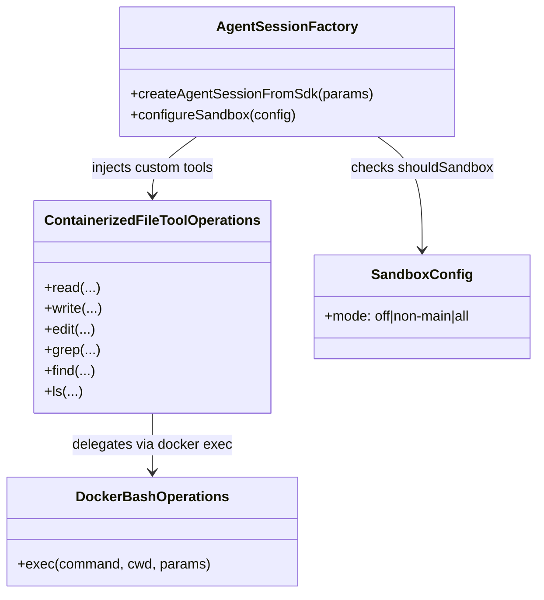
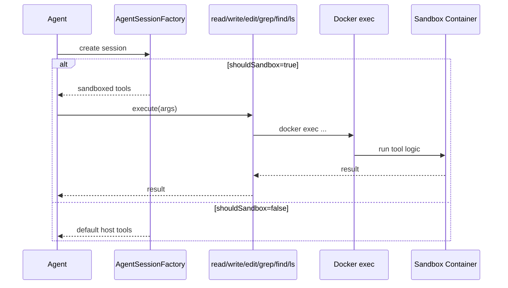

# 260224-s01-agent-tool-access-hardening

## 1. 概要と目的 Overview and Purpose

- What  
  サンドボックス実行対象セッションにおいて、`read` / `write` / `edit` / `grep` / `find` / `ls` をホスト実行ではなく Docker サンドボックス内実行に限定する。
- Why  
  ファイル系ツールの実行境界をホストから分離し、ホスト側ファイルシステムへの直接アクセスを抑止する。`grep/find/ls` の引数解釈差によるパスガード漏れリスクを減らす。
- How  
  `agent-session-factory` で sandbox 対象セッションのみ対象6ツールを custom tool で差し替え、実体処理を `docker exec` ベースの operations に委譲する。非対象セッションは既存挙動を維持する。

後方互換性について: sandbox 対象セッションでのファイル系ツール実行基盤がホストからコンテナへ変わるため、結果差分（パス解決、エラーメッセージ、可視ファイル範囲）は破壊的に変わりうる。プロトタイプ方針に従い、この変更を受け入れる。

## 2. 仕様と受け入れ条件 Specification and Acceptance Criteria

### 2.1 スコープ Scope

- 今回やること
  - サンドボックス対象セッション判定 (`shouldSandbox`) 時のみ `read` / `write` / `edit` / `grep` / `find` / `ls` をコンテナ実行へ置換
  - `bash` と同じ sandbox 判定・同じコンテナを利用
  - 単体テスト・統合テストを追加
  - README / `doc/spec.md` の契約更新
- 成果物
  - containerized file-tool operations 実装
  - `agent-session-factory` への組み込み
  - テストとドキュメント
- 制約
  - ツール名 (`read` / `write` / `edit` / `grep` / `find` / `ls`) と基本契約は維持
  - 適用対象は sandbox 対象セッションのみ（strict 相当）
  - 出力互換ポリシーは以下の3段階で扱う
    - A: 構造互換（`content` 形式、`details` キー）を厳密維持
    - B: 制御文言互換（`offset` 継続案内、limit 到達案内など）は意味互換を維持
    - C: 完全文言一致（成功メッセージの助詞や語順など）は保証しない
  - 新規依存は導入しない

### 2.2 非スコープ Non Scope

- `ADJUTANT_SANDBOX_MODE=off` 時の保護強化
- コンテナ内部ファイル（例: `/etc`）の追加制限
- `bash` の環境変数制御強化
- OS レベル制御（seccomp / AppArmor 等）の追加実装

### 2.3 ユースケース Use Cases

- 正常系
  - サンドボックス対象セッションで `read /workspace/MEMORY.md` が成功する
  - サンドボックス対象セッションで `write /workspace/notes/today.md` が成功する
  - サンドボックス対象セッションで `grep "TODO" /workspace/src/index.ts` が成功する
  - サンドボックス対象セッションで `find "*.ts" /workspace/src` が成功する
  - サンドボックス対象セッションで `ls /workspace/src` が成功する
- 重要異常系
  - サンドボックス対象セッションでホスト固有パス（例: `/Users/...`）を指定すると失敗する
  - sandbox 非対象セッションで本変更によるコンテナ実行が発生しない

### 2.4 受け入れ条件 Acceptance Criteria

1. Given `ADJUTANT_SANDBOX_MODE=all` で対象セッションが sandbox 実行される状態  
   When `read/write/edit/grep/find/ls` を実行する  
   Then 各ツールはホストではなくサンドボックスコンテナ経由で実行される。
2. Given sandbox 対象セッション  
   When ホスト固有絶対パス（例: `/Users/...`）を指定して対象6ツールを実行する  
   Then コンテナ内で解決不能となり失敗し、ホスト側ファイルへ到達しない。
3. Given sandbox 対象セッション  
   When `/workspace` 配下を対象に対象6ツールを実行する  
   Then 既存契約に沿った成功レスポンスを返す。
4. Given sandbox 非対象セッション（`ADJUTANT_SANDBOX_MODE=off` または `non-main` の `main`）  
   When 対象6ツールを実行する  
   Then 従来どおりホスト側実装を利用する。
5. Given sandbox 対象セッション  
   When `/etc` などコンテナ内部パスを対象に `read/grep/find/ls` を実行する  
   Then 本仕様上は許容される（workspace 限定は適用しない）。
6. Given sandbox 対象セッションで対象6ツールが成功/失敗する  
   When ツールレスポンスを検証する  
   Then 出力互換ポリシー A/B を満たし、C（完全文言一致）は要件外とする。

### 2.5 既知の制約 Known Limitations

- 本仕様は「workspace 限定」ではなく「sandbox 限定」であるため、コンテナ内部ファイルへの読み取りは可能。
- ツールの返却テキストはコンテナ基準のパス表現となり、ホスト実行時と差分が出る可能性がある。
- sandbox 非対象セッション（`off` や `non-main` の main）は今回保護されない。
- 将来 `workspace 限定` へ切り替える場合は破壊的変更となるため、移行方針（ロールアウト単位・切替条件）を別途定義する。

## 3. 前提技術スタック Context and Tech Stack

- Language Framework  
  TypeScript (Node.js ESM)
- Libraries  
  `@mariozechner/pi-coding-agent`（ツール差し替え API を利用）
- Style Guide  
  既存 ESLint / Prettier / TypeScript 設定に準拠
- Runtime Deployment  
  Node.js + Docker サンドボックス
- Testing  
  `node --import tsx --test`

## 4. インターフェース契約 Interface Contracts

### 4.1 公開APIまたは外部 I O 一覧

- 設定
  - 既存 `ADJUTANT_SANDBOX_MODE` を利用（新規環境変数は追加しない）
- 外部 I/O
  - Docker (`docker exec`) による対象6ツール実行
  - 既存 sandbox コンテナ（workspace bind mount 済み）利用

### 4.2 データモデルとスキーマ

- `ContainerizedFileToolOperations`（新規）
  - 入力: ツール名、ツール引数、sandbox コンテナ情報
  - 出力: 既存 tool contract 互換の `content` / `details`
  - 失敗: `Error("...")`（コンテナ実行失敗・パス未存在など）
- 出力互換ポリシー
  - A（厳密維持）: `content` の型構造、`details` の主要キー（例: `truncation`, `diff`, `firstChangedLine`）
  - B（意味互換）: 継続読取や上限到達を促す案内文の意味
  - C（非保証）: 文言の完全一致（句読点や語順）
- `agent-session-factory` 拡張
  - sandbox 対象時に対象6ツールの custom tool を注入
  - sandbox 非対象時は既存ツールをそのまま利用

### 4.3 エラーと例外 Error Handling

- エラー分類
  - SandboxExecutionError: Docker 実行失敗、コンテナ未起動、コマンド終了コード異常
  - ToolExecutionError: ツール内部処理失敗（パス未存在など）
- リトライ方針
  - 既存どおり非リトライ
- タイムアウト方針
  - 既存ツール契約を維持
- ログ方針と個人情報
  - エラーログは必要最小限。ホスト機微パスを過度に露出しない。

### 4.4 代表的な例 Examples

- sandbox 対象で workspace 読み取り

```text
input: read {"filePath":"/workspace/MEMORY.md"}
output: success
```

- sandbox 対象でホスト固有パス

```text
input: ls {"path":"/Users/USER"}
output: error (path not found in container)
```

- sandbox 対象でコンテナ内部パス

```text
input: read {"filePath":"/etc/os-release"}
output: success (仕様上許容)
```

## 5. アーキテクチャと設計図 Architecture and Diagrams

### 5.1 図の選択方針

- 複数モジュール（factory / sandbox ops / tool wrappers）にまたがるためクラス図を採用
- 実行時の分岐（sandbox 対象判定）を明示するためシーケンス図を追加

### 5.2 クラス図 Class Diagram



### 5.3 その他の図 Optional



## 6. テスト戦略 Test Strategy

### 6.1 テストの種類

- Unit
  - file-tool wrapper の引数変換とエラーハンドリング
- Integration
  - sandbox 対象セッションで対象6ツールがコンテナ実行になること
  - sandbox 非対象セッションで既存挙動維持
- Contract
  - ツール名・レスポンス形式（`content` / `details`）維持（互換レベルA）
  - 継続案内・limit案内の意味互換を検証（互換レベルB）
  - 文言完全一致をテスト要件にしない（互換レベルC）

### 6.2 カバレッジ対象

- 重要ロジック
  - `shouldSandbox` 判定時の custom tool 差し替え
  - docker 実行委譲
- 契約互換
  - `read` の `truncation` / 継続案内
  - `edit` の `details.diff` / `firstChangedLine`
  - `grep/find/ls` の limit 到達通知
- エラー分岐
  - コンテナ未起動、パス未存在、コマンド失敗
- 境界条件
  - `path` 省略時デフォルト、絶対パス、相対パス、empty directory

## 7. 実装タスクリスト Implementation Plan

### Phase 1 設計と準備

- [x] 要件と仕様の確定 受け入れ条件の確定
- [x] インターフェース契約の確定 スキーマと例の追加
- [x] Mermaid 図の作成 更新
- [x] 型定義と責務境界の確定
  - 対象: `src/assistant/agent-session-factory.ts`, `src/sandbox/*.ts`
- [x] テスト基盤の確認
  - 対象: `tests/assistant/*.test.ts`

### Phase 2 機能名Aの実装（containerized file-tool operations）

- [x] Test 対象6ツール wrapper の失敗テストを作成 Red
  - 対象: `tests/assistant/containerized-file-tool-operations.test.ts`（新規）
- [x] Impl 最小実装 Green
  - 対象: `src/assistant/containerized-file-tool-operations.ts`（新規）
- [x] Refactor 共通ロジック整理（docker 呼び出し・結果整形）
  - 対象: `src/assistant/containerized-file-tool-operations.ts`
- [x] Integration コンテナ実行のケース追加
  - 対象: `tests/assistant/containerized-file-tool-operations.test.ts`
- [x] Docs 契約更新
  - 対象: `README.md`, `doc/spec.md`

### Phase 3 機能名Bの実装（sandbox 時の対象6ツール差し替え）

- [x] Test sandbox 対象時に `read/write/edit/grep/find/ls` がコンテナ実行されるテストを追加 Red
  - 対象: `tests/assistant/agent-session-factory.sandbox.test.ts`
- [x] Impl `agent-session-factory` に対象6ツール custom tool を組み込み Green
  - 対象: `src/assistant/agent-session-factory.ts`
- [x] Refactor 差し替えコード共通化 DRY
  - 対象: `src/assistant/agent-session-factory.ts`
- [x] Integration sandbox 非対象時の既存挙動維持テストを追加
  - 対象: `tests/assistant/agent-session-factory.sandbox.test.ts`
- [x] Docs 設計図と仕様文を更新
  - 対象: `doc/spec.md`
  - 備考: 互換レベル A/B/C を明文化

### Phase 4 統合と検証

- [x] 全体テストの実行（`pnpm check`）
- [x] エッジケース確認（絶対パス、相対パス、path 省略）
- [x] エラー文言とログ粒度の確認
- [x] ドキュメント最終更新

## 8. 完了の定義 Definition of Done

### 8.1 機能DoD Functional DoD

- [x] 受け入れ条件がすべて満たされていること
- [x] 既知の制約が明文化され、想定通りであること
- [x] 代表例に対して期待どおりの結果が得られること

### 8.2 品質DoD Quality DoD

- [x] 全てのテストがパスしていること
- [x] Linter Formatter のエラーがないこと
- [x] 不要なデバッグコードが削除されていること
- [x] 主要な変更点がドキュメントに反映されていること

## 9. 懸念事項と未確定事項 Concerns and Questions

- 出力互換ポリシー A/B/C を `doc/spec.md` へどこまで詳細化するか（代表例中心か、ツール別契約まで書くか）。
- 将来 `workspace 限定` へ切り替える際の段階的移行（警告期間、モード追加、既存運用への影響）をいつ設計するか。
- sandbox 対象判定（`non-main` の main 除外）が期待通りかを手動でも確認する必要がある。

---
