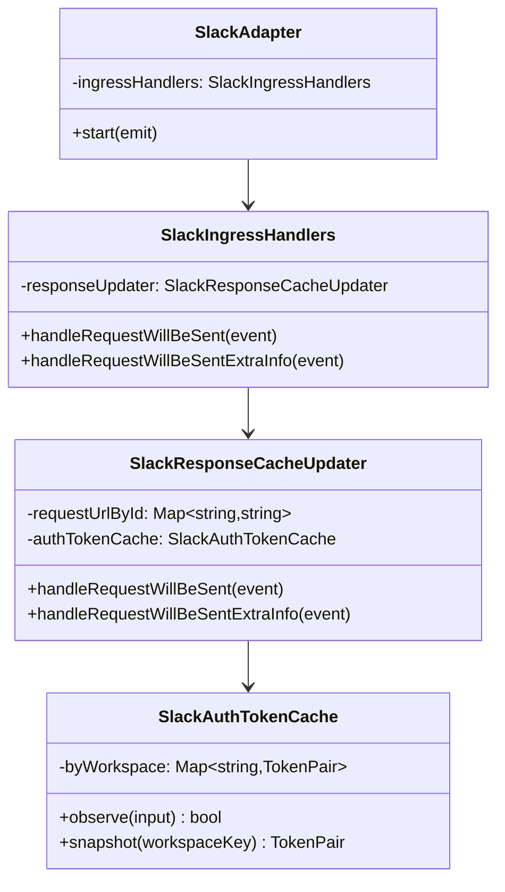
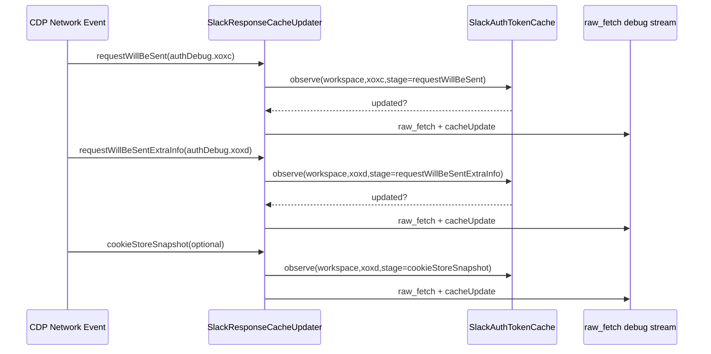

# 260224-s01-slack-auth-token-memory-cache

## 1. 概要と目的 Overview and Purpose

- What  
  Slack CDP デバッグイベントから取得できる `xoxc` と `xoxd` を、セッション中メモリに保持する `SlackAuthTokenCache` を導入する。  
  取得元は分離し、`requestWillBeSent`、`requestWillBeSentExtraInfo`、`cookieStoreSnapshot`（任意ON）をそれぞれ独立したソースとして扱う。
- Why  
  現状はイベントを目視で追う必要があり、最新トークンの参照コストが高い。  
  メモリキャッシュ化により、デバッグUIと内部処理が「現在の有効候補トークン」を O(1) で参照できる。
- How  
  `SlackResponseCacheUpdater` で検出済みの `authDebug` を入力として、単一責務の `SlackAuthTokenCache` に集約する。  
  URL から `workspaceKey` を抽出し、`Map<workspaceKey, TokenPair>` で管理する。  
  値更新時のみ変更イベントを発火し、同値はヒットカウンタ更新のみ行う。

## 2. 仕様と受け入れ条件 Specification and Acceptance Criteria

### 2.1 スコープ Scope

- 今回やること
  - `xoxc/xoxd` のメモリキャッシュ機能を追加。
  - 取得ソースを分離したままキャッシュ更新。
  - `workspaceKey` 単位で最新値を保持。
  - デバッグイベントにキャッシュ状態（更新有無、ソース、timestamp）を追加。
  - 単体テストと既存イベントテストを追加更新。
- 成果物
  - 新規: `src/slack/slackAuthTokenCache.ts`
  - 修正: `src/slack/slackResponseCacheUpdater.ts`, `src/slack/slackIngressHandlers.ts`, `src/slack/adapter.ts`
  - 修正: `tests/slack/slackIngressHandlers.test.ts`, `tests/slackAdapter.events.test.ts`
- 制約
  - プロセス内メモリのみ。永続化しない。
  - 既存の `raw_fetch` イベント構造との互換性は維持しつつ、追加フィールドのみ拡張。
  - `ADJUTANT_DEBUG_SLACK_GET_COOKIES` の既存スイッチ動作は変更しない。

### 2.2 非スコープ Non Scope

- 今回やらないこと
  - トークン暗号化保存、永続化、外部ストレージ連携。
  - トークン自動更新処理や Slack API 実行ロジックの追加。
  - 権限境界を越える secrets 管理基盤の導入。
- 将来検討だが今回除外すること
  - 複数トークン世代の長期履歴管理。
  - 失効検知や有効性検証 API 連携。

### 2.3 ユースケース Use Cases

- 正常系1: `requestWillBeSent` で `xoxc` を検出し、workspace キャッシュに保存する。
- 正常系2: `requestWillBeSentExtraInfo` で `xoxd` を検出し、同一 workspace の `xoxd` を更新する。
- 正常系3: `debugCookieStoreEnabled=true` 時に `cookieStoreSnapshot` から `xoxd` を検出し、ソース情報付きで更新する。
- 異常系1: URL から `workspaceKey` を抽出できない場合は `global` バケットへ保存し、処理継続する。
- 異常系2: 同値トークン再観測時は値を上書きせず `hits/lastSeenAt` のみ更新する。

### 2.4 受け入れ条件 Acceptance Criteria

- Given `requestWillBeSent` の `authDebug.xoxc.value` が存在する  
  When イベントを処理する  
  Then 対応 `workspaceKey` の `xoxc` がメモリキャッシュに保持される。
- Given `requestWillBeSentExtraInfo` の `authDebug.xoxd.value` が存在する  
  When イベントを処理する  
  Then 対応 `workspaceKey` の `xoxd` が更新され、ソースが `requestWillBeSentExtraInfo` として記録される。
- Given `ADJUTANT_DEBUG_SLACK_GET_COOKIES=false`  
  When `requestWillBeSentExtraInfo` を処理する  
  Then `cookieStoreSnapshot` を経由した更新は発生しない。
- Given 同一 `workspaceKey` で同値トークンが連続観測される  
  When 2回目以降を処理する  
  Then `value` は不変で `hits` と `lastSeenAt` のみ増加する。
- Given `workspaceKey` 抽出不能な URL  
  When トークン観測イベントを処理する  
  Then 例外を投げず `global` キーで保存し処理を継続する。

### 2.5 既知の制約 Known Limitations

- メモリキャッシュはプロセス再起動で消える。
- `xoxc/xoxd` の有効性までは判定しない。
- workspace 推定は URL パターン依存であり、未知パスは `global` 退避となる。

## 3. 前提技術スタック Context and Tech Stack

- Language Framework  
  TypeScript 5.x, Node.js ESM, `chrome-remote-interface` ベースの CDP 連携
- Libraries  
  既存実装のみ利用（追加ライブラリなし）
- Style Guide  
  既存 ESLint / Prettier / TypeScript strict 設定に準拠
- Runtime Deployment  
  Node.js ローカル実行 (`pnpm start`)
- Testing  
  Node test runner (`node --import tsx --test`), `pnpm run typecheck`

## 4. インターフェース契約 Interface Contracts

### 4.1 公開APIまたは外部I O一覧

- HTTP API  
  追加なし
- CLI  
  追加なし
- 設定ファイル / 環境変数  
  既存 `ADJUTANT_DEBUG_SLACK_GET_COOKIES` を利用（意味変更なし）
- 永続化ストレージ  
  追加なし（メモリのみ）
- 外部サービス連携  
  既存 CDP イベント入力のみ

### 4.2 データモデルとスキーマ

```ts
type TokenKind = "xoxc" | "xoxd";
type TokenSourceStage =
  | "requestWillBeSent"
  | "requestWillBeSentExtraInfo"
  | "cookieStoreSnapshot";

type TokenEntry = {
  value: string;
  firstSeenAt: number;
  lastSeenAt: number;
  hits: number;
  sourceStage: TokenSourceStage;
  requestId?: string;
  url?: string;
};

type TokenPair = {
  xoxc?: TokenEntry;
  xoxd?: TokenEntry;
};

type SlackAuthTokenCacheSnapshot = {
  workspaceKey: string;
  tokens: TokenPair;
};
```

- バリデーション方針
  - 空文字は保存しない。
  - `TokenSourceStage` は既知3種のみ許可。
  - `workspaceKey` は抽出不可時 `global` を使用。

### 4.3 エラーと例外 Error Handling

- エラー分類
  - 入力不足（token不在）: no-op
  - URL解析失敗: `global` にフォールバック
  - キャッシュ更新処理エラー: 捕捉して `raw_fetch` debug に `cacheError` を追加
- リトライ方針
  - メモリ更新は同期処理でリトライ不要
- タイムアウト方針
  - 追加なし
- ログ方針と個人情報の扱い
  - デバッグ用途のため現状方針を踏襲し、値は非マスクで扱う
  - 本番運用時の出力有効化範囲は運用で制御

### 4.4 代表的な例 Examples

1. `requestWillBeSent` で `xoxc` 検出時の更新結果
```json
{
  "workspaceKey": "EA8QH2AU9",
  "updated": true,
  "tokenKind": "xoxc",
  "sourceStage": "requestWillBeSent",
  "hits": 1
}
```

2. `requestWillBeSentExtraInfo` で同値 `xoxd` 再観測
```json
{
  "workspaceKey": "EA8QH2AU9",
  "updated": false,
  "tokenKind": "xoxd",
  "sourceStage": "requestWillBeSentExtraInfo",
  "hits": 4
}
```

3. URL解析不可時
```json
{
  "workspaceKey": "global",
  "updated": true,
  "tokenKind": "xoxd"
}
```

## 5. アーキテクチャと設計図 Architecture and Diagrams

### 5.1 図の選択方針

- 複数モジュール跨ぎかつ境界（CDPイベント入力 / Debug出力）があるためクラス図を採用。
- 非同期イベント順序が重要なためシーケンス図を追加。

### 5.2 クラス図 Class Diagram



### 5.3 その他の図 Optional



## 6. テスト戦略 Test Strategy

### 6.1 テストの種類

- Unit
  - `SlackAuthTokenCache` の `observe` を直接検証。
  - 同値更新、異値更新、`global` フォールバックを網羅。
- Integration
  - `SlackResponseCacheUpdater` 経由で `requestWillBeSent` / `requestWillBeSentExtraInfo` のキャッシュ更新を検証。
  - `debugCookieStoreEnabled` ON/OFF で更新ソースが分離されることを確認。
- Contract
  - `raw_fetch` ペイロードに `cacheUpdate` 追加後も既存キーを壊さないことを確認。

### 6.2 カバレッジ対象

- 重要ロジック
  - `workspaceKey` 抽出
  - `updated` 判定
  - ソースステージ記録
- エラー分岐
  - URL解析失敗
  - token欠落
- 境界条件
  - 空文字 token
  - 同一 requestId の連続イベント

## 7. 実装タスクリスト Implementation Plan

### Phase 1 設計と準備

- [ ] 要件と仕様の確定 受け入れ条件の確定
- [ ] インターフェース契約の確定 スキーマと例の追加
- [ ] Mermaid図の作成 更新
- [ ] `SlackAuthTokenCache` 型定義の作成
- [ ] テスト基盤の確認（既存 `tests/mockSlackClient.ts` 利用方針）

### Phase 2 Token Cache コア実装

- [ ] Test `SlackAuthTokenCache` の Red テストを追加
- [ ] Impl `src/slack/slackAuthTokenCache.ts` を最小実装
- [ ] Refactor `observe` の重複分岐を整理
- [ ] Integration Updater から呼び出すための I/F を調整
- [ ] Docs 契約と図の差分反映

### Phase 3 Slack イベント統合

- [ ] Test `requestWillBeSent` / `requestWillBeSentExtraInfo` からの更新テストを Red 追加
- [ ] Impl `SlackResponseCacheUpdater` にキャッシュ更新処理を実装
- [ ] Refactor `authDebug` 解析と `cacheUpdate` 生成の責務分離
- [ ] Integration `debugCookieStoreEnabled` ON/OFF の分離動作テスト追加
- [ ] Docs イベント例を更新

### Phase 4 統合と検証

- [ ] `pnpm run typecheck` 実行
- [ ] `node --import tsx --test tests/slack/slackIngressHandlers.test.ts` 実行
- [ ] `node --import tsx --test tests/slackAdapter.events.test.ts` 実行
- [ ] ログと例外の確認（token欠落、URL不正、順不同イベント）
- [ ] 必要ドキュメント更新（実装との差分解消）

## 8. 完了の定義 Definition of Done

### 8.1 機能DoD Functional DoD

- [ ] 受け入れ条件がすべて満たされていること
- [ ] `xoxc/xoxd` が workspace 単位でメモリ参照できること
- [ ] `requestWillBeSent` と `requestWillBeSentExtraInfo` と `cookieStoreSnapshot` が分離記録されること
- [ ] 既知の制約が明文化され、想定通りであること

### 8.2 品質DoD Quality DoD

- [ ] 全テストがパスしていること
- [ ] Linter Formatter Typecheck にエラーがないこと
- [ ] 不要なデバッグコードが削除されていること
- [ ] 主要変更が `doc/plan` とコードコメントに反映されていること

## 9. 懸念事項と未確定事項 Concerns and Questions

- `workspaceKey` の正式抽出ルール  
  `/cache/{workspaceKey}/...` 以外の API パスで何を正とするか要確認。
- キャッシュ参照 API の公開範囲  
  デバッグUI専用か、将来の Slack API ツール層からも参照するかを決める必要がある。
- 非マスク値の取り扱い  
  開発用途としては許容だが、ログ保存先（`raw-fetch.jsonl`）運用ルールを明文化すべき。
- プロトタイプとしてのリスク  
  メモリ保持のみのため再起動で消失する。再接続時の再収集前提が必要。

