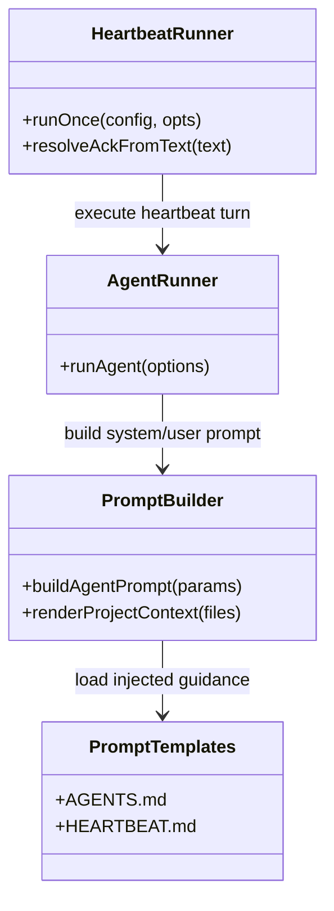
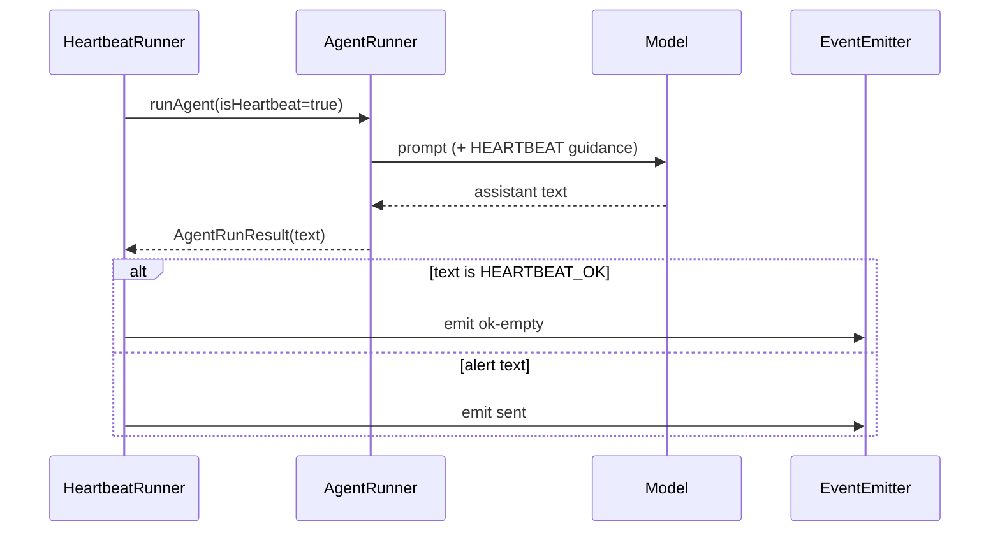

# 260224-s02-heartbeat-openclaw-alignment

## 1. 概要と目的 Overview and Purpose

- What  
  Adjutant の heartbeat 実装を OpenClaw 方針へ寄せ、`report_heartbeat_status` ツール依存を廃止し、`HEARTBEAT_OK` 契約へ移行する。あわせて通常ターンと heartbeat ターンの指示適用範囲を明示的に分離する。
- Why  
  現状は通常ターンにも `HEARTBEAT.md` が Project Context 注入される一方、`HEARTBEAT.md` 文面が heartbeat 専用ツール呼び出しを要求しており、通常ターンで誤動作（bash 実行や `memory_get` 誤用）を誘発しているため。
- How  
  heartbeat ランナーの判定契約を tool-call ベースから text token ベースへ変更し、テンプレート/システム指示を OpenClaw 互換の意味論へ再設計する。注入方式は維持しつつ、適用条件を明文化して誤適用を防ぐ。

後方互換性について: Prototype First に従い、heartbeat ツール契約の破壊的変更を許容する。既存の `report_heartbeat_status` 前提の heartbeat プロンプトは無効化されるため、最小移行としてテンプレートとドキュメントを同時更新する。

## 2. 仕様と受け入れ条件 Specification and Acceptance Criteria

### 2.1 スコープ Scope

- 今回やること
  - heartbeat 成否判定を `report_heartbeat_status` ツール呼び出し依存から `HEARTBEAT_OK` トークン判定へ変更
  - `assistant/prompts/HEARTBEAT.md` を OpenClaw 寄せの最小テンプレートへ変更
  - `assistant/prompts/AGENTS.md` に heartbeat 指示の適用条件を明記
  - 通常ターンの system prompt に heartbeat 指示の適用範囲を追記（heartbeat poll 時のみ適用）
  - heartbeat 実行ターンに識別メタ情報（`HEARTBEAT_META` / custom message details）を付与し、通常ユーザーターンと機械的に区別可能にする
  - `heartbeat-runner` の状態遷移とイベント送信判定を新契約へ合わせて更新
  - 単体テストと統合テストを更新
- 成果物
  - heartbeat 新契約実装（token 判定）
  - prompt/template 更新
  - テスト更新
  - README / `doc/spec.md` 更新
- 制約
  - 既存の heartbeat visibility 設定（`showOk` / `showAlerts` / `useIndicator`）は維持
  - sandbox 実装や file tools 制約は今回対象外
  - 新規外部依存は導入しない

### 2.2 非スコープ Non Scope

- Slack CDP 接続失敗 (`ECONNREFUSED 127.0.0.1:9222`) の解消
- Channel manager / plugin 起動条件の設計変更
- memory_search / memory_get の機能追加や権限制御変更
- cron 実行基盤の仕様変更

### 2.3 ユースケース Use Cases

- 正常系
  - heartbeat ターンでエージェント返答が `HEARTBEAT_OK`（前後空白許容）なら「OK扱い」で通知抑制される
  - heartbeat ターンで alert 文のみ返した場合は通知される
  - 通常ターンでは `HEARTBEAT.md` が注入されても heartbeat 専用指示を実行しない
- 重要異常系
  - heartbeat ターンで `HEARTBEAT_OK` が文中に混在する不正フォーマットは ack とみなさない
  - 旧 `report_heartbeat_status` を呼ばないことを理由に heartbeat が failed にならない

### 2.4 受け入れ条件 Acceptance Criteria

1. Given heartbeat ターン (`isHeartbeat=true`)  
   When モデル返答が `HEARTBEAT_OK` のみ（または前後空白のみ）  
   Then heartbeat は `ok-empty` として扱われ、通知本文は送られない。
2. Given heartbeat ターン  
   When モデル返答が `HEARTBEAT_OK` を含まない alert テキスト  
   Then heartbeat は alert 扱いとなり、`showAlerts=true` なら通知される。
3. Given heartbeat ターン  
   When モデル返答が `report_heartbeat_status` ツール未使用  
   Then 旧理由 `missing-report-heartbeat-status-tool-call` で failed にならない。
4. Given 通常ターン (`isHeartbeat=false`)  
   When `HEARTBEAT.md` が Project Context に含まれる  
   Then 指示の適用範囲が heartbeat poll 時のみであることが system prompt 上で明示される。
5. Given デフォルトテンプレート更新後の新規 workspace  
   When `HEARTBEAT.md` が生成される  
   Then `report_heartbeat_status` 呼び出し指示を含まない最小テンプレートとなる。
6. Given heartbeat ターン  
   When heartbeat prompt が送信される  
   Then heartbeat 専用メタ情報（例: source/runAt/triggerReason）が付与され、通常ユーザーターンとの識別キーとして利用できる。
7. Given `pnpm check` 実行  
   When 変更後のテストを走らせる  
   Then format/typecheck/test がすべて成功する。

### 2.5 既知の制約 Known Limitations

- `HEARTBEAT_OK` 判定は文面ルールに依存するため、モデル出力ゆらぎを 100% 排除できない。
- 通常ターンに `HEARTBEAT.md` を注入する方針自体は維持するため、プロンプト品質への依存は残る。
- 既存ログ上の `report_heartbeat_status` 失敗履歴は遡及修正しない。

## 3. 前提技術スタック Context and Tech Stack

- Language Framework  
  TypeScript (Node.js ESM)
- Libraries  
  `@mariozechner/pi-coding-agent`（Agent セッション実行）
- Style Guide  
  既存 ESLint / Prettier / TypeScript 設定に準拠
- Runtime Deployment  
  Node.js, Assistant Gateway runtime
- Testing  
  `node --import tsx --test`, `pnpm check`

## 4. インターフェース契約 Interface Contracts

### 4.1 公開APIまたは外部 I O 一覧

- 設定ファイル/テンプレート
  - `assistant/prompts/HEARTBEAT.md`
  - `assistant/prompts/AGENTS.md`
- 内部 API
  - `runOnce()` heartbeat 実行契約（`src/assistant/heartbeat-runner.ts`）
- ログ/イベント
  - heartbeat event payload（`ok-empty` / `sent` / `skipped` / `failed`）

### 4.2 データモデルとスキーマ

- heartbeat 判定入力
  - 旧: toolCalls 中の `report_heartbeat_status` details
  - 新: 最終 assistant text（`HEARTBEAT_OK` 判定）
- heartbeat ターン識別メタ情報
  - prompt 内 `HEARTBEAT_META` ブロック（`source`, `run_at`, `trigger_reason`, `session_key`）
  - custom message details（`adjutant.heartbeat.turn.v1`）
- heartbeat 判定出力
  - `ok-empty`: ack
  - `sent`: alert 配信
  - `skipped`: visibility/readiness 等による非配信
  - `failed`: 実行エラー
- バリデーション方針
  - `HEARTBEAT_OK` は「行頭行末トークン」判定（中間出現は無効）

### 4.3 エラーと例外 Error Handling

- エラー分類
  - RuntimeError: モデル実行失敗、I/O 失敗
  - ContractError: heartbeat 返答フォーマット不正（必要に応じ warning 扱い）
- リトライ方針
  - 既存 heartbeat retry 契約を維持
- タイムアウト方針
  - 既存 `DEFAULT_TIMEOUT_MS` と config override を維持
- ログ方針と個人情報
  - 返答本文は既存の監査方針に従い要約ログのみ。秘匿情報は追加露出しない。

### 4.4 代表的な例 Examples

- heartbeat OK

```text
input: assistant text = "HEARTBEAT_OK"
output: event.status = "ok-empty" (message not delivered)
```

- heartbeat alert

```text
input: assistant text = "Build failed on main branch. Please check CI."
output: event.status = "sent" (alert delivered)
```

- 通常ターン

```text
input: user turn with Project Context including HEARTBEAT.md
output: system prompt includes explicit scope note ("heartbeat poll時のみ適用")
```

## 5. アーキテクチャと設計図 Architecture and Diagrams

### 5.1 図の選択方針

- heartbeat ランナー、prompt ビルダー、テンプレート更新の責務分割があるためクラス図を採用
- heartbeat 判定フローの変更（tool → text token）が重要なためシーケンス図を追加

### 5.2 クラス図 Class Diagram



### 5.3 その他の図 Optional



## 6. テスト戦略 Test Strategy

### 6.1 テストの種類

- Unit
  - `HEARTBEAT_OK` 判定関数（前後空白、文中混在、大小文字）
  - 通常ターン向け指示分離文の組み立て
- Integration
  - `runOnce` の `ok-empty` / `sent` 分岐
  - `isHeartbeat=false` で `report_heartbeat_status` を要求しないこと
- Contract
  - heartbeat event status 契約維持
  - 旧 tool 契約削除による破壊点の明示と検証

### 6.2 カバレッジ対象

- 重要ロジック
  - heartbeat text 判定
  - prompt 生成時の scope 明示
- エラー分岐
  - モデル失敗、空返答、不正 token 位置
- 境界条件
  - 改行/空白のみ、長文 alert、`HEARTBEAT_OK` 前後ノイズ

## 7. 実装タスクリスト Implementation Plan

### Phase 1 設計と準備

- [x] 要件と仕様の確定 受け入れ条件の確定
- [x] インターフェース契約の確定 スキーマと例の追加
- [x] Mermaid 図の作成 更新
- [x] インターフェース 型定義の作成
  - 対象: `src/assistant/heartbeat-runner.ts`, `src/assistant/agent-prompt-builder.ts`
- [x] テスト基盤の確認
  - 対象: `tests/assistant/heartbeat-runner.test.ts`, `tests/assistant/agent-prompt-builder.test.ts`

### Phase 2 Heartbeat 契約移行（tool-call -> HEARTBEAT_OK）

- [x] Test `report_heartbeat_status` なしでも heartbeat 成功となる失敗テストを作成 Red
  - 対象: `tests/assistant/heartbeat-runner.test.ts`
- [x] Impl `HEARTBEAT_OK` 判定を実装し既存失敗を解消 Green
  - 対象: `src/assistant/heartbeat-runner.ts`
- [x] Refactor 旧 `report_heartbeat_status` 依存ロジックを削除し判定関数を単純化
  - 対象: `src/assistant/heartbeat-runner.ts`, `src/assistant/agent-session-factory.ts`
- [x] Integration heartbeat event 分岐テストを追加
  - 対象: `tests/assistant/heartbeat-runner.test.ts`
- [x] Docs heartbeat 契約更新
  - 対象: `doc/spec.md`, `README.md`

### Phase 3 指示スコープ分離（通常ターン vs heartbeat）

- [x] Test 通常ターンで heartbeat 専用指示の適用範囲が明示されるテストを追加 Red
  - 対象: `tests/assistant/agent-prompt-builder.test.ts`
- [x] Impl AGENTS/HEARTBEAT テンプレートを OpenClaw 方針へ更新 Green
  - 対象: `assistant/prompts/AGENTS.md`, `assistant/prompts/HEARTBEAT.md`
- [x] Test heartbeat 実行時に heartbeat メタ情報が送信 payload/details に含まれることを検証 Red
  - 対象: `tests/assistant/agent-runner.test.ts`, `tests/assistant/heartbeat-runner.test.ts`
- [x] Impl heartbeat 実行時のメタ情報付与（`HEARTBEAT_META` と custom message details） Green
  - 対象: `src/assistant/heartbeat-runner.ts`, `src/assistant/agent-runner.ts`
- [x] Refactor Project Context 組み立ての文言整理と重複排除
  - 対象: `src/assistant/bootstrap-context.ts`, `src/assistant/agent-prompt-builder.ts`
- [x] Integration bootstrap 生成後の実挙動確認テストを追加
  - 対象: `tests/assistant/workspace-bootstrap.test.ts`, `tests/assistant/agent-runner.test.ts`
- [x] Docs 実行条件分離の仕様追記
  - 対象: `doc/spec.md`

### Phase 4 統合と検証

- [x] 全体テストの実行（`pnpm check`）
- [x] エッジケース確認（`HEARTBEAT_OK` 文中混在、空ファイル、通常ターン誤用）
- [x] ログと例外の確認（警告ノイズ削減、失敗理由の妥当性）
- [x] ドキュメント最終更新（仕様、契約、図）

## 8. 完了の定義 Definition of Done

### 8.1 機能DoD Functional DoD

- [x] 受け入れ条件がすべて満たされていること
- [x] 既知の制約が明文化され、想定通りであること
- [x] 契約の例に対して期待通りの結果が得られること

### 8.2 品質DoD Quality DoD

- [x] 全てのテストがパスしていること
- [x] Linter Formatter のエラーがないこと
- [x] 不要なデバッグコードが削除されていること
- [x] 主要な変更点がドキュメントに反映されていること

## 9. 懸念事項と未確定事項 Concerns and Questions

- `HEARTBEAT_OK` の許容フォーマットをどこまで緩くするか（前後句読点の許容範囲）。
- `report_heartbeat_status` ツールを完全削除するか、移行期間のみ残すか（Prototype First では削除推奨）。
- 通常ターンで `HEARTBEAT.md` を引き続き注入する方針は維持するが、将来必要なら session 種別で注入制御を再検討する。
- 既存 heartbeat 履歴の意味解釈（旧 status との互換表示）を UI 側でどう扱うかは別途確認が必要。
- heartbeat メタ情報の互換（将来スキーマ更新時の versioning ルール）をどの粒度で固定するか。

---
