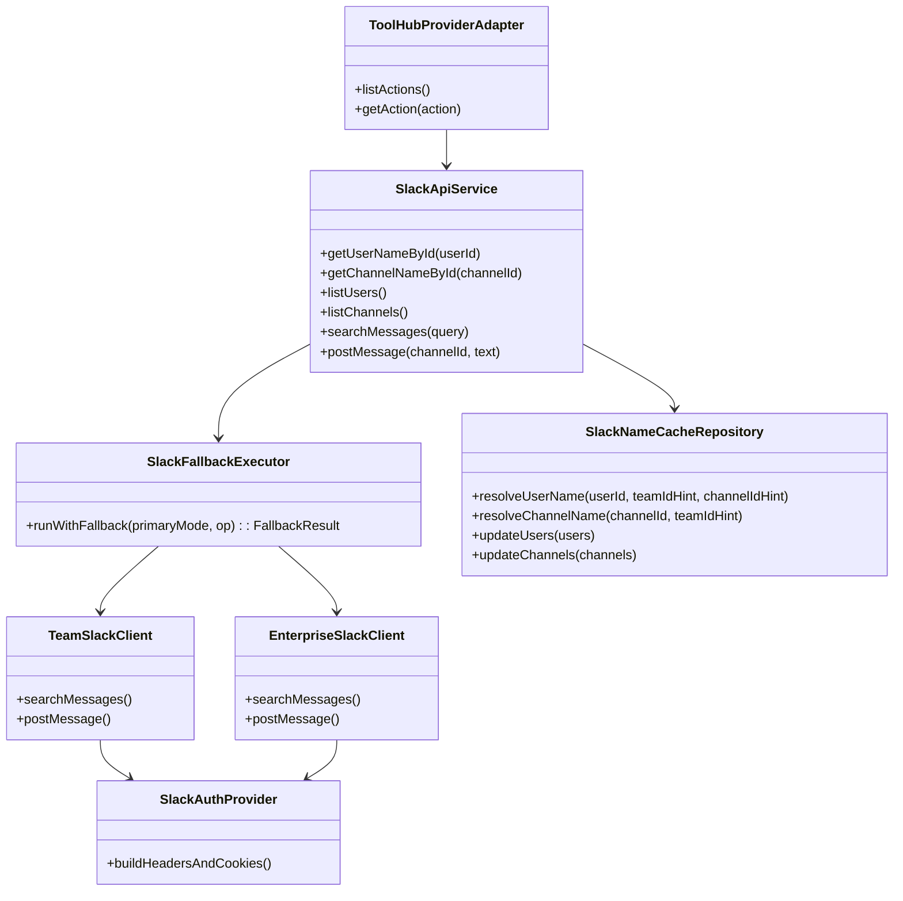
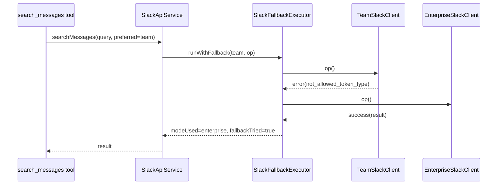

# 260224-s02-slack-api-tools-auto-fallback

## 1. 概要と目的 Overview and Purpose

- What  
  `adjutant` の `tool_hub` に Slack provider を追加し、以下 6 action を提供する。  
  `user_id -> user_name` 取得、`channel_id -> channel_name` 取得、`users_list`、`channels_list`、`search_messages`、`post_message`。  
  `search_messages` と `post_message` は Team/Enterprise の疎通差を吸収するが、実行モードは選択可能にする。
- Why  
  既存の CDP 収集で得られる `xoxc/xoxd` を実運用ツールに接続し、日常運用で必要な参照・検索・投稿を安定して実行するため。  
  手動切替依存を減らし、失敗率を下げる。
- How  
  認証層、HTTP Transport 層、Slack API クライアント層、Tool 定義層を分離する。  
  `search_messages/post_message` は `routing_mode` に応じて挙動を切り替える。  
  `manual_team` / `manual_enterprise` は単一経路のみ実行、`auto_probe` は workspace 単位で事前判定し pin された経路を使う。  
  `auto_probe` でのみ限定フォールバックを許可し、`429/rate_limited` はフォールバック対象外にする。  
  実装詳細は `vendor/slack-mcp-server/` を参照し、特に認証優先順・Cookie 付与・edge 呼び出し・Enterprise 分岐の挙動を合わせる。

## 2. 仕様と受け入れ条件 Specification and Acceptance Criteria

### 2.1 スコープ Scope

- 今回やること
  - `tool_hub` 内に Slack provider の action 6 種を追加。
  - `xoxc/xoxd` 認証で利用可能な HTTP クライアントを追加。
  - Team/Enterprise の選択可能な実行モードを実装（`manual_*` / `auto_probe`）。
  - workspace ごとの事前判定と route pin を実装。
  - `id -> name` 解決に既存 `SlackNameCacheRepository` を流用し、既存キャッシュファイルを共用する。
  - 失敗時のエラー分類と実行ログを整備。
  - `vendor/slack-mcp-server/` の参照ポイントと `adjutant` 実装の対応表を作成する。
- 成果物
  - `src/assistant/slack-api-tools/` 配下の新規モジュール群（auth/client/fallback/tools）
  - `src/assistant/agent-session-factory.ts` の `tool_hub` 登録連携更新
  - `src/slack/nameCacheRepository.ts` の再利用初期化コード
  - workspace route pin ストア（JSON）
  - 単体・統合テスト
- 制約
  - プロトタイプ優先。新規キャッシュ形式は増やさず既存形式を流用。
  - 対象 API は 6 機能に限定。
  - `auto_probe` のフォールバックは最大 1 回（2 経路）まで。
  - `rate_limited(429)` はフォールバックしない。

### 2.2 非スコープ Non Scope

- 今回やらないこと
  - 全 Slack API の網羅。
  - 添付ファイル操作やリアクション操作。
  - 長期永続キャッシュや分散キャッシュ。
- 将来検討だが今回除外すること
  - tool 単位の高度なレートリミット制御。
  - 複数アカウント同時実行最適化。

### 2.3 ユースケース Use Cases

- 正常系1  
  ユーザーが `user_id` から表示名を取得し、即時に結果を得る。
- 正常系2  
  `routing_mode=auto_probe` で `search_messages` 実行時、workspace pin の主経路失敗後に限定条件でフォールバックして成功する。
- 正常系3  
  `routing_mode=manual_team` で `post_message` 実行時、Team 経路のみで成功する。
- 異常系1  
  `auto_probe` で 2 経路とも失敗した場合、経路ごとの失敗理由を集約して返す。
- 異常系2  
  `xoxc` はあるが `xoxd` 不在の場合、実行前バリデーションで失敗し API 呼び出ししない。

### 2.4 受け入れ条件 Acceptance Criteria

- Given 有効な `xoxc/xoxd` がセットされている  
  When `list_users` を実行する  
  Then ユーザー一覧が返り、既存 `user-names-by-team` キャッシュファイルが更新される。
- Given `routing_mode=manual_enterprise` で `post_message` を実行する  
  When Enterprise 経路が成功する  
  Then Team 経路は実行されない。
- Given `routing_mode=auto_probe` で `search_messages` を初回実行する  
  When probe が Team を選定する  
  Then workspace pin が Team で保存され、次回以降は Team を主経路として実行する。
- Given `routing_mode=auto_probe` で主経路が `rate_limited(429)` を返す  
  When 実行を継続する  
  Then フォールバックせず `rate_limited` エラーを返す。
- Given `routing_mode=auto_probe` で主経路が既知の非対応エラーを返す  
  When 実行を継続する  
  Then 1回だけ副経路へフォールバックする。
- Given `user_id` がキャッシュに存在する  
  When `get_user_name_by_id` を実行する  
  Then 外部 API 呼び出しなしで名前を返す（既存キャッシュロード済み前提）。
- Given `search_messages` の 2 経路が失敗する  
  When 実行が終了する  
  Then `primary_error` と `fallback_error` を含む構造化エラーを返す。
- Given `xoxc` はあるが `xoxd` が空  
  When 任意ツールを実行する  
  Then `auth_invalid` エラーを返し、HTTP 呼び出しは実行しない。

### 2.5 既知の制約 Known Limitations

- Slack 側仕様変更により経路の通りやすさは変動する。
- 既存キャッシュファイルへの複数プロセス同時書き込みは last-write-wins となる。
- `search_messages` の結果整形は最小限（高度なランキング調整は未対応）。
- probe 判定結果が変わる場合は、運用で pin を明示更新する必要がある。

## 3. 前提技術スタック Context and Tech Stack

- Language Framework  
  TypeScript 5.x, Node.js ESM
- Libraries  
  既存依存を優先利用。HTTP は Node 標準 `fetch` または既存方針準拠で統一
- Style Guide  
  既存 ESLint / Prettier / TypeScript strict に準拠
- Runtime Deployment  
  ローカル Node 実行（Assistant Gateway）
- Testing  
  `node --import tsx --test`、`pnpm run typecheck`

## 4. インターフェース契約 Interface Contracts

### 4.1 公開APIまたは外部I O一覧

- HTTP API  
  Slack Web API / Edge API を `tool_hub -> slack provider` 内部クライアントから呼び出す
- CLI  
  追加なし
- 設定ファイル
  - `ADJUTANT_SLACK_API_ENABLED` (bool)
  - `ADJUTANT_SLACK_API_ROUTING_MODE` (`manual_team` | `manual_enterprise` | `auto_probe`)
  - `ADJUTANT_SLACK_XOXC_TOKEN`, `ADJUTANT_SLACK_XOXD_TOKEN`
- 永続化ストレージ  
  既存 Slack キャッシュファイルを再利用  
  `channel-names-by-team/*.json`, `user-names-by-team/*.json`
- 外部サービス連携  
  Slack API（公式/edge）
- 参照実装  
  `vendor/slack-mcp-server/` を一次参照とし、以下を優先して踏襲する。  
  `pkg/provider/api.go`（認証優先順、Enterprise 分岐、users_search 切替）  
  `pkg/transport/transport.go`（Cookie 付与）  
  `pkg/provider/edge/edge.go`（token 注入と edge POST）

### 4.2 データモデルとスキーマ

```ts
type SlackMode = "team" | "enterprise";
type SlackRoutingMode = "manual_team" | "manual_enterprise" | "auto_probe";

type WorkspaceRoutePin = {
  workspaceKey: string;
  mode: SlackMode;
  decidedAt: number;
};

type FallbackResult<T> = {
  modeUsed: SlackMode;
  fallbackTried: boolean;
  data: T;
};

type SlackApiError = {
  code:
    | "auth_invalid"
    | "primary_failed"
    | "fallback_failed"
    | "rate_limited"
    | "not_found"
    | "validation_error";
  message: string;
  primaryError?: string;
  fallbackError?: string;
};

type SharedNameCacheRepository = SlackNameCacheRepository;
type WorkspaceRouteStore = Map<string, WorkspaceRoutePin>;
```

- バリデーション方針
  - `xoxc/xoxd` は空文字不可。
  - `channel_id`、`user_id`、`query` の最小長チェック。
  - `post_message.text` の最小長チェック。
  - キャッシュ参照は `teamId` ヒント優先、未指定時は既存 `resolveTeam()` 規約に従う。

### 4.3 エラーと例外 Error Handling

- エラー分類
  - 入力不正: `validation_error`
  - 認証不正: `auth_invalid`
  - 主経路失敗: `primary_failed`
  - フォールバック失敗: `fallback_failed`
  - レート制限: `rate_limited`
- リトライ方針
  - 経路内リトライは行わない（YAGNI）
  - `auto_probe` のみ、既知の非対応エラー時に異なる経路へ 1 回フォールバックを実施
  - `rate_limited(429)` / `timeout` / `network_error` はフォールバックせず即時失敗
- タイムアウト方針
  - 1 リクエストあたり固定タイムアウト（例 10 秒）
- ログ方針と個人情報の扱い
  - トークン値はログ出力しない
  - エラー時は endpoint/mode/requestId を記録

### 4.4 代表的な例 Examples

1. `search_messages` 成功（auto_probe + フォールバック）

```json
{
  "modeUsed": "enterprise",
  "fallbackTried": true,
  "data": { "messages": [{ "channel_id": "C1", "ts": "171...", "text": "hello" }] }
}
```

2. `post_message` 失敗（manual モード）

```json
{
  "code": "primary_failed",
  "message": "post_message failed in manual_enterprise mode",
  "primaryError": "enterprise: channel_not_found"
}
```

3. `get_user_name_by_id` キャッシュヒット

```json
{
  "user_id": "U123",
  "name": "alice",
  "source": "memory_cache"
}
```

4. workspace route pin

```json
{
  "workspaceKey": "EA8QH2AU9",
  "mode": "team",
  "decidedAt": 1766880000
}
```

### 4.5 API別 参照実装マッピング

- `get_user_name_by_id`
  - 参照1: `vendor/slack-mcp-server/pkg/provider/api.go:1064` `ProvideUsersMap()`（ID->User の参照元）
  - 参照2: `vendor/slack-mcp-server/pkg/provider/api.go:746` `GetUsersContext()` 取得結果を `usersSnapshot` に格納
  - 参照3: `vendor/slack-mcp-server/pkg/provider/api.go:335` `GetUsersInfo()`（キャッシュミス時の補完候補）
  - `adjutant` 既存再利用: `src/slack/nameCacheRepository.ts:81` `resolveUserName()`
- `get_channel_name_by_id`
  - 参照1: `vendor/slack-mcp-server/pkg/provider/api.go:1069` `ProvideChannelsMaps()`（ID->Channel の参照元）
  - 参照2: `vendor/slack-mcp-server/pkg/provider/api.go:1020` `GetChannels()`（チャンネル一覧構築）
  - 参照3: `vendor/slack-mcp-server/pkg/provider/api.go:1031` `channelsSnapshot` 更新
  - `adjutant` 既存再利用: `src/slack/nameCacheRepository.ts:59` `resolveChannelName()`
- `users_list`
  - 参照1: `vendor/slack-mcp-server/pkg/provider/api.go:331` `GetUsersContext()`（一次取得）
  - 参照2: `vendor/slack-mcp-server/pkg/provider/api.go:746` 以降（users refresh と snapshot 反映）
  - 参照3: `vendor/slack-mcp-server/pkg/provider/api.go:933` 以降（Slack Connect 補完）
  - `adjutant` 既存再利用: `src/slack/nameCacheRepository.ts:148` `updateUsers()`
- `channels_list`
  - 参照1: `vendor/slack-mcp-server/pkg/provider/api.go:343` `GetConversationsContext()`（Team/Enterprise 分岐）
  - 参照2: `vendor/slack-mcp-server/pkg/provider/api.go:962` `GetChannelsType()`（ページング取得）
  - 参照3: `vendor/slack-mcp-server/pkg/provider/api.go:1020` `GetChannels()`（統合と型フィルタ）
  - 参照4: `vendor/slack-mcp-server/pkg/provider/edge/slacker.go:16`（Enterprise + browser token での edge conversations）
  - `adjutant` 既存再利用: `src/slack/nameCacheRepository.ts:113` `updateChannels()`
- `search_messages`
  - 参照1: `vendor/slack-mcp-server/pkg/provider/api.go:408` `SearchContext()`（公式 search 呼び出し）
  - 参照2: `vendor/slack-mcp-server/pkg/provider/api.go:343`（本計画では同様の分岐思想を search にも適用）
  - 参照3: `vendor/slack-mcp-server/pkg/provider/edge/edge.go:209` / `:256`（edge POST の token 注入）
- `post_message`
  - 参照1: `vendor/slack-mcp-server/pkg/provider/api.go:412` `PostMessageContext()`（公式投稿）
  - 参照2: `vendor/slack-mcp-server/pkg/provider/api.go:343`（本計画では同様の分岐思想を post にも適用）
  - 参照3: `vendor/slack-mcp-server/pkg/transport/transport.go:65`（全リクエスト Cookie 付与）

## 5. アーキテクチャと設計図 Architecture and Diagrams

### 5.1 図の選択方針

- 複数モジュールに責務分割し外部 I/O があるためクラス図を必須とする。
- フォールバック順序が重要なためシーケンス図を追加する。

### 5.2 クラス図 Class Diagram



### 5.3 その他の図 Optional



## 6. テスト戦略 Test Strategy

### 6.1 テストの種類

- Unit
  - `SlackFallbackExecutor` の分岐（成功、片失敗、両失敗）
  - `SlackAuthProvider` の入力検証
  - `SlackNameCacheRepository` 利用時の hit/miss と team 解決
- Integration
  - `SlackApiService` から各クライアント呼び出し連携
  - `search_messages/post_message` の自動フォールバック連携
  - 既存キャッシュファイルの読み書き互換（schema 維持）
- Contract
  - Tool 入出力 JSON スキーマの互換性
  - エラー payload の必須フィールド保証

### 6.2 カバレッジ対象

- 重要ロジック
  - 経路選択とフォールバック制御
  - 既存キャッシュファイル経由の id->name 解決
- エラー分岐
  - 認証不備、4xx/5xx、タイムアウト
- 境界条件
  - 空文字入力、上限件数、キャッシュ未初期化

## 7. 実装タスクリスト Implementation Plan

### Phase 1 設計と準備

- [ ] 要件と仕様の確定 受け入れ条件の確定
- [ ] インターフェース契約の確定 スキーマと例の追加
- [ ] Mermaid図の作成 更新
- [ ] 型定義 `SlackMode`, `FallbackResult`, `SlackApiError` を作成
- [ ] テスト基盤の確認（mock client 方針確定）
- [ ] `vendor/slack-mcp-server/` 参照対応表を作成（機能ごとの準拠箇所を明記）
- [ ] 既存キャッシュ再利用方針を確定（`nameCacheRepository` + `resolveSlackCacheBaseDir`）

### Phase 2 認証・クライアント基盤

- [ ] Test `SlackAuthProvider` の Red テスト追加
- [ ] Impl `xoxc/xoxd` バリデーションと Cookie 付与を実装
- [ ] Refactor Team/Enterprise 共通 HTTP 処理を抽出
- [ ] Integration TeamSlackClient / EnterpriseSlackClient 疎通テスト追加
- [ ] Docs 契約の例を更新
- [ ] `vendor/slack-mcp-server/pkg/transport/transport.go` と同等の Cookie 付与動作を確認

### Phase 3 APIツール実装（自動フォールバック）

- [ ] Test `search_messages/post_message` フォールバック Red テスト追加
- [ ] Impl `SlackFallbackExecutor` を実装
- [ ] Refactor `SlackApiService` で 6 機能を統合
- [ ] Integration `tool_hub` の Slack provider/action へ登録
- [ ] Docs ツールI/Fとエラー例を更新
- [ ] `vendor/slack-mcp-server/pkg/provider/api.go` の Enterprise 分岐ロジックとの差分レビュー
- [ ] `users_list/channels_list` を既存キャッシュファイルへ反映する統合テスト追加

### Phase 4 統合と検証

- [ ] 全体テストの実行
- [ ] エッジケース動作確認（両経路失敗、認証不足、タイムアウト）
- [ ] ログと例外の確認（トークン非露出）
- [ ] ドキュメント更新（仕様・契約・図）

## 8. 完了の定義 Definition of Done

### 8.1 機能DoD Functional DoD

- [ ] 受け入れ条件がすべて満たされていること
- [ ] 6 action が `tool_hub` 経由で実行できること
- [ ] `search_messages/post_message` の自動フォールバックが機能すること
- [ ] 既知の制約が明文化され、想定通りであること

### 8.2 品質DoD Quality DoD

- [ ] すべてのテストがパスしていること
- [ ] Linter / Formatter / Typecheck のエラーがないこと
- [ ] 不要なデバッグコードが削除されていること
- [ ] 主要変更点がドキュメントに反映されていること

## 9. 懸念事項と未確定事項 Concerns and Questions

- Team/Enterprise それぞれの `search_messages` 実エンドポイントをどこまで共通抽象化するか。
- `post_message` の失敗をフォールバック対象にする条件（全失敗で実施か、既知エラーのみ実施か）。
- 運用時のレート制限でフォールバックが逆効果になるケースの扱い。
- collector と Assistant が同一キャッシュファイルを同時更新する際の競合許容範囲。
- プロトタイプとしては許容するが、将来は endpoint ごとの circuit breaker が必要になる可能性がある。
