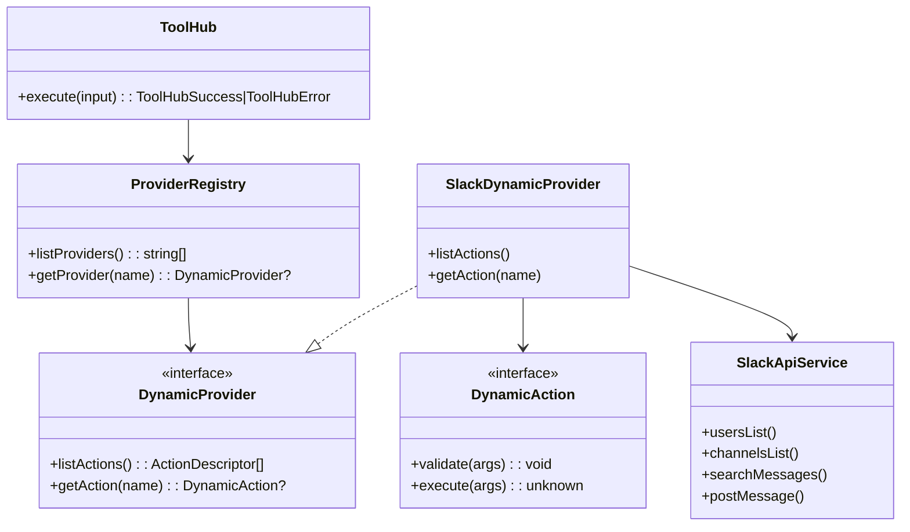
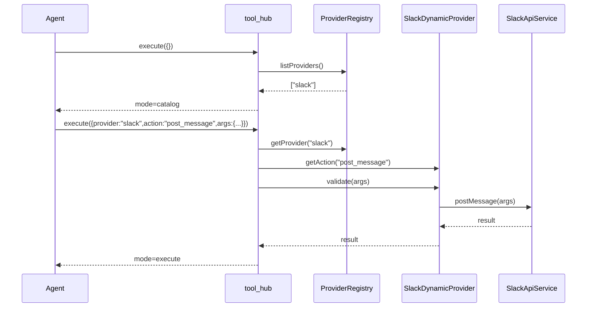

# 260225-s01-dynamic-tool-hub

## 1. 概要と目的 Overview and Purpose

- What  
  `pi-coding-agent` に登録するツールを 1 つ（仮称 `tool_hub`）へ集約し、`provider` と `action` を引数で切り替えて実行する。  
  引数なし実行で provider 一覧、`provider` のみ指定で action 一覧、`provider + action` 指定で action 詳細、`provider + action + args` 指定で実行する。
- Why  
  ツール定義数の増加によるコンテキスト圧迫を抑えつつ、Slack/Discord/Jira などを段階的に拡張できる構造にするため。  
  LLM が使い方を知らない場合でも自己発見的に操作可能にする。
- How  
  Tool Hub 層を新設し、`ProviderRegistry` に provider を登録、`ActionRegistry` で action を管理する。  
  公開は単一 Tool (`tool_hub`) のみとし、内部で厳密な `provider/action` バリデーションとディスパッチを行う。  
  初期 provider は `slack` を想定し、Slack API 実装は既存計画（`doc/plan/260224-s02-slack-api-tools-auto-fallback.md`）へ移管して接続する。

## 2. 仕様と受け入れ条件 Specification and Acceptance Criteria

### 2.1 スコープ Scope

- 今回やること
  - 単一ツール `tool_hub` の追加
  - `catalog`（引数なし）, `provider_help`, `action_help`, `execute` の4モード実装
  - provider/action の動的ディスカバリ
  - `slack` provider 接続点の定義（6 action の実装本体は `260224-s02` へ移管）
  - provider/action ごとの入力バリデーションと統一エラー形式
- 成果物
  - `src/assistant/dynamic-tool/` 配下の新規モジュール（hub/registry/validator/response）
  - `src/assistant/agent-session-factory.ts` への単一ツール登録
  - Slack 実装移管先（`doc/plan/260224-s02-slack-api-tools-auto-fallback.md`）との責務分離を明記
  - 単体・統合テスト
- 制約
  - 公開ツールは 1 つのみ（`tool_hub`）
  - プロトタイプ優先で provider はまず `slack` を想定し、実装本体は `260224-s02` で管理する
  - provider/action スキーマは runtime で必須検証

### 2.2 非スコープ Non Scope

- 今回やらないこと
  - Discord/Jira の本実装
  - provider ごとの権限管理UI
  - 複雑なレート制御ダッシュボード
- 将来検討だが今回除外すること
  - provider プラグインの外部ロード
  - スキーマ自動生成ドキュメントサイト

### 2.3 ユースケース Use Cases

- 正常系1  
  エージェントが `tool_hub` を引数なしで呼び、利用可能 provider 一覧を取得する。
- 正常系2  
  エージェントが `provider=slack` を指定し、Slack action の一覧と使い方を取得する。
- 正常系3  
  エージェントが `provider=slack, action=post_message, args=...` を指定し、直接実行する。
- 異常系1  
  未登録 provider を指定した場合、`unknown_provider` を返す。
- 異常系2  
  action は存在するが args が不正な場合、`validation_error` を返す。

### 2.4 受け入れ条件 Acceptance Criteria

- Given `tool_hub` が引数なしで実行される  
  When Hub がリクエストを処理する  
  Then `mode=catalog` で provider 一覧を返す。
- Given `provider=slack` かつ `action` 未指定  
  When Hub がリクエストを処理する  
  Then `mode=provider_help` で Slack action 一覧と必須引数を返す。
- Given `provider=slack` かつ `action=search_messages` かつ args が正しい  
  When 実行する  
  Then `mode=execute` で検索結果を返す。
- Given `provider=unknown`  
  When Hub が処理する  
  Then `code=unknown_provider` のエラーを返す。
- Given `provider=slack, action=post_message` で必須 `channel_id` が欠落  
  When Hub が処理する  
  Then `code=validation_error` のエラーを返し実行しない。
- Given `provider=slack, action=post_message` で routing が `manual_*`  
  When Slack 実装が実行される  
  Then 設定された単一路のみを実行する（フォールバックしない）。

### 2.5 既知の制約 Known Limitations

- 1 ツール集約のため、1回の失敗メッセージが抽象的になりやすい。`provider/action` を必ず返却して可観測性を担保する。
- provider が増えると catalog 応答が長くなる。将来は簡易/詳細モードを分ける余地がある。
- Slack 以外 provider は今回プレースホルダ定義のみで実行不可。

## 3. 前提技術スタック Context and Tech Stack

- Language Framework  
  TypeScript 5.x, Node.js ESM
- Libraries  
  既存 `@mariozechner/pi-coding-agent` の ToolDefinition を利用
- Style Guide  
  既存 ESLint / Prettier / TypeScript strict に準拠
- Runtime Deployment  
  Assistant Gateway（Node.js）
- Testing  
  `node --import tsx --test`, `pnpm run typecheck`

## 4. インターフェース契約 Interface Contracts

### 4.1 公開APIまたは外部I O一覧

- HTTP API  
  追加なし（内部 Tool 呼び出し）
- CLI  
  追加なし
- 設定ファイル
  - `ADJUTANT_DYNAMIC_TOOL_ENABLED` (bool, default true)
  - Slack provider 側は既存 `ADJUTANT_SLACK_*` 設定を利用
- 永続化ストレージ
  - 基本なし（Hub 自体は状態を持たない）
  - Slack provider は既存キャッシュを流用
- 外部サービス連携
  - provider ごと（初期は Slack API）

### 4.2 データモデルとスキーマ

```ts
type ToolHubInput = {
  provider?: string;
  action?: string;
  args?: Record<string, unknown>;
};

type ToolHubMode = "catalog" | "provider_help" | "action_help" | "execute";

type ToolHubSuccess = {
  ok: true;
  mode: ToolHubMode;
  provider?: string;
  action?: string;
  data: unknown;
};

type ToolHubError = {
  ok: false;
  code: "unknown_provider" | "unknown_action" | "validation_error" | "execution_error";
  provider?: string;
  action?: string;
  message: string;
};
```

- バリデーション方針
  - `provider` / `action` は trim 後に比較
  - `args` は object のみ許容
  - action ごとに専用 validator を必須化

### 4.3 エラーと例外 Error Handling

- エラー分類
  - `unknown_provider`
  - `unknown_action`
  - `validation_error`
  - `execution_error`
- リトライ方針
  - Hub 層はリトライしない
  - provider 側ポリシーに委譲（Slack は既存計画に準拠）
- タイムアウト方針
  - Hub 層は持たず provider 側タイムアウトを利用
- ログ方針と個人情報の扱い
  - Hub ログは `provider/action` のみ
  - `args` は provider が必要最小限のみ記録
  - トークンやCookieは出力禁止

### 4.4 代表的な例 Examples

1. 引数なし（catalog）

```json
{
  "ok": true,
  "mode": "catalog",
  "data": {
    "providers": [{ "name": "slack", "description": "Slack tools" }],
    "usage": "set provider to get actions"
  }
}
```

2. provider 指定のみ（provider_help）

```json
{
  "ok": true,
  "mode": "provider_help",
  "provider": "slack",
  "data": {
    "actions": [
      {
        "name": "search_messages",
        "description": "search slack messages",
        "requiredArgs": ["query"],
        "argsSchema": {
          "type": "object",
          "properties": { "query": { "type": "string", "minLength": 1 } },
          "required": ["query"]
        }
      }
    ]
  }
}
```

3. provider + action 指定（action_help）

```json
{
  "ok": true,
  "mode": "action_help",
  "provider": "slack",
  "action": "search_messages",
  "data": {
    "name": "search_messages",
    "description": "search slack messages",
    "requiredArgs": ["query"],
    "argsSchema": {
      "type": "object",
      "properties": { "query": { "type": "string", "minLength": 1 } },
      "required": ["query"]
    }
  }
}
```

4. 直接実行（execute）

```json
{
  "ok": true,
  "mode": "execute",
  "provider": "slack",
  "action": "post_message",
  "data": {
    "channel_id": "C123",
    "ts": "1711111111.000100"
  }
}
```

## 5. アーキテクチャと設計図 Architecture and Diagrams

### 5.1 図の選択方針

- 複数モジュール（Hub/Registry/Provider）と外部 I/O（Slack）があるためクラス図を必須とする。
- 実行分岐（catalog/help/execute）が重要なためシーケンス図を追加する。

### 5.2 クラス図 Class Diagram



### 5.3 その他の図 Optional



## 6. テスト戦略 Test Strategy

### 6.1 テストの種類

- Unit
  - `ToolHub` のモード分岐（catalog/provider_help/action_help/execute）
  - `ProviderRegistry` の provider 解決
  - action validator の入力検証
- Integration
  - `tool_hub` から `slack` provider 経由で `SlackApiService` 実行
  - `unknown_provider` / `unknown_action` / `validation_error` の契約確認
- Contract
  - 成功/失敗レスポンス外形の固定
  - `agent-session-factory` に公開ツールが1個だけであること

### 6.2 カバレッジ対象

- 重要ロジック
  - 入力の段階的解釈（provider/action/args）
  - provider/action ディスパッチ
- エラー分岐
  - 未知 provider/action
  - args 型不正
- 境界条件
  - 空文字 provider/action
  - args 未指定/空 object

### 6.3 テスト基盤確認結果

- `tests/assistant/*.test.ts` は `node --import tsx --test` で実行される既存基盤を利用可能。
- Hub 単体テストは `tests/assistant/dynamic-tool/` 配下を新設して追加する方針で確定。
- provider 統合テストは `tests/assistant/agent-session-factory*.test.ts` 系と同じ流儀で追加する方針で確定。

## 7. 実装タスクリスト Implementation Plan

### Phase 1 設計と準備

- [x] 要件と仕様の確定 受け入れ条件の確定（本計画書 §2 の内容で確定）
- [x] インターフェース契約の確定 スキーマと例の追加（§4.2-§4.4）
- [x] Mermaid図の作成 更新（§5.2-§5.3）
- [x] `ToolHubInput` / `ToolHubSuccess/Error` 型定義の作成（`src/assistant/dynamic-tool/types.ts`）
- [x] テスト基盤の確認（Hub単体 + provider統合）（§6.3）

### Phase 2 Tool Hub の実装

- [x] Test `tool_hub` のモード分岐 Red テスト追加（`tests/assistant/dynamic-tool/tool-hub.test.ts`）
- [x] Impl `ToolHub` / `ProviderRegistry` / 基本レスポンス整形を実装（`src/assistant/dynamic-tool/`）
- [x] Refactor エラー生成とバリデーション共通化（`response.ts` / `parseInput()`）
- [x] Integration `agent-session-factory` に単一ツール登録（`ADJUTANT_DYNAMIC_TOOL_ENABLED`, default true）
- [x] Docs provider/action のヘルプ出力契約を更新（§4.4 の provider_help/action_help 例）

### Phase 3 Slack Provider 接続（`260224-s02` へ移管）

- [x] Test `slack` provider の action validator Red テスト追加を `260224-s02` に移管
- [x] Impl `SlackDynamicProvider` で 6 action を `SlackApiService` に接続するタスクを `260224-s02` に移管
- [x] Refactor action descriptor 定義の declarative 化を `260224-s02` に移管
- [x] Integration catalog -> provider_help -> execute の疎通テスト追加を `260224-s02` に移管
- [x] Docs `vendor/slack-mcp-server/` 参照対応表更新を `260224-s02` に移管

### Phase 4 統合と検証

- [x] 全体テストの実行（`pnpm run test`: 484 pass）
- [x] エッジケースの動作確認（未知provider/action、不正args）
- [x] ログと例外の確認（機密情報非露出）
- [x] ドキュメント更新（仕様・契約・図）

## 8. 完了の定義 Definition of Done

### 8.1 機能DoD Functional DoD

- [x] 単一ツール `tool_hub` だけで catalog/help/execute が動作すること
- [x] `slack` provider の 6 action 実装DoDは `260224-s02` へ移管済み
- [x] `unknown_provider` / `unknown_action` / `validation_error` を区別して返せること
- [x] 既知の制約が明文化され、想定通りであること

### 8.2 品質DoD Quality DoD

- [x] 全てのテストがパスしていること
- [x] Linter/Formatter/Typecheck のエラーがないこと
- [x] 不要なデバッグコードが削除されていること
- [x] 主要変更点がドキュメントに反映されていること

## 9. 懸念事項と未確定事項 Concerns and Questions

- 2026-02-24 の方針として、Slack provider 実装（Phase 3）は `260224-s02` へ移管済み。
- `tool_hub` という名称の妥当性（`integration_hub` など別名の方が適切か）。
- provider 一覧の返却量が増えたとき、簡易表示と詳細表示を分けるべきか。
- provider 別の認可境界（誰がどの provider/action を実行可能か）をどこで管理するか。
- Slack 以外 provider を追加する際、action validator の統一方式（手書き vs 共通スキーマ）をどうするか。
