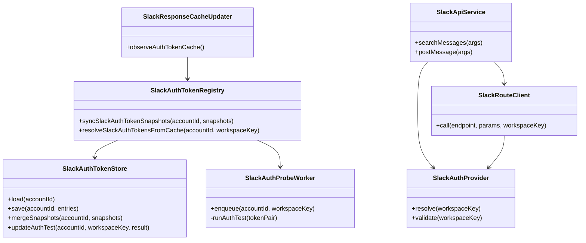
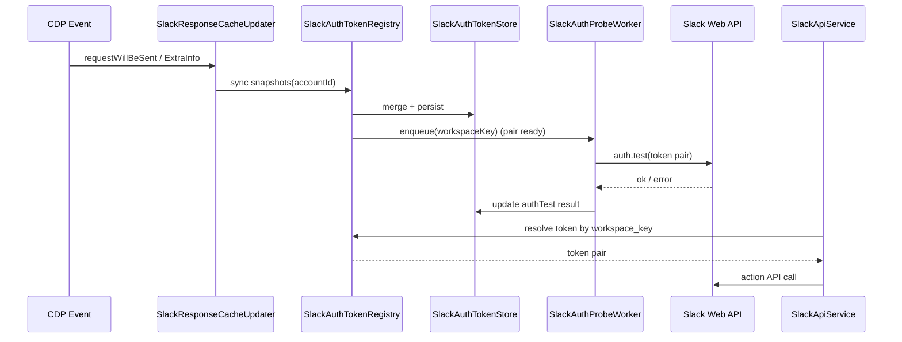

# 260225-s02-slack-auth-token-persistent-store

## 1. 概要と目的 Overview and Purpose

- What  
  CDP ingress で観測した `xoxc/xoxd` を account 単位で永続化し、`xoxc/xoxd` が揃ったタイミングで `auth.test` を非同期実行して workspace/team 情報を記録する。  
  account_id は `enterprise_id` 優先、未設定時は `team_id` を採用して自動決定する。  
  account_id 未確定時は `_pending` ストアへ即時保存し、確定後に account ストアへ昇格する。  
  あわせて `tool_hub` の Slack 実行時に `workspace_key` をトークン解決へ反映できるようにする。
- Why  
  現状はメモリキャッシュのみで再起動時に token と workspace 対応が失われるため、`workspace_key` を指定しても実行先制御が不安定。  
  永続化 + 事前 `auth.test` により、再起動後も workspace 単位の安定した実行経路とトークン選択を実現する。
- How  
  `SlackAuthTokenStore`（JSON 永続化）と `SlackAuthProbeWorker`（`auth.test` 実行）を追加し、既存 `SlackAuthTokenRegistry` と連携する。  
  token 観測時はまず `_pending` ストアへ保存し、`auth.test` 成功時に `account_id = enterprise_id ?? team_id` を確定して account ストアへ昇格する。  
  `SlackAuthProvider` と `SlackRouteClient` に `workspace_key` 入力を通し、`workspace指定 > 最新pair` の優先順位でトークンを解決する。

## 1.1 行動原則 Core Principles

- Prototype First  
  プロトタイプ作成が目的であるため、特別な指示がない限り後方互換性は考慮しない。現在に対し最適な構造を優先する。  
  ただし既存CIが落ちる変更や公開APIの破壊が発生する場合は、破壊点と最小の移行方針を計画に明記する。
- SOLID  
  オブジェクト指向設計の5原則を守る。
- KISS  
  複雑さを避け、可能な限り単純な解決策を選ぶ。
- YAGNI  
  現在必要な機能のみを実装する。
- DRY  
  ロジックの重複を避ける。

## 2. 仕様と受け入れ条件 Specification and Acceptance Criteria

### 2.1 スコープ Scope

- 今回やること
  - `xoxc/xoxd` 永続化ストアを追加し、未確定は `<dataDir>/accounts/_pending/_cache/slack/auth-token-store.json` に即時保存する
  - `auth.test` 後に確定した token pair を `<dataDir>/accounts/<account_id>/_cache/slack/auth-token-store.json` へ昇格保存する
  - `account_id` を `auth.test` の `enterprise_id ?? team_id` で自動決定する（ユーザー手動指定に依存しない）
  - 起動時に `_pending` + account ストアを読み込み、メモリレジストリを復元する
  - `xoxc/xoxd` が同一 workspace で揃ったら `auth.test` を非同期実行し、`team_id`/`enterprise_id`/`url`/`user_id` を記録する
  - `auth.test` 結果から workspace alias（`enterprise_id`, `team_id`, subdomain）を更新する
  - `tool_hub` Slack provider 実行時に `workspace_key` をトークン解決へ反映する
  - ログ/監査で token 生値を出さない（マスク方針を契約化）
- 成果物
  - 新規: `src/slack/slackAuthTokenStore.ts`
  - 新規: `src/slack/slackAuthProbeWorker.ts`
  - 修正: `src/slack/slackAuthTokenRegistry.ts`
  - 修正: `src/proactive/slack-channel-plugin.ts`（同期ポイント）
  - 修正: `src/assistant/slack-api-tools/auth-provider.ts`
  - 修正: `src/assistant/slack-api-tools/route-client.ts`
  - 修正: `src/assistant/slack-api-tools/service.ts`
  - 修正: `src/assistant/slack-api-tools/factory.ts`
  - テスト追加: `tests/slack/*`, `tests/assistant/slack-api-tools/*`
  - ドキュメント更新: `doc/spec.md`, `README.md`
- 制約
  - プロトタイプ優先で暗号化保管は実施しない（平文 + ファイル権限最小化）
  - 後方互換は必須ではないが、既存 `pnpm check` が通ることを優先する
  - `auth.test` はバックグラウンド実行とし、ingress 処理をブロックしない
  - `auth.test` で `enterprise_id`/`team_id` が得られるまで account_id は未確定扱い（`_pending` で保持）

### 2.2 非スコープ Non Scope

- 今回やらないこと
  - 外部 Secret Manager（Vault, KMS 等）連携
  - Slack OAuth フロー導入
  - 複数プロセス間ロックによる厳密排他制御
- 将来検討だが今回除外すること
  - token at-rest 暗号化
  - 複数 account を跨ぐ token フェデレーション
  - `auth.test` 以外（`team.info` など）でのメタデータ拡張

### 2.3 ユースケース Use Cases

- 正常系1  
  `requestWillBeSent` と `requestWillBeSentExtraInfo` で同一 workspace の `xoxc/xoxd` が揃い、`_pending` ストアに保存される。
- 正常系2  
  token pair が揃った直後に `auth.test` が実行され、`team_id` と `enterprise_id` が記録され、`account_id = enterprise_id ?? team_id` が確定して account ストアへ昇格する。
- 正常系3  
  再起動後でも永続化ストアから復元され、`workspace_key` 指定の `search_messages` が該当 token で実行される。
- 異常系1  
  `auth.test` が `invalid_auth` の場合、結果を保存し、同一 token pair では連続再試行しない。
- 異常系2  
  `auth.test` が一時失敗（network/rate_limited）の場合、バックオフして再試行し、ingress は継続する。

### 2.4 受け入れ条件 Acceptance Criteria

- Given 同一 `workspace_key` で `xoxc` と `xoxd` が観測される  
  When 同期処理が実行される  
  Then `_pending` の `auth-token-store.json` に token pair が保存される。
- Given token pair 保存直後  
  When `auth.test` が成功する  
  Then `team_id` `enterprise_id` `url` `user_id` が同一エントリへ記録され、account ストアへ昇格される。
- Given `auth.test` が `enterprise_id=E123`, `team_id=T123` を返す  
  When account_id を確定する  
  Then 保存先 account_id は `E123` となる。
- Given `auth.test` が `enterprise_id=""`, `team_id=T123` を返す  
  When account_id を確定する  
  Then 保存先 account_id は `T123` となる。
- Given `_pending` に有効 token pair がある  
  When プロセスを再起動する  
  Then `_pending` が再読込され、`auth.test` 再試行対象として復元される。
- Given 永続化ストアに有効 token pair がある  
  When プロセスを再起動する  
  Then メモリレジストリへ復元され、Slack tool が実行可能となる。
- Given `workspace_key` を指定して `post_message` を実行する  
  When 指定 workspace に対応する token pair が存在する  
  Then その token pair が優先して利用される。
- Given `auth.test` が `invalid_auth` を返す  
  When 同一 token pair で短時間に再同期される  
  Then 即時再試行せず、保存済み failure 状態を返す。
- Given `auth.test` が network error で失敗する  
  When バックオフ待機後に再実行される  
  Then 成功時に status が `ok` へ更新される。
- Given ログ出力が有効  
  When token 関連イベントを記録する  
  Then token 生値は出力されずマスク済み情報のみ記録される。

### 2.5 既知の制約 Known Limitations

- token は平文保存のため、ローカル端末のファイル権限保護に依存する。
- 複数プロセス同時書き込み時は last-write-wins となる。
- workspace 推定は ingress URL パターン依存であり、未知パターンは `global` へ退避される。
- `auth.test` が継続失敗する場合、`_pending` に未昇格エントリが残留する。

## 3. 前提技術スタック Context and Tech Stack

- Language Framework  
  TypeScript 5.x, Node.js ESM
- Libraries  
  既存 Node 標準 API（`fs/promises`, `fetch`）と既存モジュールを優先利用
- Style Guide  
  既存 ESLint / Prettier / TypeScript strict に準拠
- Runtime Deployment  
  Assistant Gateway ローカル実行（`pnpm run assistant`）
- Testing  
  `node --import tsx --test`, `pnpm run typecheck`, `pnpm check`

## 4. インターフェース契約 Interface Contracts

### 4.1 公開APIまたは外部I O一覧

- HTTP API  
  追加なし（内部 `tool_hub` 実行経路を更新）
- CLI  
  追加なし
- 設定ファイル / 環境変数
  - 本計画では Slack auth 用の必須設定項目を追加しない（CDP 観測 + 永続化ストアのみで運用）
  - 追加候補: `ADJUTANT_SLACK_AUTH_TOKEN_STORE_PATH`（保存先 override）
- 永続化ストレージ
  - 新規: `<dataDir>/accounts/_pending/_cache/slack/auth-token-store.json`
  - 新規: `<dataDir>/accounts/<account_id>/_cache/slack/auth-token-store.json`
  - 既存: `workspace-route-pins.json`, `channel-names-by-team`, `user-names-by-team`
- 外部サービス連携
  - Slack Web API `auth.test`
  - Slack Web API 各 action（`search.messages`, `chat.postMessage`, `users.info` など）

### 4.2 データモデルとスキーマ

```ts
type SlackAuthTokenStoreSchema = "adjutant.slack.auth-token-store.v1";

type PersistedTokenEntry = {
  value: string;
  firstSeenAt: number;
  lastSeenAt: number;
  hits: number;
  sourceStage: "requestWillBeSent" | "requestWillBeSentExtraInfo" | "cookieStoreSnapshot";
};

type PersistedAuthTest = {
  status: "pending" | "ok" | "invalid_auth" | "rate_limited" | "network_error" | "api_error";
  triedAt?: string;
  succeededAt?: string;
  teamId?: string;
  enterpriseId?: string;
  url?: string;
  userId?: string;
  errorCode?: string;
  errorMessage?: string;
};

type ResolvedAccountId = string; // enterpriseId があれば enterpriseId、なければ teamId

type PersistedWorkspaceToken = {
  workspaceKey: string;
  aliases: string[];
  tokens: {
    xoxc?: PersistedTokenEntry;
    xoxd?: PersistedTokenEntry;
  };
  authTest?: PersistedAuthTest;
};

type PersistedAuthTokenStore = {
  schema: SlackAuthTokenStoreSchema;
  updatedAt: string;
  entries: PersistedWorkspaceToken[];
};
```

- バリデーション方針
  - token 値は空文字不可
  - `workspaceKey` は空文字不可（推定不能時は `global`）
  - `account_id` は `enterpriseId ?? teamId` で決定し、空は不可
  - `_pending` と account ストア間の昇格時は同一 `workspaceKey` をキーに重複マージする
  - schema 不一致または壊れた JSON は読み飛ばし、起動失敗にしない
  - alias は重複排除し、`workspaceKey` 本体を必ず含む

### 4.3 エラーと例外 Error Handling

- エラー分類
  - Store IO error（read/write/parse）
  - Probe error（invalid_auth/rate_limited/network/api）
  - Account resolve error（`auth.test` 応答に `enterprise_id` と `team_id` の両方がない）
  - Pending promote error（`_pending` から account ストアへの昇格/削除失敗）
  - Routing resolve error（workspace 指定に対する token 不在）
- リトライ方針
  - `invalid_auth` は同一 token pair では再試行しない
  - `rate_limited` / `network_error` は指数バックオフ（例: 5s, 15s, 60s）
  - account_id 未確定は `auth.test` 成功まで pending として扱う
  - 昇格失敗時は `_pending` を保持し、次回起動時に再昇格を試行する
  - Store write 失敗は警告ログのみで処理継続（ingress 停止しない）
- タイムアウト方針
  - `auth.test` は固定 timeout（10s）を使用する
  - Probe は in-flight 1 件/entry で重複起動しない
- ログ方針と個人情報の扱い
  - token 生値はログ・監査に出力しない
  - debug は `workspaceKey`, `status`, `errorCode` のみ記録
  - ファイル権限は `0600` を目標（非対応 OS では best-effort）

### 4.4 代表的な例 Examples

1. `auth.test`（workspace/team識別）  
   エンドポイント: `POST https://slack.com/api/auth.test`  
   実装で参照する応答フィールド: `url`, `team`, `user`, `team_id`, `user_id`, `enterprise_id`, `bot_id`

```json
{
  "ok": true,
  "url": "https://workspace.slack.com/",
  "team": "Workspace Name",
  "user": "alice",
  "team_id": "T12345678",
  "user_id": "U12345678",
  "enterprise_id": "E12345678",
  "bot_id": ""
}
```

```text
account_id 決定ルール:
- enterprise_id が空でない場合: account_id = enterprise_id
- enterprise_id が空かつ team_id が空でない場合: account_id = team_id
```

```json
{
  "ok": false,
  "error": "invalid_auth"
}
```

2. `chat.postMessage`（投稿直後の ts/channel 採取）  
   エンドポイント: `POST https://slack.com/api/chat.postMessage`  
   実装で参照する応答フィールド: `channel`, `ts`  
   （この `channel` と `ts` を使って直後に `conversations.history` を1件取得）

```json
{
  "ok": true,
  "channel": "C22222222",
  "ts": "1739876600.654321",
  "message": {
    "type": "message",
    "user": "U11111111",
    "text": "deployment done",
    "ts": "1739876600.654321"
  }
}
```

3. `conversations.history`（投稿結果再取得・一覧取得）  
   エンドポイント: `POST https://slack.com/api/conversations.history`  
   実装で参照する応答フィールド: `messages[]`, `has_more`, `response_metadata.next_cursor`

```json
{
  "ok": true,
  "messages": [
    {
      "type": "message",
      "subtype": "",
      "user": "U11111111",
      "username": "",
      "text": "deployment done",
      "ts": "1739876600.654321",
      "thread_ts": "1739876600.654321",
      "reactions": [{ "name": "thumbsup", "count": 2 }],
      "files": [{ "id": "F33333333" }],
      "attachments": [],
      "blocks": []
    }
  ],
  "has_more": true,
  "response_metadata": {
    "next_cursor": "dGVhbTpDMjIy..."
  }
}
```

4. `search.messages`（検索結果取得）  
   エンドポイント: `POST https://slack.com/api/search.messages`  
   実装で参照する応答フィールド: `messages.matches[]`, `messages.pagination.page`, `messages.pagination.page_count`  
   `matches[]` では `user`, `username`, `text`, `ts`, `permalink`, `channel.name`, `attachments`, `blocks` を参照

```json
{
  "ok": true,
  "messages": {
    "total": 12,
    "pagination": {
      "page": 1,
      "page_count": 3,
      "per_page": 20,
      "first": 1,
      "last": 20
    },
    "matches": [
      {
        "user": "U11111111",
        "username": "alice",
        "text": "deployment done",
        "ts": "1739876600.654321",
        "permalink": "https://workspace.slack.com/archives/C22222222/p1739876600654321",
        "channel": { "id": "C22222222", "name": "deploy" },
        "attachments": [],
        "blocks": []
      }
    ]
  }
}
```

## 5. アーキテクチャと設計図 Architecture and Diagrams

### 5.1 図の選択方針

- 複数モジュール（ingress, registry, store, probe worker, tool_hub）を跨ぐためクラス図を採用する。
- 非同期連携（token観測 -> 保存 -> auth.test -> tool実行）が重要なためシーケンス図を追加する。

### 5.2 クラス図 Class Diagram



### 5.3 その他の図 Optional



## 6. テスト戦略 Test Strategy

### 6.1 テストの種類

- Unit
  - `SlackAuthTokenStore`: load/save/merge/prune/alias正規化
  - `SlackAuthProbeWorker`: enqueue制御、backoff、status遷移
  - `SlackAuthProvider`: `workspace_key` 指定時の優先順位解決
  - `SlackRouteClient`: workspaceKey 付き resolve 呼び出し
- Integration
  - ingress snapshot 同期から `_pending` 保存 + probe 実行 + account 昇格まで
  - 再起動相当（store load -> tool 呼び出し成功）シナリオ
  - `workspace_key` 指定あり/なしの `search_messages`, `post_message`
- Contract
  - `auth-token-store.json` schema 契約（v1）
  - `workspace_key` 指定時のトークン選択契約
  - token マスクログ契約

### 6.2 カバレッジ対象

- 重要ロジック
  - token 解決優先順位
  - alias 更新ロジック
  - probe 再試行制御
- エラー分岐
  - invalid_auth
  - rate_limited
  - network_error
  - store JSON 破損
- 境界条件
  - `workspace_key` 不一致時
  - token 片側のみ観測時
  - 同値 token 再観測時

## 7. 実装タスクリスト Implementation Plan

### Phase 1 永続化ストアと auth.test ワーカー実装

- [x] Test `SlackAuthTokenStore` の失敗テスト作成（read/write/破損JSON/merge）
- [x] Impl `SlackAuthTokenStore` 実装（`_pending`/account load/save/merge/promote/permissions）
- [x] Test account_id 決定ロジック（`enterprise_id` 優先、`team_id` fallback、両方欠落時エラー）を追加
- [x] Test `_pending` から account ストアへの昇格と再起動後再昇格のテストを追加
- [x] Test pair揃い時 enqueue、in-flight抑止、backoff の失敗テスト作成
- [x] Impl `SlackAuthProbeWorker` 実装と registry 連携
- [x] Refactor status遷移（pending/ok/invalid_auth/...）と registry の重複ロジックを統一
- [x] Integration 起動時 load・snapshot 同期・probe 成功/失敗反映テスト追加
- [x] Docs `doc/spec.md` と `README.md` の保存仕様/再試行契約更新

### Phase 2 tool_hub 連携と workspace_key 解決

- [x] Test `workspace_key` 指定時の token 解決テスト作成（auth-provider/service）
- [x] Impl `SlackAuthProvider`/`SlackRouteClient`/`SlackApiService` を workspace対応
- [x] Refactor CDP由来 token のみを前提とした resolve 責務分離
- [x] Integration `search_messages/post_message` の workspace 指定あり/なしテスト追加
- [x] Docs `workspace_key` の意味（route pin + token解決）を明文化

### Phase 3 統合と検証

- [x] 全体テスト実行（`pnpm check`）
- [x] エッジケース確認（store破損、token失効、network断）
- [x] ログ監査（token 生値非出力、error code 可観測性）
- [x] 最終ドキュメント整合（spec/README/plan）

## 8. 完了の定義 Definition of Done

### 8.1 機能DoD Functional DoD

- [x] 受け入れ条件がすべて満たされている
- [x] 再起動後の token 復元と `workspace_key` 解決が機能する
- [x] `auth.test` 結果が永続化され、alias 更新が反映される
- [x] account_id が `enterprise_id ?? team_id` ルールで決定される
- [x] `_pending` 保存と account 昇格が期待どおり動作する
- [x] 既知の制約がドキュメント化されている

### 8.2 品質DoD Quality DoD

- [x] 追加/更新した全テストがパスしている
- [x] `pnpm check` が成功している
- [x] token 生値のログ出力が発生しない
- [x] 主要変更が `doc/spec.md` と `README.md` に反映されている

## 9. 懸念事項と未確定事項 Concerns and Questions

- token 平文保存をプロトタイプとして許容するか（本番運用前に暗号化へ進むか）
- `invalid_auth` の再試行解除条件（token変更検知のみで十分か）
- 複数プロセス運用時の同時書き込み競合をどこまで許容するか
- 保存先 override 環境変数（`ADJUTANT_SLACK_AUTH_TOKEN_STORE_PATH`）を今回導入するか

---
