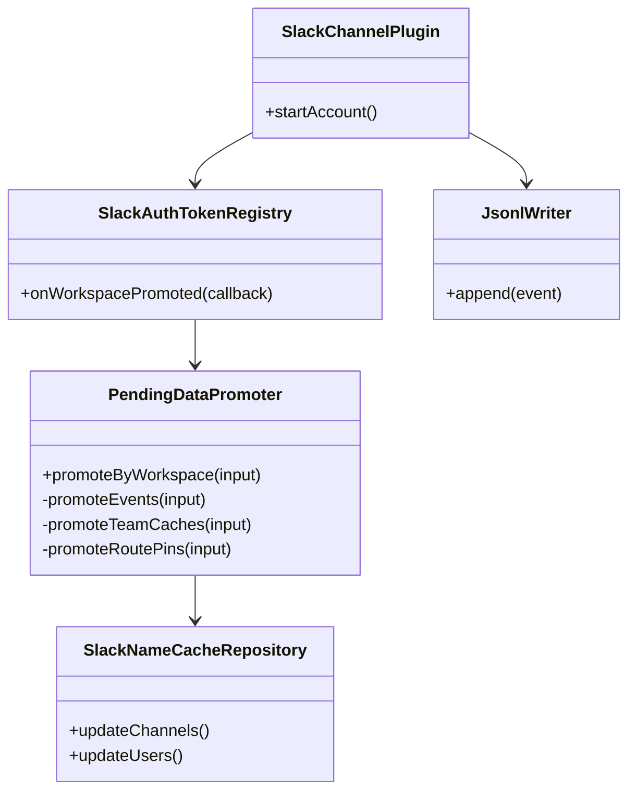
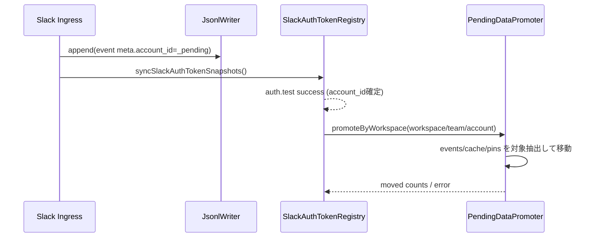

# 260225-s03-slack-workspace-team-pending-promote

## 1. 概要と目的 Overview and Purpose

- What  
  Slack収集データ（events / name cache / route pins）を、`ADJUTANT_SLACK_ACCOUNT_ID` 依存の固定保存ではなく、まず `_pending` に保存し、`auth.test` で確定した `account_id = enterprise_id ?? team_id` へ workspace/team 単位で昇格移動する仕組みを追加する。
- Why  
  現状は collector 側の保存先が環境変数依存で、workspace が複数ある場合にデータ配置が不整合になり得る。workspace/team 単位の移動により、保存先決定を自動化しつつ誤混在を減らす。
- How  
  `_pending` を collector の初期保存先として扱い、イベントには `meta.workspace_key` / `meta.team_id` を付与する。`SlackAuthTokenRegistry` の昇格確定イベントをトリガーに、`PendingDataPromoter` が対象 workspace/team のみを account 配下へ移動・マージする。

## 1.1 行動原則 Core Principles

- Prototype First  
  プロトタイプ作成が目的であるため、特別な指示がない限り後方互換性は考慮しない。現在に対し最適な構造を優先する。  
  ただし既存CIが落ちる変更や公開APIの破壊が発生する場合は、破壊点と最小の移行方針を計画に明記する。
- SOLID  
  オブジェクト指向設計の5原則を守る。
- KISS  
  複雑さを避け、可能な限り単純な解決策を選ぶ。
- YAGNI  
  現在必要な機能のみを実装する。
- DRY  
  ロジックの重複を避ける。

## 2. 仕様と受け入れ条件 Specification and Acceptance Criteria

### 2.1 スコープ Scope

- 今回やること
  - Slack collector の保存先を初期的に `<dataDir>/accounts/_pending/...` に統一する
  - `NormalizedEvent.meta` へ `workspace_key` / `team_id`（取得可能時）を付与する
  - `auth.test` 成功で account が確定したら、workspace/team 単位で pending データを account 配下へ昇格移動する
  - 移動対象は `events.jsonl`, `channel-names-by-team/<team>.json`, `user-names-by-team/<team>.json`, `workspace-route-pins.json`
  - 移動後は pending 側に非対象データのみ残す
  - 昇格処理は冪等（再実行しても破壊しない）にする
- 成果物
  - 新規: `src/slack/pending-data-promoter.ts`（仮）
  - 修正: `src/io/jsonlWriter.ts`（workspace/team メタ保持）
  - 修正: `src/slack/slackIngressHandlers.ts`, `src/slack/slackWsNormalizer.ts`, `src/slack/normalize.ts`（team/workspace metadata）
  - 修正: `src/proactive/slack-channel-plugin.ts`（pending 保存 + promotion hook）
  - 修正: `src/slack/slackAuthTokenRegistry.ts`（promote 通知の契約追加）
  - テスト追加: `tests/slack/pending-data-promoter.test.ts` ほか
  - ドキュメント更新: `doc/spec.md`, `doc/file-paths.md`, `README.md`
- 制約
  - プロトタイプ優先のため、移動は単一プロセス前提で実装する（厳密分散ロックは非対応）
  - event の team/workspace が不明な行は pending に残す
  - 大容量 JSONL の移動はストリーミング処理でメモリ使用量を抑える

### 2.2 非スコープ Non Scope

- 今回やらないこと
  - 暗号化ストレージ化
  - マルチプロセス厳密排他（fcntl 等）
  - 既存データ全量再編成バッチ
- 将来検討だが今回除外すること
  - workspace 間重複イベントの統合 dedup
  - pending データの TTL 自動削除
  - 外部DBへの移管

### 2.3 ユースケース Use Cases

- 正常系1  
  新規起動後、Slackイベントは `_pending/YYYY/MM/DD/slack/events.jsonl` に保存される。
- 正常系2  
  `auth.test` 成功で `workspace_key=foo, team_id=T123, account_id=E999` が確定すると、`_pending` から該当行/該当teamキャッシュのみ `accounts/E999` へ移動される。
- 正常系3  
  同じ promotion を再実行しても、重複追記や欠損は発生しない。
- 異常系1  
  JSONL の一部行が壊れている場合は、その行をスキップして他行の移動は継続する。
- 異常系2  
  移動中に I/O エラーが発生した場合、元データを残したまま失敗を記録し、次回再試行可能にする。

### 2.4 受け入れ条件 Acceptance Criteria

- Given collector が起動している  
  When Slackイベントが発生する  
  Then 保存先は `<dataDir>/accounts/_pending/YYYY/MM/DD/slack/events.jsonl` になる。
- Given event に `meta.workspace_key=foo` と `meta.team_id=T123` が含まれる  
  When `account_id=E999` が確定する  
  Then 該当 event 行のみ `accounts/E999/.../events.jsonl` へ移動され、pending 側から除外される。
- Given `_pending/_cache/slack/channel-names-by-team/T123.json` が存在する  
  When `account_id=E999` が確定する  
  Then `accounts/E999/_cache/slack/channel-names-by-team/T123.json` にマージ移動される。
- Given `workspace-route-pins.json` に複数 workspace の pin がある  
  When `workspace_key=foo` の昇格を実行する  
  Then `foo` に対応する pin のみ account 側へ移動される。
- Given 同一 promotion を連続実行する  
  When 2回目を実行する  
  Then account 側データは重複せず、結果は1回目と同一になる。
- Given team/workspace が判定不能な event 行  
  When promotion を実行する  
  Then その行は pending 側に残る。

### 2.5 既知の制約 Known Limitations

- metadata 不足行（team/workspace 不明）は自動昇格できない。
- 大量データ移動時はI/O時間が増える（バックグラウンド実行前提）。
- 単一プロセス前提のため、同時起動時は last-write-wins の余地がある。

## 3. 前提技術スタック Context and Tech Stack

- Language Framework  
  TypeScript 5.x, Node.js ESM
- Libraries  
  Node標準API（`fs/promises`, `readline`, `stream`）を優先使用
- Style Guide  
  既存 ESLint / Prettier / TypeScript strict に準拠
- Runtime Deployment  
  Assistant Gateway ローカル実行（`pnpm run assistant`）
- Testing  
  `node --import tsx --test`, `pnpm run typecheck`, `pnpm check`

## 4. インターフェース契約 Interface Contracts

### 4.1 公開APIまたは外部I O一覧

- HTTP API  
  追加なし
- CLI  
  追加なし
- 設定ファイル
  - 追加なし（既存設定のみ）
- 永続化ストレージ
  - 既存利用拡張: `<dataDir>/accounts/_pending/YYYY/MM/DD/slack/events.jsonl`
  - 既存利用拡張: `<dataDir>/accounts/_pending/_cache/slack/*`
  - 昇格先: `<dataDir>/accounts/<account_id>/...`
- 外部サービス連携
  - 追加なし（`auth.test` の結果通知を内部利用）

### 4.2 データモデルとスキーマ

```ts
type SlackEventMeta = {
  account_id: string; // 収集時は "_pending"
  workspace_key?: string; // subdomain/team/enterprise のいずれか
  team_id?: string;
};

type PromotionInput = {
  workspaceKey: string;
  accountId: string; // enterprise_id ?? team_id
  teamId?: string;
  aliases: string[];
};

type PromotionResult = {
  movedEventLines: number;
  movedChannelCacheTeams: string[];
  movedUserCacheTeams: string[];
  movedRoutePins: string[];
  skippedEventLines: number;
};
```

- バリデーション方針
  - `accountId` は空不可
  - `workspaceKey` は空不可
  - JSONL 行は `schema=adjutant.event.v1.1` を優先対象とする
  - event の判定キーは `meta.workspace_key` 優先、次に `meta.team_id`

### 4.3 エラーと例外 Error Handling

- エラー分類
  - Promotion IO error
  - JSONL parse error
  - Cache merge error
  - Route pin parse error
- リトライ方針
  - promotion 失敗時は pending を保持し、次回 promotion で再試行
  - 壊れた行はスキップして継続
- タイムアウト方針
  - 長時間処理を避けるため、日次ファイル単位で分割実行
- ログ方針と個人情報の扱い
  - token生値は出力しない
  - 移動件数・対象workspace・エラーコードのみログ

### 4.4 代表的な例 Examples

1. pending 保存時の event meta 例

```json
{
  "schema": "adjutant.event.v1.1",
  "source": "slack",
  "kind": "post",
  "meta": {
    "account_id": "_pending",
    "workspace_key": "acme",
    "team_id": "T12345678"
  }
}
```

2. promotion 入力例

```json
{
  "workspaceKey": "acme",
  "accountId": "E99999999",
  "teamId": "T12345678",
  "aliases": ["acme", "T12345678", "E99999999"]
}
```

3. promotion 結果例

```json
{
  "movedEventLines": 128,
  "movedChannelCacheTeams": ["T12345678"],
  "movedUserCacheTeams": ["T12345678"],
  "movedRoutePins": ["acme"],
  "skippedEventLines": 2
}
```

## 5. アーキテクチャと設計図 Architecture and Diagrams

### 5.1 図の選択方針

- collector / registry / promoter / cache の複数モジュールを跨ぐためクラス図を採用
- 非同期昇格処理の流れが重要なためシーケンス図を追加

### 5.2 クラス図 Class Diagram



### 5.3 その他の図 Optional



## 6. テスト戦略 Test Strategy

### 6.1 テストの種類

- Unit
  - `PendingDataPromoter` の抽出・移動・冪等性
  - event metadata 判定（workspace_key / team_id）
  - route pin 部分移動
- Integration
  - `_pending` への保存 -> `auth.test` 確定 -> account への昇格
  - 再起動後の再昇格
- Contract
  - event meta の契約（`account_id`, `workspace_key`, `team_id`）
  - promotion 入出力の契約

### 6.2 カバレッジ対象

- 重要ロジック
  - workspace/team 単位抽出
  - JSONL 行移動と pending 残置
  - cache マージ
- エラー分岐
  - 破損 JSONL
  - ファイル欠損
  - rename/write 失敗
- 境界条件
  - 対象0件
  - 同一実行の再試行
  - 複数workspace混在ファイル

## 7. 実装タスクリスト Implementation Plan

### Phase 1 pending 保存とメタ付与

- [x] Test `_pending` 保存先へ出力されることを失敗テストで作成 Red
- [x] Impl collector の default account を `_pending` 化し event meta に `workspace_key`/`team_id` を付与 Green
- [x] Refactor event metadata 付与ロジックを共通化
- [x] Integration Slack post/reaction/notification でメタ付与確認
- [x] Docs 保存先仕様を更新

### Phase 2 workspace/team 単位 promotion 実装

- [x] Test `PendingDataPromoter` の events 行抽出移動（workspace/team一致のみ）Red
- [x] Impl events/cache/route pin の promotion 実装 Green
- [x] Refactor promotion の冪等化・再試行可能設計を整理
- [x] Integration `auth.test` 成功時に promotion が発火し account 側へ移動されることを追加
- [x] Docs promotion 契約と制約を更新

### Phase 3 統合と検証

- [x] 全体テストの実行（`pnpm check`）
- [x] エッジケースの動作確認（破損行、対象0件、再実行）
- [x] ログと例外の確認（token非露出、移動件数の可観測性）
- [x] ドキュメント更新（仕様/契約/図）

## 8. 完了の定義 Definition of Done

### 8.1 機能DoD Functional DoD

- [x] 受け入れ条件がすべて満たされていること
- [x] `_pending` から workspace/team 単位で account へ昇格できること
- [x] 非対象データが pending 側に残ること
- [x] 冪等再実行でデータ破壊・重複がないこと

### 8.2 品質DoD Quality DoD

- [x] 全てのテストがパスしていること
- [x] Linter Formatter のエラーがないこと
- [x] 不要なデバッグコードが削除されていること
- [x] 主要変更点がドキュメントに反映されていること

## 9. 懸念事項と未確定事項 Concerns and Questions

- `workspace_key` が `global` のイベントをどこまで昇格対象にするか
- `team_id` 不明イベントの扱い（永続的に pending 残置でよいか）
- 大容量 pending JSONL の移動コスト（夜間バッチ化が必要か）
- 既存 `ADJUTANT_SLACK_ACCOUNT_ID` を collector から段階的に廃止する移行手順

---
