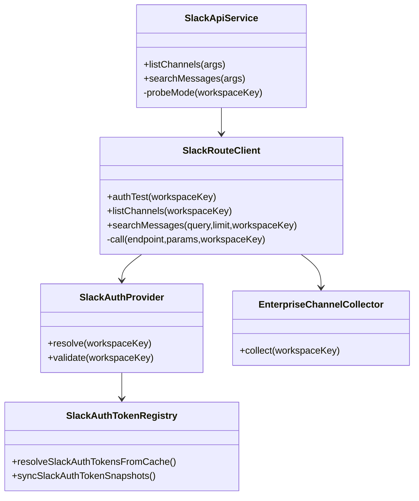
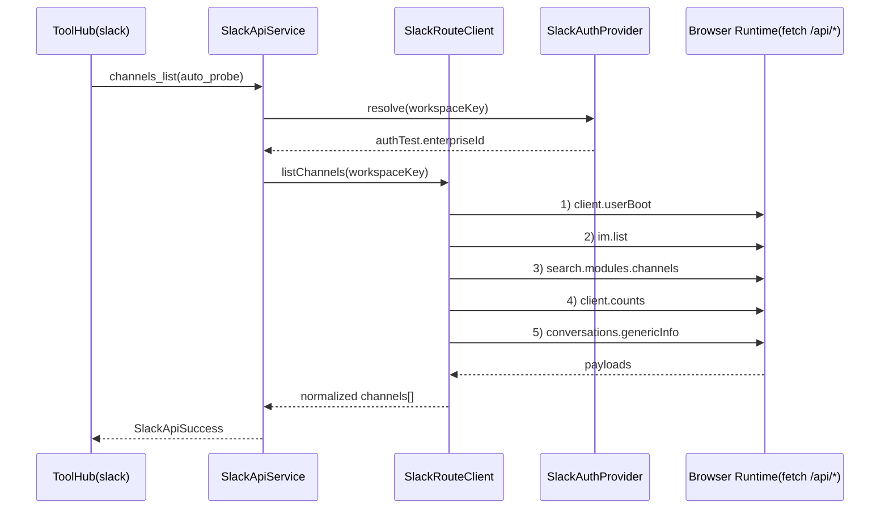

# 1. 概要と目的 Overview and Purpose

- What  
  `src/assistant/slack-api-tools` の Slack API 契約を、`vendor/slack-mcp-server` の実装（特に `pkg/provider/api.go` と `pkg/provider/edge/*`）が実際に使っているエンドポイント、主要パラメーター、レスポンス形状へ合わせる。
- Why  
  現状の計画には vendor 実装と一致しない契約（例: `search.all`）が含まれており、実装方針と受け入れ条件の整合が崩れているため。計画段階で契約を正しく固定し、実装・テスト・レビューの基準を一本化する。
- How  
  vendor ソースを仕様ソースとして契約表を再定義し、`SlackRouteClient` を CDP 経由呼び出しのまま vendor 同等のリクエスト構築とレスポンス正規化へ寄せる。ルーティング判定は `authTest` 事前記録結果を優先し、実行時 `auth.test` API 呼び出しは行わない。

## 1.1 行動原則 Core Principles

- Prototype First  
  プロトタイプ作成が目的であるため、特別な指示がない限り後方互換性は考慮しない。現在に対し最適な構造を優先する。  
  ただし既存CIが落ちる変更や公開APIの破壊が発生する場合は、破壊点と最小の移行方針を計画に明記する。
- SOLID  
  オブジェクト指向設計の5原則を守る。
- KISS  
  複雑さを避け、可能な限り単純な解決策を選ぶ。
- YAGNI  
  現在必要な機能のみを実装する。
- DRY  
  ロジックの重複を避ける。

# 2. 仕様と受け入れ条件 Specification and Acceptance Criteria

## 2.1 スコープ Scope

- 今回やること
  - vendor 準拠の API 契約を `slack-api-tools` 側へ反映する。
  - xoxc/xoxd の Non-Enterprise 向け `channels_list` を `conversations.list` 契約へ合わせる（`types`, `limit`, `exclude_archived`, `cursor`）。
  - Enterprise Grid（xoxc/xoxd）向け `channels_list` を vendor 相当フローへ合わせる（`client.userBoot` → `im.list` → `search.modules.channels` → `client.counts` → `conversations.genericInfo` を順次実行し、重複排除 + archived 除外）。
  - `users_list` / `get_user_name_by_id` / `get_channel_name_by_id` / `search_messages` / `post_message` で利用する全 API のレスポンス契約を vendor 実装ベースで固定する。
  - `workspaces_list` を追加し、token 非公開の workspace 一覧（`workspace_key`, `aliases`, `account_id`, `auth_test_status`）を取得可能にする。
  - `search_messages` を vendor 実装と同じ `search.messages` 契約へ合わせる（`query`, `count`, `page` を中心に `messages.matches` を解釈）。
  - `post_message` の不要パラメーター（`as_user`）を除去し、`chat.postMessage` の最小契約（`channel`, `text`）へ寄せる。
  - `auth.test` 事前記録結果（`enterprise_id`）でルーティングを決定し、実行時 `auth.test` API 呼び出しを不要化する。
  - エンドポイント単位のレスポンスパーサー契約（必須キー/任意キー/型/フォールバック/失敗条件）を導入し、パースミスを防止する。
  - 契約テストを追加し、vendor 由来の endpoint/params/response-key 差分を検知可能にする。
- 成果物
  - `src/assistant/slack-api-tools/*` の実装修正
  - `src/slack/slackAuthTokenRegistry.ts` の解決結果・ログ契約整理
  - `tests/assistant/slack-api-tools/*` / `tests/slack/*` のテスト更新
  - 本計画に対応した契約サンプル更新
- 制約
  - 実行経路は現在の CDP 経由ブラウザ実行コンテキスト（`fetch("/api/...")`）を維持する。
  - 秘匿情報（token/cookie）をログに出さない。

## 2.2 非スコープ Non Scope

- `vendor/slack-mcp-server` の全 API を adjutant 側へ完全移植すること。
- xoxp/xoxb トークン経路の検討・実装（本計画は xoxc/xoxd のみ対象）。
- uTLS 等の Node.js 非対応レイヤー実装。

## 2.3 ユースケース Use Cases

- UC-1: xoxc/xoxd の Non-Enterprise ワークスペースで `channels_list` を実行し、`conversations.list` ベースで一覧取得できる。
- UC-2: Enterprise Grid ワークスペースで `channels_list` を実行し、IM/MPIM を含む統合チャネル集合を取得できる。
- UC-3: `search_messages` 実行時、vendor 準拠の `search.messages` 契約でメッセージ一覧を取得できる。
- UC-4: `auth.test` が事前記録済みであれば、実行時に `auth.test` API 呼び出しなしで適切なルートが選択される。
- UC-5: `users_list` / `get_user_name_by_id` / `get_channel_name_by_id` 実行時、vendor 契約に基づくレスポンス解釈で名前解決ができる。
- UC-6: Slack API のレスポンスに不要フィールド追加や順序差異があっても、契約上の必須フィールドを正しく解釈しパースミスしない。
- 異常系: `rate_limited` / `enterprise_is_restricted` / `invalid_auth` を既存エラーコードへ正しく変換する。

## 2.4 受け入れ条件 Acceptance Criteria

- Given `authTest.enterpriseId` が保存済み  
  When `channels_list` を `auto_probe` で実行  
  Then 実行時 `auth.test` API を呼ばず Enterprise 経路で処理される。

- Given `authTest.enterpriseId` が未保存（xoxc/xoxd Non-Enterprise）  
  When `channels_list` を `auto_probe` で実行  
  Then 実行時 `auth.test` API を呼ばず `conversations.list` 経路で処理される。

- Given Enterprise 環境（xoxc/xoxd）  
  When `channels_list` を実行  
  Then `client.userBoot` → `im.list` → `search.modules.channels` → `client.counts` → `conversations.genericInfo` の順次フローでチャネル集合が構築される。

- Given xoxc/xoxd Non-Enterprise 環境  
  When `channels_list` を実行  
  Then `conversations.list` 契約（`types`, `limit`, `exclude_archived`, `cursor`）で一覧取得される。

- Given `search_messages` 実行  
  When Slack API 呼び出しが行われる  
  Then エンドポイントは `search.messages` で、レスポンス `messages.matches` を正しくパースする。

- Given `post_message` 実行  
  When Slack API 呼び出しが行われる  
  Then `as_user` を送らず `channel` と `text` を中心に送信する。

- Given `users.list` / `users.info` / `conversations.info` / `conversations.genericInfo` / `search.messages` / `chat.postMessage` の正常レスポンス  
  When 各 API パーサーが実行される  
  Then vendor 契約で定義した必須フィールドのみで安定して正規化できる。

- Given 上記 API のレスポンスで必須フィールド欠落または型不一致がある  
  When 各 API パーサーが実行される  
  Then 例外で落とさず `api_error` として扱い、どの endpoint のどの key が不正か判別可能なエラーになる。

- Given `auth.test` 事前プローブ結果  
  When レジストリに反映される  
  Then 結果ログ（status, teamId, enterpriseId, errorCode）が token 非表示で出力される。

- Given vendor 契約との比較テスト  
  When テストを実行  
  Then endpoint 名、必須パラメーター、主要レスポンスフィールドのズレを検知できる。

## 2.5 既知の制約 Known Limitations

- CDP の `fetch` では `User-Agent` を任意上書きできないため、vendor の HTTP クライアント実装と完全同一ヘッダーにはならない。
- Slack Desktop 側の実行コンテキスト依存により、セッション状態やアクティブワークスペース状態の影響を受ける。

# 3. 前提技術スタック Context and Tech Stack

- Language Framework  
  TypeScript (Node.js ESM)
- Libraries  
  `chrome-remote-interface`（CDP）、既存 `runtime/slackConnection`
- Style Guide  
  既存 ESLint / Prettier / TypeScript 設定に準拠
- Runtime Deployment  
  Assistant Gateway 実行環境（Slack Desktop + CDP 接続）
- Testing  
  Node test runner（`node --import tsx --test`）、`pnpm run typecheck`

# 4. インターフェース契約 Interface Contracts

## 4.1 公開APIまたは外部 I/O 一覧

- HTTP API  
  なし（内部ツール呼び出し）
- CLI  
  なし
- 設定ファイル  
  `ADJUTANT_SLACK_API_*`, `ADJUTANT_SLACK_AUTH_TEST_ENABLED`, CDP 接続設定
- 永続化ストレージ  
  `~/.adjutant/data/accounts/*/_cache/slack/auth-token-store.json`
- 外部サービス連携  
  Slack WebClient API（CDP 経由 `fetch("/api/...")`）

## 4.2 データモデルとスキーマ

- 認証状態
  - `SlackAuthState.authTest` に `teamId/enterpriseId/url/userId` を保持
  - `resolveSlackAuthTokensFromCache` は token と `authTest` を返却
- エンドポイント契約（vendor 準拠）
  - xoxc/xoxd Non-Enterprise `channels_list`: `conversations.list`（`types`, `limit`, `exclude_archived`, `cursor`）
  - Enterprise `channels_list`:
    - 実行順序は固定（並列収集しない）
    - `client.userBoot`（`include_min_version_bump_check`, `version_ts`, `build_version_ts`, `_x_*`）
    - `im.list`（`get_latest=true`, `get_read_state=true`, `cursor`, `_x_*`）
    - `search.modules.channels`（`module=channels`, `query`, `cursor`, `client_req_id`, `browse_session_id`, `count`, `_x_*`）
    - `client.counts`（`thread_counts_by_channel`, `org_wide_aware`, `include_file_channels`, `_x_*`）
    - `conversations.genericInfo`（`updated_channels` JSON 文字列 + `_x_*`）
  - `search_messages`: `search.messages`（`query`, `count`, `page`, 必要時 `sort`, `sort_dir`）
  - `users_list`: `users.list`（`limit`, `cursor`, `include_locale=false`）
  - `users.info`: `user`
  - Non-Enterprise `channel info`: `conversations.info`（`channel`）
  - `chat.postMessage`: `channel`, `text`
- レスポンス正規化
  - `ok`, `error`
  - `response_metadata.next_cursor`
  - `pagination.next_cursor`（`search.modules.channels`）
  - `messages.matches`（`search.messages`）
  - `members`（`users.list`）
  - `user`（`users.info`）
  - `channel`（`conversations.info`）
  - `channels`（`conversations.genericInfo`）
  - `items`, `channels`, `mpims`, `ims`

## 4.3 エラーと例外 Error Handling

- エラー分類
  - `auth_invalid`, `rate_limited`, `not_supported`, `not_found`, `timeout`, `network_error`, `api_error`
- リトライ方針
  - `auth.test` 事前プローブは既存バックオフ（5s/15s/60s）を維持
  - API ツール本体は現行契約（即時エラー返却）を維持し、暗黙再試行を追加しない
- タイムアウト方針
  - 既存 `timeoutMs` を利用し `AbortError` を `timeout` へマッピング
- ログ方針と個人情報の扱い
  - `auth.test` 結果は status と識別子のみログ化
  - xoxc/xoxd/cookie は出力禁止

## 4.4 代表的な例 Examples

- Example-1: Enterprise チャネル検索（`search.modules.channels`）
  - Endpoint: `/api/search.modules.channels`
  - Params: `module=channels`, `query=`, `cursor=*`, `client_req_id=<uuid>`, `browse_session_id=<uuid>`, `search_context=desktop_channel_browser`, `_x_reason=browser-query`
  - Response key: `ok`, `items[]`, `pagination.next_cursor`

- Example-2: Non-Enterprise（xoxc/xoxd）チャネル一覧（`conversations.list`）
  - Endpoint: `/api/conversations.list`
  - Params: `types=<public_channel|private_channel|im|mpim>`, `limit=<n>`, `exclude_archived=true`, `cursor=*`
  - Response key: `ok`, `channels[]`, `response_metadata.next_cursor`

- Example-3: MPIM 詳細取得（Enterprise）
  - Endpoint: `/api/conversations.genericInfo`
  - Params: `updated_channels={"C123":0}`, `_x_reason=fallback:UnknownFetchManager`, `_x_mode=online`, `_x_sonic=true`, `_x_app_name=client`
  - Response key: `ok`, `channels[]`, `unchanged_channel_ids[]`

- Example-4: メッセージ検索（vendor 準拠）
  - Endpoint: `/api/search.messages`
  - Params: `query=<text>`, `count=<n>`, `page=<n>`
  - Response key: `ok`, `messages.matches[]`, `messages.pagination`

- Example-5: ユーザー一覧
  - Endpoint: `/api/users.list`
  - Params: `limit=<n>`, `cursor=*`, `include_locale=false`
  - Response key: `ok`, `members[]`, `response_metadata.next_cursor`

- Example-6: ユーザー詳細
  - Endpoint: `/api/users.info`
  - Params: `user=<id>`
  - Response key: `ok`, `user`

- Example-7: チャネル詳細（Non-Enterprise）
  - Endpoint: `/api/conversations.info`
  - Params: `channel=<id>`
  - Response key: `ok`, `channel`

- Example-8: メッセージ投稿
  - Endpoint: `/api/chat.postMessage`
  - Params: `channel=<id>`, `text=<text>`
  - Response key: `ok`, `channel`, `ts`, `message.ts`

## 4.5 パーサー契約 Parser Contracts

- 共通
  - `payload` は object であること。
  - `ok !== true` は endpoint 固有処理に入る前に `api_error` 化すること。
  - エラー時は `endpoint`・`required_key`・`actual_type` を含む診断情報を返すこと。
- `users.list`
  - 必須: `members` は array
  - 任意: `response_metadata.next_cursor` は string
  - 欠落時: `members` 欠落/非配列は `api_error`
- `users.info`
  - 必須: `user` は object
  - 欠落時: `user` 欠落/非objectは `api_error`
- `conversations.list`
  - 必須: `channels` は array
  - 任意: `response_metadata.next_cursor` は string
  - 欠落時: `channels` 欠落/非配列は `api_error`
- `conversations.info`
  - 必須: `channel` は object
  - 欠落時: `channel` 欠落/非objectは `api_error`
- `conversations.genericInfo`
  - 必須: `channels` は array
  - 任意: `unchanged_channel_ids` は array
  - 欠落時: `channels` 欠落/非配列は `api_error`
- `search.messages`
  - 必須: `messages.matches` は array
  - 任意: `messages.pagination`
  - 欠落時: `messages` 欠落/`matches` 非配列は `api_error`
- `search.modules.channels`
  - 必須: `items` は array
  - 任意: `pagination.next_cursor` は string
  - 欠落時: `items` 欠落/非配列は `api_error`
- `im.list`
  - 必須: `ims` は array
  - 任意: `response_metadata.next_cursor` は string
  - 欠落時: `ims` 欠落/非配列は `api_error`
- `client.counts`
  - 必須: `mpims` は array（空配列許容）
  - 任意: `channels`, `ims`
  - 欠落時: `mpims` 欠落/非配列は `api_error`
- `chat.postMessage`
  - 必須: `channel` は string、`ts` は string（代替として `message.ts`）
  - 欠落時: `ts` を `payload.ts` と `payload.message.ts` の双方で解決できない場合は `api_error`

# 5. アーキテクチャと設計図 Architecture and Diagrams

## 5.1 図の選択方針

- 複数モジュールを跨ぐためクラス図を採用する。
- 呼び出し順序とルート判定が重要なため、シーケンス図を追加する。

## 5.2 クラス図 Class Diagram

## 5.3 その他の図 Optional

# 6. テスト戦略 Test Strategy

## 6.1 テストの種類

- Unit  
  `route-client` のエンドポイント選択、パラメーター組み立て、エンドポイント別レスポンス正規化
- Integration  
  `slack-provider.integration.test.ts` で `authTest` 事前記録時の経路選択と API 呼び出し列を検証
- Contract  
  vendor 契約ベースの固定フィクスチャ比較テスト（必須キー、エンドポイント、主要パラメーター、主要レスポンスキー）
- Negative Contract
  必須キー欠落・型不一致・null 混入時に `api_error` へ正しく変換されることを検証

## 6.2 カバレッジ対象

- 重要ロジック
  - Enterprise/Non-Enterprise（いずれも xoxc/xoxd）経路判定
  - Enterprise チャネル統合収集
  - search/post/users/channel 各 API 契約
  - エンドポイント別パーサー（`users.list`, `users.info`, `conversations.list`, `conversations.info`, `conversations.genericInfo`, `search.messages`, `search.modules.channels`, `im.list`, `client.counts`, `chat.postMessage`）
- エラー分岐
  - `invalid_auth`, `enterprise_is_restricted`, `ratelimited`, timeout
  - スキーマ不一致（必須キー欠落、型不一致）
- 境界条件
  - cursor なし/あり
  - authTest 未確定時
  - 空配列レスポンス
  - `message.ts` のみ存在する `chat.postMessage` レスポンス

# 7. 実装タスクリスト Implementation Plan

### Phase 1 契約固定と判定基盤の整理

- [x] Test: vendor 契約との差分検知テストを追加（endpoint/params/response-key）
- [x] Impl: `SlackAuthState/SlackAuthResolved` に `authTest` 契約を統一し、事前記録値のみで `probeMode` 決定
- [x] Refactor: 旧判定ロジック（実行時 `auth.test` 前提）を削除
- [x] Integration: `auto_probe` が `authTest.enterpriseId` で決まることを検証
- [x] Docs: 契約表を計画・コードコメントに反映

### Phase 2 Enterprise channels_list を vendor 準拠化

- [x] Test: Enterprise チャネル収集の API 呼び出し順とマージ結果テストを追加
- [x] Impl: `EnterpriseChannelCollector` を導入し `client.userBoot` → `im.list` → `search.modules.channels` → `client.counts` → `conversations.genericInfo` を順次実行して統合
- [x] Impl: vendor 相当の重複排除（channel ID）と archived 除外を実装
- [x] Refactor: 既存 `search.modules.channels` 単独収集コードを置換
- [x] Integration: IM/MPIM 含有と重複排除を検証
- [x] Docs: Enterprise 経路の仕様を更新

### Phase 3 Non-Enterprise（xoxc/xoxd）channels_list を vendor 準拠化

- [x] Test: Non-Enterprise 経路で `conversations.list` の params/response 正規化を検証
- [x] Impl: `types`/`limit`/`exclude_archived`/`cursor` 契約で一覧取得し、ページングを統一
- [x] Refactor: Non-Enterprise/Enterprise の共通出力スキーマを統一
- [x] Integration: Non-Enterprise で Enterprise 専用 API が呼ばれないことを検証
- [x] Docs: Non-Enterprise 経路の仕様と例を更新

### Phase 4 その他 API 契約の vendor 整合

- [x] Test: `users.list` / `users.info` / `conversations.info` / `search.messages` / `chat.postMessage` の契約テストを追加
- [x] Test: `workspaces_list` が token 非公開で workspace 一覧を返す integration test を追加
- [x] Impl: `search_messages` を `search.messages` へ統一し、`messages.matches` の正規化を合わせる
- [x] Impl: `chat.postMessage` から `as_user` を削除し、`users.info` / `conversations.info` の契約を固定
- [x] Impl: `workspaces_list` action を追加し、`SlackAuthTokenRegistry` のキャッシュから workspace メタデータを返却
- [x] Refactor: endpoint 別のレスポンスパーサーモジュールを導入（`parseUsersList`, `parseUserInfo`, `parseConversationInfo`, `parseSearchMessages`, `parsePostMessage` など）
- [x] Refactor: 共通パラメーター構築と共通エラー整形を整理
- [x] Integration: 全 slack-api-tools テストを更新し pass
- [x] Docs: 代表例と既知制約を更新

### Phase 5 スキーマ堅牢化

- [x] Test: 必須キー欠落・型不一致の負例テストを endpoint 単位で追加
- [x] Impl: スキーマ不一致を `api_error` 化する診断情報（endpoint/key/type）を統一
- [x] Integration: 実レスポンスに近い fixture（vendor 由来）で回帰テスト

### Phase 6 統合と検証

- [x] 全体テストの実行（`pnpm run typecheck` と対象 test）
- [x] エッジケースの動作確認（rate limit, invalid_auth, restricted）
- [x] スキーマ逸脱時のログ・エラーメッセージ確認（パースミス時に原因追跡可能）
- [x] ログと例外の確認（token 非出力）
- [x] ドキュメント更新（必要な spec/plan の追記）

# 8. 完了の定義 Definition of Done

## 8.1 機能 DoD Functional DoD

- [x] 受け入れ条件がすべて満たされていること
- [x] 既知の制約が明文化され、想定通りであること
- [x] 契約の例に対して期待通りの結果が得られること

## 8.2 品質 DoD Quality DoD

- [x] 全てのテストがパスしていること
- [x] Linter/Formatter のエラーがないこと
- [x] 不要なデバッグコードが削除されていること
- [x] 主要な変更点がドキュメントに反映されていること

# 9. 懸念事項と未確定事項 Concerns and Questions

- `search.messages` の `sort` / `sort_dir` を vendor と同じ既定値運用に寄せるか、現行の明示指定（timestamp desc）を維持するか最終判断が必要。
- Enterprise channels 統合時、`client.userBoot` / `im.list` のレスポンス揺れに対するフォールバック境界をどこまで持つか。
- Non-Enterprise channels 取得時、`conversations.list` の `types` を1種ずつ呼ぶ運用まで vendor と一致させるか、単一呼び出し統合を許容するか。
- CDP 実行コンテキストの制約上、vendor と同一ヘッダー（特に User-Agent）の完全一致は不可。契約上どこまで許容するか。
- 既存 route pin（`workspace-route-pins.json`）を今回の判定ロジックで維持するか、`authTest` 主体へ簡素化するか最終判断が必要。
- `api_error` に含めるスキーマ診断情報（endpoint/key/type）の公開粒度をどこまでにするか（内部ログ限定か、ツール戻り値にも含めるか）。
