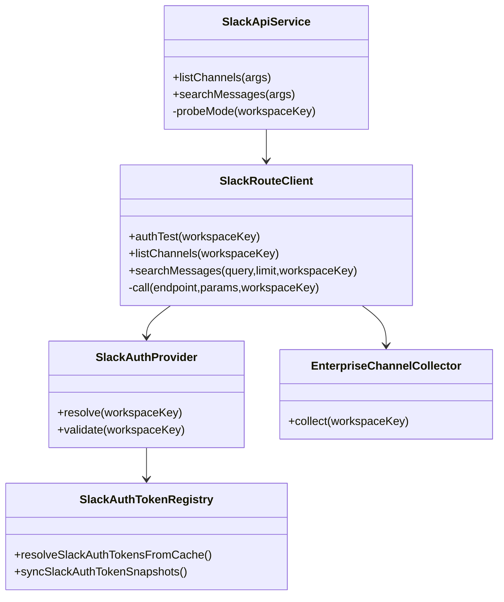
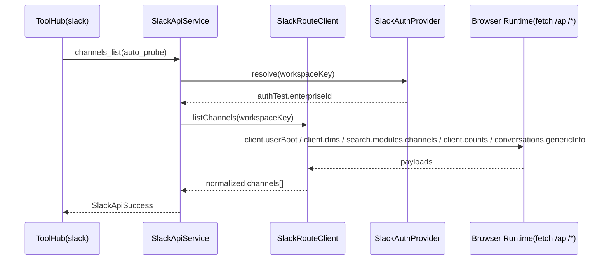

# 1. 概要と目的 Overview and Purpose

- What  
  `src/assistant/slack-api-tools` の Slack API 呼び出しを、`vendor/slack-mcp-server` が実際に利用しているエンドポイント、パラメーター、レスポンス形状に合わせて再設計する。
- Why  
  現状は一部の API 契約が vendor 実装とズレており、Enterprise Grid 環境での取りこぼしや将来の不整合リスクがあるため。契約準拠により、CDP 経由呼び出しの再現性と安定性を上げる。
- How  
  vendor 実装を仕様ソースとして契約を明文化し、`SlackRouteClient` に「契約単位の呼び出し関数」と「レスポンス正規化層」を追加する。`authTest` 事前記録結果で経路選択し、実行時の暗黙判定を廃止する。

## 1.1 行動原則 Core Principles

- Prototype First  
  プロトタイプ作成が目的であるため、特別な指示がない限り後方互換性は考慮しない。現在に対し最適な構造を優先する。  
  ただし既存CIが落ちる変更や公開APIの破壊が発生する場合は、破壊点と最小の移行方針を計画に明記する。
- SOLID  
  オブジェクト指向設計の5原則を守る。
- KISS  
  複雑さを避け、可能な限り単純な解決策を選ぶ。
- YAGNI  
  現在必要な機能のみを実装する。
- DRY  
  ロジックの重複を避ける。

# 2. 仕様と受け入れ条件 Specification and Acceptance Criteria

## 2.1 スコープ Scope

- 今回やること
  - vendor 準拠の API 契約を `slack-api-tools` 側へ反映する。
  - Team（通常ワークスペース）向け `channels_list` の `conversations.list` 契約（`types/limit/exclude_archived/cursor`）を vendor 準拠で固定する。
  - `channels_list` の Enterprise 経路を vendor 相当（`client.userBoot` / `client.dms` / `search.modules.channels` / `client.counts` / `conversations.genericInfo` の統合）へ寄せる。
  - `search_messages` を vendor 準拠で `search.all` 利用へ変更する。
  - `post_message` の不要パラメーター（`as_user`）を除去する。
  - `auth.test` 事前記録結果（`enterprise_id`）でルーティングを決定し、実行時 `auth.test` API 呼び出しを不要化する。
  - 契約テストを追加し、vendor 由来スキーマとの差分を自動検知可能にする。
- 成果物
  - `src/assistant/slack-api-tools/*` の実装修正
  - `src/slack/slackAuthTokenRegistry.ts` の解決結果拡張とログ契約整理
  - `tests/assistant/slack-api-tools/*` / `tests/slack/*` のテスト更新
  - 本計画に対応した契約サンプル更新
- 制約
  - 実行経路は CDP 経由のブラウザ実行コンテキストを維持する。
  - 秘匿情報（token/cookie）をログに出さない。

## 2.2 非スコープ Non Scope

- `vendor/slack-mcp-server` の全 API を adjutant 側へ完全移植すること。
- OAuth/Bot トークン経路（`xoxp/xoxb`）の新規追加。
- uTLS 等の Node.js 非対応レイヤー実装。

## 2.3 ユースケース Use Cases

- UC-1: Team ワークスペースで `channels_list` を実行し、`conversations.list` ベースで一覧取得できる。
- UC-2: Enterprise Grid ワークスペースで `channels_list` を実行し、IM/MPIM を含む統合チャネル集合を取得できる。
- UC-3: `search_messages` 実行時、vendor 準拠の `search.all` 契約でメッセージ一覧を取得できる。
- UC-4: `auth.test` が事前記録済みであれば、実行時に `auth.test` API 呼び出しなしで適切なルートが選択される。
- 異常系: `rate_limited` / `enterprise_is_restricted` / `invalid_auth` を既存エラーコードへ正しく変換する。

## 2.4 受け入れ条件 Acceptance Criteria

- Given `authTest.enterpriseId` が保存済み  
  When `channels_list` を `auto_probe` で実行  
  Then 実行時 `auth.test` API を呼ばず Enterprise 経路で処理される。

- Given `authTest.enterpriseId` が未保存（Team）  
  When `channels_list` を `auto_probe` で実行  
  Then 実行時 `auth.test` API を呼ばず `conversations.list` 経路で処理される。

- Given Enterprise 環境  
  When `channels_list` を実行  
  Then `search.modules.channels` 単独ではなく vendor 相当の統合フローでチャネル集合が構築される。

- Given Team 環境  
  When `channels_list` を実行  
  Then Enterprise 専用 API（`client.userBoot` / `client.dms` / `client.counts` / `conversations.genericInfo`）を呼ばず `conversations.list` 契約で一覧取得される。

- Given `search_messages` 実行  
  When Slack API 呼び出しが行われる  
  Then エンドポイントは `search.all` で、レスポンスの `messages.matches` を正しくパースする。

- Given `post_message` 実行  
  When Slack API 呼び出しが行われる  
  Then `as_user` を送らず `channel` と `text` を中心に送信する。

- Given `auth.test` 事前プローブ結果  
  When レジストリに反映される  
  Then 結果ログ（status, teamId, enterpriseId, errorCode）が token 非表示で出力される。

- Given vendor 契約との比較テスト  
  When テストを実行  
  Then エンドポイント名、必須パラメーター、主要レスポンスフィールドのズレを検知できる。

## 2.5 既知の制約 Known Limitations

- CDP の `fetch` では `User-Agent` を任意上書きできないため、HTTP クライアント実装と完全同一ヘッダーにはならない。
- Slack Desktop 側の実行コンテキスト依存により、セッション状態やアクティブワークスペース状態の影響を受ける。

# 3. 前提技術スタック Context and Tech Stack

- Language Framework  
  TypeScript (Node.js ESM)
- Libraries  
  `chrome-remote-interface`（CDP）、既存 `runtime/slackConnection`
- Style Guide  
  既存 ESLint / Prettier / TypeScript 設定に準拠
- Runtime Deployment  
  Assistant Gateway 実行環境（Slack Desktop + CDP 接続）
- Testing  
  Node test runner（`node --import tsx --test`）、`pnpm run typecheck`

# 4. インターフェース契約 Interface Contracts

## 4.1 公開APIまたは外部I O一覧

- HTTP API  
  なし（内部ツール呼び出し）
- CLI  
  なし
- 設定ファイル  
  `ADJUTANT_SLACK_API_*`, `ADJUTANT_SLACK_AUTH_TEST_ENABLED`, CDP 接続設定
- 永続化ストレージ  
  `~/.adjutant/data/accounts/*/_cache/slack/auth-token-store.json`
- 外部サービス連携  
  Slack WebClient API（CDP 経由 `fetch("/api/...")`）

## 4.2 データモデルとスキーマ

- 認証状態
  - `SlackAuthState.authTest` に `teamId/enterpriseId/url/userId` を保持
  - `resolveSlackAuthTokensFromCache` は token と `authTest` を返却
- エンドポイント契約（vendor 準拠）
  - `search.modules.channels`: `module`, `query`, `cursor`, `client_req_id`, `browse_session_id`, `_x_*` など
  - `conversations.genericInfo`: `updated_channels` JSON 文字列 + `_x_*`
  - `search.all`: `query`, `count`, `page`, `sort`, `sort_dir`（必要時）
  - `conversations.list`: `types`, `limit`, `exclude_archived`, `cursor`
  - `users.info`: `user`, `include_locale=true`
  - `chat.postMessage`: `channel`, `text`
- レスポンス正規化
  - `ok`, `error`, `response_metadata.next_cursor`, `pagination.next_cursor`, `messages.matches`, `items`, `channels` を契約フィールドとして扱う

## 4.3 エラーと例外 Error Handling

- エラー分類
  - `auth_invalid`, `rate_limited`, `not_supported`, `not_found`, `timeout`, `network_error`, `api_error`
- リトライ方針
  - `auth.test` 事前プローブは既存バックオフ（5s/15s/60s）を維持
  - API ツール本体は vendor と同じ「1回だけ自動再試行」は行わず、現行契約（即時エラー返却）を維持
- タイムアウト方針
  - 既存 `timeoutMs` を利用し `AbortError` を `timeout` へマッピング
- ログ方針と個人情報の扱い
  - `auth.test` 結果は status と識別子のみログ化
  - xoxc/xoxd/cookie は出力禁止

## 4.4 代表的な例 Examples

- Example-1: Enterprise チャネル検索リクエスト（概念）
  - Endpoint: `/api/search.modules.channels`
  - Params: `module=channels`, `query=`, `cursor=*`, `client_req_id=<uuid>`, `browse_session_id=<uuid>`, `search_context=desktop_channel_browser`, `_x_reason=browser-query`
  - Response key: `ok`, `items[]`, `pagination.next_cursor`

- Example-2: Team チャネル一覧取得
  - Endpoint: `/api/conversations.list`
  - Params: `types=public_channel,private_channel,mpim,im`, `limit=<n>`, `exclude_archived=true`, `cursor=*`
  - Response key: `ok`, `channels[]`, `response_metadata.next_cursor`

- Example-3: チャネル詳細取得（Enterprise）
  - Endpoint: `/api/conversations.genericInfo`
  - Params: `updated_channels={"C123":0}`, `_x_reason=fallback:UnknownFetchManager`, `_x_mode=online`, `_x_sonic=true`, `_x_app_name=client`
  - Response key: `ok`, `channels[]`, `unchanged_channel_ids[]`

- Example-4: メッセージ検索（vendor 準拠）
  - Endpoint: `/api/search.all`
  - Params: `query=<text>`, `count=<n>`, `page=<n>`, `sort=<default|指定>`, `sort_dir=<asc|desc>`
  - Response key: `ok`, `messages.matches[]`, `messages.pagination`

# 5. アーキテクチャと設計図 Architecture and Diagrams

## 5.1 図の選択方針

- 複数モジュールを跨ぐためクラス図を採用する。
- 非同期呼び出しとルート判定が重要なため、シーケンス図を追加する。

## 5.2 クラス図 Class Diagram

## 5.3 その他の図 Optional

# 6. テスト戦略 Test Strategy

## 6.1 テストの種類

- Unit  
  `route-client` のエンドポイント選択、パラメーター組み立て、レスポンス正規化
- Integration  
  `slack-provider.integration.test.ts` で `authTest` 事前記録時の経路選択と API 呼び出し列を検証
- Contract  
  vendor 契約ベースの固定フィクスチャ比較テスト（必須キー、エンドポイント、主要パラメーター）

## 6.2 カバレッジ対象

- 重要ロジック
  - Enterprise/Team 経路判定
  - Enterprise チャネル統合収集
  - search/post/users/channel 各 API 契約
- エラー分岐
  - `invalid_auth`, `enterprise_is_restricted`, `ratelimited`, timeout
- 境界条件
  - cursor なし/あり
  - authTest 未確定時
  - 空配列レスポンス

# 7. 実装タスクリスト Implementation Plan

### Phase 1 契約固定と判定基盤の整理

- [ ] Test: vendor 契約との差分検知テストを追加（endpoint/params/response-key）
- [ ] Impl: `SlackAuthState/SlackAuthResolved` に `authTest` 契約を統一し、事前記録値のみで `probeMode` 決定
- [ ] Refactor: 旧判定ロジック（実行時 `auth.test` 前提）を削除
- [ ] Integration: `auto_probe` が `authTest.enterpriseId` で決まることを検証
- [ ] Docs: 契約表を計画・コードコメントに反映

### Phase 2 Enterprise channels_list を vendor 準拠化

- [ ] Test: Enterprise チャネル収集の API 呼び出し順とマージ結果テストを追加
- [ ] Impl: `EnterpriseChannelCollector` を導入し `client.userBoot` / `client.dms` / `search.modules.channels` / `client.counts` / `conversations.genericInfo` を統合
- [ ] Refactor: 既存 `search.modules.channels` 単独収集コードを置換
- [ ] Integration: IM/MPIM 含有と重複排除を検証
- [ ] Docs: Enterprise 経路の仕様を更新

### Phase 3 Team channels_list を vendor 準拠化

- [ ] Test: Team 経路で `conversations.list` の params/response 正規化を検証
- [ ] Impl: Team `channels_list` を `conversations.list` 契約で統一し不要分岐を削除
- [ ] Refactor: Team/Enterprise の共通出力スキーマを統一
- [ ] Integration: Team で Enterprise 専用 API が呼ばれないことを検証
- [ ] Docs: Team 経路の仕様と例を更新

### Phase 4 その他 API 契約の vendor 整合

- [ ] Test: `search_messages` を `search.all` 契約で検証、`post_message` の不要パラメーター不送信を検証
- [ ] Impl: `search.messages -> search.all` へ変更、`chat.postMessage` から `as_user` を削除、`users.info` の `include_locale=true` を明示
- [ ] Refactor: 共通パラメーター構築/レスポンス正規化ヘルパーを整理
- [ ] Integration: 全 slack-api-tools テストを更新し pass
- [ ] Docs: 代表例と既知制約を更新

### Phase 5 統合と検証

- [ ] 全体テストの実行（`pnpm run typecheck` と対象 test）
- [ ] エッジケースの動作確認（rate limit, invalid_auth, restricted）
- [ ] ログと例外の確認（token 非出力）
- [ ] ドキュメント更新（必要な spec/plan の追記）

# 8. 完了の定義 Definition of Done

## 8.1 機能DoD Functional DoD

- [ ] 受け入れ条件がすべて満たされていること
- [ ] 既知の制約が明文化され、想定通りであること
- [ ] 契約の例に対して期待通りの結果が得られること

## 8.2 品質DoD Quality DoD

- [ ] 全てのテストがパスしていること
- [ ] Linter Formatterのエラーがないこと
- [ ] 不要なデバッグコードが削除されていること
- [ ] 主要な変更点がドキュメントに反映されていること

# 9. 懸念事項と未確定事項 Concerns and Questions

- `search_messages` を `search.all` へ変更した際の既存利用者期待値（files を無視して messages のみ返す契約で問題ないか）。
- Enterprise channels 統合時、`client.userBoot` / `client.dms` のレスポンス揺れに対するフォールバック境界をどこまで持つか。
- Team channels 取得時、`conversations.list` の `types` に `im/mpim` を含める運用を既定にして問題ないか。
- CDP 実行コンテキストの制約上、vendor と同一ヘッダー（特に User-Agent）の完全一致は不可。契約上どこまで許容するか。
- 既存 route pin (`workspace-route-pins.json`) を今回の判定ロジックで維持するか、`authTest` 主体へ簡素化するか最終判断が必要。
