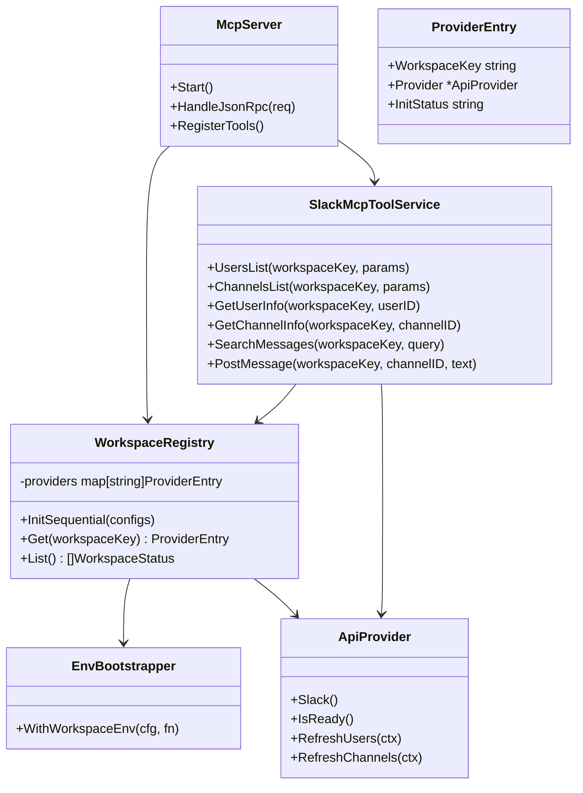
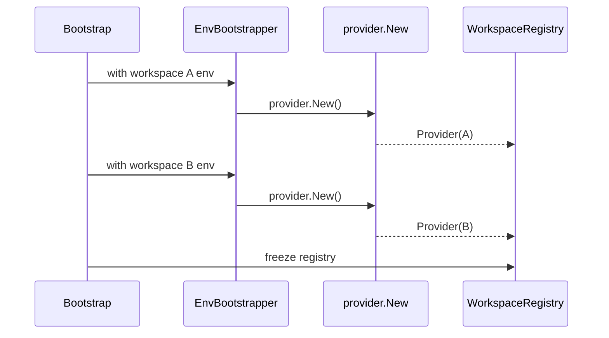

# 1. 概要と目的 Overview and Purpose

- What  
  `https://github.com/korotovsky/slack-mcp-server` の `pkg` ディレクトリにある必要パッケージ（`pkg/provider` など）をGo moduleとしてimportし、元々のMCPを利用可能なマルチアカウントSlackゲートウェイをGoで実装する。`workspace_key` 指定で `xoxc/xoxd` ペアを切り替え、JSON-RPC経由のMCPツール呼び出しで実行できるようにする。
- Why  
  upstream `github.com/korotovsky/slack-mcp-server` の実装挙動を追従可能な形で再利用しつつ、`adjutant` から複数ワークスペースを安定利用するためには、アカウント切替可能なMCP境界が必要なため。
- How  
  `provider.New()` の環境変数依存は受け入れ、起動時に「直列でのみ」環境変数を切り替えて複数 `ApiProvider` を初期化する。初期化完了後は環境変数を不変とし、`workspace_key -> provider` のルーティングでMCP `tools/call` を処理する。

## 1.1 行動原則 Core Principles

- Prototype First  
  プロトタイプ作成が目的であるため、特別な指示がない限り後方互換性は考慮しない。現在に対し最適な構造を優先する。  
  ただし既存CIが落ちる変更や公開APIの破壊が発生する場合は、破壊点と最小の移行方針を計画に明記する。
- SOLID  
  オブジェクト指向設計の5原則を守る。
- KISS  
  複雑さを避け、可能な限り単純な解決策を選ぶ。
- YAGNI  
  現在必要な機能のみを実装する。
- DRY  
  ロジックの重複を避ける。

# 2. 仕様と受け入れ条件 Specification and Acceptance Criteria

## 2.1 スコープ Scope

- 今回やること
  - Go製MCPサーバ（JSON-RPC over HTTP）を新規追加し、`workspace_key` 指定でSlack API呼び出し先アカウントを切り替える。
  - `github.com/korotovsky/slack-mcp-server/pkg/...` を `go.mod` で依存追加し、ローカル `vendor` コピーには依存しない。
  - 起動時に複数アカウント設定を読み込み、`provider.New()` を直列に呼んで `ApiProvider` を複数初期化する。
  - 初期化時のみ環境変数を差し替え、初期化完了後は変更しない運用ガードを入れる。
  - `adjutant` の現行利用に必要なMCPツールを先行実装する。
  - `workspaces_list` ツールを追加し、利用可能な `workspace_key` と状態を返す。
  - エラー契約とログ契約を定義し、tokenやcookieを出力しない。
  - `go build` で単体バイナリを生成可能にする。
  - ローカル起動可能な `Dockerfile` を追加し、`multi-stage build` + `distroless` ランタイムでコンテナ実行手順を用意する。
- 成果物
  - Goサービス実装（`cmd` / `internal` / `pkg`）
  - `go.mod` / `go.sum`（upstream依存込み）
  - `Dockerfile`（`multi-stage build` + `distroless` ランタイム）
  - MCP（JSON-RPC）契約ドキュメント
  - 単体テストと契約テスト
  - ビルド/起動手順ドキュメント（`go build` と `docker build/run`）
  - `adjutant` 差し替え用I/Fメモ
- 制約
  - 初期化処理は並列化しない。
  - `xoxp/xoxb` は対象外。`xoxc/xoxd` のみ。
  - Enterprise判定とAPI経路は upstream `pkg/provider` の既存挙動を利用する。

## 2.2 非スコープ Non Scope

- `github.com/korotovsky/slack-mcp-server` 本体の全面forkや大規模リファクタ。
- env依存を完全排除する `provider.NewWithConfig` 実装。
- Slackトークンの永続化方式刷新。
- `adjutant` 側の最終移行完了までを本フェーズの必須にはしない。
- upstream全体をローカルにコピーして固定運用すること。

## 2.3 ユースケース Use Cases

- UC-1: 起動時に3つの `workspace_key` 設定を読み込み、順番に `ApiProvider` を初期化して利用可能状態にする。
- UC-2: MCP `tools/call` で `channels_list(workspace_key=A)` を呼ぶとAのアカウント経路が選択される。
- UC-3: MCP `tools/call` で `channels_list(workspace_key=B)` を呼ぶとBのアカウント経路が選択される。
- UC-4: Enterpriseワークスペースでは upstream 既存分岐に従い enterprise向け経路が利用される。
- UC-5: Non-Enterpriseワークスペースでは upstream 既存分岐に従い `conversations.list` 経路が利用される。
- 異常系1: 未登録 `workspace_key` を指定した場合は `not_found` を返す。
- 異常系2: 指定ワークスペースの認証不備時は `auth_invalid` を返す。

## 2.4 受け入れ条件 Acceptance Criteria

- Given 2件以上のワークスペース設定  
  When サービスを起動  
  Then `provider.New()` は直列に呼ばれ、全ワークスペースの初期化結果が `workspaces_list` に反映される。

- Given サービス起動後  
  When MCPツール呼び出しを並行実行  
  Then 環境変数の再書き換えなしで `workspace_key` ルーティングのみで処理される。

- Given `workspace_key=acme` が登録済み  
  When `users_list` を呼ぶ  
  Then `acme` に対応する `ApiProvider` 経由で結果が返る。

- Given 未登録 `workspace_key`  
  When MCP `tools/call` を呼ぶ  
  Then `not_found` エラーをJSON-RPCエラーまたはtool errorとして返す。

- Given Enterpriseワークスペース  
  When `channels_list` を呼ぶ  
  Then upstream `MCPSlackClient.GetConversationsContext` 分岐に従ったレスポンスが得られる。

- Given ログ出力有効  
  When リクエストとエラーを記録  
  Then `xoxc/xoxd/cookie` の平文がログに含まれない。

- Given 実装済みソース  
  When `go build` を実行  
  Then エラーなくバイナリが生成される。

- Given `Dockerfile` が存在  
  When `docker build` と `docker run` を実行  
  Then `distroless` ランタイムイメージでコンテナ内サービスが起動し、`/healthz` が成功応答を返す。

## 2.5 既知の制約 Known Limitations

- 環境変数切替方式はプロセスグローバル依存のため、初期化フェーズの排他制御が前提。
- 現行実装では起動後の動的アカウント追加は未対応（本書の追加フェーズで対応計画を定義）。
- upstream側の将来変更で実行時 `os.Getenv` 参照が増えた場合、方式見直しが必要。

## 2.6 追加計画 Dynamic Workspace Registration

- 目的
  - `docker compose up` 時点ではトークン未設定でも Gateway を起動可能にし、起動後に `workspace_key` と `xoxc/xoxd` を登録してワークスペースを増やせるようにする。
- 追加スコープ
  - 起動時 `workspaces` 0件を許容する。
  - MCP 管理ツール `workspace_register` を追加し、起動後に `workspace_key` と `xoxc/xoxd` を登録できるようにする。
  - 管理ツール `workspace_unregister` を追加し、不要な `workspace_key` を登録解除できるようにする。
  - `workspace_register` / `workspace_unregister` で変更した状態を runtime ストアへ永続化し、再起動後も復元できるようにする。
  - 既存の静的 `workspaces` 設定による起動方式は後方互換として維持する。
- 追加受け入れ条件
  - Given `workspaces: []` または未指定  
    When サービスを起動  
    Then プロセスは起動し、`workspaces_list` は0件を返し、`/healthz` は `workspace_ready=0` を返す。
  - Given 起動後に `workspace_register(workspace_key=acme, xoxc, xoxd)` を呼ぶ  
    When 初期化が成功  
    Then `workspaces_list` に `acme` が `ready=true` で追加され、既存ツールが `workspace_key=acme` で利用できる。
  - Given 既存 `workspace_key` へ再登録を試行  
    When `workspace_register` を呼ぶ  
    Then `already_exists` を返し、既存 runtime は変更されない。
  - Given 不正トークンで `workspace_register` を呼ぶ  
    When 初期化に失敗  
    Then `auth_invalid` または `api_error` を返し、失敗 workspace は ready 登録されない。
  - Given `workspace_unregister(workspace_key=acme)` を呼ぶ  
    When 解除が成功  
    Then `workspaces_list` から `acme` が除外され、永続ストアからも削除される。
  - Given `workspace_register` が同時に複数呼ばれる  
    When 異なる `workspace_key` を登録  
    Then 排他制御下で順次初期化され、環境変数競合が発生しない。

# 3. 前提技術スタック Context and Tech Stack

- Language Framework  
  Go 1.24系
- Libraries  
  `github.com/korotovsky/slack-mcp-server/pkg/provider`（必要に応じて `pkg/handler`, `pkg/text`）、`slack-go/slack`、`zap`、標準 `net/http`
- Style Guide  
  既存リポジトリのlint/format方針に準拠
- Runtime Deployment  
  単一プロセスHTTPサーバ、ローカル起動および `multi-stage build` + `distroless` Dockerコンテナ起動
- Testing  
  `go test`（unit + contract）

# 4. インターフェース契約 Interface Contracts

## 4.1 公開APIまたは外部I O一覧

- HTTP API
  - `POST /mcp`（JSON-RPC 2.0）
  - `GET /healthz`
- CLI
  - `--config <path>` ワークスペース設定ファイル
  - `--listen <host:port>` 待受アドレス（任意、未指定は `:8080`）
- 設定ファイル
  - `workspace_key`, `xoxc`, `xoxd`, `cache_dir` を持つJSONまたはYAML
- 永続化ストレージ
  - providerキャッシュファイル（users/channels）
- 外部サービス連携
  - Slack Web API / Edge API（upstream `slack-mcp-server` パッケージ実装経由）

## 4.2 データモデルとスキーマ

- WorkspaceConfig
  - `workspace_key: string` 必須
  - `xoxc: string` 必須
  - `xoxd: string` 必須
  - `cache_dir: string` 任意
- WorkspaceRegistrationRequest（`workspace_register`）
  - `workspace_key: string` 必須
  - `xoxc: string` 必須
  - `xoxd: string` 必須
  - `cache_dir: string` 任意
- WorkspaceUnregisterRequest（`workspace_unregister`）
  - `workspace_key: string` 必須
- JSON-RPC Request（MCP）
  - `jsonrpc: "2.0"` 必須
  - `id: string|number` 必須
  - `method: string` 必須（例: `tools/list`, `tools/call`）
  - `params: object` 必須
- JSON-RPC Response（MCP）
  - 成功時: `result`
  - 失敗時: `error { code, message, data? }`
- 先行サポートツール
  - `workspaces_list`
  - `users_list`
  - `channels_list`
  - `get_user_info`
  - `get_channel_info`
  - `search_messages`
  - `post_message`
- 追加予定管理ツール
  - `workspace_register`
  - `workspace_unregister`

## 4.3 エラーと例外 Error Handling

- エラー分類
  - `validation_error`
  - `not_found`
  - `already_exists`
  - `auth_invalid`
  - `rate_limited`
  - `timeout`
  - `api_error`
  - `internal_error`
- リトライ方針
  - サーバ側で暗黙リトライは行わない
  - 呼び出し側で必要に応じてリトライ
- タイムアウト方針
  - リクエスト単位タイムアウトを設定
  - タイムアウト時は `timeout` を返す
- ログ方針と個人情報の扱い
  - `workspace_key`, `jsonrpc_method`, `tool_name`, status, latency のみ記録
  - token/cookie/Authorizationはマスクまたは非出力

## 4.4 代表的な例 Examples

- Example-1: MCPツール一覧
```bash
curl -s -X POST http://localhost:8080/mcp \
  -H 'content-type: application/json' \
  -d '{
    "jsonrpc":"2.0",
    "id":1,
    "method":"tools/list",
    "params":{}
  }'
```

- Example-2: `users_list` を tools/call で実行
```bash
curl -s -X POST http://localhost:8080/mcp \
  -H 'content-type: application/json' \
  -d '{
    "jsonrpc":"2.0",
    "id":2,
    "method":"tools/call",
    "params":{
      "name":"users_list",
      "arguments":{"workspace_key":"acme","limit":200}
    }
  }'
```

- Example-3: `post_message` を tools/call で実行
```bash
curl -s -X POST http://localhost:8080/mcp \
  -H 'content-type: application/json' \
  -d '{
    "jsonrpc":"2.0",
    "id":3,
    "method":"tools/call",
    "params":{
      "name":"post_message",
      "arguments":{"workspace_key":"acme","channel_id":"C123","text":"hello"}
    }
  }'
```

- Example-4: ローカルビルド
```bash
go build -o ./bin/slack-rpc-gateway ./cmd/slack-rpc-gateway
```

- Example-5: Dockerでローカル起動
```bash
docker build -t slack-rpc-gateway:local .
docker run --rm -p 8080:8080 \
  -v "$(pwd)/config:/app/config:ro" \
  slack-rpc-gateway:local
curl -s http://localhost:8080/healthz
```

- Example-6: 起動後に `workspace_register` で追加
```bash
curl -s -X POST http://localhost:8080/mcp \
  -H 'content-type: application/json' \
  -d '{
    "jsonrpc":"2.0",
    "id":6,
    "method":"tools/call",
    "params":{
      "name":"workspace_register",
      "arguments":{
        "workspace_key":"acme",
        "xoxc":"xoxc-***",
        "xoxd":"xoxd-***"
      }
    }
  }'
```

- Example-7: `workspace_unregister` で解除
```bash
curl -s -X POST http://localhost:8080/mcp \
  -H 'content-type: application/json' \
  -d '{
    "jsonrpc":"2.0",
    "id":7,
    "method":"tools/call",
    "params":{
      "name":"workspace_unregister",
      "arguments":{"workspace_key":"acme"}
    }
  }'
```

# 5. アーキテクチャと設計図 Architecture and Diagrams

## 5.1 図の選択方針

- 複数モジュールと外部I/Oを跨ぐためクラス図を採用する。
- 初期化順序とリクエスト時の流れが重要なためシーケンス図を追加する。

## 5.2 クラス図 Class Diagram



## 5.3 その他の図 Optional



# 6. テスト戦略 Test Strategy

## 6.1 テストの種類

- Unit
  - `EnvBootstrapper` が環境変数を保存復元すること
  - `WorkspaceRegistry` が直列初期化順序を守ること
  - `workspace_key` 解決ロジックが期待通りであること
- Integration
  - `httptest` で `/mcp`（`tools/list`, `tools/call`）の統合確認
  - 複数ワークスペースのルーティング確認
  - `go build` 成功のスモーク確認
  - `docker build` + `docker run` + `/healthz` のスモーク確認（runtimeがdistrolessであることを含む）
- Contract
  - JSON-RPC/MCPの入力バリデーションとエラーコード契約確認
  - `workspaces_list` ツール応答スキーマ固定

## 6.2 カバレッジ対象

- 重要ロジック
  - 初期化時env切替の排他制御
  - `workspace_key` ルーティング
- エラー分岐
  - 未登録workspace
  - auth失敗
  - Slack API error
- 境界条件
  - workspace未指定時のdefault解決
  - 0件設定時の起動挙動

# 7. 実装タスクリスト Implementation Plan

### Phase 1 起動基盤とレジストリ

- [x] Test `EnvBootstrapper` の保存復元と直列実行を検証するRedテストを作成
- [x] Impl `EnvBootstrapper` と `WorkspaceRegistry.InitSequential` の最小実装を追加しGreen化
- [x] Refactor 初期化責務を分離し、ログ・エラー整形を共通化
- [x] Integration 複数ワークスペース設定で起動し、`/healthz` と `workspaces_list` 応答を確認
- [x] Integration `go build` でバイナリ生成可能であることを確認
- [x] Docs 初期化制約（起動後env不変）をREADMEへ追記

### Phase 2 MCP API（最小ツール群）

- [x] Test `workspaces_list/users_list/channels_list` の失敗ケースRedテストを作成
- [x] Impl `POST /mcp`（JSON-RPC）と `tools/call` ディスパッチの最小実装を追加しGreen化
- [x] Refactor `workspace_key` 解決とエラー変換処理を共通化
- [x] Integration `workspace_key` 切替で異なるproviderに到達することを確認
- [x] Docs MCPツール契約とサンプルcurlを更新

### Phase 3 adjutant接続準備と品質確認

- [x] Test `adjutant` 側差し替え前提の契約テスト（tool名/レスポンス形）を追加
- [x] Impl `get_user_info/get_channel_info/search_messages/post_message` を追加
- [x] Refactor 共通Slack呼び出しラッパーを整理し重複を削減
- [x] Integration エラー分類 `auth_invalid/rate_limited/not_found` をE2Eで確認
- [x] Impl `multi-stage build` + `distroless` の `Dockerfile` を追加
- [x] Integration `docker build` と `docker run` で `/healthz` が成功し、distroless runtimeで起動することを確認
- [x] Docs 移行手順（CDP直叩きからMCPツール呼び出し）を追記

### Phase 4 起動後動的ワークスペース追加（追加計画）

- [ ] Test `workspaces: []` で起動成功し、`workspaces_list` が 0 件を返す Red テストを追加
- [ ] Impl `Config.Validate` / `WorkspaceRegistry` を拡張し、起動後追加可能な mutable registry に変更して Green 化
- [ ] Test `workspace_register` の正常系・重複キー・認証失敗・同時実行を Red テストで追加
- [ ] Impl `workspace_register` ツール実装（初期化は既存 `EnvBootstrapper` 排他制御を再利用）で Green 化
- [ ] Test `workspace_unregister` の正常系・未登録キー・実行中ワークスペース解除の扱いを Red テストで追加
- [ ] Impl `workspace_unregister` ツール実装（registry と永続ストア更新）で Green 化
- [ ] Impl runtime 永続ストア（registered workspaces）を追加し、起動時に静的設定 + 永続ストアをマージ復元
- [ ] Integration `workspace_register` 後に `users_list/channels_list/post_message` が利用可能になる E2E を追加
- [ ] Integration `workspace_unregister` 後に `not_found` を返すことを確認
- [ ] Security review 管理ツールのログマスキング（token/cookie 非出力）と監査ログ項目を確認
- [ ] Docs `compose` 起動時はトークン不要で、必要時に `workspace_register` で追加する運用手順へ更新

# 8. 完了の定義 Definition of Done

## 8.1 機能DoD Functional DoD

- [x] 受け入れ条件がすべて満たされていること
- [x] 既知の制約が明文化され、想定通りであること
- [x] 契約の例に対して期待通りの結果が得られること

## 8.2 品質DoD Quality DoD

- [x] 全てのテストがパスしていること
- [x] `go build` が成功していること
- [x] `docker build` およびローカル `docker run` のスモーク確認が完了し、runtimeがdistrolessであること
- [x] Linter Formatterのエラーがないこと
- [x] 不要なデバッグコードが削除されていること
- [x] 主要な変更点がドキュメントに反映されていること

# 9. 懸念事項と未確定事項 Concerns and Questions

- `provider.New()` 依存方式のため、将来upstreamで実行時env参照が増えた場合の影響監視が必要。
- upstream依存のため、将来の `github.com/korotovsky/slack-mcp-server` 更新で破壊的変更が入る可能性がある。`go.mod` のバージョン固定と更新手順が必要。
- `workspace_register/workspace_unregister` の実行主体をどう制限するか（ローカル限定、ヘッダ認証、mTLS等）の決定が必要。
- runtime 永続ストアの平文保存可否（暗号化/secret manager 連携要否）の判断が必要。
- `POST /mcp` の認証方式（ローカル限定かAPI key必須か）が未確定。
- `adjutant` 側で既存 `SlackRouteClient` とどの粒度で互換を合わせるか最終決定が必要。
- Dockerイメージに設定ファイルをどう注入するか（bind mountか環境変数か）の運用方針が未確定。
- distrolessランタイムではshellが使えないため、トラブルシュート導線（debug tagや別イメージ）を事前に決める必要がある。

---
