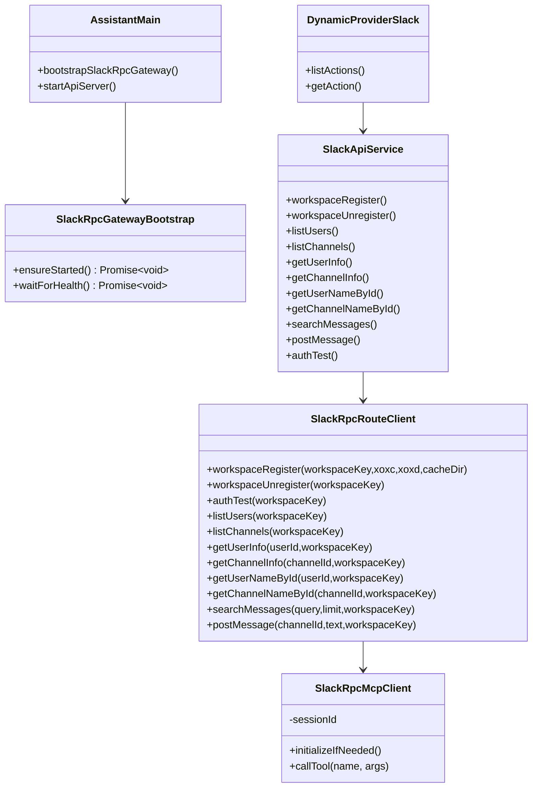
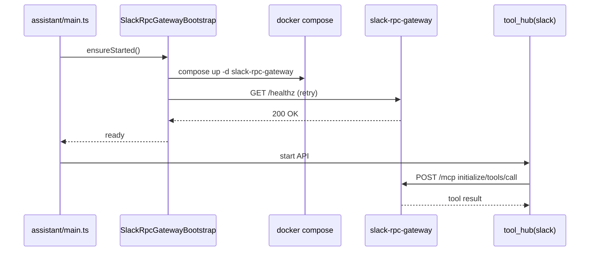

# 1. 概要と目的 Overview and Purpose

- What  
  `adjutant` の Slack API 実行経路を CDP 直実行（`SlackRouteClient`）から Slack RPC Gateway（JSON-RPC/MCP）へ全面移行する。あわせて `adjutant` 起動時に `docker compose` で `slack-rpc-gateway` コンテナを自動起動し、`auth.test` を含む Slack 操作を JSON-RPC 経由で実行する。`tool_hub` の Slack action は「現行7個構成」を廃止し、Gateway MCP tools（11個）+ `auth_test` の12個へ統一する。
- Why  
  CDP セッション依存の API 実行を廃止し、Slack API 実行の責務を専用 Gateway に集約することで、運用安定性・マルチ workspace 運用・トークン動的登録の整合性を高めるため。
- How  
  `src/assistant/slack-api-tools` に JSON-RPC クライアント層を追加し、内部実装を差し替える。Go 側 Gateway に `auth_test` MCP tool を追加し、`tool_hub` の Slack action catalog を Gateway tool 名と1:1で揃える。`src/assistant/main.ts` 起動シーケンスで Gateway の compose 起動と疎通確認（`/healthz`）を行い、停止時のクリーンアップ方針を明確化する。

## 1.1 行動原則 Core Principles

- Prototype First  
  プロトタイプ作成が目的であるため、特別な指示がない限り後方互換性は考慮しない。現在に対し最適な構造を優先する。  
  ただし既存CIが落ちる変更や公開APIの破壊が発生する場合は、破壊点と最小の移行方針を計画に明記する。
- SOLID  
  オブジェクト指向設計の5原則を守る。
- KISS  
  複雑さを避け、可能な限り単純な解決策を選ぶ。
- YAGNI  
  現在必要な機能のみを実装する。
- DRY  
  ロジックの重複を避ける。

# 2. 仕様と受け入れ条件 Specification and Acceptance Criteria

## 2.1 スコープ Scope

- 今回やること
  - `src/assistant/slack-api-tools/factory.ts` の Slack クライアント配線を JSON-RPC クライアント実装へ置換する。
  - CDP 実行専用の `SlackRouteClient` への依存を Slack provider の本番経路から除去する。
  - Slack RPC Gateway（Go）に `auth_test` MCP tool を追加する。
  - Slack RPC Gateway（Go）で「`workspace_key` 省略時に default workspace を使う挙動」を廃止し、実行系ツールは `workspace_key` 必須にする。
  - `tool_hub` の Slack action を 12個へ再定義する（`workspaces_list`, `workspace_register`, `workspace_unregister`, `users_list`, `channels_list`, `get_user_info`, `get_channel_info`, `get_user_name_by_id`, `get_channel_name_by_id`, `search_messages`, `post_message`, `auth_test`）。
  - `src/assistant/main.ts` 起動時に `docker compose up -d slack-rpc-gateway` を実行する bootstrap を追加する（設定で無効化可能）。
  - 起動時に `/healthz` を監視し、未起動・起動失敗時のエラー契約を定義する。
  - README と環境変数仕様を JSON-RPC 前提に更新する。
- 成果物
  - JSON-RPC クライアント実装（MCP initialize と tools/call 実装）
  - Gateway `auth_test` tool 実装（Go）
  - Slack API tools の新配線（CDP 直実行経路の廃止）
  - `tool_hub` Slack action catalog 12個化
  - Gateway 自動起動 bootstrap 実装
  - ユニット/統合/契約テスト更新
  - ドキュメント更新（README + plan）
- 制約
  - Slack RPC Gateway 側の公開ツール契約（`tools/call`）を尊重する。
  - トークン管理は Gateway 側（`workspace_register`）に寄せ、`adjutant` 側で `xoxc/xoxd` を直接利用しない。
  - 既存の「Slack action 7個のみ」契約は廃止し、12個へ再定義する。
  - `workspaces_list` 以外で workspace 対象が必要な action は `workspace_key` を必須とし、暗黙の default 解決は行わない。

## 2.2 非スコープ Non Scope

- Slack RPC Gateway（Go）の全面再設計。
- 永続ストア刷新やトークン暗号化方式の追加。
- Slack 収集（`src/index.ts`）の CDP ingest 経路廃止。
- 本タスクでの本番デプロイ運用手順の策定（ローカル開発前提）。

## 2.3 ユースケース Use Cases

- UC-1: `adjutant`（assistant）起動時に `slack-rpc-gateway` コンテナが未起動なら自動起動される。
- UC-2: `tool_hub` の Slack action 12個が JSON-RPC 経由で実行される。
- UC-3: `tool_hub` から `auth_test` を呼ぶと、指定 `workspace_key` の `auth.test` 相当結果が返る。
- UC-3.1: `tool_hub` から `workspace_register` / `workspace_unregister` を呼ぶと、Gateway runtime 追加・削除が実行される。
- UC-3.2: `tool_hub` から `get_user_info` / `get_channel_info` を呼ぶと、Gateway tool の結果がそのまま返る。
- UC-4: Gateway が未起動または不健康の場合、Slack action は `integration_unavailable` 系の明示エラーを返す。
- 異常系1: `workspace_key` 未登録時は `not_found` を返し、CDP フォールバックは行わない。
- 異常系1.1: `workspace_key` 省略で実行系 action を呼んだ場合は `validation_error` を返す。
- 異常系2: compose 起動失敗時は原因をログに残し、assistant 起動の継続可否を設定で制御する。

## 2.4 受け入れ条件 Acceptance Criteria

- Given `ADJUTANT_SLACK_RPC_AUTO_START=1`  
  When assistant (`src/assistant/main.ts`) を起動  
  Then `docker compose up -d slack-rpc-gateway` が実行され、`/healthz` 成功まで待機した後に API server が起動する。

- Given Slack provider が有効  
  When `tool_hub` で `mode=execute provider=slack action=auth_test` を呼ぶ  
  Then JSON-RPC `tools/call(name=auth_test)` が呼ばれ、`team_id/enterprise_id/url/user_id` を返す。

- Given Slack provider が有効  
  When `users_list`, `channels_list`, `workspace_register`, `workspace_unregister`, `get_user_info`, `get_channel_info` を実行  
  Then CDP browser invoker は呼ばれず、JSON-RPC 経由で結果が返る。

- Given Slack provider が有効  
  When `users_list`, `channels_list`, `get_user_info`, `get_channel_info`, `get_user_name_by_id`, `get_channel_name_by_id`, `search_messages`, `post_message`, `auth_test` を `workspace_key` なしで実行  
  Then `validation_error` を返し、default workspace へのフォールバックは行わない。

- Given Slack provider が有効  
  When action catalog を列挙  
  Then Slack action は12個で、Gateway MCP tools（11個）+ `auth_test` と一致する。

- Given `workspace_key` が Gateway 未登録  
  When 任意 Slack action を実行  
  Then `ok=false` かつ `code=not_found`（または契約した対応コード）で失敗し、エラーメッセージに workspace 情報が含まれる。

- Given Gateway が疎通不能  
  When assistant 起動または Slack action 実行  
  Then タイムアウト付きで失敗し、ログには endpoint/attempt/latency を残し token 情報は出力しない。

- Given 既存テスト一式  
  When `pnpm run test` と `pnpm run typecheck` を実行  
  Then Slack API tools 関連テストが新契約でパスし、旧7個固定の catalog 契約は12個契約へ置換される。

## 2.5 既知の制約 Known Limitations

- `docker compose` 実行を Node プロセスから行うため、Docker Desktop 未起動環境では自動起動に失敗する。
- JSON-RPC の MCP セッション（`mcp-session-id`）はプロセス内メモリ保持で、プロセス再起動時に再初期化が必要。
- プロトタイプ段階では compose 起動失敗時の高度なリトライ戦略（指数バックオフ、自己修復）は最小限に留める。

# 3. 前提技術スタック Context and Tech Stack

- Language Framework  
  TypeScript 5.x / Node.js ESM
- Libraries  
  既存 `fetch`、`child_process.spawn`、Dynamic Tool Hub（`src/assistant/dynamic-tool`）
- Style Guide  
  ESLint / Prettier / 既存 TypeScript ルールに準拠
- Runtime Deployment  
  ローカル開発環境、`docker compose` で `slack-rpc-gateway` を起動
- Testing  
  Node test runner（`node --import tsx --test`）、TypeScript typecheck

# 4. インターフェース契約 Interface Contracts

## 4.1 公開APIまたは外部I O一覧

- HTTP API（外部）
  - `POST {SLACK_RPC_BASE_URL}/mcp`（JSON-RPC 2.0, MCP）
  - `GET {SLACK_RPC_BASE_URL}/healthz`
- CLI（外部プロセス）
  - `docker compose up -d slack-rpc-gateway`
  - `docker compose stop slack-rpc-gateway`（必要時）
- 設定
  - `ADJUTANT_SLACK_RPC_ENABLED`
  - `ADJUTANT_SLACK_RPC_BASE_URL`
  - `ADJUTANT_SLACK_RPC_AUTO_START`
  - `ADJUTANT_SLACK_RPC_STARTUP_TIMEOUT_MS`
  - `ADJUTANT_SLACK_RPC_REQUIRED`
- 外部サービス連携
  - Slack RPC Gateway（Go, MCP サーバ）

## 4.2 データモデルとスキーマ

- SlackRpcCallRequest
  - `method: "tools/call"`
  - `params.name: string`
  - `params.arguments: Record<string, unknown>`
- SlackRpcToolResult（正規化後）
  - `ok: boolean`
  - `code?: string`
  - `message?: string`
  - `data?: Record<string, unknown>`
- Slack Dynamic Action セット（12個）
  - `workspaces_list`
  - `workspace_register`
  - `workspace_unregister`
  - `users_list`
  - `channels_list`
  - `get_user_info`
  - `get_channel_info`
  - `get_user_name_by_id`
  - `get_channel_name_by_id`
  - `search_messages`
  - `post_message`
  - `auth_test`
- `auth_test` 入出力
  - args: `workspace_key: string`（必須）
  - result: `{ team_id?: string; enterprise_id?: string; url?: string; user_id?: string }`
- 返却スキーマ
  - すべての action でトップレベル `ok`, `code`, `message`, `data` 契約を維持する。
- `workspace_key` 必須ルール
  - `workspaces_list` を除く実行系 action は `workspace_key` を必須とする。
  - 省略時は `validation_error` を返し、default workspace 解決をしない。

## 4.3 エラーと例外 Error Handling

- エラー分類
  - `integration_unavailable`（Gateway未到達）
  - `timeout`
  - `validation_error`
  - `not_found`
  - `auth_invalid`
  - `api_error`
- リトライ方針
  - 起動時 healthcheck は短周期リトライ（タイムアウトまで）
  - tool 実行時は自動リトライなし（呼び出し側で制御）
- タイムアウト方針
  - compose 起動待ち・healthcheck・MCP call すべてに明示 timeout を設定
- ログ方針と個人情報の扱い
  - `workspace_key`, action 名, status, latency を記録
  - `xoxc/xoxd`、Cookie、Authorization をログ出力禁止

## 4.4 代表的な例 Examples

- Example-1: assistant 起動時の compose 実行（内部）
```bash
docker compose up -d slack-rpc-gateway
```

- Example-2: JSON-RPC `auth_test`
```json
{
  "jsonrpc": "2.0",
  "id": 10,
  "method": "tools/call",
  "params": {
    "name": "auth_test",
    "arguments": {
      "workspace_key": "acme"
    }
  }
}
```

- Example-3: `tool_hub` 実行例
```json
{
  "mode": "execute",
  "provider": "slack",
  "action": "users_list",
  "args": {
    "workspace_key": "acme"
  }
}
```

# 5. アーキテクチャと設計図 Architecture and Diagrams

## 5.1 図の選択方針

- 複数モジュール（assistant起動, Slack provider, 外部JSON-RPC）を跨ぐためクラス図を必須とする。
- 起動順序（compose -> healthcheck -> API起動）と実行順序（tool_hub -> JSON-RPC）が重要なためシーケンス図を追加する。

## 5.2 クラス図 Class Diagram



## 5.3 その他の図 Optional



# 6. テスト戦略 Test Strategy

## 6.1 テストの種類

- Unit
  - `SlackRpcMcpClient` の initialize/session header 管理
  - `SlackRpcRouteClient` の tool 名・引数マッピング
  - Gateway `auth_test` tool の handler 入出力と error code 変換
  - `workspace_key` 省略時の `validation_error`（default fallback 無効）検証
  - compose bootstrap のコマンド組み立てと timeout/error 分岐
- Integration
  - `createSlackDynamicProviderFromEnv` から `tool_hub execute` まで JSON-RPC stub で疎通
  - assistant 起動時 bootstrap（spawn モック）と healthcheck 成否
- Contract
  - `tool_hub` の Slack action catalog が12個で固定されること
  - 全12 action の戻り値契約（`ok/code/message/data`）維持
  - `auth_test` action の入出力契約固定

## 6.2 カバレッジ対象

- 重要ロジック
  - Gateway `auth_test` tool 実装
  - JSON-RPC request/response 正規化
  - action -> tool 名変換
  - 起動時 compose 自動起動フロー
- エラー分岐
  - Gateway 未到達/タイムアウト
  - `workspace_key` 未登録
  - `workspace_key` 未指定
  - `auth_invalid`
- 境界条件
  - `mcp-session-id` 期限切れ（再 initialize）
  - `ADJUTANT_SLACK_RPC_AUTO_START=0`

# 7. 実装タスクリスト Implementation Plan

### Phase 1 Gateway `auth_test` tool 追加（Go）

- [ ] Test `internal/slackrpc/mcp_server` に `auth_test` の失敗テストを追加 Red
- [ ] Impl Gateway に `auth_test` tool を追加し `workspace_key` 解決と結果整形を実装 Green
- [ ] Refactor 既存エラーハンドリングとの共通化
- [ ] Impl `resolveRuntime` の default workspace 解決を廃止し、`workspace_key` 必須バリデーションに変更
- [ ] Integration Go テストで `auth_invalid`/`not_found`/成功系を固定
- [ ] Docs README の MCP tools 一覧を 12個前提へ更新

### Phase 2 JSON-RPC クライアント基盤

- [ ] Test `SlackRpcMcpClient` の失敗するテスト（initialize/session/tool call）を作成 Red
- [ ] Impl `src/assistant/slack-api-tools/slack-rpc-client.ts` を実装 Green
- [ ] Refactor レスポンス正規化とエラー変換を共通化
- [ ] Integration `tool_hub` から JSON-RPC stub 実行テストを追加
- [ ] Docs インターフェース契約の例を README へ追記

### Phase 3 Slack provider の CDP 廃止と action 12個化

- [ ] Test 既存 `slack-provider.integration` を JSON-RPC 前提で失敗させる Red
- [ ] Impl `factory.ts` 配線を `SlackRpcRouteClient` へ置換し CDP invoker 依存を除去 Green
- [ ] Impl `workspace_register`, `workspace_unregister`, `get_user_info`, `get_channel_info`, `auth_test` を provider/service に追加 Green
- [ ] Refactor 未使用の CDP API 実行コードと env 参照を整理
- [ ] Contract Slack action catalog 12個固定テストを追加/更新

### Phase 4 assistant 起動時の Gateway 自動起動

- [ ] Test bootstrap モジュール（compose 成功/失敗/timeout）の失敗テストを作成 Red
- [ ] Impl `src/assistant/main.ts` 起動シーケンスへ compose auto start を統合 Green
- [ ] Refactor 起動ログと設定読み込み（runtime-config）を整理
- [ ] Integration main 起動のモックテスト追加（auto_start on/off）
- [ ] Docs 新規環境変数と運用手順を README に反映

### Phase 5 統合と検証

- [ ] 全体テストの実行（`pnpm run test`, `pnpm run typecheck`）
- [ ] エッジケース確認（Gateway停止中, workspace未登録, invalid_auth）
- [ ] エッジケース確認（`workspace_key` 省略時は必ず `validation_error`）
- [ ] ツールセット確認（`tool_hub` Slack action が12個）
- [ ] ログと例外の確認（token非出力, timeout表示）
- [ ] ドキュメント更新（README, 設定表, 本プランの進捗チェック）

# 8. 完了の定義 Definition of Done

## 8.1 機能DoD Functional DoD

- [ ] 受け入れ条件がすべて満たされていること
- [ ] CDP 経由 API 実行が Slack provider の本番経路から完全に除去されていること
- [ ] Slack action 12個すべてが JSON-RPC 経由で成功すること

## 8.2 品質DoD Quality DoD

- [ ] 全てのテストがパスしていること
- [ ] Linter Formatterのエラーがないこと
- [ ] 不要なデバッグコードが削除されていること
- [ ] 主要な変更点がドキュメントに反映されていること

# 9. 懸念事項と未確定事項 Concerns and Questions

- `adjutant起動時` の対象を assistant (`pnpm assistant`) のみとするか、collector (`pnpm start`) にも適用するかは要確認。
- compose 自動起動失敗時に assistant を fail-fast させるか、Slack provider だけ無効化して継続起動させるかの運用方針決定が必要。
- `workspace_register` / `workspace_unregister` を `tool_hub` で公開した場合の権限制御（誰が実行できるか）を別途明確化する必要がある。
- 既存クライアントが `workspace_key` 省略前提で呼んでいる場合は破壊的変更になるため、移行手順（呼び出し側修正）を README に明記する必要がある。
- 開発環境で `docker compose` コマンド名差異（v1/v2）がある場合の互換戦略（`docker compose` 固定か `docker-compose` フォールバックか）を決める必要がある。
