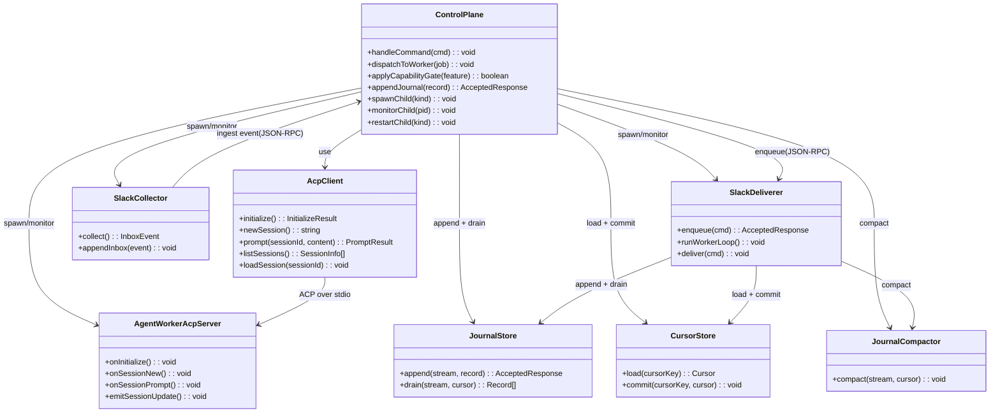
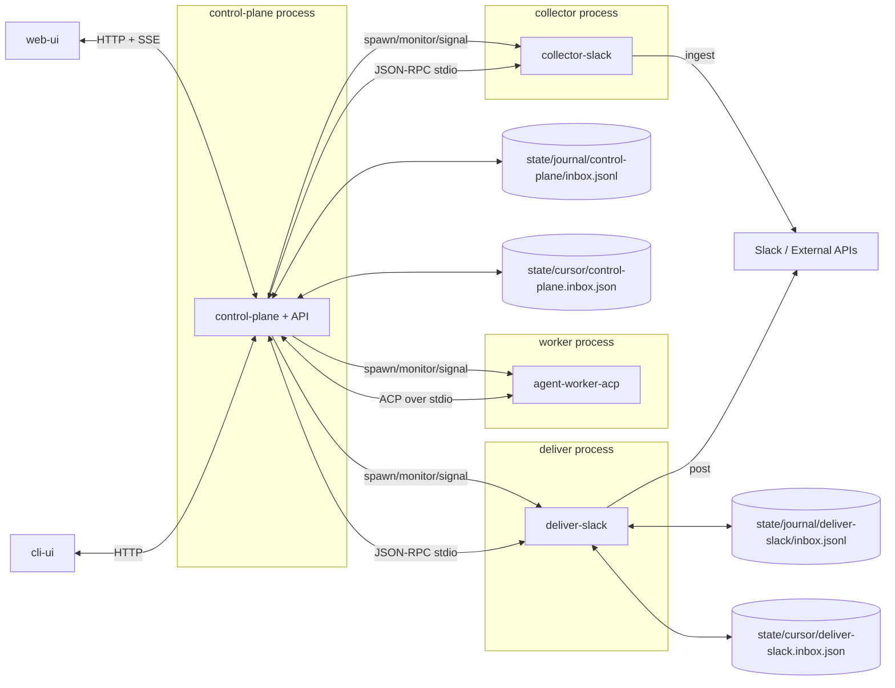
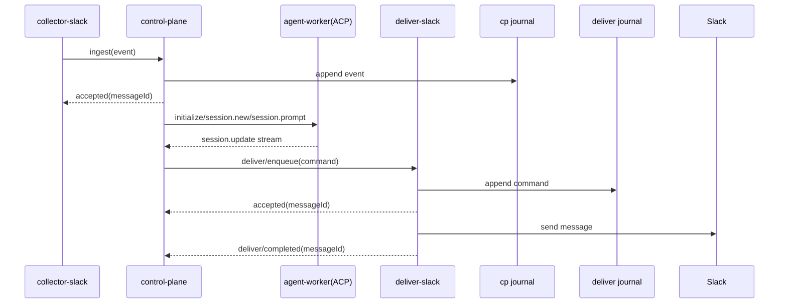

# 260228-s02: ACP準拠 agent-worker 分離 v1

## 0. Core Principles

- Prototype First  
  後方互換よりも新実装の構造最適化を優先し、既存実装は参考実装として扱う。破壊的変更は許容し、移行は `start` 系エントリで段階導入する。
- SOLID  
  `control-plane`（制御）、`agent-worker`（推論）、`collector/deliver`（入出力）を分離し、境界契約は ACP / Process RPC / journal の3層に固定する。
- KISS  
  プロセス管理を `control-plane` 親子構成に一本化し、通信は stdio JSON-RPC を基本に統一する。余分な中継層は置かない。
- YAGNI  
  v1 では FS capability（`fs/read_text_file`, `fs/write_text_file`）と terminal gateway、pre-compaction memory flush は非スコープとし、必要性が確定した時点で別計画に分離する。
- DRY  
  スキーマ定義を `src/contracts/*` に集約し、ACP と Process RPC の型・バリデータ・エラーコードの重複実装を避ける。

## 1. 概要と目的 Overview and Purpose

- What  
  AIエージェント実行部を `agent-worker` として本体から分離し、`control-plane` とは ACP（Agent Client Protocol）で接続する新アーキテクチャを導入する。初期対象は Slack 縦切り（入力: collector-slack、出力: deliver-slack）と WebUI/CLI 接続の最小導線に限定する。
- Why  
  現状の統合実装では責務が集中し、差し替え性、障害分離、将来の複数エージェント並列運用に制約がある。ACP境界を導入することで、`agent-worker` を交換可能にしつつ、制御責務を `control-plane` に集約できる。
- How  
  `control-plane` を親プロセスとして `collector`/`agent-worker`/`deliver` を子プロセス起動し、以下で接続する。
  1. `control-plane <-> agent-worker`: ACP over stdio（JSON-RPC）
  2. `control-plane <-> collector/deliver`: stdio JSON-RPC（受信側でJSONL永続化して `accepted` 応答）
  3. `control-plane <-> child`: OSプロセス管理（spawn/exit/signal）
  4. 各プロセスは受信メッセージを処理前に `inbound journal(JSONL)` へ追記し、処理結果は非同期 `completed/failed` 通知で返す
  5. 本計画は `journal/cursor/compaction` 基盤を **s02内で自己完結実装** し、s01 別計画を前提にしない
  6. `doc/spec-vnext-draft.md` との関係は、s02の実装契約を優先（必要箇所は s02完了時に spec を更新して整合させる）

## 2. 仕様と受け入れ条件 Specification and Acceptance Criteria

### 2.1 スコープ Scope

- 今回やること
  - `src/` を新設し、既存実装と分離して新規実装を進める
  - `control-plane + API` 実装（ジョブ制御、UI向けAPI、ACPクライアント、子プロセス管理）
  - `agent-worker-acp` 実装（ACPサーバの最小機能）
  - Slack 縦切り（`collector-slack` -> `control-plane ingest` -> `deliver-slack`）
  - `accepted/completed` 分離契約の導入（受信即ACK、処理は非同期）
  - 各プロセス `inbound journal(JSONL)` + cursor + compaction の実装
  - ACP capability 分岐（`session/list`/`session/load`/`session/resume` の対応可否判定）
  - 契約テスト/統合テストの追加
- 成果物
  - 新規: `src/control-plane/*`, `src/agent-worker-acp/*`
  - 新規: `src/collector/slack/*`, `src/deliver/slack/*`, `src/contracts/*`
  - 新規: `tests/unit/*`, `tests/integration/*`, `tests/contract/*`
  - 更新: `package.json`（新実装起動コマンド）, 関連ドキュメント
- 制約
  - Prototype First に従い後方互換は考慮しない
  - 旧実装は参考用として残し、新実装とは混在させない
  - ACPは stable 領域を優先し、draft/unstableは capability で隔離する
  - v1では単一ホストのローカルプロセス実行を前提とする

### 2.2 非スコープ Non Scope

- 今回やらないこと
  - 旧実装との完全互換レイヤ
  - GitHub/Jira collector/deliver の実装
  - 分散キュー（Kafka/NATS）移行
  - exactly-once 配信保証
  - ACP Client の FS capability（`fs/read_text_file`, `fs/write_text_file`）実装
  - ACP terminal gateway（`terminal/create|output|wait_for_exit|kill|release`）実装
  - pre-compaction memory flush（`memory_write` 先行実行制御）
  - agent->agent 再帰起動（子に `spawn_agent` 相当を配布しない）
- 将来検討だが今回除外すること
  - マルチホスト実行とリモートワーカー
  - DLQ 再投入UI
  - 高度なコスト最適化・スケジューラ

### 2.3 ユースケース Use Cases

1. 正常系: Slackメッセージ受信から応答送信まで  
   `collector-slack` が `control-plane` にイベント送信し、`control-plane` は受信を journal へ追記して `accepted` を返す。非同期処理で ACP実行後に `deliver-slack` へ送信要求し、`deliver-slack` は受信を journal へ追記して `accepted` を返し、別ワーカーでSlackへ送信して `completed` を返す。
2. 正常系: 新規セッション作成  
   `control-plane` が `initialize` 後に `session/new` を発行し、セッションIDを取得して対話を開始する。
3. 正常系: セッション一覧/再開（対応時のみ）  
   worker capability が有効なら `session/list` / `session/load`（または `session/resume`）を呼び出す。
4. 異常系: プロセス再起動時の再開  
   `control-plane` と `deliver-slack` は journal + cursor から未処理レコードを再開し処理継続する。
5. 異常系: worker 異常終了  
   `control-plane` が異常を検知して worker を再起動し、未完了ジョブを再スケジュールする。
6. 異常系: ACP未対応機能呼び出し  
   capability 不在時は呼び出しを行わず、`UNSUPPORTED_CAPABILITY` を返却しフォールバック動作に切り替える。

### 2.4 受け入れ条件 Acceptance Criteria

1. Given `control-plane` が worker に接続する  
   When `initialize` を送信する  
   Then protocol version と capability を受理し、内部セッションに反映できる

2. Given `control-plane` が新規ジョブを処理する  
   When `session/new` と `session/prompt` を実行する  
   Then `session/update` を受信して `deliver/enqueue` 要求を生成できる

3. Given worker が `sessionCapabilities.list` を返さない  
   When `control-plane` が一覧要求を受ける  
   Then `session/list` は呼ばず `UNSUPPORTED_CAPABILITY` を返す

4. Given `control-plane` が `deliver-slack` へ送信要求する  
   When `deliver-slack` が要求を受信する  
   Then 処理前に journal へ追記し `accepted` を同期応答し、`completed` 重複通知を冪等処理できる

5. Given `agent-worker` が異常終了する  
   When `control-plane` が子プロセスを監視している  
   Then 規定回数で再起動し、失敗理由を構造化ログへ記録する

6. Given プロセスを再起動する  
   When journal に未処理レコードが残っている  
   Then 各プロセスは自プロセス所有 cursor のみを使って再開し、未完了レコードのみを再処理する

7. Given 統合起動コマンドを実行する  
   When Slackイベントを1件投入する  
   Then accepted応答と最終completed通知が観測できる

### 2.5 既知の制約 Known Limitations

- ACP仕様の一部（`session/list`/`session/resume`）は変動可能性があり、実装依存が残る
- end-to-end は at-least-once 前提とし、`completed` 通知重複を含む再配送は `dedupeKey` で吸収する
- 永続化の耐久保証（fsync戦略、保持期間最適化）はv1で簡易実装
- 初期は single-node 実行のみを想定し、分散協調は対象外

## 3. 前提技術スタック Context and Tech Stack

- Language Framework  
  TypeScript 5.x, Node.js 20+, ESM
- Libraries  
  Node標準 `child_process`, `fs`, `stream`; 既存依存（`openai`, `chrome-remote-interface`）を必要箇所で継続利用
- Style Guide  
  既存 ESLint/Prettier 設定に準拠（`pnpm run lint`, `pnpm run format`）
- Runtime Deployment  
  ローカル単一ホスト、`control-plane` 親子プロセス構成
- Testing  
  既存 test runner（Node test）で unit/integration/contract を追加

## 4. インターフェース契約 Interface Contracts

### 4.1 公開APIまたは外部I O一覧

- HTTP API（control-plane）
  - `POST /api/commands`
  - `GET /api/snapshot`
  - `GET /api/events/stream`（SSE）
- ACP（control-plane <-> agent-worker）
  - Baseline（stable）: `initialize`, `session/new`, `session/prompt`, `session/cancel`（notification）, `session/update`（notification）
  - Optional（stable）: `authenticate`, `session/load`（`agentCapabilities.loadSession=true` 時のみ）, `session/set_mode`, `session/set_config_option`
  - Optional（unstable）: `session/list`, `session/resume`, `session/fork`, `session/set_model`（`schema.unstable.json` を feature flag で明示的に有効化した場合のみ）
- Process RPC（control-plane <-> collector/deliver）
  - `collector/ingest`（request/response: `accepted`）
  - `deliver/enqueue`（request/response: `accepted`）
  - `deliver/completed`（notification, at-least-once）
- CLI
  - `adjutant-control-plane`
  - `adjutant-agent-worker-acp`
  - `adjutant-collector-slack`
  - `adjutant-deliver-slack`
- 設定ファイル
  - `config/*.json`（journal path, retry, timeout, process limits）
- 永続化ストレージ
  - `state/journal/control-plane/inbox.jsonl`
  - `state/journal/deliver-slack/inbox.jsonl`
  - `state/journal/dlq/*.jsonl`
  - `state/cursor/control-plane.inbox.json`
  - `state/cursor/deliver-slack.inbox.json`
- 外部サービス連携
  - Slack CDP（入力）
  - Slack webhook または Web API（出力）

### 4.2 データモデルとスキーマ

- `InboxEvent`
  - `id`, `source`, `kind`, `occurredAt`, `loggedAt`, `dedupeKey`, `payload`
- `OutboxCommand`
  - `id`, `target`, `action`, `args`, `dedupeKey`, `attempt`, `maxAttempts`, `notBefore`
- `Cursor`
  - `segment`, `offset`
- `CursorOwnershipRule`
  - `control-plane` は `state/cursor/control-plane.*` のみを読む/書く
  - `deliver-slack` は `state/cursor/deliver-slack.*` のみを読む/書く
  - `control-plane` が `deliver-slack` の cursor を直接参照しない
  - 各プロセスは自プロセス所有 inbox の cursor だけを commit する
  - cursor commit は「非同期処理の最終状態（`completed|failed`）を自プロセス内で確定」した後に行い、`accepted` 時点では進めない
- `DedupeKeyRule`
  - `collector` 入力は source 固有 ID（例: Slack event ts/thread_ts + channel）から決定論的に生成する
  - `deliver` 完了通知は `messageId` を主キーに冪等更新し、重複通知を許容する
  - 同一 `messageId` で `completed` と `failed` が競合した場合は `completed` を最終状態として優先し、`completed` 到達後の `failed` は監査ログのみ記録して状態遷移に反映しない
- `AcceptedResponse`
  - `messageId`, `status: "accepted"`, `acceptedAt`
- `CompletionEvent`
  - `messageId`, `status: "completed" | "failed"`, `finishedAt`, `error?`
- `CollectorIngestRequest`
  - `messageId`, `dedupeKey`, `source`, `payload`, `occurredAt`
- `CollectorIngestResponse`
  - `messageId`, `status: "accepted"`, `acceptedAt`
- `DeliverEnqueueRequest`
  - `messageId`, `dedupeKey`, `target`, `payload`, `attempt`, `maxAttempts`, `notBefore?`
- `DeliverEnqueueResponse`
  - `messageId`, `status: "accepted"`, `acceptedAt`
- `DeliverCompletedNotification`
  - `messageId`, `status: "completed" | "failed"`, `finishedAt`, `error?`
- `WorkerRuntimeError`
  - `code`, `message`, `retryable`, `traceId`, `details`
- `ToolExecutionProjection`
  - `runId`, `sessionId`, `toolCallId`, `toolName`, `status`, `kind`, `rawInput?`, `rawOutput?`, `content?`, `startedAt?`, `endedAt?`, `durationMs?`
- バリデーション方針
  - 境界I/Oで runtime validation 実施
  - 不正レコードは `INVALID_RECORD` としてスキップし警告ログへ記録

### 4.3 エラーと例外 Error Handling

- エラー分類
  - `UNSUPPORTED_CAPABILITY`
  - `ACP_PROTOCOL_ERROR`
  - `JOURNAL_APPEND_FAILED`
  - `WORKER_TIMEOUT`
  - `WORKER_CRASHED`
  - `DOWNSTREAM_ERROR`
  - `INVALID_RECORD`
- リトライ方針
  - worker起動失敗は指数バックオフで再試行（上限あり）
  - deliver失敗は `attempt/notBefore/maxAttempts` で再試行、超過はDLQ
  - capability不在はリトライせず即時失敗
- タイムアウト方針
  - ACP request timeout をメソッド単位で設定
  - 子プロセス応答監視 timeout を設定
- ログ方針と個人情報の扱い
  - 構造化ログ（JSON）で `traceId`, `sessionId`, `jobId` を出力
  - payload全文は記録せず、識別子中心で最小化

### 4.4 代表的な例 Examples

1. control-plane 起動例

```bash
pnpm run start
```

2. ACP capability 不在時のレスポンス例（`session/list` 要求）

```json
{
  "ok": false,
  "error": {
    "code": "UNSUPPORTED_CAPABILITY",
    "message": "session/list is not supported by current worker"
  }
}
```

3. `deliver-slack` 受信時の同期応答と非同期完了通知例

```json
{
  "request": { "method": "deliver/enqueue", "params": { "messageId": "msg_01", "payload": {} } },
  "response": {
    "result": {
      "messageId": "msg_01",
      "status": "accepted",
      "acceptedAt": "2026-02-28T12:00:00.000Z"
    }
  },
  "async_event": {
    "method": "deliver/completed",
    "params": {
      "messageId": "msg_01",
      "status": "completed",
      "finishedAt": "2026-02-28T12:00:02.000Z"
    }
  }
}
```

4. ACP ツール実行通知例（`session/update`）

```json
{
  "tool_start": {
    "method": "session/update",
    "params": {
      "sessionId": "sess_abc123",
      "update": {
        "sessionUpdate": "tool_call",
        "toolCallId": "call_001",
        "title": "Run tests",
        "kind": "execute",
        "status": "pending",
        "rawInput": { "command": "pnpm", "args": ["run", "test"] }
      }
    }
  },
  "tool_end": {
    "method": "session/update",
    "params": {
      "sessionId": "sess_abc123",
      "update": {
        "sessionUpdate": "tool_call_update",
        "toolCallId": "call_001",
        "status": "completed",
        "rawOutput": { "exitCode": 0 },
        "content": [
          { "type": "content", "content": { "type": "text", "text": "all tests passed" } }
        ]
      }
    }
  }
}
```

## 5. アーキテクチャと設計図 Architecture and Diagrams

### 5.1 図の選択方針

- 複数プロセス・複数境界（ACP/JSON-RPC/Journal/OSプロセス管理）を扱うためクラス図を必須とする
- 同期 `accepted` と非同期 `completed` の流れを示すためシーケンス図を追加する

### 5.2 クラス図 Class Diagram



### 5.3 プロセス接続連携図 Process Connectivity Diagram



### 5.4 その他の図 Optional



## 6. テスト戦略 Test Strategy

### 6.1 テストの種類

- Unit
  - ACP capability 判定ロジック
  - journal append/drain/cursor commit
  - retry/backoff と error mapping
- Integration
  - control-plane 配下で `collector -> worker -> deliver` を起動
  - `accepted` 即時応答と `completed` 非同期通知を検証
  - journal + cursor からの再開を検証
  - `completed` 重複通知時の冪等処理を検証
  - worker異常終了時の再起動を検証
- Contract
  - ACP handshake 契約（`initialize` request/response と protocolVersion negotiation）
  - `session/new` / `session/load` / `session/prompt` の契約
  - `session/cancel` / `session/update`（notification）の順序と終端契約
  - `tool_call` / `tool_call_update` の payload 契約（`toolCallId`, `status`, `rawInput`, `rawOutput`, `content`）
  - vendor schema 準拠検証（`vendor/agent-client-protocol/schema/schema.json`）
  - `UNSUPPORTED_CAPABILITY` 返却契約

### 6.2 カバレッジ対象

- 重要ロジック
  - capability gating
  - job dispatch と session lifecycle
  - journal append と cursor 一貫性
- エラー分岐
  - timeout/crash/protocol error
  - invalid record
  - downstream failure -> retry -> DLQ
- 境界条件
  - 空キュー
  - 重複イベント
  - process restart 復旧

## 7. 実装タスクリスト Implementation Plan

### Phase 1 基盤契約固定（journal + Process RPC + ACP）

- [x] JRN-001 `JournalStore.append` / `JournalStore.drain` を実装（追記専用JSONL + cursor読み）  
       成果物: `src/runtime/journal-store.ts`, `tests/unit/journal-store.test.ts`
- [x] JRN-002 `CursorStore.commit` を原子的更新で実装（temp file -> rename）  
       成果物: `src/runtime/cursor-store.ts`, `tests/unit/cursor-store.test.ts`
- [x] JRN-003 `JournalCompactor.compact` を実装（所有プロセスcursor到達済みセグメントのみ対象）  
       成果物: `src/runtime/journal-compactor.ts`, `tests/integration/journal-compaction.test.ts`
- [x] PRC-001 Process RPC（`collector/ingest`, `deliver/enqueue`, `deliver/completed`）の型を定義  
       成果物: `src/contracts/process-rpc/rpc-types.ts`, `src/contracts/process-rpc/method-types.ts`
- [x] PRC-002 Process RPC の契約バリデータを追加  
       成果物: `tests/contract/process-rpc/process-rpc-validation.test.ts`

- [x] ACP-001 `schema.json` の対象バージョンを固定し、実装側に参照点を作成  
       成果物: `src/contracts/acp/schema-version.ts`, `tests/contract/acp/schema-version.test.ts`
- [x] ACP-002 JSON-RPC envelope と ACP メソッド型を定義  
       成果物: `src/contracts/acp/rpc-types.ts`, `src/contracts/acp/method-types.ts`
- [x] ACP-003 stable/unstable capability マトリクスを定義（feature flag込み）  
       成果物: `src/control-plane/acp/capability-matrix.ts`
- [x] ACP-004 `sessionId <-> sessionKey <-> runId` の対応規約を定義  
       成果物: `src/control-plane/acp/session-registry.ts`, `doc/spec-vnext-draft.md` 更新
- [x] ACP-005 vendor schema による contract validator を追加  
       成果物: `tests/contract/acp/schema-validation.test.ts`

### Phase 2 Agent 側ACP実装（現行 agent-runner の適合）

- [x] ACP-101 `initialize` を実装（version negotiation と capability 返却）  
       成果物: `src/agent-worker-acp/handlers/initialize.ts`
- [x] ACP-102 `authenticate` を実装（v1は no-auth 返却、将来拡張点を残す）  
       成果物: `src/agent-worker-acp/handlers/authenticate.ts`
- [x] ACP-103 `session/new` / `session/load` を実装（`loadSession` capability gate）  
       成果物: `src/agent-worker-acp/handlers/session-new.ts`, `src/agent-worker-acp/handlers/session-load.ts`
- [x] ACP-104 `session/prompt` を現行 `src/assistant/agent-runner.ts` に接続する adapter を実装  
       実装詳細: `AgentRunOptions.callbacks`（`onTextDelta`, `onToolCall`, `onTerminalRecord`）を ACP `session/update` に変換し、`SessionManager` の既存 session を ACP `sessionId` と `session-registry` で対応付ける。`onTerminalRecord` は terminal gateway 実装を意味せず、既存 runner が生成した terminal レコードの受信/表示イベント変換のみを対象とする。  
       成果物: `src/agent-worker-acp/adapters/agent-runner-adapter.ts`, `src/agent-worker-acp/adapters/session-bridge.ts`
- [x] ACP-105 `session/cancel` notification で run abort を反映  
       成果物: `src/agent-worker-acp/handlers/session-cancel.ts`
- [x] ACP-106 `session/update` projector を実装（`agent_message_chunk` / `tool_call` / `tool_call_update` / `plan` / `current_mode_update`）  
       成果物: `src/agent-worker-acp/session-update-projector.ts`
- [x] ACP-107 `session/prompt` response の `stopReason` 正規化を実装（`end_turn` / `cancelled` / `max_tokens` / `max_turn_requests` / `refusal`）  
       成果物: `src/agent-worker-acp/stop-reason.ts`
- [x] ACP-108 現行 `tool_execution_start/end` を ACP `tool_call` / `tool_call_update` に正規化する mapper を実装  
       補足: 番号順に合わせて ACP-107 の後に実装する。  
       成果物: `src/agent-worker-acp/tool-call-mapper.ts`

### Phase 3 Client capability 実装（Agent->Client 呼び出し境界）

- [ ] ACP-201 `session/request_permission` を control-plane API/UI に接続  
       成果物: `src/control-plane/acp/permission-gateway.ts`, `src/ui/*` 必要箇所更新
- [ ] ACP-205 cancel 時に pending permission を `cancelled` outcome で解決する  
       成果物: `src/control-plane/acp/permission-registry.ts`
- [ ] ACP-206 ACPツール更新イベントを UI ストリームへ橋渡しし、`runId` 単位で集約表示できるようにする  
       補足: 受け入れ条件には追加せず、`tests/integration/acp-tool-event-stream.test.ts` で UI 橋渡し整合を担保する。  
       成果物: `src/control-plane/acp/tool-event-bridge.ts`, `src/ui/runtime.ts`, `src/ui/components/AuditDetailTab.tsx`
- [ ] ACP-207 FS capability（`fs/read_text_file`, `fs/write_text_file`）は v1 非スコープとして feature flag 無効を維持  
       成果物: `src/control-plane/acp/capability-matrix.ts`, `doc/spec-vnext-draft.md`

### Phase 4 統合・互換・運用

- [ ] ACP-301 unstable メソッド（`session/list` / `session/resume` / `session/fork` / `session/set_model`）を feature flag で隔離  
       成果物: `src/control-plane/acp/unstable.ts`, `tests/contract/acp/unstable-capability.test.ts`
- [ ] ACP-302 `control-plane <-> worker` の stdio 接続統合テストを追加  
       成果物: `tests/integration/acp-transport.test.ts`
- [ ] ACP-303 E2E（`collector/ingest -> accepted -> ACP実行 -> deliver/enqueue -> completed`）を追加  
       成果物: `tests/integration/slack-acp-e2e.test.ts`
- [ ] ACP-304 異常系（timeout/crash/protocol error）と再起動復旧のテストを追加  
       成果物: `tests/integration/acp-recovery.test.ts`
- [ ] ACP-306 `tool_call` / `tool_call_update` の順序・欠落・重複時の復元ロジック統合テストを追加  
       成果物: `tests/integration/acp-tool-event-stream.test.ts`
- [ ] ACP-308 `deliver/completed` の重複/順序揺れを許容する冪等更新テストを追加  
       成果物: `tests/integration/acp-deliver-completion-idempotency.test.ts`
- [ ] ACP-305 ドキュメント更新（実装プロファイル、サポートメソッド、非対応メソッド）  
       成果物: `doc/spec-vnext-draft.md`, `README.md`
- [x] OPS-401 最終品質ゲートとして `pnpm check` を実行し通過させる  
       成果物: `pnpm check` 実行ログ（format/typecheck/test 全通過）

## 8. 完了の定義 Definition of Done

### 8.1 機能DoD Functional DoD

- [ ] 受け入れ条件がすべて満たされていること
- [ ] 既知の制約が明文化され、想定通りであること
- [ ] 契約の例に対して期待通りの結果が得られること

### 8.2 品質DoD Quality DoD

- [ ] 全てのテストがパスしていること
- [ ] Linter Formatterのエラーがないこと
- [ ] 不要なデバッグコードが削除されていること
- [ ] 主要な変更点がドキュメントに反映されていること

## 9. 懸念事項と未確定事項 Concerns and Questions

- 技術的な懸念点
  - ACP仕様の draft 領域（`session/list`/`session/resume`）に追従コストがある
  - worker差し替え時に vendor固有拡張が漏れると交換可能性が下がる
  - journal運用の長期的な容量管理とGC閾値は別途最適化が必要
- 仕様が曖昧で決定が必要な事項
  - `session/load` と `session/resume` の優先順位（両対応時の選択ルール）
  - Slack deliver の標準経路（webhook固定か Web API併用か）
  - worker restart policy（最大回数、回復窓）の初期値
  - terminal gateway と pre-compaction memory flush を扱う後続計画の切り出し単位
- プロトタイプとして許容するリスク
  - at-least-once による重複可能性
  - 単一ホスト前提での可用性限界
  - 監査ログの粒度が初期は最小
- 将来的な拡張に伴うリスク
  - GitHub/Jira 追加時に source/sink ごとの認証方式差分が増える
  - 並列worker増加時にセッション割当と公平性制御が必要になる
