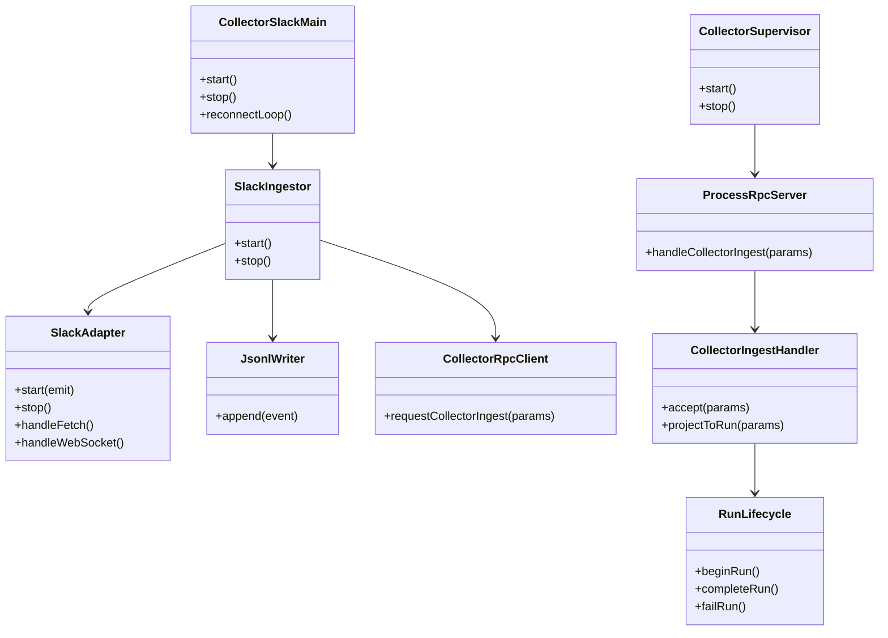
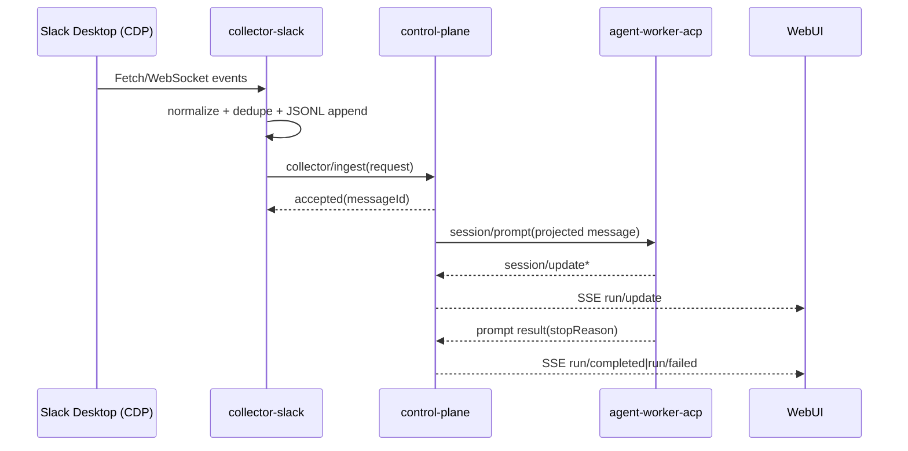

# 260301-s01: Phase C 実装計画（collector-slack 本移植）

## 0. Core Principles

- Prototype First: `collector-slack -> control-plane` の縦切り成立を最短で実現し、Phase D 以降で必要となる高度な復旧最適化は先送りする。
- SOLID: `collector-slack`（収集）と `control-plane`（受理・実行制御）の責務を分離し、境界は Process RPC 契約で固定する。
- KISS: v1 は Slack 収集イベントの取り込みと run 連携に限定し、配信経路の多重化や複雑なルーティングは導入しない。
- YAGNI: GitHub/git-local collector、DLQ UI、分散実行は今回対象外とする。
- DRY: `legacy/impl-20260228` の `SlackAdapter`/`SlackIngestor`/`JsonlWriter`/`DebugUiServer` を責務単位で移植し、重複実装を避ける。

## 1. 概要と目的 Overview and Purpose

- What
  - `collector-slack` 子プロセスを追加し、Slack CDP イベントを収集して `collector/ingest` で control-plane に送信する。
  - `control-plane` に Process RPC 受理経路（`collector/ingest`）を追加し、受理済みイベントを run 実行へ連携する。
  - legacy の Slack 収集機能（`SlackAdapter`、DOM capture、名称キャッシュ、JSONL 保存、Debug UI）を ACP 構成へ再配置する。
- Why
  - Phase A/B 完了後の主要ギャップは「Slack 起点の実データ取り込み」であり、これがないと実運用シナリオを再現できない。
  - collector を control-plane から分離することで、収集障害と AI 実行障害の分離・再起動耐性を高める。
- How
  - control-plane が `collector-slack` を spawn/monitor し、stdio JSON-RPC（Process RPC）で `collector/ingest` を受ける。
  - collector 側は CDP 接続、正規化、重複抑止、JSONL 追記を実行し、同時に Process RPC でイベント投入を行う。
  - control-plane 側は ingest 受理後に sessionKey を解決し、既存 run 実行導線（worker supervisor + run lifecycle）へ接続する。

## 2. 仕様と受け入れ条件 Specification and Acceptance Criteria

### 2.1 スコープ Scope

- 今回やること
  - 共通契約の先行確定
    - `NormalizedEvent` 共通型（`src/core/events.ts`）の移植
    - `sessionKey` 解決規則（channel/thread/dm/group）の確定
    - ingest payload から run prompt への投影テンプレートの確定
  - `collector-slack` プロセスの新規実装
    - CDP endpoint 解決（`CDP_ENDPOINT_FILE` -> `CDP_HOST/CDP_PORT` -> default）
    - Slack CDP 接続 (`connectToSlackPage`) と再接続（指数バックオフ + full jitter）
    - `SlackAdapter` 移植（Fetch/WebSocket/Response hook、UID 去重）
    - DOM capture 移植（reaction 補完）
    - Slack 名称キャッシュ移植（channel/user cache）
    - JSONL 追記保存（`events.jsonl`、checksum 付き）
    - Debug UI 移植（`ADJUTANT_DEBUG_UI=1` 時）
  - `collector-slack` -> `control-plane` Process RPC 連携
    - `collector/ingest` request/response（同期 `accepted`）
    - malformed envelope の reject とエラー整形
  - `control-plane` 側 ingest 受理経路
    - collector 子プロセス supervisor 追加
    - `collector/ingest` handler（受理、dedupe、journal append）
    - ingest payload から `sessionKey` / prompt を解決し、既存 run 実行導線へ接続
    - ingest 起点の SSE 可観測化（`run/accepted|run/update|run/completed|run/failed`）
  - `doc/spec/README.md` と運用ドキュメントの更新
- 成果物
  - 共通型/契約: `src/core/events.ts`, `src/contracts/process-rpc/*`
  - 実装: `src/collector-slack/*`, `src/control-plane/process-rpc/*`, `src/index.ts` ほか
  - テスト: unit/contract/integration（collector と process-rpc 境界を含む）
  - ドキュメント: `doc/spec/README.md`、`doc/spec/collector-runtime.md`、`doc/spec/data-model.md`、`doc/spec/acp-architecture.md`、`doc/spec/storage.md`、本計画、legacy 移植マッピング
- 制約
  - 単一ホスト・at-least-once 前提
  - `deliver-slack` 実送信は非スコープ（Phase D 以降）
  - `collector/ingest` の payload は `NormalizedEvent`（`source=slack`）を正とする
  - CDP 非可用時は fail-fast せず再接続ループで復帰を試みる

### 2.2 非スコープ Non Scope

- `deliver-slack` 子プロセスの本実装
- proactive / heartbeat の再導入
- GitHub / git-local collector
- 分散実行（Kafka/NATS）、マルチホスト
- DLQ 再投入 UI、運用ダッシュボード

### 2.3 ユースケース Use Cases

- 正常系1: Slack 投稿イベントの取り込み
  - collector が `chat.postMessage` を正規化し JSONL 追記、`collector/ingest` を送信する
  - control-plane が `accepted` を返し run を開始する
- 正常系2: reaction イベントで DOM 補完が成功
  - DOM から本文/チャンネル情報を補完したイベントが保存・投入される
- 正常系3: WebSocket 通知イベントの取り込み
  - notification 系イベントが正規化され、run 連携まで到達する
- 異常系1: CDP 接続断
  - collector が再接続を試行し、復帰後に取り込みを再開する
- 異常系2: 不正な ingest payload
  - control-plane が `INVALID_REQUEST` として reject し、プロセス全体は継続する
- 異常系3: collector 重複送信
  - dedupeKey により重複実行を抑止し、run 重複起動を防ぐ

### 2.4 受け入れ条件 Acceptance Criteria

1. Given `collector-slack` と `control-plane` が起動済み  
   When Slack で `chat.postMessage` が発火する  
   Then collector は JSONL へ追記し、`collector/ingest` が `accepted` 応答を受ける
2. Given `collector/ingest` が受理されたイベント  
   When control-plane が run 生成処理を行う  
   Then `run/accepted` -> `run/update` -> `run/completed|run/failed` が SSE で観測できる
3. Given reaction イベントで DOM から本文補完可能  
   When collector がイベント正規化を行う  
   Then `detail.slack.message_text` が補完されたイベントが保存される
4. Given CDP 接続が切断される  
   When collector が再接続ループに入る  
   Then full jitter バックオフで再接続を継続し、プロセスが異常終了しない
5. Given malformed な `collector/ingest` envelope  
   When control-plane が Process RPC handler で検証する  
   Then `INVALID_REQUEST` を返し、他リクエスト処理は継続する
6. Given 同一 `dedupeKey` のイベントが再送される  
   When control-plane が ingest を受理する  
   Then run は重複生成されず、初回受理時の canonical `messageId` を `accepted` 応答として返す
7. Given 同一 `dedupeKey` だが payload が異なる再送  
   When control-plane が ingest を受理する  
   Then `INVALID_REQUEST` を返し、既存 run の状態を変更しない
8. Given `ADJUTANT_DEBUG_UI=1`  
   When collector が raw/normalized イベントを処理する  
   Then Debug UI の `/events` SSE で `debug` イベントが継続配信される

### 2.5 既知の制約 Known Limitations

- Slack Desktop / CDP の仕様変更により parser が破綻するリスクがある。
- DOM capture は可視 DOM 依存のため、常に本文補完できるわけではない。
- at-least-once 前提のため、最終的な重複吸収は dedupe と終端冪等更新に依存する。

## 3. 前提技術スタック Context and Tech Stack

- Language Framework
  - TypeScript (ESM), Node.js
- Libraries
  - `chrome-remote-interface`
  - `@mariozechner/pi-coding-agent`（run 実行側は既存 worker を利用）
- Style Guide
  - ESLint + Prettier 既存設定準拠
- Runtime Deployment
  - `src/index.ts` が親プロセスとして `collector-slack` / `agent-worker-acp` を監視
  - Process RPC と ACP はともに stdio JSON-RPC
- Testing
  - Node.js built-in test runner (`node --test` via `tsx`)
  - Unit / Contract / Integration を `tests/` で管理

## 4. インターフェース契約 Interface Contracts

### 4.1 公開APIまたは外部I O一覧

- Process RPC (`collector-slack` <-> `control-plane`)
  - request/response: `collector/ingest`
  - 型定義: `src/contracts/process-rpc/*`（既存を正とする）
  - サーバー実装: `src/control-plane/process-rpc/*`（新規）
- HTTP/SSE (`control-plane`)
  - `GET /api/snapshot`
  - `GET /api/events/stream`
  - `POST /api/commands`（既存、ingest 連携で内部利用）
- 設定（collector 関連）
  - `CDP_ENDPOINT_FILE`, `CDP_HOST`, `CDP_PORT`
  - `ADJUTANT_DATA_DIR`（任意。未指定時は既定の state 配下）
  - `ADJUTANT_SLACK_ACCOUNT_ID`（任意。未指定時は `default`）
  - `ADJUTANT_DISABLE_DOM_CAPTURE`
  - `ADJUTANT_DEBUG_UI`, `ADJUTANT_DEBUG_UI_PORT`
  - `ADJUTANT_CDP_EVENT_LOG*`, `ADJUTANT_RAW_FETCH_LOG*`
- 永続化
  - `<dataDir>/accounts/<accountId>/YYYY/MM/DD/slack/events.jsonl`
  - `<dataDir>/accounts/<accountId>/_cache/slack/*.json`
  - `<stateDir>/journal/control-plane/inbox.jsonl`（spec 14.3 準拠、単一 inbox）
  - `<stateDir>/cursor/control-plane.inbox.json`（spec 14.3 準拠、単一 cursor）

### 4.2 データモデルとスキーマ

- `CollectorIngestRequest`（Process RPC）
  - `{ messageId, dedupeKey, source, payload, occurredAt }`
  - `source` は `slack` 固定
  - `payload` は `NormalizedEvent`（`schema=adjutant.event.v1.1`）
- `NormalizedEvent`（payload）
  - `uid`, `source`, `kind`, `ts`, `detail.slack`, `meta.account_id` など
  - Slack detail の本文フィールド契約は `doc/spec/data-model.md` を正とし、`post` は `detail.slack.text`、`reaction|notification` は `detail.slack.message_text` を使用する
- `CollectorIngestResponse`
  - `{ messageId, status: "accepted", acceptedAt }`
- `IngestProjection`（control-plane internal）
  - `{ sessionKey, message, dedupeKey, source, occurredAt, rawEvent }`
- `sessionKey` 解決契約（Phase C で確定）
  - channel post: `slack:channel:<channelId>`
  - thread post/reaction: `slack:channel:<channelId>:thread:<threadTs>`
  - group: `slack:group:<channelId>`
  - dm/im: `slack:<channelId>`
- prompt 投影契約（Phase C の最小実装）
  - post: `[Slack post] channel=<channelId> text=<text>`
  - reaction: `[Slack reaction] channel=<channelId> emoji=<emoji> message=<message_text>`
  - notification: `[Slack notification] type=<notification_type> channel=<channelId> message=<message_text>`
- ingest idempotency 契約
  - 同一 `dedupeKey` の初回受理時に canonical `messageId` を確定する
  - 同一 `dedupeKey` かつ同一 payload hash の再送は、canonical `messageId` を返して冪等受理する
  - 同一 `dedupeKey` かつ payload hash 不一致は `INVALID_REQUEST` として reject する
- バリデーション方針
  - 境界では `validateProcessRpcRequest` と `source/payload` の追加検証を必須化
  - 不正 payload は `INVALID_REQUEST` として reject し `INVALID_RECORD` をログ記録

### 4.3 エラーと例外 Error Handling

- エラー分類
  - `INVALID_REQUEST`, `INVALID_RECORD`, `ACP_PROTOCOL_ERROR`, `JOURNAL_APPEND_FAILED`, `WORKER_TIMEOUT`, `WORKER_CRASHED`, `DOWNSTREAM_ERROR`
- リトライ方針
  - CDP 再接続は指数バックオフ + full jitter
  - `collector/ingest` は at-least-once を前提に再送可能（dedupeKey で吸収）
- タイムアウト方針
  - Process RPC request timeout を設定（collector 側）
  - worker prompt timeout は既存設定を利用
- ログ方針と個人情報
  - 構造化ログに `messageId`, `dedupeKey`, `sessionKey`, `runId` を必須出力
  - Debug UI/ログに全文 payload を出す場合は開発環境限定フラグで制御する

### 4.4 代表的な例 Examples

```json
{
  "jsonrpc": "2.0",
  "id": "ing_001",
  "method": "collector/ingest",
  "params": {
    "messageId": "msg_slack_C123_1730000000_123",
    "dedupeKey": "slack:C123@1730000000.123",
    "source": "slack",
    "occurredAt": "2026-03-01T10:00:00.000Z",
    "payload": {
      "schema": "adjutant.event.v1.1",
      "uid": "slack:C123@1730000000.123",
      "source": "slack",
      "kind": "post",
      "ts": "2026-03-01T10:00:00.000Z",
      "detail": {
        "slack": {
          "channel_id": "C123",
          "message_ts": "1730000000.123",
          "text": "hello"
        }
      }
    }
  }
}
```

```json
{
  "jsonrpc": "2.0",
  "id": "ing_002",
  "method": "collector/ingest",
  "params": {
    "messageId": "msg_slack_C123_reaction_1730000001_000",
    "dedupeKey": "slack:C123@1730000000.123:thumbsup:added:U123",
    "source": "slack",
    "occurredAt": "2026-03-01T10:00:01.000Z",
    "payload": {
      "schema": "adjutant.event.v1.1",
      "uid": "slack:C123@1730000000.123:thumbsup:added:U123",
      "source": "slack",
      "kind": "reaction",
      "ts": "2026-03-01T10:00:01.000Z",
      "detail": {
        "slack": {
          "channel_id": "C123",
          "thread_ts": "1730000000.123",
          "message_ts": "1730000000.123",
          "emoji": "thumbsup",
          "message_text": "hello"
        }
      }
    }
  }
}
```

```json
{
  "jsonrpc": "2.0",
  "id": "ing_001",
  "result": {
    "messageId": "msg_slack_C123_1730000000_123",
    "status": "accepted",
    "acceptedAt": "2026-03-01T10:00:00.120Z"
  }
}
```

```text
sessionKey: slack:channel:C123
projected message: [Slack post] channel=C123 text=hello
```

```text
thread event sessionKey: slack:channel:C123:thread:1730000000.123
```

```text
reaction payload contract: detail.slack.message_text
```

### 4.5 詳細仕様準拠ルール

- 準拠元
  - `doc/spec/system-overview.md` のシステム構成図
  - `doc/spec/acp-architecture.md` の境界契約
  - `doc/spec/storage.md` の journal / cursor / 冪等規約
- 命名規約
  - control-plane の journal/cursor は単一 inbox（`inbox.jsonl`, `control-plane.inbox.json`）を維持する
  - collector 導入に伴う inbox 運用（source=slack の取り扱い）は `doc/spec/storage.md` に追記して固定する
- cursor commit 規約
  - `accepted` 時点では cursor を進めない
  - `completed|failed` の terminal 確定後にのみ cursor commit する
- 検証方針
  - Process RPC contract test で `collector/ingest` envelope と応答契約を固定
  - ingest 受理後の run 連携は integration test で `accepted -> completed|failed` を検証

### 4.6 運用監視契約 Backlog Monitoring

- backlog 指標
  - `ingest_backlog_count`: journal に受理済みで terminal 未確定の件数
  - `oldest_ingest_age_seconds`: 最古の未確定 ingest の経過秒
- しきい値（初期値）
  - warning: `ingest_backlog_count >= 100` または `oldest_ingest_age_seconds >= 60`
  - critical: `ingest_backlog_count >= 500` または `oldest_ingest_age_seconds >= 300`
- アラート運用
  - warning 連続 5 分で通知
  - critical は即時通知
  - 解除は warning 条件未満へ復帰後 10 分継続
- Runbook
  - 監視・切り分け・復旧手順は `doc/runbook/collector-backlog-monitoring.md` を正とする

## 5. アーキテクチャと設計図 Architecture and Diagrams

### 5.1 図の選択方針

- 複数プロセス（collector/control-plane/worker）を跨ぐため、クラス図を必須とする。
- 非同期通信（CDP、Process RPC、ACP、SSE）が主要なためシーケンス図を追加する。

### 5.2 クラス図 Class Diagram



### 5.3 その他の図 Optional



## 6. テスト戦略 Test Strategy

### 6.1 テストの種類

- Unit
  - CDP endpoint 解決、再接続バックオフ、Slack event 正規化、sessionKey 解決、ingest projection
  - 名称キャッシュの load/persist、JSONL writer の補完・retry
- Integration
  - collector プロセス起動 -> mock control-plane Process RPC server 連携
  - control-plane + worker + collector の縦切り（Slack event 模擬入力 -> run 完了）
  - CDP 切断復帰シナリオ
- Contract
  - `collector/ingest` envelope の request/response 妥当性
  - `NormalizedEvent` payload の必須キー検証

### 6.2 カバレッジ対象

- 重要ロジック
  - dedupeKey による重複吸収
  - ingest -> run 投影ロジック
  - JSONL 保存パス解決（account/date/source）
- エラー分岐
  - malformed payload
  - CDP 接続失敗 / 切断
  - Process RPC timeout
- 境界条件
  - 空 text、thread event、channelId 欠損、巨大 payload

## 7. 実装タスクリスト Implementation Plan

### Stage 1 設計と準備

- [x] `Task-C-000` legacy 移植マッピング作成（`doc/plan/artifacts/260301-s01-legacy-mapping-phase-c.md`）
- [x] `Task-C-001` Process RPC 契約確定（`collector/ingest` payload を `NormalizedEvent` に固定）
- [x] `Task-C-002` `doc/spec/data-model.md` / `doc/spec/collector-runtime.md` / `doc/spec/acp-architecture.md` / `doc/spec/storage.md` と Phase C 計画の整合チェック（`text`/`message_text` 契約、collector ingest 運用、inbox/cursor 命名を反映）
- [x] `Task-C-003` テスト雛形追加（`tests/unit/collector-slack`, `tests/integration/collector-slack`, `tests/contract/process-rpc`）
- [x] `Task-C-004` collector 環境変数/起動設定の整理（dev/serve スクリプト含む）
- [x] `Task-C-005` `NormalizedEvent` 共通型を legacy から移植（`src/core/events.ts`）
- [x] `Task-C-006` `sessionKey` 解決規則を確定し contract test を追加（channel/thread/dm/group）
- [x] `Task-C-007` ingest payload から run prompt への投影テンプレートを確定し test fixture を固定

### Stage 2 機能Aの実装（collector-slack 本体）

- [x] `Task-CA-RED-001` Test: CDP endpoint 解決優先順位の失敗テスト作成
- [x] `Task-CA-RED-002` Test: Fetch/WebSocket/Response の正規化 + UID 去重の失敗テスト作成
- [x] `Task-CA-RED-003` Test: DOM capture 補完（成功/失敗）の失敗テスト作成
- [x] `Task-CA-RED-004` Test: 名称キャッシュ load/persist の失敗テスト作成
- [x] `Task-CA-RED-005` Test: JSONL 追記（account/date/source パス、checksum）の失敗テスト作成
- [x] `Task-CA-RED-006` Test: Debug UI SSE 配信の失敗テスト作成
- [x] `Task-CA-GREEN-001` Impl: `src/collector-slack/main.ts` 起動・再接続ループ実装
- [x] `Task-CA-GREEN-002` Impl: `SlackAdapter` / `SlackIngestor` / `connectToSlackPage` の移植
- [x] `Task-CA-GREEN-003` Impl: `JsonlWriter` / `SlackNameCacheRepository` / DOM capture の移植
- [x] `Task-CA-GREEN-004` Impl: Debug UI と raw event log の移植
- [x] `Task-CA-REFACTOR-001` Refactor: collector の設定/ログ/例外処理を責務分離
- [x] `Task-CA-INTEG-001` Integration: mock CDP 入力で normalized event 生成と JSONL 保存を検証

### Stage 3 機能Bの実装（collector/ingest と control-plane 連携）

- [x] `Task-CB-RED-001` Test: `collector/ingest` request validation（正常/異常）の失敗テスト作成
- [x] `Task-CB-RED-002` Test: 同一 dedupeKey 重複時の run 非重複化テスト作成
- [x] `Task-CB-RED-005` Test: 同一 dedupeKey + 異なる payload の `INVALID_REQUEST` を固定する失敗テスト作成
- [x] `Task-CB-RED-003` Test: ingest 受理後に run が `accepted -> completed|failed` へ遷移する失敗テスト作成
- [x] `Task-CB-RED-004` Test: collector 子プロセスクラッシュ時の supervisor 再起動テスト作成
- [x] `Task-CB-GREEN-001` Impl: control-plane Process RPC server（collector handler）追加
- [x] `Task-CB-GREEN-002` Impl: collector supervisor 追加（spawn/monitor/timeout）
- [x] `Task-CB-GREEN-003` Impl: ingest journal/cursor ストア追加と append/replay 実装
- [x] `Task-CB-GREEN-004` Impl: ingest payload -> sessionKey/prompt 投影ロジック実装
- [x] `Task-CB-GREEN-005` Impl: run lifecycle / SSE / audit 連携実装
- [x] `Task-CB-GREEN-006` Impl: terminal 後 cursor commit（accepted 時 commit 禁止）を実装
- [x] `Task-CB-REFACTOR-001` Refactor: Process RPC 共通ユーティリティ化（worker supervisor との重複排除）
- [x] `Task-CB-INTEG-001` Integration: collector -> control-plane -> worker の縦切り E2E
- [x] `Task-CB-CONTRACT-001` Contract: `collector/ingest` request/response schema 固定テスト
- [x] `Task-CB-DOCS-001` Docs: `doc/spec/collector-runtime.md` と関連詳細仕様に collector 子プロセス実装済み項目を反映

### Stage 4 統合と検証

- [x] `Task-C-VERIFY-001` `pnpm check` 実行
- [ ] `Task-C-VERIFY-002` 手動検証（Slack 実機イベントで ingest -> run 完了）
- [x] `Task-C-VERIFY-003` 障害検証（CDP 切断、collector 再起動、malformed ingest）
- [x] `Task-C-VERIFY-004` ドキュメント更新（仕様・契約・図・運用手順）
- [x] `Task-C-VERIFY-005` Runbook 更新（backlog しきい値/アラート/一次対応手順を反映）

## 8. 完了の定義 Definition of Done

### 8.1 機能DoD Functional DoD

- [ ] 受け入れ条件がすべて満たされていること
- [x] Slack イベントが `collector/ingest` を経由して run 連携できること
- [x] 既知の制約が明文化され、運用上許容可能であること

### 8.2 品質DoD Quality DoD

- [x] 全てのテストがパスしていること
- [x] Linter/Formatter エラーがないこと
- [x] collector/process-rpc の契約テストがグリーンであること
- [x] `doc/spec/README.md` 配下の詳細仕様と実装の境界契約が一致していること

## 9. 懸念事項と未確定事項 Concerns and Questions

- Debug UI の公開範囲（localhost 限定を強制するか、設定で開放可能にするか）。
- ingest payload の一部欠損（`channel_id` 未取得など）時に、`spoke` 隔離キーへフォールバックする境界をどこまで許容するか。

## 10. リスクとロールバック方針 Risks and Rollback

- 主要リスク
  - Slack 側仕様変更で正規化が壊れ、イベント欠落が発生する
  - collector 追加によりプロセス間障害点が増え、原因切り分けが難しくなる
  - ingest projection の設計次第で run ノイズが増える
- ロールバック原則
  - `collector-slack` 起動を feature flag 化し、障害時は無効化して既存 WebUI/API 導線を維持する
  - ingest 連携を停止しても control-plane 単体機能（Phase A/B）は継続稼働させる
  - 追加した journal/cursor は append-only を維持し、破損時は replay で復旧可能にする
